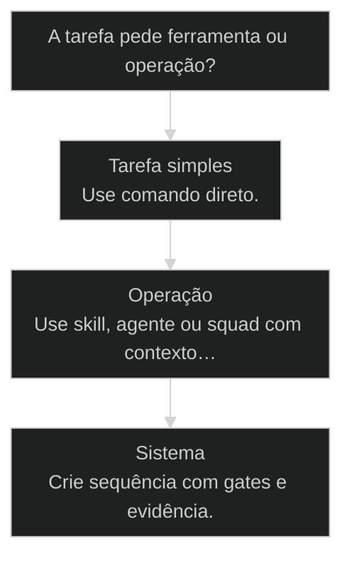
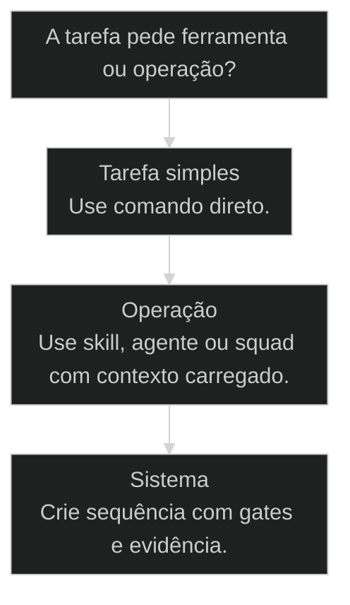
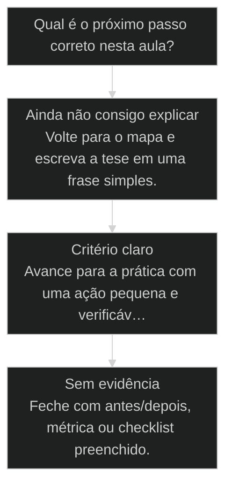

# AIOX não é ferramenta

← [[26-nao-delegar-pensar|Nao delegue o pensar: repertorio contra zumbi]] · ↑ [[modulos/Módulo 1 - Sistema AIOX|M1]] · ⌂ [[Cursos/AIOX Advanced/README|Curso]] · → [[03-claude-md-leis-da-fisica|CLAUDE.md é a lei da física do seu projeto]]

## Conceitos

- [[Software House no Computador]]

## Mapa desta aula

Decisão-chave da aula — A tarefa pede ferramenta ou operação?



> Leia o diagrama antes do texto longo. Depois volte e confira.

> AIOX é uma software house premium dentro do seu computador. O jogo muda quando você para de usar e começa a conduzir, como o Rodrigo fez na Disney: entregou um mês de consultoria em 1h15.

**Objetivos de aprendizagem:**
- Entender por que AIOX é uma software house operável dentro do seu computador, e não uma ferramenta de desenvolvimento. _(understand)_
- Aplicar a postura de condutor de AI: direcionar contexto, pesquisa, perfil e dores em vez de pedir 'AIOX faça o que você quer'. _(apply)_
- Identificar quando uma operação precisa de mais agentes especializados sem cair em vaidade de volume. _(understand)_
- Avaliar se a saída virou sistema reutilizável ou se você ainda está usando AIOX como ferramenta. _(evaluate)_

---

## A bolha da bolha da bolha

*Mindset · AIOX não é ferramenta*

Tem uma frase que o Rodrigo soltou pra mim quando voltou dos Estados Unidos e que ficou ecoando: "a gente está numa bolha da bolha da bolha". Ele tinha acabado de passar por Vale do Silício, sentou com chefe de design da Apple, com fundadores, com gente que vive do que tá vindo aí. E mesmo assim, quando ele olhou pro que a gente tá construindo aqui no AIOX, sentou e falou: "se vocês vieram aprender uma ferramenta de desenvolvimento, podem ir embora, porque não é disso que a gente tá falando".

Essa aula existe pra calibrar uma coisa antes de qualquer comando, qualquer agente, qualquer workflow. AIOX não é uma ferramenta. Ferramenta é o Cloud Code rodando embaixo. AIOX é uma software house premium que mora dentro do seu computador. E o jogo muda completamente quando você para de tentar usar e começa a conduzir.

- **8**: das 14 aulas repetem esta tese
- **11+**: agentes que podem virar equipe
- **1h15**: consultoria de um mês no caso Rodrigo

- **status**: aiox advanced
- **meta**: operador=alan_nicolas
- **meta**: aula=02 mindset
- **meta**: caso=rodrigo-faerman
- **ready**: ready to conduct

**Legenda de cores**

O que cada cor sinaliza nesta aula

- **Dor de ferramenta** (pain): comportamento de quem trata AIOX como caixa de pedido
- **Mudança de mindset** (insight): percepção que destrava o operador
- **Movimento de condução** (action): ação concreta que o operador faz no fluxo real
- **Prova de entrega** (bench): evidência de que a condução produziu sistema, não só resposta

---

## Comece pela tese, não pelo comando

Antes de qualquer tecla, fixe o movimento mental. Primeiro você para de procurar botão. Depois enxerga a equipe que mora no AIOX. Aí conduz a execução com contexto. E só mede pela entrega, nunca pelo prompt bonito. O resto da aula é esse caminho em detalhe, com o caso do Rodrigo no meio como prova.

**Como ler esta aula**

1. **Pare de procurar botão**: O erro inicial é achar que AIOX é mais uma ferramenta para apertar e esperar resposta.
2. **Enxergue a equipe**: O sistema funciona como software house: contexto, papéis, especialistas, validação e entrega.
3. **Conduza a execução**: Você alimenta mercado, perfil, dores, restrições e objetivo. O agente executa dentro dessa direção.
4. **Meça pela entrega**: A prova não é o prompt bonito. É consultoria, PRD, diagrama, decisão ou sistema entregue com clareza.

- **Objetivos da aula** (Entender por que AIOX é software house, não ferramenta.; Aplicar a postura de condutor de AI.; Identificar quando criar mais agentes sem vaidade de volume.; Avaliar se a saída virou sistema reutilizável.)
- **Onde você está?** (Acabou de instalar: foque Tese e Software House.; Já roda comandos: foque Condução e o caso Rodrigo.; Vai operar pra cliente: foque Escala e Prática.)
- **Leitura prática**: Em cada bloco procure uma resposta: qual era o pedido solto, qual contexto entrou, qual agente executou e qual prova mostrou que virou sistema.

---

## A tese-mãe do curso inteiro

Essa não é uma frase de efeito de uma aula só. É a tese que volta em oito das catorze aulas do curso, com framings diferentes. Numa, é "valida com o [[Squad]] antes de codar o app". Noutra, é "comece pelo Squad, não pelo App". Na turma 2, o Adriano repete três vezes em menos de trinta linhas: "AIOX não é ferramenta, é gestão e processo". Sempre o mesmo eixo: o valor não está na ferramenta embaixo, está no processo que você conduz por cima dela.

> **Em uma frase**: Ferramenta executa tarefa. AIOX gerencia processo. Quem confunde os dois extrai cinco por cento do que tem na mão e ainda reclama que a IA não entrega.

**Quem trata como ferramenta**
- Abre o terminal e pede a coisa pronta.
- Mede sucesso pela velocidade da resposta.
- Reclama que a IA alucina e entrega genérico.
- Acha que mais um prompt esperto resolve.

**Quem trata como software house**
- Carrega contexto, perfil e dor antes de pedir.
- Mede sucesso pelo sistema que ficou reutilizável.
- Direciona a pesquisa e a comparação antes de construir.
- Cria agente quando existe gargalo, não quando falta prompt.

> **Pedro Valério (co-founder AIOX)**: Não é sobre ter a ferramenta mais nova. É sobre ter o processo certo rodando dentro dela. A mesma ferramenta na mão de quem conduz e na mão de quem só pede gera dois resultados que nem parecem do mesmo software.

---

## Uma software house premium dentro do seu computador

Tenta visualizar comigo. Software house, em São Paulo, é uma empresa de oitenta, noventa, duzentos programadores. Tem processo, tem QA, tem arquiteto, tem PM, tem gente cuidando de cada etapa. É isso que vocês estão recebendo aqui. Uma software house premium, com todas as boas práticas que Google, Meta e OpenAI executam quando vão desenvolver software, e que muita gente, por preguiça, nem executa cem por cento.

AIOX permite que você tenha uma software house sua dentro do seu computador. Múltiplos funcionários. E esses funcionários podem se multiplicar várias vezes. Toda hora a galera do meu time me manda mensagem: "Alan, criei mais um squad, criei mais um agente". A operação cresce sozinha quando o mindset tá certo.

E o resultado prático disso é o que o Thiago tem chamado de [[Software House no Computador|impressora de sistemas]]. Antes era impressora de dinheiro na mochila. Agora vocês carregam uma impressora de sistemas: em pouquíssimo tempo, com qualidade de quem paga meio milhão de dólar por desenvolvedor sênior. Não é metáfora. É exatamente isso.

**a mudança mental que destrava o AIOX**

1. **Ferramenta**: Você pede uma tarefa solta e espera que o modelo adivinhe o resto.
2. **Operação**: Você define objetivo, contexto, restrição, perfil e evidência de qualidade.
3. **Equipe**: Agentes especializados entram com papéis diferentes: pesquisa, arquitetura, execução, QA, DevOps.
4. **Sistema**: A saída deixa de ser resposta e vira processo reutilizável: PRD, Story, squad, workflow ou produto.

- **O que muda no operador**: Você deixa de pedir 'faz aí' e passa a montar um canteiro de trabalho: briefing, contexto, agentes e critérios.
- **O que muda na saída**: A resposta solta vira artefato: mapa mental, PRD, diagrama, sequência de execução, validação e handoff.
- **O que muda na escala**: Se uma operação precisa de mais especialistas, você cria agentes. Mas só cria quando existe gargalo real.

---

## Quem trabalha nessa empresa que mora no seu HD

Software house de verdade não é um amontoado de programadores. Tem papéis. O AIOX original já vem com onze agentes, e cada um existe por um motivo. Não é decoração. É a divisão de trabalho que faz a entrega ter qualidade de empresa premium em vez de output solto de chatbot.

**Os papéis que já vêm na caixa**

Onze agentes nativos, cada um com função clara. Você não inventa esses papéis: você os conduz.

- **Architect**: Decide arquitetura e stack antes de qualquer linha de código.
- **PM / PO**: Transforma a dor em PRD, story e critério de aceitação.
- **Dev**: Implementa dentro da direção, sem inflar escopo.
- **QA**: Valida contra critério, não contra sensação de pronto.
- **DevOps**: Cuida de push, deploy e o que vai pra produção.
- **Research**: Compara com referências fortes antes de construir.

> **Adriano de Marqui (host T2)**: Quando você entende que tem uma empresa inteira ali dentro, para de pedir favor pra um robô e começa a distribuir trabalho pra um time. É outra postura, e ela muda o resultado antes de mudar qualquer comando.

---

## Da impressora de dinheiro à impressora de sistemas

O Thiago Finch tinha uma frase: impressora de dinheiro na mochila. A ideia era que, com a habilidade certa, você imprimia faturamento de onde estivesse. A virada do AIOX é que agora o que você carrega não é a impressora de dinheiro, é a impressora de sistemas. Você senta com um notebook em qualquer lugar e produz PRD, diagrama, pesquisa de mercado, squad e produto com qualidade de quem paga caro por sênior. O dinheiro vira consequência do sistema, não o ponto de partida.

- **Software house humana**: alto (80 a 200 programadores, processo formal, meses de prazo.)
- **Dev sênior dedicado**: caro (qualidade de quem custa até meio milhão de dólar por ano.)
- **AIOX conduzido**: 1h15 (mesma qualidade de processo, fração do tempo e do custo.)

> **A prova é a entrega, não a promessa**: Toda vez que essa tese aparece sem caso, é hype. Por isso ela vem grudada no caso do Rodrigo logo a seguir: um mês de consultoria humana entregue em uma hora e quinze, conduzido de dentro da Disney.

---

## Conduzir > pedir

O segredo que separa quem extrai cinco por cento do AIOX de quem extrai cem por cento cabe em uma palavra: condução. A maior parte das pessoas trata AI como caixa de pedido: joga uma instrução solta e espera milagre. Quem conduz faz o contrário: entrega contexto, perfil, dores, mercado, hipótese, restrição. AIOX não inventa nada. AIOX executa o que você direciona com profundidade.

Por isso a comparação que eu mais repito: o Squad Creator que eu mandei pra Fran é como um porta-aviões. Se você pede pra ele fazer um aviãozinho de papel, a culpa não é dele. Você usou um porta-aviões pra dobrar papel. A mesma lógica vale pro AIOX inteiro: ferramenta poderosa exige direção compatível com o tamanho dela.

**Pedir como usuário de ferramenta**
- AIOX, cria uma apresentação boa.
- Faz um app parecido com esse aqui.
- Pesquisa o mercado e me diz o que acha.
- Usa o agente mais poderoso para qualquer coisa.

**Conduzir como dono da software house**
- Aqui está o público, a dor, o contexto e a decisão que preciso tomar.
- Compare contra estes exemplos e extraia padrões antes de construir.
- Use a skill certa para este tipo de tarefa e explique o critério.
- Valide a saída contra evidência, não contra sensação.

- **1. Operador**: Você deixa de pedir e passa a montar um canteiro de trabalho. Briefing, contexto, agentes e critérios entram antes do primeiro comando. [WHO, postura]
- **2. Saída**: A resposta solta vira artefato. Mapa mental, PRD, diagrama, sequência de execução, validação e handoff. [WHAT, artefato]
- **3. Escala**: Se a operação precisa de mais especialistas, você cria agentes. Só cria quando existe gargalo real, nunca por vaidade de volume. [HOW MANY, gargalo]

---

## O que entra antes do comando

Conduzir não é escrever um prompt mais longo. É carregar as cinco coisas que o agente não tem como adivinhar: contexto de mercado, perfil de quem vai receber, a dor real, a restrição e o critério de pronto. Falta uma dessas e o porta-aviões dobra papel.

**As cinco entradas da condução**

Antes de pedir execução, você entrega isto. Cada uma fecha uma porta por onde a IA inventaria.

- C **Contexto de mercado**: Qual o setor, o que já existe, qual o padrão alto que você quer bater.
- P **Perfil de quem recebe**: Quem é o cliente ou usuário, o que ele valoriza, onde ele trava.
- D **Dor real**: O problema concreto, com número quando der, não a versão genérica.
- R **Restrição**: Prazo, stack, orçamento, o que não pode mudar.
- ✓ **Critério de pronto**: Como você vai saber que a saída resolveu, antes de declarar pronto.

- **Pedido solto não tem contexto** -> Por isso volta genérico: o agente preencheu os buracos com o que ele achou.
- **Condução fecha os buracos** -> Quando as cinco entradas estão lá, o agente executa dentro da sua direção em vez de inventar.
- **Critério separa pronto de validado** -> Sem critério, qualquer saída parece pronta. Com critério, só fecha quando provou.

---

## Ferramenta, operação ou sistema?

Nem toda tarefa merece o porta-aviões. Parte é comando direto mesmo. O erro é nos dois extremos: usar canhão pra matar mosquito, ou tratar uma operação complexa como se fosse um pedido de uma linha. Antes de agir, classifique.

**Árvore de decisão**
_Se a resposta depende de contexto, papéis e qualidade, trate como operação._



- **Tarefa simples** — Tem começo, fim e critério claro em um comando.
  → _Use comando direto._
  Ex.: Renomear um arquivo, resumir um trecho, ajustar uma frase.
- **Operação** — Precisa entender mercado, comparar referências, criar artefato e validar.
  → _Use skill, agente ou squad com contexto carregado._
  Ex.: Criar squad, montar PRD, desenhar fluxo, converter benchmark em produto.
- **Sistema** — A saída precisa virar processo reutilizável por outras pessoas.
  → _Crie sequência com gates e evidência._
  Ex.: SOP, workflow, curso, dashboard, engine, governança.

**Gate:** A saída ficou reutilizável? — _Se não ficou, você ainda está usando como ferramenta, não como software house._

> **Pausa para checagem**: Antes de rodar qualquer comando, responda em voz alta: isto é tarefa, operação ou sistema? Errar a classificação gera processo bonito e resultado fraco.

---

## Disney, uma hora e quinze, e um mês de consultoria entregue

Esse é o caso que prova a tese. Não é um exemplo inventado pra ilustrar: aconteceu, o Rodrigo me contou em primeira mão, e ele bate exatamente no ponto que essa aula inteira está defendendo. A ferramenta não fez. A condução fez.

### Caso: Rodrigo na Disney: 1h15 vs 10 mil dólares + 3 pessoas + 1 mês

"Eu fui pra Disney com a minha filha, mas obviamente a gente não desliga." Rodrigo Faerman estava com um cliente buscando estruturar o operacional da empresa. Iam contratar consultoria de dez mil dólares pra três pessoas trabalharem durante o mês.

- Começou como: Cliente prestes a contratar consultoria de US$10k, 3 pessoas, 1 mês de trabalho.
- Virou: Rodrigo abriu um computador novo na Disney, instalou Cloud Code + AIOX e em uma hora e quinze minutos entregou o trabalho de um mês inteiro.
- Prova: Mapas mentais, PRDs, diagramas de funcionamento do negócio e pesquisa de best practices da indústria, chegando exatamente nas mesmas conclusões que o cliente e o sócio tinham fechado na semana anterior.
- Lição: Não foi a ferramenta que fez. Foi a condução. Rodrigo direcionou mercado, perfil de cliente e dores antes de mandar AIOX executar.

---

## O caso Rodrigo em linguagem de operação

Tira o brilho do número por um segundo e olha a mecânica. O que o Rodrigo fez não foi mágica nem sorte de ferramenta. Foi exatamente a sequência que essa aula descreve: dor real, contexto carregado, execução orquestrada, prova batendo com a realidade.

**o caso Rodrigo decomposto**

1. **Dor real**: Cliente queria estruturar o operacional e estava pronto para comprar consultoria.
2. **Contexto carregado**: Mercado, perfil, dores e objetivo entraram antes da execução.
3. **AIOX executa**: Pesquisa, best practices, PRDs, mapas mentais e diagramas.
4. **Prova**: A saída bateu com a decisão que o cliente e o sócio tinham acabado de tomar.

- **O que o Rodrigo NÃO fez**: Não abriu o terminal e pediu 'monta o operacional desse cliente'. Não esperou o modelo adivinhar o mercado. Não mediu sucesso pela velocidade da resposta. Tudo isso seria tratar o AIOX como ferramenta. Players: sem 'faça o que você quer', sem pedido solto, sem medir pelo prompt.
- **O que ele fez**: Carregou mercado, perfil e dores. Escolheu o agente que orquestra pesquisa. Deixou rodar best practices da indústria. Validou a saída contra a decisão estratégica real do cliente. Isso é conduzir uma software house. Players: contexto antes do comando, agente certo pra tarefa, prova contra a realidade.

---

## Quarenta agentes não é melhor que onze

Tem um detalhe importante de quantidade. AIOX original tem onze agentes. Pode ser que sua operação precise de quarenta: eu criei vinte e oito copywriters aqui dentro. Mas isso não é vaidade. Não é sobre volume. É sobre a sua operação ter especialistas suficientes pros gargalos reais. Volume sem condução vira ruído. Mais agente que você não conduz é mais lugar pra coisa dar errado, não mais capacidade.

- **Criar por gargalo**: Existe uma fase da sua operação que trava de verdade. Você cria o agente que destrava aquela fase específica.
- **Criar por padrão repetido**: A mesma tarefa especializada aparece várias vezes. Vira candidata a agente próprio, como os 28 copywriters.
- **Criar por vaidade**: Você cria agente pra dizer que tem muitos. Volume sem condução é peso morto, não capacidade.

**Colunas:** Sinal | Pergunta | Sinal saudável | Sinal de risco

- Origem do agente: Por que esse agente existe? | Existe um gargalo ou padrão repetido real. | Existe pra inflar o número de agentes.
- Uso do agente: Ele é conduzido com contexto? | Recebe briefing, perfil e critério antes de executar. | Recebe pedido solto e devolve genérico.
- Saída do agente: O que ele produz fica reutilizável? | Vira artefato, sistema ou processo. | Vira resposta solta que ninguém reaproveita.

---

## O que custa caro não é processamento

Andrew Ng repete isso na palestra dele: a coisa que mais o indigna é ter que tirar da cabeça de jovem de vinte e cinco anos a mentalidade de escassez. "Não posso gastar token, não posso gastar em servidor". Duzentos dólares mudam completamente o jogo de vocês. O que custa caro hoje não é processamento. É continuar tratando porta-aviões como ferramenta de carpintaria.

- **gasto com economia**: Economizar token parece prudência.
- **volume com capacidade**: Mais agentes parece mais poder.
- **resposta rápida com entrega boa**: Velocidade da resposta parece sucesso.

> **Alan Nicolas**: Foda-se o preço do token. O que custa caro de verdade é a sua hora tratando uma software house premium como se fosse uma calculadora.

---

## O que muda a partir de agora

Antes de abrir o terminal hoje, internaliza três movimentos. Primeiro. Você não está aprendendo uma ferramenta de desenvolvimento. Está operando uma software house premium dentro da sua máquina, com onze, quarenta ou duzentos funcionários, dependendo da sua operação. Segundo. Você não pede, você conduz. Carrega mercado, perfil, dores e direção antes de qualquer comando. Terceiro. Se o resultado veio meia-boca, olha o tamanho da direção que você deu, não o tamanho do porta-aviões.

**Quando você tem uma dor de negócio**
Use quando o problema ainda está confuso e precisa virar direção executável.
- `descrever contexto`
- `pedir comparação`
- `extrair padrões`
- `definir artefato`
- `validar contra evidência`
- `Contexto`: Explique o mercado, o público, a dor e o que você já tentou.
- `Benchmark`: Peça para comparar com referências fortes antes de construir.
- `Artefato`: Escolha a saída certa: PRD, diagrama, SOP, Story, squad ou melhoria.
- `Gate`: Só considera pronto quando houver prova de que a saída resolve a dor.

> **Portão da aula**: Você entendeu quando para de perguntar qual botão apertar e começa a explicar qual equipe, contexto, evidência e decisão precisa conduzir.

---

## Caso benchmark: aplicar AIOX não é ferramenta em uma decisão real

Um segundo caso para tirar a aula do conceito isolado e mostrar como o operador transforma o princípio em decisão, execução e evidência.

- **O que mudou na operação**: A aula deixou de ser uma explicação e virou uma lente de decisão. O aluno sabe que sinal observar, qual rota escolher e que evidência precisa produzir. Players: sinal, rota, execução, evidência.
- **Por que isso eleva a qualidade**: O padrão espelha o [[Método S2S]]: capturar o sinal, estruturar o caminho, executar com limite e fechar com prova.

**Matriz de aplicação**

Use esta matriz quando a aula parecer clara, mas a ação ainda estiver vaga.

- **Sinal claro**: O aluno consegue nomear o que a aula ensina a observar.
- **Rota escolhida**: A próxima ação nasce de critério, não de vontade de testar ferramenta.
- **Risco visível**: O erro provável fica explícito antes de executar.
- **Prova mínima**: Existe uma evidência simples para dizer que avançou.

### Caso: Quando o conceito precisou virar critério de execução

O operador já tinha entendido a tese, mas ainda precisava decidir o próximo passo sem cair em improviso.

- Começou como: Conceito entendido em teoria, sem critério de aplicação na task real.
- Virou: Decisão roteada por sinais, riscos, evidências e próximo passo verificável.
- Prova: A saída passou a ter ação, dono, critério e evidência de fechamento.
- Lição: Aula de qualidade não termina em entendimento. Termina quando o aluno consegue agir com critério.

---

## Router de decisão da aula

O ponto em que AIOX não é ferramenta deixa de ser explicação e vira escolha operacional.

**Árvore de decisão**
_Não escolha comando antes de nomear o tipo de situação._



- **Ainda não consigo explicar** — O aluno repete a frase da aula, mas não consegue aplicar em exemplo próprio.
  → _Volte para o mapa e escreva a tese em uma frase simples._
- **Critério claro** — O aluno identifica sinal, risco e decisão antes da ferramenta.
  → _Avance para a prática com uma ação pequena e verificável._
- **Sem evidência** — A ação foi feita, mas não existe prova de melhoria ou decisão registrada.
  → _Feche com antes/depois, métrica ou checklist preenchido._

**Gate:** Você sabe qual rota seguir e como provar que avançou? — _Se a resposta ainda depende de opinião, volte uma etapa._

#### Entender o princípio
Quando a aula ainda parece uma tese abstrata.
1. **Nomear: escreva a tese em uma frase.
2. **Exemplo: traga um caso próprio pequeno.
3. **Risco: diga o erro que a aula evita.

#### Aplicar em uma task
Quando o critério está claro e falta execução.
1. **Escolher: defina a menor ação verificável.
2. **Executar: faça sem expandir escopo.
3. **Provar: registre o delta produzido.

#### Revisar a decisão
Quando a execução aconteceu, mas a evidência ficou fraca.
1. **Comparar: olhe antes e depois.
2. **Ajustar: corrija a menor falha.
3. **Fechar: só conclua com prova.

**Colunas:** Estado | Pergunta | Sinal saudável | Sinal de risco

- Entendimento: Consigo explicar sem copiar a aula? | frase própria e exemplo próprio | repetição bonita sem aplicação
- Decisão: Escolhi rota antes da ferramenta? | sinal e risco nomeados | comando escolhido por hábito
- Prova: Tenho evidência de avanço? | antes/depois ou checklist | sensação de que ficou melhor

---

## Processo operacional mínimo

A sequência mínima para aplicar AIOX não é ferramenta sem transformar a aula em teoria solta.

**Aula → Task → Evidência**
Rota curta para transformar o conceito em ação repetível.
- **Plan**: Nomeie o sinal da aula, o risco que ela evita e o artefato que será produzido.
- **Do**: Execute a menor ação que prova o conceito sem abrir novo escopo.
- **Check**: Compare a saída com o critério de aceite da aula.
- **Act**: Registre a regra aprendida e remova o que não será reutilizado.

**Aplicar com evidência**
Use quando a aula fizer sentido, mas a task ainda estiver sem formato.
- `sinal`
- `risco`
- `ação`
- `prova`
- `sinal`: O que esta aula me ensinou a perceber?
- `risco`: Que erro acontece se eu ignorar esse sinal?
- `ação`: Qual é a menor execução que testa o princípio?
- `prova`: Que evidência mostra que a decisão melhorou?

**Do conceito ao comportamento**

1. **Conceito**: entender a tese central da aula.
2. **Critério**: transformar a tese em pergunta de decisão.
3. **Ação**: executar a menor tarefa que prova avanço.
4. **Memória**: registrar o padrão para repetir depois.

---

## Prática: conduza antes de pedir

Converta um pedido solto em uma operação que o AIOX consegue executar melhor.

**Exemplo preenchido: estruturar o operacional de um cliente**

- **Pedido solto**: AIOX, monta o operacional desse cliente aqui pra mim.
- **Contexto**: Cliente é fundador de SaaS B2B, 8 pessoas, faturando R$200k/mês, sem PO, com retrabalho alto em entregas.
- **Evidência**: Comparar com 3 SaaS B2B do mesmo tamanho (Notion, Linear, Pipefy primeiros anos) e mapear o que eles tinham que esse cliente não tem.
- **Artefato**: PRD do operacional + diagrama de processos + lista priorizada de gaps a fechar nos primeiros 30 dias.
- **Critério de pronto**: Cliente lê o PRD e consegue dizer 'isso aqui já bate com o que eu e meu sócio decidimos' antes de ler a próxima página.

> **Teste rápido**: Se outra pessoa consegue pegar sua instrução e entender o contexto sem te perguntar nada, você começou a conduzir.

- 1. **Pedido solto**: Escreva uma frase que você normalmente mandaria para IA, do jeito preguiçoso mesmo.
- 2. **Contexto**: Adicione público, dor, objetivo, restrição e o que você já sabe sobre o problema.
- 3. **Evidência**: Diga qual referência, benchmark ou prova vai mostrar se a saída ficou boa.
- 4. **Artefato**: Escolha a saída: PRD, diagrama, checklist, Story, SOP, squad ou decisão.

---

## Bloco de código: instrução conduzida

A diferença entre pedir e conduzir precisa aparecer no prompt.

**Prompt base**
```text
objetivo: "O que precisa ser decidido ou produzido?"
contexto: "Público, dor, estágio atual e restrições."
evidência: "Qual referência ou dado mostra que ficou bom?"
artefato: "PRD | Story | checklist | SOP | diagrama | decisão"
critério: "Está pronto quando..."

```
*AIOX responde melhor quando recebe direção, não só vontade.*

> **Regra para alunos**: O comando não substitui o julgamento. Primeiro classifique a tarefa, depois carregue as cinco entradas, só então peça execução. Pular isso gera prompt bonito e resultado fraco.

- 1. **Copie o template**: Pegue o bloco abaixo e cole no início da sua próxima instrução ao AIOX.
- 2. **Preencha as 5 linhas**: Objetivo, contexto, evidência, artefato e critério. Não deixe nenhuma vazia.
- 3. **Compare**: Rode o pedido solto e o conduzido. Veja a diferença na saída antes de seguir.

---

## Vocabulário para parar de confundir

- **Gargalo**: Fase da operação que trava de verdade. É o único motivo legítimo pra criar um agente novo.
- **Artefato**: Saída reutilizável: PRD, Story, diagrama, SOP, squad. O oposto da resposta solta que ninguém reaproveita.
- **Validado**: Não é 'a IA respondeu'. É 'existe prova de que a saída resolve a dor', como o PRD do Rodrigo batendo com a decisão do cliente.

> **Fechamento**: A aula só pegou quando você troca a pergunta 'qual comando eu rodo?' pela pergunta 'qual contexto eu carrego e qual prova eu exijo?'. Aí parou de usar e começou a conduzir.

- **Ferramenta**: Coisa que você usa pra executar uma tarefa. Cloud Code, Cursor, Lovable. Substituível, comoditizado, e por si só não muda o jogo.
- **Software house (no seu computador)**: Organização operável de múltiplos agentes especializados que entrega com qualidade de empresa premium. É isso que o AIOX é. Múltiplos funcionários, processos, QA, possibilidade de se automultiplicar.
- **Conduzir AI**: Postura de carregar contexto, perfil, mercado, dores e restrição antes de pedir execução. Oposto de 'AIOX faça o que você quer'. Foi assim que Rodrigo entregou um mês de consultoria em 1h15.
- **Porta-aviões**: Metáfora pro Squad Creator e pro AIOX inteiro. Ferramenta gigante. Se você pede aviãozinho de papel, a culpa não é dela, a culpa é da direção que você deu.
- **Onze agentes (originais)**: Número de agentes do AIOX base. Sua operação pode precisar de quarenta, oitenta, duzentos. Importa direção, não vaidade de volume.
- **Impressora de sistemas**: Evolução da impressora de dinheiro do Thiago. Você senta com um notebook e produz PRD, diagrama, pesquisa, squad e produto com qualidade de sênior caro.

***


---

## Navegação

← [[26-nao-delegar-pensar|Nao delegue o pensar: repertorio contra zumbi]] · ↑ [[modulos/Módulo 1 - Sistema AIOX|M1]] · ⌂ [[Cursos/AIOX Advanced/README|Curso]] · → [[03-claude-md-leis-da-fisica|CLAUDE.md é a lei da física do seu projeto]]
