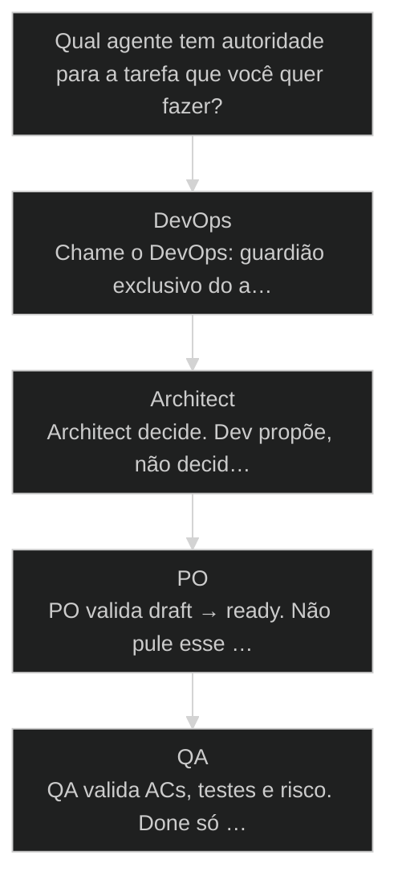
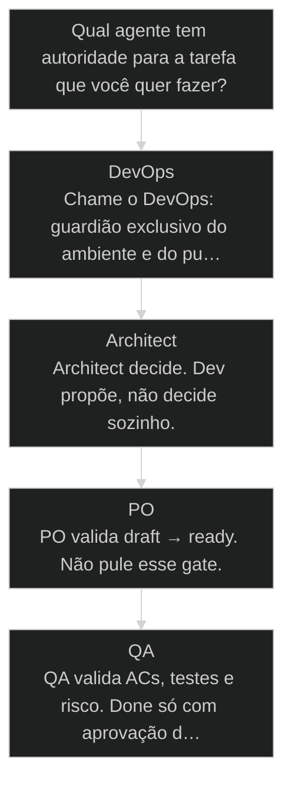

# Agentes Orbitais do AIOX

↑ [[modulos/Módulo 1 - Sistema AIOX|M1]] · ⌂ [[Cursos/AIOX Advanced/README|Curso]] · → [[45-doze-agentes-orbitais|Versão atual]]

> [!warning] Versão substituída
> Esta aula permanece como referência histórica. A rota atual continua em [[45-doze-agentes-orbitais]].


## Conceitos

- [[Agentes Orbitais]]
- [[Anatomia do Agente]]

## Mapa desta aula

Decisão-chave da aula — Qual agente tem autoridade para a tarefa que você quer fazer?



> Leia o diagrama antes do texto longo. Depois volte e confira.

> DevOps, PO, PM, Architect, Dev, QA: quem orbita o núcleo [[CLAUDE md|CLAUDE.md]] + CoreConfig + PRD, por que delegar é constitucional, e como o ciclo da Story passa o bastão de um agente para o próximo.

**Objetivos de aprendizagem:**
- Identificar o núcleo de gravidade do AIOX (CLAUDE.md, CoreConfig e PRD) e por que todo agente orbita em torno dele. _(remember)_
- Explicar a responsabilidade exclusiva de cada [[Agentes Orbitais|agente orbital]] (DevOps, PO, PM, Architect, Dev, QA) e por que delegar é um princípio constitucional. _(understand)_
- Aplicar o ciclo da Story (draft → ready → in_progress → in_review → done) chamando o agente certo em cada transição. _(apply)_
- Avaliar se uma operação tem dono claro: onze agentes com autoridade definida derrotam quarenta agentes confusos. _(evaluate)_

---

## Onze agentes giram em torno de um núcleo só

*M1 · Cluster Orbital · Por Alan Nicolas*

Antes de chamar qualquer agente, entenda o que ele orbita. O núcleo é CLAUDE.md + CoreConfig + PRD. Os agentes são planetas: cada um com função, gravidade e órbita própria.

Instalou AIOX, dá vontade de sair criando [[Squad|squad]], PO, agente. Erro clássico: pedreiro com marreta tentando subir prédio de doze andares. Faltou o ambiente. Onze agentes não é sobre volume, é sobre clareza de função.

- **11**: agentes originais
- **6**: órbitas principais
- **1**: núcleo de gravidade

- **status**: aiox advanced
- **meta**: operador=alan_nicolas
- **meta**: aula=m1 cluster-orbital
- **meta**: orbitas=6 principais
- **ready**: ready to orbit

**Legenda de cores**

O que cada cor sinaliza nesta aula

- **Núcleo de gravidade** (signal): CLAUDE.md, CoreConfig e PRD, o que toda órbita lê antes de responder
- **Lei da órbita** (insight): regra de autoridade exclusiva que separa um agente do outro
- **Execução do agente** (action): ato concreto que só o agente dono daquela órbita pode fazer
- **Gate de transição** (bench): portão que valida a passagem de um status da Story para o próximo
- **Erro de roteamento** (pain): chamar o agente errado, sobrepor função ou pular gate

**Como ler esta aula**

1. **Existe um núcleo**: CLAUDE.md + CoreConfig + PRD são a gravidade. Tudo orbita isso.
2. **Cada agente é uma órbita**: DevOps, PO, PM, Architect, Dev, QA: autoridade exclusiva, não redundância.
3. **Saber qual chamar é metade do trabalho**: Errar o agente é pedir o prédio pro pedreiro antes do canteiro existir.
4. **Volume não é o ponto**: Onze agentes claros derrotam quarenta confusos.

---

## Comece pelo movimento, não pelos nomes

Primeiro vem o movimento geral: existe um núcleo, os agentes orbitam, cada transição da Story tem dono. Os nomes técnicos entram depois que a lógica está clara.

- **Objetivos da aula** (Identificar o núcleo de gravidade do AIOX.; Explicar a autoridade exclusiva de cada agente.; Aplicar o ciclo da Story chamando o agente certo.; Avaliar se uma operação tem dono claro.)
- **Onde você está?** (Começando: foque Núcleo, Órbitas e a analogia do mestre de obras.; Já usa AIOX: foque Ciclo da Story e Roteamento.; Vai escalar: foque Volume vs Clareza e Métricas de saúde.)
- **Leitura prática**: Leia cada bloco procurando três respostas: qual agente tem autoridade, qual contexto ele puxa e qual transição ele move.

**O ritmo desta aula**

Cada cluster tem um objetivo, um portão de avanço e um recap com decisão concreta.

- M **Mapa primeiro**: Núcleo, órbitas e a imagem do mestre de obras antes de qualquer comando.
- 1 **Ciclo com portões**: Cada status da Story responde: posso avançar ou preciso devolver?
- 2 **Decisão antes da execução**: A órbita se decide antes de digitar. Errar o agente é o erro mais caro do começo.
- 3 **Recap com ação**: Cada cluster fecha com uma decisão de dois minutos, não com resumo passivo.

---

## O núcleo: CLAUDE.md + CoreConfig + PRD

Três arquivos ditam a gravidade do sistema. Sem eles coerentes, os agentes flutuam, alucinam, perdem contexto.

Pensa no AIOX como um planeta. Três arquivos no centro fazem a gravidade. Os agentes não são autônomos: cada um, ao ser chamado por barra, roda um greeting builder que puxa contexto desses três antes de responder. Coerentes, os agentes orbitam com previsibilidade. Quebrados, todos flutuam.

- **1. WHY: por que existe núcleo**: Sem gravidade comum, cada agente inventa contexto próprio. O núcleo evita onze versões diferentes da mesma verdade. [GRAVITY, shared truth]
- **2. WHAT: o que compõe o núcleo**: Três arquivos: CLAUDE.md (leis físicas), CoreConfig (regras sociais), PRD (escopo do projeto). Os três contam a mesma história. [FILES, 3 sources]
- **3. HOW: como o agente puxa**: Chamada por barra dispara greeting builder. O builder lê o núcleo antes de qualquer resposta. Chamada por arroba só carrega o arquivo do agente. [INVOKE, greeting builder]

- **CLAUDE.md: as leis da física**: Regras universais que valem pra tudo que roda dentro.
- **CoreConfig: as regras sociais**: Ferramentas ligadas, stack, [[CodeRabbit]] enable true ou false.
- **PRD: o mapa do projeto**: O que será construído, com qual stack, com qual objetivo.

**Como o agente puxa contexto**

1. **Chamada por barra**: Dispara o greeting builder do agente.
2. **Lê o núcleo**: Puxa CLAUDE.md + CoreConfig + PRD.
3. **Puxa o específico**: DevOps pega ambiente, PO pega backlog, Dev pega code standards.
4. **Só então responde**: Contexto carregado antes da primeira palavra.

---

## A analogia que destrava: pedreiro vs mestre de obras

Antes dos nomes técnicos, uma imagem concreta: por que DevOps vem antes de todo mundo.

Um aluno chamado José Carlos desenhou no whiteboard a melhor analogia da aula. "Quando a gente instala AIOX, quer sair criando squad, criando PO. Mas é como pedreiro com marreta e carrinho de mão tentando subir prédio de doze andares. Faltou o ambiente."

DevOps é o mestre de obras. Antes de subir o prédio, ele analisa o terreno, prepara o canteiro, traz andaime, monta elevador de carga. No AIOX isso vira o bootstrap: o DevOps escaneia teu computador, configura tudo, e só aí libera os outros pra trabalhar. PO, PM, Architect, Dev, QA são os pedreiros especialistas. Sem o canteiro montado primeiro, nenhum sobe um andar.

**Do terreno vazio ao primeiro andar**

1. **Terreno vazio**: Computador recém-instalado, nada configurado.
2. **Mestre de obras chega**: Você chama o DevOps pro environment bootstrap.
3. **Canteiro montado**: Node, Python, Git, CodeRabbit, MCPs prontos.
4. **Pedreiros liberados**: PO, PM, Architect, Dev, QA sobem o prédio andar por andar.

> **Por que a analogia entra aqui**: Boa didática troca nomenclatura por imagem concreta antes de voltar ao processo. Quando a imagem do canteiro entra, o aluno para de tratar DevOps como detalhe técnico e passa a ver ordem de operação.

---

## As seis órbitas principais

DevOps, PO, PM, Architect, Dev, QA: cada um com responsabilidade exclusiva. Saber qual chamar é metade do trabalho.

Cada agente é uma órbita com autoridade exclusiva. Não é redundância, é divisão de trabalho desenhada por quem já quebrou a cabeça antes.

#### DevOps
Mestre de obras: prepara o terreno, libera os outros
1. **Environment bootstrap: Escaneia o computador, instala Node, Python, Git, CodeRabbit, MCPs.
2. **Gestão de ambientes: Cuida de local, staging e production.
3. **Push, PR, CI/CD: Toda subida pro GitHub passa por ele: autoridade exclusiva de push.
4. **MCP setup: Configura os MCPs que dão superpoderes aos outros agentes.

#### PO: Product Owner
Bate o draft contra template e épico antes do Dev tocar
1. **Validate Story Draft: Compara a Story com o template canônico e o readme do épico.
2. **Decisão de prosseguir: Passou, libera pro Dev. Não passou, devolve pra reescrever.
3. **Guarda do backlog: Sabe o que tá pronto, em revisão ou precisa de retrabalho.

#### PM: Product Manager
Converte briefing em PRD, PRD em épicos
1. **Cria o PRD: Do briefing nasce o documento que dita objetivos, stack e escopo.
2. **Quebra em épicos: Do PRD nascem épicos; de cada épico nascem Stories.
3. **Mantém coerência: Mudou algo estrutural, ele dispara análise de impacto no PRD.

#### Architect
Dev propõe, Architect decide
1. **Document project: Em [[Brownfield Discovery|brownfield]], gera o architecture.md pro analista e pro PM.
2. **Decisões de stack: Stack, banco, arquitetura: autoridade exclusiva dele.
3. **Review crítica: Valida contra ADRs e a arquitetura do PRD antes do push.

#### Dev
Executa a Story em três modos
1. **Modo yolo: Autônomo, sem perguntar. Pra Story bem definida em local seguro.
2. **Modo interactive: Balanceado e educacional. Padrão pra quem aprende o sistema.
3. **Modo preflight: Lê a Story inteira e pergunta antes de começar. Pra Story crítica.
4. **Self-healing CodeRabbit: Lint, types, segurança corrigidos antes de finalizar. Não é opcional.

#### QA
Aprovação técnica final antes do deploy
1. **Acceptance Criteria: Valida cada AC. Falhou, devolve pra fix com finding registrado.
2. **Testes e cobertura: Unitário, integração e contrato passam. Cobertura mínima respeitada.
3. **Risk escalation: Risco de segurança ou regressão escala antes do push.

---

## Quem decide o quê: tabela de autoridade

A fronteira de autoridade é literal, não retórica. Quando você não sabe quem chama, esta tabela responde.

**Colunas:** Órbita | Decisão exclusiva | Quem só propõe | Gate dela

- DevOps: Quem sobe código e prepara ambiente? | Só DevOps faz push, PR, deploy e bootstrap. | Qualquer agente subindo código sem gate.
- Architect: Quem decide stack, banco e arquitetura? | Architect decide; Dev propõe via ADR. | Dev escolhendo banco sozinho no meio da Story.
- PO: Quem libera a Story pro Dev? | PO valida o draft contra template e épico. | Dev pegando draft cru sem validação.
- QA: Quem dá sign-off técnico? | QA valida ACs, testes e risco antes do done. | Story fechada porque o código compilou.

- **Architect com Dev**: Dev escreve o código que decide a tela.
- **PO com PM**: Os dois cuidam de Story e backlog.
- **QA com Dev**: Os dois lidam com teste.
- **done com deploy**: Os dois parecem o fim da linha.

---

## Delegar é constitucional, não cortesia

Quem propõe não é quem aprova. Essa separação é regra do sistema, enforçada por hook, não sugestão de boa convivência.

**Sem delegação (o que quebra)**
- Dev faz o próprio push direto pro main.
- Dev decide trocar Postgres por outro banco no meio da task.
- Story fechada por quem implementou, sem QA.
- Migration aplicada em produção por qualquer agente.

**Com delegação constitucional**
- Dev implementa, DevOps faz push: autoridade exclusiva.
- Dev propõe ADR, Architect decide a stack.
- QA dá o sign-off técnico antes do done.
- db-sage executa migration, DevOps promove pra produção.

> **A regra por trás**: No AIOX, separar quem propõe de quem aprova não é educação, é arquitetura. Só DevOps faz push. Só Architect decide stack. Só QA assina o sign-off. Quando a mesma órbita propõe e aprova, o gate vira teatro e o erro passa.

---

## O ciclo da Story: draft → done

Toda Story é uma entidade com status próprios. Cada transição tem um dono. Pular etapa é abrir buraco; trocar a ordem é gerar retrabalho.

Tudo no AIOX é entidade: Story, épico, agente, task, e toda entidade tem ciclo. O da Story é o coração do desenvolvimento. A etapa que muita gente pula é o PO validar o draft antes do Dev pegar. Eu pulava. Hoje não pulo mais.

**Status da Story e quem atende cada transição**

1. **draft**: @sm cria via create-next-story a partir do épico aberto.
2. **ready**: @po valida o draft (Validate Story Draft) e move para ready. Gate crítico antes do Dev pegar.
3. **in_progress**: @dev pega a Story ready e implementa em yolo, interactive ou preflight.
4. **in_review**: @qa move para in review, roda [[Quality Gate]]s + CodeRabbit e faz sign-off técnico.
5. **done**: @qa aprova → done. Done fecha o ciclo da Story, não é deploy.
6. **deploy (ciclo separado)**: @devops cria PR, roda CodeRabbit, executa CI/CD e faz merge. É outro ciclo, fora do status da Story.

- **Status não é etiqueta, é contrato** -> Cada status diz quem é o dono agora e o que precisa acontecer pra avançar.
- **Cada seta tem um gate** -> draft → ready só passa com validação do PO. in_review → done só passa com sign-off do QA.
- **Pular o PO é o buraco mais comum** -> Dev pega draft cru, implementa errado, QA reprova, retrabalho. O gate do PO custa minutos e economiza horas.

### Caso: José Carlos encontrou a analogia certa

A imagem do mestre de obras fez a turma entender por que DevOps vem antes dos outros agentes.

- Começou como: Confusão sobre qual agente chamar primeiro.
- Virou: Uma metáfora operacional: canteiro antes do prédio.
- Prova: Quando a analogia entra, o aluno para de tratar DevOps como detalhe técnico.
- Lição: Boa didática troca nomenclatura por imagem concreta antes de voltar ao processo.

---

## O ciclo como linha de produção

Pense no ciclo da Story como uma SOP de quatro fases. Cada fase tem um dono e um critério de saída.

**Story: do épico ao done**
A rota canônica que toda Story percorre, com o dono de cada fase.
- **Plan**: @sm cria o draft do épico aberto. @po valida contra template e move pra ready.
- **Do**: @dev implementa a Story ready no modo certo (yolo, interactive, preflight) com self-healing CodeRabbit.
- **Check**: @qa roda Quality Gates, valida ACs, testes e risco, e dá o sign-off técnico → done.
- **Act**: @devops abre PR, roda CI/CD e faz merge. Deploy é ciclo separado, com autoridade exclusiva.

**Deploy: o ciclo do DevOps**
Quando a Story está done, o deploy é outra órbita, não uma continuação automática.
- **PR**: @devops cria o Pull Request a partir da branch da Story.
- **Gate**: CodeRabbit roda no PR; findings viram fix antes do merge.
- **CI/CD**: Pipeline de build, teste e deploy executa em staging e produção.
- **Merge**: @devops faz o merge. Só ele tem essa autoridade.

> **Done não é deploy**: O erro mais comum de quem está começando: achar que done coloca em produção. Done fecha o ciclo da Story (sign-off do QA). Deploy é um ciclo separado, do DevOps. Misturar os dois é pular gate de qualidade.

---

## As órbitas em casos reais do AIOX

Dois casos do próprio repositório mostram a divisão de autoridade funcionando: uma migração de banco e uma subida de código bloqueada por gate.

- **O que os dois casos têm em comum**: Em ambos, a tarefa parecia pertencer a uma órbita só (o Dev), mas a autoridade real estava em outra. Roteamento por autoridade, não por proximidade, é o que separa operação madura de improviso. Players: Architect, db-sage, Dev, QA, DevOps.
- **Onde o gate vive**: Migração de banco e push de código têm hooks de autoridade enforçados no AIOX platform. O gate não depende de o operador lembrar: enforce-migration-authority e enforce-git-push-authority barram a operação errada.

### Caso: Migrar banco para Supabase: quatro órbitas, uma migração

Quando a tarefa parece código, mas é decisão de arquitetura com dono específico.

- Começou como: Pedido genérico: migrar Postgres self-hosted para Supabase.
- Virou: Cadeia de autoridade: Architect decide, db-sage executa, Dev implementa, DevOps promove.
- Prova: Nenhuma órbita decidiu fora da sua autoridade. Zero downtime documentado.
- Lição: Tarefa de banco não é tarefa de código. O dono é o Architect, não o Dev.

### Caso: Push bloqueado: o gate de autoridade em ação

Quando o Dev tenta subir código direto e o sistema diz não.

- Começou como: Dev terminou a Story e tentou fazer git push direto.
- Virou: Push bloqueado pelo hook de autoridade; tarefa delegada ao DevOps.
- Prova: enforce-git-push-authority.sh barrou a operação; só @devops sobe código.
- Lição: Autoridade exclusiva não é convenção, é hook enforçado.

---

## Volume de agentes não é o ponto

Onze agentes bem definidos derrotam quarenta agentes confusos. O critério é necessidade, não sofisticação.

Eu criei vinte e oito copywriters aqui dentro porque minha operação precisava. Mas o critério foi necessidade, não volume. Mais agente sem responsabilidade exclusiva é mais confusão, não mais capacidade.

**O que volume de agentes NÃO resolve**
- Sobreposição de função: dois agentes brigando pela mesma decisão.
- Contexto disperso: ninguém é dono claro da transição.
- Push sem gate: qualquer um sobe código, ninguém valida.
- Sofisticação de fachada: quarenta agentes pra parecer maduro.

**O que clareza de responsabilidade força**
- Autoridade exclusiva: só DevOps faz push, só Architect decide stack.
- Delegação constitucional: quem propõe não é quem aprova.
- Ciclo previsível: cada status da Story tem um único dono.
- Criar novo agente só com necessidade real provada.

- **Sem autoridade clara**: confusão (mais agentes, mais sobreposição de função.)
- **Com autoridade exclusiva**: capacidade (cada agente novo cobre um gap real.)
- **Volume puro**: fachada (número alto não prova maturidade.)

---

## Decida a órbita antes de digitar

O aluno usa este mapa para escolher a rota antes de chamar qualquer agente por impulso.

**Árvore de decisão**
_Antes de digitar, decida a órbita. Errar o agente é o erro mais caro do começo._



- **DevOps** — É preparar ambiente, push, PR ou deploy?
  → _Chame o DevOps: guardião exclusivo do ambiente e do push._
- **Architect** — É decisão de stack, banco ou arquitetura?
  → _Architect decide. Dev propõe, não decide sozinho._
- **PO** — É validar a Story antes do Dev pegar?
  → _PO valida draft → ready. Não pule esse gate._
- **QA** — É sign-off técnico antes do done?
  → _QA valida ACs, testes e risco. Done só com aprovação dele._

**Gate:** Dois agentes parecem igualmente donos da tarefa? — _Se parecem, você ainda não entendeu a fronteira de autoridade: releia a tabela de autoridade._

> **Teste rápido**: Se dois agentes parecem igualmente responsáveis, você ainda não entendeu a fronteira de autoridade. Volte para a tabela de autoridade e encontre a decisão exclusiva.

---

## O jeito de pensar por trás das órbitas

Antes de ser comando, roteamento é um estado mental. Estes são os modos que ficam ligados quando você opera bem o cluster orbital.

- **Órbita antes de comando**: Você decide qual agente tem autoridade antes de digitar. A rota vem primeiro, o comando depois.
- **Suspeita de sobreposição**: Quando dois agentes parecem donos, você desconfia: ainda não achou a fronteira de autoridade.
- **Delegação reflexa**: Você não tenta pular o gate. Quem propõe não é quem aprova, e isso já virou hábito.
- **Núcleo como verdade**: Antes de culpar o agente, você checa se o núcleo (CLAUDE.md, CoreConfig, PRD) está coerente.

- **Greeting builder primeiro**: Chamada por barra puxa o núcleo antes da resposta. Você confia no contexto carregado, não na memória.
- **Gate por transição**: Cada seta do ciclo da Story tem um portão. Você nomeia o gate antes de avançar.
- **Hook como rede**: Autoridade exclusiva é enforçada por hook. Quando você esquece, o sistema lembra.
- **Necessidade prova o agente**: Criar agente novo exige necessidade real demonstrada, não vontade de parecer elaborado.

---

## Métricas de saúde do cluster orbital

Sem telemetria, o cluster vira organograma bonito. Estas métricas separam órbita viva de agente morto.

**Colunas:** Métrica | Pergunta | Sinal saudável | Sinal de risco

- Roteamento correto: A tarefa foi pro agente com autoridade? | Dono claro escolhido antes de digitar. | Dois agentes brigando pela mesma decisão.
- Gate compliance: Cada transição da Story passou pelo dono? | PO valida draft, QA dá sign-off. | Draft cru chegando no Dev sem validação.
- Push discipline: Quem subiu o código? | Só DevOps, via hook de autoridade. | Push direto bloqueado ou burlado.
- Agent inflation: Os agentes novos cobrem gap real? | Cada agente tem responsabilidade exclusiva. | Agentes criados pra parecer maduro.

**Matriz de decisão rápida**

Em dúvida, escolha a célula que descreve sua tarefa.

- **Preparar ambiente**: DevOps. Bootstrap, MCPs, ambientes.
- **Subir código**: DevOps. Push, PR, CI/CD. Autoridade exclusiva.
- **Decidir banco**: Architect decide; db-sage executa migration.
- **Validar Story**: PO. Draft → ready, gate antes do Dev.
- **Implementar**: Dev. yolo, interactive ou preflight.
- **Sign-off técnico**: QA. ACs, testes, risco, done.

---

## Prática: escolha o agente certo

Pegue uma tarefa real e roteie para a órbita correta antes de executar.

**Sequência para rotear uma tarefa ao agente certo**
Use antes de digitar qualquer pedido: decida a órbita primeiro, execute depois.
- `descrever tarefa`
- `classificar domínio`
- `escolher órbita`
- `nomear o gate`
- `executar`
- `Descrever`: Escreva a tarefa em uma frase concreta.
- `Classificar`: Ambiente, produto, arquitetura, código, qualidade ou deploy?
- `Órbita`: Escolha o agente com autoridade exclusiva: DevOps, PO, PM, Architect, Dev ou QA.
- `Gate`: Diga qual portão fecha a tarefa antes de chamar de pronta.

**Exemplo preenchido: 'quero migrar o banco para Supabase'**

- **Tarefa**: Migrar Postgres self-hosted para Supabase no projeto X.
- **Domínio**: Arquitetura. Decisão de stack + banco + RLS policies. Não é só código.
- **Agente dono**: @architect decide a stack e a estratégia de migração. @db-sage executa as migrations. @devops faz o deploy. @dev não decide isso sozinho.
- **Sequência**: @architect propõe ADR -> @db-sage desenha schema + RLS -> @dev implementa client -> @qa valida -> @devops faz push e deploy.
- **Gate**: ADR aprovado + migration testada em staging + RLS validada + zero downtime documentado. Só depois @devops promove pra prod.

**Mapa de decisão copiável**
```yaml
tarefa:
  dominio: "ambiente | produto | arquitetura | codigo | qualidade | deploy"
  agente_dono: "@devops | @po | @pm | @architect | @dev | @qa"
  gate: "qual prova fecha a tarefa?"
  nao_chamar: "agentes que só opinam, mas não têm autoridade"

```
*Órbita boa reduz ruído: um dono, um gate, uma próxima ação.*

> **Teste rápido**: Se dois agentes parecem igualmente responsáveis, você ainda não entendeu a fronteira de autoridade.

- 1. **Tarefa**: Escreva uma tarefa que você quer fazer no AIOX esta semana, em uma frase concreta.
- 2. **Domínio**: Classifique o domínio: ambiente, produto, arquitetura, código, qualidade ou deploy.
- 3. **Agente**: Escolha o agente com autoridade exclusiva para esse domínio.
- 4. **Gate**: Diga qual gate precisa passar antes da tarefa ser considerada pronta.

---

## Glossário rápido

Sete termos pra fixar antes da próxima aula.

- **Agente orbital**: Agente que gira em torno do núcleo CLAUDE.md + CoreConfig + PRD e puxa contexto via greeting builder.
- **Núcleo de gravidade**: CLAUDE.md (leis), CoreConfig (regras do projeto) e PRD (escopo). Quebrou um, todos perdem direção.
- **Environment bootstrap**: Primeira tarefa do DevOps: escaneia o computador, valida Node, Python, Git, CodeRabbit.
- **Ciclo da Story**: draft → ready → in_progress → in_review → done. Cada transição tem um dono.
- **Greeting builder**: Script que roda quando o agente é chamado por barra. Puxa o mínimo de contexto antes da resposta.
- **Self-healing loop**: Ciclo do Dev com CodeRabbit CLI: lint, types e segurança corrigidos antes da Story sair de in_progress.
- **Autoridade exclusiva**: Decisão que pertence a uma órbita só, enforçada por hook. Só DevOps faz push, só Architect decide stack.

*(qa_pairs)*

> **Portão da aula**: Você entendeu quando consegue olhar para uma tarefa e dizer qual agente tem autoridade, qual contexto ele puxa e qual transição ele deve mover. Se ainda hesita entre dois agentes, volte à tabela de autoridade antes de seguir.

***


---

## Navegação

↑ [[modulos/Módulo 1 - Sistema AIOX|M1]] · ⌂ [[Cursos/AIOX Advanced/README|Curso]] · → [[45-doze-agentes-orbitais|Versão atual]]
