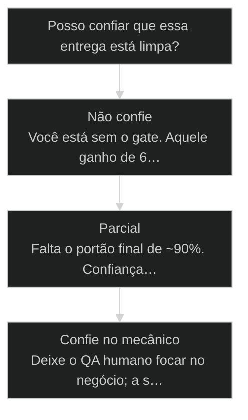
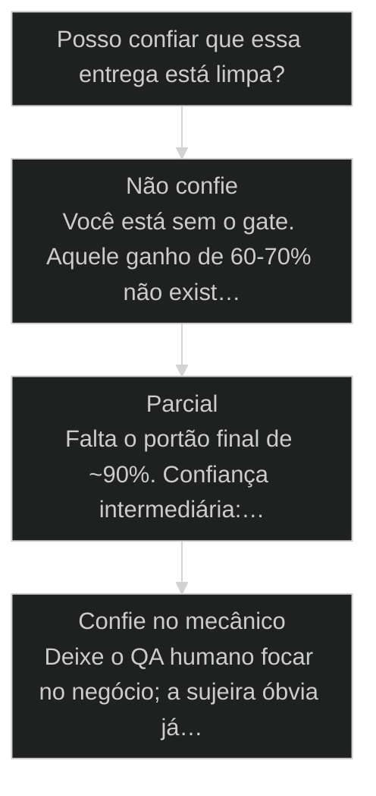

# Code Rabbit Boost

← [[49-apply-qa-fixes-loop|Apply QA Fixes Loop: QA volta para Dev sem perder estado]] · ↑ [[modulos/Módulo 3 - Ciclo SDC|M3]] · ⌂ [[Cursos/AIOX Advanced/README|Curso]] · → [[19-ciclo-do-repositorio|Ciclo do repositório: Detect Repo, GitHub, CodeRabbit, CI/CD]]

## Conceitos

- [[CodeRabbit]]
- [[Quality Gate]]

## Mapa desta aula

Decisão-chave da aula — Posso confiar que essa entrega está limpa?



> Leia o diagrama antes do texto longo. Depois volte e confira.

> Como o reviewer que entrou silencioso no seu bootstrap virou QA primário do AIOX

**Objetivos de aprendizagem:**
- Entender por que o Code Rabbit instalado no bootstrap adiciona uma camada de revisão de 60-70% ao código gerado pelo Claude Code sem você precisar comandar nada. _(understand)_
- Reconhecer como o Code Rabbit atua como QA primário automatizado, rodando antes mesmo do agente QA olhar o código. _(understand)_
- Verificar no seu próprio ambiente se o Code Rabbit foi ativado durante o bootstrap e se está integrado ao template de Story. _(apply)_

---

## Code Rabbit melhora o Claude Code

*Hook · Por que importa*

O detalhe que rolou no bootstrap e quase ninguém percebeu.

Provavelmente vocês viram que, durante o bootstrap, rolou ali alguma coisa
chamada Code Rabbit. Vocês instalaram o Code Rabbit. Esse detalhe importa
mais do que parece. É o tipo de coisa que entra silencioso e depois o
resultado aparece como se fosse melhora do Claude Code. Não é o modelo
sozinho. É Code Rabbit trabalhando atrás da cortina, revisando tudo antes
do QA olhar.

Vamos pensar que ninguém aqui é desenvolvedor, porque a maioria não é
mesmo. O que precisa ficar claro é o seguinte: quando você tem Code
Rabbit configurado, tudo que o Claude Code desenvolve ganha potência de
qualidade: sessenta, setenta por cento a mais só de ter ele ativado.

- **60-70%**: ganho percebido de qualidade
- **3**: passagens no pipeline
- **1**: reviewer rodando em silêncio

- **status**: aiox advanced
- **meta**: operador=alan_nicolas
- **meta**: aula=06 coderabbit
- **meta**: gates=3 (dev->qa->pr)
- **ready**: ready to review

**Legenda de cores**

O que cada cor sinaliza nesta aula

- **Bootstrap silencioso** (signal): instalação do reviewer que entra sem alarde
- **Filtro automático** (bench): gate de qualidade que roda antes do humano
- **Mudança de pipeline** (insight): agente QA passa a focar em aceite e negócio
- **Movimento concreto** (action): verificar enable, integrar Story, ativar self-healing
- **Risco de instalar e esquecer** (pain): ferramenta sem virar gate vira decoração

**Como ler esta aula**

1. **Entrou silencioso no bootstrap**: Você instalou o Code Rabbit e provavelmente nem percebeu.
2. **Vira QA primário**: Revisa o código antes do humano olhar. 60-70% mais qualidade, sem você comandar.
3. **Roda em três portões**: Dev, Review e PR: cada passagem aperta o filtro ([[Determinismo Progressivo|determinismo progressivo]]).
4. **Confirme que está ativo**: enable: true no core-config, ou todo esse ganho não existe no seu pipeline.

> **A estatística que precisa colar**: Com Code Rabbit configurado no projeto, todo código que o Claude Code
desenvolve ganha 60-70% mais qualidade, sem você precisar comandar,
revisar, ou virar desenvolvedor. É o efeito de ter um reviewer treinado
em todas as boas regras de desenvolvimento rodando em loop, em silêncio.

**o boost de qualidade não aparece como botão**

1. **Claude Code escreve**: A IA gera código rápido, mas velocidade sem revisão acumula sujeira.
2. **Code Rabbit lê**: O reviewer automatizado checa erro, padrão, vulnerabilidade e regressão provável.
3. **Self-healing corrige**: Parte dos problemas volta corrigida antes de virar trabalho humano.
4. **QA olha melhor**: O agente QA gasta energia em critério de aceite e lógica de negócio, não em sujeira óbvia.

---

## O que você sai sabendo no fim desta aula

*Mapa · Onde você está*

Antes de mergulhar, fixa o mapa. Esta aula tem quatro movimentos: primeiro
você entende o que é Code Rabbit sem precisar virar dev; depois vê como ele
entra como QA primário no pipeline AIOX, antes do agente QA; em seguida olha
o caso do bootstrap silencioso e o caso do PR no CI/CD; e fecha com a
verificação prática no seu próprio core-config. O destino é simples: parar
de achar que qualidade vem só do modelo e começar a perguntar por qual gate
o código passou.

- **Objetivos da aula** (Entender o ganho de 60-70% que o Code Rabbit adiciona em silêncio.; Reconhecer Code Rabbit como QA primário, antes do agente QA.; Mapear os três gates: Dev (~30%), Review (~60%), PR (~90%).; Verificar no próprio core-config se enable está true.)
- **Onde você está?** (Não é dev: foque na história e no efeito percebido.; Já usa AIOX: foque na progressão dos três gates.; Vai configurar: foque na prática e no setup-github.)
- **Leitura prática**: Em cada bloco, responda: por quantos portões esse código já passou?

**Os quatro movimentos**

1. **Conceito**: O que é Code Rabbit e por que self-healing muda o jogo.
2. **QA primário**: Como ele entra antes do agente QA no pipeline.
3. **Casos**: Bootstrap silencioso e o gate no PR via CI/CD.
4. **Prática**: Verificar enable no core-config do seu projeto.

---

## O que é Code Rabbit (sem virar desenvolvedor para entender)

*Conceito · O reviewer automatizado*

Code Rabbit é uma ferramenta criada com todas as boas regras de
desenvolvimento para fazer análise de código. Traduzindo, é um revisor
treinado em padrões de qualidade que olha o código que sai do Claude e
diz onde tem erro, vulnerabilidade, sujeira, ou uma vírgula faltando.

Para quem não é dev, é como ter um engenheiro sênior chato de bom
revisando cada linha. Não dorme, não cansa, não cobra hora extra. Ele
roda lint, unit test, checa segurança e vê se o código está realmente
fechando: exatamente o que quebra quando você desenvolve muito código
em quantidade com Claude Code.

E tem o detalhe que o Pedro sempre aponta: Code Rabbit tem self-healing.
Ou seja, ele mesmo corrige boa parte dos erros e vulnerabilidades. Não é
só apontar, é apontar e arrumar.

- **Code Rabbit**: Reviewer automatizado treinado em boas regras de desenvolvimento.
- **QA**: Agente que valida aceite, risco, comportamento e prontidão de entrega.
- **Self-healing**: Ciclo em que o próprio reviewer corrige parte dos achados.

- **Erro técnico óbvio**: Imports quebrados, lint, tipos, padrão ruim, vulnerabilidade simples.
- **Correção automática**: O loop tenta corrigir antes de passar para o próximo gate.
- **Revisão humana mais nobre**: Sobra atenção para perguntar: a Story realmente resolve o problema?

---

## As palavras que você precisa para conversar sobre o gate

*Conceito · Vocabulário*

Quem não é dev trava no vocabulário. Esses cinco termos aparecem o tempo
todo nesta aula. Fixa o significado de cada um e a conversa sobre qualidade
para de parecer língua estrangeira. Nenhum deles exige você escrever código,
só entender o que está sendo protegido.

- **Code Rabbit**: Reviewer automatizado treinado em boas regras de desenvolvimento. Lê o código que o Claude gerou e aponta erro, vulnerabilidade e sujeira.
- **Self-healing**: Capacidade do próprio reviewer de corrigir parte dos achados, não só apontá-los. Apontar e arrumar.
- **Quality gate**: [[Quality Gate|Portão de qualidade]] que o código atravessa antes de seguir. Cada gate aperta o filtro.
- **QA primário**: O Code Rabbit rodando antes do agente QA humano, fazendo a primeira limpeza automática.
- **Determinismo progressivo**: A cada portão, a abstração da LLM diminui e a confiança aumenta. O mesmo trabalho atravessa mais filtros.
- **Lint**: Checagem automática de estilo e erro óbvio de código. Imports quebrados, tipos, padrão ruim.

- **Não confia na tela** -> Operador de qualidade não declara pronto só porque a tela abriu.
- **Conta os portões** -> Pergunta por quantos gates o código passou antes de chamar de entregue.
- **Cobra correção, não relatório** -> Achado apontado e não resolvido não fecha o gate. Self-healing existe, use.

---

## Como Code Rabbit e o agente QA trabalham juntos

*Conceito · QA primário*

Aqui vai a parte que muda a forma de você pensar o pipeline. O AIOX usa
Code Rabbit como QA primário automatizado, antes mesmo do agente QA
olhar o código. Não é "ou um ou o outro". É um antes do outro.

Quando uma Story está sendo desenvolvida, o template de Story já tem a
integração de fazer teste com Code Rabbit dentro da tarefa do @dev. O
@qa, ao entrar no Review, aciona Code Rabbit de novo. No CI/CD, ele roda
mais uma vez no Pull Request. Cada quality gate aperta o filtro: é
determinismo progressivo tirando a abstração da LLM.

Tradução prática para quem não é dev: o agente QA do AIOX entra com
60-70% do trabalho sujo já feito pelo Code Rabbit. O tempo dele sobra
para olhar o que importa: se a Story cumpre os critérios de aceite, se
a lógica de negócio bate, se o entregável está pronto para deploy.

**A progressão de Code Rabbit no pipeline AIOX**

1. **@dev desenvolve**: Code Rabbit roda em self-heal durante o desenvolvimento. ~30% de acurácia já garantida antes de qualquer humano olhar.
2. **@qa faz Review**: Code Rabbit é acionado de novo no Review. Acurácia sobe para ~60%. Bugs óbvios já foram filtrados.
3. **CI/CD final**: Code Rabbit roda no repositório, no Pull Request, com self-healing automático. Acurácia chega em ~90% antes do merge.

- **1. Gate 1 - Dev loop**: Code Rabbit roda dentro do @dev em self-heal. Cobre lint, types e vulnerabilidade óbvia. ~30% de acurácia antes do humano olhar. [STAGE, @dev]
- **2. Gate 2 - QA Review**: Code Rabbit é acionado de novo no Review pelo @qa. Acurácia sobe para ~60%. QA gasta energia em aceite, não em sujeira óbvia. [STAGE, @qa]
- **3. Gate 3 - PR final**: Code Rabbit roda no Pull Request via CI/CD com self-healing automático. Acurácia chega em ~90% antes do merge. [STAGE, CI/CD]

**Snapshot do filtro progressivo**
Os números já aparecem na aula: 30 no Dev, 60 no Review e 90 no PR.
**Rank:** 30 -> 60 -> 90
**Colunas:** Gate | Dev | Review | PR | Clareza gerada
- **Self-healing (primeira limpeza)**: 30 (win) | 60 | 90 | A confiança cresce quando o mesmo trabalho atravessa mais de um portão.
- **QA primário (Code Rabbit antes do humano)**: 30 | 60 (win) | 90 | O QA humano entra melhor quando o filtro automático já removeu o óbvio.
- **PR final (bloqueio antes do merge)**: 30 | 60 | 90 (win) | O repositório é o último lugar aceitável para barrar regressão.

**Usar como enfeite**
- Instalar e nunca conferir se está ativo.
- Achar que QA humano resolve sujeira que ferramenta já pegaria.
- Ignorar achado porque a tela parece funcionar.
- Subir PR sem ciclo de [[CodeRabbit|revisão automatizada]].

**Usar como gate**
- Confirmar enable true no core-config.
- Rodar no Dev, no Review e no PR.
- Resolver achados antes de chamar entrega de pronta.
- Deixar QA focar em aceite, risco e negócio.

**Árvore de decisão**
_Confiança vem do número de portões que o código atravessou, não de a tela abrir._



- **Não confie** — Code Rabbit nunca rodou (enable false)?
  → _Você está sem o gate. Aquele ganho de 60-70% não existe no seu pipeline._
- **Parcial** — Rodou no Dev, mas não no PR?
  → _Falta o portão final de ~90%. Confiança intermediária: rode no repositório antes do merge._
- **Confie no mecânico** — Rodou em Dev + Review + PR?
  → _Deixe o QA humano focar no negócio; a sujeira óbvia já foi filtrada._

**Gate:** O achado foi resolvido ou só apontado? — _Apontar sem corrigir não fecha o gate. Code Rabbit tem self-healing, use-o._

---

## Por que três passagens e não uma só

*Conceito · Determinismo progressivo*

A pergunta natural de quem não é dev é: por que rodar o mesmo reviewer três
vezes? A resposta é determinismo progressivo. Cada passagem encontra o que
a anterior deixou passar e aperta o filtro. Não é redundância: é o mesmo
trabalho atravessando portões com critério crescente, de ~30% no Dev até
~90% no PR. A abstração da LLM vai saindo a cada gate.

- **Gate 1 roda cedo e barato**: No Dev loop, Code Rabbit pega lint, tipos e vulnerabilidade óbvia em self-heal. ~30% de acurácia antes de qualquer humano gastar tempo.
- **Gate 2 sobe o critério**: No Review do @qa, o reviewer roda de novo e chega a ~60%. O que escapou do Dev agora aparece, e o QA humano entra mais leve.
- **Gate 3 trava antes do merge**: No PR via CI/CD, com self-healing automático, a acurácia chega a ~90%. O repositório é o último lugar para barrar regressão.

**Colunas:** Gate | Onde roda | Acurácia alvo | Sinal de risco

- Dev loop: Dentro da tarefa do @dev | ~30%, lint e tipos limpos antes do humano | Achados óbvios chegando no QA
- QA Review: Quando o @qa entra no Review | ~60%, QA foca em aceite e negócio | QA gastando tempo com sujeira mecânica
- PR final: No Pull Request via CI/CD | ~90%, regressão barrada antes do merge | Bug entrando no repositório sem gate

---

## O risco de instalar Code Rabbit e nunca conferir o gate

*Conceito · O anti-padrão*

O maior risco não é deixar de instalar Code Rabbit. É instalar e esquecer.
Quando o reviewer entra no bootstrap mas ninguém confirma o enable, ele vira
decoração: aparece no setup, mas não roda em nenhum gate. O projeto parece
ter qualidade e não tem. Quem não é dev precisa saber identificar esse estado
para não confundir presença com proteção.

- **Instalado**: Code Rabbit apareceu no bootstrap e está no projeto.
- **Ativo**: enable true no core-config e integrado ao Dev, Review e PR.
- **Decoração**: Instalado, mas nunca virou gate em nenhuma etapa.

> **O sintoma do gate desligado**: Se o QA está corrigindo lint, imports quebrados e edge cases óbvios, o gate automático provavelmente está desligado. Esse trabalho deveria cair no filtro, não no humano.

---

## O detalhe silencioso que muda a qualidade

*Caso real · Bootstrap e PR*

Code Rabbit parece detalhe de instalação, mas vira o primeiro reviewer do projeto inteiro e o gate final no PR.

Durante o bootstrap, muita gente só percebe que várias coisas foram
instaladas. Node, Python, Git, MCPs, Code Rabbit. Só que Code Rabbit não
é mais um item da lista. Ele muda o comportamento do pipeline depois que
todo mundo esqueceu que instalou.

O efeito aparece dias depois: o Claude Code parece melhor, o QA pega
menos sujeira óbvia, o PR chega menos imaturo. A aula precisa deixar isso
explícito para aluno comum: a melhora não vem só do modelo. É reviewer automático
trabalhando antes do humano. E no fim do fluxo, o mesmo reviewer reaparece
no Pull Request via CI/CD, junto com os hooks enforce-* do repositório que
bloqueiam push fora de padrão.

- **Bootstrap silencioso**: Code Rabbit entra no setup e vira o primeiro reviewer recorrente sem ninguém perceber.
- **Gate no PR via CI/CD**: No Pull Request, o reviewer roda de novo ao lado dos hooks enforce-* que protegem a main.

**Sequência para provar que Code Rabbit está trabalhando**
Use quando o aluno diz que instalou, mas não sabe se virou gate.
- `core-config`
- `story template`
- `dev loop`
- `qa review`
- `pull request`
- `core-config`: Confirme enable true ou integração equivalente.
- `Story`: Veja se a tarefa de desenvolvimento chama revisão automatizada.
- `Dev`: Procure achados resolvidos antes do QA.
- `PR`: Confirme que o repositório roda o gate final, com hooks enforce-*.

> **Mensagem ao aluno**: Code Rabbit não é para você virar dev. É para você saber que existe um reviewer automático protegendo o fluxo antes de alguém declarar pronto.

### Caso: Bootstrap que vira QA

O aluno instala Code Rabbit uma vez e só entende o valor quando a entrega começa a vir mais limpa.

- Começou como: Uma dependência técnica no setup.
- Virou: Um gate recorrente de qualidade.
- Prova: 60-70% de ganho percebido quando o reviewer automatizado fica ativo.
- Lição: Ferramenta instalada sem virar gate é decoração; instalada no pipeline vira qualidade.

### Caso: O gate final no Pull Request

O mesmo reviewer que rodou no Dev reaparece no PR via CI/CD, agora ao lado dos hooks enforce-* do repositório.

- Começou como: Um PR que parece pronto porque a tela abre.
- Virou: Um PR que só passa depois de Code Rabbit + hooks enforce-* aprovarem.
- Prova: Acurácia chega a ~90% no PR; enforce-quality-first e enforce-git-push-authority barram push fora de padrão.
- Lição: O repositório é o último portão aceitável; quem só confia no Dev pula o gate mais rígido.

---

## O que fazer com cada estado da entrega

*Conceito · Decisão*

Os dois casos mostram estados diferentes de confiança. Esta matriz junta
tudo: dado o que você observa, qual o movimento certo. A regra de fundo é
sempre a mesma: confiança é função de quantos portões o código atravessou,
não de a tela abrir.

**Matriz: confiança por estado da entrega**

Encontre a célula que descreve o seu caso e siga o movimento.

- **enable false no core-config**: Não confie. O gate não existe; o ganho de 60-70% não está no seu pipeline.
- **Rodou só no Dev**: Confiança parcial (~30%). Rode também no Review e no PR antes de chamar de pronto.
- **Rodou em Dev + Review + PR**: Confie no mecânico. Deixe o QA humano focar em aceite e negócio.
- **Achado apontado, não resolvido**: Gate não fechou. Use o self-healing ou resolva o achado antes de seguir.

> **Regra da matriz**: Quando estiver em dúvida, escolha a célula mais conservadora. Pular portão é o único erro que não tem self-healing.

---

## Verifique se você instalou (e se está enable: true)

*Prática · 5 minutos*

Antes de seguir, faz esse check rápido. O Pedro mostrou ao vivo: dentro
do core-config existe um bloco chamado coderabbit_integration com um
campo enable que vira true ou false. Se está true, Code Rabbit está
ativo no projeto. Se está false, todo aquele ganho de 60-70% não existe
no seu pipeline. Faz esse passo a passo antes de seguir adiante.

**Ativar Code Rabbit no pipeline**
A sequência que liga o gate do core-config até o CI/CD.
- **Conferir**: Abra o core-config e veja se coderabbit_integration.enable está true.
- **Integrar**: Garanta que a tarefa do @dev no template de Story chama a revisão automatizada.
- **Conectar**: Rode setup-github para ligar o webhook do Code Rabbit no Pull Request.
- **Validar**: Abra um PR de teste e confirme que o reviewer roda no CI/CD com self-healing.

**Exemplo preenchido: auditoria de um projeto que parece bom, mas não tem gate**

- **Core config**: .aiox-core/core-config.yaml encontrado. Bloco coderabbit_integration presente. enable: false. Foi instalado mas nunca ativado.
- **Template de Story**: Tarefa do @dev não chama review automatizada. Falta a linha de integração Code Rabbit. Razão do projeto parecer menos preciso.
- **Setup GitHub**: Comando setup-github nunca rodou. PR não tem webhook do Code Rabbit. CI/CD não bloqueia por severidade.
- **Sintoma observado**: QA perde tempo corrigindo lint, imports quebrados e edge cases óbvios. Esse trabalho deveria cair no filtro automático.
- **Decisão**: 1) enable: true no core-config. 2) Atualizar template de Story para chamar Code Rabbit no @dev. 3) Rodar setup-github. 4) Reauditar na próxima revisão.

> **Portão da aula**: Você só entendeu esta aula quando consegue abrir o projeto e responder: Code Rabbit está ativo, onde roda e qual gate ele protege?

- 1. **Abra o core-config do seu projeto**: Navegue até o arquivo core-config (geralmente em .aiox-core/core-config.yaml) e procure pela seção coderabbit_integration.
- 2. **Confirme enable: true**: Verifique se o campo enable está como true. Se estiver false, anote. Você descobriu por que seu Claude Code parece menos preciso do que o do colega.
- 3. **Cheque o template de Story**: Abra um template de Story no seu projeto e procure pela linha de integração com Code Rabbit dentro da tarefa de desenvolvimento do @dev. Tem que estar lá.
- 4. **Rode setup-github (se ainda não rodou)**: Se você ainda não rodou o comando setup-github, rode agora. Ele conecta o Code Rabbit no Pull Request do GitHub e ativa o self-healing automático no CI/CD.

---

## Onde cada peça do gate mora no projeto

*Referência · Mapa do repositório*

Para conferir sem se perder, vale saber onde cada peça vive. O enable fica
no core-config; o comando que liga o GitHub é o setup-github; e a proteção
final do repositório vem dos hooks enforce-*, que rodam antes do push. Esse
mapa é o que transforma "instalei" em "sei onde checar".

**Colunas:** Peça | Onde mora | O que faz | Sinal de risco

- enable: .aiox-core/core-config.yaml (coderabbit_integration) | true: o reviewer roda no pipeline | false: instalado mas desligado
- setup-github: Comando rodado uma vez | Webhook do Code Rabbit ligado no PR | Nunca rodou: PR sem revisão automática
- hooks enforce-*: .claude/hooks/enforce-*.sh | enforce-quality-first barra push sem doctor verde | Push fora de padrão chegando na main

> **Regra de localização**: Se você sabe abrir o core-config, rodar setup-github e citar os hooks enforce-*, você sabe auditar o gate inteiro sem virar dev.

---

## Como ler um achado do Code Rabbit sem ser dev

*Prática · 3 minutos*

Quando o Code Rabbit aponta algo, você não precisa corrigir à mão. Precisa
ler o achado, entender a severidade e confirmar se o self-healing resolveu.
Esse passo a passo fecha o ciclo: apontar e arrumar é o que diferencia gate
de relatório.

**Achado mal tratado**
- Ignorar porque a tela funciona.
- Marcar pronto com achado high em aberto.
- Confundir relatório com correção.

**Achado bem tratado**
- Ler a severidade antes de decidir.
- Usar self-healing ou resolver à mão.
- Fechar o gate só com achado resolvido.

- 1. **Abra o achado**: Localize o comentário do Code Rabbit no Review ou no PR. Ele descreve o problema em linguagem direta, não só código.
- 2. **Leia a severidade**: Veja se o achado é high, medium ou low. O gate costuma bloquear por severidade high antes do merge.
- 3. **Confirme o self-healing**: Cheque se o próprio reviewer já propôs ou aplicou a correção. Se aplicou, valide; se só apontou, resolva antes de seguir.
- 4. **Feche o gate**: Só declare a etapa pronta quando o achado estiver resolvido, não apenas apontado. Achado em aberto não fecha o portão.

---

## O que muda no seu fluxo a partir daqui

*Recap*

A partir desta aula, Code Rabbit deixa de ser detalhe técnico do bootstrap. Ele vira parte do seu raciocínio de qualidade. Antes de confiar em uma entrega, você pergunta: o reviewer automatizado rodou? O achado foi resolvido? O QA entrou depois da limpeza automática? O PR ainda passa pelos gates?

**Resumo em quatro perguntas**

1. **Está ativo?**: Confirme enable true ou integração equivalente.
2. **Rodou no Dev?**: O primeiro filtro pegou sujeira óbvia?
3. **Rodou no QA?**: O agente QA revisou depois do filtro automático?
4. **Rodou no PR?**: O repositório bloqueou erro antes de publicar?

**Antes desta aula**
- Achar que qualidade vem só do Claude Code.
- Declarar pronto porque a tela abre.
- Deixar QA gastar tempo com lint e imports.

**Depois desta aula**
- Saber que qualidade vem do stack de revisão.
- Perguntar por quantos portões o código passou.
- Deixar QA focar em aceite, risco e negócio.

---

## Quando o gate automático não é suficiente

*Referência · Limites do gate*

Code Rabbit limpa o óbvio e sobe a confiança para ~90% no PR, mas não decide
negócio. Saber onde o gate automático para é o que mantém o QA humano no jogo.
Estas são as situações em que o filtro mecânico não basta e o aceite continua
sendo humano.

- **Quando a Story não resolve o problema** -> Code Rabbit limpa o código, mas não diz se a entrega cumpre o critério de aceite. Isso é humano.
- **Quando enable está false** -> Sem o gate ligado, nenhum dos números de 30-60-90 acontece. Confiança volta a zero.
- **Quando o achado foi só apontado** -> Relatório não fecha portão. Sem resolução ou self-healing aplicado, o gate continua aberto.

> **O limite do mecânico**: O reviewer automático protege contra sujeira e regressão; o QA humano protege contra entregar a coisa errada com qualidade. Os dois portões são diferentes.

---

## O ciclo completo, do conceito à verificação

*Recap · Fechamento*

Você fechou o ciclo: do conceito à verificação no seu próprio projeto. Code
Rabbit deixou de ser item de bootstrap e virou gate. O último passo é guardar
o snippet de checagem para reauditar quando quiser.

**O que você leva desta aula**

1. **O conceito**: Reviewer automático com self-healing, não só relatório.
2. **O pipeline**: QA primário antes do humano, em três gates 30-60-90.
3. **Os casos**: Bootstrap silencioso e gate no PR com hooks enforce-*.
4. **A prática**: enable true no core-config, setup-github e leitura de achado.

---

## Bloco de código: checagem Code Rabbit

Um snippet para o aluno localizar se o reviewer está realmente ativo.

**Checklist de integração**
```yaml
coderabbit_integration:
  enabled: true
  roda_no_dev: true
  roda_no_qa: true
  roda_no_pr: true
  bloqueia_severidade: "high"

```
*A aula não pede para decorar a ferramenta; pede para verificar o gate.*

***


---

## Navegação

← [[49-apply-qa-fixes-loop|Apply QA Fixes Loop: QA volta para Dev sem perder estado]] · ↑ [[modulos/Módulo 3 - Ciclo SDC|M3]] · ⌂ [[Cursos/AIOX Advanced/README|Curso]] · → [[19-ciclo-do-repositorio|Ciclo do repositório: Detect Repo, GitHub, CodeRabbit, CI/CD]]
