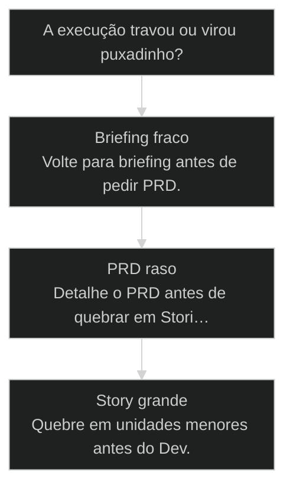
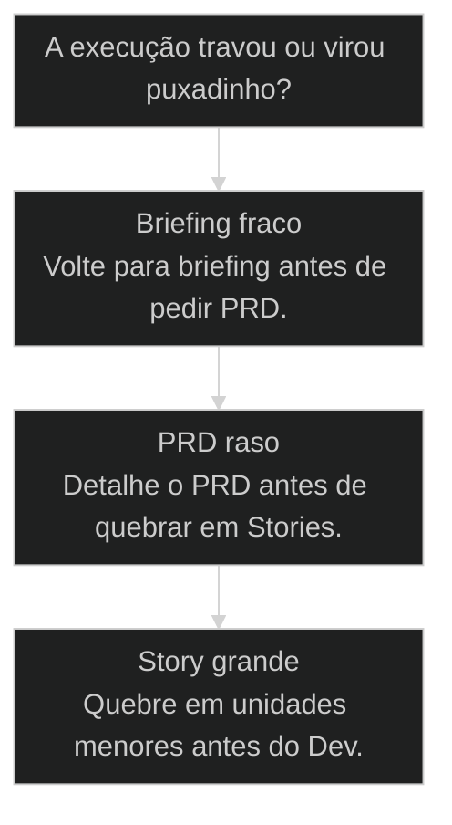
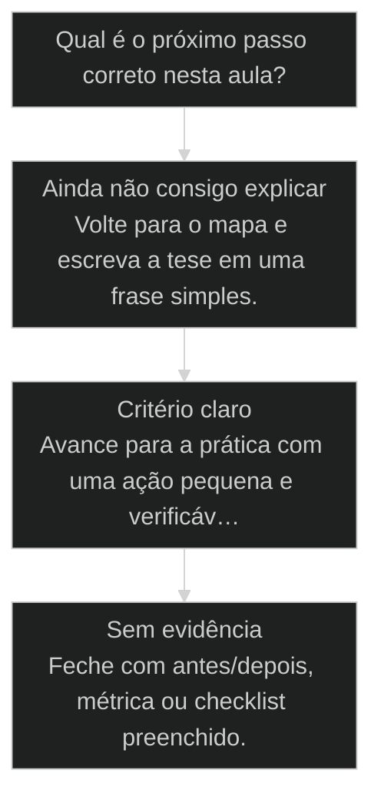

# Etapas de Desenvolvimento AIOX

↑ [[modulos/Módulo 3 - Ciclo SDC|M3]] · ⌂ [[Cursos/AIOX Advanced/README|Curso]] · → [[46-etapas-de-desenvolvimento|Versão atual]]

> [!warning] Versão substituída
> Esta aula permanece como referência histórica. A rota atual continua em [[46-etapas-de-desenvolvimento]].


## Conceitos

- [[Ciclo do Story]]

## Mapa desta aula

Decisão-chave da aula — A execução travou ou virou puxadinho?



> Leia o diagrama antes do texto longo. Depois volte e confira.

> As três etapas que pouca gente faz direito, e por que ignorá-las vira puxadinho atrás de puxadinho.

**Objetivos de aprendizagem:**
- Entender por que comandar IA sem especificação completa gera puxadinho atrás de puxadinho, e por que isso é o estado padrão de quem ainda não conheceu o nível de detalhamento da AIOX. _(understand)_
- Reconhecer as três etapas canônicas do desenvolvimento AIOX: Briefing, PRD (detalhamento operacional) e quebra em Stories, e identificar onde cada uma encaixa no fluxo real. _(understand)_
- Aplicar o tema de casa: começar a usar a AIOX agora, mesmo errando, e compartilhar o que apareceu: porque é assim que a abundância circula no grupo. _(apply)_

---

## Puxadinho atrás de puxadinho

*Diagnóstico*

Antes de explicar as etapas, preciso te mostrar o erro que TODO mundo está cometendo agora: inclusive eu, depois de seis meses dentro da AIOX.

A maioria das pessoas começa a dar comando pra IA sem todas as especificações. Sem briefing, sem detalhamento, sem quebra em tarefas. Aí vira o quê? Puxadinho atrás de puxadinho. Aquela mansãozinha bonita que você ia construir vira um Frankenstein com varanda enferrujada do lado, garagem improvisada na frente, banheiro no quintal. As coisas até continuam funcionando, esse é o pior. Continua funcionando, e você se acostuma com a porcaria.

Quando o Pedro me apresentou o que ele estava fazendo, eu já tinha estudado um pouco de metodologia ágil. Eu já tinha algumas práticas. Mas o nível de detalhamento entre as etapas que ele fazia não tinha comparação. Não tinha comparação. E eu descobri hoje, depois de seis meses de AIOX, que tinha umas etapas que eu mesmo não tava fazendo direito. Eu. Que estou aqui ensinando vocês. Se eu não tava fazendo, imagina o tamanho do puxadinho que tá no projeto de quem ainda nem instalou direito.

Por isso essa aula é literal sobre isso: as etapas que separam um app de verdade de uma mansão com sete puxadinhos. E pra deixar claro, isso aqui não é firula. É a fundação que vai impedir que tu fique consertando coisa quebrada o resto do ano.

- **3**: etapas canônicas
- **6**: movimentos no tema de casa
- **1**: erro barato antes da execução séria

- **status**: aiox advanced
- **meta**: operador=alan_nicolas
- **meta**: aula=07 etapas
- **meta**: etapas=briefing->prd->stories
- **ready**: ready to specify

> **Diagnóstico**: Puxadinho não nasce porque a IA é ruim. Nasce porque você começou a construir antes de especificar.

---

## Legenda de cores desta aula

*Como ler*

O que cada cor sinaliza enquanto você lê. Use como bússola visual.

**Legenda de cores**

O que cada cor sinaliza nesta aula

- **Sintoma de puxadinho** (pain): executar sem especificar gera Frankenstein que funciona meia-boca
- **Etapa canônica** (signal): uma das três camadas de especificação do AIOX
- **Detalhamento** (insight): sub-etapas que pouca gente faz e onde mora o resultado
- **Diagnóstico** (bench): voltar para a etapa que ficou fraca antes de remendar
- **Movimento de prática** (action): começar a usar, errar barato, compartilhar com o grupo

---

## Como ler esta aula

*Roteiro*

Quatro movimentos: do sintoma à prática. Saber onde você está evita se perder na sopa de siglas.

**Como ler esta aula**

1. **O sintoma: puxadinho**: Construir sem especificar vira Frankenstein que 'funciona': e você se acostuma com a porcaria.
2. **Três etapas canônicas**: Briefing → PRD → Stories. Cada uma trava o erro mais cedo e mais barato.
3. **Detalhamento é a fundação**: Não é firula, é o que impede você de consertar coisa quebrada o ano inteiro.
4. **Tema de casa**: Você sai com uma rotina pequena para aplicar antes da próxima execução séria.

---

## Como uma ideia vira puxadinho

*Anatomia*

O caminho do desastre tem quatro passos previsíveis. Conhecê-los é o primeiro antídoto.

O puxadinho não aparece do nada. Ele segue um caminho previsível: ideia solta que parecia clara na cabeça, comando dado cedo demais, correção em cima de correção, e no fim um produto que funciona mas ninguém confia, ninguém escala e todo mundo tem medo de mexer. Quando você enxerga a anatomia do erro, consegue interromper antes do terceiro passo.

**como uma ideia vira puxadinho**

1. **Ideia solta**: Parece clara na cabeça, mas não foi escrita com escopo e restrição.
2. **Comando cedo**: A IA começa a executar antes de entender o projeto.
3. **Correção em cima**: Cada ajuste vira remendo porque a base não foi decidida.
4. **Puxadinho**: O produto funciona, mas ninguém confia, ninguém escala e todo mundo tem medo de mexer.

---

## As três etapas: Briefing, PRD, Stories

*Método*

Existem três etapas principais no desenvolvimento AIOX. Pouca gente faz. E dentro de cada uma, tem sub-etapas que ninguém faz, e é aí que o jogo vira.

Eu separei isso aqui em três etapas principais. Briefing, onde você entende o que quer fazer. PRD, que é o detalhamento operacional: separar isso por etapas, deixar tudo escrito antes de uma linha de código sair. E Stories, a quebra em tarefas executáveis. Só ter essas três já te coloca à frente de noventa por cento das pessoas que usam IA pra construir coisa.

Mas o pulo do gato não está em ter as três. O pulo do gato é que dentro de cada uma existem sub-etapas essenciais. É no detalhe que mora o resultado. Quando você pula a sub-etapa de validação do briefing, o PRD nasce torto. Quando o PRD nasce torto, a Story nasce torta. Quando a Story nasce torta, o Claude Code constrói uma coisa torta, e ele constrói rápido, então você acaba com várias coisas tortas, rápido. Velocidade sem fundação é o que a gente chama de puxadinho industrializado.

- **1. Briefing**: Não é nome do projeto. É clareza sobre problema, público, escopo e porquê. Sem briefing, todo o resto é chute disfarçado de execução. [INPUT, clareza]
- **2. PRD**: Separar trabalho por etapas, escrever objetivos, stack, decisões e trade-offs. O PRD dita tudo. Pular essa etapa é construir sem planta. [PLAN, decisoes]
- **3. Stories**: Cada Story é unidade executável com critério de aceite. É o que o Claude Code mastiga sem inventar moda. Sem Story, vira improvisação. [EXEC, aceite]

---

## O que cada etapa entrega

*Granularidade*

Briefing, PRD e Story em sequência, com o que cada uma trava antes de seguir.

**As três etapas que estruturam todo desenvolvimento AIOX**

1. **Briefing**: Entender o que você quer fazer. Não é nome do projeto. É clareza sobre o problema, o público, o escopo e o porquê. Sem briefing, todo o resto é chute.
2. **PRD (Detalhamento Operacional)**: Separar o trabalho por etapas, escrever objetivos, stack, entregáveis. O PRD vai ditar tudo que vai ser desenvolvido. Pular essa etapa é construir sem planta.
3. **Stories (Quebra em Tarefas)**: Cada Story é uma unidade executável com critério de aceitação. É o que o Claude Code consegue mastigar sem inventar moda. Sem Story, vira improvisação.

- **briefing com nome do projeto**: Briefing não é dar um título bonito para a ideia.
- **PRD com planta genérica**: Um PRD sem restrição, público ou critério é só uma lista de desejos.
- **Story grande com Story executável**: Uma Story que mistura várias entregas não é executável.

---

## Construir puxadinho vs construir mansão

*Contraste*

O mesmo projeto, dois caminhos. A diferença não está na IA: está em qual etapa você respeitou.

**Construir puxadinho**
- Pular briefing porque a ideia parece óbvia.
- Pedir PRD genérico sem restrição, público ou critério.
- Mandar Claude Code construir uma Story grande demais.
- Corrigir com remendo depois que a base já nasceu torta.

**Construir mansão**
- Escrever briefing curto, mas concreto.
- Converter briefing em PRD com etapas e decisões explícitas.
- Quebrar em Stories pequenas com aceite claro.
- Executar com gate: PO, Dev, QA e DevOps quando fizer sentido.

> **A regra das etapas**: Velocidade sem fundação é puxadinho industrializado. Cada etapa pulada multiplica o número de remendos depois.

---

## A Fran pediu pro porta-aviões fazer aviãozinho de papel

*Caso real: hoje, dia 1 do curso*

Caso que aconteceu hoje, dentro do grupo. A Fran descobriu errando, e o erro dela vale ouro pra você.

Vou contar o que aconteceu hoje. A Fran pediu pro [[Squad]] Creator pra criar uma apresentação. Pra quem ainda não viu, o Squad Creator é um porta-aviões. Ele é uma das peças mais complexas, mais densas, mais caras de operar da AIOX. Ele é literalmente um projeto dentro do projeto. E ela pediu pra ele fazer um aviãozinho de papel. Apresentação de slide. Coisa que tem squads específicos pra isso, mais leves, mais diretos, mais rápidos.

A reação típica seria: "Fran, errado, não era pra usar esse." Mas é exatamente o contrário. Ela TESTOU. E ao testar, descobriu que existem squads mais simples pra isso. Descobriu na mão, no impacto, lendo a documentação depois que percebeu que tinha exagerado. Esse é o ponto. Testem. Vocês têm que usar pra poder ver o que não estavam usando do jeito certo. Não esperem descobrir tudo o que vão aprender aqui pra só depois começar: porque vocês vão cometer um erro muito grande. Comecem agora. Nem que vocês deletem e refaçam tudo do zero três vezes esta semana. O erro barato no ambiente local é o melhor professor que existe. Quem erra mais e mais rápido aprende mais do que quem tenta fazer perfeito da primeira vez.

**o erro da Fran como método de aprendizagem**

1. **Tarefa simples**: Criar apresentação.
2. **Ferramenta grande**: Usou Squad Creator, um porta-aviões para um aviãozinho de papel.
3. **Atrito visível**: Percebeu que o sistema tinha peças mais adequadas.
4. **Aprendizado real**: O erro barato ensinou roteamento melhor do que uma explicação abstrata.

> **Por que este caso importa**: O objetivo não é nunca errar. O objetivo é errar cedo, em Local, com custo baixo, e converter o erro em regra de roteamento.

### Caso: Fran e o porta-aviões

Ela usou uma ferramenta grande demais para uma tarefa simples, e isso virou aprendizado útil para o cohort inteiro.

- Começou como: Pedido de apresentação feito para o Squad Creator.
- Virou: Clareza sobre roteamento: ferramenta precisa combinar com tamanho da tarefa.
- Prova: O erro revelou a existência de squads mais adequados antes de virar processo caro.
- Lição: Erro barato em Local é dado de aprendizagem, não vergonha.

### Caso: O instrutor que pulava etapa sem saber

Depois de seis meses dentro da AIOX, o próprio Alan descobriu etapas que ele mesmo não fazia direito.

- Começou como: Prática consolidada de quem já dominava metodologia ágil.
- Virou: Reconhecimento de que o nível de detalhamento do Pedro não tinha comparação.
- Prova: Mesmo ensinando o método, havia sub-etapas sendo puladas no próprio projeto.
- Lição: Nenhum nível de experiência te isenta de revisitar as etapas. O puxadinho cresce em silêncio.

---

## Confusão é o primeiro estágio do conhecimento

*Mindset*

Se você está confuso agora, parabéns. É sinal de que está avançando.

Eu sei o que tá batendo em vocês agora. Briefing, PRD, Story, Epic, core-config, [[CLAUDE md|CLAUDE.md]], DevOps, ambiente local, staging, produção. É muita sigla. É muita ferramenta. É muita coisa nova de uma vez. Calma. Respira. Eu vou repetir uma coisa que vocês precisam tatuar no avesso da mente.

O primeiro estágio da compreensão é a confusão. Se tu tá confuso, parabéns. Tu tá no estágio que tá avançando. Se tu NÃO tá confuso, é porque tu nem sabia que existia Epic, Story, core-config e PRD: ou seja, tava errado e nem sabia que tava errado. Estar confuso é estar consciente da fronteira do que você ainda não domina. É o pré-requisito do aprender. Quem nunca se confunde nunca aprende nada novo: só repete o que já sabia.

Então não fica esperando a confusão passar antes de agir. A confusão NÃO passa parado. A confusão passa testando, errando, lendo a documentação, fazendo a pergunta no grupo, vendo os outros errarem do seu lado. A confusão é movimento, não pausa.

- **Confusão invisível**: Você não sabe que não sabe. Parece fácil porque ainda não viu Epic, Story, PRD, CoreConfig e gates.
- **Confusão consciente**: Você percebe a quantidade de peças. É desconfortável, mas é avanço cognitivo.
- **Confusão operacional**: Você testa, erra, lê, compartilha e converte dúvida em procedimento.

---

## Como sair da confusão sem travar

*Ritmo*

A confusão não passa parado. Passa com um ritmo de três movimentos.

**Como sair da confusão sem travar**

- 1 **Nomeie a peça**: Não entendeu PRD, Story ou CoreConfig? Primeiro descubra o que é, não tente decorar tudo junto.
- 2 **Teste pequeno**: Use Local para fazer um erro controlado e barato.
- 3 **Compartilhe**: O insight de um aluno vira atalho para o resto do cohort.

---

## Antes de executar, descubra qual etapa você pulou

*Decisão*

Quando algo parece confuso, quase sempre uma dessas três etapas ficou fraca.

A aula não quer reduzir Briefing, PRD e Stories a três palavras
decoradas. Ela quer dar um diagnóstico. Quando a execução trava, pergunte
qual camada ficou vaga. A resposta normalmente aparece rápido.

**Árvore de decisão**
_Não corrija direto no código. Descubra qual etapa anterior falhou._



- **Briefing fraco** — Ninguém sabe explicar problema, público, escopo e restrição em linguagem simples.
  → _Volte para briefing antes de pedir PRD._
- **PRD raso** — A ideia existe, mas faltam etapas, decisões, stack e trade-offs.
  → _Detalhe o PRD antes de quebrar em Stories._
- **Story grande** — A Story mistura várias entregas e não tem aceite verificável.
  → _Quebre em unidades menores antes do Dev._

**Gate:** Qual camada precisa voltar? — _Voltar uma etapa cedo é barato. Remendar depois é puxadinho._

---

## Router de decisão da aula

O ponto em que Etapas de Desenvolvimento AIOX deixa de ser explicação e vira escolha operacional.

**Árvore de decisão**
_Não escolha comando antes de nomear o tipo de situação._



- **Ainda não consigo explicar** — O aluno repete a frase da aula, mas não consegue aplicar em exemplo próprio.
  → _Volte para o mapa e escreva a tese em uma frase simples._
- **Critério claro** — O aluno identifica sinal, risco e decisão antes da ferramenta.
  → _Avance para a prática com uma ação pequena e verificável._
- **Sem evidência** — A ação foi feita, mas não existe prova de melhoria ou decisão registrada.
  → _Feche com antes/depois, métrica ou checklist preenchido._

**Gate:** Você sabe qual rota seguir e como provar que avançou? — _Se a resposta ainda depende de opinião, volte uma etapa._

#### Entender o princípio
Quando a aula ainda parece uma tese abstrata.
1. **Nomear: escreva a tese em uma frase.
2. **Exemplo: traga um caso próprio pequeno.
3. **Risco: diga o erro que a aula evita.

#### Aplicar em uma task
Quando o critério está claro e falta execução.
1. **Escolher: defina a menor ação verificável.
2. **Executar: faça sem expandir escopo.
3. **Provar: registre o delta produzido.

#### Revisar a decisão
Quando a execução aconteceu, mas a evidência ficou fraca.
1. **Comparar: olhe antes e depois.
2. **Ajustar: corrija a menor falha.
3. **Fechar: só conclua com prova.

**Colunas:** Estado | Pergunta | Sinal saudável | Sinal de risco

- Entendimento: Consigo explicar sem copiar a aula? | frase própria e exemplo próprio | repetição bonita sem aplicação
- Decisão: Escolhi rota antes da ferramenta? | sinal e risco nomeados | comando escolhido por hábito
- Prova: Tenho evidência de avanço? | antes/depois ou checklist | sensação de que ficou melhor

---

## Processo operacional mínimo

A sequência mínima para aplicar Etapas de Desenvolvimento AIOX sem transformar a aula em teoria solta.

**Aula → Task → Evidência**
Rota curta para transformar o conceito em ação repetível.
- **Plan**: Nomeie o sinal da aula, o risco que ela evita e o artefato que será produzido.
- **Do**: Execute a menor ação que prova o conceito sem abrir novo escopo.
- **Check**: Compare a saída com o critério de aceite da aula.
- **Act**: Registre a regra aprendida e remova o que não será reutilizado.

**Aplicar com evidência**
Use quando a aula fizer sentido, mas a task ainda estiver sem formato.
- `sinal`
- `risco`
- `ação`
- `prova`
- `sinal`: O que esta aula me ensinou a perceber?
- `risco`: Que erro acontece se eu ignorar esse sinal?
- `ação`: Qual é a menor execução que testa o princípio?
- `prova`: Que evidência mostra que a decisão melhorou?

**Do conceito ao comportamento**

1. **Conceito**: entender a tese central da aula.
2. **Critério**: transformar a tese em pergunta de decisão.
3. **Ação**: executar a menor tarefa que prova avanço.
4. **Memória**: registrar o padrão para repetir depois.

---

## Distinções que evitam falsa competência

Três diferenças que protegem Etapas de Desenvolvimento AIOX de virar jargão ou checklist vazio.

**Parece que aprendeu**
- Repete a tese da aula sem exemplo próprio.
- Escolhe ferramenta antes de escolher critério.
- Fecha a task porque executou algo.

**Aprendeu de verdade**
- Explica o princípio em uma situação própria.
- Escolhe rota, risco e evidência antes do comando.
- Fecha a task quando existe prova de avanço.

- **entender com aplicar**: Entender é conseguir repetir a ideia.
- **ação com evidência**: Fazer algo gera movimento.
- **checklist com processo**: Checklist pode ser preenchido no automático.

**Exemplo preenchido: saída esperada do aluno**

- **Tese**: A aula me ensinou a observar um sinal específico antes de escolher ferramenta.
- **Risco**: Se eu pular esse critério, executo rápido e descubro tarde que a direção estava errada.
- **Ação**: Vou aplicar em uma task pequena, com escopo fechado e antes/depois visível.
- **Prova**: A entrega só fecha quando eu consigo mostrar o critério usado e o delta gerado.

- **Briefing**: Use quando o problema, público, escopo e restrição ainda não estão claros.
- **PRD**: Use quando a ideia já existe, mas ainda falta arquitetura de produto e decisões explícitas.
- **Story**: Use quando a execução precisa virar unidade pequena, verificável e com aceite.

- **Ideia solta** -> vira briefing com problema, público e escopo.
- **Briefing bom** -> vira PRD com decisões e trade-offs.
- **PRD claro** -> vira Stories pequenas com aceite.

- **Briefing**: A formulação curta do problema, público, escopo e restrição antes do produto.
- **PRD**: O detalhamento operacional que transforma intenção em arquitetura de produto.
- **Story**: A menor unidade de execução com critério de aceite verificável.

---

## Comece a usar. Mesmo errado. E compartilhe.

*Tema de casa*

Seu tema de casa pra antes do próximo encontro: seis movimentos práticos pra acelerar a curva de confusão.

O que eu quero de vocês até o próximo encontro é simples, e desconfortável. Eu quero que vocês comecem a usar, mesmo errado. Quero que vocês quebrem coisa, deletem, refaçam, percebam que pediram pro porta-aviões fazer aviãozinho de papel, e contem isso pro grupo. Porque a abundância vai aumentando quando o conhecimento circula. Tudo que vocês descobrirem aqui: bug estranho, squad que não entendeu o briefing, PRD que ficou raso, Story que nasceu torta: joga no grupo. O insight de um vira atalho pros outros vinte. É inteligência coletiva.

- 1. **Briefing solo**: Escolhe um projeto pequeno: pode ser uma landing, um squad próprio, um app que tu já queria. Escreve em até uma página: o que quer fazer, pra quem, qual problema resolve, qual escopo.
- 2. **Gera o PRD**: Manda o briefing pra dentro da AIOX e pede pra ele detalhar o PRD. Lê o que sai. Bate o que sai com o que tu pediu. Onde divergiu, anota.
- 3. **Quebra em Stories**: Pede pra quebrar o PRD em Stories executáveis. Não tenta executar tudo. Só veja a granularidade. Sente se cada Story cabe num critério de aceitação claro.
- 4. **Erra de propósito**: Faz pelo menos uma coisa errada: chama o squad errado pra tarefa errada (porta-aviões pra aviãozinho), pula uma etapa, manda comando sem especificação. Vê o que quebra.
- 5. **Compartilha no grupo**: Posta no grupo o que aprendeu errando. Pode ser print, pode ser parágrafo, pode ser áudio. O insight bruto vale mais que o relatório bonito.
- 6. **Lê o que os outros postaram**: Antes do próximo encontro, lê pelo menos três compartilhamentos dos colegas. A abundância circula quando o conhecimento circula.

---

## A sequência mínima para não virar puxadinho

*Comando*

Cinco passos em ordem. Use sempre que uma ideia parecer pronta para executar.

**Sequência mínima para não virar puxadinho**
Use sempre que uma ideia parecer pronta para executar.
- `briefing`
- `prd`
- `stories`
- `execução local`
- `compartilhar aprendizado`
- `Briefing`: Escreva problema, público, escopo e restrição.
- `PRD`: Detalhe arquitetura de produto antes de construir.
- `Stories`: Quebre em unidades pequenas com aceite claro.
- `Local`: Teste errado sem custo alto.
- `Grupo`: Converta o erro em conhecimento circulando.

---

## Tema de casa de uma landing pequena

*Ilustração*

Como o exercício fica quando você o preenche de verdade: do briefing ao compartilhamento.

**Exemplo preenchido: tema de casa de uma landing pequena**

- **Briefing**: Landing para uma aula aberta de IA. Público: founders de negócio B2B. Escopo: hero, autoridade, programa, oferta e formulário. Não inclui blog, área logada ou multi-idioma.
- **PRD gerado**: Stack simples, formulário integrado e deploy em preview. Decisão: copy final vem do founder; IA organiza wireframe, componentes e checklist de publicação.
- **Stories**: 1) Hero + headline + CTA. 2) Seção de autoridade. 3) Programa em blocos. 4) Formulário com validação. 5) Deploy preview com domínio de teste.
- **Erro proposital**: Usar Squad Creator para gerar a landing inteira, sentir o peso da ferramenta e comparar com a rota menor: design + dev + deploy.
- **Compartilhado**: Postar no grupo o PRD, o erro de roteamento e a regra aprendida: ferramenta grande demais também vira puxadinho.

---

## Portão da aula

*Gate*

O critério único que diz se você está pronto para a execução séria.

> **Portão da aula**: Você só passa para execução séria quando consegue explicar briefing, PRD e Story do seu projeto em frases simples.

---

## Bloco de código: as três etapas antes de construir

O esqueleto que separa mansão de puxadinho, para o aluno copiar antes de mandar executar.

**Da ideia à Story**
```yaml
briefing:
  problema: "Que dor real isso resolve?"
  publico: "Para quem?"
  escopo: "O que entra e o que NAO entra"
prd:
  arquitetura: "Como o produto se organiza antes de existir codigo"
stories:
  - id: "story-1"
    entrega: "Unidade pequena com aceite claro"
    aceite: "Esta pronta quando..."

```
*Pular briefing e PRD é começar o puxadinho. As três etapas existem para não corrigir em cima de erro.*

---

## O que levar desta aula

*Síntese*

Os pontos que sustentam tudo: a fundação contra o puxadinho.

**O que levar desta aula**

1. **Puxadinho é diagnóstico**: Construir sem especificar gera Frankenstein que funciona meia-boca: e você se acostuma.
2. **Briefing → PRD → Stories**: Três etapas canônicas. Cada uma trava o erro mais cedo e mais barato.
3. **Diagnostique a etapa**: Quando trava, descubra qual camada ficou fraca antes de remendar no código.
4. **Erre barato e compartilhe**: Comece agora, erre em Local, jogue o aprendizado no grupo. A abundância circula.

***


---

## Navegação

↑ [[modulos/Módulo 3 - Ciclo SDC|M3]] · ⌂ [[Cursos/AIOX Advanced/README|Curso]] · → [[46-etapas-de-desenvolvimento|Versão atual]]
