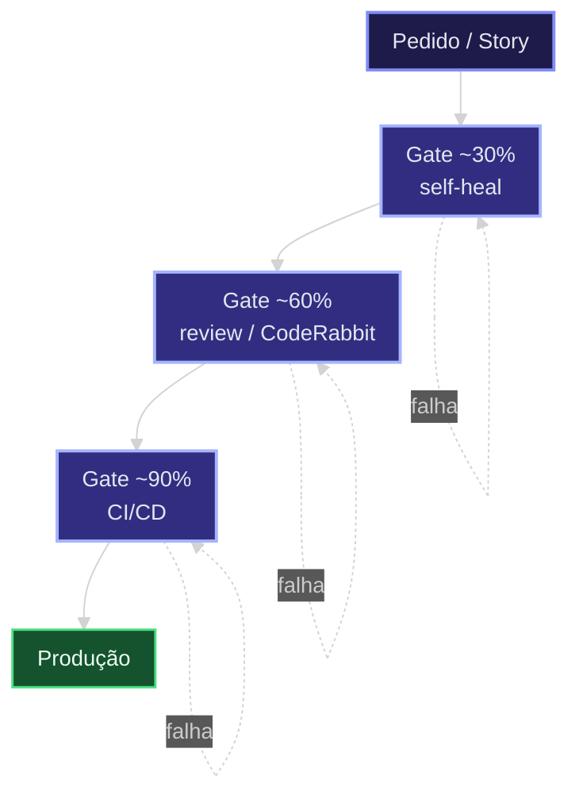
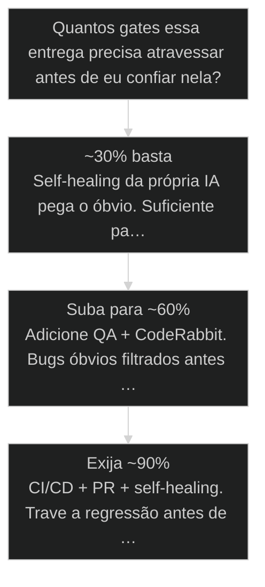

# Determinismo Progressivo (30 → 60 → 90)

↑ [[modulos/Módulo 4 - Determinismo e Comando|M4]] · ⌂ [[Cursos/AIOX Advanced/README|Curso]] · → [[20-determinismo-progressivo|Versão atual]]

> [!warning] Versão substituída
> Esta aula permanece como referência histórica. A rota atual continua em [[20-determinismo-progressivo]].


## Conceitos

- [[Determinismo Progressivo]]
- [[Quality Gate]]

## Mapa desta aula

Determinismo progressivo: cada gate sobe a qualidade. Falhou → corrige e repete o **mesmo** gate.



> Leia o diagrama antes do texto longo. Depois volte e confira.

> O mecanismo que trava a IA no caminho certo, etapa por etapa

**Objetivos de aprendizagem:**
- Definir o que é [[Determinismo Progressivo|determinismo progressivo]] e por que trava a LLM. _(understand)_
- Ler a progressão 30→60→90 e identificar os gates de qualidade. _(understand)_
- Aplicar Determinismo Progressivo (30 → 60 → 90) em uma decisão real com critério e evidência. _(apply)_

---

## O que você consegue no fim desta aula

*G · Destino*

Destino claro antes do conteúdo técnico.

Ao final desta aula você consegue explicar o determinismo progressivo (30→60→90),
nomear o que cada gate trava, e recusar autonomia sem portão. Resultado tangível: desenhar
os três gates no fluxo da sua Story com critério de passagem em uma linha cada.

- **Destino**: Determinismo Progressivo (30 → 60 → 90)
- **Como saber que chegou**: Exercício final da aula com evidência escrita.

---

## O ponto de partida real

*P · Onde você está*

Empatia com o sintoma — sem moralismo.

Cara, a maioria trata IA como conversa: manda, reza, aceita. Aí o merge vira roleta.
Se você está aqui, provavelmente já viu o agente "quase certo" três vezes e ainda assim
retrabalhou o dia inteiro. O sintoma não é modelo fraco — é ausência de gate. Beleza:
daqui pra frente qualidade sobe por etapa, não por torcida.

> **Âncora**: Se o sintoma não for o seu, anote o do seu time — a aula ainda vale como mapa.

---

## Determinismo Progressivo

O ponto não é a IA ser inteligente. É travar a IA no caminho certo, etapa por etapa, até a qualidade subir.

- **30→60→90**: progressão de acurácia
- **5**: etapas de amarração
- **3**: gates principais

- **status**: aiox advanced
- **meta**: operador=alan_nicolas
- **meta**: aula=09 determinismo
- **meta**: gates=30->60->90
- **ready**: ready to gate

**Legenda de cores**

O que cada cor sinaliza nesta aula

- **Trava inicial** (signal): [[CLAUDE md|CLAUDE.md]], CoreConfig e PRD reduzindo espaço para invenção
- **Gate de confiança** (bench): QA, [[CodeRabbit]] e revisão externa aumentando a régua
- **Bloqueio final** (action): CI/CD, PR e repositório impedindo regressão antes de publicar
- **Abstração solta** (pain): a LLM preenchendo lacunas sem critério externo

**Como ler o 30 → 60 → 90**

1. **30**: A própria IA revisa e corrige o óbvio.
2. **60**: QA e revisão externa aumentam a chance de pegar erro real.
3. **90**: CI/CD, repo e gates automatizados travam a entrega antes de publicar.
4. **Progressivo**: Nenhum gate resolve tudo sozinho. A força está no empilhamento.

---

## O percurso desta aula

Antes de mergulhar, veja o trajeto: do conceito cru até a prática de contar gates.

**As cinco paradas**

1. **Conceito**: O que é determinismo, o que é progressivo e quem é o inimigo (abstração).
2. **Amarração**: Onde o travamento começa: contexto, escopo e gate.
3. **Progressão**: A leitura do 30 → 60 → 90 e por que somar gates.
4. **Casos**: O mesmo output ficando confiável ao atravessar mais portões.
5. **Prática**: Contar os gates do seu último trabalho com IA.

> **Como usar este mapa**: Cada parada empilha sobre a anterior. Não pule a amarração: é ela que explica por que os números sobem.

---

## O que é (em linguagem simples)

Determinismo progressivo = a IA vai sendo presa no caminho certo, e a cada trava a qualidade sobe.

- **Determinismo** -> Forçar coisas fixas (specs, validações) em vez de deixar a IA inventar.
- **Progressivo** -> Trava por trava, etapa por etapa, a qualidade sobe a cada uma.
- **Abstração (o inimigo)** -> A LLM quer 'preencher os espaços em branco' do jeito dela. O determinismo fecha esses espaços. [SOURCE: L1335]

**IA solta**
- Prompt aberto demais.
- Sem PRD, sem Story, sem aceite.
- A própria IA decide o que é suficiente.
- Erro aparece tarde, quando já virou retrabalho.

**IA com determinismo**
- Contexto amarrado desde CLAUDE.md e CoreConfig.
- Story validada antes do Dev.
- Gates empilhados: self-healing, QA e CI/CD.
- Erro aparece cedo, barato e corrigível.

---

## Por que a abstração é o inimigo

A IA não erra por má vontade. Ela erra porque, sem trava, preenche o espaço em branco do jeito dela.

> **O reflexo de preencher lacunas**: Toda LLM tem um impulso: onde falta critério, ela inventa um. Isso parece útil (sempre tem resposta), mas é exatamente onde mora o erro silencioso. [SOURCE: L1335]

- **Inventar ≠ alucinar**: Preencher o branco não é (só) alucinação. É escolher o estatisticamente provável quando você não fixou o correto.
- **Branco ≠ liberdade**: Deixar branco parece dar liberdade criativa. Na prática, transfere a decisão para o impulso da IA.

- **Espaço em branco** -> Qualquer decisão que você não fixou: nome, estrutura, regra de negócio, edge case.
- **Preenchimento solto** -> A IA escolhe o mais provável estatisticamente, não o mais correto para o seu caso.
- **Trava = fechar o branco** -> Cada artefato (CLAUDE.md, PRD, Story) remove um branco onde a IA inventaria.

---

## Os dois modos em que a IA opera

A mesma IA, dois comportamentos: solta (preenchendo brancos) ou travada (seguindo critério).

- **Modo solto**: Sem trava: a IA escolhe o provável. Útil para rascunho, perigoso para entrega.
- **Modo travado**: Com critério externo: a IA segue specs e aceite. O branco já foi fechado antes.
- **Modo progressivo**: A trava não é tudo-ou-nada: ela aumenta gate a gate, do contexto ao CI/CD.

---

## Onde o determinismo começa

O travamento não começa no código. Começa lá atrás, na configuração.

- **1. Contexto**: CLAUDE.md e CoreConfig definem gravidade, stack, padrões e autoridade antes de qualquer execução. [30, setup]
- **2. Escopo**: PRD, épicos e Stories dizem o que será construído, em qual ordem e com qual aceite. [60, story]
- **3. Gate**: Validate Story Draft, QA, CodeRabbit e CI/CD conferem o trabalho antes de publicar. [90, merge]

**A amarração de contexto: cada etapa adiciona uma trava [SOURCE: L2899-2919]**

1. **CLAUDE.md**: as leis que regem o ambiente (a gravidade)
2. **core-config**: a stack, code standard, sourcing definida
3. **PRD**: o que vai ser construído
4. **Épicos → Stories**: decomposição executável
5. **Validate Story Draft**: valida ANTES de executar

---

## Recap — Conceito

O que fica do bloco de conceito antes de irmos para os números.

**Conceito em 4 células**

O bloco de conceito condensado antes de irmos para os números.

- **Determinismo**: Fixar o que importa em vez de deixar a IA inventar.
- **Progressivo**: A qualidade sobe trava por trava, não num salto único.
- **Abstração**: O inimigo é o espaço em branco que a IA preenche sozinha.
- **Começa cedo**: A primeira trava é o contexto (CLAUDE.md), não o código.

---

## A progressão 30 → 60 → 90

A cada gate de qualidade, a acurácia sobe. Cada gate soma confiança.

**Colunas:** Gate | Quem | Acurácia | O que faz

- Self-healing (selfie): Dev | ~30% | IA revisa o próprio trabalho antes do checklist [SOURCE: L2265]
- Review: QA | ~60% | QA aciona CodeRabbit, análise mais pesada [SOURCE: L2899-2919]
- CI/CD: repositório | ~90% | CodeRabbit em staging + produção [SOURCE: L2657, L2869]

**Snapshot da progressão**
Mesmos gates da tabela: self-healing, QA Review e CI/CD.
**Rank:** 30 -> 60 -> 90
**Colunas:** Gate | Self-healing | QA Review | CI/CD | Clareza gerada
- **Acurácia inicial (primeira trava)**: 30 (win) | 60 | 90 | Suficiente para iterar, insuficiente para publicar.
- **Confiança de review (critério externo)**: 30 | 60 (win) | 90 | QA e CodeRabbit reduzem abstração antes do PR.
- **Bloqueio final (antes do merge)**: 30 | 60 | 90 (win) | CI/CD e PR travam regressão antes de produção.

---

## Por que somar gates

Nenhum gate sozinho chega perto de 90%. A força está no empilhamento.

> **Por que somar gates?**: Sozinho, o self-healing pega o óbvio (30%). Empilhado com QA (60%) e CI/CD (90%), o resultado final é muito mais confiável que qualquer gate isolado. CodeRabbit adiciona +60-70% de filtro de qualidade só por existir. [SOURCE: L799, L927-929]

- **Self-healing**: ~30% (primeira limpeza automática)
- **QA + Review**: ~60% (revisão mais pesada)
- **CI/CD + PR**: ~90% (travamento antes do merge)

> **A leitura correta dos números**: 30, 60 e 90 não são notas de prova. São níveis de confiança: quanto da abstração já foi removida. 30% é 'útil para iterar', 90% é 'travado para publicar'.

---

## Qual rota seguir, por nível de risco

O determinismo que você precisa não é fixo: depende de quem vai depender da entrega.

#### Rota rascunho
Local, reversível, só você depende.
1. **Self-healing: Deixe a IA revisar o próprio output.
2. **Itere: Suficiente para explorar; não publique ainda.

#### Rota entrega
Vai para review ou outra pessoa usa.
1. **QA: Adicione revisão antes do humano.
2. **CodeRabbit: Filtre bugs óbvios automaticamente.

#### Rota produção
Vai para merge / usuário real.
1. **CI/CD: Trave a regressão com testes automáticos.
2. **PR: Bloqueie a publicação até o critério bater.

---

## O que é um [[Quality Gate]]

> **Portão de entrada e saída**: Quality Gate = um portão que só deixa passar se o critério foi cumprido. Pode acontecer em nível de task OU de workflow. O CodeRabbit está em todos eles, muitas vezes silenciosamente. [SOURCE: L1623-1629, L927-929]

> **A metáfora do relógio**: O AIOX é montado peça com peça como um relógio: se uma etapa falha, o relógio fica capenga. Cada gate é uma engrenagem; uma falha desincroniza o todo. [SOURCE: L1071-1072]

**Árvore de decisão**
_O número de gates é função do risco, não da pressa. Cada gate remove uma camada de abstração._



- **~30% basta** — É rascunho local, reversível, sem ninguém dependendo?
  → _Self-healing da própria IA pega o óbvio. Suficiente para iterar._
- **Suba para ~60%** — Vai para review ou outra pessoa vai usar?
  → _Adicione QA + CodeRabbit. Bugs óbvios filtrados antes do humano._
- **Exija ~90%** — Vai para produção / merge / usuário real?
  → _CI/CD + PR + self-healing. Trave a regressão antes de publicar._

**Gate:** Por quantos portões isso passou, e quem moveu cada um? — _Se passou por zero ou um gate, ainda é abstração da IA, não entrega confiável._

---

## Recap — Progressão

O coração da aula em uma síntese antes dos casos.

**Progressão em 4 batidas**

O coração da aula, batida por batida.

- 30 **Self-healing**: A IA limpa o óbvio sozinha.
- 60 **QA + CodeRabbit**: Critério externo reduz a abstração.
- 90 **CI/CD + PR**: Regressão travada antes de publicar.
- → **A regra**: O número de gates é função do risco, não da pressa.

---

## O mesmo código fica melhor quando passa por mais portões

Determinismo progressivo não é teoria, é o que acontece quando o trabalho deixa de depender de uma resposta única da IA.

Um aluno comum olha para o 30 → 60 → 90 e pensa que é número técnico.
Não é. É uma forma de enxergar confiança. A primeira versão da IA pode
estar útil, mas ainda está abstrata. Quando ela passa por self-healing,
QA e CI/CD, a mesma entrega deixa de ser chute bonito e vira artefato
mais preso na realidade.

**menos opinião, mais portão**

1. **Output nasce**: A IA entrega algo plausível.
2. **Gate reduz abstração**: Cada revisão força critério externo.
3. **Artefato fica confiável**: A entrega deixa de ser só uma resposta bonita.

### Caso: De resposta bonita para entrega travada

A saída inicial parecia boa, mas só virou confiável depois de passar por gates empilhados.

- Começou como: Código gerado por IA com aparência de pronto.
- Virou: Entrega revisada por self-healing, QA e CI/CD.
- Prova: Cada portão remove uma camada de abstração: primeiro o óbvio, depois o risco, depois a regressão.
- Lição: Confiança não nasce do primeiro output. Nasce do caminho que o output atravessou.

### Caso: A Story que pulou a validação

Quando você pula um gate, o erro não some — só aparece mais caro, mais tarde.

- Começou como: Story enviada direto pro Dev sem passar pelo Validate Story Draft.
- Virou: Implementação plausível, mas com aceite ambíguo que a IA preencheu do jeito dela.
- Prova: O erro só apareceu no QA, quando já era retrabalho — exatamente o branco que a validação teria fechado antes.
- Lição: Gate pulado é abstração que volta como custo. O barato é fechar o branco cedo.

---

## Recap — Casos

O que os dois casos provam, lado a lado.

**Casos em 3 células**

- **Mais portões**: O mesmo output fica confiável ao atravessar gates empilhados.
- **Portão pulado**: O erro não some: volta mais caro e mais tarde.
- **A pergunta**: Por quantos portões isso passou — e quem moveu cada um?

---

## Glossário sem jargão

- **Determinismo progressivo**: Travar a IA etapa por etapa, com a qualidade subindo a cada gate.
- **Quality Gate**: Portão que só deixa passar o que tem qualidade suficiente.
- **Self-healing (selfie)**: A IA revisa e corrige o próprio trabalho automaticamente (~30%).
- **CI/CD**: Workflows de teste automático para staging e produção (gate de ~90%).
- **Abstração**: O espaço em branco que a IA preenche sozinha quando falta critério externo.
- **Validate Story Draft**: Gate que valida a Story ANTES de executar, fechando o branco do aceite.

---

## Faça agora (2 minutos)

Conte os gates do seu último trabalho com IA.

**Diagnóstico rápido de determinismo**
Use quando uma entrega parece pronta, mas você não sabe por quais gates ela passou.
- `listar artefato`
- `contar gates`
- `classificar risco`
- `adicionar gate`
- `revalidar`
- `Listar`: Qual artefato foi produzido e para que serve?
- `Contar`: Passou por self-healing, QA, teste, CodeRabbit, CI/CD?
- `Risco`: Se passou por zero ou um gate, ainda está abstrato demais.
- `Adicionar`: Adicione o menor gate útil antes de escalar.

**Exemplo preenchido: classificar uma entrega recente**

- **Artefato**: Uma Story implementada com IA que parece pronta, mas ainda não foi revisada.
- **Gates encontrados**: Self-healing do @dev rodou. QA ainda não entrou. PR ainda não existe.
- **Leitura**: A entrega está na faixa inicial do determinismo. Boa para iterar, fraca para publicar.
- **Próximo gate**: Mover para Review, acionar QA + CodeRabbit e registrar achados antes do PR.
- **Decisão**: Só tratar como pronta depois de CI/CD e PR, porque produção exige a faixa final da progressão.

> **Portão da aula**: Você entendeu determinismo progressivo quando consegue apontar onde a IA foi travada, por quem e antes de qual risco.

- 1. ****: Abra um trabalho recente que você fez com IA.
- 2. ****: Conte: quantos 'gates' ele passou? (auto-revisão? revisão de QA? teste no repositório?)
- 3. ****: Se passou por zero gates, ele está em ~0% de determinismo (pura abstração da IA).
- 4. ****: Adicione UM gate (peça uma auto-revisão, ou rode um lint) e veja a diferença.

**Funcionou se:**

- Você consegue dizer em que % de determinismo seu trabalho estava.
- Você adicionou pelo menos 1 gate e percebeu a melhora.

---

## Bloco de código: travas que sobem o determinismo

A sequência de gates que leva a IA de 30 para 90, fechando os espaços em branco.

**De 30 para 90, trava por trava**
```yaml
determinismo_30:
  tem: "CLAUDE.md + core-config"      # ambiente e stack fixos
determinismo_60:
  adiciona: "PRD + Epicos + Stories"   # o que construir, decomposto
determinismo_90:
  adiciona: "Validate Story Draft"     # valida ANTES de executar
  efeito: "a IA para de preencher o espaco em branco do jeito dela"

```
*Cada trava fecha um espaço onde a IA inventaria. Progressivo: a qualidade sobe a cada gate.*

---

## O que levar desta aula

Determinismo progressivo, em uma frase que você consegue repetir amanhã.

**A aula inteira em 4 células**

- **Trava, não inteligência**: O ponto não é a IA ser esperta. É fechar os brancos onde ela inventaria.
- **Progressivo**: A confiança sobe trava por trava: 30 → 60 → 90.
- **Função do risco**: Quantos gates? Depende do risco da entrega, não da pressa.
- **A pergunta**: Por quais portões isso passou, e quem moveu cada um?

> **Próximo passo**: Leve a prática de contar gates para o seu próximo trabalho com IA. O hábito de perguntar 'por quantos portões passou?' é o que separa abstração de entrega.

***


---

## Navegação

↑ [[modulos/Módulo 4 - Determinismo e Comando|M4]] · ⌂ [[Cursos/AIOX Advanced/README|Curso]] · → [[20-determinismo-progressivo|Versão atual]]
