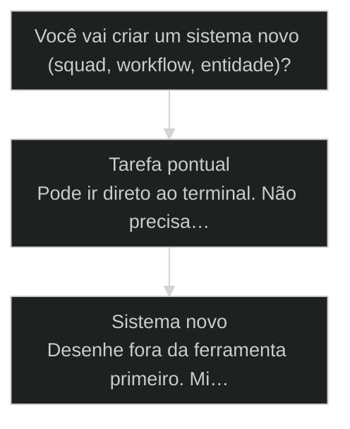
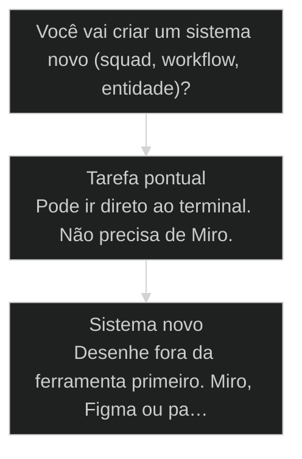

# Desenhe fora da ferramenta antes de codar

← [[12-repertorio-vs-tecnica|Repertório vence técnica]] · ↑ [[modulos/Módulo 0 - Mindset e Princípios|M0]] · ⌂ [[Cursos/AIOX Advanced/README|Curso]] · → [[26-nao-delegar-pensar|Nao delegue o pensar: repertorio contra zumbi]]

## Conceitos

- [[Repertório vs Técnica]]

## Mapa desta aula

Decisão-chave da aula — Você vai criar um sistema novo (squad, workflow, entidade)?



> Leia o diagrama antes do texto longo. Depois volte e confira.

> Miro, Figma, papel: pensamento estruturado precede o prompt. A maior habilidade da era IA não é digitar mais rápido, é desenhar o sistema antes de tocar no terminal.

**Objetivos de aprendizagem:**
- Explicar por que pensamento estruturado é a maior habilidade da era IA, acima de prompt e ferramenta. _(understand)_
- Diferenciar o operador que desenha fora da ferramenta do operador que abre o terminal direto. _(understand)_
- Aplicar as 5 perguntas para mapear o ciclo de vida de uma entidade antes de codar. _(apply)_
- Esboçar um sistema ([[Squad|squad]] ou workflow) em papel ou Miro antes do primeiro prompt. _(apply)_

---

## Desenhe fora da ferramenta antes de codar

*Princípio · M0 Mindset · Por Alan Nicolas*

Antes do prompt, o desenho. Antes do código, o pensamento. O operador que abre o terminal direto reconstrói o tempo todo; o que desenha fora da ferramenta conduz.

- **2 aulas T2**: framings de pensamento estruturado
- **3 superfícies**: Miro, Figma, papel antes do terminal
- **1 esboço**: portão para passar a próxima aula

- **status**: aiox advanced · m0 mindset
- **meta**: principio=pensamento-estruturado
- **meta**: fonte=t2-aula-1 + t2-aula-2
- **ready**: draw before you prompt

**Legenda de cores**

Os 5 estados desta aula

- **Terminal-primeiro** (pain): abre o prompt sem desenho, reconstrói a cada iteração
- **Desenho fora** (signal): esboça o sistema em Miro, Figma ou papel
- **Pensamento estruturado** (insight): a meta-habilidade que vale mais que a ferramenta
- **Contexto antes do pedido** (bench): pergunta e desenha antes de pedir
- **5 perguntas** (action): mapeia o ciclo de vida antes de codar

---

## Pensamento estruturado é a maior habilidade da era IA

A ferramenta muda toda semana. O modelo fica obsoleto. O que não fica obsoleto é a sua capacidade de estruturar um problema antes de pedir a solução.

> **A regra que sustenta a aula**: A maior habilidade da era IA não é digitar prompt bonito. É pensar de forma estruturada antes de abrir a ferramenta. Meta-aprendizagem é o segredo: quem sabe estruturar, troca de modelo sem perder o passo.

**Operador terminal-primeiro**
- Abre o Claude Code e digita 'cria um sistema de X'.
- Deixa a ferramenta decidir a estrutura.
- Itera às cegas quando o output vem torto.
- Reconstrói a solução a cada tentativa.

**Operador desenho-primeiro**
- Abre o Miro e desenha a empresa, as entidades, o ciclo de vida.
- Decide a estrutura antes de tocar no terminal.
- Chega no prompt com o sistema já desenhado.
- Reconstrói pensamento uma vez, depois só executa.

> **Adriano de Marqui (host T2, t2-aula-1)**: Pensamento estruturado é a maior habilidade da era IA. Meta-aprendizagem é o segredo das coisas. Eu distribuo 41 modelos de framework porque o repertório visual é o que te deixa desenhar antes de pedir.

---

## O caminho da aula

Três movimentos: entender por que desenhar antes, ver o caso de quem não desenhou, e aplicar as 5 perguntas no seu próprio processo.

**Os 3 movimentos**

1. **Por que desenhar antes**: pensamento estruturado vence ferramenta e prompt
2. **O caso de quem não desenhou**: o login do Adavio: pedido sem contexto vira retrabalho
3. **As 5 perguntas**: mapear o ciclo de vida da entidade antes de codar

- **Você vai sair sabendo** (Por que o desenho fora da ferramenta reduz retrabalho.; Como o Adavio transformou um pedido torto em um sistema.; As 5 perguntas para mapear qualquer entidade.)
- **Você vai sair fazendo**: Um esboço de um sistema seu (squad ou workflow) em papel ou Miro, antes do primeiro prompt.

**O ritmo do operador maduro**

Três batidas que se repetem em todo projeto novo.

- 1 **Desenha**: fora da ferramenta, o sistema inteiro
- 2 **Pergunta**: quais formas existem, antes de escolher uma
- 3 **Só então pede**: com o sistema desenhado e o contexto montado

---

## Desenhar antes ou abrir o terminal?

Nem todo trabalho exige um mapa no Miro. Mas todo sistema novo exige. A decisão é sobre a complexidade do que você está criando.

**Árvore de decisão**
_Sistema = algo com mais de uma entidade e um ciclo de vida._



- **Tarefa pontual** — Edição isolada, bug fix com reprodução clara, ajuste de uma linha.
  → _Pode ir direto ao terminal. Não precisa de Miro._
  Ex.: Corrigir um typo num arquivo de config.
- **Sistema novo** — Squad, workflow, entidade com ciclo de vida, processo recorrente.
  → _Desenhe fora da ferramenta primeiro. Miro, Figma ou papel._
  Ex.: Criar um squad de atendimento com agentes e memória.

**Gate:** Dá pra explicar o sistema desenhando numa folha? — _Se não dá pra desenhar, você ainda não entendeu o sistema. Não abra o terminal._

> **O atalho que custa caro**: Pular o desenho parece economizar 10 minutos. Custa horas de reconstrução. O terminal te deixa começar errado rápido.

---

## O login do Adavio

Um pedido de uma linha, 'cria um login', virou retrabalho. O mesmo pedido, depois de desenhado e pesquisado, virou um sistema. A diferença foi o contexto antes do pedido.

> **Adriano de Marqui (host T2, t2-aula-2)**: Nos meus PSs eu não reconstruo a solução, eu reconstruo o pensamento. Se você desenhou o sistema, qualquer modelo refaz o código. Se você só tem o código, você está refém dele.

### Caso: Cria um login (e a pergunta que mudou tudo)

Quando o operador pede sem contexto, ele aceita o primeiro caminho que a IA inventa. Quando pesquisa antes, ele escolhe.

- Começou como: Pedido de uma linha: cria um login pra mim.
- Virou: Sistema de autenticação desenhado: métodos pesquisados, fluxo no Miro, hierarquia de usuários definida.
- Prova: A pergunta 'qual a chance disso dar errado' obrigou a pesquisar formas de autenticação antes de codar.
- Lição: Contexto antes do pedido transforma retrabalho em sistema.

---

## O impacto medido de desenhar antes

Desenhar fora da ferramenta muda três números: quantas iterações até o output certo, quanto retrabalho, e se o sistema cabe no resto.

**Colunas:** Abordagem | Iterações até acertar | Retrabalho | Cabe no sistema

- Terminal-primeiro (pedido cru): muitas | alto | raramente
- Desenho-primeiro (Miro antes): poucas | baixo | por design
- Pesquisa + desenho + pedido: mínimas | quase zero | sempre

- **Terminal-primeiro: tempo em reconstrução**: 65%
- **Terminal-primeiro: tempo em execução útil**: 35%
- **Desenho-primeiro: tempo em desenho**: 20%
- **Desenho-primeiro: tempo em execução útil**: 80%

---

## WHY / WHAT / HOW do desenho-primeiro

As 3 camadas da técnica. Pular qualquer uma reduz o desenho a um rabisco sem consequência operacional.

- **1. WHY - Pensamento estruturado sobrevive ao modelo**: A ferramenta e o modelo ficam obsoletos. O sistema que você desenhou não. Quem estrutura o problema troca de IA sem perder o passo. Meta-aprendizagem é a vantagem composta. [WHY, meta-habilidade]
- **2. WHAT - Desenhar fora da ferramenta**: Miro, Figma ou papel. Você desenha a empresa, as entidades, o ciclo de vida e as tasks antes de tocar no terminal. O desenho é o contrato; o código é só a execução dele. [WHAT, fora da ferramenta]
- **3. HOW - Pergunte e mapeie antes de pedir**: Contexto antes do pedido. Pergunta quais formas existem, desenha o fluxo, mapeia o ciclo de vida com as 5 perguntas. Só então o prompt carrega o sistema. [HOW, 5 perguntas]

---

## O fluxo: do papel ao prompt

A sequência que o operador maduro roda antes de abrir o terminal. Cada etapa reduz o que a IA tem que adivinhar.

**Da intenção crua ao prompt com contexto**

1. **Empresa**: desenha o que o sistema serve: a entidade-mãe.
2. **Entidades**: lista as entidades e como elas se relacionam.
3. **Ciclo de vida**: para cada entidade, mapeia nascimento, estados e fim.
4. **Tasks**: deriva as tasks recorrentes de cada ciclo de vida.
5. **Prompt**: só agora abre o terminal, com o sistema já desenhado.

---

## As 5 perguntas para mapear o ciclo de vida

O exercício guiado que o Adriano dá no T2. Liste 5 processos recorrentes do seu trabalho e responda 5 perguntas para cada um, antes de modelar no sistema.

**Mapear o ciclo de vida de uma entidade**
Use antes de criar qualquer entidade, squad ou workflow novo.
- `processo`
- `dados`
- `documentacao`
- `formato`
- `ciclo`
- `processo`: Qual é o processo? Descreva em uma frase o que acontece do início ao fim.
- `dados`: Quais dados únicos essa entidade carrega? O que só ela tem?
- `documentação`: Onde esses dados estão documentados hoje? Planilha, cabeça, lugar nenhum?
- `formato`: Qual o formato ideal pra esse dado viver? YAML, tabela, doc?
- `ciclo`: Modele o ciclo de vida: como a entidade nasce, que estados percorre, como termina.

> **Liste 5 antes de modelar 1**: Antes de codar, liste 5 processos recorrentes do seu trabalho. Rode as 5 perguntas em cada um. Só depois escolha qual virar squad ou workflow primeiro. O mapa vem antes do martelo.

**Modelagem na pressa**
- Cria a entidade direto no código.
- Descobre os dados que faltam depois, quebrado.
- Refaz o ciclo de vida 3 vezes.

**Modelagem com as 5 perguntas**
- Responde as 5 perguntas no papel primeiro.
- Chega no código com os dados e o ciclo já definidos.
- Modela uma vez, ajusta detalhe.

---

## Não confunda desenhar com enrolar

Desenhar antes não é procrastinar nem fazer diagrama bonito. É reduzir o que a IA precisa adivinhar. Três confusões comuns.

- **Desenhar fora da ferramenta, não fazer diagrama bonito**: O desenho serve pra estruturar o pensamento, não pra impressionar.
- **Pensamento estruturado, não planejamento infinito**: Estruturar é decidir a forma do sistema, não adiar a execução.
- **Contexto antes do pedido, não terceirizar a decisão**: Você pesquisa as formas pra escolher, não pra a IA escolher por você.

- **'Cria um sistema de X'** -> pedido cru: a IA inventa a estrutura.
- **'Desenhei X com estas entidades'** -> pedido com desenho: a IA executa a estrutura.
- **'Pesquisei as formas, escolhi esta'** -> pedido com contexto: a IA refina uma decisão sua.

---

## Pipeline: desenhar-antes-de-codar

As 4 fases que transformam intenção em sistema desenhado, antes do primeiro prompt.

**1. Desenhar**
Abre Miro, Figma ou papel. Desenha empresa, entidades e relações. Nada de terminal ainda.
- **Output**: desenho-sistema.miro (ou foto do papel)
- **Gate**: Dá pra explicar o sistema apontando pro desenho? Se não, continue desenhando.

**2. Perguntar**
Pergunta à IA quais formas existem para as partes que você não domina. Pesquisa antes de escolher.
- **Output**: lista-de-formas.md com prós e contras
- **Gate**: Você escolheu por critério, não pegou a primeira opção?

**3. Mapear ciclo de vida**
Roda as 5 perguntas em cada entidade. Define dados, formato e estados.
- **Output**: ciclo-de-vida.yaml por entidade
- **Gate**: Toda entidade tem nascimento, estados e fim definidos?

**4. Pedir com contexto**
Só agora abre o terminal. O prompt carrega o desenho e o ciclo de vida.
- **Output**: primeiro prompt com sistema anexado
- **Gate**: O prompt referencia o desenho, não pede do zero?

---

## Visualizações do desenho-primeiro

Como o desenho fora da ferramenta muda a curva de retrabalho e o trade-off entre tempo de desenho e tempo de execução.

**Matriz desenho x complexidade do sistema**

Quando vale desenhar fora da ferramenta e quando ir direto.

- **Sistema simples + pouco desenho**: OK. Tarefa pontual não precisa de Miro.
- **Sistema simples + muito desenho**: Over-engineering. Você está enrolando, não estruturando.
- **Sistema complexo + pouco desenho**: Risco máximo. Reconstrução garantida no terminal.
- **Sistema complexo + muito desenho**: Operador maduro. O desenho paga cada minuto em execução limpa.

- **Motor do desenho**: Tira o sistema da cabeça e bota numa superfície visível. Externalizar reduz erro.
- **Motor da pergunta**: Mapeia o espaço de soluções antes de escolher. Pesquisa vence achismo.
- **Motor do ciclo de vida**: Garante que cada entidade tem começo, meio e fim definidos antes de codar.

---

## Estados e mecânicas do operador

O operador transita por 4 estados na maturidade de desenhar antes. Cada transição tem uma mecânica concreta.

- **Digitador**: Abre o terminal e pede direto. Reconstrói a cada iteração.
- **Rascunhador**: Rabisca alguma coisa, mas ainda pula etapas do ciclo de vida.
- **Desenhista**: Desenha o sistema inteiro fora da ferramenta antes do prompt.
- **Arquiteto**: Desenha, pergunta as formas e mapeia o ciclo de vida com as 5 perguntas.

- **Digitador para Rascunhador**: Abre o Miro antes do terminal uma vez. Sente a diferença de chegar com algo no papel.
- **Rascunhador para Desenhista**: Completa o desenho até empresa, entidades, ciclo de vida e tasks. Para de pular etapas.
- **Desenhista para Arquiteto**: Adiciona a pergunta 'quais formas existem' e as 5 perguntas antes de pedir.
- **Arquiteto para Mentor**: Distribui o repertório visual (modelos, frameworks) pro time desenhar antes também.

---

## KPIs do operador que desenha antes

Os indicadores objetivos que separam o digitador do arquiteto.

- **Tempo em reconstrução**: abaixo de 20% / 20% a 50% / acima de 50%
- **Sistema desenhado antes do prompt**: sempre / às vezes / nunca
- **5 perguntas respondidas por entidade**: 5 de 5 / 2 a 4 / 0 a 1

**Colunas:** KPI | Digitador | Desenhista | Arquiteto

- Iterações até output certo: muitas | poucas | mínimas
- Tempo em reconstrução: alto | baixo | quase zero
- Sistema cabe no todo: raramente | quase sempre | por design
- Desenho antes do prompt: nunca | sempre | sempre + pesquisa

---

## Como adotar sem virar burocracia

Desenhar antes não pode virar cerimônia que trava o trabalho. Adote pelo tamanho do sistema, não pela vontade de parecer organizado.

**Não faça**
- Desenhar tudo, até o que é tarefa de uma linha.
- Diagrama bonito sem decisão de entidade ou ciclo de vida.
- Parar de desenhar só quando estiver perfeito.

**Faça**
- Desenhar quando for sistema novo com entidades e ciclo de vida.
- Rabisco que responde as 5 perguntas vale mais que Figma vazio.
- Parar de desenhar quando as 5 perguntas estiverem respondidas.

---

## Caso benchmark: aplicar Desenhe fora da ferramenta antes de codar em uma decisão real

Um segundo caso para tirar a aula do conceito isolado e mostrar como o operador transforma o princípio em decisão, execução e evidência.

- **O que mudou na operação**: A aula deixou de ser uma explicação e virou uma lente de decisão. O aluno sabe que sinal observar, qual rota escolher e que evidência precisa produzir. Players: sinal, rota, execução, evidência.
- **Por que isso eleva a qualidade**: O padrão espelha o [[Método S2S]]: capturar o sinal, estruturar o caminho, executar com limite e fechar com prova.

**Matriz de aplicação**

Use esta matriz quando a aula parecer clara, mas a ação ainda estiver vaga.

- **Sinal claro**: O aluno consegue nomear o que a aula ensina a observar.
- **Rota escolhida**: A próxima ação nasce de critério, não de vontade de testar ferramenta.
- **Risco visível**: O erro provável fica explícito antes de executar.
- **Prova mínima**: Existe uma evidência simples para dizer que avançou.

### Caso: Quando o conceito precisou virar critério de execução

O operador já tinha entendido a tese, mas ainda precisava decidir o próximo passo sem cair em improviso.

- Começou como: Conceito entendido em teoria, sem critério de aplicação na task real.
- Virou: Decisão roteada por sinais, riscos, evidências e próximo passo verificável.
- Prova: A saída passou a ter ação, dono, critério e evidência de fechamento.
- Lição: Aula de qualidade não termina em entendimento. Termina quando o aluno consegue agir com critério.

---

## Prática: esboce um sistema antes de pedir

Escolha um processo recorrente do seu trabalho e desenhe ele fora da ferramenta, respondendo as 5 perguntas, antes de abrir o terminal.

**Template do esboço (ciclo de vida da entidade)**
```yaml
# Preencha ANTES de abrir o terminal. Uma folha por entidade.
entidade: "{nome da entidade}"
processo: "{o que acontece do inicio ao fim, em 1 frase}"
dados_unicos: ["{dado que so essa entidade tem}", "{outro}"]
documentado_em: "{planilha | doc | cabeca | lugar nenhum}"
formato_ideal: "{yaml | tabela | markdown}"
ciclo_de_vida:
  nascimento: "{como a entidade entra no sistema}"
  estados: ["{estado 1}", "{estado 2}", "{estado 3}"]
  fim: "{como a entidade sai ou se encerra}"

```

> **Portão da aula**: Antes de seguir para a próxima aula: você desenhou um sistema seu fora da ferramenta e respondeu as 5 perguntas para a entidade principal, sem ter aberto o terminal. Se você abriu o terminal primeiro, volte e desenhe.

- 1. **Liste 5 processos**: Escreva 5 processos recorrentes do seu trabalho que poderiam virar squad ou workflow.
- 2. **Escolha 1**: Pegue o mais doloroso ou o mais frequente. Só um.
- 3. **Desenhe fora da ferramenta**: Em papel ou Miro, desenhe a entidade-mãe, as entidades relacionadas e como elas se ligam.
- 4. **Responda as 5 perguntas**: Para a entidade principal: processo, dados únicos, onde documentado, formato ideal, ciclo de vida.
- 5. **Só então escreva o primeiro prompt**: Abra o terminal e escreva o prompt referenciando o desenho, não pedindo do zero.

---

## Glossário

Os termos desta aula em uma frase cada.

- **Pensamento estruturado**: A capacidade de organizar um problema antes de pedir a solução. A maior habilidade da era IA.
- **Desenhar fora da ferramenta**: Esboçar empresa, entidades, ciclo de vida e tasks em Miro, Figma ou papel antes de abrir o terminal.
- **Contexto antes do pedido**: Pesquisar as formas e desenhar o fluxo antes de pedir, para escolher em vez de aceitar o primeiro caminho.
- **5 perguntas**: Processo, dados únicos, documentação, formato ideal e ciclo de vida. O roteiro para mapear qualquer entidade.
- **Reconstruir pensamento, não solução**: Quando o sistema está desenhado, qualquer modelo refaz o código. Sem o desenho, você é refém do código existente.

> **Próxima aula**: Você já sabe diagnosticar repertório e desenhar antes de codar. A partir de M1, você monta o sistema AIOX em si: agentes, executores e a anatomia do que você vai conduzir.

***


---

## Navegação

← [[12-repertorio-vs-tecnica|Repertório vence técnica]] · ↑ [[modulos/Módulo 0 - Mindset e Princípios|M0]] · ⌂ [[Cursos/AIOX Advanced/README|Curso]] · → [[26-nao-delegar-pensar|Nao delegue o pensar: repertorio contra zumbi]]
