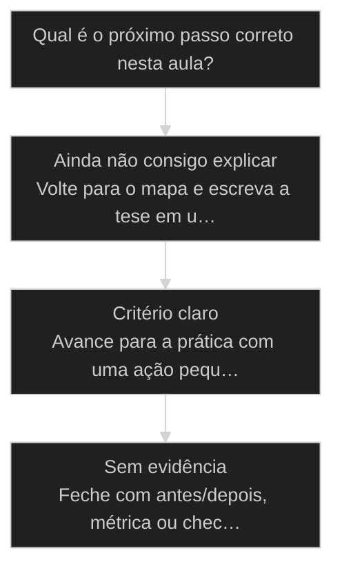
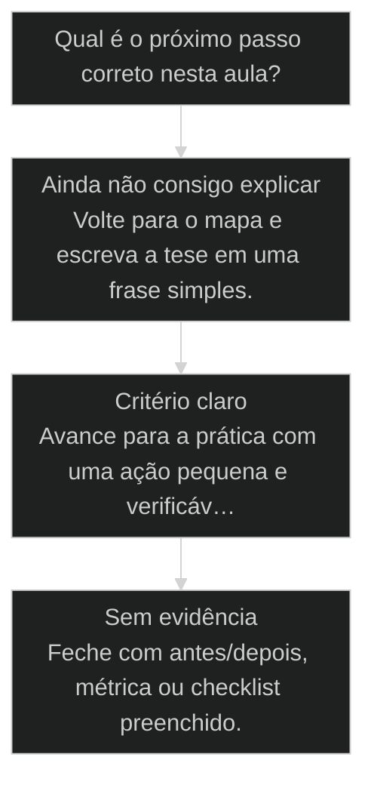

# Janela de contexto: o limite real e a degradação acima de 40K

← [[05-ambientes-local-staging-production|Local, Staging, Production]] · ↑ [[modulos/Módulo 2 - Setup e Contexto|M2]] · ⌂ [[Cursos/AIOX Advanced/README|Curso]] · → [[17-engenharia-de-contexto|Engenharia de contexto: limpar comandos, skills e MCPs]]

## Conceitos

- [[Janela de Contexto]]
- [[Engenharia de Contexto]]

## Mapa desta aula

Decisão-chave da aula — Qual é o próximo passo correto nesta aula?



> Leia o diagrama antes do texto longo. Depois volte e confira.

> O número que ninguém te conta. 1M de contexto é propaganda; a qualidade cai bem antes do máximo. Como diagnosticar e o que fazer quando bate.

**Objetivos de aprendizagem:**
- Explicar por que a janela anunciada não é a janela útil e onde a qualidade degrada. _(understand)_
- Diagnosticar context bloat numa sessão usando o comando /context. _(apply)_
- Decidir quando limpar, exportar ou recomeçar a sessão antes de degradar. _(apply)_

---

## O que você consegue no fim desta aula

*G · Destino*

Destino claro antes do conteúdo técnico.

Você explica por que contexto demais degrada, estima ocupação grosseira da janela,
e decide o que cortar primeiro. Resultado: lista do que sai da janela no teu projeto hoje.

- **Destino**: [[Janela de Contexto|Janela de contexto]]: o limite real e a degradação acima de 40K
- **Como saber que chegou**: Exercício final da aula com evidência escrita.

---

## O ponto de partida real

*P · Onde você está*

Empatia com o sintoma — sem moralismo.

A ilusão é 'quanto mais contexto melhor'. Aí o modelo fica genérico, confunde
arquivos, e você acha que é alucinação mística. Não é. É saturação. Se já sentiu a
qualidade cair no meio de uma sessão longa, você já encontrou o teto da janela na pele.

> **Âncora**: Se o sintoma não for o seu, anote o do seu time — a aula ainda vale como mapa.

---

## Janela de contexto: o limite real

*Conceito · M2 Setup · Por Alan Nicolas*

Te vendem 1M de contexto. O que ninguém te conta é que a qualidade começa a cair muito antes do máximo. Quem não sabe disso culpa o modelo; quem sabe, gerencia a janela.

- **1M**: o número anunciado que vira propaganda
- **~40K**: onde a degradação já começa a aparecer
- **/context**: o comando que mostra onde você está

- **status**: aiox advanced · m2 setup
- **meta**: principio=janela-de-contexto
- **meta**: fonte=aula-02 + aula-08 + t2-aula-1
- **ready**: run /context

**Legenda de cores**

Os estados da janela

- **Bloat** (pain): contexto inchado, o modelo perde o fio
- **Janela útil** (signal): a faixa onde a atenção ainda é nítida
- **Propaganda** (insight): o anunciado não é o que funciona
- **/context** (bench): mostra onde você está na janela
- **Gerenciar** (action): limpar e recomeçar antes de degradar

---

## Da cohort: 2M no TEAM, tasks isoladas

*T1 + T2 · WhatsApp*

Realidade do grupo Advanced — não é slide, é cicatriz.

Pergunta recorrente na turma: 'já dá pra usar 1M de contexto numa sessão?'

Resposta de campo do Alan: numa sessão de **TEAM** a soma pode ir a ~**2M**, porque
as **tasks são isoladas**. Isso não é licença para entupir um único agente — é
arquitetura de isolamento.

Outro padrão da cohort: quando Max semanal acaba, a conversa vira API e pânico.
A resposta madura volta para esta aula + [[Token Economy|economia de tokens]]: janela limpa e
trabalho mecânico fora do modelo top.

> **Âncora de campo**: Contexto de time soma; contexto de um agente sujo só degrada.

> **Materiais / FAQ**: Material: REACTIVE-COMPACT-VS-CONTEXT-COLLAPSE.md · GUIA-AUTONOMIA-ECONOMIA-TOKENS.md

---

## A janela anunciada é propaganda

O número grande no marketing mede a capacidade máxima, não a qualidade. A atenção do modelo se dilui conforme a janela enche, e o output piora bem antes do limite anunciado.

> **A regra que sustenta a aula**: 1M de contexto não significa 1M de qualidade. A janela útil, onde o modelo ainda mantém o fio, é uma fração do anunciado. Quando o output começa a alucinar ou esquecer instruções, não é o modelo que ficou burro: é a janela que encheu.

**Quem ignora a janela**
- Empilha tudo numa sessão só, sem limpar nunca.
- Cola arquivos gigantes inteiros no contexto.
- Culpa o modelo quando ele esquece a instrução.
- Acha que mais contexto é sempre mais capacidade.

**Quem gerencia a janela**
- Roda /context para ver onde está na janela.
- Carrega só o trecho relevante, não o arquivo inteiro.
- Limpa ou exporta quando a qualidade começa a cair.
- Trata a janela útil como recurso escasso.

> **Pedro Valério (co-founder, aula-02)**: Roda o /context aqui pra vocês verem. Olha como ele mostra o que está ocupando a janela: o system prompt, os arquivos lidos, o histórico. Quando isso incha, o modelo começa a perder o fio. Não é mágica, é ocupação.

---

## O caminho da aula

Três movimentos: entender por que a janela útil é menor que a anunciada, ver o caso da sessão inchada, e diagnosticar a sua própria janela com /context.

**Os 3 movimentos**

1. **Janela útil vs anunciada**: onde a qualidade realmente degrada
2. **A sessão inchada**: o caso do output que começou a alucinar
3. **Diagnosticar com /context**: ver a ocupação e decidir o que fazer

- **Você vai sair sabendo** (Por que o número anunciado não é o número que funciona.; Os sintomas de context bloat antes de virar alucinação.; O que o /context mostra e como ler.)
- **Você vai sair fazendo**: O diagnóstico da sua própria sessão com /context e a decisão de limpar, exportar ou recomeçar.

---

## A sessão que começou a alucinar

Uma sessão longa, sem limpeza, foi enchendo a janela. O output não quebrou de uma vez: foi degradando, esquecendo instruções, até alucinar. O /context mostrou a causa.

- **Janela leve (início da sessão)**: 95%
- **Janela moderada (~40K)**: 75%
- **Janela pesada (instruções esquecidas)**: 50%
- **Janela saturada (alucinação)**: 25%

### Caso: O output que degradou sem avisar

Context bloat não dá tela de erro. O modelo só vai ficando menos nítido, até que um dia ele ignora a instrução que você repetiu três vezes.

- Começou como: Sessão longa, produtiva, sem nunca limpar o contexto.
- Virou: Output degradando: instruções esquecidas, repetições, e por fim alucinação.
- Prova: O /context mostrou a janela quase cheia de histórico e arquivos colados inteiros.
- Lição: A degradação é gradual e silenciosa. Quem não mede, atribui ao modelo.

---

## WHY / WHAT / HOW da gestão de janela

As 3 camadas que transformam a janela de inimigo invisível em recurso gerenciado.

- **1. WHY - A atenção do modelo é finita**: Quanto mais a janela enche, mais a atenção se dilui entre os tokens. A janela útil é a faixa onde o modelo ainda foca no que importa. Acima dela, ele perde o fio. [WHY, atenção finita]
- **2. WHAT - Janela útil, não anunciada**: O número que importa não é o teto de marketing, é a faixa onde a qualidade se mantém. Gerencie pela janela útil, que começa a degradar bem antes do máximo. [WHAT, janela útil]
- **3. HOW - Medir, limpar, recomeçar**: Rode /context para medir. Carregue só o trecho relevante. Quando a janela satura, exporte o que importa e recomece. Gestão de contexto é higiene, não exceção. [HOW, /context]

---

## A sequência do /context

Os passos concretos para diagnosticar e agir sobre a janela em uma sessão real.

**Diagnosticar e gerenciar a janela**
Use quando o output começa a esquecer instruções ou em qualquer sessão longa.
- `medir`
- `ler`
- `decidir`
- `recomeçar`
- `/context`: Roda o comando e vê a ocupação: system prompt, arquivos, histórico.
- `ler`: Identifica o que está inchando: arquivo colado inteiro, histórico longo.
- `decidir`: Limpa o que não serve, ou exporta o estado e recomeça limpo.
- `recomeçar`: Reabre carregando só o essencial. Output volta a ficar nítido.

**Do sintoma à janela limpa**

1. **Sintoma**: output esquece ou alucina.
2. **/context**: mede a ocupação real da janela.
3. **Limpar ou exportar**: remove o peso morto ou salva o estado.
4. **Recomeçar**: sessão limpa com só o essencial carregado.

- **Leve**: Início da sessão. Atenção nítida, pode trabalhar à vontade.
- **Moderada**: Ocupação subindo. Atenção ainda boa, mas comece a observar o /context.
- **Pesada**: Instruções esquecidas, repetições. Hora de limpar ou exportar.
- **Saturada**: Alucinação e perda do fio. Recomece a sessão agora, sem insistir.

---

## Não confunda os limites

Três confusões que levam o operador a empilhar contexto e degradar o output sem perceber.

- **Janela anunciada, não janela útil**: O 1M do marketing é o teto físico, não a faixa de qualidade.
- **Esquecimento do modelo, não burrice**: Quando o modelo ignora a instrução, parece que ficou pior.
- **Carregar o trecho, não o arquivo inteiro**: Colar o arquivo todo parece dar mais contexto.

**Colunas:** Situação | Sintoma | Causa real | Ação

- Instrução esquecida: modelo ignora regra repetida | janela diluída | rodar /context e limpar
- Repetição: modelo repete o que já disse | histórico longo | exportar e recomeçar
- Alucinação: modelo inventa fato | janela saturada | recomeçar limpo

---

## Caso benchmark: aplicar Janela de contexto: o limite real e a degradação acima de 40K em uma decisão real

Um segundo caso para tirar a aula do conceito isolado e mostrar como o operador transforma o princípio em decisão, execução e evidência.

- **O que mudou na operação**: A aula deixou de ser uma explicação e virou uma lente de decisão. O aluno sabe que sinal observar, qual rota escolher e que evidência precisa produzir. Players: sinal, rota, execução, evidência.
- **Por que isso eleva a qualidade**: O padrão espelha o [[Método S2S]]: capturar o sinal, estruturar o caminho, executar com limite e fechar com prova.

**Matriz de aplicação**

Use esta matriz quando a aula parecer clara, mas a ação ainda estiver vaga.

- **Sinal claro**: O aluno consegue nomear o que a aula ensina a observar.
- **Rota escolhida**: A próxima ação nasce de critério, não de vontade de testar ferramenta.
- **Risco visível**: O erro provável fica explícito antes de executar.
- **Prova mínima**: Existe uma evidência simples para dizer que avançou.

### Caso: Quando o conceito precisou virar critério de execução

O operador já tinha entendido a tese, mas ainda precisava decidir o próximo passo sem cair em improviso.

- Começou como: Conceito entendido em teoria, sem critério de aplicação na task real.
- Virou: Decisão roteada por sinais, riscos, evidências e próximo passo verificável.
- Prova: A saída passou a ter ação, dono, critério e evidência de fechamento.
- Lição: Aula de qualidade não termina em entendimento. Termina quando o aluno consegue agir com critério.

---

## Router de decisão da aula

O ponto em que Janela de contexto: o limite real e a degradação acima de 40K deixa de ser explicação e vira escolha operacional.

**Árvore de decisão**
_Não escolha comando antes de nomear o tipo de situação._



- **Ainda não consigo explicar** — O aluno repete a frase da aula, mas não consegue aplicar em exemplo próprio.
  → _Volte para o mapa e escreva a tese em uma frase simples._
- **Critério claro** — O aluno identifica sinal, risco e decisão antes da ferramenta.
  → _Avance para a prática com uma ação pequena e verificável._
- **Sem evidência** — A ação foi feita, mas não existe prova de melhoria ou decisão registrada.
  → _Feche com antes/depois, métrica ou checklist preenchido._

**Gate:** Você sabe qual rota seguir e como provar que avançou? — _Se a resposta ainda depende de opinião, volte uma etapa._

#### Entender o princípio
Quando a aula ainda parece uma tese abstrata.
1. **Nomear: escreva a tese em uma frase.
2. **Exemplo: traga um caso próprio pequeno.
3. **Risco: diga o erro que a aula evita.

#### Aplicar em uma task
Quando o critério está claro e falta execução.
1. **Escolher: defina a menor ação verificável.
2. **Executar: faça sem expandir escopo.
3. **Provar: registre o delta produzido.

#### Revisar a decisão
Quando a execução aconteceu, mas a evidência ficou fraca.
1. **Comparar: olhe antes e depois.
2. **Ajustar: corrija a menor falha.
3. **Fechar: só conclua com prova.

**Colunas:** Estado | Pergunta | Sinal saudável | Sinal de risco

- Entendimento: Consigo explicar sem copiar a aula? | frase própria e exemplo próprio | repetição bonita sem aplicação
- Decisão: Escolhi rota antes da ferramenta? | sinal e risco nomeados | comando escolhido por hábito
- Prova: Tenho evidência de avanço? | antes/depois ou checklist | sensação de que ficou melhor

---

## Processo operacional mínimo

A sequência mínima para aplicar Janela de contexto: o limite real e a degradação acima de 40K sem transformar a aula em teoria solta.

**Aula → Task → Evidência**
Rota curta para transformar o conceito em ação repetível.
- **Plan**: Nomeie o sinal da aula, o risco que ela evita e o artefato que será produzido.
- **Do**: Execute a menor ação que prova o conceito sem abrir novo escopo.
- **Check**: Compare a saída com o critério de aceite da aula.
- **Act**: Registre a regra aprendida e remova o que não será reutilizado.

**Aplicar com evidência**
Use quando a aula fizer sentido, mas a task ainda estiver sem formato.
- `sinal`
- `risco`
- `ação`
- `prova`
- `sinal`: O que esta aula me ensinou a perceber?
- `risco`: Que erro acontece se eu ignorar esse sinal?
- `ação`: Qual é a menor execução que testa o princípio?
- `prova`: Que evidência mostra que a decisão melhorou?

**Do conceito ao comportamento**

1. **Conceito**: entender a tese central da aula.
2. **Critério**: transformar a tese em pergunta de decisão.
3. **Ação**: executar a menor tarefa que prova avanço.
4. **Memória**: registrar o padrão para repetir depois.

---

## Distinções que evitam falsa competência

Três diferenças que protegem Janela de contexto: o limite real e a degradação acima de 40K de virar jargão ou checklist vazio.

**Parece que aprendeu**
- Repete a tese da aula sem exemplo próprio.
- Escolhe ferramenta antes de escolher critério.
- Fecha a task porque executou algo.

**Aprendeu de verdade**
- Explica o princípio em uma situação própria.
- Escolhe rota, risco e evidência antes do comando.
- Fecha a task quando existe prova de avanço.

- **entender com aplicar**: Entender é conseguir repetir a ideia.
- **ação com evidência**: Fazer algo gera movimento.
- **checklist com processo**: Checklist pode ser preenchido no automático.

**Exemplo preenchido: saída esperada do aluno**

- **Tese**: A aula me ensinou a observar um sinal específico antes de escolher ferramenta.
- **Risco**: Se eu pular esse critério, executo rápido e descubro tarde que a direção estava errada.
- **Ação**: Vou aplicar em uma task pequena, com escopo fechado e antes/depois visível.
- **Prova**: A entrega só fecha quando eu consigo mostrar o critério usado e o delta gerado.

---

## Prática: diagnostique a sua janela

Rode /context na sua sessão atual, leia a ocupação, e decida o que fazer antes de degradar.

**Checklist da janela (rode antes de sessões longas)**
```yaml
# Higiene de contexto. Rode /context e preencha.
ocupacao:
  system_prompt: "{leve | medio | pesado}"
  arquivos_carregados: "{quantos, e se sao trechos ou arquivos inteiros}"
  historico: "{curto | longo}"
sintomas:
  esquece_instrucao: "{sim | nao}"
  repete: "{sim | nao}"
  alucina: "{sim | nao}"
acao: "{seguir | limpar | exportar-e-recomecar}"

```

> **Portão da aula**: Antes de seguir para a próxima aula: você rodou /context na sua sessão, leu o que ocupa a janela e decidiu uma ação (seguir, limpar ou recomeçar). Se você nunca rodou /context, rode agora antes de passar.

- 1. **Rode /context**: Na sua sessão atual, rode o comando /context e olhe a ocupação da janela.
- 2. **Identifique o peso**: Veja o que mais ocupa: system prompt, arquivos colados, ou histórico longo.
- 3. **Classifique o estado**: A janela está leve, moderada ou saturada? Há sinal de esquecimento no output?
- 4. **Decida a ação**: Limpar o peso morto, exportar o estado, ou recomeçar a sessão limpa.
- 5. **Recarregue só o essencial**: Ao recomeçar, carregue apenas o trecho relevante para a task atual.

---

## Glossário

Os termos desta aula em uma frase cada.

- **Janela de contexto**: O total de tokens que o modelo consegue considerar de uma vez. Tem um teto e uma faixa útil menor.
- **Janela anunciada**: O número de marketing (ex: 1M). Mede o teto físico, não a qualidade.
- **Janela útil**: A faixa onde a atenção do modelo ainda é nítida. Degrada bem antes do teto.
- **Context bloat**: Janela inchada de histórico e arquivos. Causa esquecimento e alucinação de forma gradual.
- **/context**: O comando que mostra a ocupação da janela: system prompt, arquivos e histórico.

> **Próxima aula**: Você sabe diagnosticar a janela. A seguir, a [[Engenharia de Contexto|engenharia de contexto]]: como limpar comandos, skills e MCPs para reduzir a ocupação mantendo a capacidade.

***


---

## Navegação

← [[05-ambientes-local-staging-production|Local, Staging, Production]] · ↑ [[modulos/Módulo 2 - Setup e Contexto|M2]] · ⌂ [[Cursos/AIOX Advanced/README|Curso]] · → [[17-engenharia-de-contexto|Engenharia de contexto: limpar comandos, skills e MCPs]]
