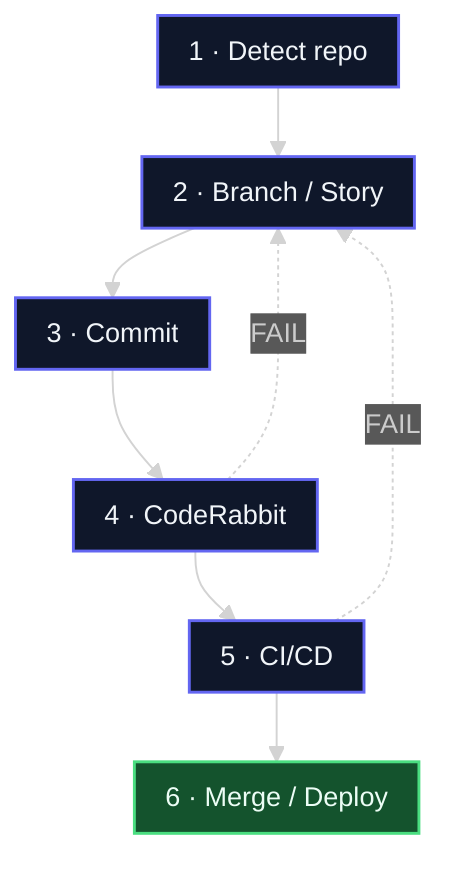
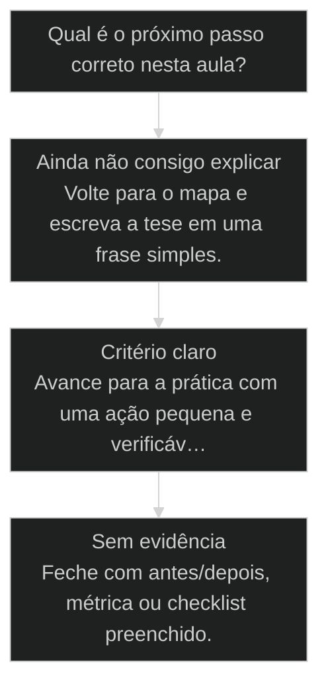

# Ciclo do repositório: Detect Repo, GitHub, CodeRabbit, CI/CD

← [[06-code-rabbit-boost|Code Rabbit Boost]] · ↑ [[modulos/Módulo 3 - Ciclo SDC|M3]] · ⌂ [[Cursos/AIOX Advanced/README|Curso]] · → [[20-determinismo-progressivo|Determinismo Progressivo: 30, 60, 90]]

## Conceitos

- [[Local Staging Production]]
- [[CodeRabbit]]

## Mapa desta aula

Do detect ao deploy — tudo amarrado ao git. FAIL volta para a branch/story.



> Leia o diagrama antes do texto longo. Depois volte e confira.

> Como amarrar o ciclo SDC à infraestrutura git mais CI. O repositório vira o contrato que segura o trabalho do agente.

**Objetivos de aprendizagem:**
- Explicar por que o repositório git é o contrato que segura o trabalho do ciclo SDC. _(understand)_
- Descrever as 4 fases do ciclo do repositório: detect, setup, review, deploy. _(understand)_
- Executar o setup de um repositório novo com o ciclo completo amarrado. _(apply)_

---

## O que você consegue no fim desta aula

*G · Destino*

Destino claro antes do conteúdo técnico.

Você descreve o ciclo Detect→branch→commit→[[CodeRabbit]]→CI→merge/deploy e aponta
onde o teu repo fura o bloqueio. Resultado: checklist de 6 etapas com status no teu projeto.

- **Destino**: Ciclo do repositório: Detect Repo, GitHub, CodeRabbit, CI/CD
- **Como saber que chegou**: Exercício final da aula com evidência escrita.

---

## O ponto de partida real

*P · Onde você está*

Empatia com o sintoma — sem moralismo.

Agente sem git é teatro. Se o trabalho não amarra em branch, review e CI, você
só teve uma conversa cara. O sintoma clássico: funciona local, some no merge, ninguém
sabe quem quebrou. Beleza — vamos grudar o ciclo no osso.

> **Âncora**: Se o sintoma não for o seu, anote o do seu time — a aula ainda vale como mapa.

---

## Ciclo do repositório

*Processo · M3 Ciclo SDC · Por Alan Nicolas*

O agente produz código o dia inteiro. Sem o repositório amarrado ao ciclo, esse código é fumaça: ninguém revisa, ninguém valida, ninguém entrega. O ciclo do repositório transforma trabalho solto em contrato auditável.

- **4 fases**: detect, setup, review, deploy
- **1 contrato**: git segura cada passo do trabalho
- **end-to-end**: do repo vazio ao deploy validado

- **status**: aiox advanced · m3 sdc
- **meta**: principio=ciclo-do-repositorio
- **meta**: fonte=aula-06 + aula-02 + t2-aula-4
- **ready**: detect to deploy

**Legenda de cores**

As 4 fases do ciclo

- **Detect Repo** (signal): reconhecer o estado antes de agir
- **Setup GitHub** (insight): conectar remoto e autoria
- **CodeRabbit** (bench): reviewer automático no PR
- **CI/CD** (action): pipeline que valida e entrega
- **Sem amarra** (pain): trabalho sem git vira fumaça

---

## O repositório é o contrato

Git não é backup, é contrato. Cada commit é uma promessa rastreável. Cada PR é um ponto de revisão. Sem essa amarra, o trabalho do agente não tem onde se ancorar nem como ser auditado.

> **A regra que sustenta a aula**: O ciclo SDC só vale quando amarrado ao repositório. Story vira branch, trabalho vira commit, entrega vira PR revisado, deploy vira pipeline. Sem git no centro, o agente produz e ninguém consegue dizer o que mudou, quem revisou, ou se está pronto.

**Trabalho solto**
- Agente edita arquivos sem branch nem commit.
- Ninguém sabe o que mudou entre uma sessão e outra.
- Revisão é olhar no olho, sem PR nem reviewer.
- Deploy é copiar arquivo na mão, sem pipeline.

**Trabalho amarrado ao repo**
- Cada story vira branch, cada passo vira commit.
- O diff conta a história do que mudou e por quê.
- CodeRabbit revisa o PR antes do humano.
- CI/CD valida e entrega de forma determinística.

> **Pedro Valério (co-founder, aula-06)**: Eu vou montar o ciclo do repositório do zero aqui, end-to-end. Detecta o repo, conecta no GitHub, bota o CodeRabbit pra revisar, amarra o CI/CD. No fim, o agente não toca em nada que não passe por esse contrato.

---

## O caminho da aula

Três movimentos: entender o repositório como contrato, ver o setup end-to-end ao vivo, e montar o seu próprio ciclo num repo novo.

**As 4 fases em ordem**

1. **Detect Repo**: reconhece se é repo novo, existente, com ou sem remoto.
2. **Setup GitHub**: cria o remoto, conecta, define a autoria do trabalho.
3. **CodeRabbit**: liga o reviewer automático no fluxo de PR.
4. **CI/CD**: amarra o pipeline que valida e entrega.

- **Você vai sair sabendo** (Por que git é contrato e não backup.; O que cada uma das 4 fases entrega.; Onde o CodeRabbit e o CI/CD entram no fluxo.)
- **Você vai sair fazendo**: O setup de um repositório novo do zero, com detect, GitHub, CodeRabbit e CI/CD amarrados.

---

## O setup end-to-end ao vivo

Pedro montou o ciclo do zero numa aula: repo vazio, GitHub conectado, CodeRabbit revisando, CI/CD entregando. O que parecia infraestrutura virou uma sequência de 4 passos.

> **Klaus (operação, t2-aula-4)**: O CI/CD não é luxo. É o que garante que o que o agente escreveu roda, passa nos testes, e chega na produção do mesmo jeito toda vez. Sem pipeline, cada deploy é uma aposta.

### Caso: Do repo vazio ao deploy validado

Montar o ciclo parece tarefa de especialista de infra. Em 4 passos ordenados, vira rotina que qualquer operador faz no início de cada projeto.

- Começou como: Um diretório com código solto, sem git, sem remoto, sem revisão.
- Virou: Um repositório com GitHub, CodeRabbit no PR e CI/CD validando cada entrega.
- Prova: A partir do setup, nenhum código chega à produção sem passar pelo contrato.
- Lição: O ciclo do repositório é uma sequência de 4 passos, não um projeto de infra.

---

## O que cada fase protege

Cada fase do ciclo fecha um buraco diferente. Pular uma deixa um flanco aberto que aparece como retrabalho ou deploy quebrado.

**Colunas:** Fase | O que protege | Sintoma se pular | Sinal de saúde

- Detect Repo: agir no estado errado | comando que falha por contexto errado | estado do repo conhecido antes de agir
- Setup GitHub: trabalho sem rastro | ninguém sabe quem mudou o quê | remoto e autoria amarrados
- CodeRabbit: erro chegando no humano | review manual cansado deixa passar bug | reviewer automático no PR
- CI/CD: deploy quebrado | funciona na minha máquina e quebra em produção | pipeline valida e entrega igual

- **Sem nenhuma fase amarrada**: retrabalho máximo
- **Com Detect + GitHub**: rastro garantido
- **Com CodeRabbit no PR**: bugs filtrados
- **Com CI/CD completo**: deploy confiável

---

## Pipeline: as 4 fases com gate

Cada fase tem um output e um gate. Não avança para a próxima sem fechar a anterior. É isso que faz o ciclo ser contrato e não sugestão.

**1. Detect Repo**
Reconhece o estado: é repo novo ou existente? Tem remoto? Tem branch principal definida?
- **Output**: estado-do-repo: novo | existente, com/sem remoto
- **Gate**: Você sabe o estado antes de rodar qualquer comando que assume contexto?

**2. Setup GitHub**
Cria o repositório remoto, conecta, define a autoria do trabalho e a branch principal.
- **Output**: remoto conectado, autoria e branch definidas
- **Gate**: Um push chega no remoto certo com a autoria correta?

**3. CodeRabbit**
Liga o reviewer automático para revisar cada PR antes do humano olhar.
- **Output**: CodeRabbit ativo no fluxo de PR
- **Gate**: Abrir um PR dispara a revisão automática?

**4. CI/CD**
Amarra o pipeline que roda testes, valida e entrega de forma determinística.
- **Output**: pipeline que valida e faz deploy
- **Gate**: Um merge dispara a validação e a entrega igual toda vez?

---

## A sequência de setup

Os passos concretos para amarrar um repositório novo ao ciclo, em ordem.

**Amarrar um repositório novo ao ciclo**
Use no início de todo projeto novo, antes de o agente tocar no código.
- `detect`
- `github`
- `coderabbit`
- `cicd`
- `detect`: Verifica se há git, remoto e branch principal. Define o estado de partida.
- `github`: Cria o repositório no GitHub, conecta o remoto, ajusta a autoria.
- `coderabbit`: Instala o CodeRabbit para revisar cada PR automaticamente.
- `cicd`: Configura o pipeline de CI/CD para validar e entregar.

**Do estado detectado ao deploy**

1. **Detect**: estado do repo conhecido.
2. **GitHub**: remoto e autoria amarrados.
3. **CodeRabbit**: PR revisado automaticamente.
4. **CI/CD**: validação e deploy determinísticos.

---

## Estados do repositório

Detect Repo existe porque um repositório pode estar em vários estados. Cada estado pede uma ação diferente na hora de amarrar o ciclo.

- **Repo novo, sem git**: Inicializa git, cria remoto, amarra o ciclo do zero.
- **Git local, sem remoto**: Cria o GitHub e conecta o remoto, depois liga review e CI/CD.
- **Remoto sem CodeRabbit**: O git está pronto; falta o reviewer e o pipeline.
- **Tudo amarrado**: Ciclo completo. Cada PR passa por review e CI/CD.

**Não faça**
- Rodar comando que assume remoto antes de detectar o estado.
- Pular o CodeRabbit e revisar tudo no olho.
- Fazer deploy na mão sem pipeline determinístico.

**Faça**
- Detectar o estado do repo antes de qualquer setup.
- Deixar o CodeRabbit filtrar o PR antes do humano.
- Amarrar o CI/CD para deploy igual toda vez.

- **Git como contrato, não git como backup**: Backup é guardar uma cópia para emergência.
- **CodeRabbit antes do humano, não no lugar do humano**: O reviewer automático parece substituir a revisão.
- **CI/CD determinístico, não deploy na sorte**: Funciona na minha máquina parece prova suficiente.

---

## Caso benchmark: aplicar Ciclo do repositório: Detect Repo, GitHub, CodeRabbit, CI/CD em uma decisão real

Um segundo caso para tirar a aula do conceito isolado e mostrar como o operador transforma o princípio em decisão, execução e evidência.

- **O que mudou na operação**: A aula deixou de ser uma explicação e virou uma lente de decisão. O aluno sabe que sinal observar, qual rota escolher e que evidência precisa produzir. Players: sinal, rota, execução, evidência.
- **Por que isso eleva a qualidade**: O padrão espelha o [[Método S2S]]: capturar o sinal, estruturar o caminho, executar com limite e fechar com prova.

**Matriz de aplicação**

Use esta matriz quando a aula parecer clara, mas a ação ainda estiver vaga.

- **Sinal claro**: O aluno consegue nomear o que a aula ensina a observar.
- **Rota escolhida**: A próxima ação nasce de critério, não de vontade de testar ferramenta.
- **Risco visível**: O erro provável fica explícito antes de executar.
- **Prova mínima**: Existe uma evidência simples para dizer que avançou.

### Caso: Quando o conceito precisou virar critério de execução

O operador já tinha entendido a tese, mas ainda precisava decidir o próximo passo sem cair em improviso.

- Começou como: Conceito entendido em teoria, sem critério de aplicação na task real.
- Virou: Decisão roteada por sinais, riscos, evidências e próximo passo verificável.
- Prova: A saída passou a ter ação, dono, critério e evidência de fechamento.
- Lição: Aula de qualidade não termina em entendimento. Termina quando o aluno consegue agir com critério.

---

## Router de decisão da aula

O ponto em que Ciclo do repositório: Detect Repo, GitHub, CodeRabbit, CI/CD deixa de ser explicação e vira escolha operacional.

**Árvore de decisão**
_Não escolha comando antes de nomear o tipo de situação._



- **Ainda não consigo explicar** — O aluno repete a frase da aula, mas não consegue aplicar em exemplo próprio.
  → _Volte para o mapa e escreva a tese em uma frase simples._
- **Critério claro** — O aluno identifica sinal, risco e decisão antes da ferramenta.
  → _Avance para a prática com uma ação pequena e verificável._
- **Sem evidência** — A ação foi feita, mas não existe prova de melhoria ou decisão registrada.
  → _Feche com antes/depois, métrica ou checklist preenchido._

**Gate:** Você sabe qual rota seguir e como provar que avançou? — _Se a resposta ainda depende de opinião, volte uma etapa._

#### Entender o princípio
Quando a aula ainda parece uma tese abstrata.
1. **Nomear: escreva a tese em uma frase.
2. **Exemplo: traga um caso próprio pequeno.
3. **Risco: diga o erro que a aula evita.

#### Aplicar em uma task
Quando o critério está claro e falta execução.
1. **Escolher: defina a menor ação verificável.
2. **Executar: faça sem expandir escopo.
3. **Provar: registre o delta produzido.

#### Revisar a decisão
Quando a execução aconteceu, mas a evidência ficou fraca.
1. **Comparar: olhe antes e depois.
2. **Ajustar: corrija a menor falha.
3. **Fechar: só conclua com prova.

**Colunas:** Estado | Pergunta | Sinal saudável | Sinal de risco

- Entendimento: Consigo explicar sem copiar a aula? | frase própria e exemplo próprio | repetição bonita sem aplicação
- Decisão: Escolhi rota antes da ferramenta? | sinal e risco nomeados | comando escolhido por hábito
- Prova: Tenho evidência de avanço? | antes/depois ou checklist | sensação de que ficou melhor

---

## Processo operacional mínimo

A sequência mínima para aplicar Ciclo do repositório: Detect Repo, GitHub, CodeRabbit, CI/CD sem transformar a aula em teoria solta.

**Aula → Task → Evidência**
Rota curta para transformar o conceito em ação repetível.
- **Plan**: Nomeie o sinal da aula, o risco que ela evita e o artefato que será produzido.
- **Do**: Execute a menor ação que prova o conceito sem abrir novo escopo.
- **Check**: Compare a saída com o critério de aceite da aula.
- **Act**: Registre a regra aprendida e remova o que não será reutilizado.

**Aplicar com evidência**
Use quando a aula fizer sentido, mas a task ainda estiver sem formato.
- `sinal`
- `risco`
- `ação`
- `prova`
- `sinal`: O que esta aula me ensinou a perceber?
- `risco`: Que erro acontece se eu ignorar esse sinal?
- `ação`: Qual é a menor execução que testa o princípio?
- `prova`: Que evidência mostra que a decisão melhorou?

**Do conceito ao comportamento**

1. **Conceito**: entender a tese central da aula.
2. **Critério**: transformar a tese em pergunta de decisão.
3. **Ação**: executar a menor tarefa que prova avanço.
4. **Memória**: registrar o padrão para repetir depois.

---

## Distinções que evitam falsa competência

Três diferenças que protegem Ciclo do repositório: Detect Repo, GitHub, CodeRabbit, CI/CD de virar jargão ou checklist vazio.

**Parece que aprendeu**
- Repete a tese da aula sem exemplo próprio.
- Escolhe ferramenta antes de escolher critério.
- Fecha a task porque executou algo.

**Aprendeu de verdade**
- Explica o princípio em uma situação própria.
- Escolhe rota, risco e evidência antes do comando.
- Fecha a task quando existe prova de avanço.

- **entender com aplicar**: Entender é conseguir repetir a ideia.
- **ação com evidência**: Fazer algo gera movimento.
- **checklist com processo**: Checklist pode ser preenchido no automático.

**Exemplo preenchido: saída esperada do aluno**

- **Tese**: A aula me ensinou a observar um sinal específico antes de escolher ferramenta.
- **Risco**: Se eu pular esse critério, executo rápido e descubro tarde que a direção estava errada.
- **Ação**: Vou aplicar em uma task pequena, com escopo fechado e antes/depois visível.
- **Prova**: A entrega só fecha quando eu consigo mostrar o critério usado e o delta gerado.

---

## Prática: amarre um repositório novo

Pegue um projeto novo e amarre o ciclo completo: detecte o estado, conecte o GitHub, ligue o CodeRabbit e configure o CI/CD.

**Checklist do ciclo (uma marca por fase)**
```yaml
# Amarre na ordem. So avance com a fase anterior fechada.
detect_repo:
  estado: "{novo | local-sem-remoto | remoto-sem-review | completo}"
  ok: false
setup_github:
  remoto_conectado: false
  autoria_definida: false
coderabbit:
  ativo_no_pr: false
cicd:
  pipeline_valida: false
  deploy_deterministico: false

```

> **Portão da aula**: Antes de seguir para a próxima aula: você amarrou um repositório novo ao ciclo completo, com detect, GitHub, CodeRabbit e CI/CD, e validou com um PR de teste. Se alguma fase ficou aberta, feche antes de passar.

- 1. **Detecte o estado**: Verifique se o projeto tem git, remoto e branch principal. Anote o estado de partida.
- 2. **Conecte o GitHub**: Crie o repositório remoto, conecte e ajuste a autoria do trabalho.
- 3. **Ligue o CodeRabbit**: Instale o CodeRabbit para revisar cada PR antes do humano.
- 4. **Configure o CI/CD**: Amarre um pipeline mínimo que rode testes e faça o deploy.
- 5. **Valide o ciclo**: Abra um PR de teste e confirme que dispara review e que o merge dispara o pipeline.

---

## Glossário

Os termos desta aula em uma frase cada.

- **Ciclo do repositório**: As 4 fases que amarram o trabalho do agente ao git: detect, GitHub, CodeRabbit, CI/CD.
- **Detect Repo**: Reconhecer o estado do repositório (novo, sem remoto, completo) antes de agir.
- **Setup GitHub**: Criar o remoto, conectar e definir a autoria do trabalho no repositório.
- **CodeRabbit**: Reviewer automático que revisa cada PR antes do humano olhar.
- **CI/CD**: Pipeline que valida com testes e entrega o deploy de forma determinística.

> **Próxima aula**: Com o repositório amarrado ao ciclo, o trabalho do agente tem contrato. A seguir, M4 entra no determinismo e no comando: como travar a IA no caminho certo, etapa por etapa.

***


---

## Navegação

← [[06-code-rabbit-boost|Code Rabbit Boost]] · ↑ [[modulos/Módulo 3 - Ciclo SDC|M3]] · ⌂ [[Cursos/AIOX Advanced/README|Curso]] · → [[20-determinismo-progressivo|Determinismo Progressivo: 30, 60, 90]]
