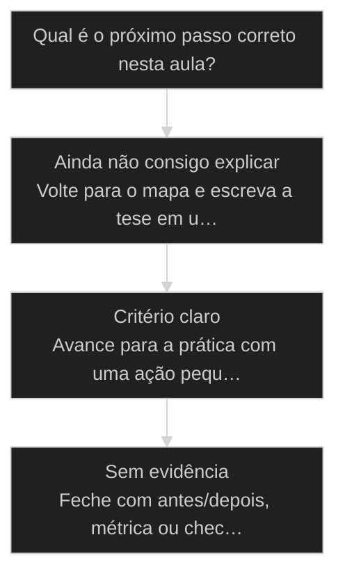
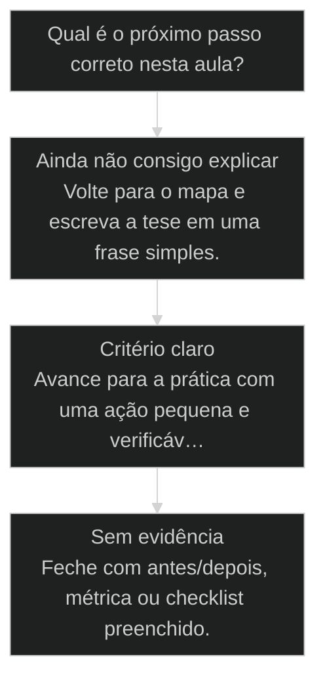

# Determinístico primeiro, LLM só onde gera ouro

← [[20-determinismo-progressivo|Determinismo Progressivo: 30, 60, 90]] · ↑ [[modulos/Módulo 4 - Determinismo e Comando|M4]] · ⌂ [[Cursos/AIOX Advanced/README|Curso]] · → [[11-goal-vs-loop|Goal vs Loop]]

## Conceitos

- [[Determinismo Progressivo]]

## Mapa desta aula

Decisão-chave da aula — Qual é o próximo passo correto nesta aula?



> Leia o diagrama antes do texto longo. Depois volte e confira.

> A heurística que sustenta [[Runner]], ETL local e Skills. Código onde há regra; IA só onde há ambiguidade que vale o token.

**Objetivos de aprendizagem:**
- Explicar a heurística determinístico primeiro e onde a LLM gera ouro de verdade. _(understand)_
- Diferenciar tarefa de regra clara de tarefa com ambiguidade que justifica LLM. _(understand)_
- Classificar 3 tarefas próprias entre determinístico e LLM-required, com justificativa. _(apply)_

---

## O que você consegue no fim desta aula

*G · Destino*

Destino claro antes do conteúdo técnico.

Você separa o que deve ser script/runner do que merece LLM, com 3 exemplos do teu
contexto. Resultado: lista do que tirar da IA e do que deixar nela.

- **Destino**: Determinístico primeiro, LLM só onde gera ouro
- **Como saber que chegou**: Exercício final da aula com evidência escrita.

---

## O ponto de partida real

*P · Onde você está*

Empatia com o sintoma — sem moralismo.

Usar LLM pra renomear arquivo é status anxiety. Usar script pra decisão de produto
é covardia disfarçada de engenharia. O sweet spot é brutal: determinístico primeiro;
LLM só onde gera ouro. Se você ainda gasta token em trabalho de faxineiro, bora corrigir.

> **Âncora**: Se o sintoma não for o seu, anote o do seu time — a aula ainda vale como mapa.

---

## Determinístico primeiro, LLM só onde gera ouro

*Princípio · M4 Determinismo · Por Alan Nicolas*

O reflexo do iniciante é jogar IA em tudo. A heurística do operador é o contrário: código determinístico é o default; a LLM entra só onde gera ouro que o código não gera. É o que sustenta Runner, ETL e Skills.

- **Default**: código determinístico em primeiro lugar
- **Exceção**: LLM só onde a ambiguidade vale o token
- **3 pilares**: Runner, ETL local e Skills sustentados pela regra

- **status**: aiox advanced · m4 determinismo
- **meta**: principio=deterministico-primeiro
- **meta**: fonte=aula-07 + aula-08 + t2-aula-3
- **ready**: code unless gold

**Legenda de cores**

O default e a exceção

- **Determinístico** (signal): regra clara, saída fixa: código
- **LLM gera ouro** (action): julgamento, linguagem, ambiguidade
- **Heurística** (insight): default código, exceção justificada
- **Runner/ETL/Skill** (bench): onde a regra sustenta a arquitetura
- **IA por reflexo** (pain): LLM onde código resolveria

---

## Da cohort: transformar [[Squad|squad]] em programação

*T1 + T2 · WhatsApp*

Realidade do grupo Advanced — não é slide, é cicatriz.

Alan descreveu, ainda no T1, a função que analisa o squad e converte o que for
determinístico em código executável — menos token, mais confiança, mais velocidade.

Isso é o manifesto desta aula em uma frase de produto real. A cohort não precisa
'acreditar' em determinismo primeiro: viu o fundador priorizar exatamente isso
enquanto preparava o PRO.

> **Âncora de campo**: Se ainda gasta modelo top em passo de faxina, o squad ainda não foi lido com honestidade.

> **Materiais / FAQ**: Ligar com 30 Runner e 01 [[Token Economy]] · material 1.0-runners-101.md

---

## O default é código

A LLM é cara, lenta e varia. O código é barato, rápido e fixo. Então o default é código, e a IA é a exceção que você justifica: ela entra onde gera valor que o código não consegue gerar.

> **A regra que sustenta a aula**: Antes de jogar uma tarefa na LLM, pergunte se a regra é clara. Se é, código resolve melhor: barato, rápido, sem variância. A IA é para o que tem ambiguidade real, julgamento ou linguagem. Determinístico primeiro; LLM só onde gera ouro.

**IA por reflexo**
- Joga toda tarefa na LLM porque é o que sabe usar.
- Paga token e aceita variância até em regra fixa.
- Usa IA pra converter formato e renomear arquivo.
- Acha que a IA é sempre a ferramenta mais capaz.

**Determinístico primeiro**
- Pergunta se a regra é clara antes de pensar em IA.
- Resolve regra fixa com código determinístico.
- Reserva a LLM para ambiguidade, julgamento e linguagem.
- Justifica cada uso de IA por ouro que o código não dá.

> **Por que isso sustenta a arquitetura**: Runner roda pipelines determinísticos. ETL local transforma dados com scripts. Skills embutem scripts para garantir qualidade. Os três nascem da mesma heurística: código onde dá, IA só onde gera ouro.

---

## O caminho da aula

Três movimentos: entender por que código é o default, ver o caso da tarefa que voltou pro código, e classificar tarefas suas entre determinístico e LLM.

**Os 3 movimentos**

1. **Código é o default**: barato, rápido, fixo; a IA é a exceção justificada.
2. **A tarefa na IA errada**: o que pedia código e estava na LLM.
3. **Classificar**: determinístico ou LLM-required, por critério.

- **Você vai sair sabendo** (Por que código vence a IA em regra clara.; O que conta como ouro que só a LLM gera.; Como justificar cada uso de IA por critério.)
- **Você vai sair fazendo**: A classificação de 3 tarefas suas entre determinístico e LLM-required, com justificativa escrita.

---

## A transformação que voltou pro código

Uma transformação de formato estava sendo feita pela LLM, com custo e variância. A regra era clara. Voltou pra um script determinístico e a variância sumiu, o custo caiu.

- **Regra clara em código**: 95%
- **Regra clara na LLM**: 40%
- **Ambiguidade real na LLM**: 90%
- **Ambiguidade real em código**: 30%

### Caso: Regra clara não é trabalho de IA

Quando a transformação tem regra fixa, a LLM só adiciona custo e variância. O código faz igual, sempre, por quase nada.

- Começou como: Transformação de formato feita por um agent de LLM a cada execução.
- Virou: A mesma transformação num script determinístico, com saída idêntica sempre.
- Prova: A LLM às vezes mudava o formato de saída; o script nunca varia.
- Lição: Regra clara é trabalho de código. A IA fica para o que o código não resolve.

---

## WHY / WHAT / HOW da heurística

As 3 camadas que transformam o reflexo de IA-primeiro em código-primeiro com exceção justificada.

- **1. WHY - Código é barato, rápido e fixo**: A LLM custa token, demora e varia. O código não. Em regra clara, o código vence em todas as dimensões. Pagar IA onde código resolve é desperdício que escala com o uso. [WHY, custo e variância]
- **2. WHAT - Ouro é o que o código não dá**: A LLM gera ouro onde há ambiguidade real, julgamento ou linguagem. Isso o código não resolve. O ouro justifica o token; a regra clara não. [WHAT, ouro real]
- **3. HOW - O teste da regra**: Antes de pedir pra IA, tente escrever a regra inteira. Se você consegue, é código. Se a regra não fecha sozinha (depende de julgamento ou linguagem), aí a LLM gera ouro. [HOW, teste da regra]

---

## Onde a heurística vive na arquitetura

A heurística não é abstrata: ela molda o Runner, o ETL local e as Skills. Cada um usa código onde a regra é clara e LLM só na borda de ambiguidade.

- **Runner**: Executor de pipeline determinístico. Cada passo é código; a LLM entra só num passo que exige julgamento.
- **ETL local**: Extrai, transforma e carrega com scripts. A IA só onde o dado é ambíguo e precisa de interpretação.
- **Skills**: Skill embute scripts para garantir qualidade. O determinístico faz o trabalho pesado; a IA orquestra.

**Matriz regra x valor da IA**

Os quadrantes que decidem código ou LLM.

- **Regra clara + sem ambiguidade**: Código. A IA só adiciona custo e variância.
- **Regra clara + linguagem na saída**: Código gera o dado, LLM formata a linguagem no fim.
- **Ambiguidade real + julgamento**: LLM. É onde ela gera ouro que o código não dá.
- **Sem regra e sem ambiguidade útil**: Pare. A tarefa não está definida o suficiente para nenhum dos dois.

- **Determinístico, não simplório**: Código parece bom só para tarefa boba.
- **Ouro da IA, não conveniência**: Usar a IA porque é mais fácil de chamar parece ganho.
- **Heurística, não dogma**: Determinístico primeiro não quer dizer nunca usar IA.

---

## A sequência de classificação

Os passos concretos para decidir entre código e LLM em uma tarefa real.

**Decidir entre código e LLM**
Use antes de jogar qualquer tarefa nova num agent de LLM.
- `escrever-regra`
- `testar`
- `decidir`
- `justificar`
- `escrever-regra`: Tente escrever a regra inteira da tarefa, do início ao fim.
- `testar`: A regra fecha sozinha, ou depende de julgamento e linguagem?
- `decidir`: Regra fechada é código. Regra que não fecha é LLM.
- `justificar`: Se for LLM, escreva qual é o ouro que o código não daria.

**Do teste da regra à decisão**

1. **Escreve a regra**: tenta descrever a tarefa inteira.
2. **A regra fecha?**: sim ou não, sem meio-termo.
3. **Fechou: código**: determinístico, barato, fixo.
4. **Não fechou: LLM**: ouro justificado por ambiguidade.

---

## Caso benchmark: aplicar Determinístico primeiro, LLM só onde gera ouro em uma decisão real

Um segundo caso para tirar a aula do conceito isolado e mostrar como o operador transforma o princípio em decisão, execução e evidência.

- **O que mudou na operação**: A aula deixou de ser uma explicação e virou uma lente de decisão. O aluno sabe que sinal observar, qual rota escolher e que evidência precisa produzir. Players: sinal, rota, execução, evidência.
- **Por que isso eleva a qualidade**: O padrão espelha o [[Método S2S]]: capturar o sinal, estruturar o caminho, executar com limite e fechar com prova.

**Matriz de aplicação**

Use esta matriz quando a aula parecer clara, mas a ação ainda estiver vaga.

- **Sinal claro**: O aluno consegue nomear o que a aula ensina a observar.
- **Rota escolhida**: A próxima ação nasce de critério, não de vontade de testar ferramenta.
- **Risco visível**: O erro provável fica explícito antes de executar.
- **Prova mínima**: Existe uma evidência simples para dizer que avançou.

### Caso: Quando o conceito precisou virar critério de execução

O operador já tinha entendido a tese, mas ainda precisava decidir o próximo passo sem cair em improviso.

- Começou como: Conceito entendido em teoria, sem critério de aplicação na task real.
- Virou: Decisão roteada por sinais, riscos, evidências e próximo passo verificável.
- Prova: A saída passou a ter ação, dono, critério e evidência de fechamento.
- Lição: Aula de qualidade não termina em entendimento. Termina quando o aluno consegue agir com critério.

---

## Router de decisão da aula

O ponto em que Determinístico primeiro, LLM só onde gera ouro deixa de ser explicação e vira escolha operacional.

**Árvore de decisão**
_Não escolha comando antes de nomear o tipo de situação._



- **Ainda não consigo explicar** — O aluno repete a frase da aula, mas não consegue aplicar em exemplo próprio.
  → _Volte para o mapa e escreva a tese em uma frase simples._
- **Critério claro** — O aluno identifica sinal, risco e decisão antes da ferramenta.
  → _Avance para a prática com uma ação pequena e verificável._
- **Sem evidência** — A ação foi feita, mas não existe prova de melhoria ou decisão registrada.
  → _Feche com antes/depois, métrica ou checklist preenchido._

**Gate:** Você sabe qual rota seguir e como provar que avançou? — _Se a resposta ainda depende de opinião, volte uma etapa._

#### Entender o princípio
Quando a aula ainda parece uma tese abstrata.
1. **Nomear: escreva a tese em uma frase.
2. **Exemplo: traga um caso próprio pequeno.
3. **Risco: diga o erro que a aula evita.

#### Aplicar em uma task
Quando o critério está claro e falta execução.
1. **Escolher: defina a menor ação verificável.
2. **Executar: faça sem expandir escopo.
3. **Provar: registre o delta produzido.

#### Revisar a decisão
Quando a execução aconteceu, mas a evidência ficou fraca.
1. **Comparar: olhe antes e depois.
2. **Ajustar: corrija a menor falha.
3. **Fechar: só conclua com prova.

**Colunas:** Estado | Pergunta | Sinal saudável | Sinal de risco

- Entendimento: Consigo explicar sem copiar a aula? | frase própria e exemplo próprio | repetição bonita sem aplicação
- Decisão: Escolhi rota antes da ferramenta? | sinal e risco nomeados | comando escolhido por hábito
- Prova: Tenho evidência de avanço? | antes/depois ou checklist | sensação de que ficou melhor

---

## Processo operacional mínimo

A sequência mínima para aplicar Determinístico primeiro, LLM só onde gera ouro sem transformar a aula em teoria solta.

**Aula → Task → Evidência**
Rota curta para transformar o conceito em ação repetível.
- **Plan**: Nomeie o sinal da aula, o risco que ela evita e o artefato que será produzido.
- **Do**: Execute a menor ação que prova o conceito sem abrir novo escopo.
- **Check**: Compare a saída com o critério de aceite da aula.
- **Act**: Registre a regra aprendida e remova o que não será reutilizado.

**Aplicar com evidência**
Use quando a aula fizer sentido, mas a task ainda estiver sem formato.
- `sinal`
- `risco`
- `ação`
- `prova`
- `sinal`: O que esta aula me ensinou a perceber?
- `risco`: Que erro acontece se eu ignorar esse sinal?
- `ação`: Qual é a menor execução que testa o princípio?
- `prova`: Que evidência mostra que a decisão melhorou?

**Do conceito ao comportamento**

1. **Conceito**: entender a tese central da aula.
2. **Critério**: transformar a tese em pergunta de decisão.
3. **Ação**: executar a menor tarefa que prova avanço.
4. **Memória**: registrar o padrão para repetir depois.

---

## Distinções que evitam falsa competência

Três diferenças que protegem Determinístico primeiro, LLM só onde gera ouro de virar jargão ou checklist vazio.

**Parece que aprendeu**
- Repete a tese da aula sem exemplo próprio.
- Escolhe ferramenta antes de escolher critério.
- Fecha a task porque executou algo.

**Aprendeu de verdade**
- Explica o princípio em uma situação própria.
- Escolhe rota, risco e evidência antes do comando.
- Fecha a task quando existe prova de avanço.

- **entender com aplicar**: Entender é conseguir repetir a ideia.
- **ação com evidência**: Fazer algo gera movimento.
- **checklist com processo**: Checklist pode ser preenchido no automático.

**Exemplo preenchido: saída esperada do aluno**

- **Tese**: A aula me ensinou a observar um sinal específico antes de escolher ferramenta.
- **Risco**: Se eu pular esse critério, executo rápido e descubro tarde que a direção estava errada.
- **Ação**: Vou aplicar em uma task pequena, com escopo fechado e antes/depois visível.
- **Prova**: A entrega só fecha quando eu consigo mostrar o critério usado e o delta gerado.

---

## Prática: classifique 3 tarefas

Pegue 3 tarefas que você hoje joga na IA e aplique o teste da regra para decidir se cada uma é código ou LLM.

**Ficha de classificação (uma linha por tarefa)**
```yaml
# Escreva a regra antes de decidir. Uma entrada por tarefa.
tarefas:
  - tarefa: "{o que a tarefa faz, em 1 frase}"
    regra_inteira: "{tente descrever a regra do inicio ao fim}"
    regra_fecha: "{sim | nao}"
    classificacao: "{deterministico | llm-required}"
    ouro_que_so_a_llm_da: "{se llm: qual ambiguidade/julgamento justifica}"

```

> **Portão da aula**: Antes de seguir para a próxima aula: você listou 3 tarefas, escreveu a regra de cada uma, classificou entre determinístico e LLM e justificou o ouro das que ficaram na IA. Se alguma de regra fechada ficou na LLM, mova para código antes de passar.

- 1. **Liste 3 tarefas**: Escreva 3 tarefas que você hoje delega a um agent de LLM.
- 2. **Escreva a regra**: Para cada uma, tente escrever a regra inteira, do início ao fim.
- 3. **Aplique o teste**: A regra fecha sozinha, ou depende de julgamento e linguagem?
- 4. **Classifique**: Regra fechada é determinístico. Regra que não fecha é LLM-required.
- 5. **Justifique a IA**: Para as que ficaram LLM, escreva qual ouro o código não daria.

---

## Glossário

Os termos desta aula em uma frase cada.

- **Determinístico primeiro**: A heurística de usar código como default e a LLM só onde ela gera valor que o código não dá.
- **Ouro da LLM**: O valor que só a IA gera: julgamento, linguagem e ambiguidade real. Justifica o token.
- **Teste da regra**: Tentar escrever a regra inteira da tarefa. Se fecha, é código; se não fecha, é LLM.
- **Runner**: Executor de pipeline determinístico, com a IA só nos passos de julgamento.
- **ETL local**: Extração, transformação e carga com scripts, reservando a IA para dado ambíguo.

> **Próxima aula**: Você sabe quando usar código e quando usar IA. A seguir, o pipeline ETL com agentes: a hierarquia de camadas script, serviço e LLM, e a regra do que vive em qual camada.

***


---

## Navegação

← [[20-determinismo-progressivo|Determinismo Progressivo: 30, 60, 90]] · ↑ [[modulos/Módulo 4 - Determinismo e Comando|M4]] · ⌂ [[Cursos/AIOX Advanced/README|Curso]] · → [[11-goal-vs-loop|Goal vs Loop]]
