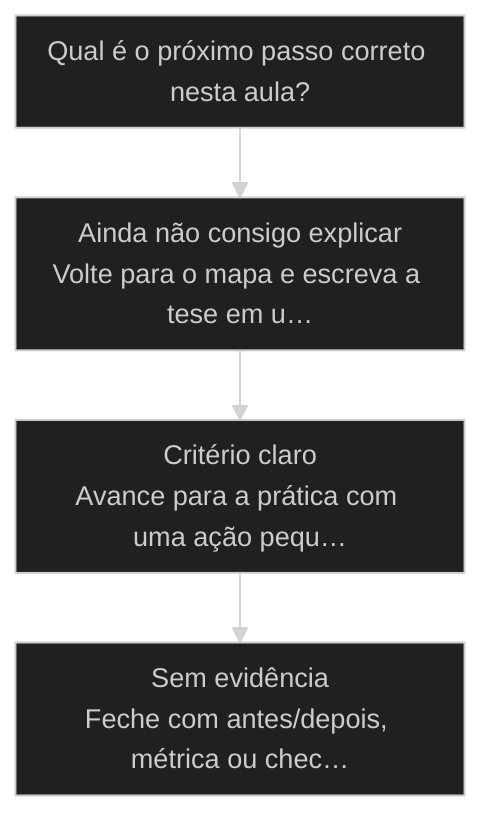
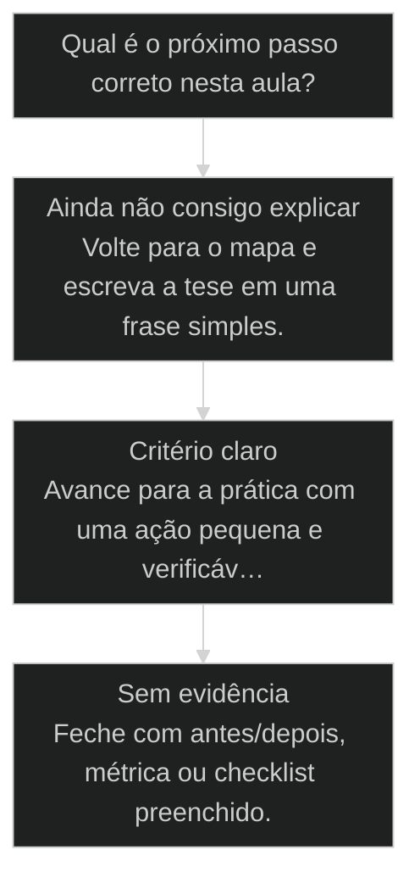

# Pipeline ETL com agentes: hierarquia de camadas

← [[50-rider-modo-elicitacao|Rider: quando o operador é o piloto]] · ↑ [[modulos/Módulo 4 - Determinismo e Comando|M4]] · ⌂ [[Cursos/AIOX Advanced/README|Curso]] · → [[23-o-que-e-um-squad|O que é um Squad (e por que ele vem antes do App)]]

## Mapa desta aula

Decisão-chave da aula — Qual é o próximo passo correto nesta aula?



> Leia o diagrama antes do texto longo. Depois volte e confira.

> Script, serviço, LLM. A regra do que vive em qual camada e onde a IA agrega de verdade.

**Objetivos de aprendizagem:**
- Explicar a hierarquia de camadas de um pipeline ETL: script, serviço e LLM. _(understand)_
- Analisar onde a LLM agrega de verdade e onde ela só encarece o trivial. _(analyze)_
- Desenhar um pipeline ETL próprio colocando cada etapa na camada certa. _(apply)_

---

## O que você consegue no fim desta aula

*G · Destino*

Destino claro antes do conteúdo técnico.

Você desenha um pipeline Extract→Transform→Load com dono por camada e decide
onde entra agente vs [[Runner|runner]]. Resultado: diagrama ETL do teu caso com 3 camadas.

- **Destino**: Pipeline ETL com agentes: hierarquia de camadas
- **Como saber que chegou**: Exercício final da aula com evidência escrita.

---

## O ponto de partida real

*P · Onde você está*

Empatia com o sintoma — sem moralismo.

Misturar extração, transformação e carga no mesmo prompt é receita de caos.
Cara, pipeline existe pra isolar falha. Se o teu 'agente de dados' faz tudo e ninguém
sabe onde quebrou, falta camada — não falta modelo.

> **Âncora**: Se o sintoma não for o seu, anote o do seu time — a aula ainda vale como mapa.

---

## Pipeline ETL com agentes

*Processo · M4 Determinismo · Por Alan Nicolas*

Todo trabalho com dado é um ETL: extrai, transforma, carrega. O erro caro é resolver tudo com LLM. A hierarquia de camadas coloca cada etapa onde ela custa menos e entrega mais: script, serviço ou IA.

- **3 camadas**: script, serviço, LLM
- **1 regra**: desça a camada sempre que der
- **ETL**: extrair, tratar, carregar

- **status**: aiox advanced · m4 determinismo
- **meta**: principio=pipeline-etl
- **meta**: fonte=aula-07 + aula-02
- **ready**: script then service then llm

**Legenda de cores**

As 3 camadas do pipeline

- **Tier 0 Script** (signal): transformação determinística, trabalho pesado
- **Tier 1 Serviço** (bench): ferramenta: Whisper, Pandoc, Calibre
- **Tier 2 LLM** (action): interpretação e julgamento
- **Hierarquia** (insight): desce sempre que der, sobe só se precisa
- **Camada errada** (pain): LLM fazendo trabalho de script

---

## Desça a camada sempre que der

Cada etapa do ETL tem uma camada natural. Script para o que é regra, serviço para o que uma ferramenta já resolve, LLM para o que exige interpretação. A regra é descer a camada sempre que possível: ela é mais barata e mais confiável.

> **A regra que sustenta a aula**: Antes de jogar uma etapa do ETL na LLM, pergunte se uma camada mais baixa resolve. Um script faz a transformação determinística. Um serviço especializado (Whisper, Pandoc, Calibre) faz o trabalho que já tem ferramenta. A LLM fica só para a interpretação que nenhuma camada abaixo entrega.

**ETL tudo-LLM**
- Joga extração, transformação e carga toda na LLM.
- Paga token para converter formato que o Pandoc converte.
- Tolera variância no que deveria ser determinístico.
- Pipeline caro, lento e instável em escala.

**ETL em camadas**
- Coloca cada etapa na camada mais baixa que resolve.
- Usa Whisper pra transcrever, Pandoc/Calibre pra converter.
- Reserva a LLM para interpretar e julgar o conteúdo.
- Pipeline barato, rápido e estável.

> **Alan Nicolas (instrutor, aula-02)**: Olha o pipeline que eu montei: o Whisper transcreve o áudio, o Pandoc e o Calibre convertem o formato, e só no fim a LLM lê o conteúdo pra extrair o que importa. Cada ferramenta no seu lugar. A IA não transcreve nem converte, ela interpreta.

---

## O caminho da aula

Três movimentos: entender as 3 camadas, ver o pipeline Whisper mais Pandoc mais Calibre mais LLM ao vivo, e desenhar um ETL seu com a hierarquia certa.

**As 3 camadas**

1. **Tier 0 Script**: transformação determinística feita por código.
2. **Tier 1 Serviço**: ferramenta especializada que já resolve o problema.
3. **Tier 2 LLM**: interpretação e julgamento que só a IA entrega.

- **Você vai sair sabendo** (O que cada camada faz bem e mal.; Por que descer a camada é mais barato e estável.; Onde a LLM agrega de verdade num pipeline de dado.)
- **Você vai sair fazendo**: O desenho de um pipeline ETL seu, com cada etapa colocada na camada certa.

---

## Whisper, Pandoc, Calibre e LLM

Alan montou um pipeline de conteúdo onde cada ferramenta faz uma camada: Whisper transcreve, Pandoc e Calibre convertem, e a LLM só interpreta no fim. A IA fica leve porque as camadas abaixo carregam o peso.

- **Transcrição no Whisper (serviço)**: barato
- **Transcrição na LLM**: caro
- **Conversão no Pandoc (script)**: trivial
- **Interpretação na LLM (Tier 2)**: vale o ouro

### Caso: Cada ferramenta na sua camada

O pipeline parece complexo até você ver que é só cada etapa na camada certa. A LLM faz pouco, e por isso o pipeline é barato e estável.

- Começou como: A tentação de jogar áudio, conversão e interpretação tudo na LLM.
- Virou: Whisper transcreve (serviço), Pandoc e Calibre convertem (serviço/script), LLM interpreta (Tier 2).
- Prova: A LLM só toca o conteúdo já transcrito e convertido, na etapa onde ela agrega.
- Lição: Quando as camadas abaixo carregam o peso, a IA faz só o que é ouro.

---

## WHY / WHAT / HOW da hierarquia

As 3 camadas que transformam um pipeline tudo-LLM num pipeline em tiers.

- **1. WHY - A camada baixa é mais barata e estável**: Script e serviço são determinísticos: mesma entrada, mesma saída, custo fixo. A LLM varia e cobra token. Descer a camada sempre que der é o que mantém o pipeline barato e confiável. [WHY, barato e estável]
- **2. WHAT - Três tiers**: Tier 0 é o script determinístico. Tier 1 é o serviço especializado (Whisper, Pandoc, Calibre). Tier 2 é a LLM, para interpretação e julgamento. Cada etapa do ETL mora num tier. [WHAT, Tier 0/1/2]
- **3. HOW - Mapear etapa em camada**: Para cada etapa do ETL, pergunte: um script resolve? Um serviço já existe? Só então suba para a LLM. Mapeie cada etapa para o tier mais baixo que a resolve. [HOW, etapa em camada]

---

## Os 3 tiers por dentro

Cada tier tem um tipo de trabalho e um exemplo concreto. A grade que você usa ao desenhar o pipeline.

- **Tier 0 Script**: Transformação determinística feita por código próprio. Regex, parsing, cálculo, renomeação.
- **Tier 1 Serviço**: Ferramenta especializada que já resolve. Whisper transcreve, Pandoc e Calibre convertem formato.
- **Tier 2 LLM**: Interpretação, extração de sentido e julgamento sobre o conteúdo já limpo.

**Colunas:** Etapa típica | Camada certa | Camada errada | Por quê

- Transcrever áudio: Tier 1 (Whisper) | Tier 2 (LLM) | serviço transcreve melhor e mais barato
- Converter formato: Tier 1 (Pandoc/Calibre) | Tier 2 (LLM) | ferramenta converte sem variância
- Limpar e parsear texto: Tier 0 (script) | Tier 2 (LLM) | regra clara é código
- Extrair sentido do conteúdo: Tier 2 (LLM) | Tier 0 (script) | interpretação é ouro da IA

- **Serviço, não LLM para transcrição**: Mandar o áudio direto pra IA parece prático.
- **Script, não LLM para parsing de regra clara**: Pedir pra IA limpar o texto parece flexível.
- **Descer a camada, não subir por hábito**: Subir tudo pra LLM parece mais poderoso.

---

## A sequência de desenho

Os passos concretos para desenhar um pipeline ETL com cada etapa na camada certa.

**Desenhar um pipeline ETL em camadas**
Use antes de montar qualquer fluxo de transformação de dado.
- `listar-etapas`
- `perguntar-camada`
- `mapear`
- `subir-so-no-fim`
- `listar-etapas`: Liste as etapas do ETL: extrair, tratar, carregar, em detalhe.
- `perguntar-camada`: Para cada etapa: um script resolve? Um serviço já existe?
- `mapear`: Coloque cada etapa no tier mais baixo que a resolve.
- `subir-so-no-fim`: A LLM (Tier 2) entra só nas etapas de interpretação e julgamento.

**Da etapa à camada certa**

1. **Lista as etapas**: extrair, tratar, carregar.
2. **Script resolve?**: se a regra é clara, Tier 0.
3. **Serviço resolve?**: se há ferramenta pronta, Tier 1.
4. **Só então LLM**: interpretação e julgamento, Tier 2.

---

## Caso benchmark: aplicar Pipeline ETL com agentes: hierarquia de camadas em uma decisão real

Um segundo caso para tirar a aula do conceito isolado e mostrar como o operador transforma o princípio em decisão, execução e evidência.

- **O que mudou na operação**: A aula deixou de ser uma explicação e virou uma lente de decisão. O aluno sabe que sinal observar, qual rota escolher e que evidência precisa produzir. Players: sinal, rota, execução, evidência.
- **Por que isso eleva a qualidade**: O padrão espelha o [[Método S2S]]: capturar o sinal, estruturar o caminho, executar com limite e fechar com prova.

**Matriz de aplicação**

Use esta matriz quando a aula parecer clara, mas a ação ainda estiver vaga.

- **Sinal claro**: O aluno consegue nomear o que a aula ensina a observar.
- **Rota escolhida**: A próxima ação nasce de critério, não de vontade de testar ferramenta.
- **Risco visível**: O erro provável fica explícito antes de executar.
- **Prova mínima**: Existe uma evidência simples para dizer que avançou.

### Caso: Quando o conceito precisou virar critério de execução

O operador já tinha entendido a tese, mas ainda precisava decidir o próximo passo sem cair em improviso.

- Começou como: Conceito entendido em teoria, sem critério de aplicação na task real.
- Virou: Decisão roteada por sinais, riscos, evidências e próximo passo verificável.
- Prova: A saída passou a ter ação, dono, critério e evidência de fechamento.
- Lição: Aula de qualidade não termina em entendimento. Termina quando o aluno consegue agir com critério.

---

## Router de decisão da aula

O ponto em que Pipeline ETL com agentes: hierarquia de camadas deixa de ser explicação e vira escolha operacional.

**Árvore de decisão**
_Não escolha comando antes de nomear o tipo de situação._



- **Ainda não consigo explicar** — O aluno repete a frase da aula, mas não consegue aplicar em exemplo próprio.
  → _Volte para o mapa e escreva a tese em uma frase simples._
- **Critério claro** — O aluno identifica sinal, risco e decisão antes da ferramenta.
  → _Avance para a prática com uma ação pequena e verificável._
- **Sem evidência** — A ação foi feita, mas não existe prova de melhoria ou decisão registrada.
  → _Feche com antes/depois, métrica ou checklist preenchido._

**Gate:** Você sabe qual rota seguir e como provar que avançou? — _Se a resposta ainda depende de opinião, volte uma etapa._

#### Entender o princípio
Quando a aula ainda parece uma tese abstrata.
1. **Nomear: escreva a tese em uma frase.
2. **Exemplo: traga um caso próprio pequeno.
3. **Risco: diga o erro que a aula evita.

#### Aplicar em uma task
Quando o critério está claro e falta execução.
1. **Escolher: defina a menor ação verificável.
2. **Executar: faça sem expandir escopo.
3. **Provar: registre o delta produzido.

#### Revisar a decisão
Quando a execução aconteceu, mas a evidência ficou fraca.
1. **Comparar: olhe antes e depois.
2. **Ajustar: corrija a menor falha.
3. **Fechar: só conclua com prova.

**Colunas:** Estado | Pergunta | Sinal saudável | Sinal de risco

- Entendimento: Consigo explicar sem copiar a aula? | frase própria e exemplo próprio | repetição bonita sem aplicação
- Decisão: Escolhi rota antes da ferramenta? | sinal e risco nomeados | comando escolhido por hábito
- Prova: Tenho evidência de avanço? | antes/depois ou checklist | sensação de que ficou melhor

---

## Processo operacional mínimo

A sequência mínima para aplicar Pipeline ETL com agentes: hierarquia de camadas sem deixar a aula em teoria solta.

**Aula → Task → Evidência**
Rota curta para converter o conceito em ação repetível.
- **Plan**: Nomeie o sinal da aula, o risco que ela evita e o artefato que será produzido.
- **Do**: Execute a menor ação que prova o conceito sem abrir novo escopo.
- **Check**: Compare a saída com o critério de aceite da aula.
- **Act**: Registre a regra aprendida e remova o que não será reutilizado.

**Aplicar com evidência**
Use quando a aula fizer sentido, mas a task ainda estiver sem formato.
- `sinal`
- `risco`
- `ação`
- `prova`
- `sinal`: O que esta aula me ensinou a perceber?
- `risco`: Que erro acontece se eu ignorar esse sinal?
- `ação`: Qual é a menor execução que testa o princípio?
- `prova`: Que evidência mostra que a decisão melhorou?

**Do conceito ao comportamento**

1. **Conceito**: entender a tese central da aula.
2. **Critério**: converter a tese em pergunta de decisão.
3. **Ação**: executar a menor tarefa que prova avanço.
4. **Memória**: registrar o padrão para repetir depois.

---

## Distinções que evitam falsa competência

Três diferenças que protegem Pipeline ETL com agentes: hierarquia de camadas de virar jargão ou checklist vazio.

**Parece que aprendeu**
- Repete a tese da aula sem exemplo próprio.
- Escolhe ferramenta antes de escolher critério.
- Fecha a task porque executou algo.

**Aprendeu de verdade**
- Explica o princípio em uma situação própria.
- Escolhe rota, risco e evidência antes do comando.
- Fecha a task quando existe prova de avanço.

- **entender com aplicar**: Entender é conseguir repetir a ideia.
- **ação com evidência**: Fazer algo gera movimento.
- **checklist com processo**: Checklist pode ser preenchido no automático.

**Exemplo preenchido: saída esperada do aluno**

- **Tese**: A aula me ensinou a observar um sinal específico antes de escolher ferramenta.
- **Risco**: Se eu pular esse critério, executo rápido e descubro tarde que a direção estava errada.
- **Ação**: Vou aplicar em uma task pequena, com escopo fechado e antes/depois visível.
- **Prova**: A entrega só fecha quando eu consigo mostrar o critério usado e o delta gerado.

---

## Prática: desenhe um pipeline em camadas

Pegue um fluxo de dado seu e desenhe o ETL colocando cada etapa no tier mais baixo que a resolve.

**Desenho do pipeline ETL (uma linha por etapa)**
```yaml
# Desenhe antes de montar. Desca a camada sempre que der.
pipeline: "{nome do fluxo de dado}"
etapas:
  - etapa: "{o que esta etapa faz}"
    tipo: "{extrair | tratar | carregar}"
    script_resolve: "{sim | nao}"
    servico_pronto: "{qual ferramenta, ou nenhuma}"
    tier: "{tier0-script | tier1-servico | tier2-llm}"
    justificativa_llm: "{se tier2: qual interpretacao so a IA da}"

```

> **Portão da aula**: Antes de seguir para a próxima aula: você desenhou um pipeline ETL seu, listou as etapas e colocou cada uma no tier mais baixo que a resolve, justificando o que ficou na LLM. Se alguma transcrição ou conversão ficou em Tier 2, desça para o serviço antes de passar.

- 1. **Escolha o fluxo**: Pegue um trabalho com dado que você faz ou faria: áudio, documento, planilha.
- 2. **Liste as etapas**: Quebre em etapas de ETL: o que extrai, o que transforma, o que carrega.
- 3. **Pergunte a camada**: Para cada etapa: um script resolve? Um serviço pronto já faz?
- 4. **Mapeie os tiers**: Coloque cada etapa em Tier 0 (script), Tier 1 (serviço) ou Tier 2 (LLM).
- 5. **Justifique a LLM**: Para as etapas em Tier 2, escreva qual interpretação só a IA entrega.

---

## Glossário

Os termos desta aula em uma frase cada.

- **Pipeline ETL**: Fluxo de extrair, normalizar e carregar dado. Toda tarefa com dado é um ETL.
- **Tier 0 Script**: A camada determinística: transformação feita por código próprio com regra clara.
- **Tier 1 Serviço**: A camada de ferramenta especializada que já resolve (Whisper, Pandoc, Calibre).
- **Tier 2 LLM**: A camada de interpretação e julgamento, onde a IA agrega o que as camadas abaixo não dão.
- **Descer a camada**: A regra de colocar cada etapa no tier mais baixo que a resolve, subindo só quando precisa.

> **Próxima aula**: Você desenha pipelines em camadas e sabe onde a IA agrega. Com o determinismo dominado, M5 entra na arquitetura SINKRA: [[Squad|o que é um squad]] e como as entidades viram unidades de processo.

***


---

## Navegação

← [[50-rider-modo-elicitacao|Rider: quando o operador é o piloto]] · ↑ [[modulos/Módulo 4 - Determinismo e Comando|M4]] · ⌂ [[Cursos/AIOX Advanced/README|Curso]] · → [[23-o-que-e-um-squad|O que é um Squad (e por que ele vem antes do App)]]
