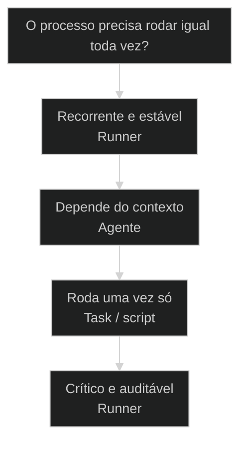
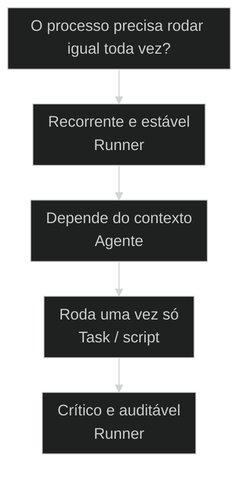

# Runner: o executável determinístico do Workflow

← [[29-sub-agents-vs-swarm-agents|Sub-agents versus Swarm-agents: isolado ou em rede]] · ↑ [[modulos/Módulo 5 - Arquitetura AIOX|M5]] · ⌂ [[Cursos/AIOX Advanced/README|Curso]] · → [[51-mapear-entidades-antes-do-squad|Mapear entidades antes do Squad: 5 perguntas + ciclo de vida]]

## Conceitos

- [[Taxonomia AIOX]]
- [[Runner]]

## Mapa desta aula

Decisão-chave da aula — O processo precisa rodar igual toda vez?



> Leia o diagrama antes do texto longo. Depois volte e confira.

> O Workflow descreve a intenção. O [[Runner]] roda o passo a passo igual toda vez. Mesma entrada, mesma saída. É o .exe do seu processo: sem improviso, sem variação.

**Objetivos de aprendizagem:**
- Nomear o que é um Runner no AIOX e o que o distingue de um Workflow. _(remember)_
- Distinguir a descrição da intenção (Workflow) da execução determinística (Runner). _(understand)_
- Escolher quando um processo merece virar Runner antes de codar qualquer coisa. _(apply)_
- Explicar por que determinismo é o produto do Runner, não um efeito colateral. _(understand)_

---

## O Runner é o .exe do seu Workflow

*Execução AIOX · Runner como executável determinístico*

O Workflow é a receita escrita. O Runner é a máquina que cozinha a receita igual toda vez. Mesma entrada, mesma saída. Quando você confunde os dois, espera flexibilidade de quem foi feito para repetir sem variar.

- **1**: executável por Workflow
- **1**: critério: mesma entrada, mesma saída
- **0**: improviso dentro de um Runner

- **status**: deterministic runner
- **meta**: workflow=descricao da intencao
- **meta**: runner=executavel do passo a passo
- **meta**: regra=mesma entrada gera mesma saida
- **ready**: ready to run

**Legenda de cores**

Mapa semantico do Runner

- **Workflow** (signal): a descricao da intencao, o que rodar
- **Runner** (insight): o executavel, roda o passo a passo igual
- **Determinismo** (bench): mesma entrada gera mesma saida sempre
- **Execucao** (action): passos concretos rodando de fato
- **Erro comum** (pain): esperar do Runner a flexibilidade do Agente

---

## Da cohort: runner como destino do que parou de improvisar

*T1 + T2 · WhatsApp*

Realidade do grupo Advanced — não é slide, é cicatriz.

No grupo, o fio que liga [[Token Economy|token economy]] a runner é explícito: achar no [[Squad|squad]] o que
já é caminho fixo e **descer** para execução determinística.

Runners-101 circulou como material da turma. Se a aula anterior te convenceu de
'LLM só no ouro', esta aula é o chão de fábrica: o .exe do workflow.

> **Âncora de campo**: Runner não é demissão da IA — é promoção do processo que já estabilizou.

> **Materiais / FAQ**: cohort-insights/materials/1.0-runners-101.md

---

## Comece pela pergunta certa

Antes de comparar Workflow e Runner campo a campo, fixe a pergunta única: você precisa que o processo rode igual toda vez? Se sim, é território de Runner. Todo o resto deriva daí.

**Como ler esta aula**

1. **A pergunta aparece**: Uma frase separa intenção de execução: precisa rodar igual toda vez?
2. **Cada peça mostra a cara**: Workflow descreve o que fazer. Runner executa o passo a passo sem variar.
3. **Vê o caso real**: runner-lib é um primitivo real do AIOX, apontável no repo, não abstrato.
4. **Decide**: Dado um processo, você aponta se vale virar Runner e justifica.

- **Objetivos da aula** (Nomear o que é um Runner no AIOX.; Distinguir a intenção (Workflow) da execução determinística (Runner).; Escolher quando um processo merece virar Runner.; Explicar por que determinismo é o produto, não o efeito colateral.)
- **Onde você está?** (Começando: foque Mapa Simples e a analogia da receita.; Já usa AIOX: foque Casos Reais e a Decisão.; Vai construir: foque Anatomia e Métricas.)
- **Leitura prática**: Em cada bloco, procure uma resposta: este passo varia ou roda igual? Quando isso ajuda e quando atrapalha?

**Ritmo da aula**

A distinção fica clara quando cada peça tem definição curta, exemplo real do framework e o gosto de quando usar.

- G **Pergunta antes do detalhe**: Primeiro o critério que separa, depois cada peça por dentro.
- 1 **Analogia que ancora**: Workflow é a receita escrita. Runner é o forno que assa igual toda vez.
- 2 **Caso real**: runner-lib em infrastructure/scripts/ é apontável no AIOX, não teoria.
- 3 **Recap com decisão**: A aula fecha com o aluno decidindo se um processo dele vale virar Runner.

---

## A diferença sem jargão

Antes dos termos técnicos, a diferença é só isto: uma peça escreve o que deve acontecer, a outra faz acontecer exatamente igual, toda vez que roda.

> **Em uma frase**: Workflow é a receita: a lista do que fazer, na ordem. Runner é o executável que roda a receita igual toda vez. Mesma entrada, mesma saída. O Runner não pensa nem improvisa: ele repete sem variar.

- **Workflow descreve** -> É a intenção em YAML: que passos rodar, em que ordem, com que gates. Não executa sozinho.
- **Runner executa** -> É o programa que pega o Workflow e roda. Roda igual, sem decidir nada no caminho.
- **Determinismo é a marca** -> Rode duas vezes com a mesma entrada e o resultado é o mesmo. Sem isso, não é Runner.
- **Sem improviso** -> O Runner não escolhe rota nem reage ao contexto. Quem decide é o Agente; o Runner repete.
- **O erro caro** -> Esperar que o Runner se adapte. Ele não adapta: ele roda igual. Adaptação é trabalho de Agente.

**Diagrama principal: da intenção à execução**

1. **Workflow**: A descrição em YAML: passos, ordem, gates. A intenção, não a ação.
2. **Runner**: O executável que lê o Workflow e roda o passo a passo de fato.
3. **Determinismo**: Mesma entrada, mesma saída. O resultado é reprodutível, não aleatório.
4. **Saída**: Um resultado concreto, igual ao da última vez que rodou com a mesma entrada.

**O que a distinção evita**
- Esperar que o Runner se adapte ao contexto.
- Tratar Workflow e Runner como a mesma coisa.
- Pedir improviso de quem foi feito para repetir.
- Codar lógica de decisão dentro de um Runner.

**O que ela força**
- Manter a decisão no Agente e a execução no Runner.
- Escrever a intenção no Workflow, rodar no Runner.
- Exigir determinismo: mesma entrada, mesma saída.
- Reservar o Runner para o que precisa rodar igual sempre.

---

## A analogia da receita e do forno

A forma mais rápida de fixar a diferença: o Workflow é a receita escrita; o Runner é o forno programado. A receita diz o que fazer. O forno faz, na mesma temperatura, pelo mesmo tempo, toda vez.

- **Workflow = a receita escrita**: A receita lista ingredientes, ordem e tempo. Ela descreve, não cozinha. Sozinha, é só papel: precisa de algo que execute.
- **Runner = o forno programado**: O forno pega a receita e assa. Mesma temperatura, mesmo tempo, toda vez. Não decide se hoje vai variar: ele repete o programa.
- **Determinismo = o bolo idêntico**: Dois bolos da mesma receita, no mesmo forno programado, saem iguais. Essa reprodutibilidade é o valor inteiro do Runner.
- **Agente = o chef que decide**: Quando o prato é incerto, o chef improvisa, prova, ajusta. Esse é o Agente. O forno nunca improvisa: ele só assa igual.

> **E quando misturar?**: O chef (Agente) pode decidir a estratégia e então mandar o forno (Runner) assar a parte repetível. Decisão no chef, execução no forno. O erro é inverter e esperar que o forno decida o cardápio.

---

## Workflow versus Runner: o critério determinismo

Esta é a confusão mais cara da execução AIOX. Os dois falam de processo, então parecem a mesma peça. O critério determinismo separa os dois de vez: descreve ou roda igual?

**Workflow (a receita)**
- Descreve a intenção: passos, ordem, gates.
- Vive em YAML, legível por humano e LLM.
- Não executa sozinho: aguarda um executor.
- Mudar a receita muda o que vai rodar.

**Runner (o forno)**
- Executa o passo a passo de verdade.
- É código que roda, não descrição.
- Determinístico: mesma entrada, mesma saída.
- Mudar o forno muda como roda, não o quê.

> **A pergunta que separa**: Pergunte: este artefato descreve o processo ou faz o processo rodar igual toda vez? Se descreve a intenção, é Workflow. Se executa de forma reprodutível, é Runner. Workflow é o mapa; Runner é o carro que anda o mapa sempre do mesmo jeito.

- **Runner com Workflow**: Os dois tratam de processo, então parecem o mesmo artefato.
- **Runner com Agente**: Os dois executam algo, então parecem ter o mesmo papel.
- **Runner com uma simples chamada de script**: Um Runner roda código, então parece só um script avulso.

---

## O Runner existe de verdade no AIOX

A distinção não é teoria. O Runner é apontável no framework. Estes dois casos mostram o primitivo real do AIOX e a forma determinística que ele garante.

- **Onde o Runner vive no AIOX**: O runtime canônico de runner vive em infrastructure/scripts/runner-lib/, com test runner e floor de cobertura. A skill /create-runner faz scaffold de novos Runners a partir dos templates e guardrails. O Runner não é abstração: tem lar, teste e gate. Players: runner-lib, /create-runner, infrastructure/scripts/, npm test, validate:runner-lib-coverage.
- **O que muda a decisão**: A pergunta não é se o processo é importante. É se ele precisa rodar igual toda vez. Processo recorrente e reprodutível pede Runner. Processo que muda conforme o contexto pede Agente.

**Cada conceito num eixo**

A distinção vira sistema quando cada conceito tem definição, lar no framework e o tipo de processo que resolve.

- **Workflow**: A descrição da intenção em YAML. Passos, ordem, gates. Não executa sozinho.
- **Runner**: O executável sobre runner-lib. Roda o Workflow de forma determinística.
- **Determinismo**: Mesma entrada, mesma saída. A propriedade que torna o resultado confiável.
- **Módulos internos**: As partes do Runner que rodam cada pedaço do passo a passo.

**Colunas:** Conceito | Descreve ou roda? | Sinal de uso certo | Sinal de erro

- Workflow: Descreve ou roda? | Intenção clara em YAML, lida por humano e LLM. | YAML virando código de execução escondido.
- Runner: Descreve ou roda? | Executável determinístico rodando o passo a passo. | Você esperava que ele se adaptasse ao contexto.
- Determinismo: Descreve ou roda? | Mesma entrada produzindo a mesma saída sempre. | Saída diferente a cada execução sem causa controlada.
- Módulos internos: Descreve ou roda? | Partes testáveis rodando cada pedaço do Workflow. | Tudo num bloco só, sem teste nem cobertura.

### Caso: O runner-lib em infrastructure/scripts/

O Runner não é uma metáfora de aula: o AIOX tem uma biblioteca de runner em infrastructure/scripts/runner-lib/, com testes e cobertura.

- Começou como: Um Workflow descrito em YAML, sem nada que o rodasse igual toda vez.
- Virou: Um executável sobre runner-lib que roda o passo a passo de forma determinística.
- Prova: infrastructure/scripts/runner-lib/ existe no repo, com suite de testes (npm test) e floor de cobertura (validate:runner-lib-coverage).
- Lição: Runner é primitivo real: tem lar no repo, tem teste, tem gate de cobertura.

### Caso: O Runner como .sh determinístico

Na visão executiva, o Runner é um .sh que roda igual: mesma entrada, mesma saída, sem surpresa entre execuções.

- Começou como: Um Workflow que dependia de alguém executar os passos na mão, com variação a cada vez.
- Virou: Um executável determinístico que roda o Workflow inteiro sem intervenção humana.
- Prova: MASTER-CO-16 define o Runner como o .exe do Workflow (aula-08) e como .sh determinístico (t2-aula-6); ambas as fontes convergem na mesma definição.
- Lição: Determinismo não é detalhe técnico: é a propriedade que torna o processo confiável.

---

## Como Workflow, Runner e Agente se combinam

Workflow, Runner e Agente não são rivais; são camadas. O Agente decide, o Workflow descreve, o Runner executa igual. Entender a direção da composição evita pedir improviso de quem foi feito para repetir.

**decisão no agente, descrição no workflow, execução no runner**

1. **Agente decide**: O agente avalia o contexto e escolhe que processo precisa rodar.
2. **Workflow descreve**: A intenção vira um YAML com passos, ordem e gates.
3. **Runner executa**: O executável roda o Workflow de forma determinística, sem decidir nada.
4. **Saída reprodutível**: O resultado é o mesmo para a mesma entrada, execução após execução.
5. **Agente avalia**: O agente lê a saída determinística e decide o próximo passo.

- **1. Decisão (Agente)**: Quem julga o contexto. O agente decide o que rodar e improvisa quando o caminho é incerto. É o único que tem liberdade. [WHO, julga, improvisa]
- **2. Descrição (Workflow)**: O que precisa rodar. O YAML que lista passos, ordem e gates. A intenção registrada, legível, sem execução. [WHAT, intenção, YAML]
- **3. Execução (Runner)**: Como roda de fato. O executável determinístico que roda o Workflow igual toda vez. Zero improviso, máxima reprodutibilidade. [HOW, determinístico, runner-lib]

---

## Quando virar Runner?

Antes de codar, decida se o processo merece virar Runner. O critério economiza tempo quando você escolhe pelo determinismo, não pela vontade de automatizar tudo.

**Árvore de decisão**
_Responda pelo determinismo antes de pensar em quanto código vai escrever._



- **Recorrente e estável** — O processo roda sempre do mesmo jeito e o passo a passo não muda com o contexto.
  → _Runner_
  Ex.: Vire Runner. Materialize o Workflow sobre runner-lib via /create-runner.
- **Depende do contexto** — Cada execução exige julgamento sobre o que fazer, com base no que apareceu.
  → _Agente_
  Ex.: Use Agente. A decisão precisa de improviso, não de repetição.
- **Roda uma vez só** — É uma tarefa pontual que não vai se repetir nem precisa ser reproduzida.
  → _Task / script_
  Ex.: Não vire Runner. Um script simples ou uma task resolve.
- **Crítico e auditável** — O resultado precisa ser idêntico, testável e confiável a cada execução.
  → _Runner_
  Ex.: Vire Runner. Determinismo com teste e cobertura é exatamente o ponto.

**Gate:** Qual é o gate? — _Sem gate, você vira Runner por reflexo de automatizar. Responda: este processo precisa rodar igual toda vez? Se não, Agente ou task. Se sim, Runner com teste e cobertura._

> **Regra do critério único**: A escolha não é pela importância do processo; é pelo determinismo. Se ele precisa rodar igual toda vez, Runner é a peça. Se ele exige julgamento a cada execução, Agente é a peça. Virar Runner o que precisa de improviso é overengineering; deixar de virar Runner o que precisa rodar igual é desperdício de confiabilidade.

---

## Rotas de materialização

Cada caminho até um Runner tem um modo típico de disparo. Saber a rota evita decidir certo pelo Runner e materializar do jeito errado.

#### Criar Runner do zero
Quando o Workflow é estável e precisa virar executável determinístico.
1. **Sinal: processo recorrente descrito em Workflow YAML.
2. **Pergunta: ele roda igual toda vez ou muda com o contexto?
3. **Ação: rodar /create-runner para scaffold sobre runner-lib.
4. **Resultado: um Runner novo com templates e guardrails canônicos.

#### Defender o determinismo
Quando o Runner existe e o determinismo precisa de prova.
1. **Sinal: Runner rodando, mas sem garantia de saída idêntica.
2. **Pergunta: mesma entrada está gerando mesma saída sempre?
3. **Ação: rodar npm test e validate:runner-lib-coverage.
4. **Resultado: determinismo defendido por teste e floor de cobertura.

#### Ligar Runner ao Agente
Quando o Runner precisa rodar dentro de um fluxo decidido por Agente.
1. **Sinal: o Agente decide e quer delegar a parte repetível.
2. **Pergunta: qual pedaço do fluxo é determinístico e isolável?
3. **Ação: o Agente dispara o Runner para a parte repetível.
4. **Resultado: decisão no Agente, execução igual no Runner.

**Criar um Runner**
Use quando o Workflow é estável e precisa virar executável determinístico.
- `/create-runner`: scaffold do Runner a partir dos templates e guardrails de runner-lib.
- `definir módulos internos`: estruturar as partes que rodam cada pedaço do Workflow.

**Defender o determinismo**
Use quando o Runner existe e a saída precisa ser reprodutível.
- `npm test`: rodar a suite do runner-lib para validar a execução.
- `validate:runner-lib-coverage`: garantir o floor de cobertura sobre o baseline.

**Integrar com Agente**
Use quando o Runner roda dentro de um fluxo decidido por Agente.
- `Agente decide`: o agente avalia o contexto e escolhe disparar o Runner.
- `Runner executa`: o Runner roda a parte repetível de forma determinística.

---

## Modelos para ler melhor

Visualizações rápidas para o aluno comparar Workflow, Runner e Agente, os riscos de cada escolha e o grau de determinismo que cada um carrega.

- **Runner**: alto (roda igual toda vez por definição.)
- **Workflow**: médio (descreve passos fixos, mas não executa.)
- **Agente**: baixo (improvisa e decide conforme o contexto.)

- **Runner esperando improviso**: runner (querer que o forno decida o cardápio.)
- **Agente para o repetível**: agente (pagar custo de julgamento num processo fixo.)
- **Runner sem teste**: runner (Runner que sai diferente sem ninguém perceber.)

**Matriz de Decisão do Aluno**

Em dúvida, escolha a célula que melhor descreve o seu processo.

- **Recorrente e estável**: Vire Runner. Determinismo é o produto.
- **Depende do contexto**: Use Agente. Julgamento a cada execução.
- **Roda uma vez só**: Use task ou script. Não vale virar Runner.
- **Crítico e auditável**: Vire Runner. Teste e cobertura defendem o resultado.
- **Só descrever o processo**: Escreva o Workflow. A execução vem depois.
- **Não sabe ainda**: Pergunte: precisa rodar igual? Não, Agente. Sim, Runner.

- **Sinal de execução saudável**: peça escolhida pelo critério determinismo / Runner com teste e cobertura ativos / Runner saindo diferente sem causa controlada
- **Separação de responsabilidades**: Agente decide, Workflow descreve, Runner executa / Agente disparando Runner para o repetível / lógica de decisão escondida dentro do Runner

---

## O que cada peça carrega

Cada peça tem uma anatomia mínima. Saber o que cada uma guarda ajuda a reconhecer quando você está usando a peça errada para o processo.

- **Workflow: a descrição**: Passos, ordem, gates em YAML. Legível por humano e LLM. Não executa: aguarda um Runner.
- **Runner: o executável**: Roda o Workflow de forma determinística. Tem módulos internos. Mesma entrada, mesma saída.
- **runner-lib: o runtime**: A biblioteca canônica em infrastructure/scripts/. Test runner e floor de cobertura por trás.
- **/create-runner: o scaffold**: A skill que gera um Runner novo a partir dos templates e guardrails canônicos.
- **Agente: o decisor**: Julga o contexto e improvisa. É quem dispara o Runner, nunca quem o Runner substitui.

---

## Métricas do Runner

Sem telemetria, a saúde do Runner vira fé. Estas perguntas separam um Runner confiável de um script imprevisível disfarçado de Runner.

**Colunas:** Métrica | Pergunta | Sinal saudável | Sinal de risco

- Determinismo: Mesma entrada gera mesma saída sempre? | Duas execuções com a mesma entrada batem. | Saída muda sem causa controlada.
- Cobertura: O Runner tem teste e floor de cobertura? | npm test passa e cobertura respeita o baseline. | Runner sem teste, mudança quebra em silêncio.
- Separação de papéis: A decisão está fora do Runner? | Agente decide, Runner só executa igual. | Lógica de julgamento escondida dentro do Runner.
- Materialização: O Runner nasceu do Workflow estável? | Workflow recorrente virou Runner via /create-runner. | Runner improvisado para processo que ainda muda.

---

## Quando resistir a virar Runner

A distinção ajuda mais quando você resiste ao reflexo de transformar tudo em Runner. Materializar um Runner tem custo: teste, cobertura, manutenção. Vale só quando o determinismo paga.

**Quando virar Runner**
- O processo é recorrente e roda sempre do mesmo jeito.
- O resultado precisa ser idêntico e auditável a cada execução.
- Há ganho real em reprodutibilidade, não só em automação.
- O passo a passo não muda com o contexto.

**Quando não virar**
- Cada execução exige julgamento (fica com Agente).
- É uma tarefa pontual que não vai se repetir (fica em task).
- O processo ainda muda muito (não estabilizou para virar Runner).
- O custo de teste e manutenção supera o ganho de determinismo.

---

## Exercício: decida o Runner

Pegue um processo real seu e aplique o critério. O objetivo não é automatizar tudo; é apontar se o processo precisa rodar igual toda vez antes de codar qualquer coisa.

**Um processo, cinco perguntas**
```yaml
execucao:
  processo: "o que precisa rodar?"
  roda_igual: "precisa rodar igual toda vez? sim | nao"
  peca: "runner | agente"
  materializacao: "create_runner | agente | task"
  gate: "por que nao a outra peca? (se runner, como testa o determinismo?)"

```
*O acerto não é virar Runner. É provar que você escolheu a peça pelo critério determinismo e sabe justificar por que a outra custaria mais sem entregar mais.*

**Exemplo preenchido: gerar relatório semanal versus diagnosticar um bug**

- **Processo A**: Preciso gerar o mesmo relatorio semanal com a mesma estrutura toda semana.
- **Roda igual A**: Sim. A estrutura e os passos sao identicos toda semana.
- **Peça A**: Runner. Materializo o Workflow via /create-runner; mesma entrada gera o mesmo relatorio.
- **Processo B**: Preciso diagnosticar um bug novo cuja causa eu nao conheco ainda.
- **Peça B**: Agente. Cada diagnostico exige julgamento sobre o que apareceu; nao da para rodar igual.
- **Gate B**: Determinismo nao se aplica: a causa muda a cada bug, entao a peca certa improvisa, nao repete.

- 1. **Processo**: Descreva em uma frase o processo que você quer executar.
- 2. **Roda igual?**: Responda: ele precisa rodar igual toda vez ou muda com o contexto?
- 3. **Peça**: Aponte Runner (determinístico) ou Agente (julgamento) com base na resposta.
- 4. **Materialização**: Diga como construiria: /create-runner para Runner, agente para julgamento.
- 5. **Gate**: Justifique por que não escolheu a outra peça. Para Runner, defina como vai testar o determinismo.

**Funcionou se:**

- O aluno escolhe a peça pelo critério determinismo, não pela vontade de automatizar.
- O aluno separa execução reprodutível (Runner) de julgamento contextual (Agente).
- O aluno define como vai testar o determinismo quando escolhe Runner.

---

## Glossário do Runner

Tradução dos termos para alguém que está vendo a distinção Workflow versus Runner pela primeira vez.

- **Runner**: O executável determinístico que roda um Workflow. Mesma entrada, mesma saída. É o .exe do processo.
- **Workflow**: A descrição da intenção em YAML: passos, ordem e gates. Não executa sozinho; aguarda um Runner.
- **Determinismo**: A propriedade de rodar igual toda vez. Mesma entrada gera mesma saída. É o produto do Runner, não um efeito colateral.
- **runner-lib**: A biblioteca canônica de runner do AIOX, em infrastructure/scripts/. Tem test runner e floor de cobertura.
- **/create-runner**: A skill que faz scaffold de um Runner novo a partir dos templates e guardrails canônicos de runner-lib.
- **Módulos internos**: As partes de um Runner que rodam cada pedaço do Workflow. Tornam o Runner testável, não um script solto.
- **Agente**: A peça que decide e improvisa diante do contexto. Dispara o Runner, mas nunca é substituído por ele.
- **Cobertura**: O floor de teste que defende o Runner. validate:runner-lib-coverage garante que a mudança não quebre em silêncio.

> **Portão da aula**: A aula só está no padrão quando o aluno nomeia o Runner, distingue a descrição da intenção (Workflow) da execução determinística (Runner) e consegue apontar, para um processo real, se ele precisa rodar igual toda vez (Runner) ou exige julgamento a cada execução (Agente) antes de codar qualquer coisa.

***


---

## Navegação

← [[29-sub-agents-vs-swarm-agents|Sub-agents versus Swarm-agents: isolado ou em rede]] · ↑ [[modulos/Módulo 5 - Arquitetura AIOX|M5]] · ⌂ [[Cursos/AIOX Advanced/README|Curso]] · → [[51-mapear-entidades-antes-do-squad|Mapear entidades antes do Squad: 5 perguntas + ciclo de vida]]
