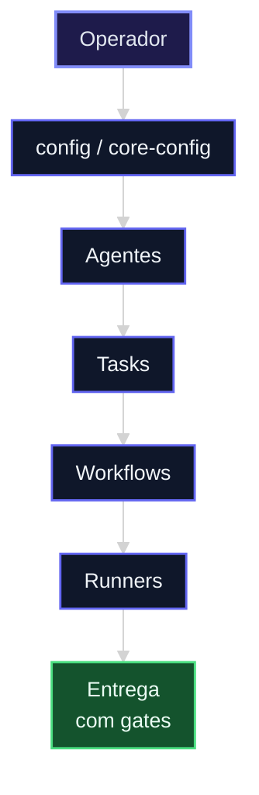
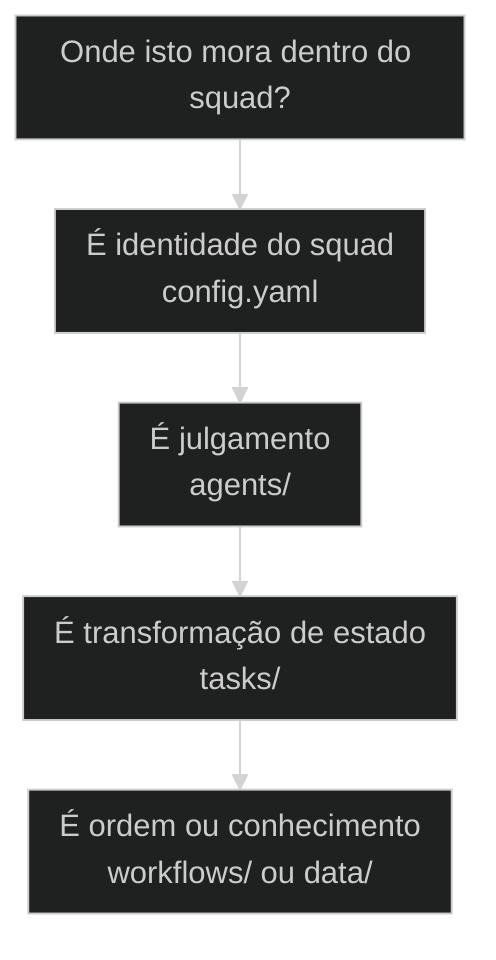

# Anatomia de um Squad AIOX

← [[54-reuse-adapt-create-heuristica|REUSE > ADAPT > CREATE: a heurística antes de criar nada]] · ↑ [[modulos/Módulo 7 - Criar Squad|M7]] · ⌂ [[Cursos/AIOX Advanced/README|Curso]] · → [[34-squad-creator-passo-a-passo|Squad Creator passo a passo: criar um squad do zero]]

## Conceitos

- [[Squad]]

## Mapa desta aula

Anatomia do Squad: pilha de peças do config ao runner — operador entra no topo.



> Leia o diagrama antes do texto longo. Depois volte e confira.

> Você já sabe [[Squad|o que é um Squad]]. Agora abra a caixa. Por dentro, todo squad tem o mesmo esqueleto: um config.yaml que o declara, agents/ que pensam, tasks/ que transformam, workflows/ que orquestram e data/ que alimenta. Conhecer a anatomia é a diferença entre usar um squad e construir um.

**Objetivos de aprendizagem:**
- Nomear as partes internas de um squad AIOX: config.yaml, agents/, tasks/, workflows/, data/. _(remember)_
- Distinguir o papel de cada parte: quem declara, quem pensa, quem transforma, quem orquestra, quem alimenta. _(understand)_
- Localizar essas partes num squad real do repositório AIOX e reconhecer o esqueleto compartilhado. _(apply)_
- Explicar por que o config.yaml é o documento de identidade que sustenta toda a estrutura. _(understand)_

---

## Abra a caixa do Squad

*Estrutura AIOX · Anatomia interna de um Squad*

Você já sabe o que é um Squad: um time de agentes que executa um domínio. Esta aula abre a caixa. Por dentro, todo squad tem o mesmo esqueleto: um config.yaml que o declara e quatro pastas que dão vida a ele. Conhecer a anatomia é a diferença entre usar um squad pronto e construir um do zero.

- **1**: config.yaml por squad
- **4**: pastas internas: agents, tasks, workflows, data
- **1**: esqueleto compartilhado por todo squad

- **status**: squad anatomy
- **meta**: config.yaml=documento de identidade
- **meta**: agents=quem pensa, tasks=o que transforma
- **meta**: workflows=a ordem, data=o que alimenta
- **ready**: open the box

**Legenda de cores**

Mapa semantico da anatomia

- **config.yaml** (signal): o documento de identidade, declara o squad
- **agents/** (insight): quem pensa e decide, os especialistas
- **tasks/** (bench): as transformacoes, cada uma muda um estado
- **workflows/** (action): a orquestracao, a ordem das tasks
- **Erro comum** (pain): criar pastas sem o config que as declara

---

## Comece pela pergunta certa

Antes de listar pastas, fixe a pergunta única: o que faz um conjunto de arquivos virar um Squad de verdade? A resposta é o config.yaml que os declara. Sem ele, são só pastas soltas. Todo o resto desta aula deriva daí.

**Como ler esta aula**

1. **A pergunta aparece**: O que separa um squad de uma pasta qualquer de arquivos?
2. **Cada parte mostra a cara**: config declara, agents pensam, tasks transformam, workflows orquestram, data alimenta.
3. **Vê o caso real**: Um squad real do repo AIOX, com as pastas apontáveis em squads/.
4. **Localiza**: Dado um squad, você aponta cada parte e diz o que ela faz.

- **Objetivos da aula** (Nomear as partes internas de um squad AIOX.; Distinguir quem declara, pensa, transforma, orquestra e alimenta.; Localizar cada parte num squad real do repositório.; Explicar por que o config.yaml é o documento de identidade.)
- **Onde você está?** (Começando: foque Mapa Simples e a analogia do corpo.; Já usa AIOX: foque Casos Reais e a Anatomia campo a campo.; Vai construir: foque Composição e o checklist de partes.)
- **Leitura prática**: Em cada bloco, procure uma resposta: esta parte declara, pensa, transforma, orquestra ou alimenta? Quem sustenta as outras?

**Ritmo da aula**

A anatomia fica clara quando cada parte tem papel curto, lar real no repo e o gosto de quando você mexe nela.

- G **Pergunta antes do detalhe**: Primeiro o que faz um squad ser squad, depois cada parte por dentro.
- 1 **Analogia que ancora**: O squad é um corpo: config é a identidade, agents são o cérebro, tasks são os músculos.
- 2 **Caso real**: Um squad de verdade em squads/, com config.yaml e pastas apontáveis.
- 3 **Recap com aplicação**: A aula fecha com o aluno abrindo a caixa de um squad e nomeando cada parte.

---

## A anatomia sem jargão

Antes dos termos técnicos, a anatomia é só isto: um arquivo que diz quem o squad é, e quatro pastas que dão vida a ele. Uma pensa, uma transforma, uma organiza a ordem, uma guarda o conhecimento.

> **Em uma frase**: Um Squad é um config.yaml mais quatro pastas. O config declara quem o squad é. agents/ guarda quem pensa. tasks/ guarda as transformações. workflows/ guarda a ordem em que as tasks rodam. data/ guarda o conhecimento que alimenta tudo. Tire o config e sobram pastas órfãs.

- **config.yaml declara** -> É o documento de identidade: nome, prefixo, agente de entrada, versão. Sem ele, o framework não reconhece o squad.
- **agents/ pensa** -> Cada agente é um especialista com julgamento. É quem decide diante do contexto.
- **tasks/ transforma** -> Cada task muda um estado: pega uma entrada, devolve uma saída. É a unidade de trabalho.
- **workflows/ orquestra** -> Define a ordem das tasks: o que roda primeiro, o que depende do quê. É a sequência.
- **data/ alimenta** -> Guarda templates, checklists e conhecimento que as tasks e agents consultam. É a memória do domínio.

**Diagrama principal: da identidade à execução**

1. **config.yaml**: Declara o squad: o framework lê e reconhece. Sem isso, nada existe.
2. **agents/**: Os especialistas que pensam e decidem dentro do domínio.
3. **tasks/**: As transformações de estado que o squad sabe executar.
4. **workflows/**: A ordem que liga as tasks num processo completo.

**O que a anatomia evita**
- Criar pastas sem o config que as declara.
- Misturar quem pensa (agente) com o que transforma (task).
- Hardcodar conhecimento dentro de task em vez de data/.
- Tratar workflow como se ele próprio executasse.

**O que ela força**
- Começar pelo config.yaml: ele é o documento de identidade.
- Separar julgamento (agents) de transformação (tasks).
- Guardar conhecimento do domínio em data/.
- Usar workflow só para a ordem, deixando a execução nas tasks.

---

## A analogia do corpo

A forma mais rápida de fixar a anatomia: o squad é um corpo. O config.yaml é a carteira de identidade. agents/ é o cérebro que decide. tasks/ são os músculos que executam. workflows/ é o sistema nervoso que coordena. data/ é a memória.

- **config.yaml = a identidade**: A carteira que diz quem o corpo é: nome, prefixo, agente de entrada. Sem identidade reconhecida, o framework não sabe que o squad existe.
- **agents/ = o cérebro**: Quem julga o contexto e decide o que fazer. Cada agente é um especialista com seu próprio modo de pensar dentro do domínio.
- **tasks/ = os músculos**: O que de fato executa e transforma. Cada task pega uma entrada e devolve uma saída. É onde o trabalho acontece, não onde se decide.
- **workflows/ = o sistema nervoso**: Coordena a ordem: que músculo move primeiro, o que depende do quê. Liga as tasks num processo, sem executar nenhuma sozinho.

> **E o data/?**: data/ é a memória do corpo: templates, checklists e conhecimento que o cérebro (agents) e os músculos (tasks) consultam para agir certo. Sem memória, cada execução reinventa tudo do zero. Com data/, o squad lembra como o domínio funciona.

---

## O config versus as pastas: quem sustenta quem

A confusão mais comum: tratar as pastas como o squad e o config como detalhe. É o inverso. O config.yaml é o documento de identidade que faz as pastas existirem como squad. Sem ele, são arquivos soltos que o framework ignora.

**config.yaml (a identidade)**
- Declara nome, prefixo e agente de entrada.
- É lido pelo framework para reconhecer o squad.
- Sem ele, as pastas são órfãs e invisíveis.
- Mudar o config muda como o squad é ativado.

**as pastas (o corpo)**
- agents/, tasks/, workflows/, data/ guardam o conteúdo.
- São o trabalho real que o squad executa.
- Existem como squad só porque o config as declara.
- Mudar uma pasta muda o que o squad faz, não quem ele é.

> **A pergunta que separa**: Pergunte: este arquivo diz QUEM o squad é, ou QUE TRABALHO ele faz? Se declara identidade (nome, prefixo, entry agent), é o config.yaml. Se guarda o trabalho (agents, tasks, workflows, data), é uma das pastas. O config é a raiz; as pastas são os galhos. Sem raiz, não há squad.

- **config.yaml com as pastas internas**: Os dois ficam dentro do diretório do squad, então parecem ter o mesmo peso.
- **agents/ com tasks/**: Os dois fazem o squad agir, então parecem o mesmo papel.
- **workflows/ com tasks/**: Os dois tratam de processo, então parecem o mesmo artefato.

---

## A anatomia existe de verdade no AIOX

A anatomia não é teoria. Todo squad em squads/ no repositório AIOX tem o mesmo esqueleto. Estes dois casos mostram a estrutura real: o config.yaml que declara e as pastas que dão corpo ao squad.

- **01 Squad real em squads/course-creator/**: config.yaml mais as pastas canônicas, apontáveis no repo. (squad-real-no-repo)
- **02 O mesmo esqueleto em dezenas de squads**: padrão compartilhado torna cada squad novo familiar. (esqueleto-compartilhado)

- **Onde a anatomia vive no AIOX**: Todo squad vive em squads/{nome}/. Na raiz, o config.yaml declara a identidade. Dentro, as pastas agents/, tasks/, workflows/ e data/ guardam o trabalho. A estrutura não é abstração: tem lar fixo no repositório, apontável arquivo por arquivo. Players: config.yaml, agents/, tasks/, workflows/, data/.
- **O que muda entre squads**: A anatomia é a mesma; o que muda é o conteúdo. course-creator tem agents pedagógicos e tasks de extração de currículo. Um squad de design tem agents de design e tasks de extração de tokens. Mesmo esqueleto, domínio diferente.

**Cada parte num eixo**

A anatomia vira sistema quando cada parte tem papel, lar no diretório do squad e o tipo de trabalho que carrega.

- **config.yaml**: O documento de identidade. Nome, prefixo, entry agent. O framework lê e reconhece.
- **agents/**: Os especialistas que pensam e decidem dentro do domínio.
- **tasks/**: As transformações de estado. Cada task muda uma entrada em saída.
- **workflows/**: A ordem das tasks. Encadeia o processo sem executar sozinho.
- **data/**: A memória do domínio: templates, checklists e conhecimento.

**Colunas:** Parte | Declara ou trabalha? | Sinal de uso certo | Sinal de erro

- config.yaml: Declara ou trabalha? | Identidade clara: nome, prefixo, entry agent presentes. | Pastas existem mas o config não as declara.
- agents/: Declara ou trabalha? | Especialistas com julgamento, separados das tasks. | Lógica de execução escondida dentro do agente.
- tasks/: Declara ou trabalha? | Cada task transforma um estado, entrada em saída. | Task que decide rota em vez de só transformar.
- workflows/: Declara ou trabalha? | Ordem explícita das tasks, dependências claras. | Workflow tentando executar em vez de só encadear.

### Caso: Um squad de verdade em squads/course-creator/

A anatomia não é metáfora de aula: o AIOX tem dezenas de squads em squads/, cada um com config.yaml e as pastas agents/, tasks/, workflows/, data/ apontáveis.

- Começou como: Um domínio (criar cursos) sem estrutura: agentes e processos soltos, sem identidade reconhecida pelo framework.
- Virou: Um squad com config.yaml declarando nome, prefixo e entry agent, mais as pastas que guardam agents, tasks, workflows e data.
- Prova: squads/course-creator/ existe no repo com config.yaml (pack.name, slashPrefix, entry agent) e as pastas agents/, tasks/, workflows/, data/, templates/, checklists/.
- Lição: Squad é estrutura real: tem documento de identidade no config.yaml e pastas com lar fixo no repositório.

### Caso: O mesmo esqueleto em dezenas de squads

Abra qualquer squad em squads/ e a anatomia se repete: o repositório AIOX tem dezenas de squads, todos com o mesmo esqueleto config + pastas.

- Começou como: Domínios diferentes (cursos, design, copy, dados) cada um com sua lógica própria e nenhum padrão de estrutura.
- Virou: Todos virando squads com o mesmo esqueleto: um config.yaml declarando identidade e as pastas agents/, tasks/, workflows/, data/.
- Prova: O diretório squads/ contém dezenas de squads (course-creator, design-ops, copy, data, hormozi e outros), e cada um repete a mesma anatomia interna.
- Lição: O padrão compartilhado é o que torna o framework legível: aprendeu um squad, leu todos.

---

## Como as partes se combinam

As partes não são pilhas isoladas; são camadas que se ligam. O config declara, o agente decide, o workflow encadeia tasks, as tasks transformam, a data alimenta. Entender a direção da composição evita pedir de uma parte o que é trabalho de outra.

**config declara, agente decide, workflow encadeia, tasks transformam, data alimenta**

1. **config declara**: O framework lê o config.yaml e reconhece o squad e seu entry agent.
2. **agente decide**: O entry agent avalia o contexto e escolhe que workflow ou task disparar.
3. **workflow encadeia**: O workflow define a ordem das tasks que formam o processo.
4. **task transforma**: Cada task pega uma entrada e devolve uma saída, mudando o estado.
5. **data alimenta**: Templates e conhecimento em data/ guiam agente e tasks na execução certa.

- **1. Identidade (config.yaml)**: Quem o squad é. Nome, prefixo, agente de entrada. É a raiz que faz tudo existir como squad. Sem identidade, o framework não reconhece nada. [WHO, declara, raiz]
- **2. Trabalho (agents + tasks)**: O que o squad faz. Agents pensam e decidem; tasks transformam estados. Juntos, são o corpo que executa o domínio. [WHAT, pensa, transforma]
- **3. Coordenação (workflows + data)**: Como o trabalho roda. Workflows definem a ordem; data alimenta cada passo com conhecimento. Juntos, dão sequência e memória ao squad. [HOW, orquestra, alimenta]

---

## Tiers: estratégico, tático, operacional

Os agents dentro de um squad não são todos do mesmo nível. Eles se organizam em tiers: o estratégico decide o quê e por quê, o tático decide o como, o operacional executa. A escada de tiers explica por que um squad tem agentes diferentes, não um só.

- **Tier estratégico**: Decide o QUE e o PORQUÊ. Define direção e prioridade do domínio. É o agente que enxerga o objetivo, não o passo.
- **Tier tático**: Decide o COMO. Traduz a direção estratégica em um plano de tasks e workflows. Faz a ponte entre intenção e execução.
- **Tier operacional**: EXECUTA. Roda as tasks concretas do plano. É onde o trabalho de fato acontece, dentro da ordem definida.

**A escada de decisão dentro do squad**

1. **Estratégico**: O que precisa ser feito e por quê. A direção do domínio.
2. **Tático**: Como fazer. O plano que liga objetivo a tasks.
3. **Operacional**: Fazer. A execução das tasks concretas.

> **Por que a escada importa**: Um squad com agentes de um tier só fica capenga: ou decide sem executar, ou executa sem direção. A escada estratégico/tático/operacional garante que alguém enxergue o objetivo, alguém faça o plano e alguém rode as tasks. Confundir os tiers é pedir estratégia de quem só executa, ou execução de quem só decide.

---

## Em qual parte isso mora?

Quando você for adicionar algo a um squad, decida em qual parte ela mora antes de criar arquivo. O critério evita o erro mais comum: jogar trabalho na pasta errada e quebrar a anatomia.

**Árvore de decisão**
_Responda pelo papel da coisa antes de pensar em qual pasta é mais conveniente._



- **É identidade do squad** — Declara quem o squad é: nome, prefixo, agente de entrada, versão.
  → _config.yaml_
  Ex.: Vai no config.yaml. É o documento de identidade, não uma pasta.
- **É julgamento** — Precisa de um especialista que decide diante do contexto.
  → _agents/_
  Ex.: Vai em agents/. Quem pensa e escolhe a rota mora ali.
- **É transformação de estado** — Pega uma entrada e devolve uma saída, mudando um estado.
  → _tasks/_
  Ex.: Vai em tasks/. Cada task é uma unidade de trabalho.
- **É ordem ou conhecimento** — Define a sequência das tasks, ou guarda template e referência do domínio.
  → _workflows/ ou data/_
  Ex.: Ordem vai em workflows/; conhecimento vai em data/.

**Gate:** Qual é o gate? — _Sem gate, você cria arquivo na pasta mais à mão e quebra a anatomia. Responda: isto declara identidade, julga, transforma, ordena ou alimenta? Cada resposta aponta uma parte. Se não souber, não crie ainda._

> **Regra do papel antes da pasta**: A escolha não é por conveniência; é pelo papel. Se declara identidade, config.yaml. Se julga, agents/. Se transforma estado, tasks/. Se ordena, workflows/. Se alimenta, data/. Pôr task em agents/ ou conhecimento dentro de uma task quebra o esqueleto que torna o squad legível.

---

## Rotas de construção

Construir ou completar um squad segue caminhos típicos. Saber a rota evita acertar a anatomia no papel e materializar na ordem errada, com pastas antes do config.

#### Começar pelo config.yaml
Quando o squad é novo e precisa de identidade reconhecida.
1. **Sinal: um domínio sem squad declarado no framework.
2. **Pergunta: qual o nome, o prefixo e o agente de entrada?
3. **Ação: escrever o config.yaml com a identidade do squad.
4. **Resultado: o framework reconhece o squad e suas pastas.

#### Encher agents/ e tasks/
Quando o config existe e falta o corpo que executa o domínio.
1. **Sinal: config pronto, mas o squad ainda não faz nada.
2. **Pergunta: o que precisa de julgamento e o que precisa de transformação?
3. **Ação: criar agents/ para o julgamento e tasks/ para as transformações.
4. **Resultado: o squad ganha cérebro e músculos.

#### Ligar workflows/ e data/
Quando agents e tasks existem mas falta ordem e memória.
1. **Sinal: tasks soltas sem sequência e sem conhecimento de apoio.
2. **Pergunta: em que ordem as tasks rodam e o que elas precisam consultar?
3. **Ação: escrever workflows/ para a ordem e data/ para templates e referência.
4. **Resultado: o squad executa em sequência, com memória do domínio.

**Declarar a identidade**
Use quando o squad é novo e ainda não foi reconhecido pelo framework.
- `escrever config.yaml`: declarar nome, slashPrefix e o agente de entrada.
- `validar config`: garantir que pack.name e name existem para o framework reconhecer.

**Preencher o trabalho**
Use quando o config existe e falta o corpo que executa.
- `criar agents/`: definir os especialistas que pensam dentro do domínio.
- `criar tasks/`: definir as transformações de estado que o squad executa.

**Coordenar e alimentar**
Use quando agents e tasks existem mas falta ordem e memória.
- `escrever workflows/`: definir a ordem em que as tasks rodam.
- `popular data/`: guardar templates, checklists e conhecimento do domínio.

---

## Modelos para ler melhor

Visualizações rápidas para o aluno comparar as partes, o peso de cada uma na identidade do squad e o risco de quebrar a anatomia ao pôr trabalho na pasta errada.

- **config.yaml**: raiz (sem ele, o framework não reconhece o squad.)
- **agents/**: alto (o julgamento que dá inteligência ao domínio.)
- **tasks/**: alto (o trabalho concreto que transforma estados.)
- **workflows/**: médio (a ordem que liga as tasks num processo.)
- **data/**: apoio (a memória que guia agents e tasks.)

- **Pastas sem config**: config (o framework ignora pastas órfãs.)
- **Task dentro de agente**: agents (execução escondida em quem deveria só decidir.)
- **Conhecimento na task**: tasks (domínio hardcodado em vez de em data/.)

**Matriz de Decisão do Aluno**

Em dúvida, escolha a célula que melhor descreve o que você quer adicionar.

- **Declara identidade**: Vai no config.yaml. É a raiz do squad.
- **Precisa julgar**: Vai em agents/. Quem pensa mora ali.
- **Transforma estado**: Vai em tasks/. A unidade de trabalho.
- **Define a ordem**: Vai em workflows/. A sequência das tasks.
- **Guarda conhecimento**: Vai em data/. Templates e referência.
- **Não sabe ainda**: Pergunte: declara, julga, transforma, ordena ou alimenta?

- **Sinal de anatomia saudável**: config.yaml declara identidade e as pastas existem / config presente, mas alguma pasta ainda vazia / pastas sem config que as declare
- **Separação de papéis**: agents julgam, tasks transformam, data alimenta / data hardcodada dentro de tasks / lógica de execução escondida dentro de agents

---

## O que cada parte carrega

Cada parte tem um conteúdo mínimo. Saber o que cada uma guarda ajuda a reconhecer quando você está pondo a coisa certa na pasta errada e quebrando o esqueleto.

- **config.yaml: a identidade**: Nome, slashPrefix, agente de entrada, versão. O framework lê e reconhece o squad. Sem ele, as pastas são órfãs.
- **agents/: o julgamento**: Os especialistas que pensam dentro do domínio. Cada um decide diante do contexto. Não executam tasks: disparam.
- **tasks/: a transformação**: As unidades de trabalho. Cada task pega entrada e devolve saída, mudando um estado. É onde o trabalho roda.
- **workflows/: a ordem**: A sequência das tasks. Define o que roda primeiro e o que depende do quê. Encadeia sem executar sozinho.
- **data/: a memória**: Templates, checklists e conhecimento do domínio. Agents e tasks consultam para agir certo, sem reinventar.

---

## Métricas da anatomia

Sem checagem, a saúde do squad vira fé. Estas perguntas separam um squad bem montado de um aglomerado de pastas disfarçado de squad.

**Colunas:** Métrica | Pergunta | Sinal saudável | Sinal de risco

- Identidade declarada: O config.yaml declara nome, prefixo e entry agent? | Framework reconhece e ativa o squad. | Pastas existem mas o squad é invisível.
- Separação de papéis: Agents julgam e tasks transformam, sem misturar? | Julgamento em agents/, transformação em tasks/. | Execução escondida dentro de um agente.
- Conhecimento isolado: O domínio mora em data/, não dentro de tasks? | Templates e referência em data/, consultáveis. | Conhecimento hardcodado dentro de cada task.
- Esqueleto completo: As partes esperadas existem para o que o squad faz? | config + agents + tasks + workflows + data coerentes. | Pasta crítica faltando para o trabalho do squad.

---

## Quando NÃO criar um squad

A anatomia ajuda mais quando você resiste ao reflexo de transformar tudo em squad. Montar um squad tem custo: config, agents, tasks, workflows, data e manutenção. Vale só quando o domínio é recorrente e merece estrutura própria.

**Quando montar um squad**
- O domínio é recorrente e tem vários processos próprios.
- Vários agentes especialistas trabalham juntos no mesmo domínio.
- Há ganho real em estrutura compartilhada e reuso.
- O domínio merece identidade própria no framework.

**Quando não montar**
- É uma tarefa pontual (uma task ou script resolve).
- Um único agente já cobre o domínio sem time.
- O processo ainda muda muito e não estabilizou.
- O custo de montar e manter supera o ganho de estrutura.

---

## Exercício: abra a caixa

Pegue um squad real do repositório e abra a caixa. O objetivo não é decorar pastas; é reconhecer cada parte e dizer o que ela faz, mapeando o esqueleto compartilhado num squad concreto.

**Um squad, cinco perguntas**
```yaml
anatomia:
  squad: "qual squad você abriu? (squads/{nome}/)"
  identidade: "config.yaml declara nome, prefixo e entry agent? sim | nao"
  partes: "quais pastas existem? agents | tasks | workflows | data"
  papeis: "cada parte: declara | julga | transforma | ordena | alimenta"
  gate: "o esqueleto está completo para o que o squad faz? o que falta?"

```
*O acerto não é decorar as pastas. É abrir a caixa de um squad real, reconhecer cada parte pelo papel e saber dizer se o esqueleto está completo para o trabalho que ele executa.*

**Exemplo preenchido: o squad course-creator**

- **Squad**: squads/course-creator/ — o squad de criacao de cursos.
- **Identidade**: config.yaml declara pack.name course-creator, slashPrefix course e a versao. O framework reconhece.
- **Partes**: agents/ (especialistas pedagogicos), tasks/ (transformacoes), workflows/ (ordem), data/ (templates e conhecimento).
- **Papeis**: config declara a identidade; agents julgam; tasks transformam; workflows ordenam; data alimenta.
- **Gate**: O esqueleto esta completo: identidade declarada e as quatro pastas presentes para o que o squad faz.

- 1. **Squad**: Escolha um squad em squads/ e abra o diretório dele.
- 2. **Identidade**: Leia o config.yaml: aponte nome, slashPrefix e o agente de entrada.
- 3. **Partes**: Liste quais pastas existem (agents/, tasks/, workflows/, data/) e o que cada uma carrega.
- 4. **Papéis**: Para cada parte, diga: ela declara, julga, transforma, ordena ou alimenta?
- 5. **Gate**: Justifique: o squad tem o esqueleto completo para o que faz, ou falta alguma parte crítica?

**Funcionou se:**

- O aluno aponta o config.yaml e lê nome, prefixo e entry agent num squad real.
- O aluno nomeia cada pasta pelo papel: declara, julga, transforma, ordena, alimenta.
- O aluno avalia se o esqueleto está completo para o trabalho do squad.

---

## Glossário da anatomia

Tradução dos termos para alguém que está abrindo a caixa de um squad pela primeira vez.

- **Squad**: Um time de agentes que executa um domínio. Por dentro, é um config.yaml mais as pastas agents/, tasks/, workflows/ e data/.
- **config.yaml**: O documento de identidade do squad: nome, slashPrefix, agente de entrada, versão. O framework lê e reconhece o squad.
- **agents/**: A pasta dos especialistas que pensam e decidem dentro do domínio. Disparam tasks, não as executam diretamente.
- **tasks/**: A pasta das transformações de estado. Cada task pega uma entrada e devolve uma saída. É a unidade de trabalho.
- **workflows/**: A pasta que define a ordem das tasks. Encadeia o processo sem executar nenhuma task sozinho.
- **data/**: A pasta da memória do domínio: templates, checklists e conhecimento que agents e tasks consultam para agir certo.
- **Tiers**: A escada de níveis dos agents: estratégico decide o quê e por quê, tático decide o como, operacional executa.
- **slashPrefix**: O prefixo de comando declarado no config.yaml. É como o squad é ativado, ex.: /course para o course-creator.

> **Portão da aula**: A aula só está no padrão quando o aluno nomeia as partes internas de um squad (config.yaml, agents/, tasks/, workflows/, data/), distingue o papel de cada uma (quem declara, pensa, transforma, orquestra e alimenta) e consegue, abrindo um squad real do repositório, apontar cada parte e dizer se o esqueleto está completo para o trabalho que ele executa.

***


---

## Navegação

← [[54-reuse-adapt-create-heuristica|REUSE > ADAPT > CREATE: a heurística antes de criar nada]] · ↑ [[modulos/Módulo 7 - Criar Squad|M7]] · ⌂ [[Cursos/AIOX Advanced/README|Curso]] · → [[34-squad-creator-passo-a-passo|Squad Creator passo a passo: criar um squad do zero]]
