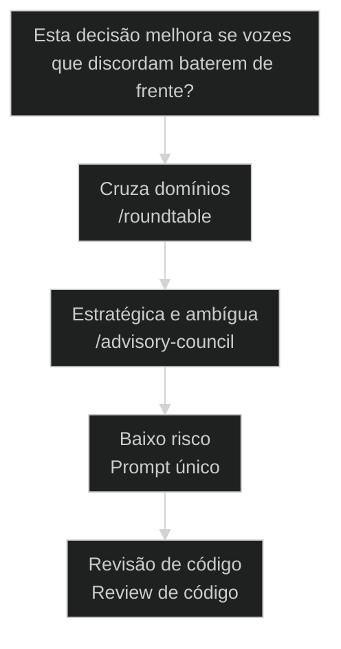
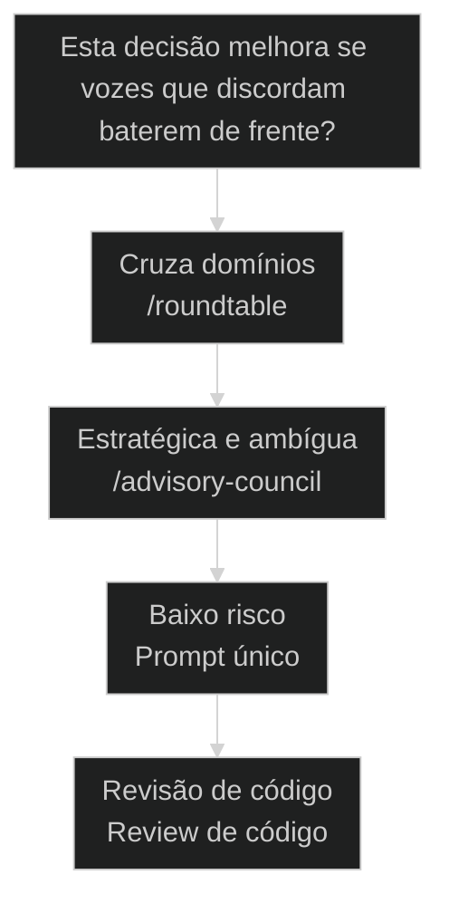

# Mesa-redonda e Advisory Board: decidir com clones em vez de um prompt só

← [[55-triagem-de-squad-novo|Triagem de Squad novo: fase-zero de prior-art + research loop]] · ↑ [[modulos/Módulo 7 - Criar Squad|M7]] · ⌂ [[Cursos/AIOX Advanced/README|Curso]] · → [[36-tech-research-multi-fonte|Tech Research: pesquisa profunda multi-fonte]]

## Conceitos

- [[Mesa-redonda]]

## Mapa desta aula

Decisão-chave da aula — Esta decisão melhora se vozes que discordam baterem de frente?



> Leia o diagrama antes do texto longo. Depois volte e confira.

> Uma decisão difícil pedida a um modelo só vira a opinião média do modelo. [[Mesa-redonda]] convoca vozes que discordam de propósito, anonimiza, sintetiza no cego e revela depois. A discordância é o produto, não o ruído.

**Objetivos de aprendizagem:**
- Nomear o que distingue uma mesa-redonda de um prompt único no AIOX. _(remember)_
- Distinguir lente de especialista (/roundtable) de lente de diversidade cognitiva (/advisory-council). _(understand)_
- Escolher quando convocar um painel em vez de pedir a um modelo só. _(apply)_
- Explicar por que anonimizar e sintetizar no cego protege a decisão do viés de autoridade. _(understand)_

---

## Mesa-redonda: a discordância é o produto

*Decisão AIOX · convocar um painel em vez de um prompt só*

Decisão estratégica pedida a um modelo só volta como a média do modelo: bem escrita, plausível, sem fricção. Mesa-redonda convoca vozes que discordam de propósito, esconde quem disse o quê, sintetiza no cego e só então revela. O que você procura não é o consenso. É onde as vozes batem de frente.

- **3**: fases: convocar, sintetizar no cego, revelar
- **5**: advisors de diversidade cognitiva no painel
- **1**: regra: discordância é sinal, não ruído

- **status**: mesa redonda advisory
- **meta**: prompt_unico=opiniao media
- **meta**: painel=vozes que discordam
- **meta**: regra=sintetiza no cego
- **ready**: ready to convene

**Legenda de cores**

Mapa semantico da Mesa-redonda

- **Painel** (signal): as vozes diversas convocadas para a decisao
- **Sintese** (insight): o veredito montado no cego, sem nome nas respostas
- **Fases** (bench): convocar, anonimizar, sintetizar e revelar
- **Decisao** (action): a escolha que nasce da friccao entre as vozes
- **Erro comum** (pain): pedir a um modelo so e tomar a media por consenso

---

## Comece pela pergunta certa

Antes de listar as fases do painel, fixe a pergunta única: esta decisão melhora se vozes que discordam baterem de frente? Se sim, é território de mesa-redonda, e a primeira ação é convocar o painel, não escrever um prompt melhor. Todo o resto deriva daí.

**Como ler esta aula**

1. **A pergunta aparece**: Uma frase separa pedir a um modelo só de convocar um painel que discorda.
2. **Cada peça mostra a cara**: Convocar reúne vozes diversas. Síntese no cego protege a decisão do viés de autoridade.
3. **Vê o caso real**: /roundtable e /advisory-council são skills reais do AIOX, apontáveis no repo.
4. **Decide**: Dado uma decisão, você aponta se ela merece um painel ou um prompt só.

- **Objetivos da aula** (Nomear o que distingue mesa-redonda de prompt único no AIOX.; Distinguir lente de especialista (/roundtable) de diversidade cognitiva (/advisory-council).; Escolher quando convocar um painel em vez de pedir a um modelo só.; Explicar por que sintetizar no cego protege a decisão do viés de autoridade.)
- **Onde você está?** (Começando: foque Mapa Simples e a analogia do conselho de bordo.; Já usa AIOX: foque Casos Reais e a Decisão.; Vai convocar: foque as 3 Fases e as Métricas.)
- **Leitura prática**: Em cada bloco, procure uma resposta: estou convocando vozes que discordam ou pedindo a opinião média de um modelo só? Quando cada um ajuda e quando atrapalha?

**Ritmo da aula**

A distinção fica clara quando cada peça tem definição curta, exemplo real do framework e o gosto de quando usar.

- G **Pergunta antes do detalhe**: Primeiro o critério que separa, depois cada fase por dentro.
- 1 **Analogia que ancora**: Prompt único é pedir conselho a um sábio. Mesa-redonda é o conselho de bordo: vozes que discordam na mesma sala.
- 2 **Caso real**: /roundtable e /advisory-council são apontáveis no AIOX, não teoria.
- 3 **Recap com decisão**: A aula fecha com o aluno decidindo se uma decisão dele merece um painel.

---

## A diferença sem jargão

Antes dos termos técnicos, a diferença é só isto: prompt único pede a opinião de um modelo só e te devolve a média dele; mesa-redonda convoca várias vozes que discordam de propósito e te entrega a fricção entre elas.

> **Em uma frase**: Prompt único pede a um modelo só: a resposta é a média plausível dele, sem fricção. Mesa-redonda convoca vozes que discordam de propósito, esconde quem disse o quê, sintetiza no cego e revela depois. A regra muda: você não busca o consenso, busca onde as vozes batem de frente. Discordância primeiro, decisão depois.

- **Mesa-redonda é painel convocado** -> Várias vozes diversas reunidas para a mesma decisão. Cada uma com uma lente que as outras não têm.
- **A discordância é o sinal** -> O valor não está onde todas concordam. Está onde uma voz ataca o que a outra propôs. A fricção revela o ponto cego.
- **Síntese no cego é a marca** -> O veredito é montado sem saber quem disse o quê. Sem nome, a ideia vale pelo conteúdo, não pela autoridade de quem falou.
- **Decisão vem depois** -> Só depois da síntese você decide. A escolha nasce da fricção entre as vozes, não do palpite de uma só.
- **O erro caro** -> Pedir a um modelo só e tomar a média por consenso. Você confunde uma voz plausível com um painel, e decide no escuro.

**Diagrama principal: do prompt único à decisão com fricção**

1. **Decisão difícil**: Uma escolha que uma voz só não resolve com segurança.
2. **Painel**: Vozes que discordam de propósito convocadas para a mesma mesa.
3. **Síntese no cego**: O veredito montado sem nome nas respostas, pela ideia.
4. **Decisão**: A escolha que nasce da fricção, não da média de um modelo.

**O que a mesa-redonda evita**
- Tomar a média de um modelo só por consenso real.
- Deixar a autoridade de quem fala pesar mais que a ideia.
- Decidir sem ver onde as vozes batem de frente.
- Confundir uma resposta plausível com um painel diverso.

**O que ela força**
- Convocar vozes que discordam de propósito.
- Anonimizar as respostas antes de sintetizar.
- Procurar a fricção, não o consenso fácil.
- Decidir a partir da síntese, não do palpite de uma voz.

---

## A analogia do conselho de bordo

A forma mais rápida de fixar a diferença: prompt único é pedir conselho a um sábio que te dá uma resposta redonda; mesa-redonda é o conselho de bordo, onde o contrário, o cético e o executor discordam na sua frente. Você decide vendo a briga, não a média.

- **Prompt único = um conselheiro só**: Você pergunta a um sábio. Ele te dá uma resposta coerente, plausível, redonda. Mas é a visão de uma cabeça só, com os pontos cegos de uma cabeça só.
- **Mesa-redonda = conselho de bordo**: Você reúne o contrário, o cético, o executor e o de fora na mesma sala. Eles discordam de propósito. A fricção entre eles expõe o que um conselheiro só esconderia.
- **Anonimato = tirar o crachá**: Antes de decidir, você esconde quem disse cada coisa. Sem o crachá, a ideia do júnior vale o mesmo que a do sênior. A autoridade para de distorcer o peso da ideia.
- **Decisão = ler a fricção**: Com a síntese no cego na mão, você decide vendo onde as vozes bateram de frente. A escolha nasce do confronto, não da média de uma cabeça só.

> **E quando o painel concorda em tudo?**: Se todas as vozes concordam fácil, ou a decisão era trivial e não pedia painel, ou o painel não é diverso de verdade: são clones da mesma cabeça com nomes diferentes. Mesa-redonda só entrega valor quando as vozes têm lentes que discordam. Concordância unânime rápida é sinal de que você convocou um eco, não um conselho.

---

## Prompt único versus painel: o critério da fricção

Esta é a confusão mais cara da decisão com IA. Os dois usam o mesmo modelo por baixo, então parecem o mesmo trabalho. O critério da fricção separa os dois de vez: a decisão melhora se vozes que discordam baterem de frente, ou uma resposta plausível já resolve?

**Prompt único (um conselheiro)**
- Uma voz só responde com a média plausível.
- A autoridade de quem responde não é questionada.
- Rápido e barato, bom para decisão de baixo risco.
- O ponto cego da voz vira o ponto cego da decisão.

**Mesa-redonda (conselho de bordo)**
- Várias vozes que discordam de propósito.
- Anonimato remove o peso da autoridade na síntese.
- Mais caro e lento, vale para decisão de alto risco.
- A fricção entre vozes expõe o ponto cego.

> **A pergunta que separa**: Pergunte: esta decisão melhora se eu vir vozes diversas baterem de frente? Se não, prompt único basta: uma voz plausível resolve. Se sim, é mesa-redonda: convoque o painel, anonimize, sintetize no cego. Prompt único é o sábio que te dá a média; mesa-redonda é o conselho que te dá a fricção.

- **Mesa-redonda com prompt único**: Os dois usam o mesmo modelo por baixo, então parecem o mesmo trabalho.
- **/roundtable com /advisory-council**: Os dois convocam um painel de várias vozes, então parecem a mesma skill.
- **Síntese no cego com votação**: Os dois agregam várias respostas, então parecem o mesmo passo.

---

## A mesa-redonda existe de verdade no AIOX

A distinção não é teoria. A mesa-redonda é apontável no framework. Estes dois casos mostram as skills reais do AIOX que convocam um painel de vozes diversas para uma decisão difícil.

- **Onde a mesa-redonda vive no AIOX**: O AIOX tem dois primitivos de painel: /roundtable (lentes de especialista de domínio, review por consenso) e /advisory-council (5 advisors de diversidade cognitiva, 3 fases com síntese no cego). A mesa-redonda não é abstração: tem skill, tem lentes nomeadas e tem fluxo de fases. Players: /roundtable, /advisory-council, lentes de especialista, 5 advisors cognitivos, síntese no cego.
- **O que muda a decisão**: A pergunta não é qual skill é melhor. É que tipo de fricção a decisão pede. Cruza domínios técnicos? /roundtable com lentes de especialista. Pede formas de pensar diferentes? /advisory-council com diversidade cognitiva.

**Cada conceito num eixo**

A distinção vira sistema quando cada conceito tem definição, lar no framework e o tipo de decisão que resolve.

- **Painel**: Vozes diversas convocadas para a mesma decisão. /roundtable e /advisory-council são os primitivos.
- **Anonimato**: Esconder quem disse o quê antes de sintetizar. Remove o viés de autoridade da síntese.
- **Síntese no cego**: O veredito montado sem nome nas respostas, pela ideia, não pelo crachá.
- **Decisão**: A escolha que nasce da fricção entre as vozes, depois da síntese.

**Colunas:** Conceito | Convoca ou decide? | Sinal de uso certo | Sinal de erro

- Painel: Convoca ou decide? | Vozes com lentes que de fato discordam. | Clones da mesma cabeça com nomes diferentes.
- Anonimato: Convoca ou decide? | Respostas sem nome antes da síntese. | A autoridade de quem falou pesa na síntese.
- Síntese no cego: Convoca ou decide? | Veredito montado pela ideia, não pelo crachá. | Síntese feita sabendo quem é a voz influente.
- Decisão: Convoca ou decide? | Escolha nascida da fricção entre vozes. | Média de um modelo só tomada por consenso.

### Caso: O /roundtable convoca lentes de especialista

A mesa-redonda não é metáfora de aula: o AIOX tem a skill /roundtable, que orquestra reviews multiagente por consenso com lentes de especialista de domínio (@architect, @cso, @qa) e fallback quando um agente falha.

- Começou como: Uma decisão de arquitetura pedida a um modelo só, que voltava plausível mas sem fricção entre visões.
- Virou: Um review multiagente onde cada lente de especialista ataca a proposta pelo seu domínio antes do veredito.
- Prova: A skill /roundtable existe no AIOX: orquestra reviews de consenso multiagente com Agent Teams e fallback.
- Lição: Mesa-redonda é primitivo real: tem skill, tem lentes nomeadas, tem veredito por consenso.

### Caso: O /advisory-council monta um painel de diversidade cognitiva em 3 fases

Na visão de diversidade cognitiva, o AIOX tem a skill /advisory-council: spawna 5 advisors com lentes que pensam diferente (contrário, primeiros princípios, expansão, de fora, executor), e roda em 3 fases: anonimiza as respostas, sintetiza no cego, depois revela quem disse o quê.

- Começou como: Uma decisão estratégica pedida a um modelo só, refém do viés de autoridade e do ponto cego de uma cabeça.
- Virou: Um painel de 5 advisors cognitivamente diversos, sintetizado no cego pelo Team Lead antes de revelar os nomes.
- Prova: A skill /advisory-council existe no AIOX com 5 advisors nomeados (Contrário, Primeiros Princípios, Expansão, De Fora, Executor) e síntese anonimizada em 3 fases.
- Lição: As 3 fases não são opcionais: anonimizar, sintetizar no cego e revelar é o que protege a decisão da autoridade.

---

## As 3 fases da mesa-redonda

A mesa-redonda não é um brainstorm solto. É um pipeline de fases nomeadas, da convocação do painel à decisão. Cada fase fecha antes da próxima abrir, e o anonimato no meio é o que protege o veredito.

**Pipeline da mesa-redonda**
As fases ordenadas que convocam o painel, sintetizam no cego e revelam, antes de qualquer decisão.
- **1. Convocar**: Reunir as vozes diversas, cada uma com a lente que as outras não têm.
- **2. Responder**: Cada voz responde à decisão pelo seu ângulo, independente das outras.
- **3. Anonimizar**: Esconder quem disse o quê antes que a síntese comece.
- **4. Sintetizar no cego**: Montar o veredito pela ideia, sem saber a autoridade de quem falou.
- **5. Revelar**: Devolver os nomes ao relatório final, agora que a síntese já está pronta.
- **6. Decidir**: Escolher a partir da fricção que a síntese expôs, não da média de uma voz.

**anonimato fecha antes da síntese abrir**

1. **Convocação**: O painel de vozes diversas é reunido para a mesma decisão.
2. **Anonimato**: As respostas perdem o nome antes de qualquer síntese.
3. **Síntese**: O veredito é montado no cego, pela ideia, não pelo crachá.
4. **Decisão**: A escolha nasce da fricção exposta pela síntese, depois da revelação.

---

## Como painel, síntese e decisão se combinam

Painel, síntese e decisão não são rivais; são camadas em sequência. O painel convoca, a síntese no cego integra a fricção, a decisão escolhe. Entender a direção evita decidir antes de ler o desacordo.

- **1. Convocar (Painel)**: Quem traz as vozes diversas. O painel reúne lentes que discordam de propósito. É a única etapa que apenas coleta perspectivas. [WHY, convoca, coleta]
- **2. Integrar (Síntese no cego)**: O que ficou da fricção. O veredito montado sem nome nas respostas: a ideia vale pelo conteúdo. O artefato que sobrevive ao painel. [WHAT, fricção, no cego]
- **3. Escolher (Decisão)**: Como a fricção vira ação. A escolha que nasce da síntese, depois da revelação. Zero média de um modelo, máxima rastreabilidade. [HOW, escolha, da fricção]

---

## Quando convocar um painel?

Antes de escrever um prompt melhor, decida se a decisão merece um painel. O critério economiza tempo quando você escolhe pela fricção que a decisão pede, não pela vontade de parecer rigoroso.

**Árvore de decisão**
_Responda pela fricção antes de pensar em qual skill usar._



- **Cruza domínios** — A decisão toca arquitetura, produto, qualidade ao mesmo tempo e cada área tem uma lente própria.
  → _/roundtable_
  Ex.: Rode /roundtable: lentes de especialista (@architect, @cso, @qa) batem de frente por domínio.
- **Estratégica e ambígua** — Decisão de alto risco que se beneficia de formas de pensar diferentes, não de domínios técnicos.
  → _/advisory-council_
  Ex.: Rode /advisory-council: 5 advisors cognitivos, síntese no cego em 3 fases.
- **Baixo risco** — Decisão reversível, barata, onde uma voz plausível já resolve com segurança.
  → _Prompt único_
  Ex.: Não precisa de painel. Um prompt único entrega a resposta no custo certo.
- **Revisão de código** — A decisão é sobre correção de código, não estratégia nem arquitetura ampla.
  → _Review de código_
  Ex.: Use a lente certa de código (ex: /[[CodeRabbit|coderabbit]]-review), não um painel estratégico.

**Gate:** Qual é o gate? — _Sem gate, você convoca painel por reflexo ou pula por pressa. Responda: a decisão é de alto risco e melhora com fricção entre vozes diversas? Se cruza domínios, /roundtable. Se é estratégica e ambígua, /advisory-council. Se é baixo risco, prompt único. Se é código, a lente de review certa._

> **Regra do critério único**: A escolha não é pela importância sentida do problema; é pela fricção que a decisão de fato pede. Se vozes que discordam expõem um ponto cego que uma voz só esconderia, o painel é a peça. Se a decisão é baixo risco e reversível, o painel é overengineering. Pedir a um modelo só numa decisão estratégica de alto risco e tomar a média por consenso é o erro mais caro do início.

---

## Rotas de mesa-redonda

Cada tipo de decisão tem um modo típico de painel. Saber a rota evita decidir certo pela mesa-redonda e materializar com a skill errada.

#### Painel de especialistas de domínio
Quando a decisão cruza domínios e cada área pede uma lente própria.
1. **Sinal: decisão de arquitetura ou produto que toca várias áreas.
2. **Pergunta: cada domínio tem uma lente que as outras não cobrem?
3. **Ação: rodar /roundtable com as lentes de especialista relevantes.
4. **Resultado: veredito por consenso depois das lentes baterem de frente.

#### Painel de diversidade cognitiva
Quando a decisão é estratégica e pede formas de pensar diferentes.
1. **Sinal: decisão de alto risco, ambígua, sem domínio técnico óbvio.
2. **Pergunta: você precisa de lentes que pensam diferente, não de especialistas?
3. **Ação: rodar /advisory-council com os 5 advisors e síntese no cego.
4. **Resultado: veredito anonimizado em 3 fases, revelado só no fim.

#### Prompt único para baixo risco
Quando a decisão é reversível e uma voz plausível já resolve.
1. **Sinal: decisão barata, reversível, de baixo impacto.
2. **Pergunta: a fricção entre vozes mudaria a escolha de verdade?
3. **Ação: pedir a um modelo só, sem convocar painel.
4. **Resultado: resposta no custo certo sem overengineering.

**Painel de especialistas**
Use quando a decisão cruza domínios e cada um precisa de uma lente própria.
- `/roundtable`: orquestra o review por consenso com lentes de especialista.
- `ler o veredito`: examinar onde as lentes bateram de frente antes de decidir.

**Painel de diversidade cognitiva**
Use quando a decisão é estratégica e pede formas de pensar diferentes.
- `/advisory-council`: spawna os 5 advisors e roda as 3 fases.
- `ler a síntese no cego`: examinar a fricção antes da revelação dos nomes.

**Prompt único**
Use quando a decisão é baixo risco e reversível.
- `prompt direto`: pedir a resposta a um modelo só, sem painel.
- `validar o custo`: confirmar que a fricção não mudaria a escolha.

---

## Modelos para ler melhor

Visualizações rápidas para o aluno comparar prompt único, /roundtable e /advisory-council, os riscos de cada escolha e o grau de fricção que cada decisão exige.

- **Estratégica de alto risco**: alto (decisão ambígua pede painel diverso completo.)
- **Cruza domínios**: alto (lentes de especialista batendo de frente.)
- **Baixo risco reversível**: baixo (uma voz plausível já resolve no custo certo.)

- **Estratégica com prompt único**: estratégica (tomar a média de um modelo por consenso real.)
- **Baixo risco com painel pesado**: baixo risco (gastar tempo e custo num eco sem fricção.)
- **Painel sem anonimato**: painel (a voz mais alta dominar a síntese.)

**Matriz de Decisão do Aluno**

Em dúvida, escolha a célula que melhor descreve a sua decisão.

- **Decisão cruza domínios**: /roundtable com lentes de especialista de domínio.
- **Estratégica e ambígua**: /advisory-council com 5 advisors e síntese no cego.
- **Baixo risco reversível**: Prompt único. Uma voz plausível resolve.
- **Revisão de código**: Lente de review de código, não painel estratégico.
- **Painel concorda fácil demais**: Suspeite de eco: vozes não são diversas de verdade.
- **Não sabe ainda**: Pergunte: a fricção entre vozes mudaria a escolha? Sim, painel.

- **Sinal de painel saudável**: vozes com lentes que de fato discordam / diversidade parcial, algumas lentes se sobrepõem / clones da mesma cabeça com nomes diferentes
- **Proteção da síntese**: respostas anonimizadas antes de sintetizar / anonimato parcial, alguns nomes vazam / síntese feita sabendo quem é a voz influente

---

## O que cada peça carrega

Cada peça da mesa-redonda tem uma anatomia mínima. Saber o que cada uma guarda ajuda a reconhecer quando você está convocando um eco ou usando a skill errada.

- **Painel: as vozes**: Lentes diversas convocadas para a mesma decisão. Carrega o desacordo de propósito.
- **Anonimato: o crachá fora**: Esconder quem disse o quê antes da síntese. Tira o peso da autoridade da ideia.
- **/roundtable: a skill de domínio**: O review por consenso com lentes de especialista (@architect, @cso, @qa).
- **/advisory-council: o painel cognitivo**: Os 5 advisors de diversidade cognitiva com síntese no cego em 3 fases.
- **Decisão: a escolha**: A ação que nasce da fricção. Nunca vem da média de um modelo, sempre da síntese.

---

## Métricas da mesa-redonda

Sem telemetria, a saúde do painel vira fé. Estas perguntas separam uma mesa-redonda confiável de um eco disfarçado de conselho diverso.

**Colunas:** Métrica | Pergunta | Sinal saudável | Sinal de risco

- Diversidade real: As vozes têm lentes que de fato discordam? | O painel produz fricção, não eco. | Clones da mesma cabeça concordando em tudo.
- Anonimato: A síntese foi feita sem saber quem disse o quê? | Respostas anonimizadas antes de sintetizar. | A autoridade de uma voz pesou na síntese.
- Fricção capturada: O veredito mostra onde as vozes bateram de frente? | O desacordo aparece integrado na síntese. | Só o consenso fácil sobreviveu, a fricção sumiu.
- Rastreabilidade: A decisão aponta para a fricção que a justifica? | Cada escolha traça de volta a uma voz do painel. | Decisão tomada sem âncora no que o painel expôs.

---

## Quando resistir ao painel

A distinção ajuda mais quando você resiste ao reflexo de convocar painel para tudo. A mesa-redonda tem custo: tempo de várias vozes, síntese, fases. Vale só quando a fricção paga.

**Quando convocar um painel**
- A decisão é de alto risco e difícil de reverter.
- Vozes que discordam expõem um ponto cego real.
- A escolha cruza domínios ou pede formas de pensar diferentes.
- O custo de decidir errado supera o custo do painel.

**Quando não convocar**
- A decisão é barata e reversível sem dor.
- Uma voz plausível já resolve com segurança.
- O painel viraria um eco, sem diversidade real.
- O custo do painel supera o ganho da fricção.

---

## Exercício: decida o painel

Pegue uma decisão real sua e aplique o critério. O objetivo não é convocar todas as vozes; é apontar se a decisão merece um painel antes de pedir a um modelo só.

**Uma decisão, cinco perguntas**
```yaml
mesa_redonda:
  decisao: "o que voce precisa decidir?"
  friccao: "vozes que discordam mudariam a escolha? sim | nao"
  peca: "painel_especialista | painel_cognitivo | prompt_unico"
  skill: "roundtable | advisory_council | prompt_direto"
  gate: "por que nao a outra rota? (se painel, quais vozes precisam discordar?)"

```
*O acerto não é convocar todas as vozes. É provar que você escolheu a rota pela fricção que a decisão pede e sabe justificar por que a outra custaria mais sem entregar mais segurança.*

**Exemplo preenchido: escolher a stack de um produto novo versus aprovar um texto de e-mail**

- **Decisão A**: Escolher a stack de um produto novo que vai sustentar a empresa por anos.
- **Fricção A**: Sim. Cada dominio (arquitetura, custo, qualidade) tem uma lente que as outras nao cobrem.
- **Peça A**: Painel de especialistas. Rodo /roundtable com @architect, @cso e @qa batendo de frente antes do veredito.
- **Decisão B**: Aprovar um texto de e-mail interno de baixo impacto.
- **Peça B**: Prompt unico. Decisao barata e reversivel: uma voz plausivel resolve no custo certo.
- **Gate B**: Painel nao se aplica: a friccao entre vozes nao mudaria a escolha, entao convocar painel seria overengineering.

- 1. **Decisão**: Descreva em uma frase a decisão que você precisa tomar.
- 2. **Fricção?**: Responda: vozes que discordam mudariam a escolha, ou uma resposta plausível já resolve?
- 3. **Peça**: Aponte painel de especialistas (/roundtable), painel cognitivo (/advisory-council) ou prompt único.
- 4. **Skill**: Diga como rodaria: /roundtable para cruzar domínios, /advisory-council para diversidade cognitiva, prompt direto para baixo risco.
- 5. **Gate**: Justifique por que não escolheu a outra rota. Para painel, diga quais vozes precisam discordar para o veredito valer.

**Funcionou se:**

- O aluno escolhe a rota pela fricção que a decisão pede, não pela vontade de parecer rigoroso.
- O aluno separa convocar o painel (várias vozes) de pedir a um modelo só (uma voz).
- O aluno define quais vozes precisam discordar quando escolhe um painel.

---

## Glossário da Mesa-redonda

Tradução dos termos para alguém que está vendo a distinção prompt único versus painel pela primeira vez.

- **Mesa-redonda**: Convocar várias vozes que discordam de propósito para uma decisão, sintetizar no cego e decidir pela fricção, em vez de pedir a um modelo só.
- **Prompt único**: Pedir a decisão a um modelo só. A resposta é a média plausível dele, sem fricção entre visões diferentes.
- **Painel**: O conjunto de vozes diversas convocadas para a mesma decisão, cada uma com uma lente que as outras não têm.
- **/roundtable**: A skill do AIOX que orquestra reviews por consenso com lentes de especialista de domínio (@architect, @cso, @qa) e fallback.
- **/advisory-council**: A skill do AIOX que spawna 5 advisors de diversidade cognitiva (Contrário, Primeiros Princípios, Expansão, De Fora, Executor) e sintetiza no cego em 3 fases.
- **Síntese no cego**: Montar o veredito sem saber quem disse cada resposta. A ideia vale pelo conteúdo, não pela autoridade de quem falou.
- **Anonimato**: Esconder quem disse o quê antes da síntese. Remove o viés de autoridade do veredito.
- **Diversidade cognitiva**: Lentes que pensam diferente (contrário, primeiros princípios, executor), não que dominam domínios diferentes. A forma de pensar é a diversidade.

> **Portão da aula**: A aula só está no padrão quando o aluno nomeia o que distingue mesa-redonda de prompt único, distingue a lente de especialista (/roundtable) da lente de diversidade cognitiva (/advisory-council) e consegue apontar, para uma decisão real, se ela exige um painel (alto risco, fricção entre vozes, via /roundtable ou /advisory-council com síntese no cego) ou um prompt único (baixo risco, reversível) antes de tomar a escolha.

***


---

## Navegação

← [[55-triagem-de-squad-novo|Triagem de Squad novo: fase-zero de prior-art + research loop]] · ↑ [[modulos/Módulo 7 - Criar Squad|M7]] · ⌂ [[Cursos/AIOX Advanced/README|Curso]] · → [[36-tech-research-multi-fonte|Tech Research: pesquisa profunda multi-fonte]]
