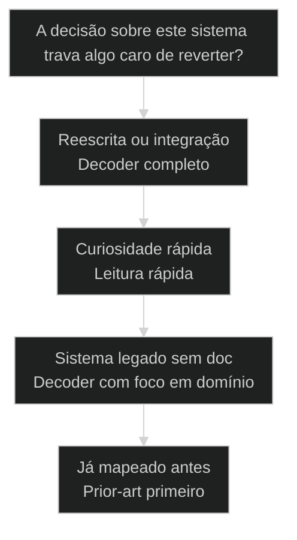
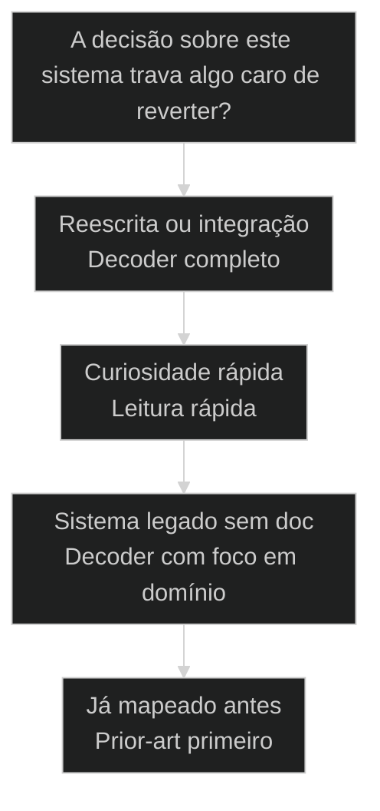

# Code Anatomy: engenharia reversa de código com /code-anatomist

← [[37-spy-bench-comparativo|Spy/Bench: comparação profunda entre dois projetos]] · ↑ [[modulos/Módulo 8 - Pipeline de Research|M8]] · ⌂ [[Cursos/AIOX Advanced/README|Curso]] · → [[39-pasta-os-curadoria-local|Pasta OS: curadoria local de open-source para o agente]]

## Conceitos

- [[Brownfield Discovery]]

## Mapa desta aula

> **Neste acervo:** use a skill `code-anatomist` e/ou o squad `code-anatomist`; para regras de domínio brownfield, `decoder-chief` → squad `domain-decoder`. Referências a `/deep-research` mapeiam para `tech-research` + squad `research`.


Decisão-chave da aula — A decisão sobre este sistema trava algo caro de reverter?



> Leia o diagrama antes do texto longo. Depois volte e confira.

> Ler código no olho devolve um palpite sobre o que ele faz. O /code-anatomist do AIOX devolve a anatomia: arquitetura, domínio, dados, API, dependências e infra extraídos em 9 fases. O código vira inteligência de negócio, não chute.

**Objetivos de aprendizagem:**
- Nomear o que distingue extrair a anatomia de um código com o /code-anatomist de ler o código no olho. _(remember)_
- Distinguir as camadas que o decoder extrai: arquitetura, domínio, dados, API, dependências e infra. _(understand)_
- Escolher quando rodar o /code-anatomist completo em vez de uma leitura rápida do código. _(apply)_
- Explicar por que extrair a regra de negócio reduz o risco de reescrever um sistema que você ainda não entende. _(understand)_

---

## Engenharia reversa: o código medido camada por camada, não no olho

*Code Anatomy AIOX · engenharia reversa de código*

Ler um código no olho devolve um palpite sobre o que ele faz e para por aí. O /code-anatomist investiga o sistema a fundo, extrai arquitetura, domínio, dados, API, dependências e infra em 9 fases, e entrega a regra de negócio formalizada. Quem lê no olho reescreve pelo achismo.

- **9**: fases de engenharia reversa do /code-anatomist
- **6**: camadas extraídas: arquitetura, domínio, dados, API, deps, infra
- **1**: regra: extrair a regra de negócio antes de reescrever

- **status**: code anatomy
- **meta**: ler no olho=palpite sobre o sistema
- **meta**: code-anatomist=9 fases, 6 camadas
- **meta**: regra=extrair a regra antes de reescrever
- **ready**: ready to decode

**Legenda de cores**

Mapa semantico do Code Anatomy

- **Spy** (signal): investigar o codigo a fundo antes de tirar conclusao
- **Anatomia** (insight): as camadas extraidas: arquitetura, dominio, dados, API
- **Regra de negocio** (bench): a logica de dominio que o codigo esconde, formalizada
- **Decoder** (action): o code-anatomist que roda as 9 fases e entrega o mapa
- **Ler no olho** (pain): palpite sobre o sistema sem dominio, sem dados, sem mapa

---

## Comece pela pergunta certa

Antes de listar as camadas da anatomia, fixe a pergunta única: você precisa entender o sistema fundo o bastante para reescrever, integrar ou auditar com segurança? Se sim, ler no olho não basta. A primeira ação é extrair a anatomia, não chutar o que o código faz pelas primeiras linhas.

**Como ler esta aula**

1. **A pergunta aparece**: Uma frase separa ler no olho de extrair a anatomia que sustenta uma decisão sobre o sistema.
2. **Cada camada mostra a cara**: Spy investiga, anatomia extrai as camadas, a regra de negócio formaliza, o decoder roda.
3. **Vê o caso real**: A skill /code-anatomist é um primitivo real do AIOX, apontável no repo, com 9 fases.
4. **Decide**: Dado um sistema desconhecido, você aponta se ele exige o decoder completo ou uma leitura rápida basta.

- **Objetivos da aula** (Nomear o que distingue extrair a anatomia com o /code-anatomist de ler o código no olho.; Distinguir as camadas: arquitetura, domínio, dados, API, dependências e infra.; Escolher quando rodar o /code-anatomist completo em vez de uma leitura rápida.; Explicar por que extrair a regra de negócio reduz o risco de reescrever às cegas.)
- **Onde você está?** (Começando: foque Mapa Simples e a analogia da autópsia.; Já usa AIOX: foque Casos Reais e a Decisão.; Vai reescrever um sistema: foque as Camadas e as Métricas.)
- **Leitura prática**: Em cada bloco, procure uma resposta: estou chutando o que o código faz pelas primeiras linhas ou extraindo arquitetura, domínio e dados camada por camada? Quando cada caminho ajuda e quando atrapalha?

**Ritmo da aula**

A distinção fica clara quando cada camada tem definição curta, exemplo real do framework e o gosto de quando usar.

- G **Pergunta antes do detalhe**: Primeiro a pergunta que separa, depois cada camada da anatomia por dentro.
- 1 **Analogia que ancora**: Ler código no olho é olhar a fachada do prédio. Code anatomy é abrir a planta e ver a estrutura por dentro.
- 2 **Caso real**: A skill /code-anatomist é apontável no AIOX, com 9 fases e extração de regra de negócio, não teoria.
- 3 **Recap com decisão**: A aula fecha com o aluno decidindo se um sistema desconhecido exige o decoder completo.

---

## A diferença sem jargão

Antes dos termos técnicos, a diferença é só isto: ler no olho chuta o que o código faz pelas primeiras telas; o code anatomy investiga o sistema a fundo, extrai cada camada, formaliza a regra de negócio escondida e entrega o mapa da estrutura inteira.

> **Em uma frase**: Ler código no olho chuta o que o sistema faz pela impressão das primeiras telas: rápido, mas cego à arquitetura e à regra de negócio que ficaram escondidas. O Code Anatomy investiga o código a fundo, extrai arquitetura, domínio, dados, API, dependências e infra, e formaliza a regra de negócio antes de qualquer conclusão. A ordem muda: extrai a anatomia antes, formaliza a regra no meio, decide reescrever no fim.

- **Spy é investigar a fundo** -> Não um relance no README, mas uma varredura profunda do sistema antes de tirar conclusão. O código é investigado como o pipeline `tech-research` / squad `research` investigaria um tema.
- **Anatomia é o que se extrai** -> As camadas do sistema, nomeadas: arquitetura, domínio, dados, API, dependências, infra. Sem a anatomia, você não sabe como o sistema funciona, só como a tela parece.
- **A regra de negócio é o ouro** -> A lógica de domínio que o código esconde, formalizada. Onde a anatomia revela uma regra implícita, mora a inteligência que o olho não viu.
- **O decoder é a marca** -> Você sai da leitura com a anatomia mapeada e a regra de negócio extraída, não com uma impressão. Sem o /code-anatomist, não houve engenharia reversa.
- **O erro caro** -> Ler no olho: chutar o que o código faz pelas primeiras telas, sem arquitetura, sem domínio, sem a regra de negócio. Você reescreve pela impressão e descobre a regra que faltava tarde.

**Diagrama principal: do código à regra de negócio**

1. **Sistema**: O código desconhecido que você precisa entender a fundo, com a pergunta definida antes.
2. **Anatomia**: Cada camada é extraída: arquitetura, domínio, dados, API.
3. **Regra de negócio**: A lógica de domínio escondida fica formalizada, camada por camada.
4. **Decoder**: O mapa acionável com a anatomia e a regra de negócio extraída.

**O que o decoder evita**
- Chutar o que o sistema faz pelas primeiras telas.
- Reescrever sem entender a arquitetura.
- Afirmar uma regra de negócio sem extraí-la do código.
- Achar que entendeu o sistema sem mapear as camadas.

**O que ele força**
- Investigar o código a fundo antes de concluir.
- Extrair arquitetura, domínio, dados, API, deps e infra.
- Formalizar a regra de negócio escondida no código.
- Mapear a anatomia antes de decidir reescrever.

---

## A analogia da planta do prédio

A forma mais rápida de fixar a diferença: ler código no olho é olhar a fachada do prédio; o code anatomy é abrir a planta e ver a estrutura por dentro. Quem só olha a fachada vê a cor da parede, não a viga que sustenta o andar.

- **Ler no olho = olhar a fachada**: Você passa na frente e decide pela aparência: a fachada bonita, a tela que abre, a primeira impressão. Rápido, mas cego. O que sustenta o prédio de verdade fica invisível.
- **Anatomia = abrir a planta**: Cada camada é um andar da planta: fundação, estrutura, hidráulica, elétrica. O decoder extrai cada uma. Você não decide pela fachada, decide pela planta inteira do sistema.
- **Regra de negócio = a viga escondida**: A planta revela a viga que sustenta o andar e ninguém via da rua. A regra de negócio é essa viga: a lógica de domínio que o código esconde. O ouro aparece na planta, não na fachada.
- **Decoder = o laudo do engenheiro**: Com tudo mapeado, você cataloga o laudo: como o sistema funciona, quais regras o sustentam, onde estão os riscos. O /code-anatomist é o laudo acionável: não só o que o código faz, mas a regra que o move.

> **E quando a fachada basta?**: Nem todo código pede planta. Ler um script de 20 linhas que só renomeia um arquivo é fachada por natureza, e rodar o decoder seria desperdício. O erro é tratar um sistema legado que você vai reescrever como se fosse um script trivial. Decoder onde o sistema pesa, leitura rápida onde o código é trivial.

---

## Ler no olho versus extrair a anatomia: o critério do peso

Esta é a confusão mais cara antes de mexer num sistema desconhecido. Os dois falam de entender o código, então parecem o mesmo trabalho. O critério do peso separa os dois: a decisão sobre o sistema trava algo caro de reverter ou só resolve uma curiosidade rápida?

**Ler no olho (impressão)**
- Um relance no README, chuta o que o código faz.
- Sem camadas: você não sabe como a arquitetura se sustenta.
- Regra de negócio implícita, nunca formalizada.
- Conclusão afirmada sem extrair o domínio.

**Code anatomy (planta)**
- Spy profundo do sistema antes de concluir.
- Camadas extraídas: arquitetura, domínio, dados, API.
- Regra de negócio formalizada a partir do código.
- Decoder com a anatomia mapeada e a regra extraída.

> **A pergunta que separa**: Pergunte: a decisão sobre este sistema trava algo caro de reverter? Se não, ler no olho basta: rápido e suficiente para uma curiosidade. Se sim, é code anatomy: investigue o sistema a fundo, extraia cada camada e formalize a regra de negócio. Reescrever um sistema legado pela impressão é decidir pela fachada.

- **Code anatomy com ler o código no olho**: Os dois falam de entender o sistema, então parecem o mesmo trabalho.
- **Spy com um relance no README**: Os dois olham o sistema antes de mexer, então parecem o mesmo passo.
- **Regra de negócio com um comentário no código**: Os dois descrevem o que o código faz, então parecem a mesma coisa.

---

## O code anatomy existe de verdade no AIOX

A distinção não é teoria. O /code-anatomist é apontável no framework. Estes dois casos mostram os primitivos reais do AIOX que investigam um sistema a fundo, extraem cada camada e formalizam a regra de negócio antes de qualquer reescrita.

- **Onde a engenharia reversa vive no AIOX**: O AIOX tem o primitivo /code-anatomist: investiga um sistema com 9 fases, extrai arquitetura, domínio, dados, API, dependências e infra, e formaliza a regra de negócio. A engenharia reversa não é abstração: tem skill, tem 9 fases e tem a regra de negócio extraída. Players: /code-anatomist, engenharia reversa, 9 fases, arquitetura, domínio, regra de negócio, domain decoder.
- **O que muda a decisão**: A pergunta não é qual a aparência do sistema. É se a decisão sobre ele trava algo caro de reverter. Sistema que você vai reescrever ou integrar pede decoder completo com a anatomia extraída. Script trivial de 20 linhas, não.

**Cada camada num eixo**

A distinção vira sistema quando cada camada tem definição, lar no framework e o tipo de decisão que sustenta.

- **Spy**: Investigar o sistema a fundo antes de concluir. O /code-anatomist abre com deep research do código.
- **Anatomia**: As camadas extraídas: arquitetura, domínio, dados, API. As 9 fases do pipeline.
- **Regra de negócio**: A lógica de domínio escondida, formalizada. O ouro do domain decoder.
- **Decoder**: O mapa acionável com a anatomia e a regra extraída, depois das 9 fases.

**Colunas:** Camada | Extrai ou chuta? | Sinal de uso certo | Sinal de erro

- Spy: Extrai ou chuta? | Deep research do sistema antes de concluir. | Um relance superficial no README.
- Anatomia: Extrai ou chuta? | Camadas nomeadas: arquitetura, domínio, dados, API. | Conclusão tirada sem mapear as camadas.
- Regra de negócio: Extrai ou chuta? | Lógica de domínio formalizada a partir do código. | Regra implícita afirmada sem extração.
- Decoder: Extrai ou chuta? | Anatomia mapeada e regra de negócio extraída. | Impressão solta sem anatomia nem regra.

### Caso: O /code-anatomist roda 9 fases de engenharia reversa

A engenharia reversa não é uma metáfora de aula: o AIOX tem a skill /code-anatomist, um pipeline completo de 9 fases que cobre arquitetura, domínio, dados, API, dependências e infra. O sistema desconhecido vira anatomia mapeada, não palpite.

- Começou como: Um sistema desconhecido que a leitura no olho resolveria pela impressão das primeiras telas, sem saber como a arquitetura se sustenta.
- Virou: Uma anatomia construída em 9 fases, com cada camada extraída e a regra de negócio formalizada antes de qualquer reescrita.
- Prova: A skill /code-anatomist existe no AIOX como pipeline de engenharia reversa de 9 fases cobrindo arquitetura, domínio, dados, API, dependências e infra.
- Lição: Engenharia reversa é primitivo real: tem skill, tem 9 fases, tem extração por camada e tem regra de negócio formalizada.

### Caso: O domain decoder extrai a regra de negócio escondida no código

Na visão de extração, o decoder não para na arquitetura: o foco é a regra de negócio que o código esconde. O Domain Decoder, renomeado para Code Anatomy, foi feito para extrair inteligência de domínio de um sistema legado. Engenharia reversa não é só ler, é formalizar a lógica que ninguém documentou.

- Começou como: Um sistema legado cuja lógica de negócio vivia só no código, sem documentação, sem regra formalizada.
- Virou: Uma extração que nomeia cada regra de domínio escondida no código, virando inteligência de negócio reutilizável.
- Prova: MASTER-CO-20 cobre Decoder=extrair inteligência (aula-08 CO-07), Domain Decoder=engenharia reversa (t2-aula-1 CO-06) e a renomeação para Code Anatomy (t2-aula-5 CO-05).
- Lição: A regra de negócio não é detalhe técnico: é o ouro que o decoder extrai do sistema legado para formalizar o domínio.

---

## As camadas do decoder /code-anatomist

O /code-anatomist não é um olhar genérico no código. É um pipeline de camadas nomeadas, do spy do sistema à regra de negócio formalizada. Cada camada fecha antes da próxima abrir.

**Pipeline de engenharia reversa**
As camadas ordenadas que investigam o sistema antes de emitir o mapa.
- **1. Arquitetura**: O esqueleto do sistema: módulos, fronteiras e como as partes se ligam.
- **2. Domínio**: A regra de negócio escondida no código, formalizada como lógica de domínio.
- **3. Dados**: O modelo de dados: entidades, relações e como o estado é guardado.
- **4. API**: As superfícies de entrada e saída: endpoints, contratos e integrações.
- **5. Dependências**: O que o sistema importa e de quem depende para funcionar.
- **6. Infra**: Onde e como o sistema roda: deploy, ambiente e operação.

**a anatomia fecha antes do mapa abrir**

1. **Spy**: O pipeline investiga o sistema a fundo antes de concluir.
2. **Extrair camadas**: Cada camada é nomeada: arquitetura, domínio, dados, API.
3. **Regra de negócio**: A lógica de domínio escondida fica formalizada.
4. **Decoder**: O mapa nasce da anatomia e da regra, camada por camada.

---

## Como spy, anatomia e regra de negócio se combinam

Spy, anatomia e regra de negócio não são rivais; são camadas em sequência. O spy investiga, a anatomia extrai, a regra de negócio formaliza. Entender a direção evita concluir sobre o sistema antes de mapear as camadas.

- **1. Investigar (Spy)**: Quem olha o sistema a fundo. O deep research do código antes de concluir. É a única etapa que varre sem ainda formalizar. [WHO, investiga, spy]
- **2. Mapear (Anatomia)**: O quanto cada camada revela. A extração de arquitetura, domínio, dados, API, deps e infra. O gate que separa engenharia reversa de impressão. [WHAT, anatomia, camadas]
- **3. Formalizar (Regra de negócio)**: Como o código vira inteligência. A regra de domínio escondida, formalizada. Zero chute, máxima rastreabilidade. [HOW, regra de negócio, domínio]

---

## Quando rodar /code-anatomist completo?

Antes de mexer no código, decida se o sistema merece o pipeline completo. O critério economiza tempo quando você escolhe pelo peso da decisão que a anatomia sustenta, não pela vontade de já reescrever.

**Árvore de decisão**
_Responda pelo peso da decisão antes de pensar em como o código parece._



- **Reescrita ou integração** — Você vai reescrever, migrar ou integrar o sistema e errar custa caro.
  → _Decoder completo_
  Ex.: Rode /code-anatomist completo: spy, anatomia por camada e regra de negócio formalizada.
- **Curiosidade rápida** — Você só quer saber o que um script trivial faz e errar custa quase nada.
  → _Leitura rápida_
  Ex.: Não precisa do decoder. Ler no olho resolve sem desperdício.
- **Sistema legado sem doc** — A regra de negócio vive só no código legado e ninguém sabe explicá-la.
  → _Decoder com foco em domínio_
  Ex.: Rode o decoder com foco no domínio: cada regra escondida vira inteligência formalizada.
- **Já mapeado antes** — O sistema pode já ter um mapa de anatomia anterior no repositório.
  → _Prior-art primeiro_
  Ex.: Consulte o prior-art antes de gastar budget. Reuse o mapa se as camadas batem.

**Gate:** Qual é o gate? — _Sem gate, você roda o decoder por reflexo ou aceita o olho por pressa. Responda: a decisão pesa e ainda não há mapa de anatomia? Se sim, /code-anatomist completo. Se não, leitura rápida, foco no domínio (legado) ou reuse do prior-art._

> **Regra do critério único**: A escolha não é pela aparência do sistema; é pelo peso da decisão que a anatomia sustenta. Se você vai reescrever algo caro e não há mapa, o pipeline completo é a peça. Se é só curiosidade num script trivial, o decoder é overengineering. Reescrever um sistema legado no olho é decidir pela fachada, o erro mais caro do início.

---

## Rotas de engenharia reversa

Cada tipo de sistema tem um modo típico de decodificar. Saber a rota evita decidir certo pelo peso e materializar com a ferramenta errada.

#### Decoder completo para sistema que você vai reescrever
Quando a decisão sobre o sistema sustenta uma reescrita ou integração com custo alto de reverter.
1. **Sinal: sistema que você vai reescrever, migrar ou integrar.
2. **Pergunta: você extraiu a anatomia ou está chutando o que o código faz?
3. **Ação: rodar /code-anatomist com as 9 fases e extração por camada.
4. **Resultado: mapa com a anatomia e a regra de negócio formalizada.

#### Decoder com foco no domínio
Quando o sistema é legado e a regra de negócio vive só no código sem documentação.
1. **Sinal: sistema legado com lógica de negócio não documentada.
2. **Pergunta: qual regra de domínio o código esconde e ninguém formalizou?
3. **Ação: rodar o decoder e ler a camada de domínio como inteligência de negócio.
4. **Resultado: regras de domínio formalizadas a partir do código legado.

#### Leitura no olho para script trivial
Quando o código é trivial e entender errado custa quase nada.
1. **Sinal: script curto e trivial sem peso de decisão.
2. **Pergunta: o erro aqui custa pouco ou muito para reverter?
3. **Ação: ler o código no olho direto, sem o pipeline inteiro.
4. **Resultado: entendimento rápido suficiente para o caso.

**Decoder completo**
Use quando a decisão sobre o sistema trava algo caro e a anatomia precisa ser extraída.
- `/code-anatomist`: abre o decoder com spy do sistema e extração por camada.
- `ler o mapa`: fechar a regra de negócio antes de aceitar a conclusão.

**Foco em domínio legado**
Use quando o sistema é legado e a regra de negócio vive só no código.
- `ler camada de domínio`: nomear cada regra de negócio que o código esconde.
- `formalizar o domínio`: transformar cada regra extraída em inteligência reutilizável.

**Prior-art primeiro**
Use quando o sistema pode já ter um mapa de anatomia anterior no repositório.
- `consultar prior-art`: checar se já existe anatomia mapeada antes de gastar budget.
- `reusar ou focar`: reuse o mapa se as camadas batem, senão rode um decoder focado.

---

## Modelos para ler melhor

Visualizações rápidas para o aluno comparar olho, decoder e foco em domínio, os riscos de cada escolha e o grau de engenharia reversa que cada cenário exige.

- **Reescrita de sistema legado**: alto (decisão com custo de reverter pede decoder completo.)
- **Domínio não documentado**: médio (decoder com foco no domínio para formalizar a regra.)
- **Script trivial**: baixo (ler no olho basta, rodar o decoder seria desperdício.)

- **Reescrita sem anatomia**: reescrita (reescrever no olho e descobrir a regra que faltava tarde.)
- **Trivial com decoder pesado**: trivial (gastar budget e tempo decodificando o que não precisa.)
- **Legado sem extração de domínio**: legado (mexer no sistema e perder a regra de negócio escondida.)

**Matriz de Decisão do Aluno**

Em dúvida, escolha a célula que melhor descreve o seu sistema.

- **Reescrita de sistema legado**: Decoder completo. /code-anatomist com as 9 fases.
- **Domínio não documentado**: Decoder com foco na camada de domínio.
- **Script trivial de poucas linhas**: Ler no olho. Entendimento rápido sem pipeline.
- **Regra de negócio escondida no código**: Extração de domínio antes de reescrever.
- **Sistema já mapeado antes**: Consulte o prior-art, reuse se as camadas batem.
- **Não sabe ainda**: Pergunte: a decisão trava algo caro? Sim, decoder.

- **Sinal de extração saudável**: camadas extraídas antes de concluir sobre o sistema / anatomia mapeada antes de formalizar a regra / conclusão tirada no olho sem anatomia nem regra
- **Separação de etapas**: investiga, extrai cada camada, formaliza e só então conclui / spy e extração em etapas separadas e rastreáveis / conclusão emitida antes de extrair a regra de negócio

---

## O que cada camada carrega

Cada camada do /code-anatomist tem uma anatomia mínima. Saber o que cada uma guarda ajuda a reconhecer quando você está pulando uma camada ou usando a ferramenta errada.

- **Spy: o deep research**: A varredura profunda do sistema antes de concluir. Investigação, não relance no README.
- **Anatomia: as camadas**: Arquitetura, domínio, dados, API, deps e infra extraídas. O gate que separa engenharia reversa de impressão.
- **/code-anatomist: a skill**: O pipeline de engenharia reversa, do spy à regra de negócio, com 9 fases e 6 camadas.
- **Regra de negócio: o domínio**: A lógica de domínio escondida no código, formalizada. Onde mora a inteligência que o olho não viu.
- **Decoder: o mapa**: A anatomia mapeada e a regra de negócio extraída. Mapa sem regra é fachada.

---

## Métricas da extração

Sem telemetria, a saúde da extração vira fé. Estas perguntas separam um mapa de anatomia confiável de uma leitura no olho disfarçada de engenharia reversa.

**Colunas:** Métrica | Pergunta | Sinal saudável | Sinal de risco

- Camadas extraídas: Cada camada foi nomeada: arquitetura, domínio, dados, API? | Anatomia mapeada, não sistema suposto pela impressão. | Conclusão tirada sem extrair as camadas.
- Ordem das camadas: A extração rodou na ordem, do spy à regra de negócio? | Cada camada fechou antes da próxima abrir. | Conclusão antes de formalizar o domínio.
- Regra de negócio: A regra de domínio foi extraída e formalizada? | Regra explícita, formalizada a partir do código. | Regra implícita afirmada sem extração.
- Profundidade do spy: O sistema foi investigado a fundo ou só relanceado? | Deep research do código, não relance no README. | Conclusão tirada da primeira tela.

---

## Quando resistir ao decoder completo

A distinção ajuda mais quando você resiste ao reflexo de decodificar tudo. A engenharia reversa tem custo: tempo de spy, budget de modelos, extração de cada camada. Vale só quando a decisão sobre o sistema paga.

**Quando rodar /code-anatomist completo**
- Você vai reescrever, migrar ou integrar o sistema.
- O sistema é legado e a regra de negócio vive só no código.
- O custo de reescrever às cegas justifica a anatomia.
- Não existe mapa de anatomia anterior que cubra as mesmas camadas.

**Quando não rodar**
- É um script trivial: poucas linhas e baratas de entender.
- Um mapa de anatomia anterior já cobre o sistema no prior-art.
- A mudança é reversível e barata de corrigir.
- O custo do pipeline supera o risco de ler no olho.

---

## Exercício: decida a engenharia reversa

Pegue um sistema real seu que você precisa entender e aplique o critério. O objetivo não é decodificar tudo; é apontar se o sistema exige /code-anatomist completo antes de mexer no código.

**Um sistema, cinco perguntas**
```yaml
engenharia_reversa:
  sistema: "qual codigo voce precisa entender?"
  trava: "trava algo caro de reverter? sim | nao"
  rota: "decoder | foco_dominio | ler_no_olho"
  ferramenta: "code_anatomist | camada_dominio | olho"
  gate: "por que nao a outra rota? (se decoder, quais camadas precisa extrair?)"

```
*O acerto não é decodificar tudo. É provar que você escolheu a rota pelo peso da decisão e sabe justificar por que a outra custaria mais sem entregar mais entendimento.*

**Exemplo preenchido: reescrever um sistema legado versus ler um script de build**

- **Sistema A**: Um sistema legado de cobrança que voce vai migrar para outra arquitetura, sem documentacao da regra de negocio.
- **Trava A**: Sim. A decisao trava a migracao e errar a regra de cobranca custa caro depois.
- **Rota A**: Decoder completo com foco em dominio. Rodo /code-anatomist, extraio cada camada e formalizo a regra de negocio antes de migrar.
- **Sistema B**: Um script de build de 30 linhas que so concatena assets.
- **Rota B**: Ler no olho. Codigo trivial, sem peso de decisao, a leitura direta resolve.
- **Gate B**: Decoder nao se aplica: o codigo e curto e o erro custa pouco, entao o pipeline seria desperdicio.

- 1. **Sistema**: Descreva em uma frase o sistema que você precisa entender e por quê.
- 2. **Trava?**: Responda: a decisão sobre ele trava algo caro de reverter, ou é uma curiosidade trivial?
- 3. **Rota**: Aponte decoder completo (reescrita), foco em domínio (legado sem doc) ou leitura no olho (trivial).
- 4. **Ferramenta**: Diga como rodaria: /code-anatomist com as 9 fases para reescrita, foco na camada de domínio para legado, olho para trivial.
- 5. **Gate**: Justifique por que não escolheu a outra rota. Para o decoder, diga quais camadas você precisa extrair antes de mexer no código.

**Funcionou se:**

- O aluno escolhe a rota pelo peso da decisão, não pela aparência do código.
- O aluno separa extrair a anatomia camada por camada (decoder) de chutar o que o código faz pela impressão (no olho).
- O aluno define quais camadas precisa extrair quando escolhe o decoder completo.

---

## Glossário do Code Anatomy

Tradução dos termos para alguém que está vendo a distinção ler no olho versus extrair a anatomia pela primeira vez.

- **Code Anatomy**: Engenharia reversa de um sistema: investiga o código a fundo, extrai arquitetura, domínio, dados, API, deps e infra, e formaliza a regra de negócio. Renomeação do Domain Decoder.
- **Domain Decoder**: O nome original do Code Anatomy: o decoder feito para extrair a inteligência de domínio escondida num sistema legado.
- **Ler no olho**: Uma leitura rápida que chuta o que o código faz pela impressão das primeiras telas, sem camadas extraídas e sem regra de negócio formalizada.
- **Spy**: O deep research do sistema antes de concluir, investigando o código a fundo em vez de relancear o README.
- **Anatomia**: As camadas extraídas do sistema: arquitetura, domínio, dados, API, dependências e infra, mapeadas em vez de supostas.
- **Regra de negócio**: A lógica de domínio que o código esconde, formalizada a partir da engenharia reversa, virando inteligência de negócio reutilizável.
- **9 fases**: O pipeline completo do /code-anatomist, que cobre arquitetura, domínio, dados, API, dependências e infra em fases ordenadas.
- **/code-anatomist**: A skill do AIOX que decodifica um sistema: spy do código, extração por camada, formalização da regra de negócio e mapa acionável em 9 fases.

> **Portão da aula**: A aula só está no padrão quando o aluno nomeia o que distingue extrair a anatomia com o /code-anatomist de ler o código no olho, distingue mapear as camadas com a regra de negócio formalizada (arquitetura, domínio, dados, API) de chutar o que o sistema faz pela impressão, e consegue apontar, para um sistema real, se ele exige /code-anatomist completo (reescrita ou integração, via 9 fases, com foco em domínio quando o sistema é legado) ou uma leitura rápida no olho (script trivial) antes de mexer no código.

***


---

## Navegação

← [[37-spy-bench-comparativo|Spy/Bench: comparação profunda entre dois projetos]] · ↑ [[modulos/Módulo 8 - Pipeline de Research|M8]] · ⌂ [[Cursos/AIOX Advanced/README|Curso]] · → [[39-pasta-os-curadoria-local|Pasta OS: curadoria local de open-source para o agente]]
