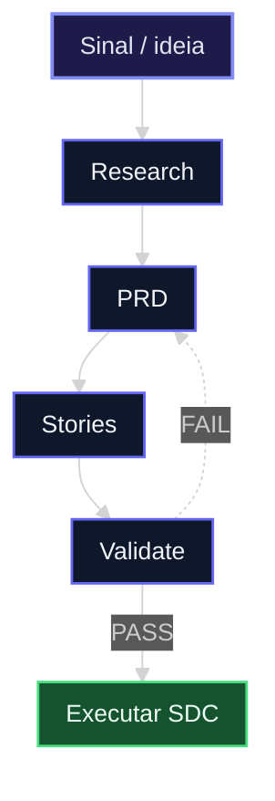
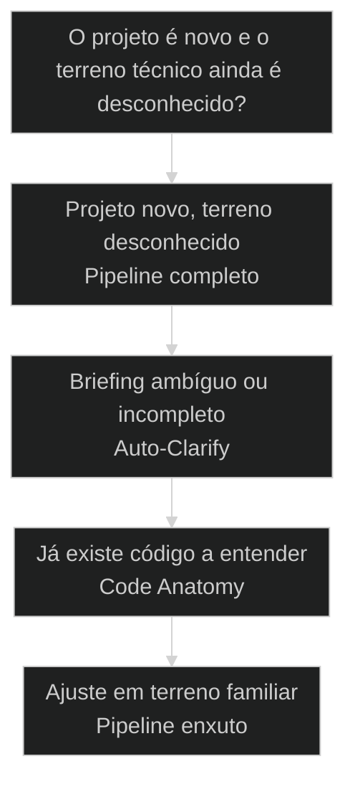

# Pipeline canônico: do nada ao PRD com stories prontas

← [[39-pasta-os-curadoria-local|Pasta OS: curadoria local de open-source para o agente]] · ↑ [[modulos/Módulo 8 - Pipeline de Research|M8]] · ⌂ [[Cursos/AIOX Advanced/README|Curso]] · → [[41-design-system-e-decisao|Design system é decisão, não estética]]

## Conceitos

- [[Método S2S]]

## Mapa desta aula

Pipeline canônico: do sinal às stories prontas. Validate FAIL volta ao PRD.



> Leia o diagrama antes do texto longo. Depois volte e confira.

> Começar um projeto novo mandando o agente codar é pular a pesquisa. O pipeline canônico do AIOX tem ordem fixa: Tech Research em paralelo, Spy/Bench dos concorrentes, Code Anatomy do que existe e só então PRD com épicos e stories. A sequência vira repertório antes de virar código.

**Objetivos de aprendizagem:**
- Nomear as fases do pipeline canônico de projeto novo: Auto-Clarify, Tech Research, Spy/Bench, Code Anatomy e PRD. _(remember)_
- Distinguir cada fase do pipeline pelo que ela entrega e por que ela vem na ordem em que vem. _(understand)_
- Escolher, dado um projeto novo, por onde começar o pipeline e quando disparar as Tech Researchs em paralelo. _(apply)_
- Explicar por que pesquisar antes de codar reduz retrabalho e funda o projeto em repertório, não em palpite. _(understand)_

---

## Projeto novo: pesquisa em paralelo primeiro, PRD com stories depois, codar por último

*Pipeline canônico AIOX · do nada ao PRD com stories*

Começar um projeto novo mandando o agente codar é fundar no escuro: sem pesquisa, sem comparação, sem ler o que já existe. O pipeline canônico do AIOX tem ordem fixa, dispara Tech Research em paralelo, compara com Spy/Bench, lê o código com Code Anatomy e fecha no PRD. Quem pula a pesquisa paga em retrabalho.

- **5**: fases do pipeline, da Auto-Clarify ao PRD
- **3+**: Tech Researchs disparadas em paralelo
- **1**: PRD que fecha em épicos e stories prontas

- **status**: pipeline canonico
- **meta**: codar primeiro=fundar no escuro
- **meta**: tech research=3+ em paralelo
- **meta**: regra=auto-clarify abre, prd fecha
- **ready**: ready to research

**Legenda de cores**

Mapa semantico do pipeline canonico

- **Auto-Clarify** (signal): o agente arranca as ambiguidades do projeto antes de pesquisar
- **Tech Research** (insight): 3 ou mais pesquisas técnicas disparadas em paralelo
- **Spy/Bench** (bench): comparar concorrentes e o que existe com veredito, não palpite
- **PRD** (action): o documento que fecha o pipeline em épicos e stories prontas
- **Codar primeiro** (pain): fundar projeto no escuro, sem pesquisa nem comparação

---

## Comece pela pergunta certa

Antes de listar as fases do pipeline, fixe a pergunta única: o projeto está fundado em pesquisa ou em palpite? Se o agente vai começar a codar sem pesquisar, comparar e ler o que existe, a primeira fundação já está torta. A primeira ação não é codar, é arrancar as ambiguidades com a Auto-Clarify e disparar a pesquisa.

**Como ler esta aula**

1. **A pergunta aparece**: Uma frase separa fundar no escuro de fundar em pesquisa.
2. **Cada fase mostra a cara**: Auto-Clarify abre, Tech Research pesquisa, Bench compara, Anatomy lê, PRD fecha.
3. **Vê o caso real**: O pipeline é prática real do AIOX, distribuída numa aula T2 para qualquer projeto novo.
4. **Decide**: Dado um projeto, você aponta por onde começa o pipeline e quando dispara as pesquisas em paralelo.

- **Objetivos da aula** (Nomear as fases do pipeline canônico de projeto novo.; Distinguir cada fase pelo que entrega e pela ordem que ocupa.; Escolher por onde começar e quando disparar Tech Research em paralelo.; Explicar por que pesquisar antes de codar reduz retrabalho.)
- **Onde você está?** (Começando: foque Mapa Simples e a analogia da obra.; Já usa AIOX: foque Casos Reais e a Decisão.; Vai fundar um projeto: foque as Fases e as Métricas.)
- **Leitura prática**: Em cada bloco, procure uma resposta: estou fundando este projeto em pesquisa real ou pulando direto pro código? Qual fase eu estou prestes a pular?

**Ritmo da aula**

A sequência fica clara quando cada fase tem definição curta, exemplo real do framework e o gosto de quando ela entra.

- G **Pergunta antes do detalhe**: Primeiro o critério que separa pesquisa de palpite, depois cada fase do pipeline por dentro.
- 1 **Analogia que ancora**: Codar primeiro é levantar parede antes da planta. O pipeline é fazer a sondagem, a planta e o orçamento antes da primeira fundação.
- 2 **Caso real**: O pipeline canônico é prática real do AIOX, distribuída numa aula T2 como sequência completa para qualquer projeto novo.
- 3 **Recap com decisão**: A aula fecha com o aluno decidindo por onde começa o pipeline de um projeto seu.

---

## A diferença sem jargão

Antes dos termos técnicos, a diferença é só isto: codar primeiro funda o projeto no que o agente acha na hora; o pipeline canônico arranca as ambiguidades, dispara pesquisa em paralelo, compara o que já existe e só então escreve o PRD com as stories que o time vai executar.

> **Em uma frase**: Codar primeiro funda o projeto no escuro: o agente começa a escrever sem pesquisar, sem comparar concorrentes e sem ler o que já existe. O pipeline canônico inverte a ordem: a Auto-Clarify arranca as ambiguidades, três ou mais Tech Researchs rodam em paralelo, o Spy/Bench compara, a Code Anatomy lê o código existente e o PRD fecha em épicos e stories. A regra muda: pesquisa em paralelo antes, PRD com stories depois, código por último.

- **Auto-Clarify arranca a ambiguidade** -> O agente faz as perguntas que faltam antes de pesquisar. Sem clarificar, a pesquisa parte de um briefing torto e devolve resposta torta.
- **Tech Research em paralelo** -> Três ou mais pesquisas técnicas disparadas de uma vez, não uma de cada vez. O paralelo cobre mais terreno no mesmo tempo.
- **Spy/Bench compara com veredito** -> Olhar concorrente no olho devolve palpite. O Bench devolve scoring e gap analysis: o que já existe, o que falta, onde está a brecha.
- **PRD fecha em stories** -> O pipeline não para na pesquisa. O PRD vira o documento que o time executa: épicos, stories e critérios de aceite prontos.
- **O erro caro** -> Pular direto pro código: fundar o projeto no que o agente achou na hora. Você funda no escuro e refaz tudo quando a pesquisa contradiz o palpite.

**Diagrama principal: da ambiguidade ao PRD**

1. **Auto-Clarify**: O agente arranca as ambiguidades do projeto antes de pesquisar.
2. **Tech Research**: Três ou mais pesquisas técnicas disparadas em paralelo.
3. **Spy/Bench + Anatomy**: Compara concorrentes e lê o código que já existe.
4. **PRD**: Fecha tudo em épicos e stories prontas pro time executar.

**O que o pipeline evita**
- Fundar o projeto no que o agente achou na hora.
- Pesquisar uma coisa de cada vez, perdendo tempo.
- Comparar concorrente no olho e sair com palpite.
- Codar antes de saber o que já existe e o que falta.

**O que ele força**
- Arrancar as ambiguidades com a Auto-Clarify antes de pesquisar.
- Disparar três ou mais Tech Researchs em paralelo.
- Comparar com Spy/Bench e sair com veredito.
- Fechar no PRD com épicos e stories antes da primeira linha.

---

## A analogia da obra

A forma mais rápida de fixar a diferença: codar primeiro é levantar parede antes da planta; o pipeline canônico é fazer a sondagem, a planta e o orçamento antes da primeira fundação. Quem levanta parede sem planta refaz a obra quando o terreno não aguenta.

- **Auto-Clarify = a reunião de briefing**: Antes da sondagem, o engenheiro pergunta o que o cliente quer de verdade. Arranca as ambiguidades para a sondagem não partir de um pedido torto.
- **Tech Research = a sondagem do terreno**: Várias equipes sondam o terreno ao mesmo tempo, não uma de cada vez. Três ou mais pesquisas em paralelo cobrem o terreno técnico mais rápido.
- **Spy/Bench = visitar as obras vizinhas**: Antes de erguer a sua, você vê o que os vizinhos já construíram: o que deu certo, o que falta. O Bench devolve veredito, não impressão.
- **PRD = a planta com o cronograma**: Sondado o terreno e visto o vizinho, sai a planta detalhada com cronograma. O PRD é a planta da obra: épicos e stories que o time executa. Parede sem planta é retrabalho garantido.

> **E quando dá pra pular uma fase?**: Nem todo projeto pede o pipeline inteiro. Um ajuste pequeno num sistema que você conhece a fundo não precisa de três Tech Researchs nem de Spy/Bench: você já tem o repertório. O erro é tratar um projeto novo e desconhecido como se fosse um ajuste familiar e pular a pesquisa por pressa. Pipeline completo onde o terreno é novo, fases enxutas onde você já conhece o solo.

---

## Pesquisar antes versus codar primeiro: o critério da fundação

Esta é a confusão mais cara no início de um projeto novo. Os dois parecem progresso: codar mostra tela funcionando, pesquisar parece demora. O critério da fundação separa os dois: o que você está construindo está fundado em pesquisa real ou no que o agente achou na hora?

**Codar primeiro**
- Funda no que o agente acha na hora, sem pesquisa.
- Mostra tela cedo, mas em cima de fundação torta.
- Descobre o que já existia depois de reescrever.
- Refaz a base quando a pesquisa contradiz o palpite.

**Pipeline canônico (pesquisa antes)**
- Arranca a ambiguidade com Auto-Clarify antes de tudo.
- Dispara três ou mais Tech Researchs em paralelo.
- Compara com Spy/Bench e lê o código com Anatomy.
- Fecha no PRD com épicos e stories antes de codar.

> **A pergunta que separa**: Pergunte: este projeto está fundado em pesquisa ou em palpite? Se é um ajuste pequeno em terreno que você conhece, codar direto pode bastar. Se é um projeto novo, com terreno desconhecido, é pipeline: clarifique, dispare a pesquisa em paralelo, compare e feche no PRD. Fundar projeto novo no palpite é pagar retrabalho por reflexo, o erro mais caro do início.

- **Pipeline com codar primeiro**: Os dois levam ao mesmo software, então parecem o mesmo trabalho.
- **Tech Research em paralelo com uma pesquisa de cada vez**: Os dois pesquisam, então parecem o mesmo passo.
- **Spy/Bench com olhar o concorrente no olho**: Os dois comparam com o que já existe, então parecem a mesma análise.

---

## O pipeline canônico existe de verdade no AIOX

A sequência não é teoria. O pipeline de projeto novo é prática real do AIOX, distribuída numa aula T2 como sequência completa para qualquer projeto. Estes dois casos mostram como o ambiente troca o codar-primeiro pela ordem fixa: clarificar, pesquisar em paralelo, comparar e fechar no PRD com /aiox-pm e /aiox-sm.

- **Onde o pipeline canônico vive no AIOX**: O AIOX tem o pipeline canônico de projeto novo: arranca as ambiguidades com Auto-Clarify, dispara três ou mais Tech Researchs em paralelo, compara com Spy/Bench, lê o código com Code Anatomy e fecha no PRD com /aiox-pm e /aiox-sm. A sequência não é abstração: foi distribuída numa aula T2 como sequência completa para qualquer projeto novo. Players: pipeline canônico, Auto-Clarify, Tech Research paralelo, Spy/Bench, Code Anatomy, PRD (/aiox-pm), stories (/aiox-sm).
- **O que muda a decisão**: A pergunta não é qual passo mostra resultado mais rápido. É se o projeto está fundado em pesquisa ou palpite. Projeto novo e desconhecido pede o pipeline completo. Ajuste familiar em terreno conhecido, não: você já tem o repertório e pode enxugar as fases.

**Cada fase num eixo**

A sequência vira sistema quando cada fase tem definição, lar na ordem e o que ela entrega antes da próxima abrir.

- **Auto-Clarify**: O agente arranca as ambiguidades do projeto. A fase que evita pesquisar em cima de um briefing torto.
- **Tech Research**: Três ou mais pesquisas técnicas em paralelo. O disparo que cobre o terreno no mesmo tempo.
- **Spy/Bench + Anatomy**: Compara concorrentes e lê o código existente. A fase que devolve veredito e o que já existe.
- **PRD**: Épicos e stories prontas pro time. A fase que fecha a pesquisa em trabalho executável.

**Colunas:** Fase | Pesquisa ou palpite? | Sinal de uso certo | Sinal de erro

- Auto-Clarify: Pesquisa ou palpite? | Arranca as ambiguidades antes de qualquer pesquisa. | Pesquisa em cima de um briefing torto e não conferido.
- Tech Research: Pesquisa ou palpite? | Dispara três ou mais pesquisas em paralelo. | Pesquisa uma de cada vez ou pula direto pro código.
- Spy/Bench: Pesquisa ou palpite? | Compara com scoring e gap analysis, não no olho. | Olha o concorrente no olho e sai com impressão.
- PRD: Pesquisa ou palpite? | Fecha em épicos e stories prontas pro time. | Para num relatório solto que ninguém executa.

### Caso: O pipeline canônico distribuído ao vivo numa aula T2

A sequência não é metáfora de aula: o AIOX formalizou o pipeline canônico de projeto novo (Tech Research → Spy/Bench → Code Anatomy → PRD) e o distribuiu numa aula T2 como sequência completa para qualquer projeto. O agente passou a clarificar e pesquisar em paralelo antes de codar.

- Começou como: Um projeto novo que começava mandando o agente codar, fundado no que ele achava na hora, sem pesquisa nem comparação.
- Virou: Um pipeline com ordem fixa: Auto-Clarify, três ou mais Tech Researchs em paralelo, Spy/Bench, Code Anatomy e PRD com épicos e stories.
- Prova: MASTER-PC-07 registra o pipeline canônico (t2-aula-5 PC-01, ouro), o Auto-Clarify (PC-02) e o disparo paralelo de 3 ou mais Tech Researchs (PC-03), distribuído numa aula T2.
- Lição: Pipeline de projeto novo é prática real: tem fase de clarificação, pesquisa paralela, comparação e PRD com stories, não código por reflexo.

### Caso: O PRD fecha o pipeline e vira épicos e stories com /aiox-pm e /aiox-sm

Na visão de execução, o pipeline não para na pesquisa: o PRD é a fase que transforma o repertório pesquisado em trabalho executável. No AIOX, o /aiox-pm escreve o PRD e gerencia os épicos, e o /aiox-sm quebra os épicos em stories com critério de aceite. Pesquisar não basta, tem que fechar em stories.

- Começou como: Pesquisa que parava num relatório técnico solto, sem virar épicos nem stories que o time pudesse executar.
- Virou: Um PRD escrito a partir da pesquisa, com épicos no /aiox-pm e stories no /aiox-sm, prontos para o time desenvolver.
- Prova: MASTER-PC-07 define o PRD como a fase final do pipeline canônico (t2-aula-5 PC-01, ouro): a sequência completa fecha em PRD, não em relatório solto.
- Lição: O PRD não é só mais um documento: é a fase que vira a pesquisa em épicos e stories executáveis.

---

## As fases do pipeline

O pipeline canônico não é um monte de comandos jogados em qualquer ordem. É uma sequência de fases nomeadas, da clarificação ao PRD. Cada fase fecha antes da próxima abrir, e a pesquisa vem antes do código sempre.

**Fluxo do pipeline canônico**
As fases ordenadas que transformam um projeto novo e desconhecido em PRD com stories prontas pro time.
- **1. Auto-Clarify**: O agente arranca as ambiguidades do projeto antes de pesquisar qualquer coisa.
- **2. Tech Research**: Disparar três ou mais pesquisas técnicas em paralelo para cobrir o terreno.
- **3. Spy/Bench**: Comparar concorrentes e o que já existe com scoring e gap analysis.
- **4. Code Anatomy**: Ler o código existente em fases para entender arquitetura, domínio e dados.
- **5. PRD**: Escrever o PRD com /aiox-pm e quebrar em stories com /aiox-sm.
- **6. Revisar a fundação**: Conferir se o PRD reflete a pesquisa antes de o time começar a codar.

**a pesquisa fecha antes do PRD abrir**

1. **Auto-Clarify**: O fluxo arranca as ambiguidades antes de pesquisar.
2. **Tech Research**: Três ou mais pesquisas em paralelo cobrem o terreno.
3. **Bench + Anatomy**: Compara concorrentes e lê o código existente.
4. **PRD**: A pesquisa fecha em épicos e stories prontas pro time.

---

## Como pesquisa, comparação e PRD se combinam

Pesquisar, comparar e escrever o PRD não são rivais; são camadas em sequência. A pesquisa levanta o terreno, a comparação acha a brecha, o PRD fecha o trabalho. Entender a direção evita codar o que a pesquisa ainda nem confirmou.

- **1. Levantar (Tech Research)**: Quem cobre o terreno técnico. As três ou mais pesquisas em paralelo que devolvem o solo real do projeto. É a única camada que parte do desconhecido para o conhecido. [WHAT, research, paralelo]
- **2. Comparar (Spy/Bench + Anatomy)**: O veredito sobre o que já existe. O Bench compara concorrentes, a Anatomy lê o código. O gate que separa fundar na brecha real de fundar no palpite. [WHERE, bench, anatomy]
- **3. Fechar (PRD)**: Como a pesquisa vira trabalho. O PRD com épicos no /aiox-pm e stories no /aiox-sm, com critério de aceite. Zero palpite, máxima execução. [HOW, prd, stories]

---

## Por onde começar o pipeline?

Antes de disparar pesquisa, decida qual fase o projeto pede primeiro. O critério economiza tempo quando você escolhe pela maturidade do terreno, não pela vontade de já ver uma tela funcionando.

**Árvore de decisão**
_Responda pela maturidade do terreno antes de pensar em codar._



- **Projeto novo, terreno desconhecido** — Você não conhece o terreno técnico nem os concorrentes a fundo.
  → _Pipeline completo_
  Ex.: Rode o pipeline inteiro: Auto-Clarify, três ou mais Tech Researchs em paralelo, Spy/Bench, Code Anatomy e PRD.
- **Briefing ambíguo ou incompleto** — O pedido tem buracos e ambiguidades não resolvidas.
  → _Auto-Clarify_
  Ex.: Comece pela Auto-Clarify: arranque as ambiguidades antes de pesquisar qualquer coisa.
- **Já existe código a entender** — Há um sistema ou repositório que o projeto precisa entender antes de mexer.
  → _Code Anatomy_
  Ex.: Entre pela Code Anatomy: leia arquitetura, domínio e dados antes de propor a mudança.
- **Ajuste em terreno familiar** — É um ajuste pequeno num sistema que você já conhece a fundo.
  → _Pipeline enxuto_
  Ex.: Enxugue o pipeline: você já tem o repertório, vá direto ao PRD ou à story.

**Gate:** Qual é o gate? — _Sem gate, você coda por reflexo ou pesquisa demais por insegurança. Responda: o terreno é novo e desconhecido? Se sim, pipeline completo. Se o briefing está torto, comece pela Auto-Clarify. Se há código a entender, entre pela Anatomy. Se o terreno é familiar, enxugue até o PRD._

> **Regra do critério único**: A escolha não é pela pressa de ver uma tela; é pela maturidade do terreno e do briefing. Se o projeto é novo e desconhecido, o pipeline completo é a peça. Se é ajuste em terreno familiar, rodar três Tech Researchs é desperdício de tempo. Codar antes de pesquisar um terreno novo é pagar retrabalho por reflexo, o erro mais caro do início.

---

## Rotas de entrada

Cada tipo de projeto tem um modo típico de entrar no pipeline. Saber a rota evita decidir certo pela maturidade do terreno e materializar com a fase errada.

#### Pipeline completo para projeto novo e desconhecido
Quando você não conhece o terreno técnico nem os concorrentes a fundo.
1. **Sinal: projeto novo, terreno técnico desconhecido.
2. **Pergunta: eu conheço esse terreno ou estou no escuro?
3. **Ação: rodar Auto-Clarify, Tech Research em paralelo, Bench, Anatomy e PRD.
4. **Resultado: PRD com épicos e stories fundado em pesquisa.

#### Code Anatomy para entender o que já existe
Quando há um sistema ou repositório a entender antes de mexer.
1. **Sinal: código existente que o projeto precisa entender.
2. **Pergunta: eu sei a arquitetura ou estou chutando?
3. **Ação: rodar Code Anatomy antes de propor a mudança.
4. **Resultado: arquitetura, domínio e dados extraídos em fases.

#### Pipeline enxuto para ajuste conhecido
Quando é um ajuste pequeno num sistema que você já conhece a fundo.
1. **Sinal: ajuste familiar, repertório já existente.
2. **Pergunta: preciso pesquisar ou já tenho o terreno?
3. **Ação: ir direto ao PRD ou à story, sem três Tech Researchs.
4. **Resultado: story pronta sem desperdício de pesquisa.

**Disparar a pesquisa em paralelo**
Use quando o projeto é novo e o terreno técnico é desconhecido.
- `/tech-research <tema A>`: disparar a primeira pesquisa técnica.
- `/tech-research <tema B> + <tema C>`: disparar mais duas ou mais em paralelo, cobrindo o terreno.

**Comparar e ler o que existe**
Use quando há concorrentes ou código existente para entender antes de fundar.
- `/research-bench <A> <B>`: comparar os projetos com scoring e gap analysis.
- `/code-anatomist <repo>`: ler arquitetura, domínio e dados do código existente.

**Fechar no PRD com stories**
Use quando a pesquisa está pronta e precisa virar trabalho executável.
- `/aiox-pm (PRD + épicos)`: escrever o PRD e gerenciar os épicos a partir da pesquisa.
- `/aiox-sm (stories)`: quebrar os épicos em stories com critério de aceite.

---

## Modelos para ler melhor

Visualizações rápidas para o aluno comparar codar-primeiro com o pipeline, os riscos de cada escolha e o grau de pesquisa que cada projeto exige.

- **Projeto novo, terreno desconhecido**: alto (terreno e concorrentes desconhecidos pedem pipeline completo.)
- **Código existente a entender**: médio (Code Anatomy antes de propor a mudança.)
- **Ajuste em terreno familiar**: baixo (pipeline enxuto basta, três pesquisas seriam desperdício.)

- **Codar projeto novo sem pesquisa**: retrabalho (fundar no escuro e refazer quando a pesquisa contradiz.)
- **Pipeline completo num ajuste familiar**: lentidão (pesquisar o que você já conhece, gastando tempo à toa.)
- **PRD sem comparar concorrentes**: cego (fundar na brecha errada por não ter feito o Bench.)

**Matriz de Decisão do Aluno**

Em dúvida, escolha a célula que melhor descreve o seu projeto.

- **Projeto novo e desconhecido**: Pipeline completo. Clarifica, pesquisa em paralelo, compara e fecha no PRD.
- **Código existente a entender**: Code Anatomy primeiro, depois PRD da mudança.
- **Ajuste em terreno familiar**: Pipeline enxuto. Direto ao PRD ou à story.
- **Briefing ambíguo**: Auto-Clarify antes de tudo, depois a pesquisa.
- **Concorrentes a comparar**: Spy/Bench com scoring antes de fundar o PRD.
- **Não sabe ainda**: Pergunte: o terreno é novo? Sim, pipeline completo.

- **Sinal de pesquisa saudável**: três ou mais Tech Researchs em paralelo antes do PRD / briefing clarificado antes de disparar a pesquisa / codar primeiro, ou pesquisar uma de cada vez por insegurança
- **Separação de fases**: clarifica, pesquisa, compara, lê o código e fecha no PRD / pesquisa e PRD em fases separadas e rastreáveis / codar antes de confirmar a pesquisa e a comparação

---

## O que cada fase carrega

Cada fase do pipeline tem uma anatomia mínima. Saber o que cada uma entrega ajuda a reconhecer quando você está pulando uma fase ou usando a ferramenta errada.

- **Auto-Clarify: as perguntas**: A decisão de arrancar as ambiguidades antes de pesquisar. Alinhamento de briefing, não pesquisa cega.
- **Tech Research: o terreno**: As três ou mais pesquisas em paralelo. O gate que separa fundação em pesquisa de fundação no palpite.
- **Spy/Bench: o veredito**: A comparação com scoring e gap analysis. O que já existe e onde está a brecha real.
- **Code Anatomy: o existente**: A leitura do código em fases. Arquitetura, domínio e dados extraídos antes de propor a mudança.
- **PRD: o fechamento**: O documento que vira épicos e stories. Pesquisa que para num relatório solto é reflexo, não pipeline.

---

## Métricas do pipeline

Sem telemetria, a saúde do pipeline vira fé. Estas perguntas separam um projeto fundado em pesquisa de um projeto que pulou direto pro código.

**Colunas:** Métrica | Pergunta | Sinal saudável | Sinal de risco

- Clarificação: O briefing foi clarificado antes de pesquisar? | Auto-Clarify rodou e as ambiguidades saíram. | Pesquisa partiu de um pedido torto e não conferido.
- Paralelismo: As Tech Researchs rodaram em paralelo? | Três ou mais pesquisas disparadas de uma vez. | Uma pesquisa de cada vez, ou nenhuma antes de codar.
- Comparação: O Bench comparou os concorrentes com veredito? | Scoring e gap analysis antes de fundar o PRD. | Concorrente olhado no olho, impressão em vez de dado.
- Fechamento: A pesquisa fechou em épicos e stories? | PRD com stories prontas pro time executar. | Pesquisa parada num relatório que ninguém abre.

---

## Quando enxugar o pipeline

A sequência ajuda mais quando você resiste ao reflexo de rodar o pipeline inteiro em tudo. A pesquisa tem custo: tempo, atenção, o trabalho de ler relatório. Vale só quando o terreno é novo e o desconhecido cobra.

**Quando rodar o pipeline completo**
- O projeto é novo e o terreno técnico é desconhecido.
- Há concorrentes a comparar e código a entender.
- O briefing tem ambiguidades que travam a pesquisa.
- O retrabalho de fundar no escuro supera o tempo de pesquisar.

**Quando enxugar**
- É um ajuste pequeno num sistema que você já conhece.
- Você já tem o repertório do terreno técnico.
- O briefing está claro e o escopo é familiar.
- O custo de três Tech Researchs supera o ganho de pesquisar.

---

## Exercício: funde o projeto

Pegue um projeto novo seu e aplique o pipeline. O objetivo não é rodar tudo por reflexo; é apontar por onde o pipeline começa e quando você dispara as Tech Researchs em paralelo antes de mandar o agente codar.

**Um projeto, cinco perguntas**
```yaml
projeto:
  descricao: "qual projeto novo voce vai fundar?"
  terreno: "novo e desconhecido? sim | nao"
  entrada: "pipeline_completo | code_anatomy | pipeline_enxuto"
  tech_research: ["tema A", "tema B", "tema C"]
  gate: "por que nao codar primeiro? (se completo, por que o desconhecido paga a pesquisa?)"

```
*O acerto não é rodar o pipeline todo. É provar que você escolheu a entrada pela maturidade do terreno e sabe justificar por que codar primeiro custaria mais retrabalho.*

**Exemplo preenchido: um produto novo num domínio desconhecido versus um ajuste num sistema que você já mantém**

- **Projeto A**: Um produto novo num domínio técnico que você nunca tocou, com concorrentes a comparar.
- **Terreno A**: Novo e desconhecido. Você não conhece o terreno nem os concorrentes a fundo.
- **Entrada A**: Pipeline completo. Auto-Clarify, três Tech Researchs em paralelo, Spy/Bench, Code Anatomy e PRD.
- **Projeto B**: Um ajuste de regra num sistema que você mantém há meses e conhece a fundo.
- **Entrada B**: Pipeline enxuto. Você já tem o repertório: vá direto ao PRD ou à story.
- **Gate B**: Pipeline completo nao se aplica: rodar tres Tech Researchs num terreno que voce ja domina gastaria tempo sem reduzir retrabalho.

- 1. **Projeto**: Descreva em uma frase qual projeto novo você quer fundar.
- 2. **Terreno?**: Responda: o terreno técnico é novo e desconhecido, ou você já conhece a fundo?
- 3. **Entrada**: Aponte a rota: pipeline completo (terreno novo), Code Anatomy (código existente) ou pipeline enxuto (terreno familiar).
- 4. **Pesquisa**: Liste três temas de Tech Research que você dispararia em paralelo para cobrir o terreno.
- 5. **Gate**: Justifique por que não pulou direto pro código. Para o pipeline completo, diga por que o desconhecido justifica a pesquisa antes.

**Funcionou se:**

- O aluno escolhe a entrada pela maturidade do terreno, não pela pressa de ver uma tela.
- O aluno separa pesquisar antes (pipeline) de codar primeiro (fundar no escuro).
- O aluno define três temas de Tech Research e justifica o disparo em paralelo.

---

## Glossário do pipeline canônico

Tradução dos termos para alguém que está vendo a sequência pesquisar antes versus codar primeiro pela primeira vez.

- **Pipeline canônico**: A sequência fixa de projeto novo: Auto-Clarify, Tech Research, Spy/Bench, Code Anatomy e PRD, antes de codar.
- **Auto-Clarify**: A fase em que o agente arranca as ambiguidades do projeto antes de pesquisar qualquer coisa.
- **Tech Research**: Pesquisas técnicas disparadas em paralelo, três ou mais de uma vez, para cobrir o terreno do projeto.
- **Spy/Bench**: A comparação de concorrentes e do que já existe com scoring e gap analysis, veredito em vez de palpite.
- **Code Anatomy**: A leitura do código existente em fases: arquitetura, domínio, dados, API, dependências e infra.
- **PRD**: O documento que fecha o pipeline em épicos e stories, escrito com /aiox-pm e quebrado com /aiox-sm.
- **Disparo paralelo**: Rodar três ou mais Tech Researchs ao mesmo tempo, cobrindo o terreno técnico no mesmo intervalo.
- **Sequência completa T2**: O pipeline canônico distribuído numa aula T2 do AIOX como sequência para qualquer projeto novo.

> **Portão da aula**: A aula só está no padrão quando o aluno nomeia as fases do pipeline canônico (Auto-Clarify, Tech Research, Spy/Bench, Code Anatomy e PRD), distingue pesquisar antes em paralelo (fundar em repertório) de codar primeiro (fundar no escuro), e consegue apontar, para um projeto novo real, por onde o pipeline começa e quais três Tech Researchs ele dispararia em paralelo antes de mandar o agente codar.

***


---

## Navegação

← [[39-pasta-os-curadoria-local|Pasta OS: curadoria local de open-source para o agente]] · ↑ [[modulos/Módulo 8 - Pipeline de Research|M8]] · ⌂ [[Cursos/AIOX Advanced/README|Curso]] · → [[41-design-system-e-decisao|Design system é decisão, não estética]]
