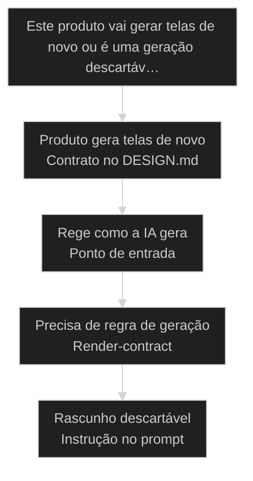
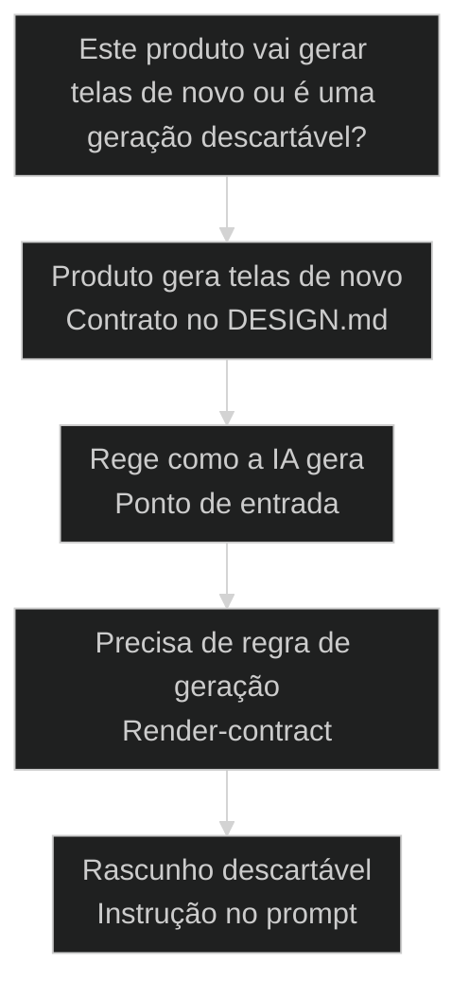

# DESIGN.md: o novo contrato que a IA lê antes de gerar tela

← [[56-tailwind-shadcn-storybook|Tailwind + ShadCN + Storybook: stack canonical para IA]] · ↑ [[modulos/Módulo 9 - Design System|M9]] · ⌂ [[Cursos/AIOX Advanced/README|Curso]] · → [[57-storybook-para-variantes|Storybook para derivar e testar variantes (a11y, dark mode, responsivo)]]

## Conceitos

- [[DESIGN md|DESIGN.md]]

## Mapa desta aula

Decisão-chave da aula — Este produto vai gerar telas de novo ou é uma geração descartáv…



> Leia o diagrama antes do texto longo. Depois volte e confira.

> A IA já tem [[CLAUDE md|CLAUDE.md]] para saber como se comportar no código e AGENTS.md para saber quem faz o quê. Faltava o contrato visual. DESIGN.md é esse arquivo: a decisão de design escrita uma vez, em token e regra, que vira o ponto de entrada que a IA lê antes de gerar qualquer tela. Sem ele, a IA inventa a estética no gosto a cada geração.

**Objetivos de aprendizagem:**
- Nomear o que torna o DESIGN.md um contrato de IA: ponto de entrada visual, par de CLAUDE.md e AGENTS.md, lido antes de gerar a tela. _(remember)_
- Distinguir gerar tela com um contrato visual lido pela IA de gerar tela com a IA inventando estética no gosto a cada vez. _(understand)_
- Escolher, diante de um produto que vai gerar telas com IA, se a decisão visual vira DESIGN.md (contrato herdável) ou fica instrução solta no prompt. _(apply)_
- Explicar por que registrar o visual num contrato lido antes da geração reduz retrabalho e mantém a tela coerente com a marca. _(understand)_

---

## DESIGN.md: o [[DESIGN md|contrato de design]] que a IA lê antes de gerar qualquer tela

*DESIGN.md AIOX · contrato visual lido antes de gerar, não estética chutada*

A IA já lê CLAUDE.md para saber como se comportar no código e AGENTS.md para saber quem faz o quê. O visual ficava de fora: a cada geração, a IA inventava cor e layout no gosto. DESIGN.md fecha a lacuna. É o contrato visual: a decisão de design escrita uma vez, em token e regra, que vira o ponto de entrada que a IA lê antes de gerar a tela.

- **3**: contratos de IA: CLAUDE.md, AGENTS.md e agora DESIGN.md
- **1**: decisão visual lida antes de gerar, não chutada a cada tela
- **0**: telas com a IA inventando estética no gosto

- **status**: design.md contract
- **meta**: CLAUDE.md=contrato do codigo
- **meta**: AGENTS.md=contrato dos papeis
- **meta**: DESIGN.md=contrato do visual, lido antes de gerar
- **ready**: reading before generating

**Legenda de cores**

Mapa semantico do DESIGN.md como contrato de IA

- **Contrato** (signal): o arquivo que a IA lê antes de gerar, par de CLAUDE.md e AGENTS.md
- **Token** (insight): a decisão visual registrada como valor, não estética inventada na geração
- **Render-contract** (bench): a regra de como o token vira tela, não improviso da IA
- **Ponto de entrada** (action): onde a IA começa a ler o visual antes de qualquer geração
- **Estética inventada** (pain): sem contrato, a IA chuta cor e layout no gosto a cada tela

---

## Da cohort: DESIGN.md antes de gerar tela

*T1 + T2 · WhatsApp*

Realidade do grupo Advanced — cicatriz, não slide.

Pergunta de campo (T2 e T1): vários sistemas da mesma empresa — como ter
base comum e derivados? A resposta operacional passa por **contrato legível por
IA**: DESIGN.md (e stories) antes do prompt de tela.

Sem contrato, cada /frontend vira loteria. Com contrato, o agente reusa token e
componente. A cohort sentiu na pele quando instalou [[Squad|squad]] de design e 'não
aparecia o comando' — sintoma de ativação, mas também de falta de hábito de ler
o contrato antes de pedir UI.

> **Âncora de campo**: Se a IA não leu DESIGN.md, ela não está no seu design system — está no default dela.

> **Materiais / FAQ**: FAQ-cohort §7 · aulas 41, 56, 57

---

## Comece pela pergunta certa

Antes de falar de token ou render-contract, fixe a pergunta única: a IA lê uma decisão visual sua antes de gerar a tela, ou inventa a estética no gosto a cada geração? Se você descreve cor e layout no prompt a cada tela, a IA está adivinhando. A primeira ação não é gerar, é escrever o contrato que a IA lê primeiro.

**Como ler esta aula**

1. **A pergunta aparece**: Uma frase separa IA com contrato visual de IA inventando estética.
2. **Cada peça mostra a cara**: Contrato é lido primeiro, token registra a decisão, render-contract diz como vira tela, ponto de entrada inicia a leitura.
3. **Vê o caso real**: O AIOX tem a skill /design-md: extrai o DESIGN.md de uma URL com tokens.json, render-contract e drift report.
4. **Decide**: Diante de um produto que gera telas com IA, você aponta se a decisão visual vira DESIGN.md ou fica instrução solta no prompt.

- **Objetivos da aula** (Nomear o que torna o DESIGN.md um contrato de IA: ponto de entrada visual, par de CLAUDE.md e AGENTS.md.; Distinguir gerar com contrato visual de gerar com a IA inventando estética no gosto.; Escolher se a decisão visual vira DESIGN.md herdável ou fica instrução solta no prompt.; Explicar por que ler o visual antes de gerar reduz retrabalho e mantém a tela coerente com a marca.)
- **Onde você está?** (Começando: foque Mapa Simples e a analogia da planta da obra.; Já usa AIOX: foque Casos Reais e a Decisão.; Vai gerar telas com IA: foque as Peças e as Métricas.)
- **Leitura prática**: Em cada bloco, procure uma resposta: a IA lê esta decisão visual antes de gerar, ou estou descrevendo cor e layout no prompt e vou errar diferente na próxima tela?

**Ritmo da aula**

A diferença fica clara quando cada peça tem definição curta, exemplo real do AIOX e o gosto de quando ela entra.

- G **Pergunta antes do detalhe**: Primeiro o critério que separa IA com contrato de IA chutando, depois token, render-contract e ponto de entrada por dentro.
- 1 **Analogia que ancora**: Estética inventada é cada pedreiro lendo um bilhete diferente. DESIGN.md é a planta única que todo gerador lê antes de levantar a parede.
- 2 **Caso real**: O AIOX tem a skill /design-md: extrai o DESIGN.md de uma URL e gera tokens, render-contract e drift report.
- 3 **Recap com decisão**: A aula fecha com você decidindo se a decisão visual de um produto seu vira DESIGN.md ou fica instrução solta.

---

## A diferença sem jargão

Antes dos termos técnicos, a diferença é só isto: sem contrato visual, a IA inventa cor e layout no gosto a cada geração, e erra diferente toda vez; com DESIGN.md, a decisão de design fica escrita uma vez, e a IA lê esse contrato antes de gerar a tela em vez de adivinhar.

> **Em uma frase**: Sem contrato, a IA trata cada tela como uma estética nova: você descreve a cor no prompt de hoje, o layout que lembrou agora, e a IA preenche o resto no chute. Mil gerações, mil estéticas, marca quebrada em cada uma. DESIGN.md inverte a ordem: a decisão de design acontece uma vez, vira token (o valor) e render-contract (como o token vira tela), e a IA lê esse arquivo como ponto de entrada antes de gerar. A regra muda: escreva o contrato visual uma vez, e a IA lê antes de gerar, em vez de inventar por reflexo.

- **Contrato é o que a IA lê primeiro** -> O DESIGN.md é par de CLAUDE.md e AGENTS.md: a IA o lê antes de gerar a tela. Sem o contrato, cada geração vira um palpite visual novo que contradiz o anterior.
- **Token registra a decisão visual** -> A decisão de design vira valor reutilizável dentro do contrato, não descrição solta no prompt. O token é a memória do visual: a IA puxa dele em vez de reinventar.
- **Render-contract diz como o token vira tela** -> A IA gerando no olho devolve incoerência. O render-contract diz como cada token vira pixel: veredito, não improviso da geração.
- **Ponto de entrada inicia a leitura** -> A próxima geração não recomeça do zero. Ela entra pelo DESIGN.md e herda a decisão. Escrever o contrato uma vez paga em toda tela gerada.
- **O erro caro** -> Descrever o visual no gosto, a cada prompt: a IA inventa mil vezes a mesma marca e erra diferente toda vez. A coerência morre e o retrabalho de ajustar a tela vira rotina.

**Diagrama principal: do prompt no gosto ao contrato lido pela IA**

1. **Contrato**: A decisão visual vira o DESIGN.md que a IA lê primeiro.
2. **Token**: A decisão vira valor registrado dentro do contrato.
3. **Render-contract**: A regra diz como o token vira tela na geração.
4. **Ponto de entrada**: Toda geração começa lendo o DESIGN.md, sem inventar no gosto.

**O que o DESIGN.md evita**
- A IA inventar cor e layout no gosto, geração a geração.
- Descrever a mesma marca mil vezes e errar diferente.
- Empilhar instrução visual solta em cada prompt.
- Telas geradas que contradizem umas às outras.

**O que ele força**
- Escrever a decisão visual uma vez como contrato.
- Registrar a decisão em token dentro do DESIGN.md.
- Delimitar com render-contract como o token vira tela.
- Deixar a IA ler o contrato antes de cada geração.

---

## A analogia da planta da obra

A forma mais rápida de fixar a diferença: estética inventada é cada pedreiro lendo um bilhete diferente; DESIGN.md é a planta única que todo construtor consulta antes de levantar a parede. Quem deixa cada construtor improvisar refaz a obra quando as paredes não fecham.

- **Contrato = a planta aprovada**: Antes da primeira parede, o engenheiro aprova a planta de uma vez. Não é bilhete solto na mão de cada pedreiro: é o contrato que todo construtor lê antes de começar. A IA lê o DESIGN.md como o pedreiro lê a planta.
- **Token = a medida escrita na planta**: A medida fica na planta, não na cabeça de cada um. Todo construtor puxa do mesmo valor em vez de chutar o próprio tijolo. O token é a medida do visual registrada no contrato.
- **Render-contract = como a medida vira parede**: A planta não diz só o tamanho: diz como cada medida vira parede de verdade. O render-contract diz como o token vira tela na geração. Veredito, não improviso na hora de erguer.
- **Ponto de entrada = onde o construtor começa**: Aprovada a planta, o construtor não inventa por onde começar: ele entra pela planta. A IA entra pelo DESIGN.md antes de gerar. Obra sem planta lida primeiro é retrabalho garantido quando o prédio não fecha.

> **E quando dá pra instruir solto no prompt?**: Nem toda geração precisa de DESIGN.md. Um teste isolado, um rascunho descartável, uma tela que não vai virar produto, podem nascer de instrução solta no prompt: escrever o contrato só agrega cerimônia. O erro é o contrário: gerar dez telas de produto com instrução solta a cada prompt e deixar a IA inventar a marca dez vezes. Contrato onde o produto se repete, prompt solto onde a geração é genuinamente descartável.

---

## Contrato versus prompt solto: o critério da repetição

Esta é a confusão mais cara ao gerar UI com IA. Os dois parecem dizer à IA o que fazer: descrever o visual no prompt parece progresso, escrever o DESIGN.md parece burocracia. O critério da repetição separa os dois: este produto vai gerar telas de novo, ou é uma geração descartável?

**Prompt solto (estética inventada)**
- Descreve a cor no prompt de hoje, sem registrar.
- Mostra tela gerada cedo, em cima de instrução solta.
- Descobre a incoerência quando junta as telas geradas.
- Refaz tudo quando uma tela contradiz a marca.

**DESIGN.md (contrato lido pela IA)**
- Escreve a decisão visual uma vez como contrato.
- Registra a decisão em token dentro do DESIGN.md.
- Delimita com render-contract como o token vira tela.
- Deixa a IA ler o contrato antes de cada geração.

> **A pergunta que separa**: Pergunte: este produto vai gerar telas de novo ou é uma geração descartável? Se é um rascunho isolado, instrução solta no prompt basta. Se vai gerar outras telas, é contrato: escreva o DESIGN.md uma vez, registre em token, delimite com render-contract e deixe a IA ler primeiro. Gerar produto recorrente com prompt solto é pagar incoerência e retrabalho por reflexo, o erro mais caro ao gerar UI com IA.

- **DESIGN.md com descrição de tela no prompt**: Os dois dizem à IA como o visual fica, então parecem o mesmo trabalho.
- **DESIGN.md com CLAUDE.md**: Os dois são arquivos de contrato que a IA lê, então parecem o mesmo arquivo.
- **Token do DESIGN.md com cor hardcodada no componente**: Os dois guardam um valor de cor, então parecem o mesmo passo.

---

## O DESIGN.md como contrato existe de verdade no AIOX

O contrato não é teoria. No AIOX, a skill /design-md extrai o DESIGN.md de uma URL pública e o trata como o artefato canônico da decisão de design, com tokens.json, render-contract e drift report, em vez de a IA inventar a estética no prompt. Estes dois casos mostram como o ambiente troca a estética chutada pelo contrato lido antes de gerar.

- **Onde o DESIGN.md como contrato vive no AIOX**: O AIOX trata o visual como contrato de IA: a skill /design-md extrai o DESIGN.md de uma URL, gera tokens.json e render-contract, e o DESIGN.md entra na família de CLAUDE.md e AGENTS.md como ponto de entrada. A separação não é abstração: é skill, artefato e contrato existindo no repositório, para que a IA leia o mesmo visual antes de gerar em vez de inventar no prompt. Players: /design-md, DESIGN.md, tokens.json, render-contract, drift report, CLAUDE.md, AGENTS.md.
- **O que muda a decisão**: A pergunta não é qual cor descrever neste prompt. É se o produto vai gerar telas de novo ou é descartável. Produto recorrente vira DESIGN.md lido antes de gerar. Rascunho genuinamente isolado pode ficar no prompt: extrair o contrato só agregaria cerimônia.

**Cada peça num eixo**

O contrato vira sistema quando cada peça tem definição, lar na ordem e o que ela entrega antes da próxima geração começar.

- **Contrato**: O DESIGN.md que a IA lê antes de gerar. A peça que evita inventar a marca no prompt.
- **Token**: A decisão visual registrada como valor. O que a IA puxa em vez de chutar a cor.
- **Render-contract**: Como o token vira tela. A peça que devolve veredito em vez de improviso na geração.
- **Ponto de entrada**: Onde a IA começa a ler o visual. A peça que fecha o sistema em coerência.

**Colunas:** Peça | Contrato ou prompt? | Sinal de uso certo | Sinal de erro

- Contrato: Contrato ou prompt? | A IA lê o DESIGN.md antes de gerar a tela. | A IA inventa cor e layout no prompt a cada geração.
- Token: Contrato ou prompt? | Registra a decisão visual como valor no contrato. | Descreve a cor solta dentro de cada prompt.
- Render-contract: Contrato ou prompt? | Delimita como o token vira tela na geração. | Deixa a IA renderizar no olho, tela a tela.
- Ponto de entrada: Contrato ou prompt? | Toda geração começa lendo o DESIGN.md. | Cada geração recomeça a estética do zero.

### Caso: A skill /design-md extrai o contrato visual de uma URL

A separação não é metáfora de aula: o AIOX tem uma skill, a /design-md, que pega uma URL pública e extrai dela o DESIGN.md, o contrato visual da marca daquele site. A estética não nasce no prompt de quem gera a tela: nasce como contrato extraído, com tokens.json e render-contract que a IA lê antes de gerar.

- Começou como: Visual descrito no prompt a cada geração: a IA inventando cor e layout no gosto, sem contrato que valesse pro produto inteiro.
- Virou: A skill /design-md extraindo o DESIGN.md de uma URL: tokens.json, render-contract e drift report, o contrato visual lido antes de gerar.
- Prova: O AIOX mantém a skill /design-md, que extrai DESIGN.md, tokens.json, render-contract e drift report de qualquer URL pública: o visual vira contrato extraído, não estética chutada no prompt.
- Lição: O visual de produto é contrato: tem skill, token e render-contract extraídos, não descrição de cor no prompt a cada geração.

### Caso: O DESIGN.md é o ponto de entrada, par de CLAUDE.md e AGENTS.md

Na visão de execução, o contrato visual não pode ser mais um arquivo perdido: precisa ser o ponto de entrada que a IA lê primeiro. No AIOX, o DESIGN.md entra na mesma família de CLAUDE.md (contrato do código) e AGENTS.md (contrato dos papéis): é o arquivo que a IA consulta antes de gerar a tela. Ter o contrato não basta, ele tem que ser o ponto de entrada.

- Começou como: Decisão visual presa no prompt de quem gerou, sem um arquivo que a IA lesse antes de qualquer tela.
- Virou: Um DESIGN.md que é o ponto de entrada visual, par de CLAUDE.md e AGENTS.md, lido pela IA antes de gerar cada tela.
- Prova: O AIOX trata o DESIGN.md como o contrato canônico da decisão de design (com tokens e render-contract) na mesma família de CLAUDE.md e AGENTS.md: o visual fica registrado como ponto de entrada, não no prompt de uma pessoa.
- Lição: O DESIGN.md não é só um documento: é o ponto de entrada visual que a IA lê primeiro, par dos contratos que já regem código e papéis.

---

## As peças do DESIGN.md

O DESIGN.md não é um arquivo de cores jogadas em qualquer ordem. É uma sequência de peças nomeadas, do contrato à geração lida. Cada peça fecha antes da próxima abrir, e o contrato é lido antes da geração sempre.

**Fluxo do DESIGN.md**
As peças ordenadas que transformam uma estética inventada no prompt em contrato visual lido pela IA antes de gerar a tela.
- **1. Extrair o contrato**: Tirar a decisão visual de uma referência (URL) com /design-md, não descrever no prompt.
- **2. Registrar em token**: Virar a decisão num tokens.json que a IA puxa em vez de chutar cor.
- **3. Delimitar o render-contract**: Dizer como cada token vira tela na geração, não no improviso da IA.
- **4. Fixar o ponto de entrada**: Deixar o DESIGN.md como o arquivo que a IA lê primeiro, par de CLAUDE.md e AGENTS.md.
- **5. Gerar lendo o contrato**: Cada tela nasce da leitura do DESIGN.md em vez de reinventar a marca.
- **6. Medir o drift**: Conferir com o drift report o quanto a tela gerada bate com o contrato antes de espalhar.

**o contrato fecha antes da IA gerar**

1. **Contrato**: O fluxo extrai a decisão visual como DESIGN.md.
2. **Token**: A decisão vira tokens.json registrado.
3. **Render-contract**: A regra diz como o token vira tela.
4. **Ponto de entrada**: A IA lê o DESIGN.md antes de gerar.

---

## Como contrato, token e render-contract se combinam

Escrever o contrato, registrar o token e delimitar o render-contract não são rivais; são camadas em sequência. O contrato define o que vale, o token guarda o valor, o render-contract diz como vira tela. Entender a direção evita gerar a tela que o contrato ainda nem fixou.

- **1. Contratar (o DESIGN.md)**: Quem define o visual que a IA lê antes de gerar. A decisão escrita uma vez que vale pra geração inteira. É a única camada que parte do prompt bruto para o contrato lido. [WHAT, contrato, lido primeiro]
- **2. Registrar (o token)**: O valor que guarda a decisão visual. O tokens.json que a IA puxa em vez de chutar a cor. O gate que separa marca coerente de estética solta no prompt. [WHERE, token, registro]
- **3. Renderizar (o render-contract)**: Como o contrato vira tela real. O render-contract que diz como cada token vira pixel na geração. Zero improviso da IA, máxima coerência com a marca. [HOW, render-contract, geracao]

---

## Vira DESIGN.md ou fica no prompt?

Antes de gerar qualquer tela com IA, decida se a decisão visual merece virar DESIGN.md ou fica instrução solta no prompt. O critério economiza tempo quando você escolhe pela repetição da geração, não pela vontade de já ver uma tela pronta.

**Árvore de decisão**
_Responda pela repetição da geração antes de pensar na tela que parece pronta._



- **Produto gera telas de novo** — A IA vai gerar outras telas que precisam ser coerentes com a marca.
  → _Contrato no DESIGN.md_
  Ex.: Vire DESIGN.md: extraia com /design-md, registre em token e deixe a IA ler antes de gerar.
- **Rege como a IA gera** — A decisão diz como o produto se comporta visualmente, não só como esta tela fica.
  → _Ponto de entrada_
  Ex.: Fixe o ponto de entrada: comportamento visual é contrato lido, não descrição no prompt.
- **Precisa de regra de geração** — O mesmo token vira tela diferente conforme o contexto da geração.
  → _Render-contract_
  Ex.: Escreva o render-contract: delimite como o token vira tela antes de espalhar.
- **Rascunho descartável** — É uma geração isolada que não vira produto nem se repete.
  → _Instrução no prompt_
  Ex.: Deixe no prompt: extrair o contrato só agrega cerimônia onde a tela não herda.

**Gate:** Qual é o gate? — _Sem gate, você escreve DESIGN.md pra tudo por insegurança ou gera tudo no prompt por reflexo. Responda: o produto gera telas de novo? Se sim, vira DESIGN.md. Se rege como a IA gera, é ponto de entrada. Se o token vira tela diferente por contexto, escreva o render-contract. Se é rascunho descartável, deixe no prompt._

> **Regra do critério único**: A escolha não é pela pressa de ver uma tela pronta; é pela repetição da geração e pelo comportamento visual do produto. Se o produto gera telas de novo, o DESIGN.md é a peça. Se é um rascunho descartável e isolado, escrever o contrato é cerimônia à toa. Gerar produto recorrente no prompt solto é pagar incoerência e retrabalho por reflexo, o erro mais caro ao gerar UI com IA.

---

## Rotas de registro do contrato

Cada tipo de decisão visual tem um modo típico de entrar no DESIGN.md. Saber a rota evita decidir certo pela repetição e registrar com a peça errada.

#### Extrair o contrato com /design-md
Quando a marca já vive numa página e o visual precisa virar DESIGN.md.
1. **Sinal: existe uma referência visual numa URL pública.
2. **Pergunta: esse visual vai reger as telas geradas?
3. **Ação: rodar /design-md na URL e extrair o DESIGN.md com tokens.
4. **Resultado: contrato que a IA lê antes de gerar, sem chutar a marca.

#### Render-contract para o token que vira tela diferente
Quando o mesmo token precisa de regra de como vira pixel na geração.
1. **Sinal: token que vira tela diferente conforme o contexto da geração.
2. **Pergunta: qual contexto puxa qual aplicação do token?
3. **Ação: escrever o render-contract antes de a IA gerar em massa.
4. **Resultado: geração por veredito, não por improviso da IA.

#### Instrução no prompt para a geração que não se repete
Quando a tela é um rascunho isolado que não vira produto.
1. **Sinal: geração isolada, sem repetição em outras telas.
2. **Pergunta: preciso reger isso ou é só este rascunho?
3. **Ação: instruir no prompt, sem extrair DESIGN.md nem token.
4. **Resultado: geração descartável sem cerimônia de contrato à toa.

**Extrair o contrato visual de uma URL**
Use quando a marca já vive numa página e o visual precisa virar DESIGN.md.
- `/design-md <url>`: extrair o DESIGN.md da URL com tokens.json e render-contract.
- `DESIGN.md + tokens.json + render-contract`: registrar o contrato visual que a IA lê antes de gerar.

**Fixar o DESIGN.md como ponto de entrada**
Use quando o contrato visual precisa reger a geração, par de CLAUDE.md e AGENTS.md.
- `CLAUDE.md + AGENTS.md + DESIGN.md`: deixar o contrato visual na família lida antes de gerar.
- `/DS:design-chief`: orquestrar a decisão de design no squad design-system.

**Medir o drift contra o contrato**
Use quando o contrato existe e a tela gerada precisa bater com ele.
- `/design-md drift <url>`: conferir o quanto a URL bate com o DESIGN.md extraído.
- `drift report`: medir a aderência da geração ao contrato antes de espalhar.

---

## Modelos para ler melhor

Visualizações rápidas para o aluno comparar estética inventada no prompt com contrato lido pela IA, os riscos de cada escolha e o grau de contrato que cada geração exige.

- **Produto que gera muitas telas com a marca**: alto (produto recorrente pede DESIGN.md lido antes de gerar.)
- **Página única de campanha que vai durar**: médio (contrato vale se a página vira referência de outras.)
- **Rascunho isolado para testar uma ideia**: baixo (instrução no prompt basta, DESIGN.md seria cerimônia.)

- **Gerar no prompt produto que se repete**: incoerência (a IA inventa a marca mil vezes e erra diferente em cada tela.)
- **Escrever DESIGN.md para rascunho descartável**: cerimônia (registrar o que não herda, gastando atenção à toa.)
- **Contrato sem render-contract**: ambíguo (o mesmo token vira tela errada por falta de regra de geração.)

**Matriz de Decisão do Aluno**

Em dúvida, escolha a célula que melhor descreve a sua geração.

- **Produto gera telas de novo**: DESIGN.md. Extrai com /design-md, registra em token e a IA lê antes de gerar.
- **Rege como a IA gera**: Ponto de entrada. Par de CLAUDE.md e AGENTS.md, lido primeiro.
- **Token vira tela por contexto**: Render-contract. Delimita como o token vira tela na geração.
- **Rascunho descartável**: Instrução no prompt. Sem DESIGN.md, sem cerimônia.
- **Marca já vive numa URL**: Extrair com /design-md antes de a IA chutar a estética.
- **Não sabe ainda**: Pergunte: o produto gera de novo? Sim, vira DESIGN.md.

- **Sinal de geração saudável**: marca recorrente registrada em DESIGN.md antes de gerar / decisão visual extraída uma vez antes de a IA gerar / cor descrita no prompt, geração a geração, por reflexo
- **Separação de peças**: contrato, token e render-contract em peças rastreáveis / contrato e token em peças separadas e versionadas / gerar a tela antes de escrever o contrato visual

---

## O que cada peça carrega

Cada peça do DESIGN.md tem uma anatomia mínima. Saber o que cada uma entrega ajuda a reconhecer quando você está pulando uma peça ou usando a ferramenta errada.

- **Contrato: o que a IA lê**: O DESIGN.md que a IA consulta antes de gerar. Decisão escrita uma vez, não descrição no prompt.
- **Token: o valor registrado**: A decisão visual virada tokens.json. O gate que separa marca coerente de cor solta no prompt.
- **Render-contract: a geração**: Como cada token vira tela. O veredito de geração em vez do improviso da IA.
- **Ponto de entrada: a leitura**: O DESIGN.md como primeiro arquivo lido, par de CLAUDE.md e AGENTS.md. Contrato lido, não prompt na memória.
- **Drift report: a aderência**: O quanto a tela gerada bate com o contrato. Gerar no prompt em vez de medir é reflexo, não sistema.

---

## Métricas do contrato de design

Sem telemetria, a saúde do DESIGN.md vira fé. Estas perguntas separam um produto fundado em contrato lido pela IA de um produto que gerou tela a tela no prompt.

**Colunas:** Métrica | Pergunta | Sinal saudável | Sinal de risco

- Contrato lido: A IA lê o DESIGN.md antes de gerar? | O visual foi escrito e a IA o lê primeiro. | Cada geração inventou cor e layout no prompt.
- Tokenização: A decisão visual virou tokens.json? | Valor registrado e puxado por toda geração. | Cor descrita solta dentro de cada prompt.
- Render-contract: Há regra de como o token vira tela? | Geração delimitada e rastreável pelo contrato. | IA renderizando no olho, diferente em cada tela.
- Drift: A tela gerada bate com o contrato? | Drift report mede a aderência antes de espalhar. | Tela gerada que ninguém compara ao DESIGN.md.

---

## Quando deixar no prompt

O DESIGN.md ajuda mais quando você resiste ao reflexo de escrever contrato para tudo. Extrair tem custo: a skill, o token, o render-contract, a manutenção. Vale só quando o produto gera telas de novo e a coerência com a marca cobra.

**Quando escrever o DESIGN.md**
- O produto vai gerar várias telas com a marca.
- A decisão rege como a IA gera, não uma tela só.
- A incoerência entre telas geradas já custa retrabalho.
- O token vira tela diferente por contexto e pede render-contract.

**Quando deixar no prompt**
- É um rascunho isolado de uma geração descartável.
- A geração não se repete em lugar nenhum.
- Extrair agregaria só cerimônia, sem leitura pela IA.
- O custo de manter o contrato supera o ganho de a IA herdar.

---

## Exercício: decida o contrato

Pegue um produto seu que vai gerar telas com IA e aplique o critério. O objetivo não é escrever DESIGN.md por reflexo; é apontar se a decisão visual vira contrato lido pela IA ou fica instrução solta no prompt antes de gerar a próxima tela.

**Uma geração, cinco perguntas**
```yaml
geracao_com_ia:
  descricao: "qual produto e quais telas voce vai gerar?"
  repete: "vai gerar outras telas com a marca? sim | nao"
  peca: "design_md | render_contract | instrucao_no_prompt"
  extracao: "a marca ja vive numa url? (/design-md) | decidir do zero + ponto de entrada"
  gate: "por que nao gerar no prompt? (se design.md, por que a repeticao paga escrever o contrato?)"

```
*O acerto não é escrever DESIGN.md pra tudo. É provar que você escolheu a peça pela repetição da geração e sabe justificar por que gerar no prompt custaria mais incoerência.*

**Exemplo preenchido: um SaaS que gera dezenas de telas com a marca versus um mockup único para validar uma ideia**

- **Geração A**: Um SaaS de gestão que vai gerar dezenas de telas (dashboard, listas, formulários) com a mesma marca.
- **Repete A**: Sim, em todas as telas do produto. Geração recorrente que precisa de coerência.
- **Peça A**: DESIGN.md. Extrai com /design-md da landing existente, registra em token e a IA lê antes de gerar cada tela.
- **Geração B**: Um mockup único para validar uma ideia numa reunião, que não vai virar produto.
- **Peça B**: Instrução no prompt. O mockup é descartável: extrair o contrato só agregaria cerimônia.
- **Gate B**: Escrever DESIGN.md nao se aplica: registrar um contrato para um mockup que nao gera outras telas gastaria manutencao sem a IA herdar para lugar nenhum.

- 1. **Geração**: Descreva em uma frase qual produto e quais telas você vai gerar com IA.
- 2. **Repete?**: Responda: esse produto vai gerar outras telas que precisam de coerência, ou é um rascunho descartável?
- 3. **Peça**: Aponte a peça: DESIGN.md (produto recorrente), render-contract (token vira tela por contexto) ou instrução no prompt (rascunho isolado).
- 4. **Extração**: Se vira DESIGN.md, diga se a marca já vive numa URL (extrai com /design-md) ou precisa ser decidida do zero, e qual seria o ponto de entrada.
- 5. **Gate**: Justifique por que não gerou direto no prompt. Para o DESIGN.md, diga por que a repetição da geração justifica escrever o contrato uma vez.

**Funcionou se:**

- O aluno escolhe a peça pela repetição da geração, não pela pressa de ver a tela pronta.
- O aluno separa escrever o contrato (DESIGN.md lido pela IA) de gerar no prompt (estética inventada por reflexo).
- O aluno aponta se a marca já vive numa URL (extrai com /design-md) e justifica por que a repetição paga o contrato.

---

## Glossário do DESIGN.md como contrato

Tradução dos termos para alguém que está vendo a diferença a IA ler o contrato versus inventar no prompt pela primeira vez.

- **DESIGN.md**: O contrato visual que a IA lê antes de gerar a tela: a decisão de design escrita uma vez, em token e render-contract, par de CLAUDE.md e AGENTS.md.
- **Contrato de IA**: Um arquivo que a IA lê antes de agir. CLAUDE.md rege o código, AGENTS.md rege os papéis, DESIGN.md rege o visual.
- **Ponto de entrada**: O primeiro arquivo que a IA lê para o visual: o DESIGN.md, onde a geração começa antes de qualquer tela.
- **Token**: A decisão visual registrada como valor (tokens.json) que a IA puxa, em vez de descrição de cor solta no prompt.
- **Render-contract**: A regra de como cada token vira tela na geração, veredito em vez de improviso da IA.
- **Drift report**: A medida de quanto a tela gerada (ou uma URL) bate com o contrato extraído no DESIGN.md.
- **/design-md**: A skill do AIOX que extrai o DESIGN.md de uma URL pública, com tokens.json, render-contract e drift report.
- **Estética inventada**: Descrever cor e layout no prompt, geração a geração: a IA inventa mil vezes a marca e erra diferente toda vez.

> **Portão da aula**: A aula só está no padrão quando o aluno nomeia as peças do DESIGN.md (contrato, token, render-contract e ponto de entrada), distingue a IA ler o contrato antes de gerar (par de CLAUDE.md e AGENTS.md) de a IA inventar a estética no prompt geração a geração, e consegue apontar, para um produto real que vai gerar telas com IA, se a decisão visual vira DESIGN.md ou fica instrução solta antes de gerar a próxima tela.

***


---

## Navegação

← [[56-tailwind-shadcn-storybook|Tailwind + ShadCN + Storybook: stack canonical para IA]] · ↑ [[modulos/Módulo 9 - Design System|M9]] · ⌂ [[Cursos/AIOX Advanced/README|Curso]] · → [[57-storybook-para-variantes|Storybook para derivar e testar variantes (a11y, dark mode, responsivo)]]
