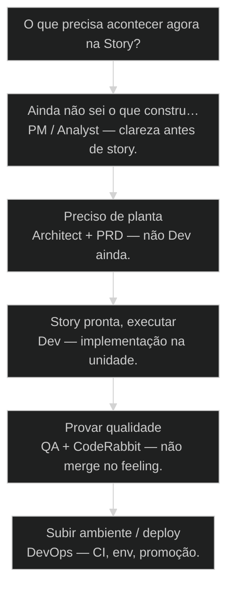
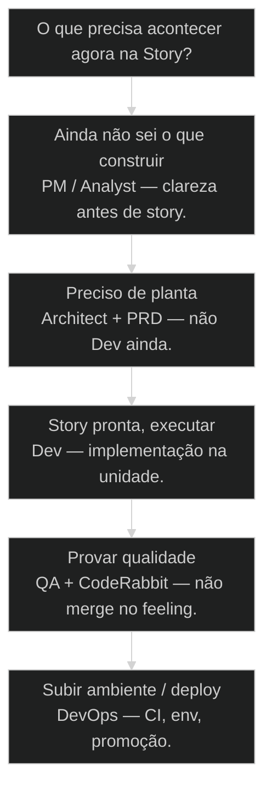

# Os 12 agentes orbitais do AIOX

← [[25-core-config-leis-sociais|core-config: as leis sociais do projeto]] · ↑ [[modulos/Módulo 1 - Sistema AIOX|M1]] · ⌂ [[Cursos/AIOX Advanced/README|Curso]] · → [[14-anatomia-do-agente|Anatomia de um agente: persona, skills, autoridade, memória]]

## Mapa desta aula

Decisão-chave da aula — O que precisa acontecer agora na Story?

> Leia o diagrama antes do texto longo. Depois volte e confira.

> PO, PM, Architect, Dev, QA, DevOps e o resto: quem orbita o núcleo, o que cada um pode, e quando usar @ vs /. Doze órbitas claras derrotam quarenta confusas.

**Objetivos de aprendizagem:**
- Listar os 12 [[Agentes Orbitais|agentes orbitais]] e o papel exclusivo de cada um sem colar cheatsheet. _(remember)_
- Explicar por que todos orbitam o mesmo núcleo (CLAUDE.md, core-config, PRD/stories). _(understand)_
- Decidir quando invocar com @ (persona) versus / (comando com greeting + processo). _(apply)_
- Roteirizar uma Story real com um dono exclusivo em cada transição de estado. _(apply)_

---

## O que você consegue no fim desta aula

*G · Destino*

Destino claro antes de qualquer jargão de agente.

Ao final desta aula você vai conseguir três coisas concretas:

1. Desenhar de cabeça o mapa: **um núcleo + doze órbitas**.
2. Olhar uma Story e dizer **quem move a próxima seta** — sem "qualquer agente serve".
3. Escolher **@ ou /** com critério, não por hábito.

Se você sair daqui ainda pensando que "mais agente = mais poder", a aula falhou.
O poder está na **autoridade exclusiva**, não no headcount de persona.

- **Objetivos da aula** (Listar os 12 e o anti-papel de cada um; Explicar o núcleo de gravidade; Rotear @ vs / e dono de transição)
- **Resultado tangível**: Uma Story sua com dono nomeado em cada seta draft→done.
- **Não é o destino**: Criar 40 agentes genéricos. Isso é o anti-objetivo.

---

## O erro do pedreiro com marreta

*P · Onde você está*

Empatia com o ponto de partida real do operador.

Cara, eu vejo o mesmo filme toda semana. A pessoa instala AIOX e a primeira
vontade é: "quantos agentes eu consigo empilhar?" Errado. A pergunta certa é:
**quem tem autoridade pra quê?**

Um aluno desenhou no whiteboard a melhor analogia: instalar e já criar [[Squad|squad]]/PO
é pedreiro com marreta tentando subir prédio de doze andares. Faltou o canteiro.
Faltou o mestre de obras. Faltou o núcleo.

Se você está aqui, provavelmente já sentiu um destes sintomas:

- Chamou @Dev pra coisa de produto e o diff veio genial e inútil.
- Misturou QA com "só olha aí" e mergeou no feeling.
- Criou agente novo porque o antigo "não entendeu" — quando o problema era órbita.

Beleza. A partir daqui a gente troca volume por gravidade.

**Onde a maioria trava**
- Mais agentes = mais capacidade (falso)
- @Dev pra tudo que parece código
- Ignorar CLAUDE.md e achar que prompt resolve

**Onde o operador vai**
- Órbita clara = menos retrabalho
- Transição da Story define o dono
- Núcleo coerente antes de qualquer @

---

## Doze apóstolos da AIOX

*S · Rota*

Não é misticismo — é batismo de função. Cada um com órbita, gravidade e o que NÃO faz.

Eu chamo de **doze apóstolos** pra colar na cabeça: são doze funções com nome.
PO não faz deploy. DevOps não inventa story. QA não escreve o PRD. Quando você
mistura órbita, o sistema vira chat genérico com fantasia de squad.

O núcleo é um: CLAUDE.md, core-config, PRD/stories. Os doze orbitam. Sem núcleo,
flutuam. Com núcleo e órbita clara, o time cabe no teu computador.

Prior-art: a aula de agentes orbitais (04) já plantou a metáfora. Aqui a gente
**instancia o mapa dos doze** e treina roteamento de verdade.

- **12**: órbitas batizadas
- **1**: núcleo de gravidade
- **0**: espaço pra fantasma sem dono

- **status**: 12 orbital agents
- **meta**: nucleo=claude+config+prd
- **meta**: regra=uma autoridade por orbita
- **ready**: ready to map

**Legenda de cores**

O que cada cor sinaliza nesta aula

- **Núcleo** (signal): arquivos que puxam contexto de todo mundo
- **Órbita** (insight): função exclusiva, sem sobreposição
- **@ vs /** (bench): persona carregada vs comando com greeting
- **Rota** (action): agente certo na transição certa
- **Erro** (pain): pedir pro planeta errado

**Como ler esta aula**

1. **Núcleo**: O que todo agente lê antes de falar.
2. **Os 12**: Nome, papel, anti-papel.
3. **@ vs /**: Quando cada sintaxe carrega o que.
4. **Roteia**: Story de ponta a ponta com dono em cada seta.

---

## Da cohort: @ sem processo e o lugar burro

*T1 + T2 · WhatsApp*

Realidade do grupo Advanced — não é slide, é cicatriz.

Alan no grupo:

> A importância de conhecer o sistema. Vi a IA indo pra um lugar burro como sempre.
> Direcionei ela pro lugar certo. **IA sem processo é desperdício de tokens.**

E a dúvida clássica da turma: 'se eu não der /, ele chama o agente?'

Esta aula existe para acabar com o culto ao @ solto. Órbita + transição da Story +
sintaxe certa. O grupo Advanced foi laboratório disso por meses.

> **Âncora de campo**: Conhecer o sistema é o superpoder — não acumular persona.

> **Materiais / FAQ**: FAQ-cohort §8 · cruzar com 14 e 15

---

## O núcleo que todo mundo orbita

Sem gravidade comum, cada agente inventa uma verdade.

Três peças no centro — decora isso:

1. **CLAUDE.md** — [[CLAUDE md|leis da física do projeto]] (pode / nunca).
2. **core-config** — leis sociais (como o time se comporta).
3. **PRD / stories** — o que estamos construindo agora.

Quando você chama por **barra**, o greeting builder puxa o núcleo antes da
resposta. Quando chama só por **arroba**, carrega a persona. Os dois têm lugar.

Então o que acontece se o núcleo está podre? Onze versões diferentes da verdade.
O Dev otimiza uma coisa, o PO prioriza outra, o QA testa uma terceira. Não é
"IA burra". É gravidade zero.

> **Lei da órbita**: Autoridade exclusiva. Se dois agentes podem fazer a mesma coisa, um deles sobra — ou os dois vão brigar em silêncio no teu diff.

- **1. CLAUDE.md**: Física: proibições, padrões, paths sagrados. [lei]
- **2. core-config**: Social: papéis, gates, quem pode o quê. [time]
- **3. PRD/Stories**: Produto: o trabalho da vez com aceite. [agora]

- **Núcleo fraco** != **Agente fraco**: Quase sempre o núcleo está incoerente e a gente culpa a persona.
- **Mais contexto** != **Melhor gravidade**: Contexto demais sem hierarquia é ruído; núcleo é hierarquia.

---

## Os doze: papel e anti-papel

Memoriza a órbita, não o marketing do nome.

Lista operacional — o que cada um carrega na prática AIOX. O número 12 é âncora
didática. Teu squad pode expandir — mas cada órbita nova nasce com autoridade
**escrita**, não com vibe.

1. **Master / Orchestrator** — coordena; não executa tudo "porque pode".
2. **PM** — outcome, prioridade, roadmap; não vira Dev de plantão.
3. **PO** — backlog e aceite; não inventa stack no meio do path.
4. **SM** — fluxo de stories e cadência; não é "chefe de reunião".
5. **Architect** — decisões de sistema e limites; não implementa a story inteira.
6. **Dev** — implementação na story **ready**; não redefine o produto no diff.
7. **QA** — evidência e [[Quality Gate|quality gate]]; não é "opinião de gosto".
8. **DevOps** — ambiente, CI, deploy, bootstrap; primeiro no canteiro.
9. **Data / DB** — schema, RLS, migração; não é "Dev com SQL".
10. **UX / Design** — contrato de interface ([[DESIGN md|DESIGN.md]]); não pixel solto no prompt.
11. **Analyst / Research** — multi-fonte e bench; não vira copy de venda.
12. **Ops / Support / Security** (conforme config) — órbita explícita; nunca "faz tudo".

Olha só: se o teu time tem 12 nomes e 3 funções de verdade, você não tem órbita —
tem fantasia.

- **Órbita**: Papel com autoridade exclusiva e handoff claro.
- **Núcleo**: CLAUDE.md + core-config + artefatos de produto.
- **Anti-papel**: O que o agente explicitamente NÃO faz — tão importante quanto o papel.
- **Erro de rota**: Chamar o agente errado e pagar com contexto errado.

> **Prior-art**: A aula 04 (agentes orbitais) foca a metáfora e o ciclo. Esta aula instancia o roster e o roteamento diário. As duas se complementam — não se substituem.

---

## Caso: canteiro antes dos pedreiros

A metáfora do José Carlos — e o que ela manda fazer na prática.

"Quando a gente instala AIOX, quer sair criando squad, criando PO. Mas é como
pedreiro com marreta e carrinho de mão tentando subir prédio de doze andares.
Faltou o ambiente."

DevOps é o mestre de obras. Antes de subir o prédio, analisa terreno, prepara
canteiro, andaime, elevador de carga. No AIOX isso vira bootstrap: escanear
máquina, configurar, só então liberar os outros.

PO, PM, Architect, Dev, QA sobem andar por andar. Sem canteiro, ninguém sobe
um tijolo com segurança. Então o que acontece se você pula DevOps? Você acha
que está "indo rápido" — até o primeiro ambiente inconsistente te devolver o
dia inteiro.

**Ordem do canteiro**

1. **Núcleo**: CLAUDE.md + config coerentes
2. **DevOps**: Bootstrap / ambiente
3. **Produto**: PM/PO/Architect na planta
4. **Build**: Dev na story ready
5. **Gate**: QA + review + done

---

## Quando @ e quando /

Sintaxe errada = contexto errado.

Regra prática — decora:

- **/** quando você quer o **ritual**: greeting, skills, gates, workflow.
- **@** quando você quer a **cabeça do papel** numa conversa pontual.

Se você só @Dev o dia inteiro sem story validada, contratou estagiário genial
sem planta. Se você só / sem entender a órbita, vira botão mágico.

Por quê? Porque o / puxa o núcleo com disciplina. O @ puxa a persona. Os dois
são armas. Usar a errada não é detalhe de UI — é tipo de contexto.

> **Rota mental em 5 segundos**: Qual transição da Story isso move? Quem é o dono legal dessa seta? Chama esse — com a sintaxe do processo (@ se raciocínio de papel, / se ritual).

**Atalho de decisão**

- **Preciso do processo/gate**: Use /comando
- **Preciso do julgamento do papel**: Use @agente
- **Não sei a seta da Story**: Pare. Não chame ninguém ainda.
- **Dois agentes 'servem'**: Seu mapa de órbita está sujo — limpe.

---

## Qual agente chamar agora?

Árvore curta pra não errar a rota.

**Árvore de decisão**
_A transição define o dono — não a urgência emocional._

- **Ainda não sei o que construir** — Problema aberto, outcome confuso.
  → _PM / Analyst — clareza antes de story._
  Ex.: Cliente pediu 'IA no app' sem dor medida.
- **Preciso de planta** — Escopo grande, trade-offs, stack.
  → _Architect + PRD — não Dev ainda._
  Ex.: Migrar auth sem ADR.
- **Story pronta, executar** — Aceite claro, ready validado.
  → _Dev — implementação na unidade._
  Ex.: Story com DoD e paths definidos.
- **Provar qualidade** — Diff existe, precisa gate.
  → _QA + [[CodeRabbit]] — não merge no feeling._
  Ex.: PR aberto sem QG.
- **Subir ambiente / deploy** — Rodar de verdade fora da máquina.
  → _DevOps — CI, env, promoção._
  Ex.: Staging quebrado, prod no escuro.

**Gate:** Você consegue nomear a transição (de → para) e o dono? — _Se não nomeia a seta, não chama agente ainda._

#### Rota clareza
Outcome e prioridade antes de código.
1. **Nomear dor: Uma frase mensurável.
2. **PM/Analyst: Clareza e opções.
3. **Brief/PRD: Planta antes de story.
4. **Só então stories: Unidades com aceite.

#### Rota build
Story ready → Dev → review.
1. **Validate: draft → ready.
2. **Dev: Implementa a unidade.
3. **PR: Diff revisável.
4. **QA/CR: Gate com evidência.

#### Rota ship
Promoção com dono de ambiente.
1. **QG PASS: Bloqueio real.
2. **DevOps: Promove com checklist.
3. **Staging: Smoke real.
4. **Prod: Com rollback mental.

---

## Roteie uma Story real (15 min)

Papel, vault ou board — mas escrito.

Vamos lá. Sem isso a aula vira podcast. Cronometra quinze minutos.

- 1. **Escolha**: Uma feature real do teu projeto (mesmo pequena).
- 2. **Estados**: Escreva draft → ready → in progress → in review → done.
- 3. **Dono**: Em cada seta, coloque UM agente orbital (anti-papel também).
- 4. **Sintaxe**: Para a próxima ação real: @ ou /? Por quê?
- 5. **Prova**: Se duas setas têm o mesmo dono sem motivo, separe ou justifique em uma linha.

**Funcionou se:**

- Você listou os 12 sem colar num PDF.
- Cada transição da Story tem um dono exclusivo.
- Você justificou @ vs / na próxima ação.

---

## Glossário sem jargão de vaidade

- **Apóstolo orbital**: Metáfora dos 12 papéis com batismo e autoridade — não hierarquia religiosa.
- **Greeting builder**: Ritual que monta contexto (núcleo + persona) antes do agente responder no /comando.
- **Erro de rota**: Chamar o agente errado e pagar com contexto errado + retrabalho.
- **Canteiro**: Ambiente e núcleo prontos antes de 'subir o prédio' com Dev/PO/QA.

---

## Portão da aula

Você passou quando, sem cheatsheet, responde: quem orbita o quê, e quem move a
próxima seta da sua Story. Volume de agente é vaidade. Órbita é engenharia.

A IA é a seta. O X é seu — inclusive escolher **quem** segura a ferramenta.

> **Próximo na trilha**: Se a Story ainda vira puxadinho, a aula de Briefing → PRD → Stories aprofunda as três etapas que não se misturam (posição 46).

> **GATE-MODULE (auto)**: GPS Goal/Position/Steps presentes · caso + do/dont · decisão · prática com evidência · glossário. Alvo DL ≥70 atingido na construção enrich-W1.

***

---

## Navegação

← [[25-core-config-leis-sociais|core-config: as leis sociais do projeto]] · ↑ [[modulos/Módulo 1 - Sistema AIOX|M1]] · ⌂ [[Cursos/AIOX Advanced/README|Curso]] · → [[14-anatomia-do-agente|Anatomia de um agente: persona, skills, autoridade, memória]]
