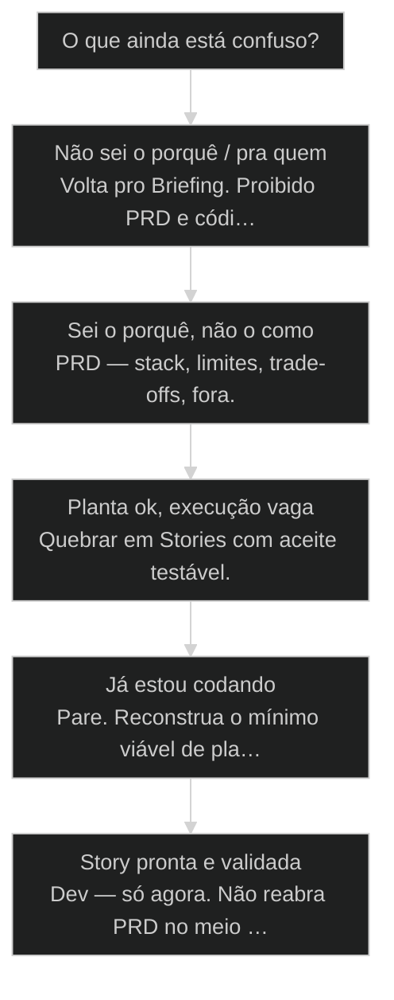
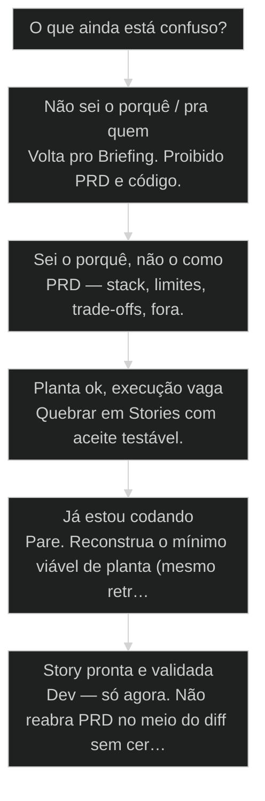

# Briefing, PRD, Stories: as 3 etapas antes do código

← [[18-yaml-markdown-json-sweet-spot|YAML, Markdown, JSON: o sweet spot para LLM]] · ↑ [[modulos/Módulo 3 - Ciclo SDC|M3]] · ⌂ [[Cursos/AIOX Advanced/README|Curso]] · → [[47-ciclo-de-vida-do-story|Ciclo de vida do Story: draft → ready → in progress → in review → done]]

## Mapa desta aula

Decisão-chave da aula — O que ainda está confuso?

> Leia o diagrama antes do texto longo. Depois volte e confira.

> Por que pular essas etapas vira puxadinho atrás de puxadinho — e como nunca mais confundir PRD com Story.

**Objetivos de aprendizagem:**
- Listar o que cada etapa (Briefing, PRD, Story) trava e o que proíbe pular. _(remember)_
- Diferenciar Briefing, PRD e Story em uma feature real sem misturar os artefatos. _(understand)_
- Aplicar as três etapas em ordem em um pedido de feature do próprio projeto. _(apply)_
- Detectar quando o time pulou etapa e o sintoma vira puxadinho industrializado. _(analyze)_

---

## O que você consegue no fim desta aula

*G · Destino*

Destino claro antes de qualquer template de PRD.

Ao final desta aula você vai conseguir três coisas concretas:

1. Olhar um pedido de feature e **nomear em qual etapa ele está** (ou se ainda não está em nenhuma).
2. Separar em arquivo (mesmo rascunho curto) **Briefing ≠ PRD ≠ Story** sem reaproveitar o mesmo parágrafo.
3. Recusar com critério o "só manda pro Claude" quando a planta não existe.

Se você sair daqui ainda chamando de "PRD" um post-it de duas linhas, a aula falhou.
Velocidade sem as três etapas não é produtividade — é **puxadinho com CI verde**.

- **Objetivos da aula** (Listar o que cada etapa trava; Diferenciar os três artefatos num pedido real; Aplicar a ordem brief → prd → stories)
- **Resultado tangível**: Uma feature sua com 3 caixas preenchidas e a próxima ação nomeada.
- **Não é o destino**: Escrever PRD de 40 páginas. É fechar a planta mínima que um sênior construiria igual.

---

## A mansão com sete puxadinhos

*P · Onde você está*

Empatia com o ponto de partida real do operador.

Cara, eu mesmo já errei feio nisso. Fazia "PRD" que era story disfarçada. Ou pior:
abria o Claude e mandava construir com uma frase solta. O modelo é rápido. Então
você não ganha um puxadinho — ganha uma **favela em velocidade de startup**.

A maioria começa a comandar IA sem especificação. Sem briefing, sem detalhamento,
sem quebra em tarefas. Aí vira o quê? Mansãozinha bonita no pitch e, na prática,
varanda enferrujada do lado, garagem improvisada, banheiro no quintal. O pior:
**continua funcionando** — e você se acostuma com a porcaria.

Se você está aqui, provavelmente já sentiu um destes sintomas:

- Cliente pediu "coloca IA aí" e o diff já saiu genial e inútil.
- "PRD" de três linhas e story de romance (ou o inverso).
- Aceite inventado no meio do PR porque ninguém escreveu o contrato.

Beleza. A partir daqui a gente troca vibe de execução por **ordem de especificação**.

**Onde a maioria trava**
- Uma frase vira implementação
- PRD e Story no mesmo arquivo sem fronteira
- Aceite mental ('você vai entender')

**Onde o operador vai**
- Briefing fecha o porquê antes da planta
- PRD fecha a planta antes da ordem de serviço
- Story fecha o pedaço executável com aceite testável

---

## As três etapas que separam operador de torcedor

*S · Rota*

Não é burocracia — é barreira barata antes do custo caro.

Decora a trinca:

1. **Briefing** — o que e por quê (dor, ICP, não-negociáveis).
2. **PRD** — planta operacional (escopo, stack, trade-offs, fora de escopo).
3. **Stories** — unidades mastigáveis com aceite e dono.

PRD não é Story. Story não é briefing. Misturar os três é industrializar gambiarra.

Prior-art: a aula 07 (etapas de desenvolvimento AIOX) plantou o sintoma do puxadinho
e a trinca canônica. Aqui a gente **instancia o roteamento operacional** — em qual
etapa você está de verdade, e o que falta pra avançar sem pular.

- **3**: etapas canônicas
- **1**: ordem obrigatória
- **0**: espaço pra frase-solta-no-chat

- **status**: brief → prd → stories
- **meta**: anti=frase-solta-no-chat
- **meta**: regra=artefato em arquivo
- **ready**: ready to stage

**Legenda de cores**

O que cada cor sinaliza nesta aula

- **Briefing** (signal): intenção: dor, ICP, outcome
- **PRD** (insight): planta: escopo, stack, fora
- **Story** (bench): unidade com aceite verificável
- **Ordem** (action): só avança com artefato da etapa
- **Puxadinho** (pain): código sem planta ou aceite

**Como ler esta aula**

1. **Sintoma**: Reconhecer o puxadinho industrializado.
2. **As 3**: O que cada etapa trava (e o anti-papel).
3. **Ordem**: Por que a sequência é barata e o pulo é caro.
4. **Prática**: Passar uma feature real pelas três caixas.

---

## Briefing, PRD, Stories — o que cada um trava

Memoriza a trava, não o template.

**Briefing** trava ambiguidade de **intenção**. Se você não sabe a dor, não tem o que
detalhar. Pergunta-mãe: "pra quem e que mudança de vida isso gera?"

**PRD** trava ambiguidade de **construção**. Stack, limites, integrações, o que NÃO
entra. Pergunta-mãe: "se um sênior lesse isso, construiria a mesma coisa que eu?"

**Story** trava ambiguidade de **execução**. Aceite testável, paths, fora. Pergunta-mãe:
"dá pra marcar done sem opinião?"

Então o que acontece se o PRD nasce torto? A story nasce torta. Se a story nasce torta,
o Claude Code constrói torto — e constrói **rápido**. Velocidade multiplica erro de planta.

Olha só: se o teu "PRD" é um parágrafo e a "story" é um romance de escopo, você não tem
etapas — tem confusão com nome de cargo.

> **PRD não é Story**: PRD é a planta do prédio. Story é a ordem de serviço do andar. Usar um no lugar do outro é pedir pro pedreiro improvisar a arquitetura.

- **1. Briefing**: Dor, ICP, outcome, não-negociáveis. Fecha o porquê. [intenção]
- **2. PRD**: Escopo, stack, trade-offs, fora de escopo. Fecha a planta. [planta]
- **3. Stories**: Unidades com aceite, paths, dono de ciclo. Fecha a execução. [unidade]

- **Briefing**: Clareza de intenção: dor, ICP, outcome, restrições — sem stack ainda.
- **PRD**: Planta operacional: escopo, decisões, trade-offs, fora de escopo.
- **Story**: Unidade executável com aceite verificável e dono de ciclo.
- **Puxadinho**: Correção em cima de correção sem planta — velocidade sem fundação.

- **PRD curto e claro** != **Story incompleta**: Planta boa não desculpa unidade sem aceite.
- **Story detalhada** != **PRD disfarçado**: Se a story redefine stack e escopo do produto, sobrou PRD.

---

## Por que a sequência é barata e o pulo é caro

Custo de especificar vs custo de desfazer.

Beleza. Então o que acontece quando você pula?

- Pula **briefing** → otimiza a feature errada com elegância.
- Pula **PRD** → cada story inventa uma arquitetura diferente.
- Pula **story** → o Dev (humano ou IA) decide o aceite no diff.

E o pior anti-pattern moderno: **pular as três** e mandar uma frase no chat.
O modelo entrega. Você sente progresso. Duas sprints depois você está pagando
a dívida com juros de contexto perdido.

A ordem brief → prd → stories não é ritual de consultoria. É o caminho em que
o erro barato (texto) vem **antes** do erro caro (código + merge + hábito).

Prior-art reforça: [[Determinismo Progressivo|determinismo progressivo]] (aula 09) diz a mesma coisa em outra
linguagem — trave o caminho antes de soltar a IA solta. Aqui a trava é a etapa.

> **Regra do arquivo**: Se o artefato da etapa não existe em arquivo (mesmo rascunho de 8 linhas), a etapa não aconteceu. Memória de reunião não conta.

**Fluxo canônico pré-código**

1. **Briefing**: Fecha intenção
2. **PRD**: Fecha planta
3. **Stories**: Quebra + aceite
4. **Validate**: draft → ready
5. **Dev**: Só na unidade ready

---

## Caso: 'coloca IA no onboarding'

O mesmo pedido em três etapas — e o desastre de pular.

Pedido do cliente: "coloca IA no onboarding pra engajar mais."

**Sem etapas:** Claude gera wizard com chat, embeddings, três providers e um
dashboard. Bonito. Ninguém sabe o outcome. Em duas semanas o time discute
"qual modelo" em vez de "qual dor".

**Com etapas:**

- **Briefing:** ICP = trial de 14 dias; dor = abandono no passo 2; outcome =
  +X% completar onboarding; não-negociável = sem treinar modelo próprio.
- **PRD:** escopo = checklist + dica contextual no passo 2; stack = LLM via
  API já usada; fora = chat livre, analytics novo, fine-tune.
- **Story 1:** "Dado trial no passo 2, quando usuário hesita 30s, então mostra
  dica com base no perfil — aceite: teste e2e + fallback se API cair."

Então o que acontece? O Dev (ou o agente) recebe **ordem de serviço**, não
romance de produto. O QG depois consegue provar o aceite — porque o aceite existe.

> **Prior-art**: Aula 07 mostra o puxadinho como cultura. Esta aula opera o antídoto: três caixas, ordem, e recusa de Dev sem artefato. As duas se complementam.

**Mesmo pedido, três densidades**

- **Briefing (5–10 linhas)**: Pra quem, dor, outcome, não-negociáveis
- **PRD (1–3 páginas úteis)**: Escopo, stack, trade-offs, fora
- **Story (1 unidade)**: Aceite testável + paths + dono
- **Anti-padrão**: Um único blob chamado 'spec' com tudo misturado

---

## Em qual etapa você está de verdade?

A confusão aponta a etapa — não o desejo de codar.

**Árvore de decisão**
_A confusão aponta a etapa — não a urgência emocional de abrir o editor._

- **Não sei o porquê / pra quem** — Dor e outcome nebulosos.
  → _Volta pro Briefing. Proibido PRD e código._
  Ex.: Cliente: 'coloca IA aí'.
- **Sei o porquê, não o como** — Outcome ok, planta fraca.
  → _PRD — stack, limites, trade-offs, fora._
  Ex.: Quer onboarding, sem decidir auth.
- **Planta ok, execução vaga** — PRD existe, ninguém sabe o próximo diff.
  → _Quebrar em Stories com aceite testável._
  Ex.: PRD de 8 páginas, zero story ready.
- **Já estou codando** — Diff rolando sem artefato.
  → _Pare. Reconstrua o mínimo viável de planta (mesmo retroativo)._
  Ex.: Branch com 40 arquivos e aceite mental.
- **Story pronta e validada** — Aceite claro, ready.
  → _Dev — só agora. Não reabra PRD no meio do diff sem cerimônia._
  Ex.: Story com DoD e paths definidos.

**Gate:** Você consegue apontar o artefato atual (brief / PRD / story) e o que falta pra avançar? — _Se o artefato não existe em arquivo, a etapa não aconteceu._

#### Rota Briefing
Intenção antes de planta.
1. **Nomear dor: Uma frase mensurável.
2. **ICP: Pra quem isso muda a vida.
3. **Outcome: O que 'melhor' significa em número ou comportamento.
4. **Não-negociáveis: Restrições que matam o projeto se violadas.

#### Rota PRD
Planta antes de story.
1. **Escopo: O que entra nesta fatia.
2. **Stack / decisões: O sênior não deveria adivinhar.
3. **Trade-offs: O que você abriu mão e por quê.
4. **Fora: Lista explícita do que NÃO entra.

#### Rota Stories
Unidades com aceite.
1. **Quebrar: Fatias que cabem num ciclo.
2. **Aceite: Testável sem opinião.
3. **Validate: draft → ready (próxima aula aprofunda).
4. **Só então Dev: Implementação na unidade ready.

---

## Uma feature, três caixas (15 min)

Papel, vault ou board — mas escrito.

Vamos lá. Sem isso a aula vira podcast. Cronometra quinze minutos. Escolhe
algo real — até pedido que você "já quase codou" serve pra auditar o que faltou.

- 1. **Feature**: Escolha um pedido real do teu projeto (mesmo pequeno).
- 2. **Briefing**: 5–10 linhas: dor, ICP, outcome, não-negociáveis.
- 3. **PRD mínimo**: 10–20 linhas: escopo, stack/decisões, trade-offs, fora.
- 4. **Uma Story**: 1 unidade com aceite testável em uma frase + paths se souber.
- 5. **Auditoria**: Marque o que estava misturado antes (PRD dentro da story, etc.).

**Funcionou se:**

- Você separou os três artefatos sem reutilizar o mesmo bloco de texto.
- A story tem aceite testável em uma frase.
- Você sabe qual etapa estava pulando no fluxo antigo.
- Consegue nomear a próxima ação (voltar etapa / validar / dev) sem 'vamos vendo'.

---

## Glossário sem jargão de vaidade

- **Briefing**: Artefato de intenção: dor, ICP, outcome e restrições antes de qualquer planta técnica.
- **PRD**: Product Requirements / planta operacional: escopo, decisões, trade-offs e fora de escopo.
- **Story**: Unidade de trabalho com aceite verificável; ordem de serviço, não romance de produto.
- **Puxadinho**: Camada de gambiarra em cima de base fraca — velocidade aparente, dívida real.
- **Aceite testável**: Critério de done que dá pra provar sem 'acho que tá bom'.
- **Regra do arquivo**: Etapa só conta se o artefato existe fora da memória da conversa.

---

## Portão da aula

Você passou quando, sem cheatsheet, diferencia Briefing, PRD e Story num pedido
real e recusa começar Dev sem a etapa certa existir em arquivo.

A IA é a seta. O X é seu — inclusive **não soltar a seta** antes da planta.

> **Próximo na trilha**: Com as etapas claras, o ciclo de vida da Story (draft→done) vira o trilho onde o bastão passa de agente pra agente (posição 47).

> **GATE-MODULE (auto)**: GPS Goal/Position/Steps presentes · caso + do/dont · decisão · prática com evidência · glossário. Alvo DL ≥70 atingido na construção enrich-W1.

***

---

## Navegação

← [[18-yaml-markdown-json-sweet-spot|YAML, Markdown, JSON: o sweet spot para LLM]] · ↑ [[modulos/Módulo 3 - Ciclo SDC|M3]] · ⌂ [[Cursos/AIOX Advanced/README|Curso]] · → [[47-ciclo-de-vida-do-story|Ciclo de vida do Story: draft → ready → in progress → in review → done]]
