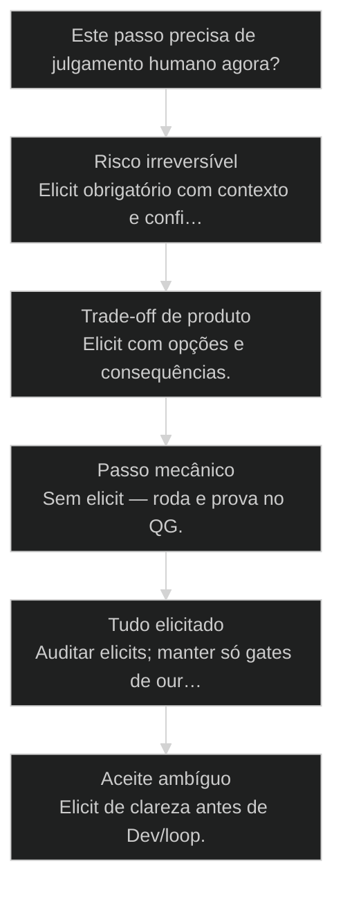
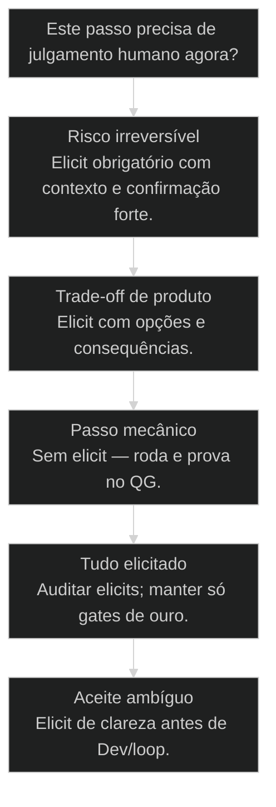

# Rider: quando o operador é o piloto

← [[11-goal-vs-loop|Goal vs Loop]] · ↑ [[modulos/Módulo 4 - Determinismo e Comando|M4]] · ⌂ [[Cursos/AIOX Advanced/README|Curso]] · → [[22-pipeline-etl-com-agentes|Pipeline ETL com agentes: hierarquia de camadas]]

## Mapa desta aula

Decisão-chave da aula — Este passo precisa de julgamento humano agora?

> Leia o diagrama antes do texto longo. Depois volte e confira.

> Elicit:true nos momentos críticos — o rider segura as rédeas enquanto o loop corre. Autonomia com freio, não microgestão.

**Objetivos de aprendizagem:**
- Definir rider e elicitação como governança de autonomia, não como aprovação de cada passo. _(remember)_
- Explicar a diferença entre microgestão (elicit em tudo) e rédeas (elicit nos gates de ouro). _(understand)_
- Marcar pontos de elicitação em um goal/loop real com critério de risco e irreversibilidade. _(apply)_
- Diagnosticar um fluxo que ficou bottleneck ou sem freio e rebalancear o mapa de rider. _(analyze)_

---

## O que você consegue no fim desta aula

*G · Destino*

Destino claro antes de qualquer flag elicit:true.

Ao final desta aula você vai conseguir três coisas concretas:

1. Desenhar o mapa **piloto ligado / piloto em espera** de um loop real.
2. Colocar **elicit** só onde risco, trade-off ou aceite ambíguo moram.
3. Cortar microgestão sem largar o volante — rédeas, não chicote.

Se você sair daqui ainda aprovando cada commit ou rodando loop sem freio,
a aula falhou. O poder do rider é **seletividade**, não volume de perguntas.

- **Objetivos da aula** (Definir rider vs autonomia cega; Mapear gates de ouro de elicitação; Rebalancear bottleneck e freio zero)
- **Resultado tangível**: Um goal/loop seu com 1–3 elicits justificados e o resto em silêncio.
- **Não é o destino**: Virar o gargalo humano de cada passo. Isso mata o loop.

---

## Cavalo sem freio ou freio em cada pedra

*P · Onde você está*

Empatia com os dois extremos que destroem autonomia.

Cara, autonomia sem rider é cavalo sem freio. O loop roda, o agente "decide", e
você descobre no diff que ele escolheu o caminho mais engraçado — drop de tabela,
API pública sem auth, stack inventada no meio da story.

O outro extremo é pior em volume: elicit em **tudo**. Você vira o bottleneck
com crachá de "governança". O loop morre esperando "ok" pra renomear variável.

Se você está aqui, provavelmente já sentiu um destes sintomas:

- Loop queimou tokens e credibilidade com uma decisão irreversível sozinho.
- Você aprova cada passo e o time te odeia (com razão).
- "Elicit:true" copiado em 40 tasks sem critério.
- Confunde "não delegar pensar" (aula 26) com "eu faço tudo na mão".

Beleza. A partir daqui a gente troca medo e controle por **mapa de rédeas**.

**Onde a maioria trava**
- Elicit em tudo ou em nada
- Confiar no feeling do modelo no gate de ouro
- Microgerenciar o mecânico e abandonar o estratégico

**Onde o operador vai**
- Elicit só em risco / trade-off / aceite ambíguo
- Silêncio em passo determinístico e reversível
- Pergunta que muda rota — não confirmação de óbvio

---

## Rider: o piloto nos pontos que importam

*S · Rota*

Não é humilhação do agente. É contrato de onde o ouro mora.

Rider é o modo em que o **operador é piloto**: elicitação nos pontos que importam
— aceite, risco, trade-off — e silêncio onde o determinismo basta.

Prior-art: [[Goal vs Loop|goal vs loop]] (11) ensina o que o loop persegue; não delegar pensar (26)
lembra que julgamento não se terceiriza; apply QA fixes (49) mostra loop com
breaker. Aqui a gente instancia **onde o humano segura o volante** sem matar o ritmo.

A metáfora que cola: rédeas, não chicote. Rédea puxa no momento certo. Chicote
cospe a cada metro. O loop precisa de velocidade **e** freio seletivo.

- **3**: tipos de gate de ouro
- **1**: piloto por decisão crítica
- **0**: espaço pra elicit de óbvio

- **status**: rider mode
- **meta**: elicit=gates de ouro
- **meta**: silencio=mecanico+reversivel
- **ready**: ready to steer

**Legenda de cores**

O que cada cor sinaliza nesta aula

- **Rider** (signal): humano no volante do gate
- **Elicit** (insight): pausa que muda rota
- **Gate de ouro** (bench): risco, trade-off, aceite ambíguo
- **Loop livre** (action): roda sem fricção humana
- **Microgestão** (pain): elicit trivial = morte do ritmo

**Como ler esta aula**

1. **Rédeas**: O que é rider e o que não é.
2. **Gates**: Onde colocar elicit de verdade.
3. **Caso**: Drop silencioso vs freio certo.
4. **Mapa**: Desenhar o teu goal com elicits.

---

## Rédeas, não chicote

Elicitação boa muda rota. Elicitação ruim pede 'ok' pro óbvio.

Três verdades que salvam o design do fluxo:

1. **Elicit bom** faz uma pergunta com opções e consequência.
2. **Elicit ruim** pede confirmação do que o [[Runner|runner]] já sabe.
3. **Silêncio bom** é respeito ao determinismo — não preguiça.

Então o que acontece se tudo é elicit:true? Você matou a autonomia. O loop
vira chat com checklist. O operador vira CPU humana de "continue".

E se nada é elicit? Você largou o volante. O modelo otimiza o caminho local
mais fácil — que às vezes apaga o banco, publica sem auth ou escolhe stack
que você nunca aprovaria de olhos abertos.

Olha só: rider não é "eu desconfio da IA". Rider é "eu sei **onde** o julgamento
humano ainda é o ouro do processo".

- **1. Risco**: Irreversível, caro, público, legal, prod. [freio]
- **2. Trade-off**: Duas rotas válidas; gosto e estratégia importam. [escolha]
- **3. Mecânico**: Reversível, testeável, scriptável — sem elicit. [silêncio]

> **Lei do rider**: Uma pergunta que muda rota vale cem 'pode seguir?'. Se a resposta óbvia não altera o caminho, tire o elicit.

- **Governança** != **Microgestão**: Governança puxa no gate de ouro; microgestão cospe em cada pedra.
- **Autonomia** != **Abandono**: Autonomia com freio; abandono é loop sem piloto em risco.

---

## Onde colocar o rider

Checklist operacional — não filosofia.

Pontos clássicos de **elicit obrigatório**:

- Antes de **apagar / migrar / dropar** dados ou schema em ambiente real.
- Antes de **expor** API, webhook ou superfície pública.
- Antes de **escolher stack**, vendor ou contrato de longo prazo.
- No gate de **aceite ambíguo** — quando o DoD admite duas interpretações.
- Em **billing, auth, PII, compliance** — o ouro e o veneno moram juntos.

Pontos clássicos de **silêncio** (sem elicit):

- Format, lint, rename mecânico, geração de boilerplate sob template.
- Re-run de teste após patch com critério fixo.
- Passos de runner com entrada/saída congeladas.

Regra prática em cinco segundos: **é irreversível, caro ou de gosto estratégico?**
Elicit. **É mecânico e reversível?** Roda. **Não sei?** Trate como elicit até
provar o contrário uma vez — e depois documente o silêncio.

**Atalho de decisão**

- **Irreversível / prod / PII**: Elicit obrigatório
- **Duas rotas válidas de produto**: Elicit com opções
- **Determinístico e reversível**: Sem elicit — roda
- **Operador virou bottleneck**: Cortar elicits triviais

- **Gate de ouro**: Ponto do fluxo onde julgamento humano muda resultado de verdade.
- **Elicit**: Pausa deliberada pedindo decisão humana com contexto e opções.
- **Silêncio operacional**: Ausência de elicit onde o determinismo basta.
- **Bottleneck de rider**: Excesso de elicits que mata o throughput do loop.

> **Prior-art**: Goal vs loop (11) define o que o ciclo persegue. Não delegar pensar (26) proíbe terceirizar o julgamento. Esta aula marca o mapa físico dos freios no workflow.

---

## Caso: o drop que o loop 'otimizou'

Quando silêncio no gate de ouro custa o fim de semana.

Story: limpar staging. O runner tinha passo "reset schema se ambiente=staging".
Alguém apontou `ENVIRONMENT=production` por typo no CI. Sem elicit. Drop.
Backup existia — mas o fim de semana não.

O fix de processo não foi "proibir automação". Foi **rider no passo irreversível**:

1. Detectar verbo perigoso (drop, truncate, force-push, publish public).
2. Elicit com resumo: ambiente, contagem de linhas, comando exato, rollback.
3. Humano digita confirmação não-trivial (nome do ambiente), não só "y".
4. Só então o loop segue.

No mesmo fluxo, format e migrate *up* em branch de feature continuaram sem
elicit. Rédea no precipício. Silêncio na reta.

Então o que acontece se você só "confia no modelo"? Você confia no prompt
errado de um dev cansado. Rider é engenharia de freio, não paranoia.

**Gate de ouro em ação perigosa**

1. **Detect**: Verbo irreversível
2. **Context**: Env + impacto + cmd
3. **Elicit**: Confirmação não-trivial
4. **Act**: Executa com log
5. **Prove**: Smoke / rollback mental

**Anti-padrão**
- y/N em drop de prod
- Elicit em prettier e commit
- Confiar no env var sem eco

**Padrão rider**
- Confirmação com nome do ambiente
- Elicit só no precipício
- Eco de contexto antes do OK

---

## Ligar o piloto ou deixar o loop voar?

Árvore curta pra não errar o freio.

**Árvore de decisão**
_Risco e irreversibilidade mandam — não a ansiedade._

- **Risco irreversível** — Apaga, cobra, publica, migra prod, expõe PII.
  → _Elicit obrigatório com contexto e confirmação forte._
  Ex.: Drop de tabela; publish de pacote público.
- **Trade-off de produto** — Duas rotas válidas; gosto ou estratégia importa.
  → _Elicit com opções e consequências._
  Ex.: UX A vs B; vendor X vs Y.
- **Passo mecânico** — Determinístico, testável e reversível.
  → _Sem elicit — roda e prova no QG._
  Ex.: Formatar; re-run de unit test.
- **Tudo elicitado** — Operador virou bottleneck do time.
  → _Auditar elicits; manter só gates de ouro._
  Ex.: Aprovar cada commit e cada rename.
- **Aceite ambíguo** — DoD admite duas interpretações honestas.
  → _Elicit de clareza antes de Dev/loop._
  Ex.: 'Melhorar performance' sem métrica.

**Gate:** Você consegue justificar o elicit (ou a ausência) em uma frase verificável? — _Se a frase é 'por precaução genérica', ainda é medo — refine o critério._

#### Piloto ligado
Risco alto ou trade-off.
1. **Marcar gate: Nomeie o passo no workflow.
2. **Montar contexto: Impacto, opções, rollback.
3. **Elicit: Pergunta que muda rota.
4. **Registrar: Decisão fica no log/story.

#### Piloto em espera
Mecânico e reversível.
1. **Script/runner: Entrada e saída claras.
2. **QG: Prova automática.
3. **Escalar só se fail: Humano no breaker.
4. **Não inventar elicit: Respeite o silêncio.

#### Rebalancear
Bottleneck ou freio zero.
1. **Listar elicits: Todos os do fluxo atual.
2. **Classificar: Ouro vs óbvio.
3. **Cortar óbvios: Devolve velocidade.
4. **Fortalecer ouro: Contexto + confirmação.

---

## Mapa de rider do teu goal (15 min)

Papel, vault ou story — mas escrito.

Vamos lá. Sem isso a aula vira podcast. Cronometra quinze minutos e pega um
goal/loop real da semana — mesmo pequeno.

- 1. **Liste**: 3 decisões da sua semana que mereciam rider (risco/trade-off).
- 2. **Marque**: Onde você microgerenciou à toa (elicit de óbvio).
- 3. **Desenhe**: O fluxo do goal em 5–8 passos e pinte: elicit / silêncio.
- 4. **Configure**: Um ponto de ouro com a pergunta exata e as opções.
- 5. **Prova**: Uma frase: por que os outros passos NÃO têm elicit.

**Funcionou se:**

- Há pelo menos um elicit justificado por risco, trade-off ou aceite ambíguo.
- Há pelo menos um silêncio justificado (mecânico/reversível).
- Nenhum elicit é só 'pode continuar?' sem mudar rota.
- Você sabe o anti-padrão: freio zero e microgestão total.

---

## Glossário sem jargão de vaidade

- **Rider**: Modo em que o operador atua como piloto nos gates de julgamento, não em cada passo.
- **Elicit**: Pausa deliberada para decisão humana com contexto, opções e consequência.
- **Gate de ouro**: Ponto do fluxo onde o ouro (julgamento) e o veneno (erro caro) se concentram.
- **Silêncio operacional**: Ausência intencional de elicit em passos determinísticos e reversíveis.
- **Bottleneck de rider**: Excesso de elicits que transforma o humano no gargalo do sistema.
- **Confirmação não-trivial**: Resposta que prova atenção (ex.: digitar o nome do ambiente), não só 'y'.

---

## Portão da aula

Você passou quando sabe **onde** o piloto precisa estar e **onde** o loop pode
voar sozinho. Rédeas seletivas. Sem freio zero. Sem chicote em cada pedra.

A IA é a seta. O X é seu — inclusive puxar o freio no precipício e soltar na reta.

> **Próximo na trilha**: Se o problema é criar [[Squad|squad]] sem saber o objeto do processo, a aula de mapear entidades (51) vem antes do squad-creator.

> **GATE-MODULE (auto)**: GPS Goal/Position/Steps presentes · caso + do/dont · decisão · prática com evidência · glossário. Alvo DL ≥70 atingido na construção enrich-W2.

***

---

## Navegação

← [[11-goal-vs-loop|Goal vs Loop]] · ↑ [[modulos/Módulo 4 - Determinismo e Comando|M4]] · ⌂ [[Cursos/AIOX Advanced/README|Curso]] · → [[22-pipeline-etl-com-agentes|Pipeline ETL com agentes: hierarquia de camadas]]
