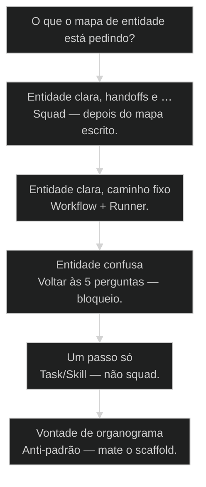
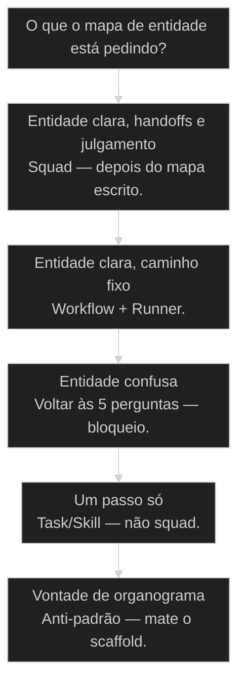

# Mapear entidades antes do Squad: 5 perguntas + ciclo de vida

← [[30-runner-executavel-deterministico|Runner: o executável determinístico do Workflow]] · ↑ [[modulos/Módulo 5 - Arquitetura AIOX|M5]] · ⌂ [[Cursos/AIOX Advanced/README|Curso]] · → [[52-workflow-vs-comando-manual|Workflow pronto vs comando manual: bicicleta com rodinha]]

## Mapa desta aula

Decisão-chave da aula — O que o mapa de entidade está pedindo?

> Leia o diagrama antes do texto longo. Depois volte e confira.

> Cinco perguntas antes de criar squad — ciclo de vida primeiro, pasta de agentes depois. Sem objeto, organograma é fantasia.

**Objetivos de aprendizagem:**
- Recitar as 5 perguntas de entidade e o que cada resposta trava no design do processo. _(remember)_
- Explicar por que ciclo de vida (nasce→vive→morre) vem antes de qualquer agent.md. _(understand)_
- Aplicar as 5 perguntas e desenhar o ciclo de vida de um domínio real em uma página. _(apply)_
- Decidir se o domínio pede Squad, [[Runner]]/Workflow ou só Task/Skill — com evidência. _(evaluate)_

---

## O que você consegue no fim desta aula

*G · Destino*

Destino claro antes de qualquer pasta de agentes.

Ao final desta aula você vai conseguir três coisas concretas:

1. Responder as **5 perguntas** de entidade sem colar template genérico.
2. Desenhar o ciclo **nasce → estados → morre** com evidência por transição.
3. Escolher o **menor primitivo** (task / runner / squad) com uma frase de porquê.

Se você sair daqui ainda abrindo squad-creator porque "o domínio parece grande",
a aula falhou. Tamanho de organograma não é prova de processo.

- **Objetivos da aula** (Aplicar as 5 perguntas; Mapear ciclo de vida com evidência; Escolher task vs runner vs squad)
- **Resultado tangível**: Uma página: entidade nomeada, estados, eventos, evidências, primitivo escolhido.
- **Não é o destino**: Criar seis agentes com nome bonito e zero objeto. Isso é fantasia.

---

## Organograma sem objeto

*P · Onde você está*

Empatia com o vício de criar agentes antes de nomear o que flui.

Cara, squad sem mapa de entidade é fantasia de organograma. Você cria agentes
bonitos que não sabem o que **nasce**, o que **muda** e o que **morre** no processo.

Eu vejo o filme toda semana: "preciso de um squad de onboarding". Pergunto: qual
é a entidade? Silêncio. "O cliente… o lead… o ticket…". Três nomes pra coisa
nenhuma. O squad-creator industrializa a confusão com pastas e YAML.

Se você está aqui, provavelmente já sentiu um destes sintomas:

- Agentes discutem status que ninguém definiu.
- Handoff "PO → Dev" sem saber o que está sendo transferido.
- Estados inventados no meio do fluxo ("meio pronto", "quase ok").
- Squad com 8 papéis pra um ETL linear que era um runner.

Beleza. A partir daqui a gente troca cargo por **objeto com ciclo de vida**.

**Onde a maioria trava**
- Squad-creator antes de nomear a entidade
- Estados de feeling sem evidência
- Escalar primitivo por vaidade de arquitetura

**Onde o operador vai**
- 5 perguntas escritas antes do creator
- Transição com prova (artefato, check, evento)
- Menor primitivo que carrega o processo

---

## Entidade primeiro, squad depois

*S · Rota*

O squad orbitam o objeto. Sem objeto, orbitam o vazio.

Prior-art: [[Squad|o que é um squad]] (23) e entidade como unidade (24) plantaram a ideia.
Anatomia de squad (33) mostra a pasta. Esta aula é o **portão**: você não passa
pro creator sem mapa.

Sequência canônica:

nomear entidade → 5 perguntas → ciclo de vida com evidência → escolher primitivo
→ só então scaffold de squad (se merecer).

Metáfora: antes de montar o time de UCI, você define o que é o **paciente** e
quais monitores provam cada estado. Sem isso, você tem jaleco e zero protocolo.

- **5**: perguntas obrigatórias
- **1**: ciclo de vida por entidade
- **3**: primitivos (task/runner/squad)

- **status**: entity-first
- **meta**: perguntas=5
- **meta**: ciclo=nasce-vive-morre
- **ready**: ready to map

**Legenda de cores**

O que cada cor sinaliza nesta aula

- **Entidade** (signal): o objeto que atravessa o processo
- **Ciclo** (insight): nasce, estados, eventos de morte
- **Evidência** (bench): prova de cada transição
- **Primitivo** (action): task, runner ou squad
- **Fantasia** (pain): agentes sem objeto nomeado

**Como ler esta aula**

1. **5 perguntas**: O checklist que trava o design.
2. **Ciclo**: Nasce, vive, morre com prova.
3. **Primitivo**: Task vs runner vs squad.
4. **Prática**: Uma página do teu domínio.

---

## As 5 perguntas que vêm antes do squad

Se faltar uma, o squad vai inventar a resposta no escuro.

Responda por escrito — uma linha cada, sem poesia:

1. **Que entidade é essa?** Nome singular, concreto. Não "o negócio do cliente".
2. **Quem cria?** Pessoa, sistema, evento. Sem criador, não há nascimento.
3. **Que estados vive?** Lista finita. "Meio pronto" não é estado — é preguiça.
4. **Que eventos matam ou arquivam?** Cancelamento, expiração, merge, delete.
5. **Que evidência prova cada transição?** Artefato, check, log, assinatura.

Então o que acontece se você pula a 5? O agente marca "done" no feeling.
QA não tem o que inspecionar. O board mente com cor verde.

Olha só: as 5 perguntas não são burocracia AIOX pra impressionar. São o
mínimo pra ninguém inventar ontologia no meio do prompt.

**As 5 na ordem**

1. **Nome**: Entidade singular e concreta.
2. **Criador**: Quem ou o que faz nascer.
3. **Estados**: Lista finita de vida.
4. **Morte**: Eventos que encerram ou arquivam.
5. **Prova**: Evidência por transição.

> **Lei da entidade**: Se ninguém no time consegue desenhar o ciclo de vida em um quadro, você ainda não tem processo — tem desejo de squad.

- **Entidade** != **Tela**: Tela é projeção; entidade é o objeto que persiste e muda de estado.
- **Estado** != **Sentimento**: 'Quase' e 'talvez' não são estados — estados são observáveis.

---

## Ciclo de vida e o menor primitivo

Mapa pronto. Agora não escale de cargo o que é um script.

Ciclo de vida canônico (adapte, não complique):

**nasce** → estados intermediários com dono de transição → **morre/arquiva**

Cada seta: evento + ator + evidência. Sem seta órfã. Sem estado sem saída
(a menos que seja terminal de propósito).

Escolha de primitivo depois do mapa:

- **Task / Skill** — um passo ou transformação A→B sem handoff de papéis.
- **Runner / Workflow** — caminho fixo, pouca variação, julgamento mínimo.
- **Squad** — handoffs, papéis com autoridade exclusiva, julgamento recorrente.

Cara, não escale de cargo o que é um script. Squad quando o domínio **precisa**
de órbitas. Runner quando o caminho é trilho. Task quando é um corte limpo.

- **1. Task/Skill**: Um passo, um contrato, sem teatro de time. [mínimo]
- **2. Runner/Workflow**: Sequência determinística com gates mecânicos. [trilho]
- **3. Squad**: Handoffs + julgamento + órbitas exclusivas. [time]

- **Entidade**: Objeto de domínio que nasce, muda de estado e morre/arquiva.
- **Transição**: Mudança de estado com evento, ator e evidência.
- **Handoff**: Passagem de responsabilidade entre órbitas com contrato.
- **Menor primitivo**: A menor peça AIOX que carrega o processo sem vaidade.

> **Prior-art**: Aula 24 trata entidade como unidade de processo. Aula 23/33 mostram o que é e como se anatomiza um squad. Aqui o portão: mapa antes do scaffold.

---

## Caso: 'squad de pedidos' que era três estados

Quando o mapa encolhe o organograma.

Time queria squad: Intake, Pricing, Fulfillment, Support, Analytics — cinco
agentes. As 5 perguntas no quadro:

1. Entidade: **Pedido**
2. Cria: checkout (sistema) após pagamento autorizado
3. Estados: `pago` → `separando` → `enviado` → `entregue` | `cancelado`
4. Morte: cancelamento até `separando`; depois só devolução (outra entidade)
5. Evidência: payment_id, packing_list, tracking, POD

Handoffs reais: sistema→ops (separar), ops→carrier (enviar). Analytics era
relatório batch — **runner noturno**, não agente de squad. Support era fila
de outra entidade (Ticket).

Resultado: 1 workflow de Pedido + 1 runner de métricas + skill de cancelamento.
Zero squad de cinco fantasmas. Três meses depois, o time criou squad de
**Devolução** — porque aí sim havia julgamento, multi-papel e recorrência.

Então o que acontece sem mapa? Você paga manutenção de cultura de cinco pastas
pra um processo que cabia num trilho.

**Pedido: ciclo mínimo**

1. **Pago**: payment_id
2. **Separando**: packing_list
3. **Enviado**: tracking
4. **Entregue**: POD
5. **Cancelado**: motivo+até estado N

**Fantasia**
- Cinco agentes por departamento
- Estado 'em análise' eterno
- Analytics como persona de squad

**Mapa**
- Estados observáveis do Pedido
- Evidência por seta
- Runner onde não há julgamento

---

## Squad, runner ou task?

O mapa manda. O ego desce.

**Árvore de decisão**
_Handoff e julgamento puxam squad; trilho puxa runner._

- **Entidade clara, handoffs e julgamento** — Vários papéis com autoridade e estados com dono.
  → _Squad — depois do mapa escrito._
  Ex.: Pedido→aprovação creditícia→fulfillment com exceções.
- **Entidade clara, caminho fixo** — Pouca variação, julgamento mínimo.
  → _Workflow + Runner._
  Ex.: ETL noturno; publicar release notes template.
- **Entidade confusa** — Ninguém nomeia o objeto em uma palavra.
  → _Voltar às 5 perguntas — bloqueio._
  Ex.: 'O negócio do cliente' / 'a demanda'.
- **Um passo só** — Transformação A→B sem ciclo rico.
  → _Task/Skill — não squad._
  Ex.: Renomear campos; validar schema.
- **Vontade de organograma** — Cargo bonito, processo ralo.
  → _Anti-padrão — mate o scaffold._
  Ex.: Squad de 'estratégia' sem entidade.

**Gate:** Você consegue apontar a entidade, 3 estados e 1 evidência por transição? — _Se não aponta, não chama squad-creator._

#### Mapa primeiro
Antes de qualquer creator.
1. **5 perguntas: Escritas, sem template vazio.
2. **Ciclo de vida: Nasce, estados, morre.
3. **Evidências: Uma prova por seta.
4. **Só então primitivo: Task/runner/squad.

#### Rota squad
Quando o mapa exige órbitas.
1. **Handoffs: Liste papéis por transição.
2. **Autoridade: Uma órbita por decisão.
3. **Creator: Scaffold com mapa colado.
4. **QG: Validar que agentes batem no ciclo.

#### Rota não-squad
Menor primitivo.
1. **Cortar: Um passo = task/skill.
2. **Trilho: Sequência fixa = runner.
3. **Documentar: Por que não é squad.
4. **Revisitar: Se handoff nascer, reabra o mapa.

---

## Uma página do teu domínio (15 min)

Processo real do negócio — não exemplo de tutorial.

Vamos lá. Sem isso a aula vira podcast. Escolhe um processo que dói ou que você
"ia criar squad pra resolver".

- 1. **Escolha**: Um processo real do teu negócio ou produto.
- 2. **Responda**: As 5 perguntas por escrito (uma linha cada).
- 3. **Desenhe**: Ciclo nasce→estados→morre com evidência em cada seta.
- 4. **Decida**: Task, runner ou squad — com uma frase de porquê.
- 5. **Mate um cargo**: Se sobrou agente sem transição dona, risque.

**Funcionou se:**

- Entidade tem nome singular concreto (não 'demanda genérica').
- Há estados finitos e pelo menos um evento de morte/arquivo.
- Cada transição nomeada tem evidência.
- A escolha de primitivo cita handoff/julgamento ou a ausência deles.

---

## Glossário sem jargão de vaidade

- **Entidade**: Objeto de domínio com identidade, estados e fim de vida observáveis.
- **Ciclo de vida**: Mapa nasce → estados → morre/arquiva com eventos e evidências.
- **As 5 perguntas**: Checklist: o quê, quem cria, estados, morte, evidência por transição.
- **Handoff**: Passagem de responsabilidade entre papéis com contrato explícito.
- **Menor primitivo**: Task, runner ou squad — a menor peça que carrega o processo.
- **Organograma fantasia**: Coleção de agentes sem entidade e sem ciclo de vida.

---

## Portão da aula

Você passou quando a entidade está mapeada com ciclo de vida **antes** de qualquer
agent.md novo. Squad sem objeto é teatro. Mapa é engenharia.

A IA é a seta. O X é seu — inclusive recusar o creator até o quadro estar claro.

> **Próximo na trilha**: Com o mapa na mão, a aula 52 (workflow vs comando manual) ajuda a escolher o modo de execução: rodinha, pedal ou estrada.

> **GATE-MODULE (auto)**: GPS Goal/Position/Steps presentes · caso + do/dont · decisão · prática com evidência · glossário. Alvo DL ≥70 atingido na construção enrich-W2.

***

---

## Navegação

← [[30-runner-executavel-deterministico|Runner: o executável determinístico do Workflow]] · ↑ [[modulos/Módulo 5 - Arquitetura AIOX|M5]] · ⌂ [[Cursos/AIOX Advanced/README|Curso]] · → [[52-workflow-vs-comando-manual|Workflow pronto vs comando manual: bicicleta com rodinha]]
