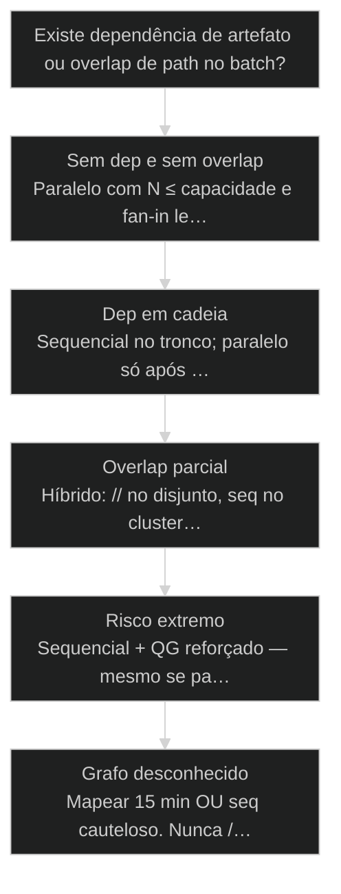
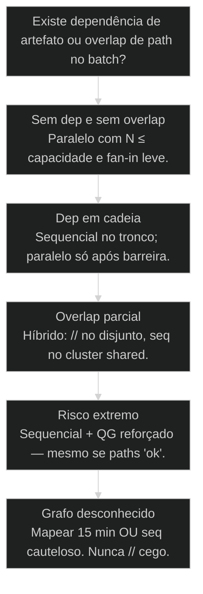

# Quando paralelizar vs sequencial: decisão antes do speedup

← [[58-ralph-paralelizacao|Ralph: paralelização de múltiplos agentes]] · ↑ [[modulos/Módulo 10 - Escala e Tokens|M10]] · ⌂ [[Cursos/AIOX Advanced/README|Curso]] · → [[60-routing-modelos|Routing de modelos: Codex para QA, Gemini para pesquisa, Claude para o resto]]

## Mapa desta aula

Decisão-chave da aula — Existe dependência de artefato ou overlap de path no batch?

> Leia o diagrama antes do texto longo. Depois volte e confira.

> Dependência e overlap matam o ganho — desenhe o grafo antes de ligar o turbo.

**Objetivos de aprendizagem:**
- Avaliar cenários e escolher paralelo, sequencial ou híbrido com justificativa verificável. _(evaluate)_
- Identificar dependências e overlaps que destroem ganho paralelo. _(analyze)_
- Estimar e medir wall-clock real incluindo fan-in e retrabalho. _(apply)_
- Aplicar heurísticas de capacidade (N, rate limit, criticidade) na escolha. _(apply)_

---

## O que você consegue no fim desta aula

*G · Destino*

Destino claro antes de qualquer flag --parallel.

Ao final desta aula você vai conseguir três coisas concretas:

1. Olhar um conjunto de tasks e dizer **//, seq ou híbrido** em uma frase verificável.
2. Apontar a **aresta** (dep ou overlap) que mata o speedup.
3. Medir se o paralelo **realmente** reduziu wall-clock depois do fan-in.

Se você sair daqui com "sempre paralelo porque IA é barata", a aula falhou.
Tokens baratos não pagam merge caro.

- **Objetivos da aula** (Decidir // vs seq com grafo; Nomear o que mata speedup; Medir wall-clock pós fan-in)
- **Resultado tangível**: Tabela de 5 cenários do teu projeto com decisão e motivo.
- **Não é o destino**: Sempre maximizar N. Isso é vaidade de dashboard de agentes.

---

## O erro do turbo no engarrafamento

*P · Onde você está*

Empatia com quem mediu só a largada.

Cara, tem gente que mede "tempo até o primeiro agente terminar" e chama
de speedup. Engraçado. O relógio que importa é **quando o batch inteiro
está mergeado, com QG, sem AC sumido**.

Sequencial parece lento. Paralelo com dep escondida parece rápido até o
fan-in virar sessão de terapia de git.

Se você está aqui, já viveu:

- "Rodamos em // e o dia inteiro foi resolver conflito."
- Story B usou API que a story A ainda não tinha criado.
- Rate limit 429 comeu o N=6 e virou N=2 com drama.

A partir daqui: **grafo primeiro, turbo depois, métrica no fim**.

**Onde a maioria trava**
- Paralelo por default de ego
- Ignorar dep de artefato
- Medir só tempo de geração

**Onde o operador vai**
- Decisão pelo grafo
- Serializar o tronco crítico
- Wall-clock = work + fan-in + fix

---

## Três saídas, não duas

*S · Rota*

Paralelo, sequencial e o híbrido que paga as contas.

Esquece o binário. Quase todo épico real é **híbrido**:

- **Paralelo** onde paths e deps são disjuntos.
- **Sequencial** no tronco (schema → API → UI, ou shared config).
- **Barreira** entre waves/batches.

Quatro inputs da decisão:

1. **Deps lógicas** — B consome artefato de A?
2. **Overlap físico** — mesmos paths?
3. **Risco** — blast radius se der errado em paralelo?
4. **Capacidade** — N × modelo × tier de rate limit?

Aula 58 te deu o como do Ralph. Aula 61 te dá waves de épico. Esta aula
é o **juiz** que escolhe o modo antes do spawn.

Frase de ouro pro stand-up: "paralelo onde o grafo é floresta; sequencial
onde é tronco; barreira onde o artefato precisa existir de verdade."
Se a frase do time for só "vamos // pra ir mais rápido", ainda não tem juiz.

- **3**: modos (// · seq · híbrido)
- **4**: inputs da decisão
- **1**: métrica: wall-clock real

- **status**: paralelo-vs-sequencial
- **meta**: modos=//|seq|hibrido
- **meta**: metrica=wall-clock+fan-in
- **ready**: ready to judge

**Legenda de cores**

O que cada cor sinaliza nesta aula

- **Dep** (signal): artefato A antes de B
- **Overlap** (insight): mesmo path no batch
- **Híbrido** (bench): paralelo + tronco serial
- **Medir** (action): fim a fim com merge
- **Speedup falso** (pain): ignora fan-in e 429

**Como ler esta aula**

1. **Inputs**: Deps, paths, risco, N.
2. **Heurísticas**: Regras que cabem no bolso.
3. **Casos**: Cinco cenários clássicos.
4. **Medir**: Wall-clock de verdade.

---

## Heurísticas de bolso (antes do spawn)

Regras simples que evitam drama de sexta.

Cola na cabeça:

1. **Dep de artefato → seq** (ou barreira entre batches). Nunca "// e torce".
2. **Overlap de path → seq no cluster** (o resto pode //).
3. **Disjunto + risco baixo → //** com N ≤ capacidade.
4. **Criticidade alta (auth, billing, migração) → prefira seq** mesmo se
   paths "parecem" disjuntos — blast radius manda.
5. **N sobe só se a métrica anterior melhorou.** Sem medida, N=ego.

Estimativa rápida de wall-clock:

- Seq: soma dos tempos.
- // ideal: max(tempos) + fan-in.
- // real: max(tempos) + fan-in + P(conflito)×custo_fix + throttle.

Se P(conflito) é alta, o "max" vira piada e o seq ganha no relógio real.

Unified-branch (1 PR) **força seq** de propósito: troca paralelismo por
revisão atômica. É escolha válida — não é falha.

Ordem de checagem que evita drama (30–90 segundos):

1. Existe artefato A que B consome? → seq/barreira.
2. Paths se cruzam? → seq no cluster.
3. Risco legal/money/auth? → seq + humano.
4. N cabe no tier sem throttle crônico? → senão reduza N.
5. Só então // no resto.

Se alguém pular pra 5, você não tem scheduling — tem esperança.

**Atalho de decisão**

- **Dep A→B**: Sequencial ou wave com barreira
- **Paths disjuntos**: Paralelo com N calibrado
- **Shared config**: Serializar o cluster
- **Risco regulatório**: Seq + QG humano no tronco

> **Lei do wall-clock**: Speedup só existe depois do fan-in limpo. Tudo antes é preview de marketing.

- **Tempo do agent mais rápido** != **Tempo do batch done**: O relógio para no merge com QG.
- **Mais paralelo** != **Mais valor**: Valor é throughput líquido de mudança correta.

---

## Caso: cinco cenários, cinco vereditos

Tabela mental pra não reinventar a roda a cada épico.

1. **Hotfix + copy** (2 stories, paths disjuntos, urgência): // ou até
   seq simples — N pequeno; não invente Ralph.
2. **Dez telas isoladas** (mesmo design system, pastas distintas): // com
   partição; fan-in leve.
3. **Schema → API → UI**: seq no tronco; UI pode // depois da barreira API.
4. **Migração + feature na mesma tabela**: seq. Ponto. Risco > speedup.
5. **Docs + código sem overlap**: // agressivo; QG diferente por tipo.

Time que rodou o #3 em // "pra ganhar tempo": UI gerou mocks que a API
nunca cumpriu. Retrabalho > seq honesto.

Então o que acontece se você trata todo batch como o #2? Você aplica a
ferramenta errada no tronco crítico.

Planilha mental de pós-mortem (5 minutos no fim do batch):

- Wall-clock planejado vs real
- Tempo em conflito/retrabalho
- 429 / fila de rate limit
- Decisão: na próxima, mais //, mais seq, ou N menor?

Sem esse fechamento, o time repete o mesmo erro com confiança renovada.

**Loop de decisão**

1. **Listar**: Tasks + paths + deps
2. **Marcar**: Arestas de risco
3. **Escolher**: // / seq / híbrido
4. **Executar**: Com N e gates
5. **Medir**: Wall-clock real

---

## Router: //, seq ou híbrido?

Árvore curta com saída acionável.

**Árvore de decisão**
_Se a resposta for 'não sei', a resposta operacional é sequencial até mapear._

- **Sem dep e sem overlap** — Paths disjuntos, artefatos independentes.
  → _Paralelo com N ≤ capacidade e fan-in leve._
  Ex.: Docs + skill A + skill B em pastas distintas.
- **Dep em cadeia** — B/C precisam de A done.
  → _Sequencial no tronco; paralelo só após barreira._
  Ex.: Migration → types → UI.
- **Overlap parcial** — Subconjunto compartilha paths.
  → _Híbrido: // no disjunto, seq no cluster shared._
  Ex.: 3 features + 2 no mesmo package/config.
- **Risco extremo** — Auth, money, data loss, prod-only path.
  → _Sequencial + QG reforçado — mesmo se paths 'ok'._
  Ex.: Billing + tax calculation.
- **Grafo desconhecido** — Ninguém listou paths/deps.
  → _Mapear 15 min OU seq cauteloso. Nunca // cego._
  Ex.: Épico herdado sem file_scope.

**Gate:** Sua escolha cabe em uma frase com evidência (dep/path/risco/N)? — _Se a frase é só 'é mais rápido', ainda é achismo._

#### Rota paralelo
Quando o grafo é floresta.
1. **Confirmar: Disjunto + deps ok.
2. **N: Calibrar tier/modelo.
3. **Spawn: Estado + ownership.
4. **Medir: Fim a fim com fan-in.

#### Rota sequencial
Quando o tronco manda.
1. **Ordenar: Topo no grafo de deps.
2. **Barreira: Done real antes do próximo.
3. **QG: No ponto de maior risco.
4. **Só então //: Folhas disjuntas.

#### Rota híbrida
O modo mais comum em épico real.
1. **Clusters: Shared vs free.
2. **Seq shared: Um writer por path.
3. **// free: N no disjunto.
4. **Barreiras: Entre waves/batches.

---

## Cinco vereditos no teu backlog (15 min)

Tabela escrita — decisão + evidência.

Pega o backlog real. Sem backlog, inventa 5 tasks do último mês com honestidade.

- 1. **Liste**: 5 pares ou grupos de tasks que alguém rodaria juntas.
- 2. **Arestas**: Para cada: dep? overlap? risco? N sugerido?
- 3. **Veredito**: //, seq ou híbrido — uma frase com evidência.
- 4. **Estimativa**: Wall-clock seq vs // real (inclua fan-in).
- 5. **Retrospecto**: Se já rodou um deles: o que a métrica real mostrou?

**Funcionou se:**

- 5 vereditos com evidência (não só preferência).
- Pelo menos 1 caso serializado por dep ou overlap.
- Estimativa inclui fan-in/retrabalho, não só geração.

---

## Glossário sem jargão de vaidade

- **Wall-clock real**: Tempo até batch mergeado com QG — inclui fan-in, conflito e throttle.
- **Speedup falso**: Ganho medido só na geração, ignorando reintegração e retrabalho.
- **Tronco**: Cadeia de deps críticas que deve permanecer sequencial.
- **Híbrido**: Modo com clusters paralelos e clusters serializados no mesmo plano.
- **Barreira**: Ponto em que o batch espera done real antes de liberar o próximo grupo.
- **Cluster shared**: Subconjunto de tasks com overlap de path que deve serializar juntas.
- **Capacidade N**: Limite de workers paralelos calibrado por tier, modelo e rate limit — não por ego.

---

## Portão da aula

Você passou quando escolhe //, seq ou híbrido com grafo e métrica — não
com torcida. Dependência mata speedup. Overlap mata paz. Capacidade mata
a fantasia do N=8.

A IA é a seta. O X é seu — inclusive o **ritmo** em que as setas disparam.
Grafo primeiro. Turbo depois. Wall-clock no fim — ou é só história.

> **Próximo na trilha**: Aula 60 muda o eixo: não só quantos agentes, mas **qual modelo** em cada papel — routing de modelos por fitness.

> **GATE-MODULE (auto)**: GPS Goal/Position/Steps presentes · caso + do/dont · decisão · prática com evidência · glossário. Alvo DL ≥70 atingido na construção enrich-W3.

***

---

## Navegação

← [[58-ralph-paralelizacao|Ralph: paralelização de múltiplos agentes]] · ↑ [[modulos/Módulo 10 - Escala e Tokens|M10]] · ⌂ [[Cursos/AIOX Advanced/README|Curso]] · → [[60-routing-modelos|Routing de modelos: Codex para QA, Gemini para pesquisa, Claude para o resto]]
