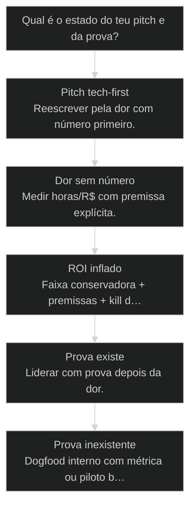
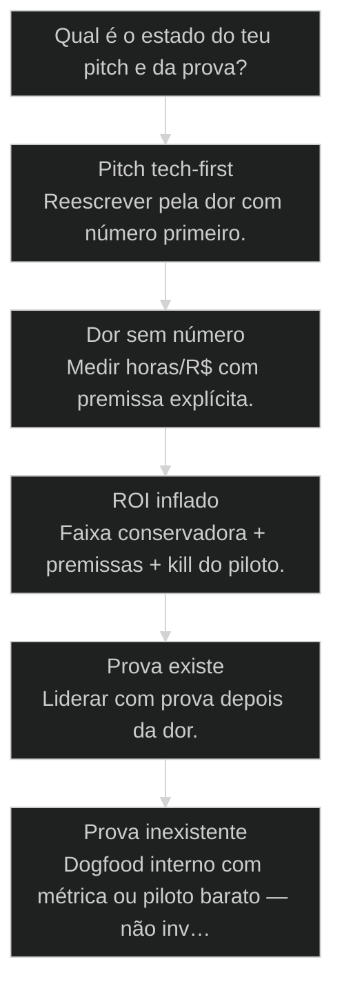

# Vender pela DOR e ROI, não pela tecnologia

← [[63-distribuicao-vs-produto|Distribuição > Produto (10/90)]] · ↑ [[modulos/Módulo 11 - Produtivização|M11]] · ⌂ [[Cursos/AIOX Advanced/README|Curso]] · → [[65-tres-caminhos-de-produto|Três caminhos de produto: Consultoria → App Web → SaaS]]

## Mapa desta aula

Decisão-chave da aula — Qual é o estado do teu pitch e da prova?

> Leia o diagrama antes do texto longo. Depois volte e confira.

> Ninguém acorda querendo multi-agent orchestration. Acorda querendo parar de perder R$ e tempo. DOR vende. Stack é meio.

**Objetivos de aprendizagem:**
- Reescrever um pitch focado em dor e ROI mensurável em ≤120 palavras. _(apply)_
- Quantificar economia esperada em R$ ou horas com premissas explícitas. _(apply)_
- Eliminar jargão técnico que não move compra e justificar o que resta. _(evaluate)_
- Montar a sequência dor → mecanismo → ROI → prova em um caso real. _(apply)_

---

## O que você consegue no fim desta aula

*G · Destino*

Destino claro antes de qualquer demo de stack.

Ao final desta aula você vai conseguir três coisas concretas:

1. Abrir um pitch pela **dor com número** — não pelo modelo de linguagem.
2. Calcular um **ROI conservador** com premissas que o comprador pode atacar.
3. Cortar jargão e deixar só o **mecanismo** que explica o delta.

Se você sair daqui ainda começando com "usamos multi-agent orchestration",
a aula falhou. Comprador compra alívio e retorno — não arquitetura.

- **Objetivos da aula** (Fórmula dor → mecanismo → ROI → prova; Quantificar em R$/horas; Pitch ≤120 palavras sem tech vanity)
- **Resultado tangível**: Pitch reescrito + tabela de premissas + 3 jargões mortos.
- **Não é o destino**: Prometer 10x em uma semana. Isso é o anti-objetivo.

---

## O pitch que se candidata a hobby

*P · Onde você está*

Empatia com o builder que se apaixonou pela stack.

Cara, eu vejo o mesmo pitch toda semana. Slide 1: logos de modelo. Slide 2:
diagrama de agentes. Slide 3: "revolucionário". Slide 4: preço. Em nenhum
momento o comprador viu o quanto está sangrando hoje.

Ninguém acorda querendo multi-agent orchestration. Acorda querendo parar de
perder R$ e tempo. DOR vende. Stack é meio.

Se você está aqui, provavelmente já sentiu:

- Demo técnica aplaudida e proposta que não fecha.
- "Está caótico" sem quantificar caos.
- ROI inflado que o CFO desmonta em 30 segundos.

Beleza. A partir daqui o pitch vira **economia de dor**, não catálogo de IA.

**Onde a maioria trava**
- Abrir com stack e logos de modelo
- Dor só com adjetivo
- ROI 10x sem premissa

**Onde o operador vai**
- Abrir com custo atual em R$/h
- Mecanismo em linguagem de negócio
- Faixa conservadora + prova

---

## A fórmula que fecha conversa

*S · Rota*

Quatro blocos. Nenhuma vaidade de engenharia.

Fórmula operacional — decora:

**Dor atual (custo) → mecanismo (como) → ROI (delta) → prova (caso).**

- **Dor**: o que custa hoje, em unidade que o comprador respeita.
- **Mecanismo**: como o sistema remove a dor (sem tour de arquitetura).
- **ROI**: delta conservador, com premissas abertas.
- **Prova**: caso, piloto ou proxy crível — não "clientes amam".

Prior-art: distribuição (63) te coloca na sala. Esta aula define **o que
você diz** quando a sala abre. Sem número, é teatro.

- **4**: blocos do pitch
- **1**: número de dor
- **0**: jargão sem função

- **status**: vender-pela-dor-e-roi
- **meta**: formula=dor>mecanismo>roi>prova
- **meta**: unidade=R$|horas
- **ready**: ready to rewrite

**Legenda de cores**

O que cada cor sinaliza nesta aula

- **Dor** (signal): custo atual mensurável
- **ROI** (insight): delta + premissas
- **Prova** (bench): caso com número
- **Pitch** (action): ≤120 palavras
- **Anti-pitch** (pain): feature dump e buzzword

**Como ler esta aula**

1. **Fórmula**: Quatro blocos na ordem certa.
2. **Anti-pitch**: O que matar no texto.
3. **Caso**: Antes/depois de um pitch real.
4. **Rota**: Reescrever e quantificar.

---

## Dor, mecanismo, ROI, prova — com rigor

Cada bloco tem regra. Sem regra, vira slide de evento.

**1. Dor (custo atual)**  
Transforme adjetivo em conta. "Caótico" vira: 12h/semana de triagem × R$80/h
× 4 = R$3.840/mês. Se não tem dado, use faixa e diga a premissa.

**2. Mecanismo (como)**  
Uma ou duas frases: o que o sistema faz no fluxo do comprador. "Consolida
três fontes e gera rascunho revisável em 20 min" — não "orquestra 12 agentes".

**3. ROI (delta)**  
Custo atual − custo novo − preço = delta. Use **conservador**. Mostre
premissas. CFO respeita humildade com número; detesta milagre.

**4. Prova**  
Caso com antes/depois, piloto pago, ou proxy forte (interno dogfood com
métrica). "Vários clientes" sem número é fumaça.

Então o que acontece se você inverte a ordem? O comprador gasta atenção em
stack e esquece a dor. Atenção é o recurso escasso — gaste no que fecha.

- **1. Dor**: Custo atual em R$ ou horas com premissa. [abrir]
- **2. Mecanismo + ROI**: Como remove a dor e qual o delta. [meio]
- **3. Prova**: Caso ou piloto que ancora a promessa. [fechar]

> **Lei do número atacável**: Todo número do pitch deve ser atacável pelo comprador. Se não tem premissa, não entre no texto.

---

## Anti-pitch: o que mata a compra

Lista de features, logos de modelo, buzzword sem métrica.

Mate sem piedade:

- Lista de features no lugar de outcome.
- Logos de LLM como se fossem certificado de valor.
- "IA generativa / multi-agent / RAG" sem ligação com a dor.
- ROI inflado ("10x em uma semana") sem premissa.
- Case sem número ("cliente satisfeito").
- Jargão interno do teu [[Squad|squad]] no material do comprador.

Técnica **pode** entrar — depois que a dor está clara, e só o suficiente pra
credibilidade. Se o jargão não reduz risco percebido, é vaidade.

Exercício mental: se apagar a palavra "IA" do pitch, ainda sobra valor? Se
não sobra, você estava vendendo moda — não resultado.

Template de corte em 3 passadas:
1. Grife tudo que é nome de modelo, framework ou padrão de engenharia.
2. Para cada grifo, pergunte: isso reduz risco de compra ou só me deixa orgulhoso?
3. O que sobrar vira no máximo **uma** linha de mecanismo — o resto morre.

**Corte de jargão**

- **Feature dump**: Substitua por 1 outcome
- **Logo de modelo**: Só se reduzir risco real
- **Buzzword**: Troque por verbo de negócio
- **ROI milagre**: Faixa conservadora + premissa

> **Teste do CFO cético**: Leia o pitch em voz alta e, a cada número, pergunte em voz do comprador: 'de onde saiu isso?'. Se você gagueja, a premissa ainda não está no texto.

- **Credibilidade técnica** != **Tour de stack**: Uma linha de mecanismo basta; 10 slides de arquitetura distraem.
- **Otimismo** != **Conservadorismo útil**: Promessa baixa com prova fecha mais que milagre sem base.

---

## Caso: do tech-first ao fechamento

Mesmo produto. Outra ordem. Outro resultado.

**Antes (tech-first):**  
"Plataforma multi-agente com Claude, RAG e pipeline ETL para operações de
conteúdo. 12 [[Agentes Orbitais|agentes orbitais]]. Integração com Notion e analytics."

Resultado: "interessante" e silêncio.

**Depois (dor → ROI):**  
"Seu time gasta ~8h/semana montando o relatório de performance (≈R$2.5k/mês
em custo interno). A gente consolida as três fontes e entrega rascunho
revisável em 20 minutos. Piloto de 30 dias: se não cortar pelo menos 50% do
tempo, você não renova. Cliente X saiu de 8h para 1h15."

Resultado: conversa de piloto com critério claro.

O produto quase não mudou. **A ordem da verdade** mudou.

**Reescrita do pitch**

1. **Dor**: 8h/semana · R$2.5k/mês
2. **Mecanismo**: Consolida + rascunho 20 min
3. **ROI**: ≥50% tempo no piloto
4. **Prova**: Cliente X: 8h → 1h15
5. **Risco baixo**: Não renovar se falhar

---

## O que fazer com o pitch agora?

Árvore curta pra não errar a reescrita.

**Árvore de decisão**
_Leia o texto em voz alta como se fosse o comprador cético._

- **Pitch tech-first** — Começa na stack ou em logos de modelo.
  → _Reescrever pela dor com número primeiro._
  Ex.: Usamos 12 agentes e Claude...
- **Dor sem número** — Só adjetivo (caótico, lento, manual).
  → _Medir horas/R$ com premissa explícita._
  Ex.: Está caótico o processo de content.
- **ROI inflado** — Promessa irreal sem premissas.
  → _Faixa conservadora + premissas + kill do piloto._
  Ex.: 10x em uma semana, garantido.
- **Prova existe** — Caso real com métrica.
  → _Liderar com prova depois da dor._
  Ex.: Cliente X economizou Y horas.
- **Prova inexistente** — Zero caso externo.
  → _Dogfood interno com métrica ou piloto barato — não inventar case._
  Ex.: Só landing e deck.

**Gate:** Você consegue dizer dor em R$/h, delta e uma prova (ou plano de prova) em 30 segundos? — _Se trava no jargão, ainda não está pronto pra sala._

#### Rota pitch de 1 página
Dor → mecanismo → ROI → prova.
1. **Dor: Uma conta.
2. **Custo: Unidade mensal.
3. **Delta: Conservador.
4. **Prova: Caso ou piloto.

#### Rota corte de jargão
Menos moda, mais compra.
1. **Grifar tech: Todas as palavras de stack.
2. **Apagar: O que não reduz risco.
3. **Substituir: Outcome e verbo de negócio.
4. **Testar: Ler sem 'IA' — ainda vende?

#### Rota quantificar
Quando falta número.
1. **Entrevistar: Quanto tempo/custo hoje?
2. **Faixa: Baixa–média–alta.
3. **Premissa: Escrita no pitch.
4. **Piloto: Medir no cliente real.

---

## Reescreva o pitch (20 min)

Texto antigo e texto novo lado a lado.

Vamos lá. Sem reescrita, a fórmula vira tatuagem. Cronometra vinte minutos.

- 1. **Pitch velho**: Cole o atual (ou grave 60s de como você fala hoje).
- 2. **Números**: 3 métricas de dor (horas ou R$) com premissas.
- 3. **Corte**: Liste e mate 5 jargões que não movem compra.
- 4. **Pitch novo**: ≤120 palavras na ordem dor → mecanismo → ROI → prova.
- 5. **Ataque**: Escreva a pergunta cética do CFO e sua resposta em 2 linhas.

**Funcionou se:**

- Pitch novo abre com dor numerada e fecha com prova ou plano de prova.
- Há premissas de ROI explícitas (não milagre).
- Pelo menos 5 jargões foram cortados ou justificados.

---

## Glossário sem pitch-washing

- **Dor**: Custo atual do status quo em unidade que o comprador respeita (R$, horas, risco).
- **ROI**: Delta entre custo atual e novo (inclui preço), com premissas abertas.
- **Mecanismo**: Como o sistema remove a dor, em linguagem de fluxo de negócio.
- **Anti-pitch**: Texto tech-first, feature dump ou ROI milagre que não move compra.

---

## Portão da aula

Você passou quando o pitch tem dor, número e prova — e a tecnologia só aparece
como meio. Stack impressiona engenheiro. Economia de dor fecha contrato.

A IA é a seta. O X é seu — inclusive **o que você escolhe dizer primeiro**.

> **Próximo na trilha**: Com a oferta clara, a aula dos três caminhos de produto (65) força a pista: consultoria, app web ou SaaS — um por vez.

> **GATE-MODULE (auto)**: GPS Goal/Position/Steps presentes · caso + do/dont · decisão · prática com evidência · glossário. Alvo DL ≥70 atingido na construção enrich-W4.

***

---

## Navegação

← [[63-distribuicao-vs-produto|Distribuição > Produto (10/90)]] · ↑ [[modulos/Módulo 11 - Produtivização|M11]] · ⌂ [[Cursos/AIOX Advanced/README|Curso]] · → [[65-tres-caminhos-de-produto|Três caminhos de produto: Consultoria → App Web → SaaS]]
