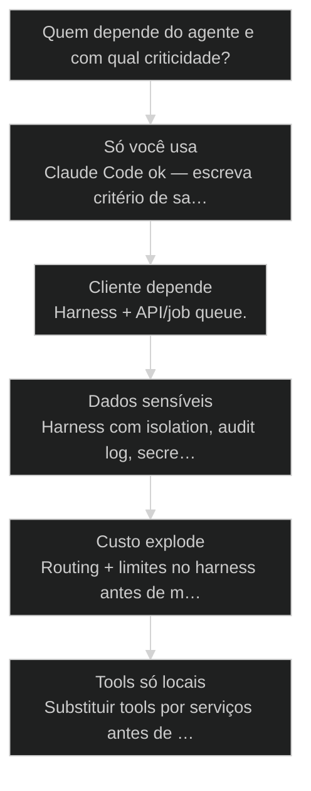
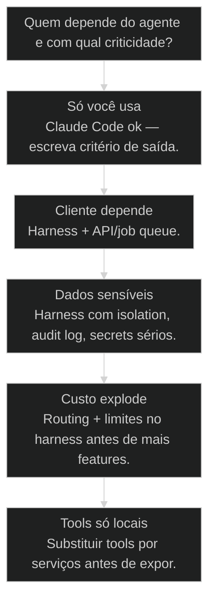

# Harness: ambiente de execução do agente fora do Claude Code

← [[66-tres-estagios-de-monetizacao|Três estágios de monetização: interno → cliente → produto]] · ↑ [[modulos/Módulo 11 - Produtivização|M11]] · ⌂ [[Cursos/AIOX Advanced/README|Curso]] · → [[68-squad-fora-do-claude-code|Extrair Squad do Claude Code para API própria]]

## Mapa desta aula

Decisão-chave da aula — Quem depende do agente e com qual criticidade?

> Leia o diagrama antes do texto longo. Depois volte e confira.

> Claude Code é laboratório de elite. Produção pede harness: runtime, filas, segredos, observabilidade, limites de tool e billing.

**Objetivos de aprendizagem:**
- Definir o que é harness de execução de agente em linguagem operacional. _(understand)_
- Identificar sinais de que o Claude Code deixou de bastar para o caso. _(analyze)_
- Esboçar arquitetura mínima de harness (5 caixas) para um caso real. _(apply)_
- Listar riscos (custo, secrets, tools, obs) se o harness for ignorado. _(evaluate)_

---

## O que você consegue no fim desta aula

*G · Destino*

Destino claro antes de qualquer rewrite de plataforma.

Ao final desta aula você vai conseguir três coisas concretas:

1. Explicar **harness** sem virar whitepaper de infra.
2. Decidir se o teu caso ainda é **lab no Claude Code** ou já exige runtime.
3. Desenhar as **5 caixas mínimas** do harness pro teu agente/[[Squad|squad]].

Se você sair daqui achando que "colar o prompt numa rota" é produção, a aula
falhou. Demo com IDE aberta **não é produto**.

- **Objetivos da aula** (Definir harness vs lab; Sinais de saída do Claude Code; Esboço mínimo de 5 caixas)
- **Resultado tangível**: Diagrama: runtime · auth · tools · logs · budget + critério de saída do CC.
- **Não é o destino**: Reescrever a AWS na primeira semana. Isso é o anti-objetivo.

---

## A demo que morre quando a IDE fecha

*P · Onde você está*

Empatia com o operador que confundiu laboratório com produção.

Cara, Claude Code é o melhor laboratório que a gente já teve. Personas, skills,
gates, contexto rico. O problema começa quando o valor do cliente **só existe
enquanto a tua sessão está aberta**.

Aí vem o pedido: "roda 24/7", "meu time precisa clicar", "SLA", "dado sensível",
"quanto custa por job?". E o lab não responde — porque lab não é harness.

Se você está aqui, provavelmente já sentiu:

- Bot "de suporte" que só funciona no teu notebook.
- Secrets no `.env` local e fé.
- Loop de tokens sem teto e fatura surpresa.
- Zero log de por que o agente errou na sexta à noite.

Beleza. A partir daqui a gente separa **lab** de **ambiente de execução**.

**Onde a maioria trava**
- Tratar Claude Code como produção
- Tools só na máquina local
- Sem budget cap nem logs

**Onde o operador vai**
- Critério explícito de saída do lab
- Tools como serviços
- Runtime + fila + obs + limites

---

## O que é harness (definição de operador)

*S · Rota*

Ambiente que hospeda o agente com políticas — não chat interativo.

**Harness** é o ambiente de execução que hospeda o agente (ou squad) **fora**
do chat interativo: runtime, autenticação, tools permitidas, filas, segredos,
telemetria, limites de custo e política de falha.

Claude Code continua sendo o lugar de **forjar e dogfood**. Harness é o lugar
de **servir**. Confundir os dois é como confundir bancada de laboratório com
linha de produção.

Prior-art: estágios de monetização (66) te dizem quando alguém depende do
valor. Esta aula te diz **onde** esse valor precisa morar tecnicamente.

- **5**: caixas mínimas
- **1**: critério de saída
- **0**: fé como observabilidade

- **status**: harness-ambiente-execucao
- **meta**: lab=claude-code
- **meta**: prod=harness
- **ready**: ready to design

**Legenda de cores**

O que cada cor sinaliza nesta aula

- **Harness** (signal): runtime com políticas
- **Sinais** (insight): quando sair do CC
- **Mínimo** (bench): 5 caixas
- **Esboço** (action): pro teu caso
- **Demo** (pain): IDE = SPOF

**Como ler esta aula**

1. **Definição**: Harness vs lab.
2. **Sinais**: Quando o CC deixa de bastar.
3. **Caso**: Do chat ao job com fila.
4. **Rota**: Esboçar as 5 caixas.

---

## Arquitetura mínima: cinco caixas, zero teatro

Se falta uma, ainda é demo reforçada.

Desenha e decora:

1. **Runtime** — processo/worker que executa o agente sem IDE.  
2. **Auth & secrets** — identidade do chamador e segredos fora do laptop.  
3. **Tools** — capacidades como serviços (APIs), não arquivos no Desktop.  
4. **Logs / observabilidade** — traces, prompts/respostas redacted, erros.  
5. **Budget & limites** — teto de tokens, timeout, retries, kill switch.

Opcional cedo, obrigatório cedo demais pra muitos: fila/job queue, multi-tenant
isolation, webhooks de status. Entre no mínimo primeiro.

Então o que acontece se você só expõe um endpoint que "chama o LLM"? Você tem
um proxy — não um harness. Falta política, falta memória de falha, falta teto.

- **1. Entrada**: Auth + contrato de request/job. [borda]
- **2. Execução**: Runtime + tools + limites. [núcleo]
- **3. Saída**: Resultado + logs + billing signal. [prova]

> **Lei do SPOF humano**: Se o valor some quando você fecha o laptop, o harness ainda não existe — existe dependência de você.

- **Harness**: Ambiente de execução com políticas, tools e telemetria fora do chat interativo.
- **Runtime**: Processo que executa o agente de forma não-interativa (worker/service).
- **Budget cap**: Teto de custo/tokens/tempo por job ou tenant.
- **Kill switch**: Mecanismo para parar execuções em massa com segurança.

---

## Sinais de saída do Claude Code

Não é preconceito contra o lab. É critério de promoção.

Sinais fortes de que o lab não basta:

- **Cliente depende** — SLA, uptime, horário que você dorme.  
- **Multi-user** — mais de um operador/cliente no mesmo fluxo.  
- **Dados sensíveis** — compliance, isolamento, auditoria.  
- **Custo imprevisível** — loops, jobs longos, sem caps.  
- **Tools locais** — MCP/arquivos que só existem na tua máquina.  
- **Agendamento** — precisa rodar sozinho (cron, webhook, fila).

Sinais de que **ainda pode ficar no CC**:
- Só você usa; dogfood; forja de squad; exploração de wedge.
- Critério de saída **escrito**, não "quando der tempo".

Sair cedo demais = engenharia de vaidade. Ficar tarde demais = demo com
clientes de verdade em cima — dívida perigosa.

**Lab vs harness**

- **Só você · exploração**: Claude Code ok
- **Cliente + SLA**: Harness + API
- **Dado sensível**: Harness com isolation
- **Custo explode**: Caps + routing no harness

- **Claude Code** != **Harness**: Lab de forja vs ambiente de servir.
- **Endpoint LLM** != **Harness**: Proxy de modelo não tem fila, política nem obs de agente.

---

## Caso: o bot que só existia na sessão

Do @agente no CC para worker com fila e teto.

Squad de triagem de tickets rodava genial no Claude Code. Cliente pediu
"deixa rodando no helpdesk". Tentativa 1: script que abria sessão e colava
prompt. Quebrou no primeiro feriado.

Tentativa 2 — harness mínimo:

1. **Runtime** — worker em container.  
2. **Auth** — API key do helpdesk + secrets no vault.  
3. **Tools** — APIs do helpdesk (não browser local).  
4. **Logs** — job_id, duração, erro, tokens.  
5. **Budget** — max tokens/job + timeout 90s + dead-letter.

O agente não ficou "mais inteligente". Ficou **operável**. E operável é o
que o cliente paga depois da demo.

**Do lab ao harness**

1. **Dogfood no CC**: Squad estável
2. **Critério saída**: SLA do cliente
3. **5 caixas**: Runtime…budget
4. **Job queue**: Async + status
5. **Obs + cap**: Não voar cego

---

## Fica no lab ou constrói harness?

Árvore curta pra não errar o momento.

**Árvore de decisão**
_Escolha por dependência e risco — não por vontade de arquitetar._

- **Só você usa** — Operação local / dogfood.
  → _Claude Code ok — escreva critério de saída._
  Ex.: Dev pessoal, forja de squad.
- **Cliente depende** — SLA, uptime, horário estendido.
  → _Harness + API/job queue._
  Ex.: Bot de suporte em produção.
- **Dados sensíveis** — Compliance / PII / saúde / financeiro.
  → _Harness com isolation, audit log, secrets sérios._
  Ex.: Dados de pacientes ou folha.
- **Custo explode** — Sem budget caps; loops.
  → _Routing + limites no harness antes de mais features._
  Ex.: Job noturno queima tokens sem teto.
- **Tools só locais** — MCP/arquivos no Desktop.
  → _Substituir tools por serviços antes de expor._
  Ex.: Lê CSV da pasta Downloads.

**Gate:** Você consegue dizer em uma frase se ainda é lab e qual sinal te faria sair? — _Se o sinal é 'quando der tempo', ainda não há critério._

#### Rota esboço mínimo
Cinco caixas no papel.
1. **Runtime: Onde roda.
2. **Auth: Quem chama.
3. **Tools: Serviços, não Desktop.
4. **Logs + budget: Ver e limitar.

#### Rota ficar no CC
Ainda ok — com disciplina.
1. **Dogfood: Uso real medido.
2. **Estabilizar: Taxa de falha.
3. **Critério saída: Escrito.
4. **Reavaliar: Data marcada.

#### Rota risco
O que quebra sem harness.
1. **SPOF humano: Você offline.
2. **Segredo vazado: Env local.
3. **Custo: Loop sem teto.
4. **Debug cego: Sem logs.

---

## Desenhe o harness (20 min)

Cinco caixas e um critério — não um monorepo novo.

Vamos lá. Sem diagrama, "harness" vira buzzword. Cronometra vinte minutos.

- 1. **Caso**: Um agente/squad que precisa (ou vai precisar) viver sozinho.
- 2. **Sinal**: Por que o Claude Code deixa (ou não) de bastar — 1 frase.
- 3. **Diagrama**: 5 caixas: runtime, auth, tools, logs, budget.
- 4. **Risco**: O que quebra sem observabilidade e sem cap.
- 5. **MVP harness**: O menor passo de 14 dias (não a plataforma dos sonhos).

**Funcionou se:**

- Há critério explícito lab vs harness para o caso.
- As 5 caixas estão nomeadas com tecnologia ou serviço realista.
- Riscos de custo/secrets/tools estão listados.

---

## Glossário sem infra-cosplay

- **Harness**: Ambiente de execução de agente com políticas, tools e telemetria fora do chat.
- **Job queue**: Fila que desacopla request de execução longa e permite status/retry.
- **Budget cap**: Limite de custo/tokens/tempo por execução ou tenant.
- **SPOF humano**: Dependência de uma pessoa/IDE para o valor existir.

---

## Portão da aula

Você passou quando sabe se ainda é demo de IDE ou se já exige harness — e
consegue desenhar o mínimo sem teatro de plataforma. Lab forja. Harness serve.

A IA é a seta. O X é seu — inclusive **onde** o agente tem permissão de viver.

> **Próximo na trilha**: Com o harness na cabeça, a aula de extrair squad para API (68) congela contratos, bloqueios e endpoints de verdade.

> **GATE-MODULE (auto)**: GPS Goal/Position/Steps presentes · caso + do/dont · decisão · prática com evidência · glossário. Alvo DL ≥70 atingido na construção enrich-W4.

***

---

## Navegação

← [[66-tres-estagios-de-monetizacao|Três estágios de monetização: interno → cliente → produto]] · ↑ [[modulos/Módulo 11 - Produtivização|M11]] · ⌂ [[Cursos/AIOX Advanced/README|Curso]] · → [[68-squad-fora-do-claude-code|Extrair Squad do Claude Code para API própria]]
