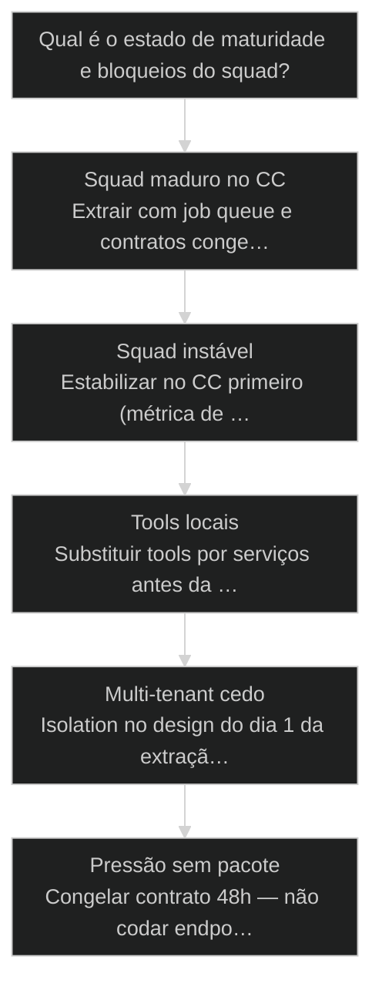
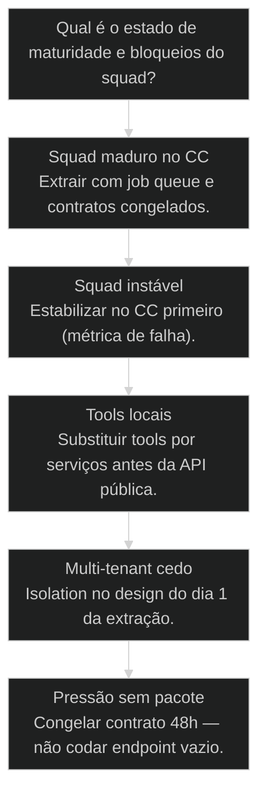

# Extrair Squad do Claude Code para API própria

← [[67-harness-ambiente-execucao|Harness: ambiente de execução do agente fora do Claude Code]] · ↑ [[modulos/Módulo 11 - Produtivização|M11]] · ⌂ [[Cursos/AIOX Advanced/README|Curso]] · → [[69-escada-progressiva-script-a-saas|Escada Progressiva: Script → Squad → Workflow → Runner → API → App → SaaS]]

## Mapa desta aula

Decisão-chave da aula — Qual é o estado de maturidade e bloqueios do squad?

> Leia o diagrama antes do texto longo. Depois volte e confira.

> Extrair [[Squad|squad]] não é colar o prompt numa rota. É empacotar personas, skills, gates, estado e tools com contrato de API.

**Objetivos de aprendizagem:**
- Listar o que um squad precisa para viver atrás de uma API com contrato. _(understand)_
- Esboçar arquitetura de extração do squad próprio (endpoints + estados de job). _(create)_
- Identificar bloqueios (estado, tools, auth, custo, isolamento) antes de codar. _(analyze)_
- Decidir se o squad está maduro para extração ou deve estabilizar no lab. _(evaluate)_

---

## O que você consegue no fim desta aula

*G · Destino*

Destino claro antes de qualquer rewrite heroico.

Ao final desta aula você vai conseguir três coisas concretas:

1. Dizer o que **entra no pacote** de um squad extraído (não só o prompt).
2. Listar **bloqueios honestos** do teu caso antes de abrir o editor.
3. Esboçar **3 endpoints + estados de job** com auth e QG em mente.

Se você sair daqui achando que "POST /run com o system prompt" é extração,
a aula falhou. Squad fora do Claude Code é **produto de execução** — não
atalho de demo.

- **Objetivos da aula** (Pacote de extração (além do prompt); Bloqueios antes do código; Sketch de API + job states)
- **Resultado tangível**: 1 página: squad · bloqueios · 3 endpoints · estados · fase 1.
- **Não é o destino**: Reescrever tudo em um fim de semana. Isso é o anti-objetivo.

---

## O fantasma de produtividade

*P · Onde você está*

Empatia com quem tem squad genial que só roda digitando.

Cara, se o squad só funciona com você digitando, ainda é fantasma de
produtividade. Bonito na sessão. Inexistente no P&L do cliente.

O erro clássico da extração: copiar o melhor prompt pra uma rota, esquecer
skills, gates, estado da story, tools locais, saudação do núcleo, e
qualidade. No dia seguinte: 50% de falha e zero como debugar.

Se você está aqui, provavelmente já sentiu:

- Squad maduro no CC e pressão de "vira API".
- Tools que leem arquivo do Desktop.
- Multi-tenant mental com o mesmo vector store.
- Medo de extrair porque "ainda quebra às vezes" (bom medo).

Beleza. A partir daqui: **congelar contratos, listar bloqueios, extrair em fases**.

**Onde a maioria trava**
- Colar prompt na rota e torcer
- Extrair squad instável
- Ignorar isolamento e custo

**Onde o operador vai**
- Contrato de API + job states
- Estabilizar no lab primeiro
- Bloqueios escritos antes do código

---

## O que extrair (o pacote de verdade)

*S · Rota*

Personas, skills, gates, estado, tools — com harness por baixo.

Extrair squad = empacotar o que no Claude Code parece "mágica de sessão":

1. **Personas / órbitas** — quem decide o quê.  
2. **Skills / workflows** — o ritual, não só o texto.  
3. **Gates** — o que bloqueia avanço sem evidência.  
4. **Estado** — story/job/entity com máquina de estados.  
5. **Tools** — capacidades como serviços remotos.  
6. **Núcleo** — regras (o equivalente a [[CLAUDE md|CLAUDE.md]]/core-config) versionadas.

Por baixo: o **harness** da aula 67. Por cima: **contrato de API**. No meio:
filas e observabilidade. Prior-art se encaixa: lab → harness → API de squad.

- **6**: peças do pacote
- **3**: endpoints mínimos
- **0**: fé como [[Quality Gate|quality gate]]

- **status**: squad-fora-do-claude-code
- **meta**: pacote=persona+skill+gate+estado+tools
- **meta**: api=job-oriented
- **ready**: ready to extract

**Legenda de cores**

O que cada cor sinaliza nesta aula

- **Contrato** (signal): API explícita
- **Bloqueio** (insight): dívida pré-extração
- **Job** (bench): async com status
- **Fases** (action): extração incremental
- **Atalho** (pain): prompt-only API

**Como ler esta aula**

1. **Pacote**: O que precisa sair do CC.
2. **Contrato**: API e estados de job.
3. **Bloqueios**: O que te impede agora.
4. **Rota**: Fases de extração.

---

## Contrato de API: não é REST por estética

Input, auth, idempotência, status, webhooks, erros.

Contrato mínimo de squad-as-API (ajuste nomes, não pule ideias):

- **POST /jobs** — cria execução (payload versionado, idempotency-key).  
- **GET /jobs/:id** — status: queued | running | succeeded | failed | cancelled.  
- **POST /jobs/:id/cancel** — kill switch por job.  
- (Opcional cedo) **webhook** — notifica terminal states.

Em cada job:
- **auth** — quem pode disparar (tenant, role).  
- **input schema** — JSON schema / validação rígida.  
- **output schema** — o que "sucesso" significa.  
- **erros** — classes (validação, tool, model, timeout, budget).  
- **QG** — gate que pode falhar o job sem "quase ok".

Síncrono só pra jobs curtos e baratos. Squad de verdade quase sempre é
**async**. Timeout de HTTP não é estratégia de produto.

- **1. Contrato**: Schemas de in/out + auth + idempotência. [borda]
- **2. Orquestração**: Fila, personas, skills, gates. [meio]
- **3. Evidência**: Status, logs, artefatos, custo. [prova]

> **Lei do job**: Se a execução pode passar de alguns segundos ou chamar tools, é job — não request síncrono heróico.

- **Idempotência**: Mesma chave de criação não dispara trabalho duplicado perigoso.
- **Job state**: Estado explícito da execução (queued→…→terminal).
- **QG de job**: Gate que decide succeeded vs failed com evidência, não feeling.
- **Extração**: Levar o pacote do squad do lab para API/harness com contratos.

---

## Bloqueios comuns — liste antes de codar

Secrets no laptop, MCP local, falta de fila, sem tenant isolation.

Checklist de bloqueios (marque os teus com honestidade brutal):

- **Instabilidade no lab** — falha > limiar aceitável; extrair multiplica o caos.  
- **Tools locais** — arquivos, browser, MCP só na tua máquina.  
- **Estado implícito** — "a conversa lembra"; API não tem chat eterno.  
- **Secrets** — chaves no env local, sem vault/rotação.  
- **Sem isolamento** — mesmo store/vector/db pra clientes diferentes.  
- **Sem custo** — tokens ilimitados por request.  
- **Sem dono de QG** — ninguém define o que é PASS em produção.  
- **Núcleo podre** — regras só na cabeça, não versionadas.

Bloqueio listado é plano. Bloqueio ignorado é incidente com timestamp.

**Bloqueio → movimento**

- **Squad instável**: Estabilizar no CC primeiro
- **Tools locais**: Trocar por serviços
- **Multi-tenant cedo**: Isolation no dia 1 do design
- **Estado só no chat**: Persistir máquina de estados

- **Squad maduro** != **Prompt bom**: Maduro tem taxa de sucesso, gates e tools estáveis — não só copy esperta.
- **API de squad** != **Wrapper de LLM**: Wrapper não carrega órbitas, gates nem estado de processo.

---

## Caso: pipeline semanal vira API de jobs

Do ritual manual no CC ao POST /jobs com QG.

Squad de research semanal: estável no Claude Code, 1 operador, sexta de manhã.
Cliente pediu self-serve pro time interno.

Fase 0 — **não codar**:  
- Taxa de sucesso 4/5 últimas semanas.  
- Tools: 2 APIs + 1 que lia pasta local (bloqueio).  
- Output: pacote markdown + scores.

Fase 1 — **congelar contratos**: schema de input (tema, fontes, prazo) e
output (artefatos + score mínimo de QG).

Fase 2 — **job [[Runner|runner]]** no harness: POST cria job, worker roda o workflow,
GET devolve status. Tool local virando API de storage.

Fase 3 — **auth + obs + budget**: por time, por job, logs redacted.

Não foi rewrite do monorepo. Foi **extração do que já funcionava**, com
bloqueio removido um a um. O prompt nem foi a estrela — o contrato foi.

**Fases de extração**

1. **Madurar**: Estável no lab
2. **Congelar**: Contratos in/out
3. **Runner**: Job + worker
4. **Auth/Obs**: Tenant + logs + cap
5. **QG**: PASS/FAIL de verdade

---

## Extrair agora ou ainda não?

Árvore curta pra não fazer rewrite por pressão.

**Árvore de decisão**
_Escolha pela taxa de sucesso e dependências — não pelo FOMO de API._

- **Squad maduro no CC** — Roda estável; tools majoritariamente serviço.
  → _Extrair com job queue e contratos congelados._
  Ex.: Pipeline semanal ok 4 de 5 vezes.
- **Squad instável** — Quebra com frequência; gates frouxos.
  → _Estabilizar no CC primeiro (métrica de falha)._
  Ex.: 50% fail, output inconsistente.
- **Tools locais** — Depende da sua máquina.
  → _Substituir tools por serviços antes da API pública._
  Ex.: Arquivo no Desktop como input sagrado.
- **Multi-tenant cedo** — Vários clientes no mesmo store.
  → _Isolation no design do dia 1 da extração._
  Ex.: Mesmo vector store / bucket.
- **Pressão sem pacote** — Pedido de API sem schemas nem QG.
  → _Congelar contrato 48h — não codar endpoint vazio._
  Ex.: Só 'expõe o agente' no Slack do cliente.

**Gate:** Você listou bloqueios e tem schema de sucesso do job? — _Sem schema de sucesso, a API só vai devolver texto bonito e dívida._

#### Rota extração
Fases sem heroísmo.
1. **Congelar contratos: In/out + erros.
2. **Job runner: Async no harness.
3. **Auth: Tenant e papel.
4. **Obs + QG: Ver e falhar certo.

#### Rota ainda não
Critério de espera.
1. **Estabilizar: Taxa de sucesso.
2. **Dogfood: Uso real medido.
3. **Tools remotas: Sem Desktop.
4. **1 cliente piloto: API privada primeiro.

#### Rota isolamento
Multi-cliente sem drama.
1. **Tenant id: Em todo job.
2. **Data plane: Store separado/logical.
3. **Secrets: Por tenant quando preciso.
4. **Audit: Quem rodou o quê.

---

## Sketch de extração (25 min)

Uma página. Bloqueios honestos. Zero monorepo novo ainda.

Vamos lá. Se pular o sketch, o código vira terapia. Cronometra vinte e cinco minutos.

- 1. **Squad**: Qual extrair — uma frase de valor e quem depende.
- 2. **Madureza**: Taxa de sucesso recente (mesmo que estimada) e gaps.
- 3. **Bloqueios**: Liste ≥5 (tools, estado, secrets, isolamento, custo, QG…).
- 4. **API sketch**: 3 endpoints + estados de job + schema de sucesso.
- 5. **Fase 1**: O menor incremento de 14 dias (provavelmente contratos + 1 job privado).

**Funcionou se:**

- Há esboço de API com estados de job — não só 'um POST mágico'.
- ≥5 bloqueios listados com plano (mesmo que 'ainda não extrair').
- Fase 1 é pequena o bastante para caber em 14 dias.

---

## Glossário sem mágica de endpoint

- **Extração de squad**: Levar personas, skills, gates, estado e tools do lab para API/harness com contratos.
- **Contrato de API**: Schemas, auth, estados, erros e idempotência acordados antes do código.
- **Job-oriented API**: Modelo async com status de execução em vez de só request/response síncrono.
- **Bloqueio de extração**: Dependência ou dívida que torna perigoso ou impossível servir o squad fora do lab.

---

## Portão da aula

Você passou quando tem esboço de API com bloqueios honestos — não um rewrite
heroico. Squad que só vive na tua digitação é fantasma. Squad com contrato,
job e QG é produto de execução.

A IA é a seta. O X é seu — inclusive **o que você se recusa a extrair cedo**.

> **Próximo na trilha**: Com extração no mapa, a escada script → SaaS (69) ordena o quanto de produto você industrializa a cada degrau.

> **GATE-MODULE (auto)**: GPS Goal/Position/Steps presentes · caso + do/dont · decisão · prática com evidência · glossário. Alvo DL ≥70 atingido na construção enrich-W4.

***

---

## Navegação

← [[67-harness-ambiente-execucao|Harness: ambiente de execução do agente fora do Claude Code]] · ↑ [[modulos/Módulo 11 - Produtivização|M11]] · ⌂ [[Cursos/AIOX Advanced/README|Curso]] · → [[69-escada-progressiva-script-a-saas|Escada Progressiva: Script → Squad → Workflow → Runner → API → App → SaaS]]
