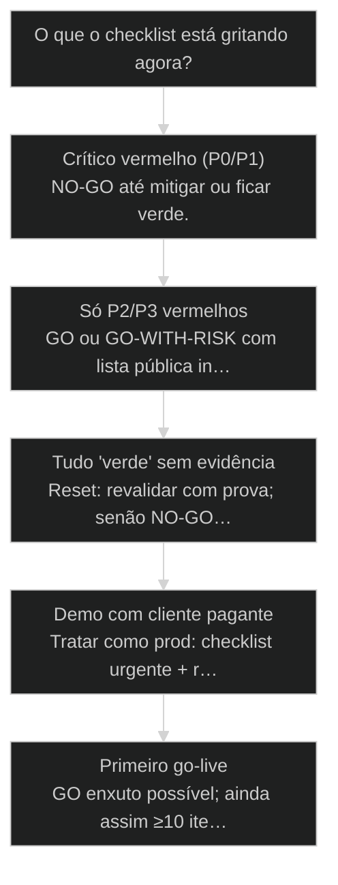
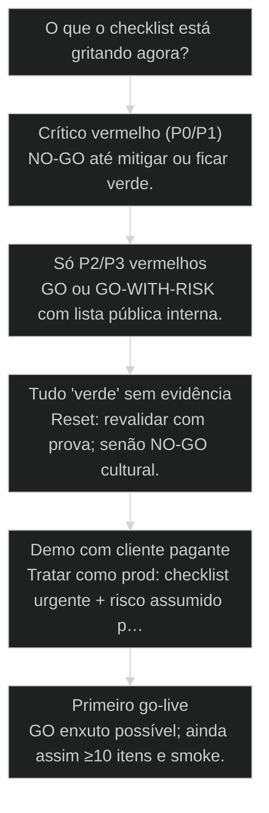

# Prontidão de produção: checklist final

← [[72-cicd-pipeline-completa|CI/CD Pipeline completa: GitHub Actions + Quality Gate pré-merge]] · ↑ [[modulos/Módulo 12 - Deploy Profissional|M12]] · ⌂ [[Cursos/AIOX Advanced/README|Curso]] · → [[44-metodo-s2s|Método S2S: converter sinais em sistemas]]

## Mapa desta aula

Decisão-chave da aula — O que o checklist está gritando agora?

> Leia o diagrama antes do texto longo. Depois volte e confira.

> ≥10 itens verdes antes de chamar de produção — honestidade operacional, não launch de ego.

**Objetivos de aprendizagem:**
- Aplicar um checklist de prontidão (≥10 itens) em um projeto real. _(apply)_
- Classificar itens vermelhos por risco, impacto e dono nomeado. _(analyze)_
- Decidir go / no-go / go-with-risk com critérios explícitos e rastreáveis. _(evaluate)_
- Distinguir demo estável de produção operável sem marketing interno. _(evaluate)_

---

## O que você consegue no fim desta aula

*G · Destino*

Destino claro antes de qualquer lista genérica de SRE.

Ao final desta aula você vai conseguir três coisas concretas:

1. Rodar um **checklist de prontidão** com no mínimo 10 itens verificáveis.
2. Colocar **dono e risco** em cada vermelho — sem item órfão.
3. Sair com um veredito **go / no-go / go-with-risk** escrito, não "acho que vai".

Se você sair daqui chamando de produção um app que só você sabe reiniciar,
a aula falhou. Produção não é URL. É **capacidade de operar quando dói**.

- **Objetivos da aula** (Checklist ≥10 com evidência; Vermelhos com dono e risco; Go / no-go explícito)
- **Resultado tangível**: Planilha/nota de go-live preenchida + decisão assinada (mesmo que por você).
- **Não é o destino**: Launch post no LinkedIn com on-call inexistente e backup nunca testado.

---

## O erro do 'tá no ar, então é prod'

*P · Onde você está*

Empatia com o ponto de partida real do operador.

Cara, eu vejo o mesmo filme toda semana. Deploy na Vercel, domínio apontado,
um cliente usando. Aí pergunta básica: "cadê o runbook se o Supabase cair?"
Silêncio. "Quem é on-call?" Eu. "Backup?" Acho que o free tier faz. "LGPD /
dados sensíveis?" A gente vê depois. Isso não é produção. É **demo com
tráfego**.

A honestidade operacional dói porque força enxergar o que o ego quer pular:
monitoramento, rollback, secrets, RLS, suporte, custo, dependências, status
page mínima, comunicação de incidente.

Se você está aqui, provavelmente já sentiu um destes sintomas:

- Cliente achou o bug antes de você.
- Só uma pessoa sabe "o jeito" de recuperar.
- Staging não existe ou é mentira (mesmas keys de prod).
- Checklist existe no Notion e ninguém abriu no dia D.

Beleza. A partir daqui a gente troca autoengano por **go-live com dente**.

**Onde a maioria trava**
- URL pública = produção
- Vermelho escondido pra não adiar
- On-call implícito (eu, sempre)

**Onde o operador vai**
- Checklist com evidência
- Vermelho visível com dono
- Go-with-risk consciente, não cego

---

## O que 'produção' exige de verdade

*S · Rota*

Dez+ portões. Cada um verificável. Nenhum 'a gente lembra'.

Produção, no sentido AIOX de ship responsável:

- Roda **sem você na sala**.
- Falha de forma **visível**.
- Volta (rollback) em caminho **conhecido**.
- Dados têm **isolamento e backup** mínimos.
- Tem **humano** (mesmo que você) com protocolo quando quebra.

Esta aula fecha o arco ship: escada (69) → dados (70) → deploy (71) → CI/CD
(72) → **prontidão**. O capstone (74) vai te forçar a provar sob timer.

O checklist não é ISO 27001 de brincadeira. É a lista curta que impede
autoengano. Você pode ter 10 ou 30 itens — o crime é ter zero e chamar de prod.

- **≥10**: itens no checklist
- **3**: vereditos possíveis
- **0**: cinzas sem dono

- **status**: production readiness
- **meta**: checklist≥10 · owners · risks
- **meta**: verdict=go|no-go|go-with-risk
- **ready**: ready to judge

**Legenda de cores**

O que cada cor sinaliza nesta aula

- **Item** (signal): critério binário com prova
- **Dono** (insight): nome de quem fecha o item
- **Risco** (bench): se vermelho, o que quebra
- **Veredito** (action): go / no-go / go-with-risk
- **Demo** (pain): prod só de nome

**Como ler esta aula**

1. **Lista**: Os 10+ itens canônicos.
2. **Risco**: Como classificar vermelho.
3. **Caso**: Launch que era demo.
4. **Veredito**: Decidir com honestidade.

---

## Da cohort: produção é checklist, não empolgação de sexta

*T1 + T2 · WhatsApp*

Realidade do grupo Advanced — cicatriz, não slide.

Entre zips de [[Squad|squad]] e demo de sexta, a pergunta adulta é go/no-go.
A turma Advanced mistura 'funciona na minha máquina' com 'cliente vai usar amanhã'.

Esta aula internaliza o que o suporte e o grupo já viram: sem log, RLS, rollback
mental e dono de incidente, o cohort vira plantão. Prontidão é respeito com quem
pagou o Advanced — e com quem vai clicar no teu link.

> **Âncora de campo**: Se você não aguenta o checklist, o usuário não aguenta o downtime.

> **Materiais / FAQ**: Capstone 74 · FAQ de produção

---

## Checklist canônico (≥10)

Adapte ao teu produto — não apague o incômodo.

Lista base — marque verde só com **evidência** (link, print, comando, URL):

1. **Build/CI verde** no main (required checks de verdade).
2. **Deploy reproduzível** (não só "na máquina do fulano").
3. **Env matrix** completa (preview/prod) sem secret no client.
4. **Dados**: schema migrado; **RLS**/isolamento ok (se multi-user).
5. **Backup/restore** mental ou real testado (mesmo que simples).
6. **Observabilidade mínima**: erro visível (log, Sentry, ou equivalente).
7. **Smoke prod** documentado e executado.
8. **Rollback path** em uma página (redeploy/revert/flag).
9. **Suporte/on-call**: quem responde e em quanto tempo.
10. **Dependências críticas** listadas (Supabase, Vercel, Stripe, LLM…).
11. **Custo/quota**: o que estoura se o uso 10x (opcional mas adulto).
12. **Privacidade/compliance** mínima do teu caso (dados sensíveis?).

Menos de 10? Só se o produto for genuinamente trivial — e mesmo assim escreva
por que os outros não se aplicam. "Não se aplica" com justificativa ≠ sumir.

> **Lei do verde**: Verde sem evidência é cinza. Cinza conta como vermelho na decisão de go-live.

- **1. Técnico**: CI, deploy, env, dados, smoke. [roda]
- **2. Operacional**: Log, rollback, on-call, deps. [sobrevive]
- **3. Negócio/risco**: Custo, privacidade, suporte. [aguenta]

- **Monitoramento** != **Log que ninguém lê**: Observabilidade exige alerta ou hábito de olhar.
- **Backup existe** != **Restore testado**: Backup sem restore é torcida.

---

## Classificar vermelho e decidir

Go-with-risk é válido. Go-cego não.

Para cada item vermelho, preencha:

- **Impacto** se explodir (usuário, dado, dinheiro, reputação).
- **Probabilidade** honesta (não "improvável" por preguiça).
- **Dono** (nome) e **prazo** de ficar verde.
- **Mitigação** se for go-with-risk (flag, limite, aviso, horário).

Vereditos:

- **GO** — críticos verdes; residual aceito e escrito.
- **NO-GO** — crítico vermelho sem mitigação; adia.
- **GO-WITH-RISK** — sobe com olhos abertos, dono do risco, data de fechar
  o buraco. Não é desculpa eterna.

O crime cultural é esconder vermelho pra "não desanimar o launch". Launch
desinformado é o que desanima o cliente — e o time — de verdade.

> **Pergunta do adulto**: Se isso quebrar às 2h da manhã de domingo, quem faz o quê em 15 minutos? Se a resposta for 'sei lá', não é GO limpo.

**Severidade rápida**

- **P0**: Dado vazando / pagamento quebrado / total outage
- **P1**: Feature core degradada, workaround ruim
- **P2**: Dor real, não bloqueia valor principal
- **P3**: Higiene; não segura o go sozinha

---

## Caso: o launch que era demo com CNPJ

Quando o checklist teria economizado o fim de semana.

SaaS B2B "em produção". Três clientes pagantes. Semanalmente o founder
reiniciava um worker manual. Sem alerta. Backup nunca restaurado. RLS
"quase". Na sexta, migration mal aplicada — app up, writes falhando. Cliente
notou no sábado. Founder descobriu no domingo via WhatsApp, não via log.

Checklist de 20 minutos na quinta teria marcado: observabilidade vermelha,
rollback vermelho, restore vermelho, on-call "eu" sem protocolo. Veredito
honesto: **NO-GO** ou **GO-WITH-RISK** com mitigação (congelar writes,
status manual, janela de migração). Em vez disso: "tá no ar".

Produção de verdade começou no dia em que o checklist virou ritual pré-ship
— não no dia do primeiro boleto.

**Ritual de go-live**

1. **Abrir lista**: ≥10 itens do produto
2. **Evidenciar**: Verde só com prova
3. **Classificar**: Vermelhos com risco+dono
4. **Veredito**: Go / no-go / go-with-risk
5. **Agendar**: Fechar buracos com data

---

## Go, no-go ou go-with-risk?

Árvore curta de honestidade operacional.

**Árvore de decisão**
_Trate cinza como vermelho. Trate 'depois' como risco._

- **Crítico vermelho (P0/P1)** — Dado, pagamento, outage, secret, RLS buraco.
  → _NO-GO até mitigar ou ficar verde._
  Ex.: Service role no client; restore nunca testado com dado real.
- **Só P2/P3 vermelhos** — Dor real, core ok, donos e prazos claros.
  → _GO ou GO-WITH-RISK com lista pública interna._
  Ex.: Status page ainda não; on-call definido.
- **Tudo 'verde' sem evidência** — Checklist marcado no feeling.
  → _Reset: revalidar com prova; senão NO-GO cultural._
  Ex.: Todos verdes em 3 minutos sem links.
- **Demo com cliente pagante** — Já tem dinheiro e zero ops.
  → _Tratar como prod: checklist urgente + risco assumido por escrito._
  Ex.: 3 clientes, worker manual.
- **Primeiro go-live** — Ainda sem usuários reais.
  → _GO enxuto possível; ainda assim ≥10 itens e smoke._
  Ex.: Lançamento closed beta amanhã.

**Gate:** Você assinaria o veredito com teu nome se o cliente lesse? — _Se daria vergonha mostrar a lista, ela ainda é marketing._

#### Rota GO
Sobe com olhos abertos.
1. **Críticos: Verdes com evidência.
2. **Residual: Lista curta + donos.
3. **Smoke: Prod verificado.
4. **Watch: Janela de observação pós-ship.

#### Rota NO-GO
Adiar é profissionalismo.
1. **Nomear: Qual P0/P1 segura.
2. **Plano: O que falta pra verde.
3. **Data: Re-checagem marcada.
4. **Comunicar: Stakeholder sem teatro.

#### Rota GO-WITH-RISK
Consciente, não covarde.
1. **Escrever risco: Impacto + prob + dono.
2. **Mitigar: Flag, limite, horário.
3. **Prazo: Data de fechar o buraco.
4. **Revisar: Se estourar prazo, vira NO-GO.

---

## Go-live do teu projeto (20–25 min)

Projeto real. Checklist real. Veredito real.

Vamos lá. Sem veredito escrito, a aula vira lista de compras de SRE.

- 1. **Copiar**: Traga os ≥10 itens canônicos para uma nota/planilha.
- 2. **Marcar**: Verde só com evidência colada (link/comando); senão vermelho.
- 3. **Dono**: Todo vermelho com nome (pode ser o teu) e prazo.
- 4. **Risco**: Classifique P0–P3 nos vermelhos.
- 5. **Veredito**: GO / NO-GO / GO-WITH-RISK em uma frase + por quê.
- 6. **Próximo**: Se não for GO limpo: as 3 ações que mais reduzem risco esta semana.

**Funcionou se:**

- ≥10 itens com status e evidência ou vermelho explícito.
- Nenhum vermelho sem dono.
- Veredito escrito que você assina.

---

## Glossário sem jargão de vaidade

- **Prontidão de produção**: Estado em que o sistema pode operar com falha visível, rollback e dono.
- **Go-with-risk**: Subir assumindo riscos escritos, com dono, mitigação e prazo.
- **On-call**: Quem responde incidente e em que janela — mesmo em time de um.
- **Evidência de item**: Prova verificável (URL, log, comando, print) de que o item está verde.
- **Demo com tráfego**: Sistema em uso real sem capacidade operacional de produção.

---

## Portão da aula

Você passou quando o checklist tem dente, vermelho tem dono e o veredito
aguenta leitura de cliente. Produção é honestidade operacional. Launch sem
lista é marketing com blast radius.

A IA é a seta. O X é seu — inclusive dizer NO-GO.

> **Próximo na trilha**: Hora da prova: o caso integrado end-to-end (74) — briefing → deploy → ROI em 90 minutos, sob timer.

> **GATE-MODULE (auto)**: GPS Goal/Position/Steps presentes · caso + do/dont · decisão 5 branches · prática com evidência · glossário. Alvo DL ≥70 atingido na construção enrich-W5.

***

---

## Navegação

← [[72-cicd-pipeline-completa|CI/CD Pipeline completa: GitHub Actions + Quality Gate pré-merge]] · ↑ [[modulos/Módulo 12 - Deploy Profissional|M12]] · ⌂ [[Cursos/AIOX Advanced/README|Curso]] · → [[44-metodo-s2s|Método S2S: converter sinais em sistemas]]
