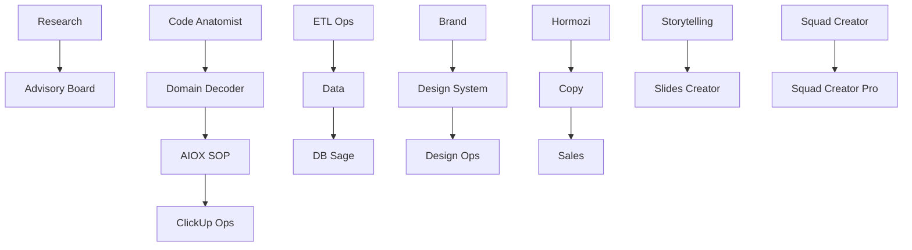

# Mapa de decisão dos squads

[⌂ Curso](README.md) · [Guia de execução](Guia-de-execucao.md)

## Comece pelo verbo principal

- **Decidir:** Advisory Board.
- **Pesquisar:** Research.
- **Entender um sistema inteiro:** Code Anatomist.
- **Extrair regras de negócio:** Domain Decoder.
- **Criar ou melhorar autonomia de agentes:** Agent Autonomy.
- **Configurar Claude Code:** Claude Code Mastery.
- **Documentar processos:** AIOX SOP.
- **Extrair e transformar fontes:** ETL Ops.
- **Operar pipelines headless:** Runner Ops.
- **Analisar negócio e métricas:** Data.
- **Modelar ou operar PostgreSQL/Supabase:** DB Sage.
- **Materializar processo no ClickUp:** ClickUp Ops Squad.
- **Construir marca:** Brand.
- **Criar foundations, tokens e componentes:** Design System.
- **Governar um design system existente:** Design Ops.
- **Estruturar narrativa:** Storytelling.
- **Produzir apresentação:** Slides Creator.
- **Operar conteúdo social:** Conteúdo.
- **Escrever para conversão:** Copy.
- **Operar o funil comercial:** Sales.
- **Desenhar oferta, leads e escala no método Hormozi:** Hormozi.
- **Governar várias skills:** Skill Creator Ops.
- **Criar um squad canônico:** Squad Creator.
- **Criar squad com extração de expertise e gates avançados:** Squad Creator Pro.

## Fronteiras que evitam escolha errada

- Research descobre evidências; Advisory Board delibera sobre uma decisão.
- Code Anatomist mapeia o sistema; Domain Decoder aprofunda regras e linguagem do domínio.
- ETL Ops transforma fontes; Runner Ops governa a execução headless recorrente.
- Data modela métricas e decisões; DB Sage é autoridade sobre schema, migrations, RLS e performance.
- Design System constrói a biblioteca; Design Ops governa saúde, adoção e qualidade contínua.
- Storytelling organiza arco e sentido; Copy persuade; Sales conduz a interação comercial.
- Squad Creator cria capacidade; Squad Creator Pro acrescenta clonagem de expertise, pesquisa e validação avançada.

## Encadeamentos frequentes

