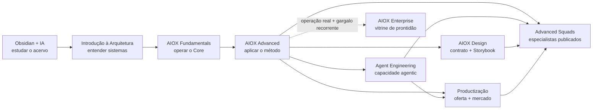

> Vault: [[00-HOME]] · [README](README.md) · [Cursos](cursos/README.md)

# AIOX: do primeiro ciclo à operação mantida

> **Fundamentals abre o primeiro ciclo. Advanced forma o operador. Enterprise mantém a operação.**

Existem duas leituras complementares, mas elas não devem ser misturadas:

- **jornada de aprendizagem deste acervo:** quatro etapas no núcleo comum + quatro rotas de aplicação;
- **jornada de oferta:** Fundamentals, Advanced e Enterprise, do primeiro ciclo à operação mantida.

Para escolher uma rota concreta conforme seu nível e seu objetivo, use [Como estudar o acervo — trilhas por caso](cursos/COMO-ESTUDAR.md).

## Jornada de aprendizagem — todos os nove cursos

| Curso | Responsabilidade exclusiva | Evidência de passagem |
|-------|----------------------------|-----------------------|
| [Obsidian + IA](cursos/Obsidian-IA/README.md) | Navegar, capturar e preparar contexto sem poluir o canônico | Captura ou MOC justificado + Context Brief para a próxima trilha |
| [Introdução à Arquitetura de Sistemas](cursos/Introducao-a-Arquitetura-de-Sistemas/README.md) | Ler sistemas, fluxos, estado, falhas, segurança e trade-offs | Arquitetura explicável e revisada |
| [AIOX Fundamentals](cursos/AIOX-Fundamentals/README.md) | Instalar o Core, conhecer os 12 agents e fechar a primeira story | Primeiro ciclo local com evidência reproduzível |
| [AIOX Advanced](cursos/AIOX%20Advanced/README.md) | Transformar intenção em sistema pelo método AIOX | Fatia funcional com contexto, SDC, gates e evidência |
| [AIOX Advanced Squads](cursos/AIOX-Advanced-Squads/README.md) | Escolher, ativar e compor especialistas para uma missão | Briefings, artefatos e validação de uma execução real |
| [AIOX Agent Engineering](cursos/AIOX-Agent-Engineering/README.md) | Construir, orquestrar e operar capacidade agentic própria | Capacidade executável com contrato, gates e limites |
| [AIOX Design](cursos/AIOX-Design/README.md) | Materializar contrato visual e governança de interface | DESIGN.md + catálogo + Storybook + ciclo visual |
| [AIOX Productização](cursos/AIOX-Productizacao/README.md) | Transformar capacidade comprovada em oferta e experimento | Decision pack + hipótese, canal, métrica e critério de parada |
| [AIOX Enterprise — Visão Operacional e Prontidão](cursos/AIOX-Enterprise/README.md) | Diagnosticar prontidão para uma operação mantida sem prometer os componentes proprietários | Decisão sustentada por evidência + próximo passo |

**Arquitetura não é AIOX Fundamentals.** A primeira ensina a compreender qualquer sistema; o segundo ensina a operar o framework AIOX. Diagnósticos permitem encurtar uma etapa já dominada, mas não alteram essa ordem conceitual.

### Depois do núcleo comum: escolha a aplicação

- [AIOX Advanced Squads](cursos/AIOX-Advanced-Squads/README.md) — operar especialistas publicados.
- [AIOX Agent Engineering](cursos/AIOX-Agent-Engineering/README.md) — construir e operar capacidades agentic próprias.
- [AIOX Design](cursos/AIOX-Design/README.md) — estabelecer contrato visual e qualidade de interface.
- [AIOX Productização](cursos/AIOX-Productizacao/README.md) — transformar capacidade comprovada em oferta e experimento de mercado.

As quatro rotas são cursos canônicos, mas não formam uma sequência obrigatória. Escolha pelo gate de entrada e pelo artefato necessário. Agent Engineering pode levar a Productização; as rotas podem convergir em Squads quando a execução pedir especialistas publicados. A vitrine Enterprise exige Advanced e matéria-prima de uma operação real.

## Jornada de oferta — três momentos

> **Primeiro ciclo → construção avançada → operação mantida.**

Você não escolhe pelo nome “mais avançado”. Escolhe pela capacidade que precisa desenvolver — ou pela operação que precisa colocar de pé agora. O acervo reúne oito cursos formativos e um preview Enterprise; o preview explica um nível comercial existente, não cria outro.

## A diferença em 30 segundos

| Etapa | O que é | Pergunta que resolve | Resultado principal |
|-------|---------|----------------------|---------------------|
| **AIOX Fundamentals** | Formação operacional no `aiox-core` | “Como instalo, escolho um agent e concluo o primeiro ciclo com evidência?” | Você instala/audita o Core, conhece os 12 agents e conduz uma story local. |
| **AIOX Advanced** | Formação prática no método AIOX | “Como transformo uma intenção em um sistema entregue?” | Você aprende a conduzir contexto, SDC, determinismo, brownfield, gates e evidência. |
| **AIOX Enterprise** | Sistema de produção mantido, com onboarding e acompanhamento contínuo | “Como coloco isso para operar no meu negócio com ativos de produção, governança e evolução contínua?” | Você recebe o ambiente de produção mantido, em vez de precisar montar cada camada sozinho. |

**Atalho mental:** Fundamentals dá o Core. Advanced dá profundidade ao método. Enterprise dá o ambiente de produção.

## Base técnica — Introdução à Arquitetura de Sistemas

É a segunda etapa da jornada de aprendizagem e a porta de entrada técnica para quem ainda trava diante de termos como API, estado, fila, worker, cache, fan-in, RLS, observabilidade ou multi-tenancy. Na jornada de oferta, funciona como nivelamento e não como um produto acima ou abaixo de Fundamentals.

Você desenvolve base para:

- ler diagramas e acompanhar o caminho de uma requisição;
- compreender dados, comunicação, execução, escala, segurança e confiabilidade;
- comparar alternativas técnicas por trade-offs, sem escolher por moda;
- desenhar e defender uma arquitetura com agentes e intervenção humana.

Neste acervo, a trilha está em [Introdução à Arquitetura de Sistemas](cursos/Introducao-a-Arquitetura-de-Sistemas/README.md): 24 aulas, 8 módulos, 8 quizzes e projeto integrador.

### Próximo passo

Vá para o **AIOX Fundamentals** quando conseguir explicar o desenho básico de um sistema e questionar as decisões propostas pela IA. Quem já domina essa base pode entrar diretamente no Fundamentals.

## 1. AIOX Fundamentals — operar o Core

É a porta de entrada operacional no framework open source. O foco é instalar ou auditar o `aiox-core` e concluir um primeiro ciclo local com contexto, story, gates e handoff.

### É para você se

- quer sair de prompts soltos e começar a operar o AIOX como sistema;
- ainda confunde agent, task, skill, workflow e squad;
- precisa instalar o Core e obter o primeiro resultado útil;
- quer aprender o ciclo básico de story, implementação, QA e fechamento.

### Você aprende a

- escolher `init`, `install`, `--dry-run` e `doctor`;
- localizar configuração, agents, tasks, templates, checklists e workflows;
- selecionar o agent correto por responsabilidade e autoridade;
- distinguir task, skill, workflow e squad;
- conduzir uma story pequena e provar o resultado.

Neste acervo, o [AIOX Fundamentals](cursos/AIOX-Fundamentals/README.md) contém 12 aulas, 3 módulos, 3 quizzes e um projeto final.

### Evidência de conclusão

Você conclui o primeiro ciclo AIOX com evidência reproduzível. O marco não é decorar comandos; é saber encontrar o caminho certo e validar a entrega.

### Próximo passo

Vá para o **AIOX Advanced** quando já conseguir obter primeiro valor, rotear os agents fundamentais e fechar uma mudança local com evidência.

## 2. AIOX Advanced — construir com profundidade

O Advanced parte da base operacional e aprofunda o método. A pergunta deixa de ser “como rodo o primeiro ciclo?” e passa a ser “como transformo uma intenção em um sistema operável?”.

### É para você se

- já entende o Core, mas ainda depende de execução improvisada;
- precisa estruturar briefing, PRD, stories, desenvolvimento e revisão;
- precisa dominar contexto, SDC, determinismo e brownfield;
- quer escolher a rota de aplicação certa sem inflar o curso de método.

### Você aprende a

- organizar o problema, o contexto, os executores e as leis do projeto;
- conduzir o ciclo de desenvolvimento por briefing, PRD, stories, implementação e quality gates;
- trabalhar em projetos greenfield e brownfield;
- aplicar determinismo progressivo e manter o operador nos pontos de julgamento;
- entregar uma fatia funcional com evidência reproduzível.

Neste acervo, o método está no [AIOX Advanced](cursos/AIOX%20Advanced/README.md). Depois dele, escolha a rota de aplicação que produz o artefato necessário:

- [AIOX Advanced Squads](cursos/AIOX-Advanced-Squads/README.md) para escolher e operar especialistas publicados;
- [AIOX Agent Engineering](cursos/AIOX-Agent-Engineering/README.md) para construir, orquestrar e operar capacidades agentic;
- [AIOX Design](cursos/AIOX-Design/README.md) para contrato e qualidade visual;
- [AIOX Productização](cursos/AIOX-Productizacao/README.md) para oferta, distribuição e monetização de uma capacidade comprovada.

### Evidência de conclusão

Você transforma uma intenção em sistema entregue. A evidência é um artefato real funcionando de ponta a ponta, não apenas o consumo das aulas.

### Próximo passo

Conclua as 28 aulas e o Capstone. Depois, escolha **Squads**, **Agent Engineering**, **Design** ou **Productização** pelo gate da missão.

Se a operação se repete e o gargalo vira infraestrutura mantida, faça o preview [AIOX Enterprise — Visão Operacional e Prontidão](cursos/AIOX-Enterprise/README.md).

## A virada: por que o Enterprise não é “Advanced 2”

O Advanced desenvolve a sua capacidade de construir. O Enterprise acrescenta **capacidade instalada**: ambiente, ativos, governança e evolução contínua para a operação.

No Advanced, você aprende o playbook. No Enterprise, conecta o seu negócio a uma base de produção que continua evoluindo.

Entrar no Enterprise sem clareza não elimina a confusão. Apenas coloca a confusão dentro de uma operação mais complexa. Por isso, prontidão importa mais do que pressa.

## 3. AIOX Enterprise — operar com infraestrutura mantida

O produto Enterprise não é um curso com mais módulos. É uma assinatura de operação: você acessa o sistema de produção, os ativos proprietários e a evolução contínua durante o período contratado.

O acervo contém uma [vitrine diagnóstica de 7 aulas](cursos/AIOX-Enterprise/README.md). Ela explica o próximo contexto e testa prontidão; não entrega o runtime, os ativos ou a assinatura.

Repositório, Dashboard Enterprise, workspace, validadores, integrações disponíveis e atualizações não chegam como itens soltos. Eles compartilham a mesma estrutura operacional. É essa integração, e não apenas a quantidade de assets, que diferencia o Enterprise de um pacote de componentes.

### O que entra a mais

| Dimensão | No Advanced | A mais no Enterprise |
|----------|-------------|----------------------|
| **Objetivo** | Aprender a construir | Operar com infraestrutura mantida |
| **Ativos** | Skills e squads para estudar e adaptar | Repositório privado, squads, scripts e pacotes de produção |
| **Interface** | Execução no ambiente que você preparou | Dashboard Enterprise para chat, orquestração, monitoramento e auditoria |
| **Contexto** | Estrutura criada por projeto | Workspace organizado para o negócio e integrações disponíveis na oferta vigente |
| **Governança** | Gates aplicados pelo operador | Regras, observabilidade e trilhas de auditoria integradas ao ambiente |
| **Evolução** | Você incorpora melhorias ao seu projeto | Infraestrutura atualizada continuamente durante o acesso |
| **Acompanhamento** | Formação e prática | Encontros Enterprise ao vivo e comunidade exclusiva |
| **Conteúdo** | Conteúdo da formação contratada | A oferta vigente inclui gravações de Fundamentals e Advanced |

### O que a integração reúne

- base e ativos de produção dentro da mesma estrutura operacional;
- Dashboard Enterprise para tornar a execução visível, monitorada e auditável;
- workspace para organizar o contexto do negócio de forma recorrente;
- atualizações do sistema durante o período de acesso;
- acompanhamento Enterprise e comunidade exclusiva.

### Teste de prontidão para o Enterprise

O Enterprise ganha valor quando o custo de coordenar a operação já supera o esforço de construir a próxima entrega. Verifique:

- já existe um projeto, serviço ou operação real para conectar ao sistema;
- as missões se repetem e exigem contexto consistente, não apenas prompts melhores;
- mais de um squad, pessoa, cliente ou fonte de dados participa da execução;
- você consegue nomear o resultado de negócio que quer sustentar;
- o gargalo está em integração, governança, observabilidade e evolução, não em entender os fundamentos.

Quanto mais respostas forem positivas, menos provável que apenas outro curso resolva o problema. Use a conversa sobre o Enterprise para validar aderência, escopo e condições. Se as respostas ainda forem vagas, extraia mais evidência no Capstone e nos squads.

### O Enterprise não é

- substituto para clareza de negócio ou capacidade de decisão;
- promessa de que tudo acontecerá sem participação do operador;
- requisito para estudar ou usar este repositório público;
- licença para redistribuir componentes proprietários.

O código do Enterprise **não está neste acervo público**. Use a [trilha de visão operacional e prontidão](cursos/AIOX-Enterprise/README.md) para preparar a decisão. Elegibilidade, duração, vagas e condições podem mudar; consulte a [página oficial](https://lp.aioxsquad.ai/enterprise).

## Para quem é cada etapa

### Entre no Fundamentals se

Seu gargalo é **começar certo**. Você precisa instalar o Core, compreender as peças básicas e concluir o primeiro ciclo AIOX com evidência.

### Entre no Advanced se

Seu gargalo é **construir com profundidade**. Você já opera o básico, mas precisa de método para criar sistemas, squads e entregas mais complexas.

### Avalie o Enterprise se

Seu gargalo é **operar com continuidade**. Você já constrói, mas precisa reduzir fragmentação e conectar o negócio a ativos de produção mantidos.

## Diagnóstico: onde devo entrar agora?

- “Ainda não sei instalar o Core nem escolher entre agent, task, skill, workflow e squad.” → **Fundamentals**
- “Já opero o básico, mas minha construção ainda depende de improviso.” → **Advanced**
- “Já entrego sistemas, mas a operação está espalhada e cara de manter.” → **Enterprise**

Se os próprios termos técnicos ainda são o bloqueio, comece antes pela trilha de **Introdução à Arquitetura de Sistemas**.

## FAQ

### Introdução à Arquitetura de Sistemas substitui AIOX Fundamentals?

Não. Arquitetura ensina a ler sistemas em geral. AIOX Fundamentals ensina a instalar e operar o framework AIOX.

### Posso pular o AIOX Fundamentals?

Se já instala o Core, escolhe o mecanismo correto e fecha uma story com evidência, use o projeto final como diagnóstico. Caso contrário, Fundamentals elimina lacunas que o Advanced pressupõe.

### O Enterprise substitui o Advanced?

Não. O Advanced constrói a competência do operador. O Enterprise oferece o ambiente mantido para aplicar essa competência numa operação mais exigente.

### O Enterprise é apenas mais conteúdo e mais squads?

Não. O diferencial está na integração: Dashboard Enterprise, workspace, governança, observabilidade, atualização contínua e acompanhamento. Os ativos ganham valor porque operam como sistema.

### Preciso do Enterprise para usar este repositório?

Não. O acervo público permite estudar o método e adaptar assets ao seu projeto. O Enterprise adiciona infraestrutura e componentes proprietários de produção.

### Qual é o próximo passo depois do Advanced?

Conclua o Capstone e escolha a rota de aplicação pelo resultado. Use **Advanced Squads**, **Agent Engineering**, **Design** ou **Productização** conforme a missão.

Se o gargalo virou infraestrutura recorrente, faça o [preview Enterprise](cursos/AIOX-Enterprise/README.md).

### Como sei se chegou a hora do Enterprise?

Quando você consegue entregar com o Advanced, mas contexto, integrações, gates, monitoramento e atualização da base consomem energia a cada nova execução. Nesse ponto, compare o custo de manter essa montagem com o valor de operar sobre uma infraestrutura integrada e mantida.

## Escolha o próximo passo

- **Quero seguir a jornada educacional completa:** [hub dos cursos](cursos/README.md).
- **Quero começar no Core:** [AIOX Fundamentals](cursos/AIOX-Fundamentals/README.md).
- **Quero construir com profundidade:** [AIOX Advanced](cursos/AIOX%20Advanced/README.md).
- **Quero operar um especialista publicado:** [AIOX Advanced Squads](cursos/AIOX-Advanced-Squads/README.md).
- **Quero construir uma capacidade agentic própria:** [AIOX Agent Engineering](cursos/AIOX-Agent-Engineering/README.md).
- **Quero materializar um sistema visual governável:** [AIOX Design](cursos/AIOX-Design/README.md).
- **Quero levar uma capacidade comprovada ao mercado:** [AIOX Productização](cursos/AIOX-Productizacao/README.md).
- **Quero diagnosticar prontidão para uma operação mantida:** [AIOX Enterprise — Visão Operacional e Prontidão](cursos/AIOX-Enterprise/README.md).

Se o diagnóstico indicar fit, confirme escopo e condições na [página oficial](https://lp.aioxsquad.ai/enterprise).

O critério não é o número de certificados. É a distância entre o que você consegue operar hoje e o resultado que precisa sustentar amanhã.
