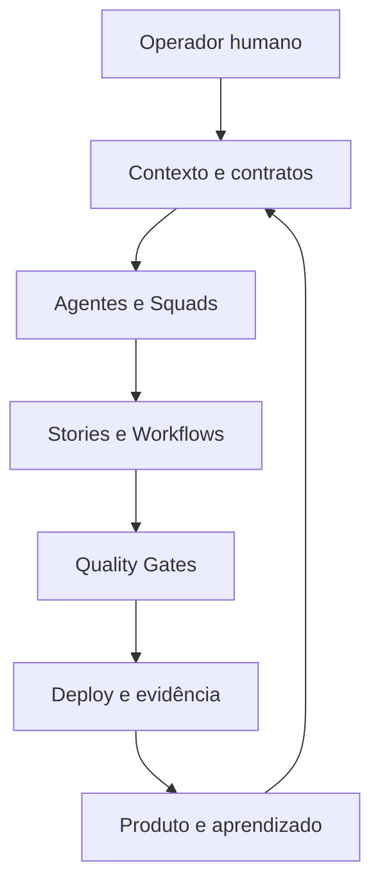

# Mapa do AIOX

Eu uso este mapa quando quero compreender o sistema por relações, não pela ordem das aulas. Para estudar em sequência, volto ao [[cursos/AIOX Advanced/README|curso]].

## Princípios de operação

- [[Token Economy]]
- [[Repertório vs Técnica]]
- [[Software House no Computador]]
- [[Goal vs Loop]]
- [[Determinismo Progressivo]]

## Contexto e contratos

- [[CLAUDE md|CLAUDE.md]]
- [[Janela de Contexto]]
- [[Engenharia de Contexto]]
- [[Orientação do Agente]]
- [[Local Staging Production]]
- [[DESIGN md|DESIGN.md]]

## Agentes, papéis e unidades de processo

- [[Agentes Orbitais]]
- [[Anatomia do Agente]]
- [[Quatro Executores]]
- [[Squad]]
- [[Taxonomia AIOX]]

## Execução e qualidade

- [[Ciclo do Story]]
- [[Runner]]
- [[Quality Gate]]
- [[CodeRabbit]]
- [[Método S2S]]

## Descoberta e decisão

- [[Brownfield Discovery]]
- [[Mesa-redonda]]

## Percursos

- **Aprender em sequência:** [[cursos/AIOX Advanced/README|Rota do curso]]
- **Consultar termos:** [[Glossário AIOX Advanced]]
- **Construir:** [[Projeto Integrador]]
- **Tirar dúvidas:** [[support/README|Central de suporte]]

## Navegação

↑ [[cursos/AIOX Advanced/README|Curso]] · → [[modulos/Módulo 0 - Mindset e Princípios|Começar pelo Módulo 0]]
