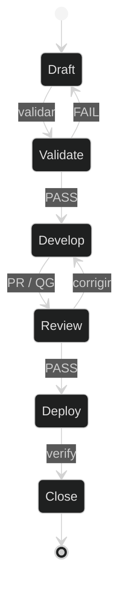
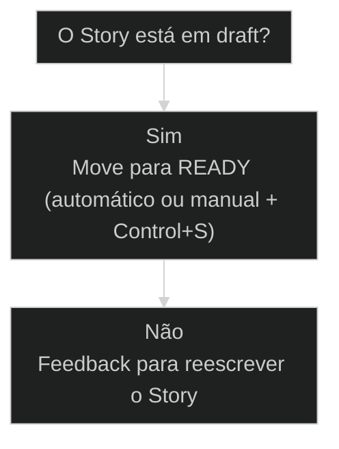

# Ciclo de vida do [[Story]]

↑ [[modulos/Módulo 3 - Ciclo SDC|M3]] · ⌂ [[cursos/AIOX Advanced/README|Curso]] · → [[47-ciclo-de-vida-do-story|Versão atual]]

> [!warning] Versão substituída
> Esta aula permanece como referência histórica. A rota atual continua em [[47-ciclo-de-vida-do-story]].


## Conceitos

- [[Quality Gate]]
- [[Ciclo do Story]]

## Mapa desta aula

Ciclo de vida do Story (SDC): unidade de trabalho com gates — não conversa solta no chat.



> Leia o diagrama antes do texto longo. Depois volte e confira.

> draft → ready → in progress → in review → done: o Story é uma entidade que muda de estado, cada transição tem um dono e o gate de validação é a fronteira que separa pedido cru de unidade executável.

**Objetivos de aprendizagem:**
- Nomear os 5 status do Story e quem move cada transição. _(remember)_
- Aplicar o gate de validação (draft→ready) antes de desenvolver. _(apply)_
- Distinguir done (fim do ciclo da Story) de deploy (outro ciclo). _(understand)_
- Reconhecer o ciclo SDC completo (SM→PO→Dev→QA→DevOps→Close) em um Story real do repo. _(apply)_

---

## [[Ciclo do Story|Ciclo de vida do Story]]

Um Story não sai pronto. É uma entidade que passa por 5 estados, cada um com um dono e um portão.

- **5**: status
- **4**: donos (SM/PO/Dev/QA)
- **1**: gate crítico (validate)

- **status**: aiox advanced
- **meta**: operador=alan_nicolas
- **meta**: aula=10 story-cycle
- **meta**: status=draft->ready->review->done
- **ready**: ready to move

**Legenda de cores**

O que cada cor sinaliza nesta aula

- **Estado inicial** (signal): draft e intenção ainda sem validação operacional
- **Gate crítico** (bench): ready depois de PO validar template, épico e aceite
- **Execução** (action): Dev constrói apenas depois da Story estar pronta para execução
- **Pulo de etapa** (pain): desenvolver draft e empurrar retrabalho para QA

**Como ler esta aula**

1. **Story é entidade, não texto**: Tem estados, donos e portões. Não é só um pedido escrito.
2. **Cinco estados em ordem**: draft → ready → in_progress → in_review → done.
3. **READY é o gate que não se pula**: Pular = Dev executa em cima de premissa crua.
4. **Cada seta tem UM dono**: SM cria, PO valida, Dev constrói, QA aprova.

---

## Tudo é entidade com ciclo

Se você entende o ciclo de UM Story, entende o de qualquer entidade: projeto, criativo, lead.

> **A ideia-âncora**: Pedro: 'Eu vejo tudo como entidades. Um Story é uma entidade, um épico, um agente; cada uma tem ciclos e status próprios, um ciclo para ser considerada feita.' O padrão estados+transições+dono+gate é universal. [SOURCE: L2055]

- **Estado** -> Onde a entidade está agora: draft, ready, in progress, in review ou done.
- **Transição** -> A seta entre estados. Nunca é neutra: alguém precisa mover.
- **Dono** -> Quem tem autoridade para mover aquela seta.
- **Gate** -> Critério que impede uma transição errada.

---

## Onde você está nesta aula

O ciclo primeiro como movimento. Os nomes técnicos e o ciclo SDC completo entram depois que a lógica estiver clara.

- **Objetivos da aula** (Nomear os 5 status do Story e quem move cada um.; Aplicar o gate de validação antes de desenvolver.; Distinguir done de deploy.; Reconhecer o ciclo SDC num Story real do repo.)
- **Onde você está?** (Começando: foque Mapa e Ciclo dos 5 status.; Já usa AIOX: foque Casos Reais e ciclo SDC completo.; Vai operar o repo: foque o gate READY e quem move cada seta.)
- **Leitura prática**: Leia cada bloco procurando uma resposta: qual o estado atual, quem é o dono da próxima seta, e qual gate impede a transição errada.

**O ritmo desta aula**

A aula vai do movimento ao detalhe e fecha com prática concreta.

- G **Mapa antes do nome**: Primeiro o movimento dos 5 estados, depois a nomenclatura técnica.
- 1 **Gate em foco**: READY é o portão central. Tudo gira em torno dele.
- 2 **Caso real**: O ciclo aparece rodando num Story do próprio repo AIOX.
- 3 **Prática de 2 minutos**: Você sai com uma decisão concreta sobre um Story seu.

---

## Os 5 status, em ordem

draft → ready → in progress → in review → done. Cada seta tem um dono.

- **1. Escrever**: SM cria o draft. A intenção existe, mas ainda não virou unidade executável. [DRAFT, SM]
- **2. Validar**: PO converte draft em ready. Este é o gate que impede Dev de construir em cima de premissa crua. [READY, PO]
- **3. Executar e fechar**: Dev implementa, QA revisa e aprova. Done fecha a Story, deploy pertence a outro ciclo. [DONE, Dev/QA]

**O ciclo de vida [SOURCE: L2441-2520]**

1. **DRAFT**: SM cria o Story (comando Create Story). Estado inicial.
2. **READY**: PO valida (Validate Story Draft) e move para ready. Gate crítico.
3. **IN PROGRESS**: Dev pega o ready, move para in progress, executa as tasks.
4. **IN REVIEW**: QA move para in review e analisa ([[Quality Gate]] + [[CodeRabbit]]).
5. **DONE**: QA aprova → done. Reprova → feedback ao Dev (volta a in progress).

**Colunas:** Status | Dono | Pergunta | Risco se pular

- Draft: SM | A Story está escrita? | Dev recebe pedido vago.
- Ready: PO | A Story foi validada? | Execução começa em cima de erro.
- In progress: Dev | As tasks estão sendo executadas? | Implementação sem aceite claro.
- In review: QA | Passou nos gates? | Bug vira entrega.
- Done: QA | Critérios fechados? | Confundir pronto com publicado.

---

## Os 3 momentos de autoria

Cada estado pertence a um momento distinto: escrever, validar, executar. Saber em qual você está evita pular etapa.

- **Momento de escrita**: SM transforma uma intenção em texto estruturado: contexto, tasks e critérios de aceite. Ainda é hipótese, não unidade executável.
- **Momento de validação**: PO compara o draft com template, readme do épico e aceite. Só aqui o draft vira ready. É o gate que protege todo o resto.
- **Momento de execução**: Dev pega o ready e executa; QA revisa. O texto vira código, o código vira entrega validada. Sem ready, esse momento não começa.

**Funcionou se:**

- Você sabe dizer em qual dos 3 momentos um Story qualquer está agora.
- Você sabe quem é o dono daquele momento.

---

## O gate que não pode pular

Validate Story Draft (draft→ready). Pular causa quebras.

**Árvore de decisão**
_Dev não desenvolve story em draft; vai 'dar uma desculpa para não fazer' [SOURCE: L2473]_



- **Sim** — PO validou (template + readme do épico)?
  → _Move para READY (automático ou manual + Control+S)_
- **Não** — Validação falhou?
  → _Feedback para reescrever o Story_

**Gate:** Por que este gate é crítico? — _Alan pulava e quebrava: 'Revi minha vida, é por isso que quando fiz tal coisa, quebrou.' [SOURCE: L2077]_

> **A pergunta do gate**: Antes de mandar um Story para o Dev, responda: este Story passou por template, readme do épico e critérios de aceite? Se a resposta for 'ainda não', ele está em draft, e draft não é ordem de execução.

---

## O que o gate verifica

Validar não é carimbar. São três frentes que o PO confere antes de liberar o ready.

#### Bate com o template?
Estrutura mínima de um Story executável.
1. **Contexto: o problema está descrito sem ambiguidade?
2. **Tasks: as tarefas estão quebradas e acionáveis?
3. **Aceite: existe critério objetivo de pronto?

#### Bate com o readme do épico?
A Story serve ao objetivo maior.
1. **Escopo: está dentro do que o épico pede?
2. **Ordem: depende de outra Story ainda em draft?
3. **Coerência: não contradiz decisões já fechadas?

#### Os critérios são verificáveis?
Pronto precisa ser provável.
1. **Mensurável: dá para checar com um sim/não?
2. **Testável: o QA consegue reproduzir?
3. **Fechado: não sobra interpretação livre?

---

## Quem move cada transição

**Cada transição tem UM dono**
- SM cria (draft)
- PO valida e libera (ready)
- Dev constrói (in progress)
- QA aprova (done)

**Erros comuns de fronteira**
- Achar que 'criar e mandar fazer' basta (pula o gate do PO)
- Confundir done com deploy: o Story termina no QA; deploy é outro ciclo [SOURCE: L2520]
- Desenvolver um story em draft (o Dev recusa)

**Sequência segura de Story**
Use antes de pedir para o Dev executar qualquer Story.
- `draft`
- `validate`
- `ready`
- `develop`
- `review`
- `done`
- `Draft`: SM cria a Story.
- `Validate`: PO valida contra template e épico.
- `Ready`: Só agora Dev pode pegar.
- `Review`: QA aprova ou devolve.

---

## O ciclo SDC completo

O Story é o coração de um ciclo maior: SM → PO → Dev → QA → DevOps → Close. Done fecha a Story; o ciclo SDC inclui o que vem depois.

**Story Development Cycle (SDC)**
A linha de produção que leva uma intenção até entrega validada. [SOURCE: MASTER-PC-01]
- **Create (SM)**: SM escreve o draft a partir do épico.
- **Validate (PO)**: PO valida o draft e move para ready. Gate crítico.
- **Develop (Dev)**: Dev executa as tasks no estado in progress.
- **Review (QA)**: QA roda Quality Gate e CodeRabbit no estado in review.
- **Deploy (DevOps)**: DevOps publica. Isto já é outro ciclo, não o fim do Story.
- **Close (PO)**: PO confirma critérios e fecha o ciclo formalmente.

**o Story não é texto; é entidade em movimento dentro do SDC**

1. **Nasce**: SM cria o draft.
2. **É validado**: PO converte draft em ready.
3. **É construído**: Dev executa quando está ready.
4. **É aprovado**: QA aprova ou devolve.
5. **Fecha**: Done não é deploy; é fim do ciclo da Story.

---

## Pares que parecem iguais

O ciclo só fica firme quando você para de trocar estes pares.

- **draft com ready**: Draft é intenção escrita.
- **done com deploy**: Done é fim do ciclo da Story (QA aprovou).
- **status com burocracia**: O status parece carimbo administrativo.
- **review com aprovação automática**: In review parece etapa de passagem.

---

## O ciclo rodando no repo AIOX

O [[Ciclo do Story]] não é teoria de slide. Ele é a estrutura física de docs/stories/ no monorepo. Estes dois casos mostram o estado e a transição em arquivos verificáveis.

No AIOX platform, um Story não é um post-it. É um arquivo em
docs/stories/, com status no cabeçalho, File List e Dev Agent
Record. O ciclo draft → ready → in progress → in review → done
é o que governa esse arquivo. Quem opera o repo move o Story
pelos estados; quem pula um estado descobre o gate da pior forma.

- **01 Story em docs/stories/**: o estado vive no cabeçalho do arquivo (story-no-repo)
- **02 Validate antes de develop**: o gate READY como handoff PO→Dev (validate-handoff)

### Caso: O Story como arquivo em docs/stories/

No AIOX, o ciclo do Story é literal: um arquivo com status, File List e checkboxes de task.

- Começou como: Uma intenção do épico, ainda sem arquivo formal.
- Virou: Um Story em docs/stories/ com status no cabeçalho e tasks rastreáveis.
- Prova: O [[CLAUDE md|CLAUDE.md]] do repo declara: 'dev começa numa story em docs/stories/. Atualizar checkboxes + File List conforme tasks completam.'
- Lição: O estado não é metadado solto: é o cabeçalho que diz se o Story pode ou não ser executado agora.

### Caso: Validate Story Draft: o handoff PO→Dev

A transição draft→ready é um handoff real entre dois donos, não um botão automático.

- Começou como: Um draft que parecia pronto para o Dev.
- Virou: Um ready validado, com o gate de PO explícito no meio.
- Prova: O repo separa as skills por dono: validate-story-draft (PO) precede develop-story (Dev). São comandos distintos, executados por agentes distintos.
- Lição: O gate não é decoração de fluxo: é uma troca de mãos com critério, do PO para o Dev.

---

## Quando pular READY vira retrabalho

O ciclo do Story só fica claro quando você vê o dano de desenvolver em cima de draft.

O erro mais comum é tratar Story como texto: escreveu, manda executar.
No AIOX, Story é entidade. Se ela ainda está em draft, ela não está
pronta para Dev. O PO ainda não validou template, épico, aceite e
coerência. Desenvolver nesse ponto é construir em cima de premissa crua.

> **O erro que parece produtividade**: Mandar Dev executar draft dá sensação de velocidade, mas cobra no QA. O ganho real está em validar antes.

### Caso: Draft não é ordem de execução

A Story parecia escrita, mas ainda não tinha passado pelo gate que converte pedido em unidade executável.

- Começou como: Um draft enviado cedo para desenvolvimento.
- Virou: Um processo com PO validando antes do Dev.
- Prova: Quando o gate READY entra, o Dev recebe menos ambiguidade e o QA devolve menos retrabalho.
- Lição: O status não é burocracia. É a proteção contra executar premissa errada.

---

## Sinais de ciclo saudável

Um ciclo de Story vivo deixa sinais. Um ciclo quebrado também. Estas métricas separam um do outro.

- **Draft validado antes do Dev**: 100% passam pelo PO / alguns drafts furam o gate / Dev pega draft direto
- **Reprovação no QA**: baixa: chegou validado / média: aceite frouxo / alta: pulou o ready
- **Done vs deploy**: ciclos separados e claros / confusão ocasional / done tratado como publicado

---

## Onde o erro custa mais caro

Quanto mais tarde o erro aparece no ciclo, mais caro fica corrigir. Por isso o gate fica no começo.

- **Draft**: barato (reescrever texto custa minutos.)
- **Ready**: baixo (ajustar antes do Dev pegar ainda é cedo.)
- **In progress**: médio (refazer código já escrito custa horas.)
- **In review**: alto (bug pego no QA exige voltar tudo.)

---

## Faça agora (2 minutos)

Ache o gate que faltou no seu fluxo.

**Exemplo preenchido: mover um draft pelo caminho certo**

- **Status atual**: draft. A Story tem intenção, mas ainda não passou por template, épico e aceite.
- **Dono da transição**: PO. Dev não deve pegar antes do ready.
- **Gate**: Validate Story Draft: comparar com template canônico, readme do épico e critérios de aceite.
- **Se falhar**: PO devolve feedback para reescrita. A Story continua em draft.
- **Se passar**: PO move para ready. Só então Dev implementa e QA revisa.

> **Portão da aula**: Você só entendeu o ciclo quando consegue dizer: qual é o status atual, quem move o próximo status e qual gate impede erro.

- 1. **Abrir**: Abra um Story (ou crie um de teste) e olhe o campo de status.
- 2. **Localizar**: Identifique em que estado ele está e QUEM deveria movê-lo para o próximo.
- 3. **Diagnosticar**: Se ele está em draft e você tentou desenvolver, você achou o gate que faltou.
- 4. **Corrigir**: Mova pelo caminho certo: valide (PO) antes de desenvolver (Dev).

**Funcionou se:**

- Você consegue nomear o dono de cada uma das 4 transições.
- Você identificou pelo menos 1 vez em que pulou o gate de validação.
- Você distingue done (fim da Story) de deploy (outro ciclo).

---

## Bloco de código: o ciclo com donos e gates

Os 5 status com quem move cada seta, para o aluno copiar e nunca mais pular transição.

**draft → ready → in progress → in review → done**
```yaml
story:
  draft:        { dono: "SM",  acao: "cria o rascunho" }
  ready:        { dono: "PO",  gate: "Validate Story Draft", acao: "aprova para execucao" }
  in_progress:  { dono: "Dev", acao: "executa quando esta ready" }
  in_review:    { dono: "QA",  gate: "aprova ou devolve" }
  done:         { nota: "fim do ciclo da Story, NAO e deploy" }

```
*Toda transição tem dono. Pular o gate de ready é a origem de quase todo retrabalho.*

---

## Glossário do ciclo

Os termos do ciclo do Story, traduzidos para quem está vendo pela primeira vez.

- **Story**: Uma unidade de trabalho com contexto, tasks e critério de aceite. No AIOX vive como arquivo em docs/stories/.
- **Draft**: Estado inicial. Intenção escrita pelo SM, ainda sem validação.
- **Ready**: Estado validado pelo PO. Só ready autoriza o Dev a executar.
- **In progress**: Dev está executando as tasks da Story.
- **In review**: QA está checando contra os gates (Quality Gate, CodeRabbit).
- **Done**: QA aprovou. Fim do ciclo da Story. NÃO é deploy.
- **Gate**: Critério que impede uma transição errada. O gate central é Validate Story Draft (draft→ready).
- **SDC**: Story Development Cycle: SM→PO→Dev→QA→DevOps→Close. O Story é o coração desse ciclo maior.

> **Para fixar**: Se você consegue, sem olhar, dizer o dono e o gate de cada uma das 5 etapas, o ciclo do Story virou mecanismo, não decoração.

***


---

## Navegação

↑ [[modulos/Módulo 3 - Ciclo SDC|M3]] · ⌂ [[cursos/AIOX Advanced/README|Curso]] · → [[47-ciclo-de-vida-do-story|Versão atual]]
