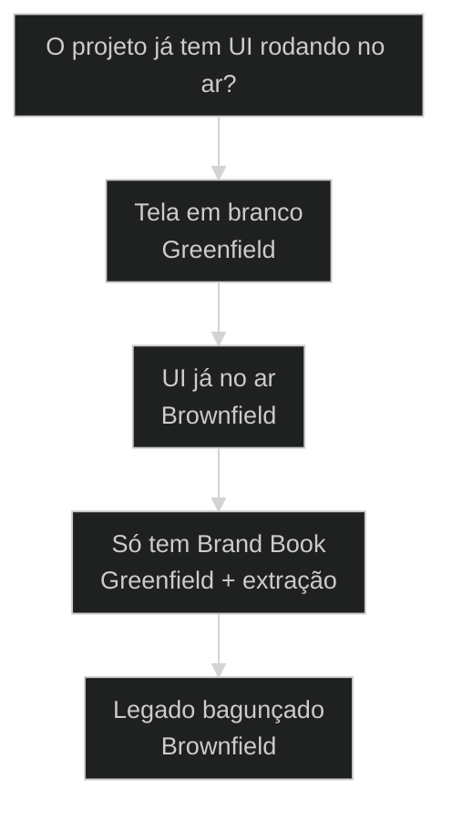
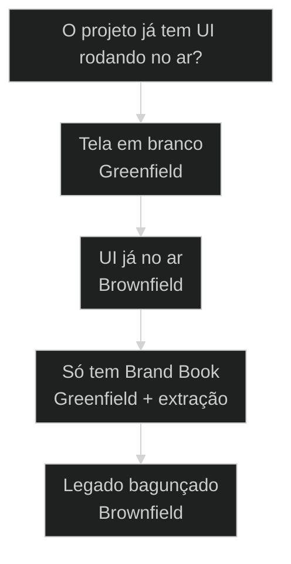

# Design System: greenfield versus brownfield

← [[53-brownfield-enhancement|Brownfield Enhancement: como adicionar feature em código legado]] · ↑ [[modulos/Módulo 6 - Brownfield e Greenfield|M6]] · ⌂ [[cursos/AIOX Advanced/README|Curso]] · → [[54-reuse-adapt-create-heuristica|REUSE > ADAPT > CREATE: a heurística antes de criar nada]]

## Conceitos

- [[DESIGN md|DESIGN.md]]

## Mapa desta aula

Decisão-chave da aula — O projeto já tem UI rodando no ar?



> Leia o diagrama antes do texto longo. Depois volte e confira.

> Construir um design system do zero e atomizar um que já existe são dois processos diferentes. Greenfield começa em branco. [[Brownfield Discovery|Brownfield]] começa com o que está no ar. A pergunta certa decide o caminho antes de você abrir o editor.

**Objetivos de aprendizagem:**
- Nomear os dois pontos de partida de um design system no AIOX: greenfield e brownfield. _(remember)_
- Distinguir o processo greenfield (zero a Storybook) do processo brownfield (atomizar o existente). _(understand)_
- Escolher o processo certo a partir do estado do projeto antes de abrir o editor. _(apply)_
- Explicar por que [[DESIGN md|DESIGN.md]] funciona como ponto de entrada único para os dois caminhos. _(understand)_

---

## Dois pontos de partida, dois processos

*Design AIOX · Design system greenfield versus brownfield*

Greenfield é a tela em branco: você desenha do zero até um Storybook. Brownfield é a UI que já está no ar: você atomiza o que existe em tokens e componentes. Confundir os dois faz você rodar o processo errado e brigar com o projeto.

- **2**: pontos de partida: zero ou legado
- **1**: ponto de entrada comum: DESIGN.md
- **3**: aulas condensadas neste master

- **status**: design system pipeline
- **meta**: greenfield=zero a storybook
- **meta**: brownfield=atomizar o existente
- **meta**: entrada=DESIGN.md canonico
- **ready**: ready to atomize

**Legenda de cores**

Mapa semantico do processo

- **Greenfield** (signal): comeca do zero, sem UI legada
- **Brownfield** (insight): atomiza o que ja esta no ar
- **DESIGN.md** (bench): ponto de entrada canonico do design system
- **Cloud Design** (action): skill e [[Squad|squad]] que materializam o processo
- **Erro comum** (pain): rodar o processo greenfield num projeto com legado

---

## Comece pela pergunta certa

Antes de comparar os dois processos passo a passo, fixe a pergunta única: o projeto já tem UI no ar? Se não tem, é greenfield. Se tem, é brownfield. Todo o resto deriva daí.

**Como ler esta aula**

1. **A pergunta aparece**: Uma frase separa os dois caminhos: o projeto já tem UI no ar?
2. **Cada processo mostra a cara**: Greenfield desenha do zero até Storybook. Brownfield atomiza o que existe.
3. **Vê o ponto de entrada**: DESIGN.md é a porta única dos dois caminhos, apontável no AIOX.
4. **Decide**: Dado um projeto, você aponta greenfield ou brownfield e justifica.

- **Objetivos da aula** (Nomear os dois pontos de partida: greenfield e brownfield.; Distinguir o processo do zero do processo de atomização.; Escolher o caminho certo pelo estado do projeto.; Explicar por que DESIGN.md é o ponto de entrada único.)
- **Onde você está?** (Começando: foque Mapa Simples e a analogia da casa.; Já usa AIOX: foque Casos Reais e a Decisão.; Vai construir: foque Composição e Métricas.)
- **Leitura prática**: Em cada bloco, procure uma resposta: este projeto começa em branco ou começa no ar? Qual processo isso obriga?

**Ritmo da aula**

A distinção fica clara quando cada peça tem definição curta, exemplo real do framework e o gosto de quando usar.

- G **Pergunta antes do detalhe**: Primeiro o critério que separa, depois cada processo por dentro.
- 1 **Analogia que ancora**: Greenfield é construir num terreno vazio. Brownfield é reformar uma casa habitada.
- 2 **Caso real**: DESIGN.md e a skill Cloud Design são apontáveis no AIOX, não teoria.
- 3 **Recap com decisão**: A aula fecha com o aluno escolhendo o processo para um projeto real.

---

## A diferença sem jargão

Antes dos termos técnicos, a diferença é só isto: num caso você desenha tudo do zero, no outro você organiza o que já existe. O ponto de partida muda o trabalho inteiro.

> **Em uma frase**: Greenfield é construir o design system do zero até um Storybook: nada existe, você define tudo. Brownfield é atomizar uma UI que já está no ar: você extrai tokens e componentes do que já roda. Mesmo destino, ponto de partida oposto.

- **Greenfield começa em branco** -> Não há UI legada. Você define tokens, componentes e o Storybook do zero, sem nada para conciliar.
- **Brownfield começa no ar** -> Já existe UI rodando. O trabalho é atomizar: extrair tokens e componentes do que está vivo, sem quebrar.
- **DESIGN.md é a porta** -> Os dois caminhos entram pelo mesmo ponto: um DESIGN.md que descreve o design system antes de gerar código.
- **Cloud Design materializa** -> A skill e o squad rodam o processo escolhido: do zero a Storybook ou atomizando o existente.
- **O erro caro** -> Rodar o fluxo greenfield num projeto que tem legado. Você ignora o que está no ar e cria conflito.

**Diagrama principal: do estado do projeto ao processo**

1. **Estado do projeto**: Pergunte primeiro: já existe UI no ar ou é tela em branco?
2. **Caminho**: Branco vira greenfield. No ar vira brownfield. A escolha trava aqui.
3. **DESIGN.md**: Os dois passam pelo ponto de entrada canônico antes de gerar código.
4. **Saída**: Um design system materializado: tokens, componentes e Storybook.

**O que a distinção evita**
- Rodar o processo do zero num projeto que tem legado.
- Tratar greenfield e brownfield como o mesmo fluxo.
- Ignorar a UI que já está no ar e criar conflito.
- Pular o DESIGN.md e gerar código sem ponto de entrada.

**O que ela força**
- Perguntar o estado do projeto antes de abrir o editor.
- Escolher greenfield para tela em branco, brownfield para legado.
- Atomizar o existente em vez de reescrever por cima.
- Entrar pelo DESIGN.md nos dois caminhos.

---

## A analogia do terreno e da casa

A forma mais rápida de fixar a diferença: greenfield é construir num terreno vazio; brownfield é reformar uma casa habitada. O terreno vazio aceita qualquer planta. A casa habitada impõe paredes que já existem.

- **Greenfield = o terreno vazio**: Nada construído ainda. Você escolhe a planta, levanta as paredes e define cada acabamento do zero. Liberdade total, zero legado para conciliar.
- **Brownfield = a casa habitada**: A casa já está de pé e tem gente morando. Você reforma sem derrubar tudo: mapeia o que existe, organiza cômodo a cômodo, sem desalojar.
- **DESIGN.md = a planta na mesa**: Os dois projetos passam pela planta antes da obra. No terreno vazio ela é desenhada do zero; na casa habitada ela é levantada do que já está construído.
- **Cloud Design = a equipe de obra**: A equipe executa a planta. Mesma equipe nos dois casos, processos diferentes: erguer do zero ou reformar com a casa ocupada.

> **E quando o terreno tem uma construção antiga?**: Aí é brownfield, não greenfield. O erro clássico é olhar para uma casa velha e tratar como terreno vazio: você projeta ignorando as paredes que já existem e a reforma vira demolição acidental. Se há algo no ar, atomize primeiro.

---

## Greenfield versus brownfield: o critério legado

Esta é a escolha que define o processo inteiro. Os dois produzem um design system, então parecem o mesmo trabalho. O critério legado separa de vez: existe UI no ar ou não?

**Greenfield (terreno vazio)**
- Parte do zero: nenhuma UI legada para conciliar.
- Define tokens e componentes sem restrição prévia.
- Vai do nada até um Storybook completo.
- Liberdade alta, risco de divergir do que a marca já tem.

**Brownfield (casa habitada)**
- Parte do que já roda: atomiza a UI existente.
- Extrai tokens e componentes do que está no ar.
- Reorganiza sem quebrar o que funciona.
- Liberdade menor, fidelidade ao existente alta.

> **A pergunta que separa**: Pergunte: este projeto já tem UI rodando? Se não tem, é greenfield: desenhe do zero até Storybook. Se tem, é brownfield: atomize o existente em tokens e componentes. Greenfield projeta o futuro; brownfield organiza o presente.

- **Greenfield com brownfield**: Os dois entregam um design system, então parecem o mesmo processo.
- **Brownfield com reescrever tudo**: Reformar parece a desculpa para derrubar e refazer do zero.
- **DESIGN.md com o código final**: Os dois descrevem o design, então parecem a mesma camada.

---

## Os dois processos existem de verdade no AIOX

A distinção não é teoria. O AIOX tem DESIGN.md como ponto de entrada e o squad design-ops que materializa os dois caminhos. Estes dois casos mostram o processo greenfield e o brownfield com peças reais do framework.

- **Onde o processo vive no AIOX**: DESIGN.md é o ponto de entrada canônico do design system, e o squad design-ops materializa os dois caminhos. A skill Cloud Design roda o passo a passo: do zero a Storybook no greenfield, ou atomizando o existente no brownfield. Não é abstração: tem porta de entrada e squad dono. Players: DESIGN.md, Cloud Design, design-ops, Brand Book, Storybook.
- **O que muda a decisão**: A pergunta não é o tamanho do projeto. É se já existe UI no ar. Projeto novo pede greenfield, do zero. Projeto com legado pede brownfield, atomizando. O critério é o estado, não a ambição.

**Cada peça num eixo**

A distinção vira sistema quando cada peça tem definição, lar no framework e o tipo de projeto que resolve.

- **Greenfield**: O processo do zero. Define tokens e componentes sem legado, até um Storybook.
- **Brownfield**: O processo de atomização. Extrai tokens e componentes do que já está no ar.
- **DESIGN.md**: O ponto de entrada. Descreve o design system antes de gerar código, nos dois caminhos.
- **Brand Book**: A fonte de extração no brownfield. Os tokens da marca saem dele.

**Colunas:** Peça | Greenfield ou brownfield? | Sinal de uso certo | Sinal de erro

- Ponto de partida: Greenfield ou brownfield? | Estado do projeto checado antes de abrir o editor. | Processo escolhido por hábito, não pelo legado.
- Atomização: Greenfield ou brownfield? | UI existente extraída em tokens e componentes. | UI legada reescrita por cima, legado jogado fora.
- DESIGN.md: Greenfield ou brownfield? | Design system descrito antes do código, nos dois caminhos. | Código gerado direto, sem ponto de entrada.
- Brand Book: Greenfield ou brownfield? | Tokens da marca extraídos da fonte no brownfield. | Tokens inventados ignorando o Brand Book existente.

### Caso: Greenfield: do zero até o Storybook

Sem nenhuma UI legada, o processo greenfield desenha o design system do zero: define tokens, componentes e chega num Storybook navegável.

- Começou como: Um projeto novo, tela em branco, sem nenhum componente ou token definido.
- Virou: Um design system completo, do DESIGN.md até um Storybook com componentes atômicos.
- Prova: MASTER-PC-04 documenta o processo greenfield (aula-04 PC-01: zero a Storybook) com DESIGN.md como ponto de entrada (t2-aula-6 PC-03).
- Lição: Sem legado, o caminho é desenhar do zero pela porta do DESIGN.md, não improvisar componente solto.

### Caso: Brownfield: atomizar a UI que já está no ar

Quando a UI já roda, o processo brownfield não reescreve: ele atomiza. Extrai tokens e componentes do que existe, inclusive do Brand Book da marca.

- Começou como: Uma UI já no ar, sem design system formal: estilos espalhados, componentes não atômicos.
- Virou: Tokens e componentes atomizados a partir do existente, com o Brand Book como fonte de extração.
- Prova: MASTER-PC-04 documenta o processo brownfield (aula-04 PC-02: atomizar) e a extração de Brand Book (aula-04 PC-04).
- Lição: Atomizar o existente preserva o que funciona; reescrever por cima joga fora o legado de graça.

---

## Como DESIGN.md, Cloud Design e o squad se combinam

DESIGN.md, a skill Cloud Design e o squad design-ops não são rivais; são camadas. O DESIGN.md descreve, a skill gera, o squad governa. Entender a direção evita pular o ponto de entrada e gerar código solto.

**estado do projeto decide o caminho, design.md descreve, cloud design gera**

1. **Estado decide**: O projeto tem UI no ar? A resposta escolhe greenfield ou brownfield.
2. **DESIGN.md descreve**: O design system é descrito no ponto de entrada antes do código.
3. **Cloud Design gera**: A skill materializa tokens e componentes a partir do DESIGN.md.
4. **Storybook entrega**: O processo fecha num Storybook navegável com componentes atômicos.
5. **Squad governa**: O design-ops mantém o processo consistente entre execuções.

- **1. Descrição (DESIGN.md)**: O que o design system é. O ponto de entrada que descreve tokens, componentes e regras antes de qualquer código. A intenção registrada, legível. [WHAT, ponto de entrada, DESIGN.md]
- **2. Geração (Cloud Design)**: Como o design system vira código. A skill que lê o DESIGN.md e materializa tokens, componentes e Storybook, no caminho greenfield ou brownfield. [HOW, skill, gera código]
- **3. Governança (design-ops)**: Quem mantém o processo consistente. O squad que governa a taxonomia atômica, os tokens e a fidelidade ao Brand Book entre execuções. [WHO, squad, consistência]

---

## Greenfield ou brownfield?

Antes de abrir o editor, decida o caminho pelo estado do projeto. O critério economiza tempo quando você escolhe pelo legado, não pela vontade de começar tudo do zero.

**Árvore de decisão**
_Responda pelo estado do projeto antes de pensar em quanta tela vai desenhar._



- **Tela em branco** — Projeto novo, sem nenhuma UI legada para conciliar.
  → _Greenfield_
  Ex.: Vá de greenfield. Entre pelo DESIGN.md e desenhe do zero até o Storybook.
- **UI já no ar** — Produto rodando, com estilos e componentes existentes.
  → _Brownfield_
  Ex.: Vá de brownfield. Atomize o existente e extraia tokens do Brand Book.
- **Só tem Brand Book** — Não há UI no ar, mas existe um Brand Book da marca a respeitar.
  → _Greenfield + extração_
  Ex.: Greenfield com extração: desenhe do zero, mas tire os tokens do Brand Book.
- **Legado bagunçado** — UI no ar, mas inconsistente, sem tokens, com estilos repetidos.
  → _Brownfield_
  Ex.: Brownfield. Atomize: o valor inteiro é organizar o que existe sem reescrever.

**Gate:** Qual é o gate? — _Sem gate, você começa do zero por reflexo. Responda: existe UI no ar? Se não, greenfield. Se sim, brownfield, atomizando o existente em vez de reescrever por cima._

> **Regra do critério único**: A escolha não é pela ambição do projeto; é pelo legado. Se há UI no ar, brownfield é o caminho: atomize. Se a tela está em branco, greenfield: desenhe do zero. Rodar greenfield num projeto com legado é demolição acidental; rodar brownfield onde não há nada é atomizar o vazio.

---

## Rotas de materialização

Cada caminho até um design system tem um modo típico de disparo. Saber a rota evita escolher certo o processo e materializar do jeito errado.

#### Construir do zero
Quando o projeto é novo e não há UI legada para conciliar.
1. **Sinal: projeto novo, tela em branco, sem componentes.
2. **Pergunta: há alguma UI no ar a respeitar? não.
3. **Ação: descrever o DESIGN.md e gerar via Cloud Design.
4. **Resultado: tokens, componentes e Storybook do zero.

#### Atomizar o existente
Quando há UI no ar e um Brand Book a respeitar.
1. **Sinal: produto rodando, estilos espalhados, sem tokens.
2. **Pergunta: o que já existe pode ser extraído? sim.
3. **Ação: atomizar a UI e extrair tokens do Brand Book.
4. **Resultado: componentes atômicos a partir do que rodava.

#### Instalar a skill e o squad
Quando o processo precisa rodar de forma repetível no projeto.
1. **Sinal: o processo de design system vai se repetir.
2. **Pergunta: a skill e o squad estão instalados? não.
3. **Ação: instalar a skill Cloud Design e o squad design-ops.
4. **Resultado: o processo disponível para rodar quando preciso.

**Rodar greenfield**
Use quando o projeto é novo e não há UI legada.
- `descrever DESIGN.md`: registrar tokens, componentes e regras no ponto de entrada.
- `gerar via Cloud Design`: materializar do DESIGN.md até o Storybook.

**Rodar brownfield**
Use quando há UI no ar e Brand Book a respeitar.
- `extrair do existente`: atomizar a UI e tirar tokens do Brand Book.
- `consolidar no DESIGN.md`: descrever o design system a partir do real.

**Instalar o pipeline**
Use quando o processo vai se repetir no projeto.
- `instalar Cloud Design`: deixar a skill disponível para gerar o design system.
- `instalar design-ops`: deixar o squad governando taxonomia e tokens.

---

## Modelos para ler melhor

Visualizações rápidas para o aluno comparar greenfield e brownfield, os riscos de cada escolha e o grau de liberdade que cada caminho carrega.

- **Greenfield**: alto (tela em branco aceita qualquer planta.)
- **Greenfield com Brand Book**: médio (do zero, mas com tokens da marca a respeitar.)
- **Brownfield**: baixo (a UI existente impõe o que já está no ar.)

- **Greenfield sobre legado**: greenfield (demolição acidental do que funcionava.)
- **Brownfield no vazio**: brownfield (atomizar nada, processo sem fonte.)
- **Pular o DESIGN.md**: entrada (código gerado sem ponto de partida.)

**Matriz de Decisão do Aluno**

Em dúvida, escolha a célula que melhor descreve o seu projeto.

- **Projeto novo, sem nada**: Greenfield. Desenhe do zero até Storybook.
- **UI no ar, sem tokens**: Brownfield. Atomize o existente.
- **Só Brand Book, sem UI**: Greenfield com extração do Brand Book.
- **Legado bagunçado**: Brownfield. O valor é organizar sem reescrever.
- **Só descrever o sistema**: Escreva o DESIGN.md. A geração vem depois.
- **Não sabe ainda**: Pergunte: tem UI no ar? Não, greenfield. Sim, brownfield.

- **Sinal de processo saudável**: caminho escolhido pelo critério legado / Brand Book respeitado como fonte de tokens / greenfield rodado por cima de UI existente
- **Separação de responsabilidades**: DESIGN.md descreve, Cloud Design gera, design-ops governa / skill e squad instalados para repetir o processo / código gerado sem passar pelo DESIGN.md

---

## O que cada peça carrega

Cada peça tem uma anatomia mínima. Saber o que cada uma guarda ajuda a reconhecer quando você está usando a peça errada para o estado do projeto.

- **Greenfield: o processo do zero**: Tela em branco. Define tokens e componentes sem legado, até um Storybook. Liberdade alta.
- **Brownfield: o processo de atomização**: UI no ar. Extrai tokens e componentes do existente. Fidelidade ao que roda.
- **DESIGN.md: o ponto de entrada**: Descreve o design system antes do código. Porta única dos dois caminhos.
- **Cloud Design: a skill geradora**: Lê o DESIGN.md e materializa tokens, componentes e Storybook.
- **Brand Book: a fonte de extração**: Os tokens da marca saem dele no brownfield. Ignorá-lo inventa o que já existe.

---

## Métricas do design system

Sem telemetria, a saúde do design system vira fé. Estas perguntas separam um processo bem escolhido de um fluxo rodado por hábito.

**Colunas:** Métrica | Pergunta | Sinal saudável | Sinal de risco

- Escolha do caminho: O processo bate com o estado do projeto? | Legado checado antes de escolher greenfield ou brownfield. | Processo escolhido por hábito, não pelo legado.
- Atomização: A UI existente virou tokens e componentes? | Estilos repetidos extraídos em primitivos atômicos. | Legado reescrito por cima em vez de atomizado.
- Fidelidade ao Brand Book: Os tokens saem da fonte da marca? | Tokens extraídos do Brand Book, não inventados. | Tokens genéricos ignorando o Brand Book existente.
- Ponto de entrada: O código nasceu de um DESIGN.md? | Design system descrito antes do código, nos dois caminhos. | Código gerado direto, sem DESIGN.md de partida.

---

## Quando resistir ao processo do zero

A distinção ajuda mais quando você resiste ao reflexo de começar tudo do zero. Greenfield é tentador porque é limpo, mas num projeto com legado ele destrói valor. O caminho certo é o do estado, não o do conforto.

**Quando ir de greenfield**
- O projeto é novo e não há nenhuma UI no ar.
- Você define tokens e componentes sem legado a conciliar.
- Existe só um Brand Book, sem UI, e você extrai dele do zero.
- Reescrever do zero não joga fora nada que funcionava.

**Quando ir de brownfield**
- Já existe UI rodando que precisa ser preservada.
- Há estilos e componentes a extrair em tokens atômicos.
- Um Brand Book da marca impõe os tokens a respeitar.
- O valor está em organizar o existente, não em recomeçar.

---

## Exercício: decida o caminho

Pegue um projeto real seu e aplique o critério. O objetivo não é começar tudo do zero; é apontar se o projeto tem UI no ar antes de abrir o editor.

**Um projeto, cinco perguntas**
```yaml
design_system:
  projeto: "o que precisa de design system?"
  ui_no_ar: "ja existe UI rodando? sim | nao"
  caminho: "greenfield | brownfield"
  fonte_tokens: "design_md_do_zero | extrair_do_brand_book"
  gate: "por que nao o outro caminho? (se brownfield, o que atomizar primeiro?)"

```
*O acerto não é ir de greenfield. É provar que você escolheu o caminho pelo critério legado e sabe justificar por que o outro custaria mais sem entregar mais.*

**Exemplo preenchido: produto novo versus app herdado**

- **Projeto A**: Preciso de design system para um app que ainda nao tem nenhuma tela.
- **UI no ar A**: Nao. E tela em branco, nada construido ainda.
- **Caminho A**: Greenfield. Descrevo o DESIGN.md e gero do zero ate o Storybook.
- **Projeto B**: Herdei um app rodando com estilos espalhados e sem tokens.
- **Caminho B**: Brownfield. Atomizo a UI existente e extraio os tokens do Brand Book.
- **Gate B**: Greenfield aqui derrubaria o que ja funciona; o valor esta em organizar o existente, nao recomecar.

- 1. **Projeto**: Descreva em uma frase o produto cujo design system você quer construir.
- 2. **Tem UI no ar?**: Responda: já existe UI rodando ou é tela em branco?
- 3. **Caminho**: Aponte greenfield (do zero) ou brownfield (atomizar) com base na resposta.
- 4. **Fonte**: Diga de onde saem os tokens: do zero no DESIGN.md ou extraídos do Brand Book.
- 5. **Gate**: Justifique por que não escolheu o outro caminho. Para brownfield, aponte o que vai atomizar primeiro.

**Funcionou se:**

- O aluno escolhe o caminho pelo critério legado, não pela vontade de começar do zero.
- O aluno separa o processo do zero (greenfield) do processo de atomização (brownfield).
- O aluno aponta a fonte dos tokens: DESIGN.md do zero ou extração do Brand Book.

---

## Glossário do design system

Tradução dos termos para alguém que está vendo a distinção greenfield versus brownfield pela primeira vez.

- **Greenfield**: O processo de construir o design system do zero, sem UI legada, do DESIGN.md até um Storybook.
- **Brownfield**: O processo de atomizar uma UI que já está no ar, extraindo tokens e componentes do existente.
- **Atomizar**: Extrair os primitivos (tokens, componentes atômicos) de uma UI existente, sem reescrever por cima.
- **DESIGN.md**: O ponto de entrada canônico do design system. Descreve tokens, componentes e regras antes de gerar código, nos dois caminhos.
- **Brand Book**: A fonte de extração de tokens da marca no brownfield. Os primitivos da identidade saem dele.
- **Cloud Design**: A skill que lê o DESIGN.md e materializa tokens, componentes e Storybook, no caminho greenfield ou brownfield.
- **Storybook**: O resultado navegável do processo greenfield: componentes atômicos visíveis e documentados.
- **design-ops**: O squad que governa a taxonomia atômica, os tokens e a fidelidade ao Brand Book entre execuções.

> **Portão da aula**: A aula só está no padrão quando o aluno nomeia greenfield e brownfield, distingue o processo do zero (do DESIGN.md ao Storybook) do processo de atomização (extrair tokens e componentes do existente) e consegue apontar, para um projeto real, se já existe UI no ar (brownfield) ou se a tela está em branco (greenfield) antes de abrir o editor.

***


---

## Navegação

← [[53-brownfield-enhancement|Brownfield Enhancement: como adicionar feature em código legado]] · ↑ [[modulos/Módulo 6 - Brownfield e Greenfield|M6]] · ⌂ [[cursos/AIOX Advanced/README|Curso]] · → [[54-reuse-adapt-create-heuristica|REUSE > ADAPT > CREATE: a heurística antes de criar nada]]
