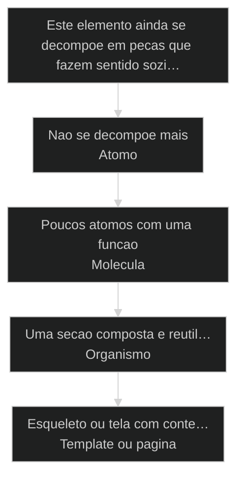
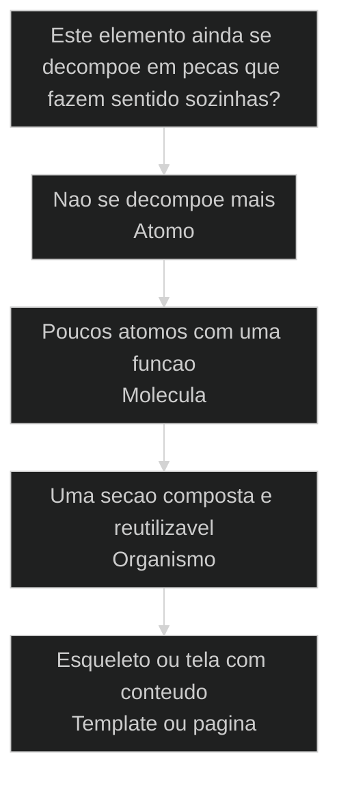

# Design atomico: a interface se monta de peca pequena pra peca grande

← [[41-design-system-e-decisao|Design system é decisão, não estética]] · ↑ [[modulos/Módulo 9 - Design System|M9]] · ⌂ [[cursos/AIOX Advanced/README|Curso]] · → [[56-tailwind-shadcn-storybook|Tailwind + ShadCN + Storybook: stack canonical para IA]]

## Mapa desta aula

Decisão-chave da aula — Este elemento ainda se decompoe em pecas que fazem sentido sozi…



> Leia o diagrama antes do texto longo. Depois volte e confira.

> [[Brad Frost]] pegou emprestada a quimica: toda interface se decompoe em atomos, que se combinam em moleculas, que formam organismos, que entram em templates e viram paginas. A ordem nao e decoracao: e a hierarquia que faz a tela ser remontavel em vez de um bloco unico que voce so consegue copiar inteiro ou jogar fora.

**Objetivos de aprendizagem:**
- Nomear os niveis do design atomico de Brad Frost: atomo, molecula, organismo, template e pagina. _(remember)_
- Distinguir uma interface decomposta em pecas reutilizaveis de uma tela tratada como bloco unico, pelo que cada uma permite fazer quando voce quer mudar so um pedaco. _(understand)_
- Classificar, diante de um elemento de interface real, em qual nivel atomico ele entra: atomo, molecula ou organismo. _(apply)_
- Explicar por que decompor a interface em pecas pequenas reaproveitaveis reduz retrabalho e mantem a tela consistente. _(understand)_

---

## Design atomico: a tela se monta de atomo pra pagina, nao de bloco unico

*Design atomico de Brad Frost · interface remontavel, nao bloco unico*

Brad Frost pegou emprestada a quimica para explicar interface: toda tela se decompoe em atomos (a peca minima), que se combinam em moleculas, que formam organismos, que entram num template e viram pagina. Quem ve a tela como bloco unico so consegue copiar inteira ou jogar fora. Quem ve as pecas remonta, reaproveita e troca um pedaco sem refazer o resto.

- **5**: niveis: atomo, molecula, organismo, template, pagina
- **atomo**: a peca minima indivisivel que todo o resto reusa
- **0**: telas tratadas como bloco unico que so se copia ou descarta

- **status**: design atomico
- **meta**: atomo=peca minima indivisivel
- **meta**: molecula=poucos atomos com uma funcao
- **meta**: organismo=secao montavel da interface
- **ready**: ready to decompose

**Legenda de cores**

Mapa semantico dos niveis do design atomico

- **Atomo** (signal): a peca minima indivisivel da interface: um botao, um label, um input
- **Molecula** (insight): poucos atomos combinados numa unidade com funcao propria: campo de busca
- **Organismo** (bench): uma secao montavel e reutilizavel: header, card de produto
- **Template e pagina** (action): o esqueleto que arruma os organismos e a pagina com conteudo real
- **Tela como bloco unico** (pain): interface que nao se decompoe: copia inteira ou joga fora, nunca remonta

---

## Da cohort: Brad Frost de verdade vs zip de moda

*T1 + T2 · WhatsApp*

Realidade do grupo Advanced — cicatriz, não slide.

Alan no grupo: o design-system no espírito Brad Frost é um dos poucos que
ele **criou de verdade** e usa há meses — o resto muitas vezes é rascunho da
turma ou pack compartilhado.

Isso muda o peso desta aula: [[Atomo|átomo]] → molécula → organismo não é teoria de livro.
É o contrato que deixa a IA **recompor** interface sem inventar padding novo a
cada prompt. A cohort circulou dezenas de design.zip; o filtro é sempre o mesmo —
tem taxonomia atômica e SoT, ou é só export do Figma com nome chique?

> **Âncora de campo**: Átomo sem SoT é sticker. Átomo com Storybook é lei.

> **Materiais / FAQ**: Cruzar com 56 Tailwind/ShadCN/Storybook · prior-art: design system que Alan realmente opera

---

## Comece pela pergunta certa

Antes de falar de componente ou biblioteca, fixe a pergunta unica: esta tela e um bloco unico ou um conjunto de pecas que se remontam? Se voce so consegue copiar a tela inteira, voce nao tem design atomico, tem um monolito visual. A primeira acao nao e desenhar a tela grande, e enxergar a peca minima que tudo o resto reusa.

**Como ler esta aula**

1. **A pergunta aparece**: Uma frase separa a tela-bloco da tela decomposta em pecas.
2. **Cada nivel mostra a cara**: Atomo e a peca minima, molecula junta poucos atomos, organismo monta a secao.
3. **Ve o caso real**: O AIOX usa a taxonomia atomic-design no design-ops: atomos, moleculas e organismos sao pratica real do repositorio.
4. **Classifica**: Diante de um elemento de interface real, voce aponta se ele e atomo, molecula ou organismo.

- **Objetivos da aula** (Nomear os niveis do design atomico: atomo, molecula, organismo, template e pagina.; Distinguir interface decomposta em pecas de tela tratada como bloco unico.; Classificar um elemento real em atomo, molecula ou organismo.; Explicar por que decompor em pecas pequenas reduz retrabalho e mantem a tela consistente.)
- **Onde voce esta?** (Comecando: foque Mapa Simples e a analogia da quimica.; Ja usa AIOX: foque Casos Reais e a Classificacao.; Vai montar uma interface: foque os Niveis e as Metricas.)
- **Leitura pratica**: Em cada bloco, procure uma resposta: este pedaco da tela eu consigo nomear como atomo, molecula ou organismo e reusar em outro lugar, ou ele so existe colado neste bloco unico?

**Ritmo da aula**

A diferenca fica clara quando cada nivel tem definicao curta, exemplo real do AIOX e o gosto de quando ele entra.

- G **Pergunta antes do detalhe**: Primeiro o criterio que separa bloco unico de pecas remontaveis, depois cada nivel por dentro.
- 1 **Analogia que ancora**: Brad Frost pegou a quimica: atomo e a peca indivisivel, molecula junta atomos, organismo e a estrutura maior. A interface se monta igual.
- 2 **Caso real**: O AIOX trata interface por niveis: a taxonomia atomic-design vive no [[Squad|squad]] design-ops como regra do repositorio.
- 3 **Recap com classificacao**: A aula fecha com voce classificando um elemento de interface real em atomo, molecula ou organismo.

---

## A diferenca sem jargao

Antes dos termos tecnicos, a diferenca e so isto: tela como bloco unico e uma interface que voce so consegue copiar inteira ou jogar fora, porque os pedacos estao colados; design atomico ve a mesma tela como um conjunto de pecas nomeadas, do atomo (a peca minima) ate a pagina, e cada peca pode ser trocada, reusada e remontada sem refazer o resto.

> **Em uma frase**: Tela como bloco unico trata a interface como uma coisa so: o botao, o campo, o cabecalho estao colados, e mudar um pedaco obriga a mexer no bloco inteiro. Design atomico inverte: a tela e a soma de pecas com nome. O atomo e a peca minima indivisivel (um botao, um label, um input). Atomos se juntam em moleculas (um campo de busca = label + input + botao). Moleculas e atomos formam organismos (um cabecalho inteiro). Organismos entram num template (o esqueleto) e o template com conteudo real vira a pagina. A regra muda: enxergue a peca pequena primeiro, e a tela grande se monta a partir dela, em vez de nascer como um bloco que nao se desmonta.

- **Atomo e a peca minima** -> O elemento que nao se decompoe mais e ainda faz sentido na interface: um botao, um label, um campo de input. Sem reconhecer o atomo, voce trata pedacos repetiveis como detalhe colado no bloco.
- **Molecula junta poucos atomos** -> Alguns atomos combinados numa unidade com funcao propria. Label + input + botao viram um campo de busca. A molecula e a menor peca que ja resolve algo sozinha.
- **Organismo monta a secao** -> Moleculas e atomos formam uma secao reutilizavel e relativamente complexa: um cabecalho com logo, navegacao e busca. O organismo e uma parte da tela que se reaproveita inteira.
- **Template e pagina fecham** -> O template e o esqueleto que arruma os organismos sem conteudo final. A pagina e o template preenchido com conteudo real. A tela grande nasce da composicao, nao de um bloco escrito de uma vez.
- **O erro caro** -> Tratar a tela como bloco unico: tudo colado, nada nomeado. Para mudar um botao voce mexe na tela inteira, e para reusar um pedaco voce copia tudo. Consistencia morre e o retrabalho vira rotina.

**Diagrama principal: do atomo a pagina**

1. **Atomo**: A peca minima indivisivel da interface.
2. **Molecula**: Poucos atomos juntos com uma funcao propria.
3. **Organismo**: Uma secao montavel e reutilizavel da tela.
4. **Template e pagina**: O esqueleto que arruma organismos e a pagina com conteudo real.

**O que o design atomico evita**
- Tratar a tela como bloco unico, tudo colado.
- Copiar a tela inteira para reaproveitar um pedaco.
- Mexer no bloco todo para trocar um botao.
- Telas que repetem o mesmo elemento sem nome comum.

**O que ele forca**
- Enxergar a peca minima (o atomo) primeiro.
- Combinar atomos em moleculas e organismos nomeados.
- Trocar uma peca sem refazer o resto da tela.
- Reusar o mesmo organismo em varias paginas.

---

## A analogia da quimica

A forma mais rapida de fixar a hierarquia e a propria origem do nome: Brad Frost pegou emprestada a quimica. Na materia, atomos sao as pecas indivisiveis, atomos se ligam em moleculas, e moleculas formam estruturas maiores. A interface se monta igual: a peca minima primeiro, a composicao depois.

- **Atomo = a peca indivisivel**: Na quimica, o atomo e a menor unidade que ainda e aquele elemento. Na interface, e o botao, o label, o input: a peca que voce nao quebra mais sem perder o sentido.
- **Molecula = atomos ligados com funcao**: Na quimica, atomos se ligam e a molecula ja tem propriedade propria. Na interface, label + input + botao viram um campo de busca: poucos atomos que juntos ja resolvem algo.
- **Organismo = estrutura montada**: Moleculas e atomos formam uma estrutura maior e reutilizavel: um cabecalho completo, um card de produto. O organismo e uma secao inteira da tela que se reaproveita.
- **Template e pagina = a composicao final**: O template arruma os organismos num esqueleto sem conteudo final. A pagina e o template preenchido com conteudo real. A tela grande nasce da composicao das pecas, nao de um bloco escrito de uma vez.

> **E a atualizacao do Foundations?**: O proprio Brad Frost atualizou o modelo: surgiu uma camada de Foundations que engloba os atomos. Foundations sao as decisoes base (cores, tipografia, espacamento, os tokens) das quais os atomos ja nascem. Para esta aula, o que importa e a hierarquia de composicao (atomo -> molecula -> organismo -> template -> pagina); guarde so que a versao recente coloca Foundations como o solo de onde os atomos brotam.

---

## Atomo versus organismo: o criterio da decomposicao

Esta e a confusao mais comum de quem comeca: chamar tudo de componente sem distinguir nivel. Um botao e um organismo? Um cabecalho e um atomo? O criterio que separa e a decomposicao: o atomo nao se quebra mais; o organismo e justamente uma composicao de pecas menores.

**Tela como bloco unico**
- Trata todo pedaco como detalhe colado no bloco.
- Da o mesmo peso a um botao e a um cabecalho inteiro.
- Descobre a repeticao quando copia a tela toda.
- Refaz tudo quando um elemento precisa mudar.

**Design atomico (interface decomposta)**
- Reconhece o atomo: a peca que nao se quebra mais.
- Separa nivel: atomo, molecula, organismo, template.
- Reusa a molecula e o organismo entre paginas.
- Troca uma peca sem mexer no resto da tela.

> **A pergunta que separa**: Pergunte de um elemento: ele ainda se quebra em pecas menores que fazem sentido sozinhas? Se nao quebra mais (um botao, um label), e atomo. Se e poucos atomos juntos com uma funcao (um campo de busca), e molecula. Se e uma secao composta de varias pecas e se reusa inteira (um cabecalho, um card de produto), e organismo. Confundir os niveis e tratar a tela como bloco unico de novo, so que com nome bonito: o erro nao e o vocabulario, e parar de enxergar a peca minima.

- **Atomo com qualquer componente pequeno**: Os dois sao pecas de interface, entao parecem o mesmo nivel.
- **Molecula com organismo**: Os dois combinam pecas menores, entao parecem o mesmo passo.
- **Template com pagina**: Os dois mostram a tela arrumada, entao parecem a mesma coisa.

---

## Design atomico existe de verdade no AIOX

O modelo de Brad Frost nao e so teoria de livro. No AIOX, a interface e tratada por niveis atomicos: o squad design-ops mantem uma taxonomia atomic-design como regra do repositorio, em vez de cada tela ser um bloco unico. Estes dois casos mostram como o ambiente troca o monolito visual pela interface decomposta em pecas nomeadas.

- **Onde o design atomico vive no AIOX**: O AIOX trata a interface por niveis: o squad design-ops governa com a regra atomic-design-taxonomy, os atomos nascem de Foundations registradas em token ([[DESIGN md|DESIGN.md]], design-md-convention) e a composicao sobe ate a pagina. A hierarquia nao e abstracao: e squad, regra e token existindo no repositorio, para que toda tela se monte das mesmas pecas em vez de ser um bloco a parte. Players: design-ops, atomic-design-taxonomy, atomos, moleculas, organismos, tokens, DESIGN.md.
- **O que muda a classificacao**: A pergunta nao e se o elemento e grande ou pequeno na tela. E se ele ainda se decompoe em pecas que fazem sentido sozinhas. Nao decompoe mais e atomo. Junta poucos atomos com funcao e molecula. E uma secao inteira reutilizavel e organismo. O criterio e a decomposicao, nao o tamanho aparente.

**Cada nivel num eixo**

A interface vira sistema quando cada nivel tem definicao, lugar na hierarquia e o que ele entrega antes do proximo subir.

- **Atomo**: A peca minima indivisivel. O nivel que evita tratar pedaco repetivel como detalhe colado.
- **Molecula**: Poucos atomos com funcao propria. A menor peca que ja resolve algo e se reusa.
- **Organismo**: Uma secao composta e reutilizavel. A peca que monta varias paginas inteira.
- **Template e pagina**: O esqueleto dos organismos e a pagina com conteudo real. A composicao que fecha a tela.

**Colunas:** Nivel | Decompoe mais? | Sinal de uso certo | Sinal de erro

- Atomo: Decompoe mais? | Nomeia a peca minima indivisivel e a reusa em tudo. | Trata o botao como detalhe colado de uma tela so.
- Molecula: Decompoe mais? | Combina poucos atomos numa unidade com funcao. | Chama de atomo o que ja e combinacao de varios.
- Organismo: Decompoe mais? | Monta uma secao reutilizavel de moleculas e atomos. | Trata a secao inteira como bloco que so se copia.
- Template e pagina: Decompoe mais? | Arruma organismos no esqueleto e preenche com conteudo. | Escreve a tela como bloco unico, sem composicao.

### Caso: O design-ops mantem a taxonomia atomic-design como regra

A hierarquia nao e metafora de aula: o AIOX tem uma regra de repositorio, atomic-design-taxonomy, dentro do squad design-ops. Os pedacos da interface nao nascem colados num bloco: nascem classificados por nivel atomico, com a taxonomia governando o que e atomo, o que e molecula e o que e organismo no codigo do produto.

- Começou como: Interface tratada como bloco unico: cada tela um monolito visual, sem nivel atomico nomeado que separasse a peca minima do organismo inteiro.
- Virou: Um squad design-ops com a regra atomic-design-taxonomy, classificando os componentes por nivel (atomo, molecula, organismo) em vez de bloco unico.
- Prova: O AIOX mantem a regra atomic-design-taxonomy entre as regras locais do design-ops no repositorio: a hierarquia de Brad Frost e taxonomia governada, nao desenho solto.
- Lição: Design de interface e composicao por niveis: tem squad, regra e taxonomia nomeada, nao tela tratada como bloco que so se copia inteiro.

### Caso: Os atomos nascem de Foundations: cores, tipografia e tokens

Na atualizacao recente do modelo, os atomos nao sao o solo: eles brotam de uma camada de Foundations (cores, tipografia, espacamento, os tokens). No AIOX isso e pratica: a decisao visual vira token registrado, e o atomo (um botao, um input) ja nasce consumindo esse token em vez de escolher cor no gosto. A peca minima herda a fundacao, nao a reinventa.

- Começou como: Atomos da interface escolhendo cor e espaco no gosto, sem uma camada de fundacao da qual herdassem as decisoes base.
- Virou: Atomos que nascem de Foundations: cor, tipografia e espacamento vem de tokens registrados, e a peca minima consome a decisao em vez de reinventar.
- Prova: O AIOX trata as decisoes visuais como tokens registrados (DESIGN.md, design-md-convention) e os componentes do nivel atomico consomem esses tokens: a Foundations existe como solo dos atomos no repositorio.
- Lição: Foundations nao e um nivel a mais por capricho: e a fundacao de tokens da qual o atomo herda cor, tipografia e espacamento.

---

## Os niveis do design atomico

O design atomico nao e um monte de componentes em qualquer ordem. E uma hierarquia de niveis nomeados, do atomo a pagina. Cada nivel se compoe do anterior, e a peca minima vem antes da tela grande sempre.

**Fluxo do design atomico**
Os niveis ordenados que transformam pecas minimas em uma pagina inteira, montando de baixo para cima em vez de escrever a tela como bloco.
- **1. Foundations**: As decisoes base (cor, tipografia, espacamento) registradas como tokens dos quais os atomos nascem.
- **2. Atomo**: A peca minima indivisivel: um botao, um label, um input.
- **3. Molecula**: Poucos atomos combinados numa unidade com funcao: um campo de busca.
- **4. Organismo**: Uma secao reutilizavel composta de moleculas e atomos: um cabecalho.
- **5. Template**: O esqueleto que arruma os organismos sem conteudo final.
- **6. Pagina**: O template preenchido com conteudo real: a tela como o usuario ve.

**a peca minima fecha antes da tela montar**

1. **Atomo**: O fluxo nomeia a peca minima da interface.
2. **Molecula**: Atomos combinados viram unidade com funcao.
3. **Organismo**: Moleculas e atomos formam a secao reutilizavel.
4. **Template e pagina**: Os organismos viram esqueleto e o esqueleto vira pagina.

---

## Como atomo, molecula e organismo se combinam

Atomo, molecula e organismo nao sao rivais; sao camadas em sequencia. O atomo e a peca minima, a molecula combina poucos atomos com funcao, o organismo monta a secao. Entender a direcao evita chamar de organismo o que ainda e atomo, ou de atomo o que ja e composicao.

- **1. Atomo (a peca minima)**: A unidade que nao se decompoe mais e ainda faz sentido: um botao, um label, um input. E a unica camada que parte direto da Foundations para a interface visivel. [WHAT, atomo, indivisivel]
- **2. Molecula (a combinacao com funcao)**: Poucos atomos juntos numa unidade que ja resolve algo: label + input + botao = busca. O gate que separa peca reaproveitavel de atomo solto repetido na mao. [WHERE, molecula, funcao]
- **3. Organismo (a secao montada)**: Moleculas e atomos formando uma secao reutilizavel inteira: o cabecalho com logo, navegacao e busca. Zero tela escrita como bloco, maxima reutilizacao por composicao. [HOW, organismo, secao]

---

## Atomo, molecula ou organismo?

Antes de batizar qualquer componente, classifique o nivel atomico do elemento. O criterio economiza tempo quando voce decide pela decomposicao do elemento, nao pelo tamanho que ele ocupa na tela.

**Árvore de decisão**
_Responda pela decomposicao do elemento antes de pensar no tamanho que ele ocupa na tela._



- **Nao se decompoe mais** — O elemento e indivisivel e ainda faz sentido na interface.
  → _Atomo_
  Ex.: E atomo: um botao, um label, um input. A peca minima que tudo o resto reusa.
- **Poucos atomos com uma funcao** — E uma combinacao pequena de atomos que ja resolve algo sozinha.
  → _Molecula_
  Ex.: E molecula: label + input + botao formam um campo de busca.
- **Uma secao composta e reutilizavel** — E uma secao inteira de moleculas e atomos que se reusa por completo.
  → _Organismo_
  Ex.: E organismo: um cabecalho com logo, navegacao e busca.
- **Esqueleto ou tela com conteudo** — E o arranjo dos organismos, com ou sem conteudo final.
  → _Template ou pagina_
  Ex.: Sem conteudo final e template; preenchido com conteudo real e pagina.

**Gate:** Qual e o gate? — _Sem gate, voce chama tudo de componente e perde a peca minima. Responda: o elemento decompoe? Se nao decompoe mais, e atomo. Se junta poucos atomos com funcao, e molecula. Se e uma secao reutilizavel inteira, e organismo. Se e o arranjo dos organismos, e template (sem conteudo) ou pagina (com conteudo)._

> **Regra do criterio unico**: A classificacao nao e pelo tamanho aparente; e pela decomposicao do elemento. Se nao quebra mais, e atomo. Se junta poucos atomos com funcao, e molecula. Se e uma secao reutilizavel, e organismo. Chamar tudo de componente sem distinguir nivel e tratar a tela como bloco unico com nome novo, o erro que faz a peca minima desaparecer de vista.

---

## Rotas de classificacao

Cada tipo de elemento de interface tem um nivel tipico no design atomico. Saber a rota evita classificar certo pela decomposicao e nomear com o nivel errado.

#### Atomo para o elemento que nao se quebra mais
Quando o elemento e a menor unidade que ainda faz sentido na interface.
1. **Sinal: elemento de interface que nao se decompoe mais (botao, label, input).
2. **Pergunta: isso ainda se quebra em pecas com sentido proprio?
3. **Acao: classificar como atomo e nomear a peca minima.
4. **Resultado: peca reusada em todas as moleculas sem reescrever.

#### Molecula para poucos atomos com uma funcao
Quando alguns atomos juntos ja resolvem algo sozinhos.
1. **Sinal: poucos atomos combinados numa unidade que faz uma coisa (busca).
2. **Pergunta: isso ja resolve uma funcao sozinho com poucas pecas?
3. **Acao: classificar como molecula e reusar a combinacao.
4. **Resultado: unidade funcional reaproveitada entre organismos.

#### Organismo para a secao composta e inteira
Quando o elemento e uma secao de moleculas e atomos que se reusa por completo.
1. **Sinal: uma secao da tela composta de varias pecas (cabecalho, card).
2. **Pergunta: isso e uma secao inteira que reuso de uma vez?
3. **Acao: classificar como organismo e montar paginas com ele.
4. **Resultado: secao reaproveitada inteira em varias paginas.

**Extrair a fundacao visual**
Use quando ja existe uma referencia visual e a Foundations precisa virar token.
- `/design-md <url>`: extrair as decisoes base (cor, tipografia, espaco) como DESIGN.md com tokens.
- `DESIGN.md (tokens)`: registrar a Foundations da qual os atomos vao nascer.

**Governar os niveis atomicos**
Use quando a interface precisa ser classificada por nivel, nao tratada como bloco.
- `/DOPS:design-chief`: orquestrar a interface por niveis no squad design-ops.
- `atomic-design-taxonomy`: classificar atomo, molecula e organismo pela taxonomia.

**Compor a interface de baixo pra cima**
Use quando os atomos e moleculas existem e a pagina precisa ser montada deles.
- `/DS:design-chief`: orquestrar a composicao da interface no squad design-system.
- `organismos -> template -> pagina`: subir das pecas montadas ate a pagina com conteudo real.

---

## Modelos para ler melhor

Visualizacoes rapidas para o aluno comparar bloco unico com interface decomposta, os riscos de classificar errado e o grau de reaproveitamento que cada nivel atomico costuma entregar.

- **Atomo (botao, label, input)**: alto (a peca minima reaparece em quase toda molecula e organismo.)
- **Organismo (cabecalho, card)**: medio (a secao inteira se reusa entre varias paginas.)
- **Pagina (tela com conteudo real)**: baixo (a pagina e a composicao final, raramente reusada inteira.)

- **Tratar organismo como bloco unico**: monolito (copia a secao inteira em vez de reusar a peca nomeada.)
- **Chamar molecula de atomo**: confusao (perde a peca minima dentro de uma combinacao maior.)
- **Atomo sem Foundations**: inconsistente (cada peca minima escolhe cor no gosto sem token comum.)

**Matriz de Classificacao do Aluno**

Em duvida, escolha a celula que melhor descreve o seu elemento de interface.

- **Nao decompoe mais**: Atomo. A peca minima indivisivel: botao, label, input.
- **Poucos atomos com funcao**: Molecula. Label + input + botao formam uma busca.
- **Secao reutilizavel inteira**: Organismo. Um cabecalho com logo, navegacao e busca.
- **Arranjo sem conteudo final**: Template. O esqueleto dos organismos no lugar.
- **Arranjo com conteudo real**: Pagina. O template preenchido como o usuario ve.
- **Nao sabe ainda**: Pergunte: isso decompoe mais? Nao, e atomo.

- **Sinal de interface saudavel**: pecas minimas nomeadas como atomos e reusadas em tudo / niveis separados (atomo, molecula, organismo) e rastreaveis / tela escrita como bloco unico, copiada inteira por reflexo
- **Separacao de niveis**: atomo, molecula, organismo e pagina cada um no seu nivel / atomo e molecula em pecas separadas e rastreaveis / tudo chamado de componente sem distinguir o nivel

---

## O que cada nivel carrega

Cada nivel do design atomico tem uma anatomia minima. Saber o que cada um entrega ajuda a reconhecer quando voce esta pulando um nivel ou nomeando a peca com o rotulo errado.

- **Foundations: a fundacao**: As decisoes base em token (cor, tipografia, espaco). O solo do qual o atomo nasce, em vez de escolher visual no gosto.
- **Atomo: a peca minima**: O elemento indivisivel da interface (botao, label, input). A unidade reusada em toda molecula e organismo.
- **Molecula: a combinacao com funcao**: Poucos atomos numa unidade que ja resolve algo (busca). O gate entre peca reaproveitavel e atomo solto repetido.
- **Organismo: a secao montada**: Moleculas e atomos formando uma secao reutilizavel (cabecalho, card). A peca que monta varias paginas inteira.
- **Template e pagina: a composicao**: O esqueleto dos organismos e a tela com conteudo real. A pagina nasce da composicao, nao de um bloco escrito de uma vez.

---

## Metricas do design atomico

Sem telemetria, a saude do design atomico vira fe. Estas perguntas separam uma interface decomposta em pecas reaproveitaveis de uma tela tratada como bloco unico copiado e colado.

**Colunas:** Metrica | Pergunta | Sinal saudavel | Sinal de risco

- Atomo nomeado: A peca minima tem nome e e reusada? | Botao, label e input nomeados e reaproveitados em tudo. | Cada tela reescreve o mesmo botao como detalhe colado.
- Composicao: Moleculas e organismos sobem de atomos? | A busca e o cabecalho se montam de atomos nomeados. | A secao inteira e escrita do zero, sem reusar pecas.
- Reaproveitamento: O mesmo organismo serve varias paginas? | O cabecalho e reusado inteiro entre as paginas. | Cada pagina copia a secao toda em vez de reusar.
- Foundations: Os atomos herdam cor e tipografia de token? | Toda peca minima consome o token registrado. | Cada atomo escolhe cor e espaco no gosto da tela.

---

## Quando nao precisa de tantos niveis

O design atomico ajuda mais quando voce resiste ao reflexo de classificar e abstrair tudo cedo. Decompor tem custo: nomear, manter a taxonomia, governar os niveis. Vale quando a interface cresce e o reaproveitamento entre telas cobra, nao numa tela unica que ninguem reusa.

**Quando decompor em niveis atomicos**
- A interface cresce e telas repetem os mesmos elementos.
- O mesmo componente reaparece em varias paginas.
- A inconsistencia entre telas ja custa retrabalho.
- Varios atomos pedem uma Foundations de token comum.

**Quando nao vale o nivel todo**
- E uma tela unica que nao se reaproveita em lugar nenhum.
- O elemento aparece so uma vez e nunca se repete.
- Classificar agregaria so cerimonia, sem reuso real.
- O custo de manter a taxonomia supera o ganho de reusar.

---

## Exercicio: classifique o nivel

Pegue tres elementos de uma interface sua e aplique o criterio da decomposicao. O objetivo nao e abstrair tudo por reflexo; e apontar, para cada elemento, se ele e atomo, molecula ou organismo antes de tratar a proxima tela como bloco unico.

**Tres elementos, cinco perguntas**
```yaml
elemento_interface:
  descricao: "qual elemento da tela voce vai classificar?"
  decompoe: "ainda se quebra em pecas com sentido proprio? sim | nao"
  nivel: "atomo | molecula | organismo"
  foundations: "de qual token (cor, tipografia, espaco) o atomo herda?"
  gate: "por que esse nivel? (cite a decomposicao, nao o tamanho na tela)"

```
*O acerto nao e abstrair tudo. E provar que voce classificou pelo criterio da decomposicao e sabe justificar por que tratar a tela como bloco unico custaria mais retrabalho.*

**Exemplo preenchido: um botao de acao versus um campo de busca versus um cabecalho inteiro**

- **Elemento A**: Um botao de acao primaria do produto.
- **Decompoe A**: Nao: o botao nao se quebra mais sem perder o sentido. E a peca minima.
- **Nivel A**: Atomo. Herda cor e tipografia do token de Foundations, reusado em tudo.
- **Elemento B**: Um campo de busca com label, input e botao de buscar.
- **Nivel B**: Molecula. Tres atomos combinados numa unidade que ja resolve uma funcao.
- **Elemento C**: O cabecalho inteiro com logo, navegacao e o campo de busca.
- **Nivel C**: Organismo. Uma secao composta de moleculas e atomos, reusada inteira entre paginas.

- 1. **Liste**: Escolha tres elementos de uma interface sua (ex.: um botao, um campo de busca, um cabecalho).
- 2. **Decompoe?**: Para cada um, responda: ele ainda se quebra em pecas que fazem sentido sozinhas?
- 3. **Nivel**: Classifique cada elemento: atomo (nao decompoe), molecula (poucos atomos com funcao) ou organismo (secao reutilizavel).
- 4. **Foundations**: Para os atomos, diga de qual token (cor, tipografia, espaco) eles deveriam herdar em vez de escolher no gosto.
- 5. **Gate**: Justifique por que cada um caiu no nivel que voce escolheu, citando a decomposicao, nao o tamanho na tela.

**Funcionou se:**

- O aluno classifica pelo criterio da decomposicao, nao pelo tamanho do elemento na tela.
- O aluno separa atomo (nao decompoe) de molecula (poucos atomos com funcao) de organismo (secao reutilizavel).
- O aluno aponta de qual token de Foundations cada atomo deveria herdar em vez de escolher no gosto.

---

## Glossario do design atomico

Traducao dos termos para alguem que esta vendo a hierarquia atomo -> molecula -> organismo pela primeira vez.

- **Design atomico**: O modelo de Brad Frost que decompoe a interface em niveis: atomo, molecula, organismo, template e pagina, montando a tela de baixo para cima.
- **Atomo**: A peca minima indivisivel da interface: um botao, um label, um input. A unidade que tudo o resto reusa.
- **Molecula**: Poucos atomos combinados numa unidade com funcao propria, como um campo de busca (label + input + botao).
- **Organismo**: Uma secao composta e reutilizavel da interface, como um cabecalho com logo, navegacao e busca.
- **Template**: O esqueleto que arruma os organismos no lugar, sem o conteudo final da tela.
- **Pagina**: O template preenchido com conteudo real: a tela como o usuario ve.
- **Foundations**: A camada base (cor, tipografia, espacamento, tokens) da qual os atomos nascem, na atualizacao recente do modelo de Brad Frost.
- **atomic-design-taxonomy**: A regra do AIOX, no squad design-ops, que governa a classificacao dos componentes por nivel atomico no repositorio.

> **Portão da aula**: A aula so esta no padrao quando o aluno nomeia os niveis do design atomico (atomo, molecula, organismo, template e pagina), distingue uma interface decomposta em pecas reaproveitaveis de uma tela tratada como bloco unico, e consegue classificar, para um elemento de interface real, se ele e atomo, molecula ou organismo pelo criterio da decomposicao antes de montar a proxima tela.

***


---

## Navegação

← [[41-design-system-e-decisao|Design system é decisão, não estética]] · ↑ [[modulos/Módulo 9 - Design System|M9]] · ⌂ [[cursos/AIOX Advanced/README|Curso]] · → [[56-tailwind-shadcn-storybook|Tailwind + ShadCN + Storybook: stack canonical para IA]]
