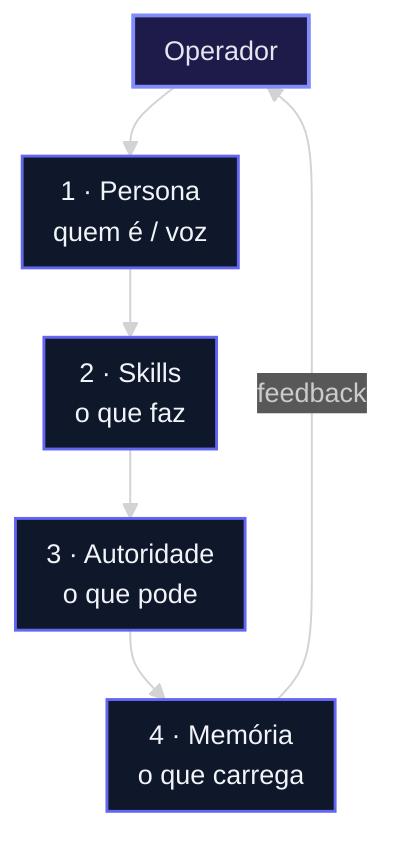
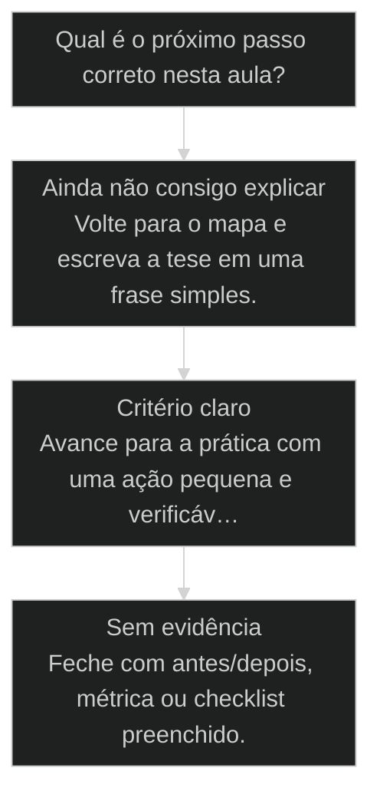

# Anatomia de um agente: [[Persona]], skills, [[Autoridade]], [[Memória]]

> **Papel curricular:** extensão aplicada ao AIOX. Base técnica canônica: `cursos/Introducao-a-Arquitetura-de-Sistemas/aulas/22-modelo-contexto-memoria-tool-skill.md`.

← [[45-doze-agentes-orbitais|Os 12 agentes orbitais do AIOX]] · ↑ [[modulos/Módulo 1 - Sistema AIOX|M1]] · ⌂ [[cursos/AIOX Advanced/README|Curso]] · → [[15-quatro-executores|4 executores: humano, agent, clone, worker]]

## Conceitos

- [[Software House no Computador]]
- [[Agentes Orbitais]]
- [[Anatomia do Agente]]

## Mapa desta aula

Quatro camadas do agente — leia de cima para baixo; memória fecha o ciclo com o operador.



> Leia o diagrama antes do texto longo. Depois volte e confira.

> As 4 camadas que diferenciam um @agente de um simples prompt. Abrir o arquivo desmistifica: a anatomia está toda escrita, campo a campo.

**Objetivos de aprendizagem:**
- Explicar as 4 camadas que compõem um agente: persona, skills, autoridade e memória. _(understand)_
- Diferenciar agente, skill, task e comando na hierarquia de composição. _(understand)_
- Decompor um agente real nas 4 camadas abrindo o arquivo. _(apply)_
- Diagnosticar um agente quebrado identificando qual camada está faltando. _(analyze)_

---

## O que você consegue no fim desta aula

*G · Destino*

Destino claro antes do conteúdo técnico.

Você decompõe um agente real nas 4 camadas (persona, skills, autoridade, memória)
e aponta qual está fraca no teu setup. Resultado: checklist de anatomia preenchido para
1 agente que você usa de verdade.

- **Destino**: Anatomia de um agente: persona, skills, autoridade, memória
- **Como saber que chegou**: Exercício final da aula com evidência escrita.

---

## O ponto de partida real

*P · Onde você está*

Empatia com o sintoma — sem moralismo.

Todo mundo fala em 'agente' como se fosse prompt com chapéu. Então o que acontece?
Você copia um @dev da internet e descobre que ele mexe onde não devia, esquece o que
combinou, e não tem skill nenhuma — só vibe. Se isso te soa familiar, você está no
lugar certo: anatomia antes de culto.

> **Âncora**: Se o sintoma não for o seu, anote o do seu time — a aula ainda vale como mapa.

---

## Anatomia de um agente

*Conceito · M1 Sistema · Por Alan Nicolas*

Um @agente parece mágica até você abrir o arquivo. Aí vê que é um documento estruturado em 4 camadas. Quem entende as camadas conduz; quem não entende, reza pro prompt funcionar.

- **4 camadas**: persona, skills, autoridade, memória
- **1 arquivo**: abrir o agente desmistifica tudo
- **1 diagnóstico**: qual camada faltou no agente quebrado

- **status**: aiox advanced · m1 sistema
- **meta**: principio=anatomia-do-agente
- **meta**: fonte=t2-aula-2 + aula-03
- **ready**: open the agent file

**Legenda de cores**

As 4 camadas e o anti-padrão

- **Persona** (signal): identidade, estilo, domínio
- **Skills** (insight): agrupamento de tasks
- **Autoridade** (bench): fronteiras que não se cruzam
- **Memória** (action): experiência acumulada, propriedade intelectual
- **Camada faltando** (pain): a causa real do agente quebrado

---

## Um agente é um documento estruturado

O agente não é uma caixa-preta nem um prompt mágico. É um arquivo com campos. Cada campo é uma das 4 camadas. Abrir o arquivo tira o medo e dá o controle.

> **A regra que sustenta a aula**: Quando o agente não faz o que você espera, não culpe o modelo. Abra o arquivo e olhe as 4 camadas. Quase sempre uma delas está vazia ou errada: persona genérica, skill que não mapeia a task, autoridade que falta, ou memória que não foi atualizada.

**Agente como caixa-preta**
- Trata o @agente como mágica que às vezes funciona.
- Quando quebra, reescreve o prompt no escuro.
- Não sabe dizer o que o agente pode e não pode fazer.
- Culpa o modelo quando o output vem torto.

**Agente como documento**
- Abre o arquivo do agente e lê as 4 camadas.
- Quando quebra, identifica qual camada faltou.
- Sabe a autoridade exata: o que o agente pode tocar.
- Corrige a camada certa, não o prompt inteiro.

> **Adriano de Marqui (host T2, t2-aula-2)**: Eu vou abrir aqui o arquivo do agente Hormozi pra vocês verem. Olha: persona, identidade, estilo, domínio. Depois as skills, que são agrupamento de tasks. Depois a autoridade. E a memória. Não tem mágica, tem campo.

---

## A hierarquia: comando, task, skill, agente, workflow

O agente vive numa hierarquia de composição. Confundir os níveis é confundir o que fazer onde. A analogia da escrita organiza tudo.

**Do menor ao maior elemento**

1. **Comando**: a letra: a unidade mínima de ativação.
2. **Task**: a palavra: uma unidade de trabalho com contrato (inputs, outputs).
3. **Skill**: a frase: agrupamento de tasks que resolvem algo junto.
4. **Agente**: o parágrafo: persona que orquestra skills e tasks.
5. **Workflow**: o texto completo: agentes e tasks encadeados num processo.

> **Adriano de Marqui (host T2, t2-aula-2)**: Pensa em ortografia. Comandos são as letras. Tasks são palavras. Skills são frases. Agentes são parágrafos. Workflows são o texto inteiro. Cada nível compõe o de cima.

---

## O caminho da aula

Três movimentos: ver as 4 camadas por dentro, abrir um agente real, e diagnosticar um agente quebrado pela camada faltando.

- **Você vai sair sabendo** (O que cada uma das 4 camadas faz.; Onde a persona, as skills, a autoridade e a memória vivem no arquivo.; Como ler um agente quebrado e achar a camada faltando.)
- **Você vai sair fazendo**: A decomposição de um agente real nas 4 camadas e o diagnóstico de um agente que não fazia o esperado.

**O ritmo de quem domina o agente**

Três batidas antes de confiar num agente.

- 1 **Abre**: o arquivo do agente, não o prompt de uso
- 2 **Lê as 4 camadas**: persona, skills, autoridade, memória
- 3 **Confere a autoridade**: o que ele pode e não pode tocar

---

## As 4 camadas por dentro

Cada camada responde uma pergunta diferente sobre o agente. Juntas, elas definem o que ele é e o que ele pode fazer.

- **1. Persona - quem o agente é**: Identidade, estilo e domínio. A persona define como o agente fala, o que ele sabe e o tom que usa. Persona genérica produz output genérico. [QUEM, identidade]
- **2. Skills - o que ele sabe fazer**: Skills são agrupamentos de tasks. Cada skill mapeia para tasks concretas que o agente executa. Sem skill mapeada, o agente tem persona mas não tem ação. [O QUE, tasks agrupadas]
- **3. Autoridade - o que ele pode tocar**: Fronteiras que não se cruzam. O Dev não dá push, só o DevOps. A autoridade é o que separa um agente que ajuda de um agente que faz estrago. Define o que ele pode e o que ele não pode. [ATÉ ONDE, fronteiras]

> **A quarta camada: memória**: Persona, skills e autoridade definem o agente parado no tempo. A memória é o que ele acumula: histórico, padrões, contexto do [[Squad|squad]]. Um agente sem memória recomeça do zero toda vez.

---

## Memória: experiência que vira propriedade intelectual

A memória é a pasta onde o squad guarda o que aprendeu. É a camada que transforma uso repetido em ativo da empresa.

**Como a experiência vira propriedade intelectual**

1. **Uso**: o agente executa tasks e produz resultados.
2. **Registro**: o que funcionou e o que falhou vai para a pasta memory.
3. **Padrão**: casos repetidos viram padrões reutilizáveis.
4. **Ativo**: workflows mais squads mais memória são propriedade intelectual da empresa.

> **Adriano de Marqui (host T2, t2-aula-2)**: Os agentes e os squads possuem memória. No fim do dia eu peço: atualize na memória tudo que aprendemos hoje. Os workflows configurados, os squads, a memória: isso é a propriedade intelectual da sua empresa.

---

## Frontmatter: como a IA carrega o agente

O frontmatter é a mecânica de ativação. Quando você chama o agente, o sistema injeta o que está declarado ali no contexto. É onde as 4 camadas viram comportamento.

- **Você chama o agente** -> o sistema lê o frontmatter do arquivo dele.
- **Injeta o contexto** -> persona, skills e autoridade entram no System Prompt.
- **Carrega a memória** -> o histórico relevante do squad entra junto.
- **O agente age** -> agora ele responde dentro das fronteiras declaradas.

> **Pedro Valério (co-founder, aula-03)**: Quando você chama um agente, o sistema injeta o System Prompt mais tudo que você quer que ele leia no carregamento. O frontmatter é onde você declara isso. É a anatomia formal: o que entra quando o agente acorda.

---

## Abrindo o agente Hormozi

Adriano abriu o arquivo de um agente ao vivo e mostrou as 4 camadas escritas, campo a campo. A mágica vira documento.

> **Pedro Valério (co-founder, aula-03)**: A anatomia formal do agente é isso: você consegue apontar no arquivo onde está cada coisa. Persona, o que ele sabe, o que ele pode, o que ele lembra. Quando você enxerga assim, para de ter medo do agente.

### Caso: A mágica vira documento

Quando o operador abre o arquivo do agente, o medo some. As 4 camadas estão todas escritas, e o que parecia caixa-preta vira algo editável.

- Começou como: Um agente tratado como caixa-preta: usado pelo @, sem ninguém saber o que tinha dentro.
- Virou: O arquivo aberto, com persona, skills, autoridade e memória visíveis e editáveis.
- Prova: Cada comportamento do agente tem uma linha no arquivo que o explica.
- Lição: Agente é documento estruturado. A anatomia que você estudou está escrita, campo a campo.

---

## A grade da anatomia

As 4 camadas lado a lado, com a pergunta que cada uma responde e o sintoma de quando falta. A grade que você consulta ao abrir um agente.

**As 4 camadas e o sintoma de cada falta**

Para cada camada, a pergunta que ela responde e o que aparece quando ela está vazia.

- **Persona vazia**: Output genérico, sem domínio nem tom. O agente fala como qualquer IA.
- **Skill não mapeada**: O agente entende mas não executa. Tem persona, não tem ação.
- **Autoridade ausente**: O agente faz o que não devia, ou trava onde devia agir.
- **Memória não atualizada**: O agente recomeça do zero, repete erros já resolvidos.

- **Persona**: Identidade, estilo, domínio. Define quem o agente é e como fala.
- **Skills**: Agrupamento de tasks. Define o que o agente sabe executar.
- **Autoridade**: Fronteiras. Define o que o agente pode e não pode tocar.
- **Memória**: Experiência acumulada. Define o que o agente lembra do squad.

---

## O agente que dava push sozinho

Um agente fazia algo que não devia: dava push direto. O diagnóstico não foi trocar o modelo, foi achar a camada de autoridade faltando.

- **Agente quebrado, não modelo ruim**: O reflexo é culpar o LLM quando o agente erra.
- **Autoridade, não capacidade**: O agente dar push não é o modelo ser capaz demais.
- **Memória, não inteligência**: O agente repetir um erro já resolvido não é burrice do modelo.

### Caso: A camada de autoridade que faltava

Quando um agente faz o que não devia, o reflexo é culpar o modelo. A causa real costuma ser uma camada faltando, e aqui era a autoridade.

- Começou como: Um agente Dev dando push para produção sozinho, sem passar pelo DevOps.
- Virou: O mesmo agente com a autoridade corrigida: Dev propõe, só DevOps dá push.
- Prova: O comportamento errado sumiu ao declarar a fronteira no arquivo, sem trocar o modelo.
- Lição: Agente quebrado quase nunca é culpa do modelo. É uma das 4 camadas faltando.

---

## Router de decisão da aula

O ponto em que Anatomia de um agente: persona, skills, autoridade, memória deixa de ser explicação e vira escolha operacional.

**Árvore de decisão**
_Não escolha comando antes de nomear o tipo de situação._



- **Ainda não consigo explicar** — O aluno repete a frase da aula, mas não consegue aplicar em exemplo próprio.
  → _Volte para o mapa e escreva a tese em uma frase simples._
- **Critério claro** — O aluno identifica sinal, risco e decisão antes da ferramenta.
  → _Avance para a prática com uma ação pequena e verificável._
- **Sem evidência** — A ação foi feita, mas não existe prova de melhoria ou decisão registrada.
  → _Feche com antes/depois, métrica ou checklist preenchido._

**Gate:** Você sabe qual rota seguir e como provar que avançou? — _Se a resposta ainda depende de opinião, volte uma etapa._

#### Entender o princípio
Quando a aula ainda parece uma tese abstrata.
1. **Nomear: escreva a tese em uma frase.
2. **Exemplo: traga um caso próprio pequeno.
3. **Risco: diga o erro que a aula evita.

#### Aplicar em uma task
Quando o critério está claro e falta execução.
1. **Escolher: defina a menor ação verificável.
2. **Executar: faça sem expandir escopo.
3. **Provar: registre o delta produzido.

#### Revisar a decisão
Quando a execução aconteceu, mas a evidência ficou fraca.
1. **Comparar: olhe antes e depois.
2. **Ajustar: corrija a menor falha.
3. **Fechar: só conclua com prova.

**Colunas:** Estado | Pergunta | Sinal saudável | Sinal de risco

- Entendimento: Consigo explicar sem copiar a aula? | frase própria e exemplo próprio | repetição bonita sem aplicação
- Decisão: Escolhi rota antes da ferramenta? | sinal e risco nomeados | comando escolhido por hábito
- Prova: Tenho evidência de avanço? | antes/depois ou checklist | sensação de que ficou melhor

---

## Processo operacional mínimo

A sequência mínima para aplicar Anatomia de um agente: persona, skills, autoridade, memória sem transformar a aula em teoria solta.

**Aula → Task → Evidência**
Rota curta para transformar o conceito em ação repetível.
- **Plan**: Nomeie o sinal da aula, o risco que ela evita e o artefato que será produzido.
- **Do**: Execute a menor ação que prova o conceito sem abrir novo escopo.
- **Check**: Compare a saída com o critério de aceite da aula.
- **Act**: Registre a regra aprendida e remova o que não será reutilizado.

**Aplicar com evidência**
Use quando a aula fizer sentido, mas a task ainda estiver sem formato.
- `sinal`
- `risco`
- `ação`
- `prova`
- `sinal`: O que esta aula me ensinou a perceber?
- `risco`: Que erro acontece se eu ignorar esse sinal?
- `ação`: Qual é a menor execução que testa o princípio?
- `prova`: Que evidência mostra que a decisão melhorou?

**Do conceito ao comportamento**

1. **Conceito**: entender a tese central da aula.
2. **Critério**: transformar a tese em pergunta de decisão.
3. **Ação**: executar a menor tarefa que prova avanço.
4. **Memória**: registrar o padrão para repetir depois.

---

## Distinções que evitam falsa competência

Três diferenças que protegem Anatomia de um agente: persona, skills, autoridade, memória de virar jargão ou checklist vazio.

**Parece que aprendeu**
- Repete a tese da aula sem exemplo próprio.
- Escolhe ferramenta antes de escolher critério.
- Fecha a task porque executou algo.

**Aprendeu de verdade**
- Explica o princípio em uma situação própria.
- Escolhe rota, risco e evidência antes do comando.
- Fecha a task quando existe prova de avanço.

- **entender com aplicar**: Entender é conseguir repetir a ideia.
- **ação com evidência**: Fazer algo gera movimento.
- **checklist com processo**: Checklist pode ser preenchido no automático.

**Exemplo preenchido: saída esperada do aluno**

- **Tese**: A aula me ensinou a observar um sinal específico antes de escolher ferramenta.
- **Risco**: Se eu pular esse critério, executo rápido e descubro tarde que a direção estava errada.
- **Ação**: Vou aplicar em uma task pequena, com escopo fechado e antes/depois visível.
- **Prova**: A entrega só fecha quando eu consigo mostrar o critério usado e o delta gerado.

---

## Prática: decomponha e diagnostique

Abra um agente real, decomponha nas 4 camadas, e diagnostique um agente que não fazia o esperado pela camada faltando.

**Template da decomposição (uma ficha por agente)**
```yaml
# Preencha abrindo o arquivo do agente, camada por camada.
agente: "{nome do agente}"
persona:
  identidade: "{quem ele e}"
  estilo: "{como ele fala}"
  dominio: "{o que ele domina}"
skills: ["{skill 1 -> tasks}", "{skill 2 -> tasks}"]
autoridade:
  pode: ["{o que ele pode tocar}"]
  nao_pode: ["{a fronteira que nao cruza}"]
memoria: "{onde ele guarda experiencia, ou vazio}"
diagnostico:
  sintoma: "{o que estava errado}"
  camada_faltando: "{persona | skills | autoridade | memoria}"

```

**1. Ler o agente**
Abre o arquivo e percorre as 4 camadas antes de qualquer uso crítico.
- **Output**: ficha-do-agente.yaml com as 4 camadas
- **Gate**: Você consegue apontar onde cada camada está no arquivo?

**2. Diagnosticar pela camada**
Mapeia o sintoma para a camada: indevido é autoridade, sem ação é skill, tom errado é persona, repete erro é memória.
- **Output**: diagnostico com a camada faltando nomeada
- **Gate**: O sintoma aponta uma camada específica, não 'o modelo'?

> **Portão da aula**: Antes de seguir para a próxima aula: você abriu um agente real, decompôs nas 4 camadas, e diagnosticou um agente quebrado nomeando a camada que faltava. Se você ainda culpa o modelo sem abrir o arquivo, volte e abra.

- 1. **Escolha um agente**: Pegue um agente que você usa e abra o arquivo dele, não só o uso por @.
- 2. **Mapeie a persona**: Identifique identidade, estilo e domínio. Está específico ou genérico?
- 3. **Liste as skills**: Veja quais tasks o agente agrupa. Alguma skill prometida não mapeia task real?
- 4. **Confira a autoridade**: Liste o que o agente pode e não pode tocar. A fronteira está declarada?
- 5. **Diagnostique um quebrado**: Pegue um agente que falhou e diga qual das 4 camadas estava faltando.

---

## Glossário

Os termos desta aula em uma frase cada.

- **Persona**: A camada de identidade, estilo e domínio do agente. Define quem ele é e como fala.
- **Skill**: Agrupamento de tasks. A camada que define o que o agente sabe executar.
- **Autoridade**: As fronteiras do agente. O que ele pode e não pode tocar, ex: Dev não dá push.
- **Memória**: A experiência acumulada do squad. Histórico e padrões que viram propriedade intelectual.
- **Frontmatter**: A declaração que o sistema injeta no contexto quando o agente é chamado.
- **Hierarquia de composição**: Comando, task, skill, agente, workflow: do menor ao maior elemento, como letras até texto.

> **Próxima aula**: Você já abre um agente e enxerga as 4 camadas. A seguir, você aprende a escolher quem executa cada task entre humano, agent, clone e worker.

***


---

## Navegação

← [[45-doze-agentes-orbitais|Os 12 agentes orbitais do AIOX]] · ↑ [[modulos/Módulo 1 - Sistema AIOX|M1]] · ⌂ [[cursos/AIOX Advanced/README|Curso]] · → [[15-quatro-executores|4 executores: humano, agent, clone, worker]]
