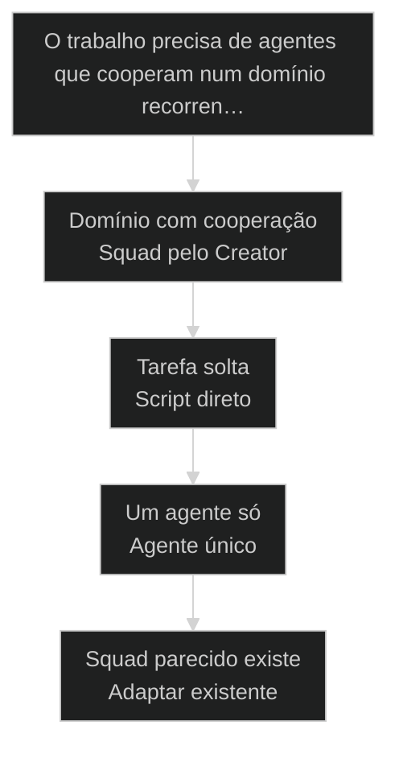
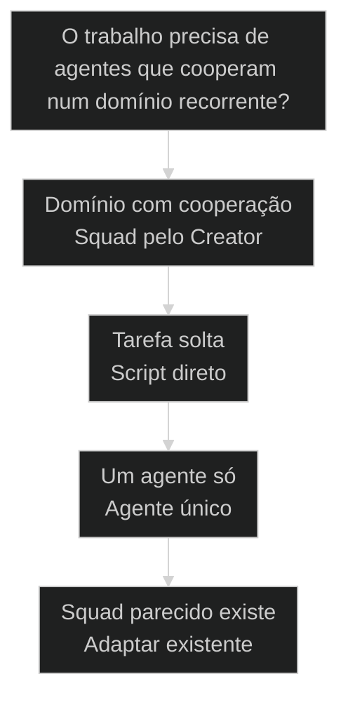

# Squad Creator passo a passo: criar um squad do zero

← [[33-anatomia-de-um-squad|Anatomia de um Squad AIOX]] · ↑ [[modulos/Módulo 7 - Criar Squad|M7]] · ⌂ [[cursos/AIOX Advanced/README|Curso]] · → [[55-triagem-de-squad-novo|Triagem de Squad novo: fase-zero de prior-art + research loop]]

## Conceitos

- [[Squad]]

## Mapa desta aula

Decisão-chave da aula — O trabalho precisa de agentes que cooperam num domínio recorren…



> Leia o diagrama antes do texto longo. Depois volte e confira.

> Você não escreve um [[Squad|squad]] na mão. Você descreve o domínio e deixa o Squad Creator montar agentes, tasks e workflows. A regra muda: antes de codar, você especifica. O /squad-creator é a fábrica que materializa a especificação.

**Objetivos de aprendizagem:**
- Nomear o que o Squad Creator faz no AIOX: montar squads a partir de especificação. _(remember)_
- Distinguir especificar o domínio (descrever) de implementar agentes na mão (codar). _(understand)_
- Escolher quando rodar o /squad-creator em vez de escrever um agente solto. _(apply)_
- Explicar por que validar antes de instalar evita squad quebrado no ecossistema. _(understand)_

---

## Squad Creator: a fábrica que monta squads

*Squad Creator · criar um squad do zero*

Escrever um squad na mão é montar agentes, tasks e workflows arquivo por arquivo. O Squad Creator inverte: você descreve o domínio e ele materializa a estrutura. Quem cria agente solto antes de especificar reescreve três vezes.

- **1**: comando: /squad-creator
- **3**: peças geradas: agentes, tasks, workflows
- **0**: agente escrito na mão antes da spec

- **status**: squad creator
- **meta**: descreve=especifica o dominio
- **meta**: scaffold=gera agentes/tasks/workflows
- **meta**: gate=valida antes de instalar
- **ready**: ready to scaffold

**Legenda de cores**

Mapa semantico do Squad Creator

- **Especificacao** (signal): o dominio que voce descreve para o squad
- **Scaffolding** (insight): o Creator monta a estrutura a partir da spec
- **Squad** (bench): agentes, tasks e workflows materializados
- **Instalacao** (action): o squad validado entra no ecossistema
- **Erro comum** (pain): escrever agente na mao antes de especificar

---

## Da cohort: creator some do open, sobe no PRO

*T1 + T2 · WhatsApp*

Realidade do grupo Advanced — não é slide, é cicatriz.

Campo T1: Alan removeu o squad-creator do GitHub aberto porque carrega modelo de
negócio (anos de construção com Pedro). A turma recebe versão PRO / zip especial.

Isso muda o jeito de ensinar o creator: não é 'clone o repo e seja feliz'. É
**curadoria + validate + upgrade**. Aluno perguntando se os squads prontos são
melhores que criar com creator-pro — resposta de operação: valem como ponto de
partida se você entende a órbita; creator continua sendo o músculo.

> **Âncora de campo**: Creator sem prior-art vira fábrica de duplicata; PRO sem validate vira zip morto.

> **Materiais / FAQ**: FAQ-cohort §1 e §4 · fluxo *validate-squad → *upgrade-squad

---

## Comece pela pergunta certa

Antes de listar os passos do Squad Creator, fixe a pergunta única: você precisa de um conjunto de agentes que trabalham juntos num domínio, ou de um script solto? Se é o conjunto, é território de squad, e a primeira ação é descrever, não codar.

**Como ler esta aula**

1. **A pergunta aparece**: Uma frase separa script solto de squad com agentes que cooperam.
2. **Cada peça mostra a cara**: O Creator scaffolda a estrutura. Você só preenche a especificação do domínio.
3. **Vê o caso real**: /squad-creator e squad-chief são primitivos reais do AIOX, apontáveis no repo.
4. **Decide**: Dado um domínio, você aponta se merece um squad criado pelo Creator ou um script direto.

- **Objetivos da aula** (Nomear o que o Squad Creator faz: montar squads a partir de especificação.; Distinguir especificar o domínio de implementar agentes na mão.; Escolher quando rodar o /squad-creator em vez de um agente solto.; Explicar por que validar antes de instalar evita squad quebrado.)
- **Onde você está?** (Começando: foque Mapa Simples e a analogia da fábrica.; Já usa AIOX: foque Casos Reais e a Decisão.; Vai criar squad: foque os Passos e as Métricas.)
- **Leitura prática**: Em cada bloco, procure uma resposta: estou descrevendo o domínio ou já tentando codar o agente? Quando o Creator ajuda e quando um script resolve melhor?

**Ritmo da aula**

A distinção fica clara quando cada peça tem definição curta, exemplo real do framework e o gosto de quando usar.

- G **Pergunta antes do detalhe**: Primeiro o critério que separa squad de script, depois cada passo por dentro.
- 1 **Analogia que ancora**: Escrever na mão é marcenaria. Squad Creator é a linha de montagem que parte da planta.
- 2 **Caso real**: /squad-creator e squad-chief são apontáveis no AIOX, não teoria.
- 3 **Recap com decisão**: A aula fecha com o aluno decidindo se um domínio dele merece um squad criado pelo Creator.

---

## A diferença sem jargão

Antes dos termos técnicos, a diferença é só isto: codar na mão você escreve cada agente, task e workflow arquivo por arquivo; com o Squad Creator você descreve o domínio e ele gera a estrutura validada.

> **Em uma frase**: Codar na mão começa do arquivo vazio: você monta agente, task e workflow um a um. O Squad Creator começa da especificação: você descreve o domínio e ele scaffolda a estrutura. A regra muda: antes de implementar, você especifica. Spec primeiro, scaffolding depois, instalação por último.

- **Especificação é o que você descreve** -> O domínio do squad: que problema ele resolve, que agentes precisa, que fluxo executa. A spec, não o código.
- **Scaffolding monta** -> O Creator lê a spec e gera os arquivos: agentes, tasks, workflows, config. A estrutura nasce da descrição.
- **O squad é o produto** -> Você sai do Creator com um squad completo: agentes que cooperam, tasks definidas, workflows ligados. Não com arquivos soltos.
- **Instalação vem depois** -> Só depois de validar o squad entra no ecossistema. A instalação registra o squad para ativação via comando.
- **O erro caro** -> Escrever agente na mão antes de especificar o domínio. Você monta peças que não encaixam e reescreve do zero.

**Diagrama principal: da especificação à instalação**

1. **Especificação**: Você descreve o domínio: problema, agentes, fluxo.
2. **Scaffolding**: O /squad-creator gera agentes, tasks e workflows a partir da spec.
3. **Validação**: O squad passa pelo gate antes de qualquer instalação.
4. **Instalação**: O squad validado entra no ecossistema, pronto para ativar.

**O que o Squad Creator evita**
- Escrever cada agente na mão arquivo por arquivo.
- Tratar um domínio de squad como se fosse um script solto.
- Implementar antes de especificar o que o squad faz.
- Instalar um squad quebrado que não passou pelo gate.

**O que ele força**
- Descrever o domínio antes de gerar qualquer arquivo.
- Deixar o scaffolding montar a estrutura padrão.
- Validar o squad antes de instalar no ecossistema.
- Materializar agentes, tasks e workflows de uma spec única.

---

## A analogia da linha de montagem

A forma mais rápida de fixar a diferença: codar na mão é marcenaria peça por peça; o Squad Creator é a linha de montagem que parte da planta. A planta é a especificação, a linha monta a estrutura.

- **Mão = marcenaria peça por peça**: Você serra, lixa e prega cada agente. Controle total, mas lento e propenso a peças que não encaixam quando o domínio é grande.
- **Especificação = a planta**: Antes da linha rodar, você desenha a planta: que agentes, que tasks, que fluxo. A descrição do domínio que vira instrução de montagem.
- **Squad Creator = a linha de montagem**: A linha lê a planta e monta a estrutura padrão: agentes, tasks, workflows, config. Rápido, consistente, sem peça solta.
- **Instalação = entregar a peça pronta**: Com o squad montado e validado, você o instala no ecossistema. A peça sai da linha pronta para ativar por comando.

> **E quando misturar?**: Nem todo domínio precisa de squad. Um script de uma tarefa é marcenaria rápida e suficiente. O erro é mandar a linha de montagem inteira para fazer um banquinho, ou montar um armário grande prego por prego. Squad Creator quando há agentes que cooperam; script quando é uma tarefa solta.

---

## Mão versus Creator: o critério da cooperação

Esta é a confusão mais cara do início. Os dois produzem agentes, então parecem o mesmo trabalho. O critério da cooperação separa os dois: você precisa de agentes que trabalham juntos num domínio ou de uma tarefa solta?

**Codar na mão (marcenaria)**
- Bom para uma tarefa solta e isolada.
- Controle total sobre cada arquivo.
- Lento e inconsistente quando há muitos agentes.
- Risco de peças que não encaixam no fim.

**Squad Creator (linha de montagem)**
- Bom para um domínio com agentes que cooperam.
- Estrutura padrão gerada a partir da spec.
- Rápido e consistente para squads inteiros.
- Gate de validação antes de instalar.

> **A pergunta que separa**: Pergunte: preciso de um conjunto de agentes que cooperam num domínio recorrente? Se não, é tarefa solta: escreva um script direto. Se sim, é squad: descreva o domínio e deixe o /squad-creator montar. Marcenaria não é linha de montagem, e linha de montagem não faz banquinho.

- **Squad com script solto**: Os dois automatizam trabalho, então parecem o mesmo recurso.
- **Especificar com implementar**: Os dois produzem o squad no fim, então parecem a mesma etapa.
- **Instalar com criar**: Os dois deixam o squad pronto, então parecem o mesmo passo.

---

## O Squad Creator existe de verdade no AIOX

A distinção não é teoria. O Squad Creator é apontável no framework. Estes dois casos mostram os primitivos reais do AIOX que montam um squad que você não escreveu na mão.

- **Onde o Squad Creator vive no AIOX**: O AIOX tem o squad squad-creator (prefix /squadCreator) com a entry squad-chief, que cria squads, agentes e workflows via scaffolding template-driven e encadeia o ciclo Validate, Discover e Install. O Squad Creator não é abstração: tem squad, tem comando e tem pipeline de criação e validação. Players: /squad-creator, squad-chief, scaffolding template-driven, Validate Discover Install, Discovery Tool.
- **O que muda a decisão**: A pergunta não é se o trabalho é importante. É se existe um domínio com agentes que cooperam. Domínio recorrente com cooperação pede squad criado pelo Creator. Tarefa solta e isolada, não.

**Cada conceito num eixo**

A distinção vira sistema quando cada conceito tem definição, lar no framework e o tipo de trabalho que resolve.

- **Especificação**: O domínio que você descreve: problema, agentes, fluxo. A entrada do Creator.
- **Scaffolding**: O /squad-creator gera agentes, tasks e workflows a partir da spec.
- **Validação**: Validate e Discover conferem o squad antes de instalar.
- **Instalação**: Install registra o squad no ecossistema para ativação.

**Colunas:** Conceito | Descreve ou monta? | Sinal de uso certo | Sinal de erro

- Especificação: Descreve ou monta? | Domínio descrito antes de qualquer arquivo gerado. | Agente escrito na mão antes de especificar o domínio.
- Scaffolding: Descreve ou monta? | /squad-creator gerando a estrutura a partir da spec. | Arquivos montados um a um sem partir da spec.
- Validação: Descreve ou monta? | Validate e Discover rodando antes do Install. | Squad instalado sem passar pelo gate.
- Instalação: Descreve ou monta? | Squad validado registrado para ativação por comando. | Squad quebrado registrado e falhando na ativação.

### Caso: O /squad-creator monta o squad a partir da spec

O Squad Creator não é uma metáfora de aula: o AIOX tem o squad squad-creator, com a entry squad-chief, que cria squads, agentes e workflows via scaffolding template-driven e pipeline de validação.

- Começou como: Um domínio novo sem squad, que exigiria escrever cada agente, task e workflow na mão.
- Virou: Um squad completo gerado a partir da especificação do domínio, com agentes, tasks e workflows ligados.
- Prova: O squad squad-creator existe no AIOX (prefix /squadCreator, entry squad-chief) e cria squads via template-driven scaffolding e validation pipeline.
- Lição: Squad Creator é primitivo real: tem squad, tem comando, tem pipeline de criação e validação.

### Caso: O squad-chief valida, descobre e instala

Criar não basta: o squad-chief encadeia o ciclo de Validate, Discover e Install, garantindo que o squad gerado é coerente antes de entrar no ecossistema.

- Começou como: Um squad recém-gerado, com agentes e workflows ainda não conferidos contra o registry.
- Virou: Um squad validado, descoberto pela ferramenta de discovery e instalado no ecossistema, pronto para ativar por comando.
- Prova: MASTER-PC-02 cobre o passo Validate+Discover+Install (aula-02 PC-03) e a Discovery Tool (aula-03 PC-02), e o squad-creator usa pipeline de validação.
- Lição: A criação fecha com gate: validar e descobrir antes de instalar evita squad quebrado no ecossistema.

---

## Os passos para criar um squad do zero

Criar um squad com o Creator não é um clique mágico. É um pipeline de passos nomeados, da descrição do domínio à instalação no ecossistema. Cada passo fecha antes do próximo abrir.

**Pipeline de criação de squad**
Os passos ordenados que transformam uma especificação de domínio num squad instalado.
- **1. Especificar**: Descrever o domínio: problema, agentes necessários e fluxo de trabalho.
- **2. Scaffold**: Rodar o /squad-creator para gerar agentes, tasks e workflows da spec.
- **3. Validar**: Conferir a estrutura gerada contra o padrão do framework.
- **4. Descobrir**: Deixar a Discovery Tool reconhecer o squad no ecossistema.
- **5. Instalar**: Registrar o squad validado para ativação por comando.
- **6. Ativar**: Chamar o squad pelo seu comando e usar os agentes gerados.

**especificação fecha antes do scaffolding abrir**

1. **Spec**: Você descreve o domínio: problema, agentes, fluxo, sem gerar arquivo.
2. **Scaffold**: O /squad-creator gera agentes, tasks e workflows a partir da spec.
3. **Gate**: Validate e Discover conferem o squad antes da instalação.
4. **Install**: O squad validado entra no ecossistema, pronto para ativar.

---

## Como spec, scaffolding e squad se combinam

Especificação, scaffolding e squad não são rivais; são camadas em sequência. A spec descreve, o scaffolding monta, o squad executa. Entender a direção evita codar antes de especificar.

- **1. Descrever (Especificação)**: Quem define o domínio do squad. A spec lista problema, agentes e fluxo sem gerar arquivo. É a única camada que apenas descreve. [WHY, descreve, dominio]
- **2. Montar (Scaffolding)**: O que o Creator gera. A estrutura padrão: agentes, tasks, workflows, config. O artefato que nasce da especificação. [WHAT, estrutura, scaffold]
- **3. Executar (Squad)**: Como o squad faz o trabalho. Os agentes ativados por comando, cooperando no fluxo. Zero arquivo solto, máxima rastreabilidade à spec. [HOW, agentes, ativa]

---

## Quando criar um squad com o Creator?

Antes de rodar o Creator, decida se o domínio merece um squad. O critério economiza tempo quando você escolhe pela cooperação entre agentes, não pela vontade de automatizar logo.

**Árvore de decisão**
_Responda pela cooperação antes de pensar em quanto vai automatizar._



- **Domínio com cooperação** — Vários agentes precisam cooperar num domínio que se repete.
  → _Squad pelo Creator_
  Ex.: Rode o /squad-creator: descreva o domínio e deixe o scaffolding montar.
- **Tarefa solta** — Uma única tarefa isolada, sem agentes cooperando.
  → _Script direto_
  Ex.: Não precisa de squad. Escreva um script direto.
- **Um agente só** — Um único agente resolve, sem fluxo de cooperação.
  → _Agente único_
  Ex.: Avalie um agente solto em vez do squad inteiro.
- **Squad parecido existe** — Já existe um squad próximo que pode ser adaptado.
  → _Adaptar existente_
  Ex.: Adapte o squad existente em vez de criar do zero.

**Gate:** Qual é o gate? — _Sem gate, você cria squad por reflexo ou escreve na mão por hábito. Responda: existe um domínio recorrente com agentes que cooperam e sem squad equivalente? Se sim, /squad-creator. Se não, script, agente único ou adaptar o existente._

> **Regra do critério único**: A escolha não é pela importância do trabalho; é pela cooperação entre agentes. Se há um domínio recorrente com agentes que cooperam e nenhum squad equivalente, o /squad-creator é a peça. Se é tarefa solta ou já existe squad parecido, criar do zero é overengineering. Escrever um squad inteiro na mão sem o Creator é marcenaria onde cabia linha de montagem, o erro mais lento do início.

---

## Rotas de criação

Cada tipo de necessidade tem um modo típico de materializar. Saber a rota evita decidir certo pelo squad e construir com a ferramenta errada.

#### Criar squad do zero
Quando o domínio precisa de agentes que cooperam num fluxo recorrente.
1. **Sinal: domínio com vários agentes que cooperam e sem squad.
2. **Pergunta: você descreveu o domínio ou já está codando o agente?
3. **Ação: rodar o /squad-creator a partir da especificação.
4. **Resultado: squad completo: agentes, tasks e workflows ligados.

#### Adicionar um agente solto
Quando um único agente resolve, sem fluxo de cooperação.
1. **Sinal: uma capacidade isolada cabe num agente só.
2. **Pergunta: esse agente coopera com outros ou age sozinho?
3. **Ação: criar o agente único sem montar o squad inteiro.
4. **Resultado: agente focado sem o peso de um squad.

#### Adaptar um squad existente
Quando já existe um squad próximo do domínio que você precisa.
1. **Sinal: um squad existente cobre quase o seu domínio.
2. **Pergunta: o que falta é configuração ou estrutura nova?
3. **Ação: adaptar o squad existente em vez de criar do zero.
4. **Resultado: domínio coberto reaproveitando o que já existe.

**Criar squad**
Use quando o domínio pede agentes que cooperam e não há squad equivalente.
- `/squad-creator`: abre o pipeline de criação a partir da especificação.
- `Validate Discover Install`: fecha o gate antes de registrar no ecossistema.

**Agente solto**
Use quando uma capacidade isolada cabe num agente único.
- `criar agente`: definir um único agente sem montar o squad.
- `validar escopo`: confirmar que o agente age sozinho, sem cooperação.

**Adaptar squad**
Use quando um squad existente cobre quase o domínio que você precisa.
- `localizar squad`: encontrar o squad existente mais próximo do domínio.
- `ajustar config`: adaptar agentes e workflows em vez de gerar do zero.

---

## Modelos para ler melhor

Visualizações rápidas para o aluno comparar squad, agente solto e script, os riscos de cada escolha e o grau de scaffolding que cada um exige.

- **Domínio com cooperação**: alto (agentes que cooperam pedem o squad inteiro.)
- **Agente solto**: médio (um agente único sem o peso do squad.)
- **Script solto**: baixo (tarefa isolada, quase nada a montar.)

- **Squad escrito na mão**: squad (marcenaria lenta, peças que não encaixam no fim.)
- **Script virando squad gigante**: script (complexidade demais para uma tarefa solta.)
- **Squad instalado sem validar**: instalar (squad quebrado falhando na primeira ativação.)

**Matriz de Decisão do Aluno**

Em dúvida, escolha a célula que melhor descreve a sua necessidade.

- **Agentes que cooperam**: Squad pelo Creator. /squad-creator a partir da spec.
- **Capacidade isolada**: Agente solto. Sem montar o squad inteiro.
- **Tarefa única e isolada**: Script direto, sem squad nem agente.
- **Squad parecido já existe**: Adaptar o existente em vez de criar do zero.
- **Squad gerado**: Validate, Discover e Install antes de usar.
- **Não sabe ainda**: Pergunte: vários agentes cooperam num domínio? Sim, squad.

- **Sinal de criação saudável**: domínio especificado antes de qualquer arquivo gerado / agente solto para capacidade isolada / squad escrito na mão sem partir da spec
- **Separação de etapas**: spec descreve, scaffolding monta, validação confere / criação e instalação em passos separados e rastreáveis / instalação do squad durante a fase de geração

---

## O que cada peça carrega

Cada peça da criação tem uma anatomia mínima. Saber o que cada uma guarda ajuda a reconhecer quando você está pulando um passo ou usando a ferramenta errada.

- **Especificação: o domínio**: Problema, agentes e fluxo descritos. Carrega o que o squad deve fazer, sem nenhum arquivo ainda.
- **Scaffolding: a montagem**: A geração da estrutura padrão a partir da spec. Agentes, tasks e workflows, não palpite.
- **/squad-creator: o comando**: A entry squad-chief que dispara o scaffolding template-driven e a validação.
- **Validate-Discover-Install: o gate**: O ciclo que confere, reconhece e registra o squad no ecossistema.
- **Squad: o produto**: Os agentes que cooperam, ativados por comando. Nunca vem antes da spec, sempre depois.

---

## Métricas da criação

Sem telemetria, a saúde da criação vira fé. Estas perguntas separam um squad confiável de um amontoado de arquivos disfarçado de squad.

**Colunas:** Métrica | Pergunta | Sinal saudável | Sinal de risco

- Cobertura da spec: Problema, agentes e fluxo foram especificados antes de gerar? | Os três descritos, scaffolding parte da spec. | Geração começou sem domínio claro, peças soltas.
- Ordem dos passos: A criação rodou na ordem, da spec à instalação? | Cada passo fechou antes do próximo abrir. | Instalou antes de validar, squad quebrado no ecossistema.
- Separação de etapas: A especificação ficou separada da geração? | Domínio descrito sem gerar arquivo na mão. | Agente escrito durante a fase de especificação.
- Rastreabilidade: Cada agente gerado aponta para a spec que o justifica? | Toda peça traça de volta ao domínio especificado. | Agente gerado sem âncora no que foi descrito.

---

## Quando resistir ao Squad Creator

A distinção ajuda mais quando você resiste ao reflexo de criar um squad para tudo. O Creator tem custo: especificar o domínio, validar, instalar. Vale só quando a cooperação entre agentes paga.

**Quando criar um squad**
- Vários agentes precisam cooperar num domínio recorrente.
- O fluxo de trabalho se repete e justifica a estrutura.
- Nenhum squad existente cobre o domínio.
- O custo de montar tudo na mão é alto.

**Quando não criar**
- É uma tarefa solta que um script resolve.
- Um único agente dá conta, sem cooperação.
- Já existe um squad parecido para adaptar.
- O custo de criar o squad supera o ganho da estrutura.

---

## Exercício: decida a criação

Pegue uma necessidade real sua e aplique o critério. O objetivo não é gerar o squad agora; é apontar se a necessidade exige um squad criado pelo Creator antes de escrever qualquer arquivo.

**Uma necessidade, cinco perguntas**
```yaml
criacao:
  necessidade: "o que voce quer automatizar?"
  cooperam: "varios agentes cooperam num dominio? sim | nao"
  peca: "squad_creator | agente_solto | script"
  ferramenta: "squad_creator | agente_unico | script"
  gate: "por que nao a outra rota? (se squad, que agentes especifica antes?)"

```
*O acerto não é gerar o squad. É provar que você escolheu a rota pelo critério da cooperação e sabe justificar por que a outra custaria mais sem entregar mais estrutura.*

**Exemplo preenchido: squad de pesquisa versus script de exportação**

- **Necessidade A**: Preciso de pesquisa de mercado com varios especialistas que cruzam fontes e sintetizam.
- **Cooperam A**: Sim. Varios agentes (busca, analise, sintese) precisam cooperar num fluxo recorrente.
- **Peça A**: Squad pelo Creator. Rodo o /squad-creator a partir da spec do dominio de pesquisa.
- **Necessidade B**: Preciso converter um lote de arquivos de um formato para outro, uma vez.
- **Peça B**: Script direto. Tarefa solta e isolada, sem agentes cooperando.
- **Gate B**: Squad nao se aplica: nao ha dominio recorrente nem cooperacao, entao montar um squad seria linha de montagem para um banquinho.

- 1. **Necessidade**: Descreva em uma frase o trabalho que você quer automatizar.
- 2. **Cooperam?**: Responda: vários agentes precisam cooperar num domínio recorrente, ou é tarefa solta?
- 3. **Peça**: Aponte squad pelo Creator (cooperação), agente solto (capacidade isolada) ou script (tarefa única).
- 4. **Ferramenta**: Diga como rodaria: /squad-creator para squad, agente único para capacidade isolada, script para tarefa.
- 5. **Gate**: Justifique por que não escolheu a outra rota. Para squad, diga que agentes vai especificar antes de gerar.

**Funcionou se:**

- O aluno escolhe a rota pelo critério da cooperação, não pela vontade de automatizar logo.
- O aluno separa especificar o domínio de implementar o agente na mão.
- O aluno define que agentes vai especificar quando escolhe o squad pelo Creator.

---

## Glossário do Squad Creator

Tradução dos termos para alguém que está vendo a criação de squad pela primeira vez.

- **Squad**: Um conjunto de agentes que cooperam num domínio, com tasks e workflows ligados. A unidade que o Creator monta.
- **Squad Creator**: O squad do AIOX que cria outros squads. Prefix /squadCreator, entry squad-chief. Gera agentes, tasks e workflows via scaffolding template-driven.
- **Especificação**: A descrição do domínio do squad: problema, agentes e fluxo. A entrada do Creator, antes de gerar qualquer arquivo.
- **Scaffolding**: A geração da estrutura padrão do squad a partir da especificação. Materializa agentes, tasks e workflows.
- **squad-chief**: A entry do squad-creator que recebe a descrição do domínio e dispara o scaffolding com pipeline de validação.
- **Validate-Discover-Install**: O ciclo que fecha a criação: validar a estrutura, descobrir o squad pela Discovery Tool e instalar no ecossistema.
- **Discovery Tool**: A ferramenta que reconhece o squad gerado no ecossistema, antes da instalação para ativação.
- **Escrever na mão**: O anti-padrão de montar cada agente, task e workflow arquivo por arquivo antes de especificar o domínio.

> **Portão da aula**: A aula só está no padrão quando o aluno nomeia o que o Squad Creator faz (montar squads a partir de especificação), distingue especificar o domínio (descrever) de implementar agentes na mão (codar) e consegue apontar, para uma necessidade real, se ela exige um squad criado pelo /squad-creator (agentes que cooperam) ou um script direto (tarefa solta) antes de escrever qualquer arquivo.

***


---

## Navegação

← [[33-anatomia-de-um-squad|Anatomia de um Squad AIOX]] · ↑ [[modulos/Módulo 7 - Criar Squad|M7]] · ⌂ [[cursos/AIOX Advanced/README|Curso]] · → [[55-triagem-de-squad-novo|Triagem de Squad novo: fase-zero de prior-art + research loop]]
