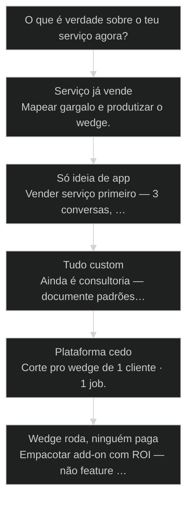
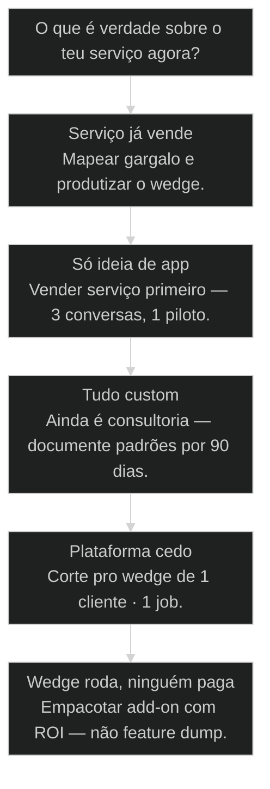

# [[Service-as-Software]]: a era do serviço produtivado

← [[61-wave-execute|Wave Execute: orquestração avançada com waves paralelas]] · ↑ [[modulos/Módulo 11 - Produtivização|M11]] · ⌂ [[cursos/AIOX Advanced/README|Curso]] · → [[63-distribuicao-vs-produto|Distribuição > Produto (10/90)]]

## Mapa desta aula

Decisão-chave da aula — O que é verdade sobre o teu serviço agora?

> Leia o diagrama antes do texto longo. Depois volte e confira.

> O ouro está no serviço que já vende. Software é amplificador — não o ponto de partida. [[SaaS]] genérico não é o único destino.

**Objetivos de aprendizagem:**
- Articular Service-as-Software versus SaaS genérico em uma frase mensurável. _(understand)_
- Mapear um serviço real e isolar 3 opções de produtização com repetição e dor. _(analyze)_
- Escolher um wedge de produto a partir de serviço validado e justificar o corte. _(evaluate)_
- Definir o MVP de 30 dias do wedge com dono, métrica e anti-escopo. _(apply)_

---

## O que você consegue no fim desta aula

*G · Destino*

Destino claro antes de qualquer jargão de SaaS.

Ao final desta aula você vai conseguir três coisas concretas:

1. Explicar **Service-as-Software** sem escorregar pra "é um SaaSzinho".
2. Olhar um serviço teu (ou do teu cliente) e marcar **onde a repetição paga**.
3. Escolher **um wedge** — não três plataformas — com anti-escopo escrito.

Se você sair daqui ainda desenhando multi-tenant sem um pedaço que já vende,
a aula falhou. O poder está no **serviço validado**, não no template de pricing page.

- **Objetivos da aula** (Separar SaS de SaaS genérico; Mapear serviço → repetição → wedge; Cortar MVP de 30 dias com anti-escopo)
- **Resultado tangível**: Uma página: serviço atual · 3 opções · 1 wedge · métrica de 30 dias.
- **Não é o destino**: Fundar um 'Uber da consultoria'. Isso é o anti-objetivo.

---

## A armadilha do SaaS como identidade

*P · Onde você está*

Empatia com o ponto de partida real do operador de produto.

Cara, eu vejo o mesmo filme toda semana. A pessoa tem um serviço que paga o
aluguel — consultoria, operação, burel, implementação AIOX — e a primeira
vontade é: "vou virar SaaS". Errado. A pergunta certa é: **qual pedaço do
serviço já se repete e dói o suficiente pra alguém pagar software?**

SaaS virou palavra preguiçosa. Virou identidade. "Somos um SaaS de IA" não
diz o que você vende — diz o que você sonha empacotar.

Se você está aqui, provavelmente já sentiu um destes sintomas:

- Feature backlog inchando enquanto o serviço manual ainda é o que fatura.
- Landing de produto sem um único cliente que já comprou o serviço por trás.
- "Plataforma" no slide e planilha de horas no banco.

Beleza. A partir daqui a gente troca sonho de software por **serviço que
roda como software**.

**Onde a maioria trava**
- Começar pelo app e caçar dor depois
- Multi-tenant no dia 1
- Chamar de SaaS qualquer CRUD com login

**Onde o operador vai**
- Partir do serviço que já vende
- Wedge no gargalo repetível
- Software como amplificador do serviço

---

## Service-as-Software em uma frase

*S · Rota*

Definição operacional — não marketing.

**Service-as-Software (SaS)** é a produtização de um serviço de alto ticket:
você pega o que já entrega valor com humanos (ou semi-manual) e empacota o
pedaço repetível como software que roda — com agente, [[Runner|runner]], API, fila.

Não é CRUD genérico "pra todo mundo". Não é "IA pra PMEs". É o teu serviço,
industrializado no ponto de alavancagem.

Prior-art: as aulas de [[Squad|squad]] e harness ensinam a máquina. Esta aula ensina
**o que merece virar máquina** — e o que ainda é consultoria honesta.

- **1**: serviço que já vende
- **1**: wedge por vez
- **0**: platform dream no mês 1

- **status**: service-as-software
- **meta**: origem=servico pago
- **meta**: corte=wedge repetivel
- **ready**: ready to map

**Legenda de cores**

O que cada cor sinaliza nesta aula

- **Serviço** (signal): entrega que já gera receita ou contrato
- **Wedge** (insight): pedaço doloroso, repetível, mensurável
- **SaS** (bench): serviço que roda como software
- **MVP** (action): menor fatia que prova o delta
- **Anti** (pain): plataforma cedo, SaaS sem dor paga

**Como ler esta aula**

1. **Definição**: SaS vs SaaS genérico — sem confusão.
2. **Mapa**: Serviço → repetição → opções de produtização.
3. **Caso**: História real de wedge que paga.
4. **Rota**: Escolher wedge e MVP de 30 dias.

---

## Service-as-Software não é SaaS com disfarce

Duas teses de produto. Uma começa na dor paga.

Decora a diferença — ela evita seis meses de build inútil:

1. **SaaS genérico** — produto horizontal, ICP amplo, feature set que compete
   com categorias existentes. Começa no software e caça mercado.
2. **Service-as-Software** — parte de um serviço já comprado. Software
   industrializa o gargalo. O mercado já disse sim com dinheiro.

No AIOX isso aparece o tempo todo: squad de content, pipeline de research,
operação de QA — coisas que um humano (ou time) já entrega. O SaS é o pedaço
que vira job, API, painel — sem fingir que você é a Atlassian no mês um.

Então o que acontece se você pula o serviço? Você vira startup de slide com
repo bonito. Cliente nenhum valida o wedge porque **nunca houve serviço**.

> **Lei do SaS**: Sem serviço que já vende (ou está a uma conversa de vender), não há Service-as-Software — há hopeware.

- **1. Serviço**: Entrega humana/semi-manual com ticket e resultado. [origem]
- **2. Repetição**: O que se repete toda semana e dói em horas/R$. [sinal]
- **3. Software**: Wedge que roda o pedaço sem você na sala. [amplificador]

- **SaaS genérico** != **Service-as-Software**: Um caça mercado; o outro industrializa dor já paga.
- **Plataforma** != **Wedge**: Plataforma é destino eventual; wedge é a primeira fatia que prova.

---

## O wedge: pedaço mais doloroso e repetível

Não o platform dream. O corte que cabe em 30 dias.

Wedge é a fatia do serviço onde três coisas batem ao mesmo tempo:

- **Dor** — alguém sente no bolso ou no calendário.
- **Repetição** — acontece com frequência (semana/mês), não é one-off heróico.
- **Fronteira clara** — você sabe quando "pronto" sem reescrever o universo.

Exemplos de wedge bom:
- Relatório semanal que o time gasta 6h montando.
- Triagem de leads com checklist fixo.
- Geração de PRD a partir de briefing padronizado.
- [[Quality Gate|Quality gate]] com evidência em todo PR.

Exemplos de wedge podre:
- "Dashboard completo de operação".
- "Assistente de CEO genérico".
- "Plataforma multi-agente multi-tenant".

Olha só: se o teu wedge precisa de 12 integrações pra provar valor, não é
wedge — é roadmap disfarçado de MVP.

- **Wedge**: Menor pedaço produtizável com dor, repetição e fronteira de pronto.
- **Gargalo**: Etapa do serviço que concentra horas ou erro humano.
- **Anti-escopo**: Lista explícita do que NÃO entra no MVP de 30 dias.
- **Hopeware**: Software sem serviço validado por trás — só esperança de mercado.

> **Teste de 10 segundos**: Se você não consegue descrever o wedge em uma frase com número (horas ou R$), ainda é vibe — não é produto.

---

## Caso: o relatório que virou job

Serviço de operação → wedge de automação → produto piloto.

Um operador de growth vendia "ops de conteúdo" a ticket alto. Toda segunda,
a equipe montava relatório de performance: 6 a 8 horas, três fontes, zero
glamour. Cliente amava o insight — odiava esperar até terça à noite.

Em vez de "SaaS de marketing analytics", o corte foi cirúrgico:

1. **Serviço** — ops de conteúdo (já faturava).
2. **Gargalo** — relatório semanal multi-fonte.
3. **Wedge** — job que consolida 3 APIs + rascunho narrativo em 20 min.
4. **MVP** — um cliente, um dashboard, zero multi-tenant.

Em 30 dias o job rodava. Em 60 o cliente pagava o "relatório automático" como
add-on. Só então veio a conversa de produto. Sem service-first, isso seria
mais um repo de charts sem comprador.

Então o que acontece se ele tivesse começado pela plataforma? Seis meses de
multi-tenant e zero receita de software — serviço ainda carregando a conta.

**Ordem do SaS**

1. **Serviço**: Ops de conteúdo já vendido
2. **Gargalo**: Relatório 6–8h/semana
3. **Wedge**: Job multi-fonte + rascunho
4. **MVP**: 1 cliente · 1 pipeline
5. **Produto**: Add-on → depois multi-cliente

---

## Três opções de produtização — e só uma vence agora

Forçar o menu evita o 'quero tudo'.

Quando você mapeia um serviço, force três opções concretas de wedge.
Exemplos de eixos:

- **Automação de etapa** — um passo do funil vira job.
- **Interface do cliente** — o cliente self-serve o que você fazia na mão.
- **API/integração** — outro sistema consome o teu resultado sem você.

Escolha **uma** com critério: maior dor × maior repetição × menor superfície
de build. As outras duas viram backlog — não sprint atual.

Por quê três? Porque uma opção é dogma. Duas viram empate emocional. Três
forçam trade-off. E trade-off é o que separa produto de wishlist.

**Atalho de escolha do wedge**

- **Dor alta + build pequeno**: Wedge agora
- **Dor alta + build monstro**: Fatie menor
- **Dor baixa + fácil**: Não é produto — é hobby
- **Só você se importa**: Volte ao serviço e fale com cliente

---

## Qual próxima ação no teu SaS?

Árvore curta pra não errar o caminho.

**Árvore de decisão**
_Escolha pela evidência de receita e repetição — não pela ansiedade de 'virar SaaS'._

- **Serviço já vende** — Cliente paga humano/semi-manual hoje.
  → _Mapear gargalo e produtizar o wedge._
  Ex.: Relatório semanal manual que o cliente renova.
- **Só ideia de app** — Sem serviço validado nem conversa de compra.
  → _Vender serviço primeiro — 3 conversas, 1 piloto._
  Ex.: Startup de slide com Figma de dashboard.
- **Tudo custom** — Zero repetição entre clientes.
  → _Ainda é consultoria — documente padrões por 90 dias._
  Ex.: Cada engajamento é um monstro único.
- **Plataforma cedo** — Quer multi-tenant/AWS antes do wedge.
  → _Corte pro wedge de 1 cliente · 1 job._
  Ex.: Arquitetura multi-tenant no backlog do dia 1.
- **Wedge roda, ninguém paga** — Automação existe sem offer/preço.
  → _Empacotar add-on com ROI — não feature dump._
  Ex.: Script interno que o time ama e o cliente não vê.

**Gate:** Você consegue nomear serviço, gargalo e wedge em uma frase cada? — _Se não nomeia os três, não abre o editor ainda._

#### Rota serviço → software
Do que já vende ao MVP.
1. **Mapear serviço: Etapas, horas, ticket.
2. **Achar repetição: O que dói toda semana.
3. **3 opções: Forçar menu de wedges.
4. **1 MVP: 30 dias · anti-escopo · métrica.

#### Rota anti-path
App sem dor paga.
1. **Parar build: Congelar features de vaidade.
2. **Falar com cliente: 3 entrevistas de dor.
3. **Vender serviço: Piloto pago ou LOI.
4. **Só então wedge: Produtizar o que vendeu.

#### Rota wedge vivo
Já roda — falta produto.
1. **Oferta: Nome + preço + ROI.
2. **Onboarding: Do zero ao valor em <1 dia.
3. **Prova: Case com número.
4. **Escala seletiva: 2º cliente só com isolamento mínimo.

---

## Mapeie teu SaS (20 min)

Papel, vault ou Notion — mas escrito e com número.

Vamos lá. Sem isso a aula vira podcast de founder. Cronometra vinte minutos.

- 1. **Serviço**: O que você (ou teu time) já entrega e alguém paga — uma frase + ticket aproximado.
- 2. **Etapas**: Liste 5–8 etapas do serviço e marque horas por etapa.
- 3. **Gargalo**: Circule a etapa com maior dor × frequência.
- 4. **3 opções**: Três wedges possíveis (automação, interface, API).
- 5. **Escolha**: Um wedge + anti-escopo (3 itens que NÃO entram) + métrica de 30 dias.

**Funcionou se:**

- Há um serviço real (não ideia de app) descrito com ticket ou proxy de valor.
- Três opções de wedge estão escritas e uma foi escolhida com critério.
- Anti-escopo e métrica de 30 dias existem em uma linha cada.

---

## Glossário sem jargão de pitch deck

- **Service-as-Software**: Produtização de serviço já validado: software industrializa o gargalo, não inventa mercado do zero.
- **Wedge**: Menor fatia produtizável com dor, repetição e fronteira de pronto.
- **Hopeware**: Software construído na esperança de mercado, sem serviço ou dor paga por trás.
- **Anti-escopo**: Lista explícita do que fica de fora do MVP — tão importante quanto o escopo.

---

## Portão da aula

Você passou quando, sem cheatsheet, responde: qual serviço, qual gargalo, qual
wedge — e o que **não** entra nos próximos 30 dias. SaaS é destino possível.
Service-as-Software é o caminho que não quebra a conta no meio.

A IA é a seta. O X é seu — inclusive escolher **o que merece** virar software.

> **Próximo na trilha**: Com o wedge na mão, a aula de distribuição vs produto (63) força o 10/90: construir ficou barato — distribuir continua o jogo.

> **GATE-MODULE (auto)**: GPS Goal/Position/Steps presentes · caso + do/dont · decisão · prática com evidência · glossário. Alvo DL ≥70 atingido na construção enrich-W4.

***

---

## Navegação

← [[61-wave-execute|Wave Execute: orquestração avançada com waves paralelas]] · ↑ [[modulos/Módulo 11 - Produtivização|M11]] · ⌂ [[cursos/AIOX Advanced/README|Curso]] · → [[63-distribuicao-vs-produto|Distribuição > Produto (10/90)]]
