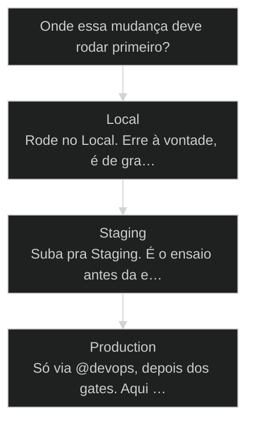
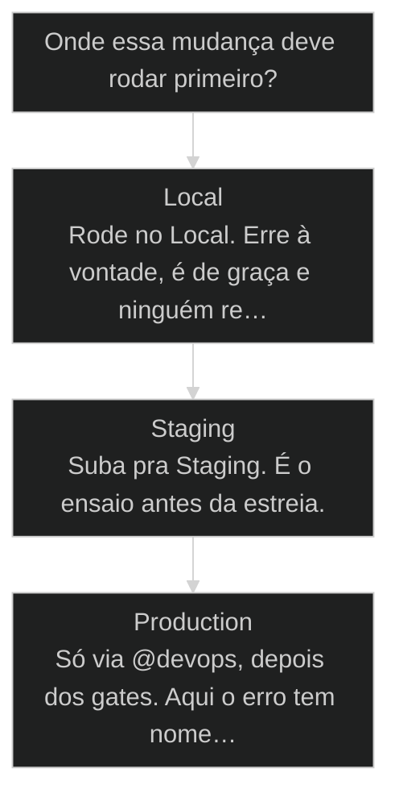

# Local, Staging, Production

## Conceitos

- [[Local Staging Production]]

## Mapa desta aula

Decisão-chave da aula — Onde essa mudança deve rodar primeiro?



> Leia o diagrama antes do texto longo. Depois volte e confira.

> Três ambientes, três cuidados, e por que cada um existe pra te proteger. No fim, [[Squad]] também é rascunho do serviço.

**Objetivos de aprendizagem:**
- Entender por que ambiente Local existe pra errar e por que isso é o motor do aprendizado em AIOX _(understand)_
- Aplicar a separação [[Local Staging Production|Local/Staging/Production]] em código E em banco de dados, usando Supabase Branch quando o stack permitir _(apply)_
- Avaliar quando uma mudança merece um patch (1.1.2), um minor (1.2.0) ou um major (2.0.0), e quando o Story termina antes do push _(evaluate)_

---

## Errar é de graça: no Local

*Mindset*

Cara, antes da gente falar de qualquer comando, de qualquer setup, de
qualquer configuração de DevOps, eu preciso que tu entenda uma coisa: o
ambiente Local existe pra tu errar. É o teu laboratório. É o teu
computador. Erra muito ali, porque sem consequência o aprendizado é
grátis. Essa é a filosofia que o Pedro repete sempre, e ele tem razão.

O Pedro fala assim, com todas as letras: a pessoa que erra mais vezes e
mais rápido aprende mais do que a pessoa que tenta fazer uma coisa
perfeita. Isso muda completamente o jogo. Porque o medo de errar é o que
faz a galera ficar olhando o Cloud Code rodar, paralisada, conferindo cada
caractere. E aí não erra, e também não aprende. Ambiente Local não tem
usuário do outro lado. Não tem consequência financeira. Não tem ninguém
postando print. Erra à vontade.

A regra geral é simples. Se o erro pode quebrar alguma coisa real, ele
precisa ter passado por Staging antes. Se o erro só quebra o teu
computador, é só restart. Local é onde tu compra coragem barata.

- **3**: ambientes para proteger o aprendizado
- **0**: usuários reais no Local
- **1**: guardião do deploy: @devops

- **status**: aiox advanced
- **meta**: operador=alan_nicolas
- **meta**: aula=05 ambientes
- **meta**: regra=local->staging->production
- **ready**: ready to isolate

**Legenda de cores**

O que cada cor sinaliza nesta aula

- **Erro barato** (signal): o que deve nascer no Local, sem usuário real e sem dano de negócio
- **Validação realista** (bench): o que precisa passar por Staging antes de chegar no público
- **Publicação governada** (action): mudança promovida por @devops depois dos gates certos
- **Risco de mistura** (pain): banco compartilhado, push direto ou Production usado como laboratório
- **Lei do operador** (insight): escolher o ambiente pelo custo do erro, não pela pressa

> **Regra que precisa colar**: Errar rápido é virtude no Local. Errar rápido em Production é incidente. A maturidade está em saber onde cada erro pode acontecer.

---

## Comece pelo movimento

Primeiro vem o movimento geral. Banco, versionamento e governança só entram depois que a ordem está clara.

**A ordem que não se pula**

1. **Local**: Quebra barato, aprende rápido, testa sem usuário real.
2. **Staging**: Valida em ambiente parecido com Production, mas ainda controlado.
3. **Production**: Só recebe o que passou pelos gates. Aqui existe usuário, dado e dinheiro real.

- **Objetivos da aula** (Entender por que o Local existe pra errar.; Aplicar a separação em código E em banco de dados.; Avaliar quando uma mudança é patch, minor ou major.)
- **Onde você está?** (Começando: foque Mapa e Bancos.; Já tem projeto no ar: foque Governança e Prática.; Vai versionar: foque o cluster de Versionamento.)
- **Leitura prática**: Leia cada bloco procurando uma resposta concreta: onde esse erro pode acontecer, qual banco ele toca, quem tem autoridade pra publicar.

---

## Os três ambientes: Local, Staging, Production

*Conceito 1/3*

Cada ambiente tem um papel diferente. Não dá pra confundir.

Local é o teu computador: laboratório onde pode errar. Staging é o teu
computador na nuvem pra testar, mesmo ambiente de Production, mas só pra
você e teu time. Production é o que os usuários acessam. Essa sequência
tem uma ordem inegociável: o que sai de Local vai pra Staging, e só depois
pode subir pra Production. Quem pula essa ordem vira a piada de subiu
direto produção, deu merda, ninguém viu.

Pensa no jogo que faz beta. O estúdio libera primeiro pra um grupo pequeno
de Beta Testers. Eles entram, jogam, reportam bugs. Quando o jogo aguenta
a galera de beta, aí sim ele abre pra todo mundo. Staging é isso.
Production é todo mundo.

- **1. Local**: Laboratório no seu computador. Serve para quebrar, aprender, reiniciar e repetir sem usuário, dinheiro ou reputação em jogo. [LAB, baixo risco]
- **2. Staging**: Ensaio parecido com Production. Serve para validar fluxo, dado realista e comportamento antes de expor o usuário. [REHEARSAL, gate]
- **3. Production**: Ambiente do usuário. Serve para entregar valor real, com banco isolado, deploy governado e rollback pensado antes. [LIVE, @devops]

- **Local não é descuido** -> É liberdade controlada. Pode quebrar porque ninguém de fora depende disso.
- **Staging não é enfeite** -> É a única chance honesta de ver o comportamento real antes do público.
- **Production não é laboratório** -> É o palco. Quem testa no palco transforma plateia em cobaia.

---

## Onde essa mudança deve rodar primeiro?

Use este mapa antes de considerar qualquer mudança pronta.

**Árvore de decisão**
_Decida o ambiente pelo custo do erro, não pela pressa de ver no ar._



- **Local** — É experimento, teste ou quebra reversível só na sua máquina?
  → _Rode no Local. Erre à vontade, é de graça e ninguém real depende._
  Ex.: Refatorar uma função, testar um prompt, quebrar um schema descartável.
- **Staging** — Passou no Local e precisa de validação realista antes de publicar?
  → _Suba pra Staging. É o ensaio antes da estreia._
  Ex.: Subir uma migration nova, validar um fluxo de pagamento com dado parecido.
- **Production** — Tem usuário real, dado real ou dinheiro do outro lado?
  → _Só via @devops, depois dos gates. Aqui o erro tem nome e rosto._
  Ex.: Liberar a feature pro público, rodar a migration no banco principal.

**Gate:** Você consegue reverter sem o usuário sentir? — _Se não consegue, ainda não é hora de Production._

> **Pausa para checagem**: Antes de rodar qualquer mudança, responda: qual é o custo do erro aqui, e em qual ambiente esse custo é aceitável?

---

## Banco de dados também tem três ambientes

*Conceito 2/3*

Código separado sem banco separado vira ilusão de segurança.

Tem um erro muito comum que destrói projeto inteiro: separar o código em
três ambientes e deixar todo mundo conectando no mesmo banco. Aí basta uma
migration mal escrita rodando em Local pra arrastar dados de Production
junto. Banco de dados segue a mesma lógica que o código. Dev tem banco
próprio, staging tem banco próprio, production tem banco próprio. Nunca
compartilhe.

Se tu está usando Supabase, que é o stack que a gente recomenda muito no
AIOX, o Supabase tem essa função de Branch. Usa. Cada branch é um banco
isolado, com schema próprio, dados próprios, RLS próprio. Tu consegue dar
push da migration em Staging, validar, e só depois subir pra Production.
Isso evita o caso clássico do rodei a migration em prod sem querer. Com
Branch, tu literalmente não consegue rodar em prod sem mudar de branch
consciente.

**código separado com banco compartilhado ainda é risco**

1. **Código Local**: Você testa no computador.
2. **Banco Local**: Dados descartáveis, schema livre para quebrar.
3. **Banco Staging**: Dados realistas e validação antes de usuário real.
4. **Banco Production**: Isolado, protegido, alterado só com deploy governado.

**Ilusão de segurança**
- Três branches de código apontando para o mesmo banco.
- Migration testada direto no banco real.
- Staging sem dados parecidos com Production.
- Qualquer agente podendo mexer em deploy.

**Segurança operacional**
- Um banco por ambiente.
- Migration passa por Local e Staging antes de Production.
- Supabase Branch ou equivalente quando disponível.
- @devops como guardião de push e deploy.

---

## Supabase Branch: um banco por ramo

Como a Branch transforma a separação de banco em algo que você não consegue burlar por acidente.

A Branch resolve um problema humano, não técnico. O ser humano esquece.
Ele abre o terminal apressado, roda a migration, e só depois percebe que
estava conectado no banco errado. A Branch tira essa decisão da memória e
coloca no fluxo. Cada ramo é um banco. Pra tocar Production, você precisa
mudar de ramo de forma consciente, e isso já é um gate.

**Migration via Supabase Branch**
Rota para mudar schema sem nunca tocar Production por acidente.
- **Branch**: Crie ou escolha o branch de Staging. É um banco isolado com schema, dados e RLS próprios.
- **Push**: Suba a migration nesse branch. Nada em Production se move.
- **Validate**: Rode os testes com dado realista no branch. Se quebra, quebra longe do usuário.
- **Promote**: Só depois de validar, @devops promove a migration para o banco de Production.

> **Pedro Valério (co-founder AIOX)**: Com Branch, tu literalmente não consegue rodar em prod sem mudar de branch consciente. O erro do rodei sem querer some porque o caminho fácil deixou de existir.

---

## Cada banco tem dono, e o dono não é você

Banco isolado é metade. A outra metade é autoridade clara sobre quem mexe.

Separar o banco em três não basta se qualquer agente pode rodar migration
em qualquer lugar. No AIOX, migration e mudança de schema têm dono: o
@db-sage. O @dev propõe a migration, mostra o SQL pra revisão, mas quem
executa schema é o @db-sage. E quem leva pra Production é o @devops. Isso
não é burocracia. É a mesma lógica de ter um guardião por domínio.

- **@dev propõe**: Escreve a migration, mostra o SQL, explica o impacto. Não executa schema sozinho.
- **@db-sage executa schema**: Roda dry-run, valida em Staging, aprova a mudança de banco. Autoridade exclusiva sobre schema.
- **@devops promove**: Leva a migration aprovada pra Production junto com o deploy. Push pertence a ele.

> **Sinal de alerta**: Se no seu fluxo qualquer pessoa roda migration direto no banco de Production, você não tem banco isolado. Tem três cópias do mesmo risco.

---

## Versionamento: três números que mudam tudo

*Conceito 3/3*

Patch, Minor, Major. Pedro explica a regra que ele demorou pra entender.

O Pedro conta essa história aberta. Ele ficava na dúvida de fazer
versionamento. Isso aqui é 2.0? Isso é 2.0.1? Aí ele descobriu que existe
uma metodologia: Semantic Versioning, semver, e ela é simples. Três
números, sempre. Tipo 1.1.2.

A regra do Pedro, na linguagem dele: patch é mudança pequenininha, minor é
incremento de feature, major é mudança agressiva e vira 2.0.0. Quando muda
só o último número, de 1.1.2 pra 1.1.3, tu está dizendo: consertei bug,
comportamento é o mesmo. Quando muda o do meio, de 1.1.2 pra 1.2.0:
adicionei feature, nada quebra. Quando muda o primeiro, de 1.x.y pra
2.0.0: mudei coisa séria, prepare-se.

**Quando cada número muda**

- P **Patch: último número (1.1.2 para 1.1.3)**: Mudança pequenininha. Bug fix. Comportamento externo idêntico. Quem já usa não precisa adaptar nada.
- m **Minor: número do meio (1.1.2 para 1.2.0)**: Incremento de feature. Adicionou capacidade nova sem quebrar nada. Quem já usa pode atualizar sem medo.
- M **Major: primeiro número (1.x.y para 2.0.0)**: Mudança agressiva. Quebrou contrato, mudou API, virou outra coisa. Quem já usa precisa ler o changelog e adaptar.

---

## Patch, minor ou major?

A próxima mudança que você vai fazer cai em uma destas três casas.

- **patch com minor**: Patch só corrige. Minor adiciona.
- **minor com major**: Minor não quebra quem já usa. Major quebra.
- **versão com vaidade**: Subir pra 2.0 não te deixa mais maduro.

**Decisão de versão por sintoma**

Identifique o sintoma da mudança e leia o número correto.

- **Corrigi um bug**: Comportamento volta ao esperado. É patch (1.1.2 para 1.1.3).
- **Adicionei feature**: Capacidade nova, nada quebra. É minor (1.1.2 para 1.2.0).
- **Mudei um contrato**: API mudou, quem usa adapta. É major (1.x.y para 2.0.0).
- **Só renomeei interno**: Sem efeito externo. Patch, e às vezes nem isso.

---

## AIOX do 2.3 ao 3.11: semver contando a história

*Caso real · Repo AIOX*

O versionamento do próprio framework AIOX é a prova viva da regra: o número conta a evolução.

Isso importa porque o AIOX usa semver no próprio framework. Quando o Pedro
fala que o AIOX estava no 2.3 e agora a gente está no 3.11, ele está te
contando uma história de evolução. O salto de 2 pra 3 foi major: mudança
agressiva, contrato novo. Do 3.0 pro 3.11 foram minors e patches
empilhados, cada um adicionando ou consertando sem quebrar quem já estava
dentro. O @devops cuida desse versionamento via comando version-check
antes do release.

**Como ler o salto 2.3 para 3.11**

1. **2 para 3 foi major**: Contrato mudou. Adaptação obrigatória pra quem estava na 2.x.
2. **3.0 para 3.11 foram minors**: Onze incrementos de feature sem quebrar a base existente.
3. **version-check fecha o ciclo**: @devops valida o número antes de qualquer release sair.

### Caso: O número que conta a evolução do framework

Quando o próprio framework que você está aprendendo usa a regra que está te ensinando.

- Começou como: Dúvida do Pedro sobre como numerar versões.
- Virou: Semver aplicado no framework AIOX inteiro, do 2.3 ao 3.11.
- Prova: version-check do @devops roda antes de cada release.
- Lição: O número de versão é um contrato de risco, não um troféu.

---

## Docker Desktop: sem ele, o teste local não roda

*Pré-requisito*

Por que o @devops exige Docker Desktop ligado durante os ciclos de teste.

Antes de qualquer push, o @devops faz uma sequência de testes: lint,
testes unitários, verificação de tipos, build. Em muitos desses passos ele
usa o Docker Desktop pra simular Production no teu Local. Cria um
container, sobe a aplicação, roda os testes, mata o container. Tudo sem tu
ver.

Por isso, quando tu roda o environment-bootstrap, uma das obrigatoriedades
é Docker Desktop instalado. E não basta instalado, precisa estar aberto.
Se tu esquece de abrir, o build falha sem explicação óbvia.

**O que o @devops roda antes do push**
Toda vez que uma mudança vai sair do Local rumo a Staging ou Production.
- `docker`
- `lint`
- `types`
- `tests`
- `build`
- `docker desktop`: Precisa estar aberto. O agente sobe container sem você ver.
- `lint`: Checa estilo e padrões antes de qualquer subida.
- `types`: Verificação de tipos pega contrato quebrado cedo.
- `tests`: Unit tests rodam no container que simula Production.
- `build`: Se o build passa, a entrega está pronta pro gate de QA.

> **Pedro Valério (co-founder AIOX)**: Ele tem que estar com o Docker aberto no computador para que o agente possa ir lá e fazer os testes sem nem você saber.

---

## Story fecha no QA. Deploy é do @devops.

A separação que impede o erro barato de virar incidente caro.

Detalhe de governança que não é capricho. Story termina no QA. Deploy é do
@devops. Tu não dá push direto. Tu pede pro @devops empurrar. Essa
separação tem a mesma lógica de ter @db-sage pra banco e @architect pra
arquitetura. Cada agente tem autoridade exclusiva sobre o que governa. Push
pertence ao @devops, ponto.

**o que acontece antes do push**

1. **Docker aberto**: Permite simular parte do ambiente real no computador.
2. **Testes locais**: Lint, types, unit tests e build rodam antes de qualquer subida.
3. **Story fecha no QA**: A validação técnica aprova a entrega, mas ainda não publica.
4. **@devops publica**: Push, PR, CI/CD e deploy pertencem ao agente com autoridade.

- **Local**: restart (quebra só a sua máquina, é só reiniciar.)
- **Staging**: ajuste (quebra o ensaio, ainda sem usuário real.)
- **Production**: incidente (quebra com usuário, dado e dinheiro do outro lado.)

> **Sinal de alerta**: Se o seu fluxo atual permite subir direto para Production sem Staging, sem banco isolado e sem @devops, você não tem velocidade. Você tem sorte temporária.

---

## Squad é o rascunho do serviço

A mesma lógica de Local sobe um nível: o Squad é onde o serviço nasce errando antes de virar produto.

Tem uma ideia que fecha a aula e amplia a régua. Squad é o rascunho do
serviço. Do mesmo jeito que o Local é onde o código erra de graça, o Squad
é onde o serviço nasce imperfeito, é testado, ajustado, e só depois vira
algo que outras pessoas consomem em produção. Você desenha o time de
agentes, roda, vê o que quebra, refina. O Squad é o Local da camada de
serviço.

É a mesma régua, três vezes. Código erra no Local. Schema erra no banco de
dev. Serviço erra no Squad. Em todos, o princípio é idêntico: o erro nasce
onde é barato e só promove depois de provar que aguenta.

- **1. Código no Local**: O computador é o laboratório do código. Quebra, reinicia, repete. [código]
- **2. Schema no banco de dev**: A Branch é o laboratório do banco. Migration quebra longe do usuário. [banco]
- **3. Serviço no Squad**: O Squad é o laboratório do serviço. Time de agentes erra, ajusta e só depois vira produto. [serviço]

> **A régua que se repete**: Local, banco de dev e Squad são a mesma ideia em três camadas: o erro nasce onde é barato e só promove depois de provar que aguenta.

---

## Caso benchmark: aplicar Local, Staging, Production em uma decisão real

Um segundo caso para tirar a aula do conceito isolado e mostrar como o operador transforma o princípio em decisão, execução e evidência.

- **O que mudou na operação**: A aula deixou de ser uma explicação e virou uma lente de decisão. O aluno sabe que sinal observar, qual rota escolher e que evidência precisa produzir. Players: sinal, rota, execução, evidência.
- **Por que isso eleva a qualidade**: O padrão espelha o [[Método S2S]]: capturar o sinal, estruturar o caminho, executar com limite e fechar com prova.

**Matriz de aplicação**

Use esta matriz quando a aula parecer clara, mas a ação ainda estiver vaga.

- **Sinal claro**: O aluno consegue nomear o que a aula ensina a observar.
- **Rota escolhida**: A próxima ação nasce de critério, não de vontade de testar ferramenta.
- **Risco visível**: O erro provável fica explícito antes de executar.
- **Prova mínima**: Existe uma evidência simples para dizer que avançou.

### Caso: Quando o conceito precisou virar critério de execução

O operador já tinha entendido a tese, mas ainda precisava decidir o próximo passo sem cair em improviso.

- Começou como: Conceito entendido em teoria, sem critério de aplicação na task real.
- Virou: Decisão roteada por sinais, riscos, evidências e próximo passo verificável.
- Prova: A saída passou a ter ação, dono, critério e evidência de fechamento.
- Lição: Aula de qualidade não termina em entendimento. Termina quando o aluno consegue agir com critério.

---

## Mapeie os três ambientes do teu projeto atual

*Aplicar*

Exercício curto pra sair da teoria: pega um projeto teu e responde as cinco perguntas.

Pega um projeto que tu está tocando agora. Não inventa um, usa um que tu
realmente conhece. Responde as cinco perguntas abaixo por escrito. Se tu
não souber a resposta de alguma, esse já é o primeiro diagnóstico do que
falta no teu setup de DevOps.

**Sequência para auditar ambientes**
Use antes de considerar qualquer projeto pronto para usuário real.
- `local`
- `staging`
- `production`
- `banco`
- `devops`
- `Local`: Onde posso quebrar sem afetar usuário?
- `Staging`: Onde valido parecido com Production?
- `Production`: Onde existe usuário, dado e dinheiro real?
- `Banco`: Os bancos estão isolados por ambiente?
- `DevOps`: Quem tem autoridade para publicar?

**Exemplo preenchido: auditoria de um SaaS B2B em estágio inicial**

- **Local**: Docker Desktop instalado, mas fechado entre sessões. Banco local em container. Schema sincroniza por migration manual.
- **Staging**: Não existe. O time testa direto em Production com uma flag improvisada. Risco alto de dado de teste aparecer para usuário real.
- **Production**: Atende usuários pagantes. Banco principal isolado, mas sem checklist de backup e sem caminho documentado de rollback.
- **Versão**: Próxima mudança troca gateway de pagamento. É major se quebra contrato existente, minor se adiciona opção sem quebrar fluxo atual.
- **Deploy**: Founder publica direto do laptop sem agente intermediário. Não há @devops definido. Falta governança de publicação.
- **Decisão**: Criar Staging via Supabase Branch e Vercel preview. Atribuir @devops. Documentar checklist de promoção Local, Staging, Production.

> **Portão da aula**: Você entendeu quando consegue apontar Local, Staging, Production, o banco de cada ambiente e quem publica, sem misturar aprendizado com risco real.

- 1. **Local**: Qual é o teu ambiente Local? Tem Docker Desktop instalado e aberto? Tem banco de dados local rodando?
- 2. **Staging**: Tu tem Staging? Onde fica? Quem mais acessa? Se não tem, qual seria o caminho mais barato: Supabase Branch, Vercel preview, Railway staging?
- 3. **Production**: Production atende quantos usuários hoje? O banco de Production é completamente isolado dos outros dois?
- 4. **Versão**: Em qual versão semver tu está? A próxima mudança que tu vai fazer é patch, minor ou major? Justifique em uma linha.
- 5. **Deploy**: Quem aperta o botão de push pra Production no teu fluxo atual? Se a resposta não é @devops, tem um gap de governança pra arrumar.

---

## Métricas de saúde dos ambientes

Sem telemetria, a separação vira estética. Estas perguntas separam setup vivo de teatro.

**Colunas:** Métrica | Pergunta | Sinal saudável | Sinal de risco

- Isolamento de banco: Os três ambientes têm bancos realmente separados? | Branch ou projeto isolado por ambiente. | Migration de dev consegue tocar dados de prod.
- Ordem de promoção: Toda mudança passa por Local e Staging antes de Production? | Nenhum push direto pra prod registrado. | Subiu direto produção pelo menos uma vez.
- Autoridade de deploy: Quem aperta o push pra Production? | @devops é o único com a autoridade. | Qualquer pessoa publica do próprio laptop.
- Coerência de versão: O número semver bate com o tipo de mudança? | version-check roda antes do release. | Major sobe como patch e ninguém percebe.

---

## Prática: mapeie os três ambientes do teu projeto

Você vai produzir uma ficha com Local, Staging e Production de um projeto real teu, incluindo o banco e o dono do deploy de cada ambiente.

**Exemplo preenchido: micro-SaaS de agendamento com Supabase + Vercel**

- **Local**: máquina do operador com Docker Desktop aberto e banco em container descartável; é onde a migration nova quebra de graça.
- **Staging**: Supabase Branch isolado + Vercel preview; recebe a migration validada no Local antes de qualquer usuário real ver.
- **Production**: banco principal isolado; só recebe mudança promovida pelo @devops depois de lint, types, tests e build passarem.
- **Gap encontrado**: o founder publica direto do laptop; primeira correção é atribuir o push ao @devops e documentar o caminho de rollback.

> **Teste rápido**: se alguma linha da ficha ficou em branco (banco compartilhado, Staging inexistente, deploy sem dono), você achou o gap; ficha completa sem gap é setup pronto.

---

## Portão da aula

*Gate*

Ambientes só protegem quando você sabe apontar, no teu projeto, onde cada erro pode acontecer.

> **Portão da aula**: Você só passa desta aula quando consegue nomear Local, Staging e Production do teu projeto, o banco de cada um e quem tem autoridade de push, sem consultar ninguém.

---

## Glossário sem jargão

Tradução dos termos para quem está vendo a separação de ambientes pela primeira vez.

- **Local**: Seu computador. Laboratório onde o erro é barato porque ninguém de fora depende dele.
- **Staging**: Ambiente parecido com Production, mas só para o time. O ensaio antes da estreia.
- **Production**: O ambiente do usuário. Onde existe dado, reputação e dinheiro real.
- **Supabase Branch**: Função do Supabase que dá um banco isolado por ramo, com schema, dados e RLS próprios.
- **Migration**: Mudança estruturada no schema do banco. Deve passar por Local e Staging antes de Production.
- **Semver**: Semantic Versioning. Três números (1.1.2) que comunicam o tamanho do risco de uma mudança.
- **Patch**: Último número. Correção de bug sem mudar comportamento externo.
- **Minor**: Número do meio. Feature nova que não quebra quem já usa.
- **Major**: Primeiro número. Mudança que quebra contrato e exige adaptação.
- **Squad**: Time de agentes. O rascunho do serviço, onde ele nasce errando antes de virar produto.

**Ambientes do projeto**
```yaml
local:
  risco: "baixo"
  banco: "container descartável"
  uso: "errar, testar e aprender"
staging:
  risco: "médio"
  banco: "supabase branch isolado"
  uso: "validar parecido com produção"
production:
  risco: "alto"
  banco: "isolado, governado por @devops"
  uso: "usuário, dado e dinheiro real"

```
*Se não existe separação de código E banco por ambiente, o projeto mistura aprendizado com risco real.*

***

---

## Navegação

← [[aulas/03-claude-md-leis-da-fisica|CLAUDE.md é a lei da física do seu projeto]] · ↑ [[modulos/Módulo 1 - Sistema e Contexto|M1 — Sistema e contexto]] · ⌂ [[cursos/AIOX Advanced/README|Curso]] · → [[aulas/15-quatro-executores|4 executores: humano, agent, clone, worker]]
