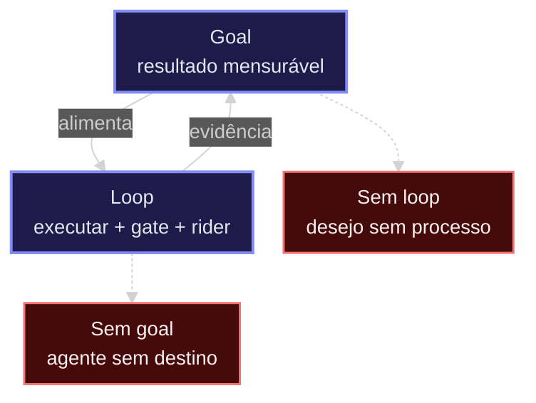
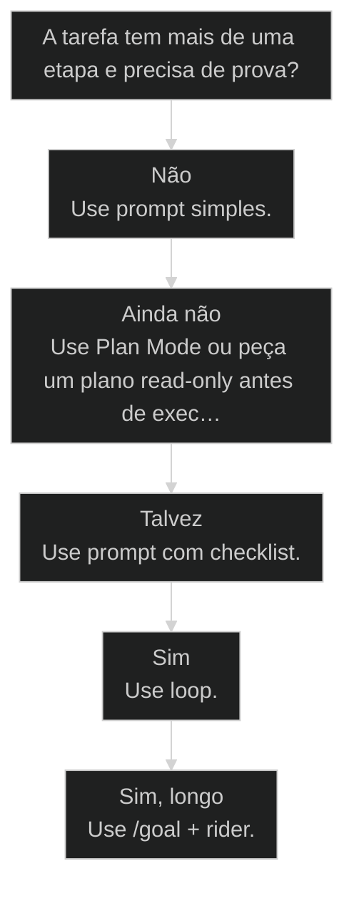

# [[Goal vs Loop]]

## Resultado

Ao final desta aula você consegue aplicar o núcleo de **Goal vs Loop** em uma decisão real do seu fluxo AIOX, com critério verificável.

> **Nota deste acervo:** comandos e squads de produção de curso (`course-creator`) vivem no monorepo `../upstream-monorepo`. Este repositório traz o curso materializado e a biblioteca de skills/squads citados na turma.

## Conceitos

- [[Ciclo do Story]]
- [[Goal vs Loop]]

## Mapa desta aula

Goal = alvo mensurável. Loop = ciclo com gate. Falta um dos dois → trava ou deriva.



> Leia o diagrama antes do texto longo. Depois volte e confira.

> Quando deixar a IA trabalhar e quando controlar o ciclo

**Objetivos de aprendizagem:**
- Diferenciar goal, loop e rider sem confundir destino com motor de execução. _(understand)_
- Escolher quando usar prompt simples, checklist, loop ou /goal em uma tarefa real. _(apply)_
- Escrever um goal com contrato de término, skills, gates e validação. _(apply)_
- Montar SPEC, AGENTS e rider como arquivos persistentes para reduzir drift em runs longas. _(apply)_
- Separar /goal, Plan Mode e templates de comunidade sem vender convenção como feature nativa. _(analyze)_
- Aplicar stop rules, limite de turnos e controles de pause/resume/clear para evitar goal death loop. _(apply)_
- Comparar Codex e Claude Code por persistência, avaliador, custo, Plan Mode e recuperação sem cair em torcida por ferramenta. _(analyze)_

---

## Goal não é 'trabalhe sem parar'

Goal é o destino verificável. Loop é o motor que repete executar, validar e corrigir. Plan Mode é análise sem editar. Rider é o trilho que impede o agente de parecer produtivo enquanto sai do caminho.

- **3**: peças: goal, loop, rider
- **4**: níveis de autonomia
- **2**: features nativas: goal e plan

- **status**: aiox advanced
- **meta**: operador=alan_nicolas
- **meta**: aula=11 goal-vs-loop
- **meta**: modo=goal/loop/rider
- **ready**: ready to stop

**Legenda de cores**

O que cada cor sinaliza nesta aula

- **Destino** (signal): estado final verificável, escrito antes do loop começar
- **Motor** (action): ciclo de executar, validar, corrigir e repetir
- **Trilho** (bench): SPEC, AGENTS, rider, gates e rubrica contra drift
- **Loop sem freio** (pain): autonomia que trabalha muito e não prova fechamento

**Como ler esta aula**

1. **Destino**: Goal descreve o estado final que precisa existir.
2. **Motor**: Loop repete execução, validação e correção até passar gate.
3. **Trilho**: Rider/spec carrega contexto, skills, rubrica e anti-drift.
4. **Prova**: A tarefa só acaba quando evidência e validators fecham.

> **Frase da aula**: Se o goal não diz quando parar, ele não é goal, é ansiedade terceirizada para a IA.

---

## Da cohort: Ralph, loop e o terminal cheio de abas

*T1 + T2 · WhatsApp*

Realidade do grupo Advanced — não é slide, é cicatriz.

Alan no grupo: o problema deixa de ser abas no Chrome e vira abas no **terminal** —
vários Ralphs e subagentes ao mesmo tempo.

E a regra de ouro que ele deu na prática:

> Eu uso vários Ralphs para **ETL**, mas **nunca para desenvolvimento**.

Goal/loop sem partição de ownership vira atropelamento de arquivo. Goal/loop com
Rider nos pontos de ouro vira [[Software House no Computador|software house]]. A cohort aprendeu isso no susto do
Max semanal e no diff bagunçado — não no slide.

> **Âncora de campo**: Ralph em ETL sim; em feature development, só com partição — senão é corrida pro conflito.

> **Materiais / FAQ**: Ver também aulas 58–59 (Ralph / paralelo vs sequencial) e FAQ-cohort §5.

---

## A diferença que destrava tudo

O erro comum é misturar feature nativa, motor de repetição e convenção de prompt engineering.

- **1. Goal**: Define onde chegar e qual evidência encerra. Sem condição de parada, a meta vira pedido aberto. [DESTINO, DoD]
- **2. Loop**: Executa ciclos enquanto houver falha objetiva. Loop bom muda a hipótese depois de cada validação. [MOTOR, validate]
- **3. Rider**: Carrega escopo, fontes, skills, stop rules e gates. É a peça que impede autonomia de virar deriva. [TRILHO, anti-drift]

- **Goal** -> Contrato de chegada. Diz qual resultado precisa existir e como saber que terminou.
- **Loop** -> Contrato de repetição. Diz como o agente deve tentar, validar, corrigir e tentar de novo.
- **Plan Mode** -> Contrato de análise sem edição. O agente lê, pesquisa e planeja sem editar até existir direção aprovada.
- **Rider** -> Contrato de condução. Diz contexto, skills, fontes, restrições, critérios e gates.
- **Template da comunidade** -> GOAL/CONTEXT/CONSTRAINTS é uma convenção útil dentro do prompt; não é sintaxe nativa obrigatória.
- **Prompt solto** -> Pedido sem destino verificável. Pode gerar trabalho bonito, mas não garante fechamento.

**Confusão comum**
- Goal = pedir para trabalhar mais.
- Loop = deixar a IA decidir tudo.
- Plan Mode = /goal mais cuidadoso.
- Rider = documento bonito para ninguém ler.
- GOAL/CONTEXT = sintaxe oficial.
- Validação = rodar teste só no final.

**Leitura correta**
- Goal = Definition of Done em linguagem operacional.
- Loop = repetir enquanto houver falha objetiva.
- Plan Mode = pesquisar e planejar sem alterar nada.
- Rider = memória operacional para evitar drift.
- GOAL/CONTEXT = técnica de estruturação, não comando nativo.
- Validação = portão em cada ciclo, não ritual final.

---

## Três coisas que parecem iguais, mas não são

A pesquisa separa o que é feature nativa, o que é modo de trabalho e o que é engenharia de prompt.

**Colunas:** Peça | O que é | Quando usar | Erro comum

- /goal: Feature nativa | trabalho com estado final verificável | achar que ele entende 'melhorar' sem prova
- Plan Mode: Modo read-only | investigar e planejar antes de editar | confundir plano com execução autônoma
- Ralph Loop: Padrão manual | experimento ou controle fino do ciclo | montar loop infinito sem stop rule
- GOAL/CONTEXT: Template de comunidade | tarefa crítica que precisa de contexto rico | vender como sintaxe oficial

> **Correção importante**: A sintaxe nativa real é curta: `/goal <condição verificável>`. O template GOAL/CONTEXT/CONSTRAINTS/DONE WHEN/VERIFY/STOP RULES é uma camada opcional para escrever uma condição melhor.

---

## Qual modo usar?

Antes de acionar autonomia, escolha o tamanho do contrato.

**Árvore de decisão**
_Quanto mais longa e ambígua, mais contrato ela precisa._



- **Não** — É pequena, reversível e fácil de conferir.
  → _Use prompt simples._
  Ex.: Renomear texto, ajustar copy, explicar um trecho.
- **Ainda não** — Você sabe que é importante, mas ainda não sabe o caminho nem o aceite.
  → _Use Plan Mode ou peça um plano read-only antes de executar._
  Ex.: Refactor arriscado, nova aula grande, migração com muitas dependências.
- **Talvez** — Tem 2-4 passos, mas pouca incerteza.
  → _Use prompt com checklist._
  Ex.: Ajustar um componente e conferir responsivo.
- **Sim** — Tem validator, teste, lint, review ou qualidade objetiva.
  → _Use loop._
  Ex.: Corrigir aula até `quality:lessons` passar.
- **Sim, longo** — Vai durar muitos ciclos e precisa manter direção.
  → _Use /goal + rider._
  Ex.: Levar todas as aulas ao padrão [[Método S2S]].

**Gate:** Você consegue escrever o estado final em uma frase verificável? — _Se não consegue, ainda não é hora de /goal._

#### Prompt simples
Uma ação, pouca incerteza, conferência manual rápida.
1. pedir
2. conferir
3. encerrar

#### Loop operacional
Executar, validar, corrigir e repetir enquanto o gate falhar.
1. executar
2. validar
3. corrigir
4. repetir

#### /goal + rider
Autonomia longa com contexto, skills, DoD e anti-drift explícitos.
1. contrato
2. ciclos
3. evidência
4. fechamento

#### Plan → Goal
Investigar sem editar, extrair critérios de aceite e só então ligar autonomia.
1. investigar
2. planejar
3. aprovar
4. executar

---

## A anatomia de um goal forte

Goal bom é curto, mas não é raso. O detalhe pesado fica no rider.

**Goal curto + rider longo + validators**

1. **Goal**: Estado final mensurável.
2. **Contexto**: Arquivos, fontes de verdade e restrições.
3. **Skills**: Especialistas por fase: didática, UX, DS, QA.
4. **Gates**: Comandos e critérios que provam avanço.
5. **Stop**: Quando encerrar ou quando pedir ajuda.

**O que cada parte responde**

Se uma célula fica vazia, o agente vai inventar.

- **Resultado**: O que precisa estar verdadeiro no final?
- **Escopo**: Onde pode mexer e onde não pode?
- **Régua**: Qual benchmark define qualidade?
- **Skills**: Quem ajuda em cada fase?
- **Gates**: Que comandos ou inspeções provam que passou?
- **Parada**: Quando encerrar sem fingir progresso?

---

## O que aparece nos bons exemplos reais

Os melhores exemplos de Claude Code e Codex não vendem mágica. Eles repetem a mesma engenharia: outcome claro, arquivos persistentes, stop rules e prova.

**Colunas:** Padrão | Pergunta | Saudável | Risco

- DONE WHEN: Como o avaliador sabe que acabou? | tests/lint/rota/artefato explícito | make it good
- SPEC.md: Onde mora o detalhe? | critério versionado no repo | detalhe perdido no chat
- AGENTS.md: Quais regras não mudam? | política, linguagem, git, validators | cada sessão reinventa padrão
- Rider: Como não sair do trilho? | fases, skills, scorecard e anti-drift | autonomia vira deriva
- STOP RULES: Quando parar? | ambiguidade, credencial, destrutivo, escopo | loop caro e infinito

**A pilha que mais se repete nos workflows bons**

1. **SPEC**: Define o que será construído ou ensinado.
2. **AGENTS**: Mantém regras estáveis entre Codex e Claude Code.
3. **Rider**: Detalha fases, skills, gates e riscos.
4. **/goal**: Dispara o trabalho autônomo com done-when verificável.
5. **Evaluator**: Confere o transcript e exige nova iteração se não fechou.

> **A sacada prática**: Goal curto sozinho é frágil. Goal curto apontando para SPEC, AGENTS e rider vira sistema.

---

## Template de goal production-ready

Use esta estrutura quando a tarefa for importante o suficiente para não caber em um pedido solto. Ela é convenção de prompt engineering, não sintaxe obrigatória do comando.

**Forma nativa mínima**
Use quando o resultado cabe em uma condição clara e provável no transcript.
- `/goal`
- `estado final`
- `evidência`
- `limite`
- `/goal`: Ativa o modo de meta com uma condição verificável.
- `Estado final`: O que precisa estar verdadeiro para encerrar.
- `Evidência`: Qual comando, artefato ou contagem prova que terminou.
- `Limite`: Quando parar por turnos, tempo, bloqueio ou ambiguidade.

**Camada estruturada da comunidade**
Use para coding, curso, módulo, refactor ou qualquer trabalho com risco de drift.
- `GOAL`
- `CONTEXT`
- `CONSTRAINTS`
- `PRIORITY`
- `PLAN`
- `DONE WHEN`
- `VERIFY`
- `OUTPUT`
- `STOP RULES`
- `GOAL`: Uma frase com resultado mensurável.
- `CONTEXT`: Repo, arquivos, estado atual e fontes de verdade.
- `CONSTRAINTS`: O que não pode mudar, onde não pode mexer e quais padrões preservar.
- `PRIORITY`: Ordem de decisão quando houver conflito.
- `PLAN`: Entender primeiro, restatar, fazer mudanças mínimas e validar.
- `DONE WHEN`: Critérios objetivos que qualquer avaliador consegue conferir.
- `VERIFY`: Testes, lint, build, rota, screenshot ou rollback plan.
- `OUTPUT`: Resumo, arquivos alterados, riscos e validações.
- `STOP RULES`: Ambiguidade real, credencial faltante, destrutivo, escopo proibido ou limite de ciclos.

**Meta-trick: peça a IA para escrever o goal**
Use quando você sabe o que quer, mas ainda não sabe formular a missão com precisão.
- `ler sessão`
- `ler repo`
- `inferir intenção`
- `perguntar lacunas`
- `gerar /goal`
- `Leia`: Analise esta conversa, o repo e os arquivos relevantes.
- `Extraia`: Identifique intenção, restrições, risco, Definition of Done e validators.
- `Scorecard`: Defina métrica, threshold, regression check e o menor teste representativo antes de rodar.
- `Pergunte`: Faça perguntas só se a ambiguidade impedir um goal seguro.
- `Escreva`: Gere um /goal curto e um rider ou SPEC separado.
- `Revise`: Critique o goal como avaliador antes de rodar.

**Fraco**
- /goal deixe o app melhor
- /goal melhore as aulas até ficarem premium
- /goal resolva tudo que encontrar
- /goal siga todos os critérios pedagógicos e pare quando estiver ótimo

**Forte**
- /goal A página X está pronta quando build, lint e teste visual passam, preservando Y.
- /goal Eleve as aulas ao padrão S2S seguindo o rider versionado e validators.
- /goal Resolva os issues do SonarQube por classe, com prova final e sem mudar arquivos fora do escopo.
- /goal Produza o rascunho verificável e deixe tom/pedagogia para revisão adversarial separada.

---

## Antes e depois do /goal

O ganho não é escrever menos. É tirar o humano do microgerenciamento quando o critério de chegada é verificável.

O velho fluxo de trabalho parecia controle: pedir uma mudança, esperar,
revisar, pedir outra correção, esperar de novo, lembrar o agente do que já
tinha sido combinado. O novo fluxo troca conversa por contrato: a pessoa
define o estado final, os limites, os gates e a regra de parada. O agente
itera sozinho enquanto houver falha objetiva.

**Workflow antigo**
- 20 mensagens para lembrar contexto.
- Correções em sequência, sem portão claro.
- Humano decide a cada tentativa se está bom.
- Fim baseado em cansaço ou aparência.

**Workflow com goal**
- 1 goal com done-when verificável.
- Loop autônomo enquanto teste/lint/review falhar.
- Evaluator ou gate confere a evidência.
- Fim baseado em prova.

**A mudança real: de conversa para contrato**

1. **Escrever contrato**: Goal, contexto, constraints, done-when e stop rules.
2. **Rodar loop**: Implementar, validar, corrigir, repetir.
3. **Avaliar transcript**: O avaliador confere se a evidência prometida apareceu.
4. **Encerrar**: Resumo final, arquivos alterados, riscos e próximos passos.

### Caso: De 20 prompts para 1 contrato

Quando o resultado é mensurável, o humano não precisa aprovar cada microcorreção.

- Começou como: Várias mensagens pequenas: corrige isso, agora roda teste, agora ajusta lint, agora me mostra.
- Virou: Um goal com DONE WHEN: todos os testes passam, lint limpo, arquivos alterados listados e riscos reportados.
- Prova: O loop continua até a evidência fechar, não até o agente parecer confiante.
- Lição: A autonomia só funciona quando a Definition of Done é observável.

---

## Recap do bloco: qual contrato usar

Antes de seguir para arquivos persistentes, fixe a régua de decisão.

> **Recap do bloco escolha**: Prompt simples para tarefa pequena e reversível. Plan Mode quando ainda falta caminho e aceite. Loop quando há gate objetivo. /goal + rider para trabalho longo. A regra de corte é uma só: você consegue escrever o estado final em uma frase verificável?

---

## SPEC, AGENTS e Rider: quem faz o quê

Em runs longas, o chat não deve ser a memória principal. A memória precisa morar no repo.

**Arquivos persistentes**

A pergunta não é qual arquivo é mais bonito. É qual ambiguidade cada um remove.

- **SPEC.md**: Define o produto, módulo ou aula: objetivo, estrutura, entregáveis e aceite.
- **AGENTS.md**: Define regras permanentes: linguagem, git, segurança, estilo, validators.
- **Rider.md**: Define a missão longa: fases, skills, scorecard, anti-drift e stop rules.
- **Ledger**: Registra progresso e decisões quando a execução dura muitos ciclos.

#### SPEC primeiro
Quando ainda não está claro o que construir ou ensinar.
1. objetivo
2. estrutura
3. aceite

#### AGENTS sempre
Quando você quer consistência entre sessões, IDEs e modelos.
1. regras
2. políticas
3. validators

#### Rider para long-run
Quando o trabalho é grande demais para caber em uma conversa.
1. fases
2. skills
3. gates
4. parada

---

## SPEC para curso: o que precisa existir

Para AIOX Courses, SPEC não é documento corporativo. É um molde para o agente saber exatamente que aula ou módulo precisa nascer.

- **1. Objetivo** (Primary Goal: resultado mensurável do módulo ou aula.; Why: por que isso existe para o aluno e para o curso.)
- **2. Estrutura** (Lessons: sequência, duração e mudança por aula.; Deliverables: scripts, quizzes, labs, diagramas, export ou artefatos.)
- **3. Aceite** (DONE WHEN: critérios que qualquer agente consegue verificar.; Validation: quality:lessons, typecheck, lint, rota e revisão didática.)
- **4. Limites** (Constraints: o que não mexer, o que não assumir, o que preservar.; Stop: quando parar por ambiguidade, credencial, custo ou escopo.)

**SPEC mínimo para uma aula AIOX**
Use antes de gerar uma aula nova, especialmente se ela virar material canônico.
- `Overview`
- `Audience`
- `Objectives`
- `Structure`
- `Done when`
- `Guidelines`
- `Validation`
- `Change log`
- `Overview`: Uma frase com o resultado de aprendizagem.
- `Audience`: Quem é o aluno, o que ele já sabe e onde costuma confundir.
- `Objectives`: 2-4 objetivos com verbo observável.
- `Structure`: Seções, exemplos, prática, portão e artefatos visuais esperados.
- `Done when`: Lista verificável de aceite didático, visual e técnico.
- `Guidelines`: Tom, linguagem, acessibilidade, marca e densidade de texto.
- `Validation`: Comandos, inspeção visual, revisão adversarial e score mínimo.
- `Change log`: Registro curto do que mudou para o documento ser vivo.

---

## O avaliador automático não substitui julgamento humano

A pesquisa deixou uma regra clara: o avaliador de /goal só consegue fechar aquilo que aparece como evidência no transcript.

**Máquina-checável**
- Teste sai com exit code 0.
- Lint não tem erro.
- Arquivo existe no path esperado.
- Rota responde 200.
- Score `quality:lessons` passou.

**Humano-checável**
- Tom está adequado para aluno comum.
- A explicação está didática de verdade.
- O visual reduz carga cognitiva.
- O exemplo convence e fixa.
- A aula parece melhor que Método S2S.

> **Regra para AIOX Courses**: Use /goal para produzir o rascunho verificável. Use revisão adversarial humana, o squad de cursos (em `../upstream-monorepo/squads/course-creator/`) ou UX para julgar pedagogia, clareza e gosto visual. Neste acervo educacional, use `squads/squad-creator/` como anatomia de referência e revisão humana para pedagogia.

**Colunas:** Critério | Vai no /goal? | Vai no review? | Por quê

- Typecheck: Sim | comando prova | binário
- Rota 200: Sim | curl/probe prova | binário
- Tom didático: Não | review pedagógico | subjetivo
- Hierarquia visual: Não sozinho | screenshot + olhar UX | avaliador pode aceitar relato
- Aula memorável: Não | humano ou adversarial review | julgamento qualitativo

---

## Codex vs Claude Code na prática

A diferença não é religiosa. É operacional: avaliador, persistência, custo, Plan Mode e recuperação mudam o melhor uso de cada ferramenta.

**Colunas:** Dimensão | Codex | Claude Code | Leitura AIOX

- /goal: GA/default em versões recentes; estado em SQLite | GA, mas session-scoped | use quando houver DONE WHEN verificável
- Evaluator: sem modelo separado público; usa templates/continuação e evidência no transcript | Haiku separado julga transcript em binário | nenhum dos dois prova o que não apareceu como evidência
- Persistência: goal DB + pause/resume/clear; melhor para runs longas | sessão + compaction; bom, mas mais frágil em multi-dia | SPEC/AGENTS/Rider continuam obrigatórios
- Memória: Memories MCP com busca, paginação e leitura por offsets | sem equivalente funcional direto | não confundir memória da ferramenta com fonte de verdade
- Custo: benchmarks independentes indicam 3-4x menos tokens | maior consumo em relatos comparativos | sempre usar limite de turns/tempo/budget
- Plan Mode: nudges/TUI; não é o mesmo read-only | read-only explícito por toggle/comando | Claude é melhor para análise sem edição
- Guardrails: token_budget, hooks e recuperação por SQLite | hooks granulares; cap duro menos claro | hooks ajudam, mas não substituem STOP RULES
- Híbrido: bom para executar longo | bom para planejar e revisar com contexto amplo | portabilidade vem dos arquivos, não da ferramenta

> **Regra AIOX**: Codex é a escolha padrão para execução longa e retomável. Claude é forte para leitura, planejamento e revisão. O sistema confiável usa os dois, mas deixa a verdade em SPEC, AGENTS e rider.

> **Cuidado com versão e hype**: Este recorte é de maio de 2026. Se a aula for usada depois, confira changelog, versão local e flags antes de prometer comportamento específico.

---

## Gaps técnicos que mudam a decisão

O aluno não precisa decorar versão. Ele precisa entender que cada diferença muda uma decisão prática.

- **Avaliador** -> Claude expõe um avaliador Haiku transcript-only. Codex não documenta um validador separado com nome; por isso a evidência precisa estar ainda mais explícita no transcript.
- **Persistência** -> Codex guarda estado de goal em SQLite e pode retomar melhor depois de crash, reboot ou TUI fechado. Claude depende mais da sessão, compaction e arquivos manuais.
- **Custo** -> Benchmarks comunitários comparáveis apontam Codex consumindo 3-4x menos tokens em tarefas longas. Ainda assim, custo real varia por plano e precisa de budget rule.
- **Plan Mode** -> Claude vence quando você quer análise read-only clara. Codex tem nudges e TUI, mas não é a mesma garantia operacional.
- **Guardrails** -> Codex tem `token_budget`, hooks e estado retomável. Claude tem hooks granulares. Em ambos, STOP RULES continuam obrigatórias.

**Colunas:** Gap | Confiança | O que ensinar | O que não prometer

- Claude Haiku evaluator: Alta | julga transcript, não filesystem | não dizer que ele roda ferramentas
- Codex sem modelo avaliador nomeado: Média | não há modelo separado público | não inventar arquitetura interna
- Codex SQLite + resume: Alta | melhor para long-running | não substituir checkpoints no repo
- Token efficiency 3-4x: Alta para benchmark, média para custo final | usar como tendência | não prometer preço fixo
- Plan Mode parity: Alta | Claude tem read-only mais claro | não vender Codex como equivalente exato
- Depreciação: Média | sem sinal atual de remoção | ferramenta muda rápido

> **Como falar para aluno comum**: Pense assim: Claude é melhor para pensar sem mexer; Codex é melhor para trabalhar por muito tempo com freios. Os dois precisam de prova escrita, porque nenhum avaliador enxerga qualidade que não aparece no registro.

---

## Fontes, confiança e incerteza

A parte madura da aula é mostrar que nem toda afirmação tem o mesmo peso.

**Colunas:** Fonte | Tipo | Uso na aula | Peso

- OpenAI Codex changelog/docs: Oficial | versão, GA/default, goals, hooks | alto
- Technical teardown: Secundária técnica | arquitetura comparada e falhas | médio/alto
- Benchmarks comunitários: Independente | direção de consumo de tokens | médio
- Relatos de runs longas: Firsthand | exemplos reais, não garantia universal | médio
- Posts soltos: Comunidade | padrões e nomes | baixo/médio

**Não ensinar assim**
- Codex sempre é mais barato.
- Claude é pior para goal.
- O avaliador do Codex funciona igual ao do Claude.
- Plan Mode é igual nas duas ferramentas.

**Ensinar assim**
- Em benchmarks comparáveis, Codex consumiu menos tokens.
- Claude tem vantagem clara em planejamento read-only.
- Codex não expõe modelo avaliador separado nas fontes públicas.
- A decisão depende de duração, risco, custo e necessidade de análise sem edição.

---

## /goal vs Ralph Loop

A diferença prática é simples: /goal é o modo nativo com avaliação entre turnos; Ralph Loop é o padrão manual de executar, verificar, criticar e repetir.

- **/goal** -> Você define uma condição de conclusão verificável. A ferramenta continua entre turnos até a condição aparecer como evidência suficiente.
- **Ralph Loop** -> Você monta manualmente o ciclo: agente trabalha, verifica contra o goal, critica a própria saída e roda outra iteração.
- **O que eles têm em comum** -> Os dois tentam resolver o mesmo problema: manter a IA trabalhando até existir prova de conclusão.
- **O que mudou** -> /goal transformou um padrão manual da comunidade em interface nativa, com pause, resume, clear e estado visível.
- **Onde mora o risco** -> Sem stop rules, turn limit e evidência objetiva, qualquer loop vira consumo de token com aparência de progresso.

**Colunas:** Aspecto | /goal nativo | Ralph Loop manual | Leitura AIOX

- Facilidade: Quem monta o ciclo? | a ferramenta cuida do próximo turno | você cria prompt/script/hook
- Parada: Quem decide o fim? | avaliador checa condição | script, prompt ou humano decide
- Controle: Quem controla cada iteração? | menos controle fino | mais customizável
- Custo: Como evita loop infinito? | condição + limite de turnos/tempo | precisa guardrail próprio
- Uso ideal: Quando escolher? | 90% das tarefas longas com DoD claro | experimentos, multi-agente ou controle avançado

**Use /goal quando**
- Existe DONE WHEN claro.
- O agente pode provar conclusão no transcript.
- Você quer autonomia sem babysitting.
- A tarefa é longa, mas tem validator ou evidência objetiva.

**Use Ralph Loop quando**
- Você precisa controlar a crítica a cada ciclo.
- Há vários agentes ou ferramentas alternando.
- O loop precisa de script, ledger ou heurística própria.
- Você está testando uma metodologia nova.

> **Regra de decisão**: Para AIOX Courses, comece com /goal + SPEC/AGENTS/Rider. Só use Ralph Loop quando o controle adicional justificar o risco extra.

---

## O padrão híbrido: pro model cria o goal

O fluxo mais forte não começa rodando o goal. Começa pedindo a um modelo mais forte para escrever o contrato certo.

**Goal engineering loop**

1. **Analisar**: Modelo forte lê sessão, repo, SPEC e intenção.
2. **Forjar**: Ele escreve /goal, constraints, done-when, verify e stop rules.
3. **Rodar**: Codex ou Claude executa o goal com arquivos persistentes.
4. **Criticar**: Outro olhar revisa output, riscos e evidência.
5. **Iterar**: Se a crítica é objetiva, volta para o loop.

**Híbrido para AIOX Courses**
Use quando a tarefa é grande demais para confiar no primeiro goal escrito à mão.
- `criar SPEC`
- `forjar /goal`
- `executar`
- `review adversarial`
- `corrigir`
- `SPEC.md`: Define aula, módulo, objetivos, entregáveis e critérios.
- `Goal forge`: Modelo forte converte SPEC + contexto em /goal curto e rider claro.
- `Execução`: Agente roda em loop até validators e DoD passarem.
- `Review`: Segundo agente ou humano revisa didática, visual, técnica e risco.
- `Fechamento`: Só encerra com prova, não com relato otimista.

---

## Recap do bloco: Codex, Claude e o loop

Feche a comparação antes de partir para a operação em AIOX Courses.

> **Recap do bloco ferramentas**: Codex é a escolha padrão para execução longa e retomável; Claude é forte para planejar e revisar com Plan Mode read-only. Nenhum avaliador enxerga qualidade que não aparece no transcript. /goal nativo cobre 90% das tarefas longas com DoD claro; Ralph Loop só quando o controle fino justifica o risco. A verdade mora em SPEC, AGENTS e rider, não na ferramenta.

---

## Três exemplos que o aluno consegue copiar

A ideia fica mais fácil quando vira caso real, com frase fraca, frase forte e evidência esperada.

- **01 Testes de autenticação**: escopo pequeno, arquivos protegidos (#case-auth-tests-goal)
- **02 Issues de qualidade**: problemas agrupados por classe (#case-sonarqube-goal)
- **03 Módulo de curso**: gate técnico + gate de aprendizagem (#case-module-course-goal)

**Como ler os exemplos**

O padrão é sempre converter intenção vaga em prova concreta.

- **Frase fraca**: O que o aluno escreveria no impulso.
- **Frase forte**: O mesmo pedido com escopo, critério e parada.
- **Evidência**: O que precisa aparecer no final para acreditar.
- **Lição**: A regra reutilizável para o próximo goal.

**Exemplos verificados que viram padrão**
Use para mostrar ao aluno a diferença entre frase curta e contrato suficiente.
- `migração`
- `eval`
- `teste/lint`
- `coverage`
- `Migração`: `/goal Finish the migration and keep tests green.` Curto, mas tem estado final: migração concluída e testes verdes.
- `Eval`: Melhorar prompt até accuracy 85% ou parar após 20 iterações. Tem métrica e freio.
- `Teste/lint`: Todos os testes em `test/auth` passam e lint está limpo. É o exemplo clássico de done-when binário.
- `Coverage`: Cobertura de `src/billing/` chega a 85% e lint passa. Número objetivo reduz interpretação.

### Caso: Caso 1: testes de autenticação

Quando o escopo é pequeno, o goal precisa proteger arquivos fora do alvo.

- Começou como: Arruma os testes de auth.
- Virou: Faça todos os testes em `test/auth` passarem sem modificar outros arquivos de teste. Pare após 20 ciclos ou reporte bloqueio.
- Prova: Evidência: comando de teste passando, arquivos alterados listados e nenhum teste fora do escopo modificado.
- Lição: Scope constraint evita uma correção que passa por quebrar outro lugar.

### Caso: Caso 2: issues de qualidade

Quando há muitos problemas parecidos, agrupe por classe de remediação.

- Começou como: Resolva todos os problemas do SonarQube.
- Virou: Resolva os issues do SonarQube por classe, em blocos separados, com artefato final provando o que foi corrigido.
- Prova: Evidência: relatório antes/depois, classes de issue, comandos executados e riscos remanescentes.
- Lição: Agrupar por classe impede que o agente trate 80 sintomas como 80 decisões diferentes.

### Caso: Caso 3: módulo de curso

Quando a entrega é educacional, teste verde não basta.

- Começou como: Crie um módulo sobre goals.
- Virou: Implemente o módulo conforme SPEC.md, com objetivos, exemplos, prática, portão, visual S2S+, validators e revisão didática.
- Prova: Evidência: aula renderizada, quality score, rota 200, revisão visual e checklist pedagógico.
- Lição: Curso precisa de gate técnico e gate de aprendizagem.

---

## Sequência operacional com AIOX

O aluno não precisa decorar nomes. Ele precisa entender quando cada skill entra.

**Melhorar aulas em autonomia longa**
Use quando o trabalho tem muitas aulas, design, dados estruturados e validação.
- `ler rider`
- `diagnosticar aula`
- `melhorar conteúdo`
- `melhorar UI`
- `validar`
- `repetir`
- `course-creator` (fonte: `../upstream-monorepo/squads/course-creator/`): Diagnostica didática, objetivos, exemplos, prática e Portão da aula.
- `AIOX:aiox-ux-designer`: Ajusta hierarquia, sidebar, hero, espaçamento e leitura.
- `AIOX:design-system`: Garante wrappers finos e uso de Brandbook antes de criar componente local.
- `AIOX:visual-knowledge-chief`: Converte conceitos abstratos em diagramas, matrizes e fluxos.
- `AIOX:aiox-dev`: Implementa YAML, TS, TSX e CSS local sem quebrar rotas.
- `AIOX:aiox-qa`: Roda typecheck, lint, quality:lessons, YAML changed e doctor.

**Protocolo anti-loop antes de dormir**
Use antes de qualquer /goal longo, caro ou com múltiplas aulas.
- `SPEC`
- `scorecard`
- `baseline`
- `monitorar`
- `controle`
- `SPEC/Rider`: Coloque DoD, constraints, non-goals, skills e gates em arquivo persistente antes do goal.
- `Scorecard`: Defina threshold, regression check e o teste rápido que prova avanço em cada ciclo.
- `Baseline`: Rode os validadores principais antes para não culpar o goal por falha antiga.
- `3-5 turns`: Monitore as primeiras iterações. Se ele entendeu errado no começo, a autonomia só amplifica o erro.
- `pause/resume/clear`: Use `/goal pause` para congelar, `/goal resume` para continuar e `/goal clear` para matar um loop ruim.

**SOP mínimo de um ciclo**
Uma aula por ciclo, conteúdo antes do visual, validação antes de avançar.
- **Escolher**: Selecionar a aula mais fraca ou mais quebrada.
- **Comparar**: Medir contra Método S2S: clareza, profundidade, visual, prática, prova.
- **Editar**: Melhorar o menor conjunto de arquivos que resolve o gap.
- **Validar**: Rodar gates e abrir rota quando houver mudança visual.
- **Repetir**: Só passar para a próxima aula depois do portão fechar.

**Segundo olhar antes de fechar**
Use quando o avaliador automático pode passar algo tecnicamente correto, mas didaticamente fraco.
- `gerar`
- `validar`
- `revisar contra`
- `corrigir`
- `fechar`
- `AIOX:aiox-qa`: Confere validadores e riscos técnicos.
- `course-creator` (fonte: `../upstream-monorepo/squads/course-creator/`): Confere clareza, objetivo, exemplo, prática e Portão da aula.
- `AIOX:aiox-ux-designer`: Confere se a aula está legível, com ritmo e sem ruído visual.
- `Critério`: Se o segundo olhar encontrar risco real, volta para o loop.

---

## Como evitar goal death loop

Um goal seguro não depende de fé no agente. Ele tem freio, evidência e regra para parar quando o loop não aprende.

- **DONE WHEN vago**: Melhorar até ficar excelente.
- **Contradição**: Não mude nada, mas reformule tudo.
- **Sem limite**: Continue até terminar.
- **Input humano**: Precisa de aprovação, credencial ou decisão externa.
- **Sub-agente quebrado**: Um orquestrador continua chamando uma peça que falha.

**Colunas:** Risco | Sinal | Freio correto | Sem freio vira

- DoD: Não existe prova objetiva | DONE WHEN + VERIFY | trabalho infinito
- Turnos: O goal pode rodar sem fim | 25 turns ou 4h | credit burn
- Erro igual: Falhou 3 vezes do mesmo jeito | pausar e explicar bloqueio | tentativa cega
- Permissão: Precisa de input do usuário | perguntar uma vez | retry loop
- Escopo: Quer expandir requisitos | non-goals explícitos | drift caro

**Workflow seguro para AIOX Courses**
Use quando for revisar uma aula ou módulo inteiro com /goal.
- `SPEC`
- `goal`
- `turnos iniciais`
- `pausar se desviar`
- `fechar com prova`
- `1. SPEC primeiro`: Revise objetivo, deliverables, constraints, non-goals e acceptance criteria.
- `2. Goal gerado por modelo forte`: Peça para converter intenção em /goal com DONE WHEN, VERIFY e STOP RULES.
- `3. Primeiras 3-5 turns`: Observe se o agente entendeu o caminho. Se começou errado, pause cedo.
- `4. Controle manual`: `/goal pause` congela, `/goal resume` continua, `/goal clear` encerra.
- `5. Prova final`: O final precisa mostrar outputs de validação, arquivos alterados e riscos residuais.

**STOP RULES copiável**
```text
STOP RULES:
- Halt immediately after 25 turns maximum or 4 hours of wall time.
- If any condition is ambiguous or contradictory, report the exact conflict and pause.
- Never invent requirements or expand scope.
- If user input, credential or permission is needed, ask once and pause.
- If the same error repeats 3 times, stop and summarize what is blocked.
- Do not delete tests, shrink content or remove acceptance criteria just to pass validation.

```
*O objetivo do freio não é deixar o agente menos autônomo. É impedir autonomia sem aprendizado.*

---

## Caso real: AIOX Courses

A diferença entre uma meta fraca e um goal operacional apareceu neste próprio app.

A meta inicial parecia correta: melhorar as aulas até ficarem superiores ao
Método S2S. Mas isso ainda deixava espaço demais para progresso falso. O
agente poderia melhorar uma aula, mexer em layout, rodar algum comando e
parecer produtivo sem fechar o sistema inteiro. O rider transformou a
intenção em contrato: quais aulas, qual régua, quais skills, quais gates,
onde pode mexer e quando parar.

**Meta fraca**
- Melhore as aulas até ficarem melhores.
- Use bom senso.
- Continue trabalhando.
- Me avise quando terminar.

**Goal operacional**
- Todas as aulas disponíveis passam na régua S2S.
- Siga rider com skills e fontes de verdade.
- Rode validators e corrija em loop.
- Pare só com Definition of Done satisfeita.

### Caso: De desejo para contrato

A frase 'melhorar aulas' virou uma rotina verificável de melhoria aula por aula.

- Começou como: Melhorar as aulas visualmente e didaticamente até ficarem melhores que Método S2S.
- Virou: Rider com escopo, fontes de verdade, skills por fase, scorecard, validators e Definition of Done.
- Prova: O arquivo `docs/goals/aiox-courses-s2s-rider.md` define o que fazer, como validar e quando parar.
- Lição: Goal bom não aumenta autonomia por coragem. Aumenta autonomia porque reduz ambiguidade.

---

## Armadilhas que parecem produtividade

O agente pode trabalhar muito e ainda assim não avançar no resultado.

- **Autonomia**: Deixar o agente decidir qualquer coisa.
- **Loop**: Repetir comandos sem mudar a hipótese.
- **Validação**: Rodar um comando verde e ignorar a experiência.
- **Rider**: Documento longo para parecer elaborado.
- **Evaluator**: Modelo avaliador que nunca erra.
- **Set and forget**: Ligar o goal e nunca mais olhar.
- **Budget**: Achar que a ferramenta sempre vai parar antes de gastar demais.
- **Transcript**: Achar que o avaliador vê o filesystem sozinho.

**Colunas:** Sinal | Pergunta | Saudável | Risco

- Goal: Tem estado final? | DoD explícita | trabalhar sem parar
- Loop: Tem gate objetivo? | falhou → corrige → reroda | tentativa aleatória
- Rider: Tem fontes e skills? | contexto estável | drift de contexto
- Fechamento: Tem evidência? | validators + rota | relato sem prova
- Custo: Tem limite de ciclos? | stop rule ou budget | credit burn
- Compaction: O contexto crítico está no repo? | SPEC/AGENTS/Rider | memória perdida no resumo
- Baseline: Você sabe o estado inicial? | teste/lint antes do goal | loop tentando consertar falha antiga
- Escape hatch: O agente pode burlar? | não reduzir contagem de testes/arquivos | deletar teste para passar
- Permissão: Precisa de você? | pergunta uma vez e pausa | pede aprovação em loop
- Erro repetido: A mesma falha apareceu 3 vezes? | para e diagnostica | goal death loop

---

## Recap do bloco: operar com prova

Antes da prática, fixe o protocolo operacional anti-deriva.

> **Recap do bloco operação**: Converta frase vaga em contrato: escopo, frase forte e evidência esperada. Roteie skills por fase, uma aula por ciclo, conteúdo antes do visual, validação antes de avançar. Antes de qualquer /goal longo: SPEC/Rider, scorecard, baseline, monitorar as primeiras turns e dominar pause/resume/clear. Trabalho muito sem avanço no resultado é deriva, não produtividade.

---

## Prática: converta uma meta fraca em goal

Pegue uma tarefa que você pediria de forma vaga e converta em contrato de execução.

**Template prático**
Use antes de qualquer tarefa longa em Codex ou Claude Code.
- `Goal`
- `Contexto`
- `Skills`
- `Gates`
- `Stop`
- `Goal`: O resultado final é...
- `Contexto`: As fontes de verdade são...
- `Skills`: Use estas skills por fase...
- `Gates`: Está pronto quando estes validadores e inspeções passarem...
- `Stop`: Pare e peça ajuda somente se...

**Prompt final para AIOX Courses**
Use como base quando for abrir um goal real para melhorar cursos e aulas.
- `/goal`
- `seguir rider`
- `uma aula por ciclo`
- `validar`
- `reportar prova`
- `/goal`: Levar as aulas disponíveis do AIOX Advanced ao padrão Método S2S+.
- `Rider`: Seguir `docs/goals/aiox-courses-s2s-rider.md` como contrato operacional.
- `Skills`: Usar course-creator para didática, UX para layout, design-system para componentes, QA para gates.
- `Done when`: Cada aula tem objetivos, exemplo real, visual, prática, Portão da aula, rota 200 e score aprovado.
- `Verify`: `quality:lessons`, typecheck, lint, YAML changed, doctor e inspeção visual quando houver mudança de UI.
- `Stop`: Parar por ambiguidade real, credencial, operação destrutiva, escopo proibido, input humano, limite de turns ou erro repetido 3 vezes.

**Exemplo preenchido: meta fraca virando contrato**

- **Meta fraca**: Melhore as aulas do AIOX Advanced.
- **Goal**: Todas as aulas disponíveis passam pela régua S2S+: objetivo claro, exemplo real, prática, portão da aula e rota 200.
- **Contexto**: Usar content.yaml como fonte de verdade, preservar voz Alan e comparar com Método S2S.
- **Gates**: Schema zod, typecheck, qualidade de lição, renderização 200 e inspeção visual quando houver bloco novo.
- **Stop**: Pausar por ambiguidade real, credencial, operação destrutiva, escopo proibido ou erro repetido.

> **Portão da aula**: Você entendeu [[Goal vs Loop]] quando consegue escrever um goal que não depende de confiança no agente, e sim de prova: escopo, SPEC/AGENTS/Rider, skills, gates, stop rules e Definition of Done.

- 1. ****: Escreva a versão fraca da meta em uma frase, sem tentar embelezar.
- 2. ****: Defina o estado final verificável: o que precisa existir para dizer que terminou?
- 3. ****: Liste fontes de verdade, arquivos, skills e restrições.
- 4. ****: Escolha os gates: quais comandos, inspeções ou provas precisam passar?
- 5. ****: Decida se precisa de SPEC.md, AGENTS.md, rider.md ou só prompt com checklist.
- 6. ****: Escreva o stop condition: quando parar, quando pedir ajuda e qual limite de ciclos usar.
- 7. ****: Defina controle manual: quando usar `/goal pause`, `/goal resume` e `/goal clear`.

**Funcionou se:**

- Você separou destino (goal) de motor (loop).
- Você escreveu pelo menos três gates objetivos.
- Você escolheu skills por fase, não como enfeite.
- Você decidiu que memória precisa ir para SPEC, AGENTS ou Rider.
- Você definiu quando parar.

---

## Recap

A autonomia fica segura quando o agente não precisa adivinhar o que é bom.

- **Goal**: Destino verificável. Define o que precisa existir no final.
- **Loop**: Motor de repetição. Executa, valida, corrige e tenta de novo.
- **Rider**: Contrato de condução. Carrega contexto, skills, fontes, gates e anti-drift.
- **SPEC.md**: Documento que descreve o módulo, entregáveis e critérios de aceite.
- **AGENTS.md**: Documento de regras permanentes para manter consistência entre sessões e ferramentas.
- **Evaluator**: Modelo ou gate que verifica se o transcript provou a Definition of Done.
- **Stop rule**: Regra que impede loop infinito, custo sem controle ou decisão fora do escopo.
- **Ralph Loop**: Padrão manual de autoavaliação: trabalhar, verificar, criticar e repetir até o goal ser atingido.
- **Hyper loop**: Fluxo híbrido em que um modelo forte escreve o goal, outro executa e outro revisa criticamente.
- **Gate**: Prova de passagem. Sem gate, o agente só relata progresso.

> **A regra simples**: Prompt simples para tarefa simples. Loop para tarefa com gate. /goal + rider para trabalho longo com risco de drift.

---

## Bloco de código: um /goal com rider e stop rule

A anatomia de um goal verificável, para o aluno converter meta fraca em contrato.

**Goal fraco vs goal contrato**
```text
# Goal fraco (o agente relata progresso mas nunca termina):
/goal "melhorar as aulas"

# Antes do goal, se ainda houver incerteza:
/plan "Leia a aula, o rider e os materiais de pesquisa.
  Proponha acceptance criteria maquina-checaveis e gaps humanos.
  Nao edite arquivos ainda."

# Goal contrato (Definition of Done + gate + stop rule):
/goal "Levar todas as aulas disponiveis ao padrao S2S+.
  DoD maquina-checavel:
    - quality:lessons PASS
    - typecheck PASS
    - lint sem erro
    - YAML changed PASS
    - doctor sem erro bloqueante
  Constraints:
    - nao criar componente local se o brandbook ja tiver equivalente
    - nao reduzir profundidade didatica para passar score
  Stop rules:
    - pare apos 25 turnos
    - pare se precisar de credencial ou operacao destrutiva
    - se precisar de input humano, pergunte uma vez e pause
    - se o mesmo erro repetir 3 vezes, reporte bloqueio e evidencias
    - nunca delete testes, reduza conteudo ou remova criterio para passar validacao."

```
*Avaliador automático fecha critérios que aparecem no transcript. Clareza pedagógica e qualidade visual ainda pedem review adversarial.*

***

---

## Operar isto na prática

Esta aula é pré-requisito no curso de squads — quando a missão for real, siga para: Agent Autonomy: `cursos/AIOX-Advanced-Squads/aulas/05-agent-autonomy.md`

## Navegação

← [[aulas/49-apply-qa-fixes-loop|Apply QA Fixes Loop: QA volta para Dev sem perder estado]] · ↑ [[modulos/Módulo 3 - Determinismo e Comando|M3 — Determinismo e comando]] · ⌂ [[cursos/AIOX Advanced/README|Curso]] · → [[aulas/20-determinismo-progressivo|Determinismo Progressivo: 30, 60, 90]]
