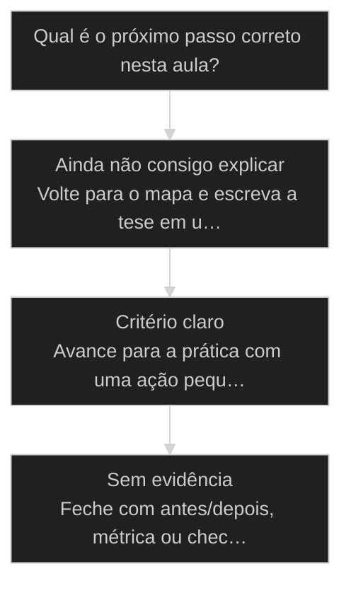
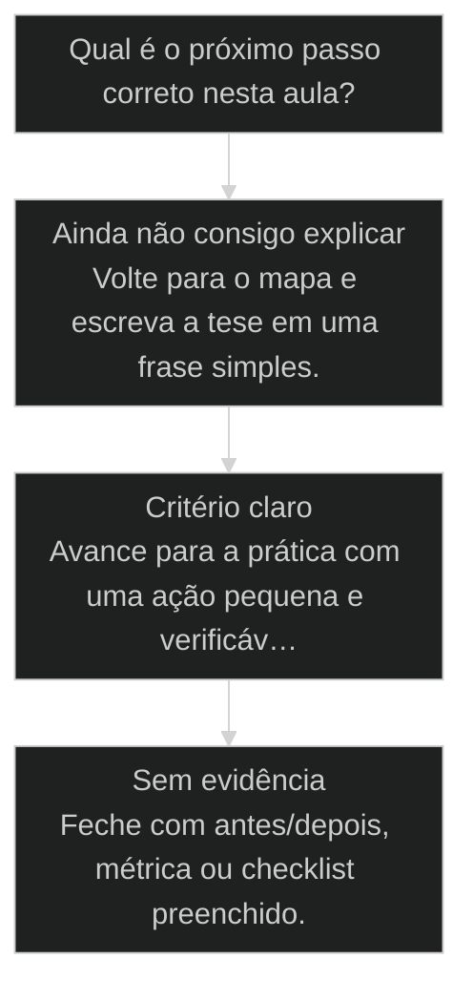

# YAML, Markdown, JSON: o sweet spot para LLM

> **Papel curricular:** extensão aplicada ao AIOX. Base técnica canônica: `cursos/Introducao-a-Arquitetura-de-Sistemas/aulas/07-json-yaml-markdown-contratos.md`.

Para navegar o course-brain com grafo e [[Wikilink|wikilinks]], o ambiente recomendado é o [[Obsidian]] (vault na raiz ou em `cursos/`).

## Conceitos

- [[Engenharia de Contexto]]

## Mapa desta aula

Decisão-chave da aula — Qual é o próximo passo correto nesta aula?



> Leia o diagrama antes do texto longo. Depois volte e confira.

> Qual formato para qual artefato. A regra que evita ruído no contexto e parsing quebrado.

**Objetivos de aprendizagem:**
- Explicar o trabalho de cada formato: YAML, Markdown e JSON, para consumo por LLM. _(understand)_
- Diferenciar quando um formato gera ruído ou parsing quebrado fora do seu sweet spot. _(understand)_
- Escolher o formato de cada artefato do projeto justificando por critério. _(apply)_

---

## O que você consegue no fim desta aula

*G · Destino*

Destino claro antes do conteúdo técnico.

Você escolhe YAML, Markdown ou JSON para cada tipo de artefato e justifica o sweet
spot pra LLM. Resultado: tabela artefato→formato para o teu repo.

- **Destino**: YAML, Markdown, JSON: o sweet spot para LLM
- **Como saber que chegou**: Exercício final da aula com evidência escrita.

---

## O ponto de partida real

*P · Onde você está*

Empatia com o sintoma — sem moralismo.

Tem quem joga tudo em JSON porque 'é estruturado', e tem quem joga tudo em prosa
porque 'a IA entende'. Os dois erram o ponto. O formato é contrato de atenção do modelo.
Se você já perdeu tempo com YAML ilegível ou MD sem schema, vamos fechar o mapa.

> **Âncora**: Se o sintoma não for o seu, anote o do seu time — a aula ainda vale como mapa.

---

## YAML, Markdown, JSON: o sweet spot

*Conceito · M2 Setup · Por Alan Nicolas*

Os três formatos parecem intercambiáveis até você usar o errado. Aí o LLM se perde no ruído ou o parsing quebra. Cada formato tem um trabalho, e casar formato com artefato evita as duas dores.

- **3 formatos**: YAML, Markdown, JSON
- **1 regra**: casar o formato com o trabalho do artefato
- **0 ruído**: formato certo não polui o contexto

- **status**: aiox advanced · m2 setup
- **meta**: principio=sweet-spot-formato
- **meta**: fonte=aula-07 + t2-aula-2
- **ready**: match format to artifact

**Legenda de cores**

Os 3 formatos e o erro

- **YAML** (signal): config e dados que humano edita
- **Markdown** (insight): prosa e instrução que o LLM lê
- **JSON** (bench): troca entre máquinas, schema estrito
- **Sweet spot** (action): formato casado com o artefato
- **Ruído** (pain): formato errado quebra parsing ou polui

---

## Cada formato tem um trabalho

Formato não é gosto, é função. YAML é feito pra config legível. Markdown é feito pra texto. JSON é feito pra troca estrita. Usar fora do trabalho gera ruído pro LLM ou erro de parsing.

> **A regra que sustenta a aula**: Pergunte qual é o trabalho do artefato antes de escolher o formato. Se é config que humano edita e o LLM lê, é YAML. Se é prosa ou instrução, é Markdown. Se é troca entre sistemas com schema estrito, é JSON. Errar o formato custa ruído de contexto ou parsing quebrado.

**Formato por hábito**
- JSON pra config que humano edita na mão.
- Markdown pra dados estruturados que precisam ser parseados.
- YAML aninhado fundo pra dado de troca entre sistemas.
- Mistura tudo e deixa o LLM adivinhar a estrutura.

**Formato por trabalho**
- YAML pra config: legível, sem ruído de aspas e vírgulas.
- Markdown pra prosa e instrução que o LLM lê como texto.
- JSON pra troca estrita entre máquinas.
- Cada artefato no formato que o trabalho dele pede.

---

## O caminho da aula

Três movimentos: entender o trabalho de cada formato, ver o caso do formato errado que gerou ruído, e escolher o formato dos seus artefatos.

**Os 3 movimentos**

1. **O trabalho de cada formato**: YAML, Markdown e JSON e o que cada um faz bem.
2. **O formato errado**: o caso do JSON de config que virou fonte de erro.
3. **Escolher por critério**: casar o formato com cada artefato do projeto.

- **Você vai sair sabendo** (O trabalho que cada formato faz bem e mal.; Por que o formato errado gera ruído ou parsing quebrado.; O critério para escolher entre YAML, Markdown e JSON.)
- **Você vai sair fazendo**: A escolha de formato para cada artefato do seu projeto, justificada por critério.

---

## O JSON de config que virou fonte de erro

Uma config que humano editava na mão estava em JSON. Vírgula a mais, aspas faltando, e o parsing quebrava toda semana. Trocar para YAML acabou com a classe inteira de erro.

- **Config humana em YAML**: 95%
- **Config humana em JSON**: 40%
- **Troca entre máquinas em JSON**: 95%
- **Instrução longa em Markdown**: 90%

### Caso: Trocar o formato matou a classe de erro

JSON é ótimo entre máquinas e péssimo na mão humana. Cada vírgula e aspas é uma chance de quebrar o parsing.

- Começou como: Config editada na mão por humanos, guardada em JSON estrito.
- Virou: A mesma config em YAML, legível, sem ruído de aspas e vírgulas.
- Prova: A classe de erro de parsing por vírgula ou aspas faltando sumiu.
- Lição: Config que humano edita pede YAML. JSON estrito é para troca entre máquinas.

---

## WHY / WHAT / HOW do sweet spot

As 3 camadas que transformam a escolha de formato de gosto em critério.

- **1. WHY - Formato errado vira ruído**: O LLM lê o que você dá. Formato fora do trabalho dele adiciona ruído (sintaxe que o humano erra) ou quebra o parsing (estrutura que a máquina não fecha). O custo aparece como erro ou alucinação. [WHY, ruído]
- **2. WHAT - Cada formato no seu trabalho**: YAML para config e dados que humano edita e o LLM lê. Markdown para prosa, instrução e documentação. JSON para troca entre máquinas e schema estrito. [WHAT, trabalho do formato]
- **3. HOW - Pergunte o trabalho do artefato**: Antes de escolher, pergunte: quem edita e quem consome? Humano editando é YAML. Texto pra ler é Markdown. Máquina trocando com schema é JSON. A resposta nomeia o formato. [HOW, quem edita, quem consome]

---

## Os 3 formatos por dentro

Cada formato com o que faz bem, o que faz mal e o artefato típico. A grade que você consulta ao decidir.

- **YAML**: Legível, aceita comentário, sem ruído de aspas. Ótimo pra config e dados que humano edita.
- **Markdown**: Texto com estrutura leve. Ótimo pra prosa, instrução e documentação que o LLM lê.
- **JSON**: Estrito, sem comentário, exige sintaxe perfeita. Ótimo pra troca entre máquinas e schema.

**Colunas:** Formato | Faz bem | Faz mal | Artefato típico

- YAML: config legível, comentários | dado profundo de máquina | core-config, [[Frontmatter|frontmatter]], content.yaml
- Markdown: prosa e instrução | dado estruturado parseável | [[CLAUDE md|CLAUDE.md]], docs, prompts
- JSON: troca estrita, schema | edição humana na mão | API, interchange, registry

---

## A sequência de escolha

Os passos concretos para escolher o formato de um artefato sem cair no hábito.

**Escolher o formato de um artefato**
Use ao criar qualquer arquivo novo no projeto.
- `quem-edita`
- `quem-consome`
- `estrutura`
- `decidir`
- `quem-edita`: Humano edita na mão ou só máquina escreve?
- `quem-consome`: O LLM lê como texto, ou um sistema parseia com schema?
- `estrutura`: É prosa, é config tabular, ou é troca estrita?
- `decidir`: Humano + config = YAML. Texto = Markdown. Máquina + schema = JSON.

**Da pergunta ao formato**

1. **Quem edita?**: humano na mão ou máquina.
2. **É prosa?**: se é texto pra ler, Markdown.
3. **É config humana?**: se humano edita estrutura, YAML.
4. **É troca estrita?**: se máquina troca com schema, JSON.

---

## Não confunda os papéis

Três confusões que levam ao formato errado e ao ruído que vem junto.

- **YAML para humano, não JSON para humano**: JSON parece mais sério e estruturado.
- **Markdown para prosa, não para dado tabular**: Markdown parece organizar tudo com tabelas.
- **JSON para máquinas, não para config editável**: JSON é universal entre sistemas.

- **Humano edita config** -> formato = YAML.
- **Texto e instrução pra ler** -> formato = Markdown.
- **Troca estrita entre sistemas** -> formato = JSON.

---

## Caso benchmark: aplicar YAML, Markdown, JSON: o sweet spot para LLM em uma decisão real

Um segundo caso para tirar a aula do conceito isolado e mostrar como o operador transforma o princípio em decisão, execução e evidência.

- **O que mudou na operação**: A aula deixou de ser uma explicação e virou uma lente de decisão. O aluno sabe que sinal observar, qual rota escolher e que evidência precisa produzir. Players: sinal, rota, execução, evidência.
- **Por que isso eleva a qualidade**: O padrão espelha o [[Método S2S]]: capturar o sinal, estruturar o caminho, executar com limite e fechar com prova.

**Matriz de aplicação**

Use esta matriz quando a aula parecer clara, mas a ação ainda estiver vaga.

- **Sinal claro**: O aluno consegue nomear o que a aula ensina a observar.
- **Rota escolhida**: A próxima ação nasce de critério, não de vontade de testar ferramenta.
- **Risco visível**: O erro provável fica explícito antes de executar.
- **Prova mínima**: Existe uma evidência simples para dizer que avançou.

### Caso: Quando o conceito precisou virar critério de execução

O operador já tinha entendido a tese, mas ainda precisava decidir o próximo passo sem cair em improviso.

- Começou como: Conceito entendido em teoria, sem critério de aplicação na task real.
- Virou: Decisão roteada por sinais, riscos, evidências e próximo passo verificável.
- Prova: A saída passou a ter ação, dono, critério e evidência de fechamento.
- Lição: Aula de qualidade não termina em entendimento. Termina quando o aluno consegue agir com critério.

---

## Router de decisão da aula

O ponto em que YAML, Markdown, JSON: o sweet spot para LLM deixa de ser explicação e vira escolha operacional.

**Árvore de decisão**
_Não escolha comando antes de nomear o tipo de situação._



- **Ainda não consigo explicar** — O aluno repete a frase da aula, mas não consegue aplicar em exemplo próprio.
  → _Volte para o mapa e escreva a tese em uma frase simples._
- **Critério claro** — O aluno identifica sinal, risco e decisão antes da ferramenta.
  → _Avance para a prática com uma ação pequena e verificável._
- **Sem evidência** — A ação foi feita, mas não existe prova de melhoria ou decisão registrada.
  → _Feche com antes/depois, métrica ou checklist preenchido._

**Gate:** Você sabe qual rota seguir e como provar que avançou? — _Se a resposta ainda depende de opinião, volte uma etapa._

#### Entender o princípio
Quando a aula ainda parece uma tese abstrata.
1. **Nomear: escreva a tese em uma frase.
2. **Exemplo: traga um caso próprio pequeno.
3. **Risco: diga o erro que a aula evita.

#### Aplicar em uma task
Quando o critério está claro e falta execução.
1. **Escolher: defina a menor ação verificável.
2. **Executar: faça sem expandir escopo.
3. **Provar: registre o delta produzido.

#### Revisar a decisão
Quando a execução aconteceu, mas a evidência ficou fraca.
1. **Comparar: olhe antes e depois.
2. **Ajustar: corrija a menor falha.
3. **Fechar: só conclua com prova.

**Colunas:** Estado | Pergunta | Sinal saudável | Sinal de risco

- Entendimento: Consigo explicar sem copiar a aula? | frase própria e exemplo próprio | repetição bonita sem aplicação
- Decisão: Escolhi rota antes da ferramenta? | sinal e risco nomeados | comando escolhido por hábito
- Prova: Tenho evidência de avanço? | antes/depois ou checklist | sensação de que ficou melhor

---

## Processo operacional mínimo

A sequência mínima para aplicar YAML, Markdown, JSON: o sweet spot para LLM sem transformar a aula em teoria solta.

**Aula → Task → Evidência**
Rota curta para transformar o conceito em ação repetível.
- **Plan**: Nomeie o sinal da aula, o risco que ela evita e o artefato que será produzido.
- **Do**: Execute a menor ação que prova o conceito sem abrir novo escopo.
- **Check**: Compare a saída com o critério de aceite da aula.
- **Act**: Registre a regra aprendida e remova o que não será reutilizado.

**Aplicar com evidência**
Use quando a aula fizer sentido, mas a task ainda estiver sem formato.
- `sinal`
- `risco`
- `ação`
- `prova`
- `sinal`: O que esta aula me ensinou a perceber?
- `risco`: Que erro acontece se eu ignorar esse sinal?
- `ação`: Qual é a menor execução que testa o princípio?
- `prova`: Que evidência mostra que a decisão melhorou?

**Do conceito ao comportamento**

1. **Conceito**: entender a tese central da aula.
2. **Critério**: transformar a tese em pergunta de decisão.
3. **Ação**: executar a menor tarefa que prova avanço.
4. **Memória**: registrar o padrão para repetir depois.

---

## Distinções que evitam falsa competência

Três diferenças que protegem YAML, Markdown, JSON: o sweet spot para LLM de virar jargão ou checklist vazio.

**Parece que aprendeu**
- Repete a tese da aula sem exemplo próprio.
- Escolhe ferramenta antes de escolher critério.
- Fecha a task porque executou algo.

**Aprendeu de verdade**
- Explica o princípio em uma situação própria.
- Escolhe rota, risco e evidência antes do comando.
- Fecha a task quando existe prova de avanço.

- **entender com aplicar**: Entender é conseguir repetir a ideia.
- **ação com evidência**: Fazer algo gera movimento.
- **checklist com processo**: Checklist pode ser preenchido no automático.

**Exemplo preenchido: saída esperada do aluno**

- **Tese**: A aula me ensinou a observar um sinal específico antes de escolher ferramenta.
- **Risco**: Se eu pular esse critério, executo rápido e descubro tarde que a direção estava errada.
- **Ação**: Vou aplicar em uma task pequena, com escopo fechado e antes/depois visível.
- **Prova**: A entrega só fecha quando eu consigo mostrar o critério usado e o delta gerado.

---

## Prática: escolha o formato dos seus artefatos

Liste os artefatos do seu projeto e escolha o formato de cada um por critério, não por hábito.

**Ficha de escolha de formato (uma linha por artefato)**
```yaml
# Escolha por criterio, nao por habito. Uma entrada por artefato.
artefatos:
  - artefato: "{nome do arquivo ou tipo}"
    quem_edita: "{humano | maquina}"
    quem_consome: "{llm-como-texto | sistema-com-schema}"
    estrutura: "{prosa | config | troca-estrita}"
    formato: "{yaml | markdown | json}"
    justificativa: "{por que esse formato}"

```

> **Portão da aula**: Antes de seguir para a próxima aula: você listou 5 artefatos do seu projeto e escolheu o formato de cada um com justificativa por critério. Se algum artefato editado por humano ficou em JSON, reveja antes de passar.

- 1. **Liste os artefatos**: Escreva 5 artefatos do seu projeto: configs, docs, dados, arquivos de troca.
- 2. **Quem edita cada um**: Para cada artefato, diga se humano edita na mão ou só máquina escreve.
- 3. **Quem consome cada um**: Diga se o LLM lê como texto ou um sistema parseia com schema.
- 4. **Escolha o formato**: Humano + config = YAML. Texto = Markdown. Máquina + schema = JSON.
- 5. **Justifique**: Escreva uma frase por artefato explicando por que esse formato e não outro.

---

## Glossário

Os termos desta aula em uma frase cada.

- **Sweet spot do formato**: O ponto em que o formato casa com o trabalho do artefato: YAML config, Markdown prosa, JSON troca.
- **YAML**: Formato legível para config e dados que humano edita. Aceita comentário, dispensa aspas em tudo.
- **Markdown**: Formato de texto com estrutura leve. Para prosa, instrução e documentação lida pelo LLM.
- **JSON**: Formato estrito para troca entre máquinas e schema. Hostil para edição humana.
- **Ruído de contexto**: O custo de um formato fora do seu trabalho: sintaxe que humano erra ou parsing que a máquina não fecha.

> **Próxima aula**: Você escolhe o formato certo para cada artefato. Com o setup operacional fechado (janela, faxina e formato), M3 entra no ciclo SDC: como o trabalho de fato roda no AIOX.

***

---

## Operar isto na prática

Esta aula é pré-requisito no curso de squads — quando a missão for real, siga para: Slides Creator: `cursos/AIOX-Advanced-Squads/aulas/17-slides-creator.md`

## Navegação

← [[aulas/17-engenharia-de-contexto|Engenharia de contexto: limpar comandos, skills e MCPs]] · ↑ [[modulos/Módulo 1 - Sistema e Contexto|M1 — Sistema e contexto]] · ⌂ [[cursos/AIOX Advanced/README|Curso]] · → [[aulas/25-core-config-leis-sociais|core-config: as leis sociais do projeto]]
