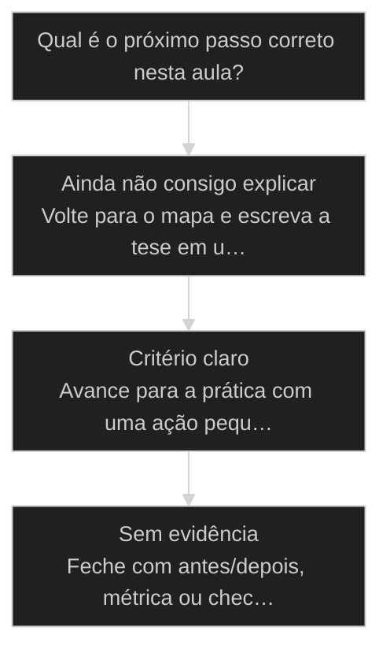
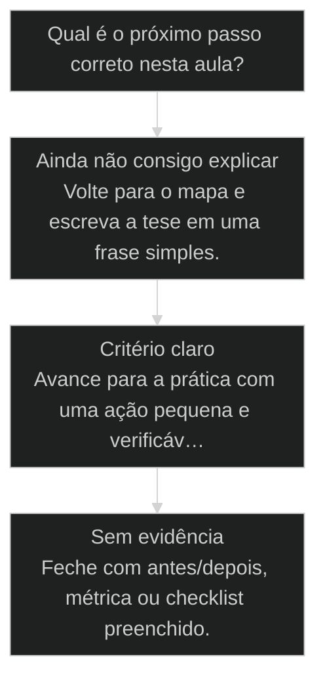

# [[Entidade]] como unidade de processo: nasce, vive, morre

> **Papel curricular:** extensão aplicada ao AIOX. Base técnica canônica: `cursos/Introducao-a-Arquitetura-de-Sistemas/aulas/04-estado-entidade-ciclo-de-vida.md`.

Escrita concorrente em entidade compartilhada: desenhe [[OCC]] (optimistic concurrency) ou trava explícita — multi-agent sem isso corrompe estado.

## Conceitos

- [[Squad]]

## Mapa desta aula

Decisão-chave da aula — Qual é o próximo passo correto nesta aula?



> Leia o diagrama antes do texto longo. Depois volte e confira.

> Por que o Dev começa pela tabela e o operador maduro começa pelo ciclo de vida da entidade.

**Objetivos de aprendizagem:**
- Explicar por que a entidade é uma unidade de processo, não uma tabela. _(understand)_
- Descrever o ciclo de vida de uma entidade: nasce, vive em estados, morre. _(understand)_
- Mapear uma entidade real pelo ciclo de vida, comparando com a abordagem por tabela. _(analyze)_

---

## O que você consegue no fim desta aula

*G · Destino*

Destino claro antes do conteúdo técnico.

Você descreve uma entidade do teu domínio com ciclo nasce→vive→morre e evidência
de cada transição. Resultado: ficha de 1 entidade com estados e donos.

- **Destino**: Entidade como unidade de processo: nasce, vive, morre
- **Como saber que chegou**: Exercício final da aula com evidência escrita.

---

## O ponto de partida real

*P · Onde você está*

Empatia com o sintoma — sem moralismo.

Processo sem entidade é slide. A unidade real é o que nasce, muda de estado e
morre (ou arquiva) com prova. Se o teu time discute 'fluxo' mas não nomeia o objeto,
esta aula é o chão que faltava.

> **Âncora**: Se o sintoma não for o seu, anote o do seu time — a aula ainda vale como mapa.

---

## Entidade como unidade de processo

*Conceito · M5 AIOX · Por Alan Nicolas*

O Dev abre o editor e começa pela tabela: que campos essa entidade tem. O operador maduro começa pelo ciclo: como ela nasce, que estados percorre, como morre. A tabela cai do ciclo, não o contrário.

- **nasce · vive · morre**: o ciclo de vida de qualquer entidade
- **ciclo > tabela**: o processo define os campos, não o contrário
- **1 entidade**: mapeada pelo ciclo no portão da aula

- **status**: aiox advanced · m5 aiox
- **meta**: principio=entidade-unidade-de-processo
- **meta**: fonte=aula-05 + aula-07 + t2-aula-2
- **ready**: lifecycle before table

**Legenda de cores**

O ciclo e o vício

- **Nasce** (signal): como a entidade entra
- **Vive** (insight): os estados que percorre
- **Morre** (bench): como se encerra ou sai
- **Processo** (action): definida pelo que acontece com ela
- **Começar pela tabela** (pain): campos antes do processo

---

## Entidade é processo, não tabela

Uma entidade existe porque algo acontece com ela ao longo do tempo. Ela nasce, muda de estado e morre. Os campos da tabela são consequência desse processo. Começar pela tabela é desenhar o esqueleto sem saber o que o corpo faz.

> **A regra que sustenta a aula**: Antes de listar os campos de uma entidade, mapeie o ciclo de vida dela. Como ela nasce, que estados percorre, o que dispara cada transição, como ela morre. Os campos caem do ciclo: se um campo não serve a nenhum estado nem transição, ele não pertence à entidade.

**Começar pela tabela**
- Lista os campos primeiro: id, nome, data, status.
- Descobre depois que faltam estados e transições.
- A entidade fica estática, sem saber o que acontece com ela.
- Refaz a tabela quando o processo aparece.

**Começar pelo ciclo**
- Mapeia como a entidade nasce, vive e morre.
- Deriva os campos do que cada estado precisa.
- A entidade carrega o processo, não só os dados.
- A tabela cai pronta do ciclo, sem retrabalho.

> **Adriano de Marqui (host T2, t2-aula-2)**: Isso aqui é o ouro do ouro do ouro. O Dev quer começar pela tabela. Para. Comece pelo ciclo de vida da entidade: como ela nasce, por quais estados passa, como morre. A tabela vem depois, e vem certa.

---

## O caminho da aula

Três movimentos: entender entidade como processo, ver o caso da tabela que teve que ser refeita, e mapear uma entidade sua pelo ciclo.

**Os 3 movimentos**

1. **Entidade é processo**: nasce, vive em estados, morre; a tabela cai do ciclo.
2. **A tabela refeita**: o caso de quem começou pelos campos e teve que voltar.
3. **Mapear pelo ciclo**: desenhar uma entidade sua começando pelo ciclo de vida.

- **Você vai sair sabendo** (Por que o ciclo de vida precede a tabela.; Os três momentos: nasce, vive, morre.; Como os campos caem do processo.)
- **Você vai sair fazendo**: O mapa de uma entidade sua pelo ciclo de vida, comparado com a abordagem por tabela.

---

## A tabela que voltou pro desenho

Uma entidade foi modelada direto na tabela. No meio do projeto apareceram estados que ninguém previu, e a tabela teve que ser refeita. Começar pelo ciclo teria pego isso no início.

- **Começando pelo ciclo: estados no desenho**: cedo
- **Começando pela tabela: estados no meio**: tarde
- **Começando pela tabela: estados em produção**: caro

### Caso: Os estados que a tabela não previu

Quando você começa pela tabela, os estados aparecem tarde, quando o sistema já depende dela. Começar pelo ciclo expõe os estados no desenho, quando mudar é de graça.

- Começou como: Entidade modelada direto na tabela: campos definidos, estados ignorados.
- Virou: Entidade mapeada pelo ciclo de vida, com os estados e transições explícitos antes da tabela.
- Prova: Os estados que quebraram a tabela já apareceriam no desenho do ciclo.
- Lição: Começar pela tabela esconde os estados. Começar pelo ciclo os expõe cedo.

---

## WHY / WHAT / HOW do ciclo de vida

As 3 camadas que transformam uma entidade-tabela numa entidade-processo.

- **1. WHY - O processo define a entidade**: Uma entidade existe pelo que acontece com ela ao longo do tempo. O ciclo de vida é essa história. Os campos são consequência: existem para servir aos estados e às transições. [WHY, processo primeiro]
- **2. WHAT - Nasce, vive, morre**: Nasce: como a entidade entra no sistema. Vive: os estados que percorre e as transições entre eles. Morre: como se encerra ou sai. Esse é o esqueleto de qualquer entidade. [WHAT, nasce/vive/morre]
- **3. HOW - Mapear o ciclo, derivar a tabela**: Desenhe o nascimento, os estados, as transições e a morte. Só então liste os campos, derivando cada um de um estado ou transição. Campo sem dono no ciclo não pertence à entidade. [HOW, derivar a tabela]

---

## O ciclo por dentro

Cada momento do ciclo responde uma pergunta. A grade que você usa ao mapear uma entidade.

- **Nasce**: Como a entidade entra: criada por quem, com que dado mínimo, disparada por qual evento.
- **Vive**: Os estados que percorre e o que dispara cada transição. É onde mora a lógica do processo.
- **Morre**: Como a entidade se encerra: concluída, arquivada, cancelada. O fim também é parte do ciclo.

**O ciclo de vida genérico de uma entidade**

1. **Nascimento**: evento que cria a entidade.
2. **Estado inicial**: o primeiro estado em que ela vive.
3. **Transições**: eventos que mudam o estado.
4. **Morte**: evento que encerra a entidade.

**Exemplos de entidade pelo ciclo**

Como nasce e morre cada entidade comum, para treinar o olhar de processo.

- **Pedido**: Nasce no checkout, vive em pago/separado/enviado, morre entregue ou cancelado.
- **Cliente**: Nasce no cadastro, vive em ativo/inativo, morre no encerramento da conta.
- **Tarefa**: Nasce no backlog, vive em fazendo/revisão, morre concluída ou descartada.
- **Story**: Nasce em draft, vive em ready/progress/review, morre em done.

---

## A sequência de mapeamento

Os passos concretos para mapear uma entidade pelo ciclo de vida antes de criar a tabela.

**Mapear uma entidade pelo ciclo de vida**
Use antes de criar a tabela ou o schema de qualquer entidade nova.
- `nascimento`
- `estados`
- `transicoes`
- `morte`
- `campos`
- `nascimento`: Quem cria a entidade, com que dado mínimo, disparado por quê?
- `estados`: Liste os estados em que ela pode viver, do primeiro ao último.
- `transicoes`: O que dispara a passagem de um estado para outro?
- `morte`: Como a entidade se encerra ou sai do sistema?
- `campos`: Só agora derive os campos, cada um servindo a um estado ou transição.

- **Estado, não campo status**: Um campo status parece capturar o ciclo.
- **Transição, não atualização qualquer**: Mudar um campo parece uma transição.
- **Morte, não exclusão**: Morrer parece deletar a linha.

---

## Caso benchmark: aplicar Entidade como unidade de processo: nasce, vive, morre em uma decisão real

Um segundo caso para tirar a aula do conceito isolado e mostrar como o operador transforma o princípio em decisão, execução e evidência.

- **O que mudou na operação**: A aula deixou de ser uma explicação e virou uma lente de decisão. O aluno sabe que sinal observar, qual rota escolher e que evidência precisa produzir. Players: sinal, rota, execução, evidência.
- **Por que isso eleva a qualidade**: O padrão espelha o [[Método S2S]]: capturar o sinal, estruturar o caminho, executar com limite e fechar com prova.

**Matriz de aplicação**

Use esta matriz quando a aula parecer clara, mas a ação ainda estiver vaga.

- **Sinal claro**: O aluno consegue nomear o que a aula ensina a observar.
- **Rota escolhida**: A próxima ação nasce de critério, não de vontade de testar ferramenta.
- **Risco visível**: O erro provável fica explícito antes de executar.
- **Prova mínima**: Existe uma evidência simples para dizer que avançou.

### Caso: Quando o conceito precisou virar critério de execução

O operador já tinha entendido a tese, mas ainda precisava decidir o próximo passo sem cair em improviso.

- Começou como: Conceito entendido em teoria, sem critério de aplicação na task real.
- Virou: Decisão roteada por sinais, riscos, evidências e próximo passo verificável.
- Prova: A saída passou a ter ação, dono, critério e evidência de fechamento.
- Lição: Aula de qualidade não termina em entendimento. Termina quando o aluno consegue agir com critério.

---

## Router de decisão da aula

O ponto em que Entidade como unidade de processo: nasce, vive, morre deixa de ser explicação e vira escolha operacional.

**Árvore de decisão**
_Não escolha comando antes de nomear o tipo de situação._



- **Ainda não consigo explicar** — O aluno repete a frase da aula, mas não consegue aplicar em exemplo próprio.
  → _Volte para o mapa e escreva a tese em uma frase simples._
- **Critério claro** — O aluno identifica sinal, risco e decisão antes da ferramenta.
  → _Avance para a prática com uma ação pequena e verificável._
- **Sem evidência** — A ação foi feita, mas não existe prova de melhoria ou decisão registrada.
  → _Feche com antes/depois, métrica ou checklist preenchido._

**Gate:** Você sabe qual rota seguir e como provar que avançou? — _Se a resposta ainda depende de opinião, volte uma etapa._

#### Entender o princípio
Quando a aula ainda parece uma tese abstrata.
1. **Nomear: escreva a tese em uma frase.
2. **Exemplo: traga um caso próprio pequeno.
3. **Risco: diga o erro que a aula evita.

#### Aplicar em uma task
Quando o critério está claro e falta execução.
1. **Escolher: defina a menor ação verificável.
2. **Executar: faça sem expandir escopo.
3. **Provar: registre o delta produzido.

#### Revisar a decisão
Quando a execução aconteceu, mas a evidência ficou fraca.
1. **Comparar: olhe antes e depois.
2. **Ajustar: corrija a menor falha.
3. **Fechar: só conclua com prova.

**Colunas:** Estado | Pergunta | Sinal saudável | Sinal de risco

- Entendimento: Consigo explicar sem copiar a aula? | frase própria e exemplo próprio | repetição bonita sem aplicação
- Decisão: Escolhi rota antes da ferramenta? | sinal e risco nomeados | comando escolhido por hábito
- Prova: Tenho evidência de avanço? | antes/depois ou checklist | sensação de que ficou melhor

---

## Processo operacional mínimo

A sequência mínima para aplicar Entidade como unidade de processo: nasce, vive, morre sem transformar a aula em teoria solta.

**Aula → Task → Evidência**
Rota curta para transformar o conceito em ação repetível.
- **Plan**: Nomeie o sinal da aula, o risco que ela evita e o artefato que será produzido.
- **Do**: Execute a menor ação que prova o conceito sem abrir novo escopo.
- **Check**: Compare a saída com o critério de aceite da aula.
- **Act**: Registre a regra aprendida e remova o que não será reutilizado.

**Aplicar com evidência**
Use quando a aula fizer sentido, mas a task ainda estiver sem formato.
- `sinal`
- `risco`
- `ação`
- `prova`
- `sinal`: O que esta aula me ensinou a perceber?
- `risco`: Que erro acontece se eu ignorar esse sinal?
- `ação`: Qual é a menor execução que testa o princípio?
- `prova`: Que evidência mostra que a decisão melhorou?

**Do conceito ao comportamento**

1. **Conceito**: entender a tese central da aula.
2. **Critério**: transformar a tese em pergunta de decisão.
3. **Ação**: executar a menor tarefa que prova avanço.
4. **Memória**: registrar o padrão para repetir depois.

---

## Distinções que evitam falsa competência

Três diferenças que protegem Entidade como unidade de processo: nasce, vive, morre de virar jargão ou checklist vazio.

**Parece que aprendeu**
- Repete a tese da aula sem exemplo próprio.
- Escolhe ferramenta antes de escolher critério.
- Fecha a task porque executou algo.

**Aprendeu de verdade**
- Explica o princípio em uma situação própria.
- Escolhe rota, risco e evidência antes do comando.
- Fecha a task quando existe prova de avanço.

- **entender com aplicar**: Entender é conseguir repetir a ideia.
- **ação com evidência**: Fazer algo gera movimento.
- **checklist com processo**: Checklist pode ser preenchido no automático.

**Exemplo preenchido: saída esperada do aluno**

- **Tese**: A aula me ensinou a observar um sinal específico antes de escolher ferramenta.
- **Risco**: Se eu pular esse critério, executo rápido e descubro tarde que a direção estava errada.
- **Ação**: Vou aplicar em uma task pequena, com escopo fechado e antes/depois visível.
- **Prova**: A entrega só fecha quando eu consigo mostrar o critério usado e o delta gerado.

---

## Prática: mapeie uma entidade pelo ciclo

Pegue uma entidade real do seu projeto e mapeie pelo ciclo de vida, comparando com a abordagem por tabela.

**Mapa da entidade pelo ciclo (uma por entidade)**
```yaml
# Mapeie o ciclo antes da tabela. Uma ficha por entidade.
entidade: "{nome da entidade}"
nasce:
  criada_por: "{quem ou que evento}"
  dado_minimo: "{o que ela precisa pra existir}"
vive:
  estados: ["{estado 1}", "{estado 2}", "{estado 3}"]
  transicoes:
    - {de: "{estado}", para: "{estado}", evento: "{o que dispara}"}
morre:
  como: "{concluida | arquivada | cancelada}"
campos_derivados: ["{campo -> serve a qual estado/transicao}"]

```

> **Portão da aula**: Antes de seguir para a próxima aula: você mapeou uma entidade sua pelo ciclo (nasce, vive, morre) e derivou os campos do processo, comparando com a tabela que faria direto. Se você ainda começaria pelos campos, releia o caso da tabela refeita.

- 1. **Escolha a entidade**: Pegue uma entidade real do seu projeto: pedido, cliente, tarefa, documento.
- 2. **Mapeie o nascimento**: Quem cria, com que dado mínimo, disparado por qual evento?
- 3. **Liste os estados**: Em quais estados a entidade vive, do primeiro ao último?
- 4. **Defina as transições e a morte**: O que dispara cada transição? Como a entidade se encerra?
- 5. **Derive os campos**: Liste os campos, cada um servindo a um estado ou transição. Compare com a tabela que você faria direto.

---

## Glossário

Os termos desta aula em uma frase cada.

- **Entidade**: Uma unidade de processo que nasce, vive em estados e morre. Definida pelo que acontece com ela, não só pelos campos.
- **Ciclo de vida**: A história da entidade: nascimento, estados, transições e morte. Precede a tabela.
- **Estado**: Um momento do processo com regras próprias. É o filme, não a fotografia do campo status.
- **Transição**: A passagem entre estados, disparada por um evento. Nem toda atualização é transição.
- **Derivar a tabela**: Listar os campos depois do ciclo, cada um servindo a um estado ou transição.

> **Próxima aula**: Você modela entidade pelo ciclo de vida. A seguir, a taxonomia que organiza tudo no AIOX: Task, Skill, Agent, Workflow e [[Runner]], e por que confundir dois níveis trava a operação.

***

---

## Operar isto na prática

Esta aula é pré-requisito no curso de squads — quando a missão for real, siga para: AIOX SOP: `cursos/AIOX-Advanced-Squads/aulas/07-aiox-sop.md` · ClickUp Ops: `cursos/AIOX-Advanced-Squads/aulas/12-clickup-ops-squad.md` · Sales: `cursos/AIOX-Advanced-Squads/aulas/20-sales.md` · Squad Creator: `cursos/AIOX-Advanced-Squads/aulas/23-squad-creator.md`

## Navegação

← [[aulas/23-o-que-e-um-squad|O que é um Squad (e por que ele vem antes do App)]] · ↑ [[modulos/Módulo 4 - Método e Brownfield|M4 — Método e brownfield]] · ⌂ [[cursos/AIOX Advanced/README|Curso]] · → [[aulas/31-brownfield-discovery|Brownfield Discovery: entrar num projeto que já existe]]
