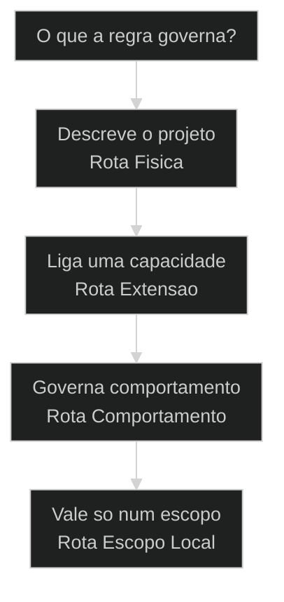
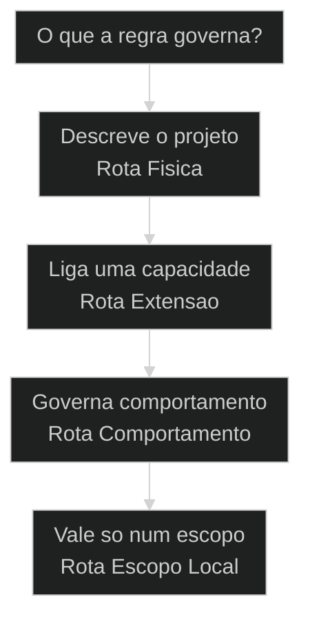
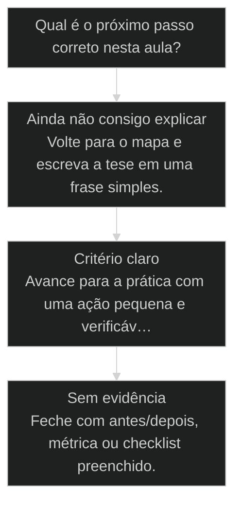

# core-config: as leis sociais do projeto

## Resultado

Ao final desta aula você consegue aplicar o núcleo de **core-config: as leis sociais do projeto** em uma decisão real do seu fluxo AIOX, com critério verificável.

## Conceitos

- [[CLAUDE md|CLAUDE.md]]

## Mapa desta aula

Decisão-chave da aula — O que a regra governa?



> Leia o diagrama antes do texto longo. Depois volte e confira.

> Se o [[CLAUDE md|CLAUDE.md]] e a lei da fisica, o core-config e a Constitution sao as leis sociais: quem pode fazer o que, qual rito o time segue e o que nunca e negociavel.

**Objetivos de aprendizagem:**
- Distinguir lei da fisica (CLAUDE.md) de lei social (core-config + Constitution). _(understand)_
- Identificar os 6 artigos nao-negociaveis da Constitution e o que cada um governa. _(understand)_
- Escolher onde uma regra deve viver: core-config, Constitution ou CLAUDE.md. _(apply)_
- Avaliar se uma regra virou lei viva (tem gate) ou ficou so como aspiracao escrita. _(evaluate)_

---

## core-config: as leis sociais do projeto

*Leis Sociais · core-config + Constitution · Por Alan Nicolas*

Se o CLAUDE.md e a lei da fisica, o core-config e a Constitution sao as leis sociais: definem quem pode fazer o que, qual rito o time segue e o que nunca e negociavel.

- **6**: artigos nao-negociaveis
- **2**: arquivos: core-config + Constitution
- **1**: valvula de escape: o waiver

- **status**: ruleset loaded
- **meta**: fisica=claude_md, social=core-config
- **meta**: constituicao=6 artigos
- **meta**: valvula=waiver registrado
- **meta**: fonte=t2-aula-2 + aula-01 + aula-02
- **ready**: ready to govern

**Legenda de cores**

Mapa semantico das leis sociais

- **core-config** (signal): extensoes e composicao ativadas no projeto
- **Constitution** (insight): 6 artigos nao-negociaveis do time
- **Violacao** (pain): regra ignorada gera bloqueio ou alerta
- **Gate** (bench): check que torna a regra viva
- **Waiver** (action): excecao registrada, nunca silenciosa

---

## Fisica vez, social outra

O CLAUDE.md ja te deu a fisica do projeto: quem o agente e e o que ele lembra. Agora falta a outra metade, a convivencia.

> **A separacao que organiza tudo**: CLAUDE.md responde quem e o projeto e como ele pensa. core-config e Constitution respondem quem pode fazer o que e qual rito o time segue. Uma e fisica, a outra e contrato social. Misturar os dois e o erro mais comum de quem comeca.

**Lei da fisica (CLAUDE.md)**
- Quem o agente e quando inicia a sessao.
- Que stack, convencoes e contexto persistem.
- Vale toda vez que o Cloud Code liga, sem excecao.
- Mexe na realidade do projeto.

**Lei social (core-config + Constitution)**
- Quem pode dar push, criar story, fechar release.
- Qual rito o time segue antes de mergear.
- O que e nao-negociavel mesmo sob pressao de prazo.
- Mexe na convivencia entre humano, agente e time.

**Da transcrição: onde o nome nasceu**

A metáfora das leis sociais não é figura de linguagem desta apostila. Ela nasceu ao vivo, na primeira aula da T1, quando Pedro abriu o core-config na tela e explicou a diferença para o CLAUDE.md:

> **Pedro Valerio Lopez (aula-01 L853)**: Se CLAUDE.md são as regras gerais, são as leis da física, dentro desse ambiente o core-config são as configurações desse projeto, dessa sociedade.

> **Pedro Valerio Lopez (aula-01 L855-857)**: No planeta Terra, as regras sociais do Japão e da China são completamente diferentes das do Brasil e dos Estados Unidos. Então o core-config são as regras sociais daquele projeto, que são muito mais variáveis do que as leis da física.

A pergunta seguinte dele fecha o raciocínio: nas regras sociais você pode ter variação; nas leis da física, não. É exatamente o critério de jurisdição que esta aula ensina. [SOURCE: aula-01 L853-L859]

> **Como decidir onde escrever**: Se a regra descreve o mundo do projeto, vai pro CLAUDE.md. Se a regra governa comportamento de quem opera, vai pra Constitution. Se a regra liga ou desliga uma extensao do framework, vai pro core-config. Tres arquivos, tres jurisdicoes.

---

## Comece pelo movimento

Primeiro o movimento geral das leis sociais. Os nomes tecnicos dos artigos so entram depois que a logica esta clara.

**Como ler esta aula**

1. **Separe fisica de social**: Saiba o que e CLAUDE.md e o que e core-config + Constitution antes de qualquer regra.
2. **Leia os 6 artigos**: Cada artigo governa um comportamento: CLI, autoridade, story, invencao, qualidade, imports.
3. **Veja o gate de cada um**: Regra sem gate e aspiracao. Cada artigo aponta o check que o mantem vivo.
4. **Use o waiver com honestidade**: Quando precisa quebrar uma regra, registra a excecao. Nunca em silencio.

- **Objetivos da aula** (Distinguir lei da fisica de lei social.; Identificar os 6 artigos e o que cada um governa.; Escolher onde uma regra deve viver.; Avaliar se a regra virou lei viva ou ficou so escrita.)
- **Onde voce esta?** (Comecando: foque Fisica vs Social e Os 6 Artigos.; Ja usa AIOX: foque Gates e Waiver.; Vai implementar: foque Onde Escrever e Pratica.)
- **Leitura pratica**: Leia cada bloco procurando uma resposta: que comportamento esse artigo governa, qual gate o mantem vivo e o que acontece se alguem ignorar amanha.

**Aprendizado do guia de leitura**

Uma lei social fica clara quando voce sabe quem ela governa, qual o gate e o que acontece na violacao.

- G **Jurisdicao antes do texto**: Diga quem a regra governa antes de citar o artigo.
- 1 **Gate visivel**: Toda regra precisa de um check que falhe quando alguem ignora.
- 2 **Excecao registrada**: Quando a regra cede, o waiver documenta o porque.
- 3 **Decisao concreta**: A aula fecha com o aluno sabendo onde escrever a proxima regra.

---

## As leis sociais sem jargao

Antes dos nomes tecnicos, lei social e isto: combinar quem pode o que, registrar o combinado e fazer o combinado se cumprir sozinho.

> **Em uma frase**: O time combina as regras de convivencia uma vez, escreve em core-config e Constitution, e cada regra ganha um gate para nao depender de memoria humana.

- **core-config liga as extensoes** -> Define quais capacidades do framework estao ativas neste projeto. E o painel de configuracao social.
- **Constitution fixa o nao-negociavel** -> Sao os 6 artigos que valem mesmo quando o prazo aperta. E o contrato que ninguem reescreve no calor da hora.
- **Gate transforma texto em lei** -> Sem um check que falhe, a regra e so um pedido educado. O gate e o que faz a regra ter dente.

**Diagrama principal: do combinado a lei viva**

1. **Combino a regra**: O time decide quem pode fazer o que e qual rito seguir.
2. **Escolho a jurisdicao**: core-config para extensao, Constitution para comportamento, CLAUDE.md para fisica.
3. **Escrevo o artigo**: A regra vira texto claro com severidade: MUST, SHOULD ou NON-NEGOTIABLE.
4. **Conecto o gate**: Um hook, lint ou check passa a falhar quando alguem ignora.
5. **Trato a violacao**: Se a regra precisa ceder, registro um waiver em vez de burlar calado.
6. **Reviso a lei**: Regra que nunca dispara ou que trava tudo entra em revisao.

**O que a lei social evita**
- Cada um operar com sua propria regra invisivel.
- Push e release dependerem de combinado verbal.
- Qualidade ser opcional quando o prazo aperta.
- Regra existir so no Notion e nunca no fluxo.

**O que ela forca**
- Uma fonte unica de quem pode o que.
- Autoridade explicita por papel.
- Qualidade como gate, nao como boa intencao.
- Regra viva, com check que falha na violacao.

---

## Onde essa regra deve morar?

O aluno usa este mapa para decidir o arquivo certo antes de escrever uma regra nova.

**Árvore de decisão**
_Identifique a jurisdicao antes de escrever._



- **Descreve o projeto** — Stack, identidade do agente, convencoes, contexto persistente.
  → _Rota Fisica_
  Ex.: Vai pro CLAUDE.md. E lei da fisica, vale toda sessao.
- **Liga uma capacidade** — Ativar ou desativar uma extensao ou composicao do framework.
  → _Rota Extensao_
  Ex.: Vai pro core-config. E configuracao social do projeto.
- **Governa comportamento** — Quem pode dar push, qual rito seguir, o que e nao-negociavel.
  → _Rota Comportamento_
  Ex.: Vai pra Constitution. E artigo de convivencia.
- **Vale so num escopo** — Regra util apenas numa pasta, [[Squad|squad]] ou tipo de arquivo.
  → _Rota Escopo Local_
  Ex.: Vai pra uma rule com paths, nao pra Constitution global.

**Gate:** Qual e o gate? — _Sem gate, a regra vira distracao. Responda: qual check falha quando alguem ignora e quem e o dono dele?_

> **Pausa para checagem**: Antes de escrever a regra, o aluno deve responder: que comportamento ela governa, em qual arquivo ela mora e qual gate a torna viva. Sem essas tres respostas, a regra ainda nao esta pronta.

---

## Os 3 arquivos de governo

Toda regra de um projeto AIOX cai em um destes tres lugares. Saber qual evita escrever a regra no arquivo errado.

- **CLAUDE.md, a fisica**: Diz quem o projeto e e o que o agente lembra ao iniciar. Vale toda sessao, sem excecao. Ja foi tema da aula sobre leis da fisica.
- **core-config, o painel**: Liga e desliga extensoes e composicoes do framework neste projeto. E onde o time configura quais capacidades sociais estao ativas.
- **Constitution, o contrato**: Fixa os 6 artigos nao-negociaveis. E o que o time combina que vale mesmo quando o prazo aperta e a tentacao de pular etapa cresce.

**Caso real: o painel aberto ao vivo**

Na T1, o core-config não foi explicado em slide: foi aberto na tela. Pedro mostrou que dentro das leis sociais existe a integração do CodeRabbit controlada por um simples enable true ou false, e que essa escolha se propaga sozinha: o template de story passa a exigir teste com CodeRabbit, a validação do QA ganha review automático e os quality gates de Dev, QA, GitHub e DevOps passam todos pelo mesmo revisor, declarados no próprio core-config. [SOURCE: aula-01 L861-L867, L923-L927]

> **Pedro Valerio Lopez (aula-01 L929)**: Tem vários testes no AIOX que já usam o CodeRabbit silenciosamente. Isso é o self-healing, o autocura. Então os códigos já estão saindo melhores sem vocês saberem.

É o retrato de uma lei social bem escrita: uma linha de configuração no painel liga um comportamento que o time inteiro herda sem precisar lembrar.

**Funcionou se:**

- O aluno aponta o arquivo certo para uma regra dada.
- O aluno explica por que a regra nao vai no CLAUDE.md.

---

## Os 6 artigos da Constitution

A Constitution do AIOX tem 6 artigos nao-negociaveis. Cada um governa um comportamento concreto e tem um gate que o mantem vivo.

**os 6 artigos em ordem**

1. **CLI First**: Toda funcionalidade funciona 100% via CLI antes de qualquer UI. Dashboard observa, nunca controla.
2. **Agent Authority**: Cada agente tem autoridade exclusiva. So o devops da push, cria PR e release. Ninguem assume autoridade alheia.
3. **Story-Driven**: Nenhum codigo nasce sem story. A story tem acceptance criteria e file list atualizada.
4. **No Invention**: Spec deriva de requisito, nunca inventa feature. Todo statement rastreia para FR, NFR, constraint ou research.
5. **Quality First**: Lint, typecheck, test e build passam antes de merge. Qualidade e gate, nao boa intencao.
6. **Absolute Imports**: Import absoluto com alias, nunca caminho relativo longo. Reduz acoplamento.

> **Por que so 6 sao nao-negociaveis**: Existem outros artigos no repo que cobrem temas avancados como scheduling e governanca de modelo. Mas os 6 primeiros sao o nucleo que vale para qualquer projeto AIOX desde o dia um. Comece por eles.

**O capô aberto na T2**

Na segunda turma, Adriano abriu o arquivo Constitution na tela ("eu quero mostrar o capô para vocês") e percorreu os artigos um a um, do CLI First ao Absolute Imports. A moldura que ele deu antes de ler qualquer artigo é a tese desta aula:

> **Adriano De Marqui (t2-aula-2 L2149-2153)**: Você tem que ter regras, leis. E o AIOX tem leis para te proteger e para te ajudar. Quais são essas leis? Os artigos da constituição, do Constitution.

> **Adriano De Marqui (t2-aula-2 L2233)**: As leis estão aqui, no arquivo Constitution. Dava para falar isso no Fundamentos? Nem pensar. Mas aqui, agora, você tem que saber que tem leis. Primeira lei, CLI First.

E o fechamento do bloco explica por que vale a pena conhecer os artigos em vez de reinventá-los:

> **Adriano De Marqui (t2-aula-2 L2449-2453)**: Quantos semestres a gente precisava para ensinar essas coisas? Vocês começam a ter noção do quanto isso já está embutido dentro desse framework. Vocês vão ter só que atentar aos princípios, conhecer as leis, conhecer todo esse ambiente para usar bem a IA.

---

## Caso real: o artigo que virou hook

O melhor exemplo de lei social viva nao e uma empresa de fora. E o proprio repo do AIOX, onde o artigo Agent Authority deixou de ser texto e virou um hook que bloqueia o push.

> **O que esse caso ensina**: Agent Authority e um dos dois artigos NON-NEGOTIABLE. Ele so e nao-negociavel de verdade porque tem um hook por tras. Sem o enforce-git-push-authority.sh, seria so uma frase bonita no documento. Com ele, a regra se cumpre sozinha.

### Caso: Agent Authority como hook de push

Quando um artigo da Constitution deixa de ser texto e vira um check que falha sozinho.

- Começou como: Regra escrita: so o devops da push.
- Virou: Hook que bloqueia push de qualquer outro agente.
- Prova: enforce-git-push-authority.sh registrado em .claude/settings.json.
- Lição: Artigo sem gate e aspiracao. Com hook, vira lei viva.

---

## CLI First e Agent Authority

Os dois primeiros artigos sao os mais rigidos. Os dois sao NON-NEGOTIABLE: onde a inteligencia vive e quem pode agir.

- **1. CLI First**: O CLI e a fonte da verdade. Toda funcionalidade funciona via linha de comando antes de existir tela. A hierarquia e CLI, depois observabilidade, depois UI. A tela so olha, nunca decide. [NON-NEGOTIABLE, CLI > obs > UI]
- **2. Agent Authority**: Cada agente tem autoridade exclusiva. So o devops executa push, abre PR e cria release. Story nasce com sm ou po. Decisao de arquitetura e do architect. Ninguem assume papel alheio. [NON-NEGOTIABLE, devops=push]

Na T2, o artigo primeiro foi ensinado com o pedido que todo iniciante faz:

> **Adriano De Marqui (t2-aula-2 L2237-2241)**: "Eu quero só fazer uma tela, me dê uma tela com botões." Não. Não dá para ser rastreável, não dá para entender quando mudou o botão. Tem que ser CLI First. Segundo: não é negociável o princípio de ter uma autoridade delimitada.

E a autoridade delimitada veio com dever de casa junto: desenhar no papel de pão, no caderno, no Figma ou no Miro o que cada um pode e não pode fazer, antes de escrever qualquer artigo. [SOURCE: t2-aula-2 L2245-2249]

> **O erro classico de autoridade**: O aluno empolgado pede pro agente fazer push direto. O agente nao pode. Ele delega pro devops. Isso nao e burocracia, e a separacao que impede um agente de comprometer o repo inteiro sem o rito de revisao.

---

## Story-Driven e No Invention

O terceiro e o quarto artigo sao MUST. Eles amarram o trabalho a um pedido real e impedem a IA de inventar o que nao foi pedido.

- **1. Story-Driven**: Todo desenvolvimento comeca e termina numa story. Sem story valida, nada e codado. A story carrega acceptance criteria e a file list fica atualizada conforme as tarefas fecham. [MUST, no story=no code]
- **2. No Invention**: A spec deriva, nunca inventa. Todo statement rastreia para um requisito funcional, nao-funcional, constraint ou research verificado. A IA nao adiciona feature que ninguem pediu. [MUST, rastreia ou corta]

- **story com tarefa solta**: Tarefa solta e um pedido sem criterio.
- **derivar com inventar**: Derivar parte de um requisito existente.

O No Invention ganhou na T2 o exemplo mais citado da aula: o export que veio com penetra.

> **Adriano De Marqui (t2-aula-2 L2269-2273)**: Qual outra lei? No Invention. Não pode inventar: toda story tem que ter requisito funcional, não funcional ou constraint, aquilo que não pode ser feito.

> **Adriano De Marqui (t2-aula-2 L2301-2325)**: Todo requisito tem que estar amarrado no PRD. Você pediu assim: "eu quero ter a opção de exportar os dados". E aí vem o repertório: o que a ferramenta vai poder fazer? Exportar CSV, exportar PDF... Mas isso foi pedido? No Invention. Não inventa. Eu pedi para exportar CSV. Acabou.

---

## Quality First e Absolute Imports

O quinto e o sexto artigo cuidam do que entra no merge. Um e MUST forte, o outro e SHOULD com excecao clara.

- **1. Quality First**: Lint, typecheck, test e build passam antes de mergear. [[CodeRabbit]] nao reporta issue critico. A story esta pronta ou em review. Qualidade vira gate de pre-push, nao boa vontade. [MUST, pre-push BLOCK]
- **2. Absolute Imports**: Import absoluto com alias reduz acoplamento e facilita refatorar. Caminho relativo longo é desencorajado. Dentro do mesmo módulo o relativo é tolerado. [SHOULD, alias > relativo]

**Absolute Imports na pratica**
```typescript
// Correto: import absoluto com alias
import { useStore } from "@/stores/feature/store";

// Evitar: caminho relativo longo
import { useStore } from "../../../stores/feature/store";

```
*A regra parece estetica, mas o ganho e real: quando voce move um arquivo, o import absoluto nao quebra.*

O Quality First ganhou na T2 a formulação que derruba a desculpa clássica do prazo:

> **Adriano De Marqui (t2-aula-2 L2329-2333)**: Não invente funcionalidade. Esse é o princípio do artigo quatro. Artigo cinco, Quality First: ou seja, primeiro qualidade. Não velocidade, não economia de token.

No AIOX, economizar token ou correr nunca justifica pular gate. E o Absolute Imports entrou no mesmo bloco já com a severidade certa na voz do professor: "mas isso aqui é só uma recomendação". [SOURCE: t2-aula-2 L2341]

---

## MUST, SHOULD, NON-NEGOTIABLE

Nem todo artigo tem o mesmo peso. A severidade diz o que acontece quando alguem desvia.

- **NON-NEGOTIABLE**: Nao cede nunca, nem sob prazo. CLI First e Agent Authority vivem aqui. Quebrar e comprometer o frame inteiro.
- **MUST**: Obrigatorio, mas com waiver registrado em casos raros. Story-Driven, No Invention e Quality First sao MUST.
- **SHOULD**: Forte recomendacao com excecao explicita. Absolute Imports e SHOULD: dentro do modulo o relativo passa.

A escala de severidade não é invenção desta apostila: ela está no próprio arquivo que Adriano leu na tela da T2.

> **Adriano De Marqui (t2-aula-2 L2341-2349)**: Níveis de severidade: você tem ali em cima o não negociável, que deve acontecer. Outros são sugeridos a acontecer, não bloqueiam. E esses aqui que têm MUST, para passar, precisa ter um waiver.

É a ponte exata entre esta seção e a válvula de escape: a severidade define quem pode ceder, e o waiver é o único caminho legal de ceder.

**Funcionou se:**

- O aluno classifica cada artigo na severidade certa.
- O aluno sabe quais artigos nunca cedem.

---

## O gate faz a lei ter dente

Um artigo escrito sem gate e so um pedido educado. O gate e o check que falha quando alguem ignora, sem depender de ninguem lembrar.

> **A pergunta que separa lei de aspiracao**: Para cada artigo, pergunte: se alguem ignorar isso amanha, o que acontece? Se a resposta for nada, alguem talvez perceba depois, ainda e aspiracao. Para virar lei, precisa de um hook, um lint, um teste ou um check que falhe sozinho.

**Colunas:** Artigo | Comportamento governado | Gate que o mantem vivo | Severidade

- CLI First: Funciona via CLI antes da UI? | Gate em develop-story avisa se UI vem antes do CLI. | Tela criada sem comando funcional por tras.
- Agent Authority: Quem deu o push? | Definicao de agente impede push fora do devops. | Agente assume papel alheio sem delegar.
- Story-Driven: Existe story valida? | Gate de develop-story bloqueia codigo sem story. | Codigo nasce de um pedido verbal solto.
- No Invention: Cada statement rastreia para requisito? | Gate de spec bloqueia invencao. | Spec ganha feature que ninguem pediu.
- Quality First: Lint, type, test e build passam? | Pre-push BLOCK se qualquer check falha. | Merge entra com check vermelho ignorado.
- Absolute Imports: Os imports usam alias? | Regra de lint sinaliza relativo longo. | Acoplamento cresce sem ninguem ver.

Os gates da tabela não são hipotéticos. Na T2, Adriano listou os que o framework carrega de fábrica e amarrou todos na mesma lei:

> **Adriano De Marqui (t2-aula-2 L2437-2445)**: Os gates no AIOX sempre vão respeitar esses tipos aqui: gate de criação de story, gate de validação do PO, gate de autoridade... Todos esses níveis de validação de qualidade. Por quê? Porque uma das leis é Quality First, ou seja, eu preciso ter validação de qualidade.

---

## O waiver: excecao honesta

Lei boa tem valvula de escape. O waiver e como o time quebra uma regra sem mentir: registra o porque, em vez de burlar em silencio.

**Evite**
- Pular um gate com flag de skip sem registrar nada. A regra continua escrita, mas ja foi traida.
- Mudar a Constitution as pressas so para o merge passar. O nao-negociavel vira negociavel.
- Usar o waiver toda semana ate ninguem mais lembrar qual era a regra original.
- Registrar a excecao mas sem quem responde por ela e sem prazo para revisar.

**Faça**

> **A regra do waiver**: Quebrar uma lei social as vezes e necessario. O que nunca pode e quebrar em silencio. Registra a excecao, diz o porque, aponta o dono e define quando revisar. Excecao documentada e disciplina. Excecao escondida e divida tecnica que volta pior.

### Caso real: o waiver nasceu de uma pergunta de aluna

O bloco do waiver não estava planejado como capítulo da aula. Ele ganhou corpo quando a aluna Janara mandou uma pergunta no chat, no meio do passeio pelos níveis de severidade, e Adriano parou a explicação para responder com um exemplo construído na hora. Primeiro ele tinha dado só a definição seca: "O que é um waiver? Eu preciso documentar. Se estava no No Invention e surgiu uma coisa que não deveria estar, só vai para frente se tiver uma documentação" [SOURCE: t2-aula-2 L2349-2365]. A pergunta dela chegou por escrito e não ficou no áudio, mas a resposta virou a melhor cena de waiver do curso:

> **Adriano De Marqui (t2-aula-2 L2385-2401)**: Veja só, Janara. Essa parte aqui do waiver é o seguinte: imagina que, na hora de olhar se isso tudo aqui foi respeitado, ele vai dizer o seguinte: olha, tem uma lei lá dizendo que não é para inventar uma funcionalidade. E você pediu para exportar CSV, só que veio junto exportar PDF. Vai travar na hora de passar no gate.

> **Adriano De Marqui (t2-aula-2 L2421)**: Você pode permitir passar, mas você tem que dar uma justificativa. Isso se chama waiver.

> **Adriano De Marqui (t2-aula-2 L2429-2433)**: Ele vai documentar isso. E num determinado momento, se precisar voltar, todo mundo vai saber o porquê que tem o PDF junto ali: porque foi documentado. Não tem uma coisa larga, solta lá, que não foi respeitada. Seria uma exceção? Isso aí mesmo, uma exceção: tá aqui, eu abro uma exceção, pode passar, mas tem que ter documentação.

Repare na sequência: a regra existia (No Invention), o gate travou (PDF que ninguém pediu) e o waiver foi a saída honesta: passa, mas com justificativa escrita que qualquer pessoa encontra depois. E há um limite que ele deixou claro na mesma resposta: se o item está como não negociável, "não adianta, vai ter que corrigir". [SOURCE: t2-aula-2 L2405] O waiver é privilégio exclusivo do MUST.

---

## Da cohort: a lei que carrega sozinha

*T1 aulas 01 e 02 · ao vivo*

Dois momentos da T1 mostram as leis sociais funcionando por baixo do capô, sem ninguém pedir.

No mergulho de engenharia da aula 02, Pedro abriu o carregador de domínios que monta o contexto de cada sessão, e o Constitution aparece com tratamento especial:

> **Pedro Valerio Lopez (aula-02 L5853-5855)**: Uma coisa é o Constitution, que é não negociável. Então vai ter coisas que são não negociáveis, relacionadas ao projeto e ao AIOX, e sempre vai entrar.

Ou seja: enquanto memória, comando e domínio entram no contexto sob demanda, a lei entra sempre. É a diferença técnica entre um documento que o time deveria ler e uma lei que o sistema carrega em toda sessão.

E na aula 01, ao abrir a task do QA gate, o waiver apareceu como campo do processo, não como teoria: item marcado como waived não morre nem passa escondido, é jogado "para um outro wave de desenvolvimento, não é agora", com rastro. [SOURCE: aula-01 L2327]

---

## Rotas de uma regra nova

Nem toda regra merece o mesmo tratamento. Primeiro descubra que tipo de regra voce esta criando.

#### core-config
Quando voce quer ligar ou desligar uma capacidade do framework.
1. **Sinal: uma extensao ou composicao precisa estar ativa neste projeto.
2. **Pergunta: isso configura o framework ou governa pessoas?
3. **Acao: declarar a extensao no core-config com nome claro.
4. **Resultado: capacidade ativada de forma rastreavel.

#### Constitution
Quando a regra vale para todo o projeto e governa quem faz o que.
1. **Sinal: um comportamento precisa ser nao-negociavel ou obrigatorio.
2. **Pergunta: vale para todo projeto ou so num escopo?
3. **Acao: escrever o artigo com severidade e gate.
4. **Resultado: artigo vivo com check que falha na violacao.

#### Rule com paths
Quando a regra so vale numa pasta, squad ou tipo de arquivo.
1. **Sinal: a regra util so dentro de um escopo especifico.
2. **Pergunta: vale global ou so quando toco esses paths?
3. **Acao: criar uma rule com paths que auto-carrega no escopo.
4. **Resultado: regra que aparece so onde importa, sem inflar a Constitution.

> **Erro de jurisdicao mais comum**: Jogar uma regra de pasta especifica dentro da Constitution global. A Constitution e para o nao-negociavel de todo projeto. Regra de escopo vive numa rule com paths. Inflar a Constitution com regra local dilui o que e realmente nao-negociavel.

---

## A Constitution evolui

Os 6 artigos sao o nucleo, mas a Constitution cresce. Novos artigos entram quando o projeto encontra um buraco que os 6 nao cobrem.

- **Nucleo estavel**: Os 6 primeiros artigos valem desde o dia um e raramente mudam. Sao a base de qualquer projeto AIOX.
- **Artigos por necessidade**: Temas avancados como scheduling e governanca de modelo entram como artigos novos quando o projeto cresce.
- **Cada artigo tem linhagem**: A Constitution registra de onde cada artigo veio e em que versao entrou. Nada aparece sem rastro.
- **Gate antes de promover**: Artigo novo so vale quando tem severidade e gate. Sem isso, fica como rascunho, nao como lei.

---

## Modelos para ler melhor

Visualizacoes simples para o aluno comparar jurisdicoes, severidades e o estado de saude de uma regra.

- **CLI First**: non-neg (fonte da verdade, nao cede.)
- **Agent Authority**: non-neg (autoridade exclusiva por papel.)
- **Quality First**: must (gate de pre-push bloqueia.)
- **Absolute Imports**: should (excecao dentro do modulo.)

- **Sem CLI First**: tela (UI vira requisito e trava operacao.)
- **Sem Authority**: push (agente compromete o repo sozinho.)
- **Sem Quality**: bug (merge entra com check vermelho.)

**Matriz de Jurisdicao do Aluno**

Quando estiver em duvida, escolha a celula que melhor descreve a regra.

- **Define a stack**: Vai pro CLAUDE.md. E fisica do projeto.
- **Liga extensao**: Vai pro core-config. E configuracao social.
- **Quem da push**: Vai pra Constitution, artigo Authority.
- **Funciona via CLI**: Vai pra Constitution, artigo CLI First.
- **Vale so numa pasta**: Vai pra uma rule com paths, nao pra global.
- **Precisa quebrar hoje**: Registra um waiver com dono e prazo.
- **Spec inventou feature**: Artigo No Invention bloqueia ate rastrear.
- **Import relativo longo**: Artigo Absolute Imports sinaliza no lint.
- **Regra sem gate**: Ainda e aspiracao. Conecte um check.

---

## Saude de uma lei social

Sem telemetria, lei social vira estetica de governanca. Estas metricas separam regra viva de artigo morto no papel.

- **Cobertura de gate**: Todo artigo tem check que falha. / Alguns artigos sem gate ativo. / Artigo so escrito, nenhum check.
- **Disciplina de waiver**: Excecao registrada com dono e prazo. / Waiver sem prazo de revisao. / Gate burlado em silencio.
- **Jurisdicao limpa**: Cada regra no arquivo certo. / Regra local na Constitution global. / Regra duplicada em tres arquivos.

- **O que torna a Constitution confiavel**: Cada artigo tem severidade explicita, um gate que falha na violacao e uma linhagem que diz de onde veio. Nada aparece sem rastro. O time pode confiar porque a regra se cumpre sozinha, nao por boa vontade.
- **Sinal de uma governanca morta**: Artigos lindos sem gate, waiver usado toda semana, regra de pasta enfiada na global. Quando isso acontece, a Constitution vira decoracao. O aluno aprende a auditar pela pergunta: o que falha se eu ignorar?

---

## Adocao honesta

Lei social nao e bala de prata. O rigor da Constitution ajuda quando o time precisa de convivencia previsivel, e pesa quando o projeto ainda e exploracao pura.

**Quando o rigor ajuda**
- Mais de uma pessoa ou agente operam o mesmo repo.
- Push e release precisam de autoridade clara.
- O projeto ja tem codigo que merece protecao.
- Voce quer convivencia previsivel sob prazo.

**Quando aliviar**
- Voce esta sozinho num prototipo de um dia.
- Nada ainda foi pra producao ou pro cliente.
- O escopo muda toda hora e travar atrasa.
- A exploracao vale mais que a governanca agora.

---

## Caso benchmark: aplicar core-config: as leis sociais do projeto em uma decisão real

Um segundo caso para tirar a aula do conceito isolado e mostrar como o operador transforma o princípio em decisão, execução e evidência.

- **O que mudou na operação**: A aula deixou de ser uma explicação e virou uma lente de decisão. O aluno sabe que sinal observar, qual rota escolher e que evidência precisa produzir. Players: sinal, rota, execução, evidência.
- **Por que isso eleva a qualidade**: O padrão espelha o [[Método S2S]]: capturar o sinal, estruturar o caminho, executar com limite e fechar com prova.

**Matriz de aplicação**

Use esta matriz quando a aula parecer clara, mas a ação ainda estiver vaga.

- **Sinal claro**: O aluno consegue nomear o que a aula ensina a observar.
- **Rota escolhida**: A próxima ação nasce de critério, não de vontade de testar ferramenta.
- **Risco visível**: O erro provável fica explícito antes de executar.
- **Prova mínima**: Existe uma evidência simples para dizer que avançou.

### Caso: Quando o conceito precisou virar critério de execução

O operador já tinha entendido a tese, mas ainda precisava decidir o próximo passo sem cair em improviso.

- Começou como: Conceito entendido em teoria, sem critério de aplicação na task real.
- Virou: Decisão roteada por sinais, riscos, evidências e próximo passo verificável.
- Prova: A saída passou a ter ação, dono, critério e evidência de fechamento.
- Lição: Aula de qualidade não termina em entendimento. Termina quando o aluno consegue agir com critério.

---

## Router de decisão da aula

O ponto em que core-config: as leis sociais do projeto deixa de ser explicação e vira escolha operacional.

**Árvore de decisão**
_Não escolha comando antes de nomear o tipo de situação._



- **Ainda não consigo explicar** — O aluno repete a frase da aula, mas não consegue aplicar em exemplo próprio.
  → _Volte para o mapa e escreva a tese em uma frase simples._
- **Critério claro** — O aluno identifica sinal, risco e decisão antes da ferramenta.
  → _Avance para a prática com uma ação pequena e verificável._
- **Sem evidência** — A ação foi feita, mas não existe prova de melhoria ou decisão registrada.
  → _Feche com antes/depois, métrica ou checklist preenchido._

**Gate:** Você sabe qual rota seguir e como provar que avançou? — _Se a resposta ainda depende de opinião, volte uma etapa._

#### Entender o princípio
Quando a aula ainda parece uma tese abstrata.
1. **Nomear: escreva a tese em uma frase.
2. **Exemplo: traga um caso próprio pequeno.
3. **Risco: diga o erro que a aula evita.

#### Aplicar em uma task
Quando o critério está claro e falta execução.
1. **Escolher: defina a menor ação verificável.
2. **Executar: faça sem expandir escopo.
3. **Provar: registre o delta produzido.

#### Revisar a decisão
Quando a execução aconteceu, mas a evidência ficou fraca.
1. **Comparar: olhe antes e depois.
2. **Ajustar: corrija a menor falha.
3. **Fechar: só conclua com prova.

**Colunas:** Estado | Pergunta | Sinal saudável | Sinal de risco

- Entendimento: Consigo explicar sem copiar a aula? | frase própria e exemplo próprio | repetição bonita sem aplicação
- Decisão: Escolhi rota antes da ferramenta? | sinal e risco nomeados | comando escolhido por hábito
- Prova: Tenho evidência de avanço? | antes/depois ou checklist | sensação de que ficou melhor

---

## Processo operacional mínimo

A sequência mínima para aplicar core-config: as leis sociais do projeto sem deixar a aula em teoria solta.

**Aula → Task → Evidência**
Rota curta para converter o conceito em ação repetível.
- **Plan**: Nomeie o sinal da aula, o risco que ela evita e o artefato que será produzido.
- **Do**: Execute a menor ação que prova o conceito sem abrir novo escopo.
- **Check**: Compare a saída com o critério de aceite da aula.
- **Act**: Registre a regra aprendida e remova o que não será reutilizado.

**Aplicar com evidência**
Use quando a aula fizer sentido, mas a task ainda estiver sem formato.
- `sinal`
- `risco`
- `ação`
- `prova`
- `sinal`: O que esta aula me ensinou a perceber?
- `risco`: Que erro acontece se eu ignorar esse sinal?
- `ação`: Qual é a menor execução que testa o princípio?
- `prova`: Que evidência mostra que a decisão melhorou?

**Do conceito ao comportamento**

1. **Conceito**: entender a tese central da aula.
2. **Critério**: converter a tese em pergunta de decisão.
3. **Ação**: executar a menor tarefa que prova avanço.
4. **Memória**: registrar o padrão para repetir depois.

---

## Exercicio final das leis sociais

Este fechamento leva as leis sociais para a pratica. Escolha uma regra real do seu projeto e percorra a decisao de jurisdicao ate o gate.

**Uma regra, cinco decisoes**
```yaml
lei_social:
  regra: "qual comportamento ou configuracao voce quer governar?"
  jurisdicao: "core-config | constitution | claude-md | rule-com-paths"
  severidade: "non-negotiable | must | should"
  gate: "qual check falha quando alguem ignora?"
  waiver: "como a excecao e registrada, com dono e prazo?"

```
*O objetivo nao e decorar os nomes dos artigos. E provar que o aluno sabe escolher a jurisdicao e conectar um gate que torne a regra viva.*

**Exemplo preenchido: so o devops da push**

- **Regra**: So o agente devops pode executar git push, abrir PR e criar release.
- **Jurisdicao**: Constitution. Governa comportamento de quem opera, vale para todo o projeto.
- **Severidade**: NON-NEGOTIABLE. E o artigo Agent Authority. Nao cede nem sob prazo.
- **Gate**: A definicao de agente impede push fora do devops. Outro agente delega em vez de assumir.
- **Waiver**: Se um push de emergencia precisar de outro papel, registra a excecao com quem autorizou e quando revisar.

- 1. **Regra**: Escreva em uma frase a regra de convivencia que voce quer no projeto.
- 2. **Jurisdicao**: Decida o arquivo: core-config, Constitution, CLAUDE.md ou uma rule com paths.
- 3. **Severidade**: Classifique como NON-NEGOTIABLE, MUST ou SHOULD e justifique.
- 4. **Gate**: Defina qual check falha quando alguem ignora a regra.
- 5. **Waiver**: Descreva como uma excecao seria registrada, com dono e prazo de revisao.

**Funcionou se:**

- O aluno escolhe a jurisdicao antes de escrever a regra.
- O aluno define a severidade certa com justificativa.
- O aluno conecta um gate concreto que falha na violacao.

---

## Portão da aula

*Gate*

O critério que prova que a lei social saiu do papel e virou governo vivo no seu projeto.

> **Portão da aula**: Você só passa quando consegue pegar uma regra real do seu projeto e dizer, sem consultar a aula, em qual arquivo ela mora (core-config, Constitution ou CLAUDE.md), qual gate falha quando alguém a ignora e como seria o waiver honesto, com dono e prazo.

---

## Glossario sem jargao

Traducao dos termos para alguem que esta vendo as leis sociais do projeto pela primeira vez.

- **Lei da fisica**: O que o CLAUDE.md governa: identidade, stack e contexto do projeto. Vale toda sessao.
- **Lei social**: O que core-config e Constitution governam: quem pode o que e qual rito o time segue.
- **core-config**: O painel que liga e desliga extensoes e composicoes do framework neste projeto.
- **Constitution**: O contrato com os 6 artigos nao-negociaveis que valem mesmo sob prazo.
- **Artigo**: Uma regra de comportamento na Constitution, com severidade e gate proprios.
- **NON-NEGOTIABLE**: Severidade que nunca cede. CLI First e Agent Authority vivem aqui.
- **Gate**: O check que falha quando alguem ignora a regra. E o que torna a lei viva.
- **Waiver**: A excecao registrada com dono e prazo. E como o time quebra uma regra sem mentir.
- **Jurisdicao**: O arquivo certo para uma regra: core-config, Constitution, CLAUDE.md ou rule com paths.

> **Portão da aula**: A aula so esta no padrao quando o aluno separa fisica de social, aponta o arquivo certo para uma regra e conecta um gate que faca a regra se cumprir sem depender de memoria.

***

---

## Navegação

← [[aulas/18-yaml-markdown-json-sweet-spot|YAML, Markdown, JSON: o sweet spot para LLM]] · ↑ [[modulos/Módulo 1 - Sistema e Contexto|M1 — Sistema e contexto]] · ⌂ [[cursos/AIOX Advanced/README|Curso]] · → [[aulas/27-otimizacao-claude-md|Otimização do CLAUDE.md: 40% mais magro, mesma capacidade]]
