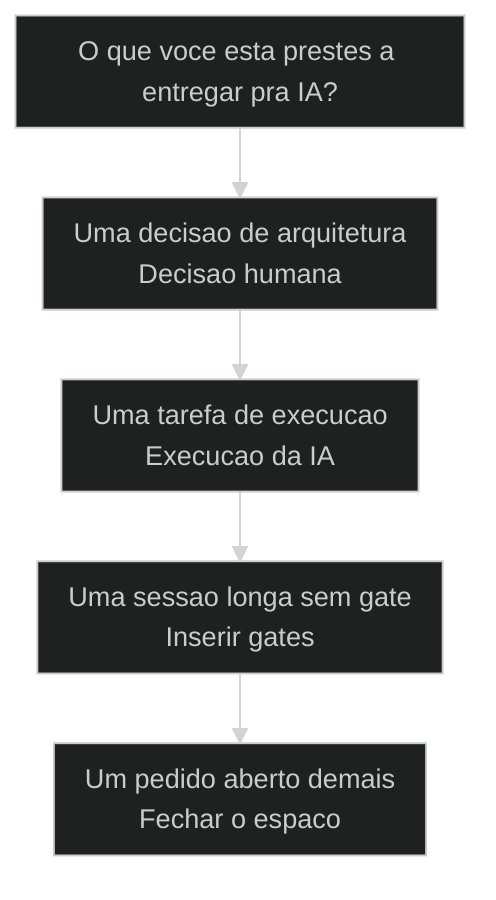
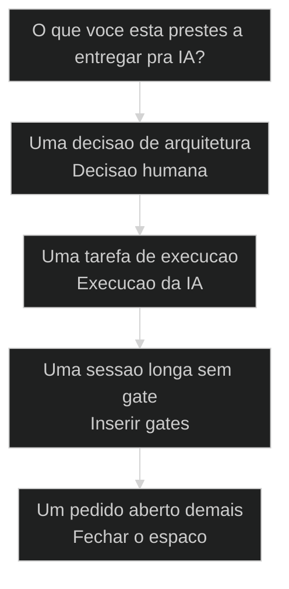
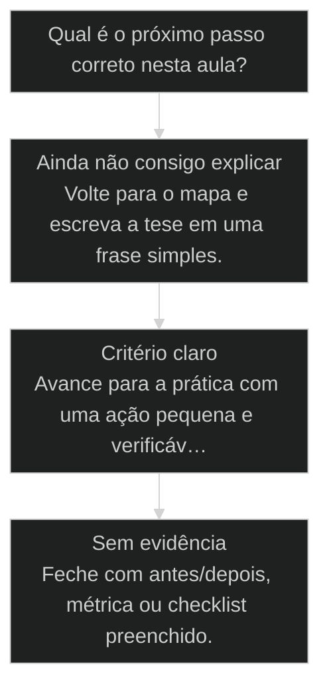

# Nao delegue o pensar: repertorio contra zumbi

## Conceitos

- [[Quatro Executores]]
- [[Repertório vs Técnica]]

## Mapa desta aula

Decisão-chave da aula — O que voce esta prestes a entregar pra IA?



> Leia o diagrama antes do texto longo. Depois volte e confira.

> A IA executa o comando. Voce decide o que entra. Quando voce entrega o pensar junto com a tarefa, voce nao ganha velocidade: voce emburrece e perde repertorio.

**Objetivos de aprendizagem:**
- Identificar quando uma decisao esta sendo delegada para a IA em vez de executada por ela. _(understand)_
- Explicar por que delegar o ato de pensar reduz repertorio em vez de aumentar velocidade. _(understand)_
- Aplicar a regra limite, defina, amarre para fechar o espaco onde a IA inventa. _(apply)_
- Avaliar se uma tarefa virou orquestracao consciente ou execucao zumbi no modo Yolo. _(evaluate)_

---

## Nao delegue o pensar

*M0 · Nao delegue o pensar · Por Alan Nicolas*

A IA executa o comando. Voce decide o que entra. Delegar o ato de pensar nao acelera nada: emburrece e queima o seu repertorio.

- **6h**: perdidas no caso Bob (Yolo)
- **3**: aulas convergem na mesma tese
- **23**: tabelas onde cabiam 3

- **status**: operator grid
- **meta**: operador=alan_nicolas, tese=anti_yolo
- **meta**: base=master_pr_15, master_pr_16
- **meta**: regra=voce_decide_IA_executa
- **ready**: voce decide, IA executa

**Legenda de cores**

Mapa semantico da aula

- **Decisao** (signal): o que so o humano define
- **Yolo** (pain): delegar o pensar, suicidio
- **Repertorio** (insight): vocabulario que evita ser refem
- **Amarra** (bench): limite, defina, gate
- **Orquestra** (action): voce conduz, nao assiste

---

## A IA e a seta, o X e seu

A frase fundadora do AIOX nao e enfeite. Ela define quem pensa e quem executa em toda interacao com a IA.

> **A frase que separa operador de passageiro**: A IA e a seta. O X e seu. A IA aponta direcao, gera codigo, propoe estrutura. O X, a decisao, o criterio, o repertorio, e seu e indelegavel. No momento em que voce entrega o X junto com a tarefa, voce para de ser operador e vira passageiro do proprio projeto.

**Delegar o pensar**
- "IA, decide a melhor arquitetura de dados pra mim."
- "Roda em Yolo e ve o que sai."
- "Aceita o que a IA propos, parece bom."
- Voce assiste o resultado aparecer sem julgar.

**Delegar a execucao**
- Voce define o modelo, a IA escreve o migration.
- Voce trava cada etapa com gate antes de avancar.
- Voce compara a proposta com o que voce ja sabe.
- Voce conduz, a IA carrega o peso.

> **O que isso nao significa**: Nao e fazer tudo na mao. E o oposto de virar zumbi: usar a IA para executar muito, rapido, em escala, enquanto voce mantem o controle do que importa. A IA faz o trabalho pesado. Voce nunca terceiriza o criterio.

---

## Como ler esta aula

Primeiro a tese, depois a prova negativa, depois a regra tecnica. Os termos so entram quando a logica ja esta clara.

**O caminho da aula**

1. **A armadilha**: Delegar o pensar parece produtividade. E o caminho mais curto pro emburrecimento.
2. **A prova**: O caso Bob mostra o custo real de rodar Yolo sem repertorio.
3. **A regra**: Voce decide, a IA executa. Nunca delegue o design de dados.
4. **A amarra**: Limite, defina, amarre: fechar o espaco onde a IA inventa.

- **Objetivos da aula** (Identificar quando voce esta delegando o pensar.; Explicar por que isso reduz repertorio.; Aplicar limite, defina, amarre.; Avaliar se virou orquestracao ou execucao zumbi.)
- **Onde voce esta?** (Comecando: foque Tese e Armadilha.; Ja usa AIOX: foque Caso Bob e Regra.; Vai automatizar: foque Amarra e Pratica.)
- **Leitura pratica**: Leia cada bloco procurando uma resposta concreta: qual decisao e sua, onde a IA tende a inventar, e qual amarra impede o estrago.

**O ritmo da aula**

A aula nao motiva, ela trava. Cada etapa fecha uma porta por onde o zumbi entraria.

- G **GPS antes do conteudo**: Voce sabe onde vai chegar antes de mergulhar.
- 1 **Prova negativa**: O custo aparece num caso real, nao numa frase de efeito.
- 2 **Regra acionavel**: Cada principio vira um comportamento verificavel.
- 3 **Pratica com gate**: Voce sai com um criterio de decisao, nao com um resumo.

---

## Delegar o pensar emburrece

A tentacao e entregar o raciocinio junto com a tarefa. Parece produtividade. E perda de repertorio com nome de eficiencia.

> **O que Alan diz literalmente**: Se voce delegar o ato de pensar para a IA, voce vai emburrecer. Ja tem pesquisas que mostram isso. Os comandinhos podem mudar, como pensar nao.

- **Nao e sobre digitar menos** -> Delegar a digitacao e otimo. Delegar a decisao de o que digitar e onde voce perde.
- **Repertorio so cresce com uso** -> Cada vez que voce pensa, seu vocabulario tecnico aumenta. Cada vez que a IA pensa por voce, ele atrofia.
- **O comando muda, o pensar permanece** -> As ferramentas e os comandos vao mudar todo mes. O criterio de decisao e o ativo que voce carrega entre elas.

**Evite**
- A IA gerou, voce aprovou sem entender o que foi gerado.
- Voce nao consegue justificar a propria decisao sem abrir o chat.
- Voce comemora ter sido rapido sem checar se ficou certo.
- Se a IA errou, voce nao tem repertorio pra perceber.

**Faça**

---

## Velocidade nao e metrica

Ser mais rapido que um humano virou o novo normal. Comemorar velocidade distrai do que importa: processo validado e output de qualidade.

> **Compare com o humano, nao com o agente**: Ser mais rapido que um agente nao prova nada, todo mundo tem o mesmo agente. O que se compara e com o humano de antes. E mesmo essa comparacao nao e a metrica: a metrica e se o output passou no gate, nao quantos minutos levou.

- **Velocidade bruta**: ruido (rapido e o novo normal, nao e vantagem.)
- **Output validado**: sinal (passou no gate, no re-bench, no review.)
- **Repertorio ganho**: ativo (voce entende e consegue repetir sem a IA.)

---

## A prova negativa do Yolo

Dois casos do proprio cohort AIOX. O caso Bob mostra o custo de rodar Yolo sem pensar. O caso do banco mostra a IA inventando complexidade quando o humano nao decide.

- **O padrao por tras dos dois casos**: Nos dois, o operador entregou uma decisao que era dele para a IA tomar. No caso Bob foi a decisao de seguir sem gate. No banco foi a decisao de arquitetura. A IA executou confiante em ambos, e o estrago so apareceu depois. Players: caso-bob-yolo, caso-banco-23-tabelas, aula-02, aula-07.
- **Por que o custo aparece tarde**: A IA nao sinaliza que esta errada. Ela acelera. Quando nao ha humano pensando no caminho, o erro composto: 6 horas no caso Bob, uma arquitetura inteira inflada no banco. O freio sempre foi a decisao humana que faltou no inicio.

**Colunas:** Caso | O que foi delegado | Sinal saudavel | Sinal de risco

- Caso Bob (Yolo): A criacao do [[Squad]] teve gate humano entre etapas? | Cada etapa validada antes de avancar. | Yolo rodando sem checkpoint, 6h perdidas.
- Banco de dados: Quem decidiu a arquitetura de dados? | Humano define modelo, IA escreve migration. | IA livre propondo 23 tabelas onde cabiam 3.

### Caso: Caso Bob: 6h perdidas no Yolo mode

Quando o operador delega o pensamento critico para a IA e a IA constroi confiante na direcao errada.

- Começou como: Criacao de Squad rodada em Yolo mode, sem gates.
- Virou: 6 horas de trabalho jogadas fora, Pedro precisou travar.
- Prova: Sessao inteira refeita do zero com decisao humana no comando.
- Lição: Yolo na criacao de Squad e suicidio. Nunca delegue o pensamento critico.

### Caso: Banco de dados: 23 tabelas onde cabiam 3

Quando voce nao decide a arquitetura, a IA over-complica e voce herda a divida.

- Começou como: Pedido aberto para a IA modelar o banco de dados.
- Virou: 23 tabelas propostas onde a estrutura certa cabia em 3.
- Prova: Modelo enxuto so apareceu quando o humano decidiu a arquitetura primeiro.
- Lição: Nenhuma IA cria tabela no banco sem autorizacao. Voce decide, a IA executa.

---

## Voce decide, a IA executa

A regra de ouro da aula 07. Separa o que e decisao humana indelegavel do que e execucao que a IA carrega bem.

- **1. Voce decide**: Arquitetura, modelo de dados, criterio de qualidade, o que e um bom output. Isso e repertorio humano e nao se terceiriza. [WHY, indelegavel, repertorio]
- **2. A IA executa**: Migration, codigo, boilerplate, varredura, refatoracao mecanica. Trabalho pesado em escala, dentro do contrato que voce definiu. [WHAT, escala, execucao]
- **3. Voce valida**: Gate, re-bench, review. A decisao foi sua, a execucao foi da IA, e a prova de que ficou certo volta para voce. [HOW, gate, prova]

> **A linha que nao se cruza**: Nenhuma IA cria tabela no banco sem a sua autorizacao. Isso vale como metafora pra tudo: nenhuma decisao de arquitetura, nenhum criterio de qualidade, nenhuma escolha estrategica entra no sistema sem passar pela sua cabeca primeiro.

---

## O que e seu, o que e da IA

Toda tarefa se divide em decisao e execucao. Saber onde fica a fronteira evita delegar o que nao se delega.

- **Decisao: sempre sua**: Arquitetura, escopo, criterio de pronto, qual problema vale resolver. A IA pode propor, mas a escolha final e indelegavel.
- **Execucao: da IA**: Escrever codigo, gerar migration, refatorar, varrer, repetir. Trabalho de volume que a IA faz rapido dentro do contrato.
- **Validacao: de volta pra voce**: Conferir se a execucao bate com a decisao. Gate, review, re-bench. O criterio de aprovacao tambem e repertorio humano.

**Funcionou se:**

- O aluno consegue apontar qual parte da tarefa e decisao e qual e execucao.
- O aluno sabe dizer o que nunca deveria ter delegado.

---

## Nao confie: limite, defina, amarre

O complemento tecnico da tese. Se a IA inventa quando tem espaco, o trabalho do operador e fechar o espaco antes de soltar a tarefa.

> **O principio da T2**: Nao confiem na IA. Voces tem que limitar. Deixem sempre mais fechado. Quanto mais aberto o pedido, mais espaco a IA tem pra alucinar, inflar e seguir confiante na direcao errada.

#### Limite
Reduza o espaco de manobra antes de soltar a tarefa.
1. **Sinal: o pedido esta aberto demais.
2. **Acao: restrinja escopo, formato e saida esperada.
3. **Resultado: menos espaco pra IA inventar.

#### Defina
Diga exatamente o que e sucesso antes de executar.
1. **Sinal: nao existe criterio de pronto.
2. **Acao: escreva o Definition of Done explicito.
3. **Resultado: a IA mira no alvo certo.

#### Amarre
Trave a regra no sistema, nao na sua memoria.
1. **Sinal: a regra so existe na sua cabeca.
2. **Acao: Constitution, gate, frontmatter ou hook.
3. **Resultado: a regra vive sem depender de voce lembrar.

---

## Onde a amarra mora no AIOX

Limite, defina, amarre nao e atitude, e mecanismo. No AIOX cada amarra tem um lugar concreto no sistema.

**Amarrar via Constitution e core-config**
Regras de comportamento que a IA nao pode violar viram lei do projeto.
- **Limite**: Constitution define o que a IA nunca faz, sem espaco de interpretacao.
- **Defina**: core-config declara extensoes, scopes e contratos esperados.
- **Amarre**: A lei vale em toda sessao, a IA le antes de agir.
- **Prova**: Hook bloqueia push se a regra for violada.

**Amarrar via Gate e Frontmatter**
Quando a regra precisa travar uma transicao especifica, ela vira gate ou frontmatter.
- **Limite**: Frontmatter restringe onde a regra ativa: paths, scope, tier.
- **Defina**: [[Quality Gate]] declara o criterio de aprovacao explicito.
- **Amarre**: A story nao fecha sem passar pelo gate.
- **Prova**: Validator falha quando a evidencia nao existe.

---

## Delego ou decido?

Use este mapa antes de soltar qualquer tarefa pra IA. Ele separa o que voce executa pela IA do que voce nunca deveria delegar.

**Árvore de decisão**
_Separe decisao de execucao antes de soltar._



- **Uma decisao de arquitetura** — Modelo de dados, escopo, criterio de qualidade ou estrategia.
  → _Decisao humana_
  Ex.: Nao delegue. Decida primeiro, depois deixe a IA executar dentro do desenho.
- **Uma tarefa de execucao** — Codigo, migration, refatoracao, varredura dentro de um contrato claro.
  → _Execucao da IA_
  Ex.: Delegue a execucao. Mantenha o gate no final.
- **Uma sessao longa sem gate** — Voce ia rodar Yolo e ver o que sai.
  → _Inserir gates_
  Ex.: Pare. Insira checkpoints. O caso Bob custou 6 horas por pular isso.
- **Um pedido aberto demais** — Escopo vago, sem criterio de pronto, sem limite.
  → _Fechar o espaco_
  Ex.: Limite, defina, amarre antes de executar.

**Gate:** Qual e o gate? — _Antes de soltar a tarefa, responda: a decisao e minha, a execucao e da IA, e qual amarra impede a IA de inventar?_

> **Pausa para checagem**: Se voce nao consegue dizer qual parte da tarefa e decisao sua, voce ainda nao pensou o suficiente pra delegar a execucao. Pensar primeiro nao e lentidao, e o que evita as 6 horas do caso Bob.

---

## Matriz operador contra zumbi

Visualizacao rapida pra reconhecer em qual modo voce esta operando agora.

**Operador contra zumbi**

Em duvida, escolha a celula que descreve seu comportamento atual.

- **Leio o que a IA gerou**: Operador. Voce julga antes de aprovar.
- **Aprovo sem ler**: Zumbi. A IA pensou, voce assinou embaixo.
- **Decido a arquitetura**: Operador. O nucleo do sistema e seu.
- **Aceito a arquitetura da IA**: Zumbi. Voce herdou 23 tabelas que nao escolheu.
- **Insiro gates na sessao**: Operador. A IA para onde voce mandou parar.
- **Rodo Yolo e torco**: Zumbi. Mesmo padrao do caso Bob.
- **Consigo explicar sem o chat**: Operador. O repertorio e seu, nao da IA.
- **So sei se abrir o historico**: Zumbi. O repertorio ficou na IA, nao em voce.
- **Limito antes de soltar**: Operador. Voce fecha o espaco da alucinacao.

- **delegar execucao com delegar decisao**: Delegar execucao e usar bem a IA.
- **velocidade com progresso**: Rapido virou o normal de todo mundo.
- **Yolo com produtividade**: Yolo parece eficiente porque nao para.

---

## O estado mental do operador

Os modos que ficam ligados antes de qualquer comando. Sem eles, a regra vira so checklist e o zumbi volta.

- **Suspeita Saudavel**: A IA pode estar confiante e errada ao mesmo tempo. Desconfie antes de aceitar.
- **Decisao Consciente**: Toda escolha de arquitetura passa pela sua cabeca antes de virar prompt.
- **Repertorio Ativo**: Voce pensa primeiro pra continuar aprendendo, nao pra ganhar 30 segundos.
- **Gate por Reflexo**: Sessao longa sem checkpoint dispara alarme automatico.
- **Orquestracao**: Voce conduz multiplos agentes sem largar o criterio de nenhum.

---

## Metricas de nao-delegacao

Sem telemetria, voce nao sabe se virou zumbi. Estas perguntas separam operador de passageiro.

- **Decisoes proprias**: decido arquitetura / decido com a IA / aceito a da IA
- **Gate em sessao longa**: checkpoint a cada etapa / checkpoint no fim / Yolo ate quebrar
- **Repertorio**: explico sem o chat / explico relendo / so sei se abrir

**Colunas:** Metrica | Pergunta | Sinal saudavel | Sinal de risco

- Decision ownership: Quem decidiu a arquitetura desta entrega? | Voce decidiu, a IA executou. | A IA decidiu, voce aprovou.
- Yolo discipline: Sessoes longas tem gate humano? | Checkpoint entre etapas. | Yolo correndo sem freio, estilo caso Bob.
- Repertorio retention: Voce consegue explicar a decisao sem reabrir o chat? | O criterio e seu, nao da IA. | O repertorio ficou na IA.

---

## Router de decisão da aula

O ponto em que Nao delegue o pensar: repertorio contra zumbi deixa de ser explicação e vira escolha operacional.

**Árvore de decisão**
_Não escolha comando antes de nomear o tipo de situação._



- **Ainda não consigo explicar** — O aluno repete a frase da aula, mas não consegue aplicar em exemplo próprio.
  → _Volte para o mapa e escreva a tese em uma frase simples._
- **Critério claro** — O aluno identifica sinal, risco e decisão antes da ferramenta.
  → _Avance para a prática com uma ação pequena e verificável._
- **Sem evidência** — A ação foi feita, mas não existe prova de melhoria ou decisão registrada.
  → _Feche com antes/depois, métrica ou checklist preenchido._

**Gate:** Você sabe qual rota seguir e como provar que avançou? — _Se a resposta ainda depende de opinião, volte uma etapa._

#### Entender o princípio
Quando a aula ainda parece uma tese abstrata.
1. **Nomear: escreva a tese em uma frase.
2. **Exemplo: traga um caso próprio pequeno.
3. **Risco: diga o erro que a aula evita.

#### Aplicar em uma task
Quando o critério está claro e falta execução.
1. **Escolher: defina a menor ação verificável.
2. **Executar: faça sem expandir escopo.
3. **Provar: registre o delta produzido.

#### Revisar a decisão
Quando a execução aconteceu, mas a evidência ficou fraca.
1. **Comparar: olhe antes e depois.
2. **Ajustar: corrija a menor falha.
3. **Fechar: só conclua com prova.

**Colunas:** Estado | Pergunta | Sinal saudável | Sinal de risco

- Entendimento: Consigo explicar sem copiar a aula? | frase própria e exemplo próprio | repetição bonita sem aplicação
- Decisão: Escolhi rota antes da ferramenta? | sinal e risco nomeados | comando escolhido por hábito
- Prova: Tenho evidência de avanço? | antes/depois ou checklist | sensação de que ficou melhor

---

## Processo operacional mínimo

A sequência mínima para aplicar Nao delegue o pensar: repertorio contra zumbi sem transformar a aula em teoria solta.

**Aula → Task → Evidência**
Rota curta para transformar o conceito em ação repetível.
- **Plan**: Nomeie o sinal da aula, o risco que ela evita e o artefato que será produzido.
- **Do**: Execute a menor ação que prova o conceito sem abrir novo escopo.
- **Check**: Compare a saída com o critério de aceite da aula.
- **Act**: Registre a regra aprendida e remova o que não será reutilizado.

**Aplicar com evidência**
Use quando a aula fizer sentido, mas a task ainda estiver sem formato.
- `sinal`
- `risco`
- `ação`
- `prova`
- `sinal`: O que esta aula me ensinou a perceber?
- `risco`: Que erro acontece se eu ignorar esse sinal?
- `ação`: Qual é a menor execução que testa o princípio?
- `prova`: Que evidência mostra que a decisão melhorou?

**Do conceito ao comportamento**

1. **Conceito**: entender a tese central da aula.
2. **Critério**: transformar a tese em pergunta de decisão.
3. **Ação**: executar a menor tarefa que prova avanço.
4. **Memória**: registrar o padrão para repetir depois.

---

## Exercicio: audite uma delegacao sua

Pegue uma tarefa real que voce passaria pra IA hoje e percorra o ciclo de nao-delegacao antes de soltar.

**Uma tarefa, cinco amarras**
```yaml
nao_delegar_pensar:
  tarefa: "qual tarefa voce ia soltar pra IA?"
  decisao_minha: "o que so eu decido (arquitetura, criterio, escopo)?"
  execucao_da_ia: "o que a IA executa dentro da minha decisao?"
  limite: "quao fechado esta o pedido? onde a IA poderia inventar?"
  amarra: "onde a regra vive: constitution | gate | frontmatter | hook"
  gate: "qual checkpoint evita o caso Bob de 6h?"
  prova: "como provo que ficou certo sem reabrir o chat?"

```
*O objetivo nao e nunca usar a IA. E usar a IA pra executar muito, mantendo o pensar com voce.*

**Exemplo preenchido: modelar um banco de dados**

- **Tarefa**: Criar o schema do banco de um produto novo.
- **Decisao minha**: A arquitetura. Defino 3 tabelas que resolvem o caso, antes de qualquer prompt. Nao deixo a IA escolher o modelo.
- **Execucao da IA**: Escrever o migration SQL das 3 tabelas que eu desenhei, com os tipos e indices que eu especifiquei.
- **Amarra**: Constitution do projeto: nenhuma IA cria tabela sem autorizacao explicita. Gate de review antes do migration rodar.
- **Prova**: Consigo desenhar o modelo no papel sem reabrir o chat. Se a IA tivesse decidido, viriam 23 tabelas que eu nao saberia justificar.

- 1. **Decisao**: Escreva qual parte da tarefa e decisao sua e nunca deveria ir pra IA.
- 2. **Execucao**: Escreva o que a IA vai executar dentro do que voce decidiu.
- 3. **Amarra**: Defina o limite, o criterio de pronto e onde voce vai amarrar a regra (Constitution, gate, frontmatter).
- 4. **Gate**: Defina o checkpoint que impede a tarefa de virar um caso Bob de 6 horas.
- 5. **Prova**: Diga como voce vai saber, sem reabrir o chat, que a execucao bateu com a sua decisao.

**Funcionou se:**

- O aluno separou decisao de execucao antes de soltar a tarefa.
- O aluno definiu onde amarrar a regra no sistema.
- O aluno definiu um gate que evita o padrao do caso Bob.

---

## Adocao honesta

Nao-delegar-o-pensar nao quer dizer fazer tudo na mao. Quer dizer escolher conscientemente o que delegar.

**Delegue sem medo**
- Escrever codigo dentro de um desenho que voce aprovou.
- Gerar migration de um modelo que voce definiu.
- Refatoracao mecanica e varredura em escala.
- Rascunho de texto que voce vai julgar e cortar.

**Nunca delegue**
- A arquitetura de dados e o modelo do sistema.
- O criterio do que e um bom output.
- A decisao de seguir sem gate numa sessao longa.
- O repertorio que so cresce quando voce pensa.

---

## Portão da aula

*Gate*

O critério que separa operador de zumbi antes da próxima delegação.

> **Portão da aula**: Você só passa quando consegue pegar uma tarefa real que ia soltar para a IA e apontar o que é decisão sua, o que é execução da IA, onde a amarra vive (Constitution, gate, frontmatter ou hook) e qual prova mostra que ficou certo sem reabrir o chat.

---

## Glossario sem jargao

Traducao dos termos pra quem esta vendo a tese pela primeira vez.

- **Delegar o pensar**: Entregar pra IA a decisao, nao so a execucao. O caminho mais curto pra perder repertorio.
- **Yolo mode**: Rodar a IA sem checkpoint humano entre etapas. No caso Bob custou 6 horas.
- **Repertorio**: Vocabulario e criterio tecnico que voce carrega. Cresce quando voce pensa, atrofia quando a IA pensa por voce.
- **Voce decide, a IA executa**: A regra de ouro: decisao e indelegavel, execucao se terceiriza.
- **Limite, defina, amarre**: Feche o espaco da IA antes de soltar a tarefa: restrinja, defina sucesso, trave no sistema.
- **Amarra**: Onde a regra vive no sistema: Constitution, gate, frontmatter ou hook. Nunca so na sua memoria.
- **Zumbi**: Operador que assina embaixo do que a IA decidiu sem julgar. O oposto do orquestrador.
- **Orquestrar**: Conduzir multiplos agentes mantendo o criterio de cada decisao com voce.

> **Portão da aula**: A aula so esta no padrao quando o aluno separa decisao de execucao em qualquer tarefa, reconhece o padrao do caso Bob antes de rodar Yolo, e sabe onde amarrar a regra no sistema em vez de confiar na propria memoria. A IA e a seta. O X e seu.

***

---

## Operar isto na prática

Esta aula é pré-requisito no curso de squads — quando a missão for real, siga para: Advisory Board: `cursos/AIOX-Advanced-Squads/aulas/01-advisory-board.md`

## Navegação

← [[aulas/13-pensamento-estruturado-antes-do-terminal|Desenhe fora da ferramenta antes de codar]] · ↑ [[modulos/Módulo 0 - Mindset e Princípios|M0 — Mindset e princípios]] · ⌂ [[cursos/AIOX Advanced/README|Curso]] · → [[aulas/03-claude-md-leis-da-fisica|CLAUDE.md é a lei da física do seu projeto]]
