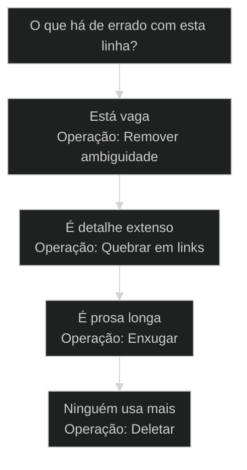
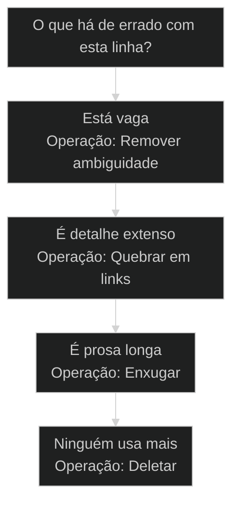
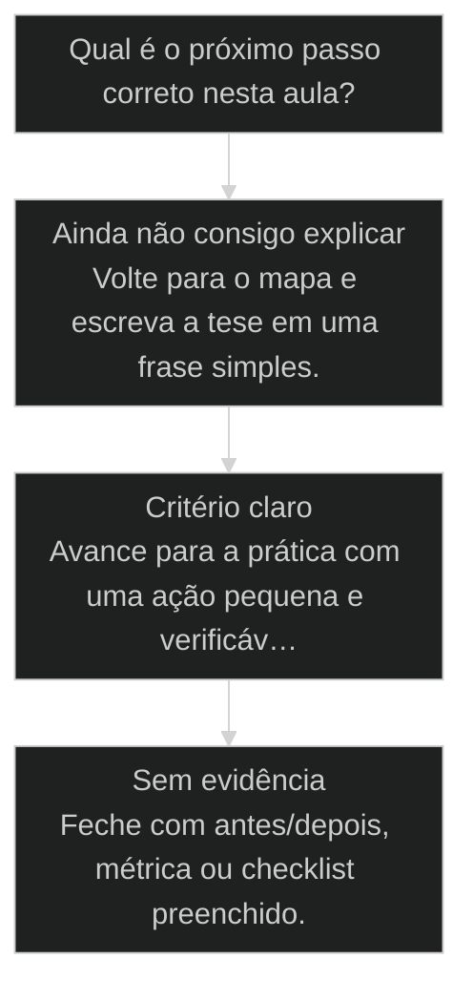

# Otimização do CLAUDE.md: 40% mais magro, mesma capacidade

## Conceitos

- [[CLAUDE md|CLAUDE.md]]
- [[Janela de Contexto]]

## Mapa desta aula

Decisão-chave da aula — O que há de errado com esta linha?



> Leia o diagrama antes do texto longo. Depois volte e confira.

> O [[CLAUDE md|CLAUDE.md]] cresce até virar ruído. Otimizar não é apagar regra: é remover ambiguidade, quebrar em links e deixar só o que o agente lê toda sessão.

**Objetivos de aprendizagem:**
- Identificar os três tipos de inchaço que engordam um CLAUDE.md sem agregar capacidade. _(understand)_
- Explicar por que o CLAUDE.md tem custo de contexto em toda sessão. _(understand)_
- Aplicar as três operações de otimização: remover ambiguidade, quebrar em links e enxugar. _(apply)_
- Avaliar se um corte preservou a capacidade ou matou uma regra viva. _(evaluate)_

---

## Otimização do CLAUDE.md: 40% mais magro, mesma capacidade

*Otimização do CLAUDE.md · Magro sem perder capacidade · Por Alan Nicolas*

O CLAUDE.md cresce a cada regra nova até virar ruído que o agente paga toda sessão. Otimizar é tirar o peso morto sem matar nenhuma regra viva.

- **-40%**: redução de tamanho
- **100%**: capacidade preservada
- **3**: operações: remover, quebrar, enxugar

- **status**: context budget
- **meta**: arquivo=claude.md, custo=toda-sessao
- **meta**: alvo=-40%, capacidade=preservada
- **meta**: operacoes=remover/quebrar/enxugar
- **meta**: fonte=t2-aula-1 (MASTER-PC-13) + aula-01 T1
- **ready**: ready to trim

**Legenda de cores**

Mapa semantico da otimizacao

- **Inchaco** (pain): regra duplicada, prosa longa, exemplo morto
- **Diagnostico** (bench): o que o agente le toda sessao
- **Operacao** (action): remover, quebrar em link, enxugar
- **Regra viva** (insight): ainda ativa comportamento depois do corte

---

## O CLAUDE.md tem custo fixo

Diferente de um doc qualquer, o CLAUDE.md entra no contexto toda vez que o agente acorda. Cada linha inchada é imposto pago em todas as sessões.

Na T2, Adriano abriu este assunto antes de qualquer squad, porque o arquivo central precisa estar sob controle primeiro:

> **Adriano de Marqui (host T2, t2-aula-1 L3045)**: O CLAUDE.md é a lei gravitacional do projeto. Ou seja, é como se fossem as leis da física. Tudo atrai tudo, vai ser atraído por ele.

> **Adriano de Marqui (host T2, t2-aula-1 L2945)**: CLAUDE.md tem peso real no seu contexto.

O diagnóstico veio na sequência, sem anestesia: esse arquivo é o principal do projeto, "só que tem muita gente também fazendo esse arquivo de forma errada, tem muita gente alimentando esse arquivo com um monte de coisa. Se ele estiver muito grande, ele vai estar lendo muito contexto. Esse CLAUDE.md deve estar otimizado" [SOURCE: t2-aula-1 L3049-3061]. É o arquivo que o projeto obedece e que entra em cada sessão [SOURCE: t2-aula-1 L3789-3793].

> **A regra do imposto fixo**: O CLAUDE.md não é lido sob demanda. Ele é injetado no início de toda sessão. Uma regra duplicada não custa uma vez: custa em cada interação, para sempre, até alguém remover. Por isso enxugar o CLAUDE.md tem retorno composto que um doc comum não tem.

**O que engorda sem agregar**
- Regra repetida em dois lugares do mesmo arquivo.
- Parágrafo longo explicando algo que cabe em uma linha.
- Exemplo de código que ninguém mais usa.
- Tabela detalhada que pertence a um doc dedicado.

O inchaço tem um irmão menos óbvio: a desatualização. Na T1, Pedro Valério nomeou o padrão que ele via na cohort:

> **Pedro Valério (co-founder, aula-01 L661-671)**: Normalmente as pessoas não evoluem o CLAUDE.md depois que fazem o primeiro PRD. As leis da física do seu ambiente vão ficar te puxando para trás, porque há regras que serviam para um projeto white label, que é quando o AIOX acaba de ser instalado, e naquela primeira fase de desenvolvimento. Agora é muito mais poderoso.

Ou seja: o arquivo não engorda só pelo que entra. Ele engorda também pelo que ficou parado enquanto o projeto mudou. Regra que servia à fase inicial e ninguém revisitou é peso morto disfarçado de lei.

**O que merece ficar**
- Regra única que ativa comportamento em toda sessão.
- Convenção curta que evita erro recorrente.
- Ponteiro para o doc onde mora o detalhe.
- Gate que bloqueia algo errado de verdade.

> **O teste antes de cortar**: Antes de remover qualquer linha, pergunte: se eu apagar isso, o agente passa a agir errado amanhã? Se sim, é regra viva e fica. Se não, é peso morto e sai. Otimizar é cortar o segundo grupo sem tocar no primeiro.

**linha de otimização do CLAUDE.md**

1. **Inventário**: Liste cada bloco do arquivo e o que ele protege.
2. **Diagnóstico**: Classifique: ambíguo, detalhe, prosa ou morto.
3. **Operação**: Remover ambiguidade, quebrar em link ou enxugar.
4. **Gate**: Confirme que nenhuma regra viva morreu no corte.

- **Objetivos da aula** (Identificar os 3 inchaços do CLAUDE.md.; Explicar por que o arquivo custa em toda sessão.; Aplicar as 3 operações de otimização.; Avaliar se o corte preservou a capacidade.)
- **Onde você está?** (Começando: foque Mapa e Decisão.; Já tem CLAUDE.md: foque Casos e Operações.; Vai otimizar agora: foque Ferramental e Prática.)

---

## Os 3 inchaços do CLAUDE.md

Quase todo CLAUDE.md inchado sofre de três coisas. Saber qual delas você tem define qual operação aplicar.

- **Ambiguidade**: A regra existe mas é vaga. O agente interpreta de dois jeitos e você descobre o problema só quando ele erra. Ambiguidade não ocupa espaço gratuito: ela gera retrabalho.
- **Detalhe que pertence a outro lugar**: Tabelas, listas longas e procedimentos completos vivem melhor num doc dedicado. No CLAUDE.md eles viram peso que o agente carrega toda sessão sem precisar.
- **Prosa que cabe em menos**: O mesmo conteúdo dito em três parágrafos cabe em três linhas. Enxugar não remove capacidade: remove palavras que o agente não precisava ler.

O segundo inchaço é o que Adriano atacou ao vivo na T2, com a imagem mais direta da aula:

> **Adriano de Marqui (host T2, t2-aula-1 L3089-3093)**: Se você tem um puta de um textão explicando como é que a coisa deve acontecer, e está deixando o CLAUDE.md gordo, você vai quebrar ele e colocar só o link aqui dentro. Porque quando ele lê todo o arquivo CLAUDE.md, ele vai saber: puxa, se for alguma coisa referente à imagem, eu vou procurar nesse arquivo. Se não é, não vou ler.

É exatamente o mecanismo do ponteiro: o detalhe continua acessível, mas só é lido quando a tarefa pede. Para ele, ter links de arquivos dentro do CLAUDE.md "é só o ouro do ouro" [SOURCE: t2-aula-1 L3073].

**Funcionou se:**

- O aluno consegue apontar qual dos 3 inchaços domina o seu CLAUDE.md.
- O aluno sabe dizer qual operação resolve cada inchaço.

---

## Qual operação aplicar

Antes de editar, classifique a linha. O diagnóstico decide a operação.

**Árvore de decisão**
_Diagnostique antes de cortar._



- **Está vaga** — A regra permite duas interpretações e o agente já errou por causa dela.
  → _Operação: Remover ambiguidade_
  Ex.: Remover ambiguidade: reescreva em SE/ENTÃO/NUNCA imperativo, sem espaço para interpretação.
- **É detalhe extenso** — É tabela, lista longa ou procedimento que pertence a um doc dedicado.
  → _Operação: Quebrar em links_
  Ex.: Quebrar em link: mova o detalhe para um doc e deixe um ponteiro de uma linha.
- **É prosa longa** — O conteúdo está certo mas dito com palavras demais.
  → _Operação: Enxugar_
  Ex.: Enxugar: comprima para a versão imperativa mais curta que preserva a regra.
- **Ninguém usa mais** — Aponta para algo removido, um exemplo morto ou uma convenção abandonada.
  → _Operação: Deletar_
  Ex.: Deletar: peso morto sai inteiro. Confirme que não ativa nenhum comportamento.

**Gate:** Qual é o gate antes de salvar? — _Sem gate, otimizar vira mutilar. Responda: depois do corte, o agente ainda age certo nos casos que essa linha cobria?_

> **Pausa para checagem**: Antes de salvar o CLAUDE.md enxugado, o aluno deve conseguir responder: o que essa linha protegia, e essa proteção continua existindo depois do corte?

---

## Casos reais de otimização

Dois casos verificáveis mostram a otimização rodando: o CLAUDE.md deste repositório e a consolidação de regras que ele referencia. E uma demo de campo da T2 mostra de onde veio a meta de -40%.

- **O que foi verificado nos dois casos**: Ambos os casos são fatos do próprio repositório, não exemplos inventados. O CLAUDE.md remete a .claude/rules/_INDEX.md e a auditoria de consolidação está registrada em docs/architecture. Cada conclusão nasce de arquivo real. Players: CLAUDE.md, .claude/rules/_INDEX.md, docs/architecture/rules-consolidation-audit-2026-05-07.md.
- **O padrão comum**: Nos dois casos a redução não veio de deletar capacidade: veio de mover detalhe para o lugar certo e fundir sobreposição. O gate foi sempre o mesmo: alguma regra viva morre nesse corte?

**Operação por tipo de inchaço nos casos**

Cada caso aplica a operação que o diagnóstico pediu.

- **Detalhe path-específico**: Quebrar em link: regra migra para .claude/rules/ com auto-load.
- **Sobreposição de regras**: Enxugar e consolidar: fundir em hub por domínio.
- **Índice no CLAUDE.md**: Ponteiro único para _INDEX.md em vez de copiar tudo.
- **Auditoria de corte**: Gate de zero perda registrado antes de declarar pronto.

- **Redução**: -40% no CLAUDE.md / 53 → 29 rules / 0 capacidade perdida
- **Rastreabilidade**: auditoria registrada / ponteiro em _INDEX.md / 0 corte sem gate

### Caso: O CLAUDE.md deste repositório

Quando o arquivo de instruções vira ponteiro em vez de enciclopédia.

- Começou como: Tendência a inflar: cada regra nova queria texto completo no CLAUDE.md.
- Virou: Arquivo que delega detalhe para docs e rules dedicados.
- Prova: Seções remetem a .claude/rules/, docs/architecture/ e _INDEX.md em vez de duplicar.
- Lição: O CLAUDE.md fica magro quando aponta, não quando copia.

### Caso: Consolidação 53 → 29 rules

Quando enxugar regras reduz o número sem perder nenhuma capacidade.

- Começou como: 53 arquivos de regra com sobreposição e fronteiras difusas.
- Virou: 29 arquivos consolidados em hubs por domínio.
- Prova: Auditoria registrada documenta zero perda de inteligência no corte.
- Lição: Menos arquivos, mesma capacidade, quando a consolidação respeita a regra viva.

### Caso: A demo da T2 que fixou a meta de -40%

Na primeira aula da T2, Adriano rodou ao vivo a verificação de ambiguidades sobre CLAUDE.md reais e reportou o padrão que virou a meta desta aula:

> **Adriano de Marqui (host T2, t2-aula-1 L3097-3105)**: Verifique se o seu CLAUDE.md não tem ambiguidades. Por quê? Porque pode ter muita coisa repetida. De cada dez que executam o comando perguntando "dentro do meu CLAUDE.md tem ambiguidades?", nove já encontram ali cerca de, sei lá, quarenta [por cento] do arquivo excluído. Otimizado, porque tem ambiguidade pra caramba.

O "por cento" está entre colchetes porque o áudio engole a palavra, mas o contexto é inequívoco: cerca de quarenta por cento do arquivo sai na primeira passada. E ele mesmo delimitou quem sente o corte: quem está começando projeto agora não encontra quase nada ("Claro, gente. Aqui não vai ter. Comecei meu projeto agora"), mas quem já tem projeto sendo executado "vai encontrar um monte de coisa" [SOURCE: t2-aula-1 L3113-3121].

- Começou como: CLAUDE.md de aluno com repetição e ambiguidade acumuladas em projeto rodando.
- Virou: arquivo com cerca de 40% a menos após a passada de verificação de ambiguidades.
- Prova: padrão reportado ao vivo na demo: nove de cada dez execuções encontram corte dessa ordem.
- Lição: a meta de -40% não é chute de slide. É a taxa típica de ambiguidade e repetição num arquivo que nunca foi otimizado.

---

## As 3 operações de otimização

Cada inchaço tem uma operação. Aqui está como executar cada uma sem perder capacidade.

#### Remover ambiguidade
Quando a regra é vaga e o agente interpreta errado.
1. **Sinal: a mesma regra gerou dois comportamentos diferentes.
2. **Pergunta: qual interpretação é a certa?
3. **Ação: reescrever em SE/ENTÃO/NUNCA imperativo.
4. **Resultado: uma única leitura possível.

#### Quebrar em links
Quando o detalhe pertence a um doc dedicado.
1. **Sinal: tabela ou procedimento longo dentro do CLAUDE.md.
2. **Pergunta: o agente precisa disso toda sessão?
3. **Ação: mover para doc e deixar ponteiro de uma linha.
4. **Resultado: detalhe disponível sem custo fixo.

#### Enxugar
Quando o conteúdo está certo mas dito com palavras demais.
1. **Sinal: três parágrafos para dizer uma regra.
2. **Pergunta: qual é a versão imperativa mais curta?
3. **Ação: comprimir preservando a regra viva.
4. **Resultado: menos tokens, mesma capacidade.

- **Ambiguidade não é falta de espaço** -> Reescrever vago em imperativo às vezes adiciona palavras. Vale a pena: tira o retrabalho que a vaguidade causava.
- **Quebrar em link não é esconder** -> O detalhe continua acessível. Só sai do caminho crítico que o agente lê toda vez.
- **Enxugar não é resumir errado** -> Se a versão curta perde um caso que a longa cobria, o corte foi longe demais. Volte.

- **otimizar com apagar**: Otimizar remove peso morto.
- **magro com incompleto**: Magro é índice que aponta para o detalhe.
- **curto com vago**: Curto é imperativo e único.

---

## Sequência de execução AIOX

Para otimizar um CLAUDE.md de verdade, siga a sequência. Diagnóstico antes de edição, gate antes de salvar.

**Sequência: CLAUDE.md inchado → magro**
Use quando o CLAUDE.md cresceu a ponto de ter regra duplicada, detalhe extenso ou prosa longa.
- `$AIOX:doc-rot`: detectar o que está podre, redundante ou enganoso.
- `diagnóstico por linha`: classificar cada bloco: ambíguo, detalhe, prosa ou morto.
- `$AIOX:aiox-architect`: decidir o que vira link e o que fica.
- `aplicar operação`: remover ambiguidade, quebrar em link ou enxugar.
- `gate de capacidade`: confirmar que nenhuma regra viva morreu no corte.
- `$AIOX:commit`: registrar quando o magro preservar a capacidade.

**Antes e depois de uma regra**
```yaml
# ANTES (inchado): prosa longa, ambígua, detalhe inline
regra_de_commit: |
  É importante sempre tentar seguir um bom padrão de commit.
  Em geral usamos algo no estilo conventional commits, com
  tipos como feat, fix, docs e outros, e seria bom referenciar
  a story quando possível, entre outras boas práticas.

# DEPOIS (magro): imperativo, único, com ponteiro
regra_de_commit: "Conventional Commits. Referencie a story: feat: x [Story X.Y]. Detalhe: docs/conventions/commits.md"

```
*O depois não perde capacidade: diz a regra em uma linha e aponta onde mora o detalhe. Esse é o padrão de um CLAUDE.md magro.*

> **Regra para alunos**: A operação não substitui o diagnóstico. Primeiro classifique a linha, depois aplique a operação correspondente. Enxugar uma regra ambígua sem reescrevê-la só deixa o problema mais curto.

**Evite**
- Apagar linha para reduzir tamanho sem checar se alguma regra viva morria junto.
- Mover detalhe para outro doc e não deixar referência no CLAUDE.md. O agente perde o acesso.
- Comprimir tanto que a regra deixa de dizer o que fazer. Curto demais vira ambíguo.
- Mexer no arquivo sem que ele estivesse inchado de verdade. Mudança sem dor é só ruído de diff.

**Faça**

---

## Métricas de saúde do CLAUDE.md

Sem medir, otimizar vira sensação. Estas métricas dizem se o arquivo está magro e vivo ou só menor.

**Colunas:** Métrica | Pergunta | Sinal saudável | Sinal de risco

- Custo por sessão: Quanto do CLAUDE.md o agente lê toda vez? | Só índice e regras vivas. | Detalhe que pertencia a um doc.
- Densidade de regra viva: Quantas linhas ainda ativam comportamento? | Quase toda linha tem gate ou convenção. | Parágrafos que ninguém usa.
- Duplicação: A mesma regra aparece em dois lugares? | Cada regra mora num lugar só. | Mesma regra em três seções.
- Rastreabilidade do corte: Existe auditoria do que foi removido? | Histórico registrado em doc. | Corte sem registro de gate.

- **Detalhe linkável**: vai p/ doc (tabelas e procedimentos que pertencem a docs dedicados.)
- **Prosa enxugável**: comprime (mesma regra dita com palavras demais.)
- **Regra viva**: fica (o núcleo que ativa comportamento toda sessão.)

- **Suspeita de inchaço**: Toda regra nova chega querendo texto completo. O default é desconfiar e perguntar se cabe um ponteiro.
- **Diagnóstico antes do corte**: Classificar a linha antes de editar. Sem diagnóstico, otimização vira mutilação.
- **Gate de capacidade**: Nenhum corte salva sem responder: alguma regra viva morreu aqui?
- **Auditoria do corte**: Reduções grandes deixam histórico registrado, como a consolidação 53 → 29.

---

## Router de decisão da aula

O ponto em que Otimização do CLAUDE.md: 40% mais magro, mesma capacidade deixa de ser explicação e vira escolha operacional.

**Árvore de decisão**
_Não escolha comando antes de nomear o tipo de situação._



- **Ainda não consigo explicar** — O aluno repete a frase da aula, mas não consegue aplicar em exemplo próprio.
  → _Volte para o mapa e escreva a tese em uma frase simples._
- **Critério claro** — O aluno identifica sinal, risco e decisão antes da ferramenta.
  → _Avance para a prática com uma ação pequena e verificável._
- **Sem evidência** — A ação foi feita, mas não existe prova de melhoria ou decisão registrada.
  → _Feche com antes/depois, métrica ou checklist preenchido._

**Gate:** Você sabe qual rota seguir e como provar que avançou? — _Se a resposta ainda depende de opinião, volte uma etapa._

#### Entender o princípio
Quando a aula ainda parece uma tese abstrata.
1. **Nomear: escreva a tese em uma frase.
2. **Exemplo: traga um caso próprio pequeno.
3. **Risco: diga o erro que a aula evita.

#### Aplicar em uma task
Quando o critério está claro e falta execução.
1. **Escolher: defina a menor ação verificável.
2. **Executar: faça sem expandir escopo.
3. **Provar: registre o delta produzido.

#### Revisar a decisão
Quando a execução aconteceu, mas a evidência ficou fraca.
1. **Comparar: olhe antes e depois.
2. **Ajustar: corrija a menor falha.
3. **Fechar: só conclua com prova.

**Colunas:** Estado | Pergunta | Sinal saudável | Sinal de risco

- Entendimento: Consigo explicar sem copiar a aula? | frase própria e exemplo próprio | repetição bonita sem aplicação
- Decisão: Escolhi rota antes da ferramenta? | sinal e risco nomeados | comando escolhido por hábito
- Prova: Tenho evidência de avanço? | antes/depois ou checklist | sensação de que ficou melhor

---

## Processo operacional mínimo

A sequência mínima para aplicar Otimização do CLAUDE.md: 40% mais magro, mesma capacidade sem transformar a aula em teoria solta.

**Aula → Task → Evidência**
Rota curta para transformar o conceito em ação repetível.
- **Plan**: Nomeie o sinal da aula, o risco que ela evita e o artefato que será produzido.
- **Do**: Execute a menor ação que prova o conceito sem abrir novo escopo.
- **Check**: Compare a saída com o critério de aceite da aula.
- **Act**: Registre a regra aprendida e remova o que não será reutilizado.

**Aplicar com evidência**
Use quando a aula fizer sentido, mas a task ainda estiver sem formato.
- `sinal`
- `risco`
- `ação`
- `prova`
- `sinal`: O que esta aula me ensinou a perceber?
- `risco`: Que erro acontece se eu ignorar esse sinal?
- `ação`: Qual é a menor execução que testa o princípio?
- `prova`: Que evidência mostra que a decisão melhorou?

**Do conceito ao comportamento**

1. **Conceito**: entender a tese central da aula.
2. **Critério**: transformar a tese em pergunta de decisão.
3. **Ação**: executar a menor tarefa que prova avanço.
4. **Memória**: registrar o padrão para repetir depois.

---

## Distinções que evitam falsa competência

Três diferenças que protegem Otimização do CLAUDE.md: 40% mais magro, mesma capacidade de virar jargão ou checklist vazio.

**Parece que aprendeu**
- Repete a tese da aula sem exemplo próprio.
- Escolhe ferramenta antes de escolher critério.
- Fecha a task porque executou algo.

**Aprendeu de verdade**
- Explica o princípio em uma situação própria.
- Escolhe rota, risco e evidência antes do comando.
- Fecha a task quando existe prova de avanço.

- **entender com aplicar**: Entender é conseguir repetir a ideia.
- **ação com evidência**: Fazer algo gera movimento.
- **checklist com processo**: Checklist pode ser preenchido no automático.

**Exemplo preenchido: saída esperada do aluno**

- **Tese**: A aula me ensinou a observar um sinal específico antes de escolher ferramenta.
- **Risco**: Se eu pular esse critério, executo rápido e descubro tarde que a direção estava errada.
- **Ação**: Vou aplicar em uma task pequena, com escopo fechado e antes/depois visível.
- **Prova**: A entrega só fecha quando eu consigo mostrar o critério usado e o delta gerado.

---

## Exercício: deixe seu CLAUDE.md magro

Pegue o CLAUDE.md de um projeto real e percorra o ciclo de otimização sem matar nenhuma regra viva.

**Um arquivo, cinco decisões**
```yaml
otimizacao_claude_md:
  inchaco: "qual bloco está ambíguo, extenso ou repetido?"
  operacao: "remover-ambiguidade | quebrar-em-link | enxugar | deletar"
  gate: "alguma regra viva morre se eu cortar isto?"
  destino: "se virou link, para qual doc foi e qual ponteiro ficou?"
  prova: "tamanho antes e depois, com capacidade preservada?"

```
*O objetivo não é só reduzir tamanho. É provar que o arquivo ficou magro sem perder nenhuma regra que ainda ativa comportamento.*

**Exemplo preenchido: uma seção que virou link**

- **Inchaco**: DETALHE: tabela de 18 validators com comando e escopo inline no CLAUDE.md, lida toda sessao sem necessidade.
- **Operacao**: Quebrar em link: a tabela completa migra para um doc; no CLAUDE.md fica a tabela curta com os mais usados e um ponteiro.
- **Gate**: Alguma regra viva morre? Nao: o agente ainda sabe que os validators existem e onde achar o detalhe. Capacidade preservada.
- **Destino**: Detalhe completo vai para o doc de validators; ponteiro de uma linha permanece no CLAUDE.md.
- **Prova**: Secao encolheu sem perder acesso. Padrao consistente com a meta de -40% de MASTER-PC-13.

- 1. **Inventário**: Liste cada bloco do CLAUDE.md e classifique: ambíguo, detalhe, prosa ou morto.
- 2. **Operação**: Para cada bloco, escolha a operação: remover ambiguidade, quebrar em link, enxugar ou deletar.
- 3. **Gate**: Antes de salvar cada corte, responda se alguma regra viva morre. Se sim, recue.
- 4. **Prova**: Compare o tamanho antes e depois. Documente o que virou link e para onde foi.
- 5. **Aprendizado**: Registre a regra: o que entra no CLAUDE.md no futuro e o que vai direto para doc.

**Funcionou se:**

- O aluno classifica cada bloco antes de editar.
- O aluno passa cada corte pelo gate de capacidade.
- O aluno documenta o que virou link e para onde foi.

---

## Glossário e portão da aula

Tradução dos termos para quem está otimizando um CLAUDE.md pela primeira vez.

- **CLAUDE.md**: O arquivo de instruções que o agente lê no início de toda sessão. Tem custo de contexto fixo.
- **Inchaço**: Conteúdo que ocupa espaço no CLAUDE.md sem agregar capacidade: ambiguidade, detalhe ou prosa.
- **Regra viva**: Uma linha que, se removida, faz o agente passar a agir errado. Sempre fica.
- **Peso morto**: Conteúdo que pode sair sem mudar nenhum comportamento do agente.
- **Quebrar em link**: Mover detalhe para um doc dedicado e deixar um ponteiro no CLAUDE.md.
- **Enxugar**: Comprimir o mesmo conteúdo na versão imperativa mais curta sem perder a regra.
- **Gate de capacidade**: A checagem antes de salvar: alguma regra viva morre nesse corte?
- **Auto-load por path**: Regra que só entra no contexto quando o agente toca um path que ela cobre.

> **Portão da aula**: A aula só está no padrão quando o aluno consegue otimizar um CLAUDE.md de verdade: classifica cada bloco, aplica a operação certa, passa cada corte pelo gate de capacidade e sai com o arquivo mais magro sem ter matado nenhuma regra viva.

***

---

## Navegação

← [[aulas/25-core-config-leis-sociais|core-config: as leis sociais do projeto]] · ↑ [[modulos/Módulo 1 - Sistema e Contexto|M1 — Sistema e contexto]] · ⌂ [[cursos/AIOX Advanced/README|Curso]] · → [[aulas/06-code-rabbit-boost|Code Rabbit Boost]]
