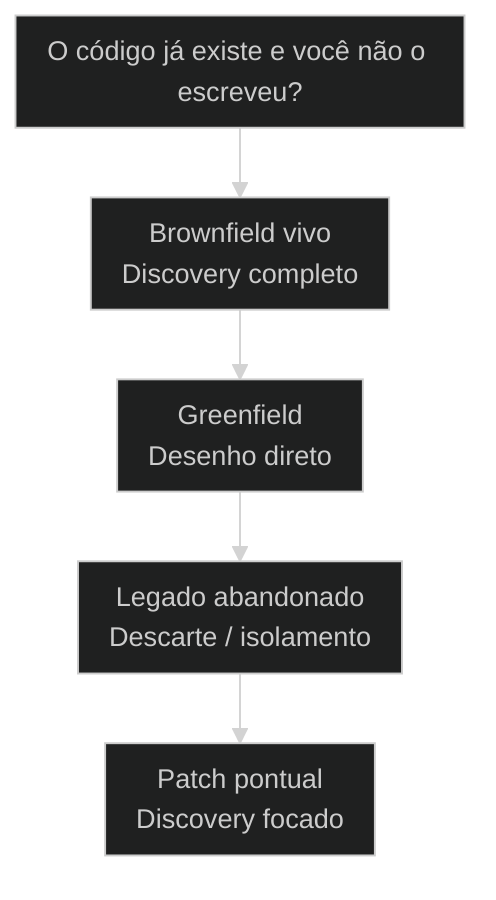
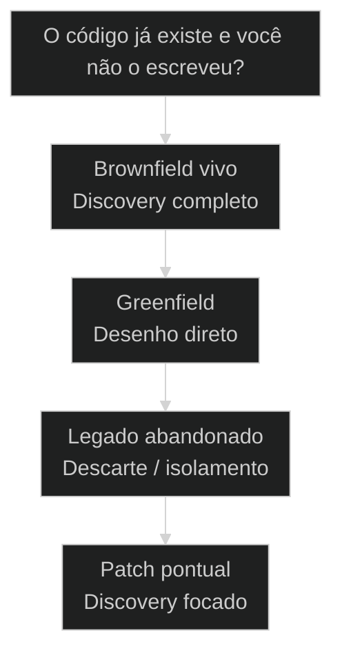

# [[Brownfield Discovery]]: entrar num projeto que já existe

## Resultado

Ao final desta aula você consegue aplicar o núcleo de **Brownfield Discovery: entrar num projeto que já existe** em uma decisão real do seu fluxo AIOX, com critério verificável.

## Conceitos

- [[Brownfield Discovery]]

## Mapa desta aula

Decisão-chave da aula — O código já existe e você não o escreveu?



> Leia o diagrama antes do texto longo. Depois volte e confira.

> [[Greenfield]] começa do zero. Brownfield começa de um código que já roda e que você não escreveu. A regra muda: antes de propor, você decifra. Discovery é o ritual que evita refatorar no escuro.

**Objetivos de aprendizagem:**
- Nomear o que distingue um projeto brownfield de um greenfield no AIOX. _(remember)_
- Distinguir discovery (decifrar) de intervenção (propor mudança) num código legado. _(understand)_
- Escolher quando rodar discovery completo antes de tocar em qualquer linha. _(apply)_
- Explicar por que mapear a estrutura real evita refatorar no escuro. _(understand)_

---

## Brownfield: o código já roda e você não escreveu

*Discovery AIOX · entrar num projeto que já existe*

Greenfield é uma folha em branco. Brownfield é uma casa habitada: tem paredes, tem encanamento, tem decisões antigas que você precisa respeitar. Antes de propor mudança, você decifra. Quem pula o discovery refatora no escuro.

- **10**: fases de discovery brownfield
- **1**: regra: decifrar antes de propor
- **0**: refatoração no escuro

- **status**: [[Brownfield Discovery|brownfield discovery]]
- **meta**: greenfield=comeca do zero
- **meta**: brownfield=codigo que ja roda
- **meta**: regra=decifra antes de propor
- **meta**: fonte=aula-01 + t2-aula-1 + t2-aula-2 + aula-04
- **ready**: ready to map

**Legenda de cores**

Mapa semantico do Brownfield Discovery

- **Brownfield** (signal): projeto que ja existe e voce nao escreveu
- **Discovery** (insight): o ritual de decifrar antes de propor
- **Mapa** (bench): a estrutura real do codigo, nao a suposta
- **Intervencao** (action): a mudanca proposta depois de entender
- **Erro comum** (pain): refatorar no escuro, sem discovery

---

## Comece pela pergunta certa

Antes de listar as fases do discovery, fixe a pergunta única: o código já existe e você não o escreveu? Se sim, é território brownfield, e a primeira ação é decifrar, não propor. Todo o resto deriva daí.

**Como ler esta aula**

1. **A pergunta aparece**: Uma frase separa começar do zero de entrar num código que já roda.
2. **Cada peça mostra a cara**: Discovery decifra a estrutura real. Intervenção só vem depois de entender.
3. **Vê o caso real**: /processo de mapeamento AIOX e code-anatomist são primitivos reais do AIOX, apontáveis no repo.
4. **Decide**: Dado um projeto, você aponta se merece discovery completo antes de tocar no código.

- **Objetivos da aula** (Nomear o que distingue brownfield de greenfield no AIOX.; Distinguir discovery (decifrar) de intervenção (propor mudança).; Escolher quando rodar discovery completo antes de tocar no código.; Explicar por que mapear a estrutura real evita refatorar no escuro.)
- **Onde você está?** (Começando: foque Mapa Simples e a analogia da casa habitada.; Já usa AIOX: foque Casos Reais e a Decisão.; Vai mapear: foque as 10 Fases e as Métricas.)
- **Leitura prática**: Em cada bloco, procure uma resposta: estou decifrando o que já existe ou propondo mudança? Quando cada um ajuda e quando atrapalha?

**Ritmo da aula**

A distinção fica clara quando cada peça tem definição curta, exemplo real do framework e o gosto de quando usar.

- G **Pergunta antes do detalhe**: Primeiro o critério que separa, depois cada fase por dentro.
- 1 **Analogia que ancora**: Greenfield é terreno baldio. Brownfield é casa habitada que pede planta antes da reforma.
- 2 **Caso real**: /processo de mapeamento AIOX e code-anatomist são apontáveis no AIOX, não teoria.
- 3 **Recap com decisão**: A aula fecha com o aluno decidindo se um projeto dele merece discovery completo.

---

## A diferença sem jargão

Antes dos termos técnicos, a diferença é só isto: greenfield você desenha do nada; brownfield você herda um código que já roda e precisa entender antes de mudar.

> **Em uma frase**: Greenfield começa do zero: nenhuma decisão antiga te limita. Brownfield começa de código que já roda e que você não escreveu. A regra muda: antes de propor mudança, você decifra a estrutura real. Discovery primeiro, intervenção depois.

- **Brownfield é código herdado** -> Um projeto que já existe, já roda em produção, e você não foi quem escreveu. Tem decisões antigas embutidas.
- **Discovery decifra** -> O ritual de mapear a estrutura real: arquitetura, domínio, dados, dependências. Entender antes de tocar.
- **O mapa é a marca** -> Você sai do discovery com a estrutura real desenhada, não com a suposta. Sem mapa, não houve discovery.
- **Intervenção vem depois** -> Só depois de entender você propõe mudança. A proposta nasce do mapa, não do palpite.
- **O erro caro** -> Refatorar no escuro: mexer antes de decifrar. Você quebra o que não entendeu e descobre tarde demais.

**Diagrama principal: do código herdado à intervenção**

1. **Brownfield**: O código já existe e roda. Você herdou, não escreveu.
2. **Discovery**: O ritual que decifra a estrutura real antes de qualquer mudança.
3. **Mapa**: A estrutura real desenhada: arquitetura, domínio, dados, dependências.
4. **Intervenção**: A mudança proposta a partir do mapa, não do palpite.

**O que o discovery evita**
- Refatorar antes de entender a estrutura real.
- Tratar brownfield como se fosse greenfield.
- Propor mudança a partir de palpite, não de mapa.
- Quebrar dependências que você não sabia que existiam.

**O que ele força**
- Decifrar arquitetura, domínio e dados antes de tocar.
- Respeitar as decisões antigas embutidas no código.
- Propor intervenção a partir do mapa desenhado.
- Rodar discovery completo antes da primeira linha.

---

## A analogia da casa habitada

A forma mais rápida de fixar a diferença: greenfield é terreno baldio onde você constrói livre; brownfield é casa habitada onde você reforma. Reformar sem a planta da fiação derruba a parede errada.

- **Greenfield = terreno baldio**: Você constrói do zero. Nenhuma parede te limita, nenhuma tubulação te surpreende. Liberdade total, mas também zero contexto herdado.
- **Brownfield = casa habitada**: Você herda paredes, encanamento e fiação que alguém instalou. Antes de reformar, precisa da planta: onde passa o cano, onde está a viga estrutural.
- **Discovery = levantar a planta**: O ritual de mapear a casa antes da obra. Onde está cada cano, cada viga, cada decisão antiga. A planta evita derrubar a parede que segura o teto.
- **Intervenção = a reforma certa**: Com a planta na mão, você reforma o que precisa sem quebrar o que sustenta. A mudança nasce do mapa, não do palpite.

Na aula ao vivo, o Alan ancorou a mesma imagem no terreno que dá nome aos termos:

> **Alan Nicolas (aula-01 L1133-1135)**: É esse campo marrom, né? Pensa num terreno: esse terreno está um espaço verde porque ninguém construiu ainda em cima. Então tu vai criar do zero: vai ser greenfield. Brownfield? Porque a maioria de vocês está vindo com algum projeto para o AIOX. Você já tem algum projeto que você criou e quer fazer essa migração.

> **E quando misturar?**: Um projeto pode ter alas greenfield (módulos novos do zero) e alas brownfield (código legado herdado). O erro é tratar a ala habitada como terreno baldio e reformar sem planta. Discovery na parte herdada, liberdade na parte nova.

---

## Greenfield versus Brownfield: o critério legado

Esta é a confusão mais cara do início de projeto. Os dois falam de construir software, então parecem o mesmo trabalho. O critério legado separa os dois de vez: existe código herdado ou não?

**Greenfield (terreno baldio)**
- Começa do zero, sem código herdado.
- Liberdade de arquitetura total.
- Nenhuma decisão antiga te limita.
- Discovery curto: você define tudo.

**Brownfield (casa habitada)**
- Começa de código que já roda.
- Arquitetura herdada que você respeita.
- Decisões antigas embutidas no código.
- Discovery completo: você decifra tudo antes.

> **A pergunta que separa**: Pergunte: existe código que já roda e que eu não escrevi? Se não, é greenfield: desenhe livre. Se sim, é brownfield: decifre antes de propor. Greenfield é a folha em branco; brownfield é o manuscrito alheio que você precisa ler antes de editar.

Na primeira aula da T1, o Alan abriu exatamente por esse critério, porque ele descreve a situação da maioria da turma:

> **Alan Nicolas (aula-01 L1107)**: Esquece o greenfield. O foco de hoje é o brownfield, que é pegar um projeto que já está em andamento. A maioria de vocês aqui tem um projeto em andamento.

Na T2, o mesmo critério aparece como guia de seleção de workflow: "você está entrando num projeto existente sem documentação? Você vai executar isso aqui", com o Brownfield Discovery listado entre os quatro workflows que cobrem oitenta a vinte dos casos. [SOURCE: t2-aula-2 L2761, L2773-2777]

- **Brownfield com greenfield**: Os dois constroem software, então parecem o mesmo trabalho.
- **Discovery com refatoração**: Os dois tocam no código legado, então parecem a mesma etapa.
- **Brownfield com legado abandonado**: Os dois lidam com código antigo, então parecem o mesmo caso.

---

## O discovery existe de verdade no AIOX

A distinção não é teoria. O discovery brownfield é apontável no framework. Estes dois casos mostram os primitivos reais do AIOX que decifram um código que você não escreveu.

- **Onde o discovery vive no AIOX**: O AIOX tem dois primitivos de discovery: code-anatomist (9 fases de engenharia reversa de software) e /processo de mapeamento AIOX (7 fases de mapeamento de processo, iniciando em Discovery). O discovery não é abstração: tem skill, tem fases nomeadas e tem ordem de leitura. Players: code-anatomist, /processo de mapeamento AIOX, 9 fases reverse engineering, 7 fases process mapping, fase Discovery.
- **O que muda a decisão**: A pergunta não é se o projeto é importante. É se existe código ou processo herdado que você não escreveu. Brownfield com valor vivo pede discovery completo. Greenfield e legado abandonado, não.

**Cada conceito num eixo**

A distinção vira sistema quando cada conceito tem definição, lar no framework e o tipo de projeto que resolve.

- **Brownfield**: Código ou processo que já roda e você não escreveu. Tem decisões antigas embutidas.
- **Discovery**: O ritual de decifrar a estrutura real. code-anatomist e /processo de mapeamento AIOX são os primitivos.
- **Mapa**: A estrutura real desenhada: arquitetura, domínio, dados, dependências.
- **Intervenção**: A mudança proposta a partir do mapa, depois do discovery.

**Colunas:** Conceito | Decifra ou muda? | Sinal de uso certo | Sinal de erro

- Brownfield: Decifra ou muda? | Reconhecido como código herdado com decisões antigas. | Tratado como greenfield, reformado sem planta.
- Discovery: Decifra ou muda? | code-anatomist ou /processo de mapeamento AIOX rodando antes da mudança. | Pulado por pressa, intervenção no escuro.
- Mapa: Decifra ou muda? | Estrutura real desenhada fase a fase. | Estrutura suposta, baseada em palpite.
- Intervenção: Decifra ou muda? | Mudança nascida do mapa, depois do discovery. | Mudança proposta antes de entender a estrutura.

### Caso: O code-anatomist faz a engenharia reversa

O discovery não é uma metáfora de aula: o AIOX tem a skill code-anatomist, um pipeline de 9 fases que faz engenharia reversa de software cobrindo arquitetura, domínio, dados, API, dependências e infra.

- Começou como: Um código herdado que rodava, mas cuja estrutura real ninguém tinha mapeado.
- Virou: Um mapa completo da arquitetura, domínio e dependências, fase a fase, antes de qualquer mudança.
- Prova: A skill code-anatomist (renomeada de domain-decoder, RT-DD-V2-001) existe no AIOX com 9 fases de reverse engineering documentadas.
- Lição: Discovery é primitivo real: tem skill, tem fases nomeadas, tem ordem de leitura do código.

### Caso: O /processo de mapeamento AIOX abre pela fase Discovery

Na visão de processo, o discovery é a primeira fase de um pipeline maior: /processo de mapeamento AIOX é um pipeline de 7 fases que começa exatamente em Discovery antes de qualquer arquitetura.

- Começou como: Um processo recorrente brownfield que ninguém tinha mapeado nem decomposto em fases.
- Virou: Um mapeamento de 7 fases iniciado pelo Discovery, que decifra o processo antes de desenhar a solução.
- Prova: A skill /processo de mapeamento AIOX existe no AIOX com 7 fases: Discovery, Architecture, Executors, Workflows, Tasks, QA Gates, Infra.
- Lição: Discovery não é opcional: é a fase de entrada que sustenta todas as outras seis.

---

## As 10 fases do discovery brownfield

O discovery brownfield não é um olhar genérico no código. É um pipeline de fases nomeadas, da leitura da arquitetura à proposta de intervenção. Cada fase fecha antes da próxima abrir.

**Pipeline de discovery brownfield**
As fases ordenadas que decifram um código herdado antes de qualquer intervenção.
- **1. Contexto**: Entender por que o projeto existe e que valor ele sustenta hoje.
- **2. Arquitetura**: Mapear a estrutura macro: camadas, módulos, fronteiras.
- **3. Domínio**: Decifrar as regras de negócio embutidas no código.
- **4. Dados**: Levantar schema real, tabelas com conteúdo, fluxo de dados.
- **5. Dependências**: Mapear o que o código consome e o que depende dele.
- **6. Síntese**: Desenhar o mapa consolidado da estrutura real.

### Caso de campo: o workflow rodou ao vivo nas duas turmas

O número dez não é retórica de slide. Na T2, o Adriano abriu o workflow na tela e descreveu o que ele faz com um projeto herdado:

> **Adriano de Marqui (t2-aula-1 L4789-4793)**: Ele vai pegar todo o seu projeto, que você trouxe de qualquer outro lugar, e vai fazer uma verificação de dez fases.

Na T1, o Pedro percorreu o desenho fase a fase, ao vivo. O fluxo real: o arquiteto abre documentando o sistema e faz a primeira pergunta condicional, "tem banco de dados?". Se sim, chama o Data Engineer para a task de schema audit, a auditoria do banco. Depois o UX Design Expert gera o front-end spec pack. A fase quatro é a consolidação inicial: schema audit, documentação do projeto e front-end spec pack são os três documentos que entram como input para virar o draft do arquiteto. As fases cinco a sete são validação: o Data Engineer valida a seção de database, o UX Design Expert valida a seção de UX e o QA revisa tudo, num ciclo de Quality Gate. Aprovado, o arquiteto faz o assessment final e sai o Architecture.md, que vira input para o analista fazer o relatório executivo e criar o PRD, depois os épicos e os stories. "Aí, aqui a gente tem o Discovery completo." [SOURCE: aula-01 L1595-1653]

Na T2, o Adriano refez o mesmo caminho em versão comprimida: fase um do arquiteto, ver se tem banco de dados e chamar o Data Engineer, depois o UX para ver as telas, aí o arquiteto de novo para consolidar. [SOURCE: t2-aula-2 L3389-3393]

O final do pipeline é o que transforma leitura em plano de trabalho: o discovery entrega a lista do que está errado e o formato para corrigir.

> **Adriano de Marqui (t2-aula-1 L4829-4833)**: Isso aqui é um workflow. Ele vai fazer várias etapas. E aí ele vai trazer todos os débitos técnicos do projeto, tudo que precisa ser corrigido.

> **Adriano de Marqui (t2-aula-1 L4849-4853)**: Tudo que precisa ser feito vira épicos e stories. Story é a unidade menor que você diz para a IA: é isso aqui que você tem que corrigir. Eu vou saber que você fez e que fez bem se você atendeu esse critério de aceitação.

E por que isso é um workflow, e não uma lista de comandos que você decora? O Pedro fechou a demo com o contrafactual:

> **Pedro Valerio Lopez (aula-01 L1671-1689)**: Pensa: se não tivesse workflow, você ia chamar o arquiteto com o comando Brownfield Discovery, o arquiteto ia fazer o documento e ia voltar para você. Depois você ia chamar o Data Engineer, depois o UX Design Expert, depois o arquiteto de novo. O workflow é a dinâmica de fazer isso de forma automática, sem passar pelo usuário, porque a gente criou regras determinísticas suficientes para garantir a qualidade em cada uma delas.

**discovery fecha antes da intervenção abrir**

1. **Leitura**: O discovery lê o código herdado em camadas ordenadas, sem mudar nada.
2. **Mapa**: Arquitetura, domínio, dados e dependências viram um mapa consolidado.
3. **Gate**: O discovery fecha com checkpoint antes de qualquer proposta.
4. **Intervenção**: A mudança proposta nasce do mapa, fase por fase.

---

## Como discovery, mapa e intervenção se combinam

Discovery, mapa e intervenção não são rivais; são camadas em sequência. O discovery decifra, o mapa registra, a intervenção muda. Entender a direção evita propor mudança antes de entender.

- **1. Decifrar (Discovery)**: Quem lê o código herdado. O discovery roda as fases sem mudar nada. É a única etapa que apenas observa. [WHY, decifra, observa]
- **2. Registrar (Mapa)**: O que ficou entendido. A estrutura real desenhada: arquitetura, domínio, dados, dependências. O artefato que sobrevive ao discovery. [WHAT, estrutura, mapa]
- **3. Mudar (Intervenção)**: Como o código vira outro. A proposta de mudança que nasce do mapa. Zero palpite, máxima rastreabilidade. [HOW, proposta, do mapa]

---

## Quando rodar discovery completo?

Antes de tocar no código, decida se o projeto merece discovery completo. O critério economiza tempo quando você escolhe pelo legado vivo, não pela vontade de mexer logo.

**Árvore de decisão**
_Responda pelo legado antes de pensar em quanto vai mudar._



- **Brownfield vivo** — O código já roda em produção, sustenta valor e você não o escreveu.
  → _Discovery completo_
  Ex.: Rode discovery completo via code-anatomist ou /processo de mapeamento AIOX antes de propor.
- **Greenfield** — Você começa do zero, sem código herdado nem decisões antigas.
  → _Desenho direto_
  Ex.: Não precisa de discovery de legado. Desenhe livre a arquitetura.
- **Legado abandonado** — Código antigo que ninguém usa e pode ser descartado sem custo.
  → _Descarte / isolamento_
  Ex.: Não vale discovery completo. Avalie só se descarta ou isola.
- **Patch pontual** — Uma mudança mínima e isolada num código que você já conhece bem.
  → _Discovery focado_
  Ex.: Discovery leve, focado só na região tocada. Não precisa do pipeline inteiro.

**Gate:** Qual é o gate? — _Sem gate, você roda discovery por reflexo ou pula por pressa. Responda: existe código herdado vivo que você não entende? Se sim, discovery completo. Se não, desenho direto, descarte ou discovery focado._

> **Regra do critério único**: A escolha não é pela importância do projeto; é pelo legado vivo. Se existe código herdado que importa e você não entende, discovery completo é a peça. Se é greenfield ou legado morto, discovery completo é overengineering. Mexer em brownfield vivo sem discovery é refatorar no escuro, o erro mais caro do início.

O mesmo critério foi enunciado ao vivo, com a lista de casos em que o discovery completo é recomendado:

> **Pedro Valerio Lopez (aula-01 L1579-1583)**: Quando ele é usado? Principalmente para migração de projetos que você já tem ali no Lovable, Bolt, V0. Auditoria completa de codebase: você já tem um codebase, quer fazer auditoria completa e continuar a partir dali. Planejamento de modernização de alguma coisa antiga. Assessment pré-investimento, onboarding em projeto legado, due diligence técnica. Todas essas partes: sim, recomendado Brownfield Discovery.

E os dois "não" da mesma fala confirmam a árvore acima: projeto novo do zero não vale, porque exige elicitação, o agente precisa tirar de você decisões que o código ainda não carrega, como a tech stack; e enhancement isolado também não, porque adicionar um épico novo num projeto que você já desenvolve tem outro workflow próprio. [SOURCE: aula-01 L1585-1593]

---

## Rotas de discovery

Cada tipo de projeto brownfield tem um modo típico de discovery. Saber a rota evita decidir certo pelo discovery e materializar com a ferramenta errada.

#### Discovery de código herdado
Quando o brownfield é um software que já roda e você precisa entender a estrutura.
1. **Sinal: código em produção que você não escreveu.
2. **Pergunta: você entende a arquitetura real ou está supondo?
3. **Ação: rodar code-anatomist para as 9 fases de engenharia reversa.
4. **Resultado: mapa de arquitetura, domínio, dados e dependências.

#### Discovery de processo recorrente
Quando o brownfield é um processo de negócio que existe mas ninguém mapeou.
1. **Sinal: processo recorrente sem documentação formal.
2. **Pergunta: você conhece as fases reais ou está adivinhando?
3. **Ação: rodar /processo de mapeamento AIOX começando pela fase Discovery.
4. **Resultado: processo decomposto em 7 fases a partir do discovery.

#### Discovery focado para mudança pontual
Quando a mudança é pequena e isolada num código que você já conhece.
1. **Sinal: mudança mínima numa região conhecida do código.
2. **Pergunta: a região tocada tem dependências que você não vê?
3. **Ação: discovery focado só na região e suas dependências diretas.
4. **Resultado: mapa local suficiente sem o pipeline inteiro.

**Discovery de código**
Use quando o brownfield é software herdado e você precisa decifrar a estrutura.
- `code-anatomist`: roda as 9 fases de engenharia reversa do código.
- `mapear dependências`: levantar o que o código consome e o que depende dele.

**Discovery de processo**
Use quando o brownfield é um processo recorrente sem mapa formal.
- `/processo de mapeamento AIOX`: abre o pipeline de 7 fases pela fase Discovery.
- `fechar checkpoint`: validar o discovery antes de avançar para Architecture.

**Discovery focado**
Use quando a mudança é pontual e a região do código é conhecida.
- `mapear região`: decifrar só a parte tocada e suas dependências diretas.
- `validar fronteiras`: confirmar que a mudança não vaza para fora do mapeado.

**O padrão se repete fora do backend.** O brownfield não é exclusividade de código de servidor: na aula de design system, o Alan mostrou a mesma lógica aplicada à interface. Pegar um projeto que já tem um design pronto e atomizá-lo é um discovery de UI: o `Sb Brownfield Scan` escaneia toda a aplicação primeiro, e só depois o `Sb Brownfield Migration` migra. Scan antes de migration é decifrar antes de propor, com outros nomes. [SOURCE: aula-04 L1663, L1871-1873]

Há também a rota de produto: no PM do AIOX existe o comando de PRD reverso, que aplica o mesmo princípio ao documento de requisitos.

> **Adriano de Marqui (t2-aula-1 L4309)**: Create brownfield PRD, ou seja, você pegar um projeto que já existe e criar um PRD dele.

---

## Modelos para ler melhor

Visualizações rápidas para o aluno comparar greenfield, brownfield e patch, os riscos de cada escolha e o grau de discovery que cada um exige.

- **Brownfield vivo**: alto (código herdado que importa pede discovery completo.)
- **Patch pontual**: médio (discovery focado na região tocada.)
- **Greenfield**: baixo (sem legado, quase nada a decifrar.)

- **Brownfield sem discovery**: brownfield (refatorar no escuro e quebrar o que não viu.)
- **Greenfield com discovery pesado**: greenfield (gastar tempo mapeando o que não existe.)
- **Patch sem checar dependências**: patch (mudança pontual vazando para fora do esperado.)

**Matriz de Decisão do Aluno**

Em dúvida, escolha a célula que melhor descreve o seu projeto.

- **Código herdado vivo**: Discovery completo. code-anatomist antes de propor.
- **Processo recorrente sem mapa**: /processo de mapeamento AIOX pela fase Discovery.
- **Começando do zero**: Greenfield. Desenhe livre, sem discovery de legado.
- **Mudança pontual conhecida**: Discovery focado só na região tocada.
- **Legado que ninguém usa**: Avalie descarte ou isolamento, não discovery.
- **Não sabe ainda**: Pergunte: o código já roda e você não escreveu? Sim, discovery.

- **Sinal de discovery saudável**: estrutura real mapeada antes de qualquer mudança / discovery focado na região da mudança pontual / intervenção proposta sem mapa, no escuro
- **Separação de etapas**: discovery decifra, mapa registra, intervenção muda / discovery e proposta em rodadas separadas e rastreáveis / mudança no código durante a fase de leitura

---

## O que cada peça carrega

Cada peça do discovery tem uma anatomia mínima. Saber o que cada uma guarda ajuda a reconhecer quando você está pulando uma fase ou usando a ferramenta errada.

- **Brownfield: o herdado**: Código ou processo que já roda e você não escreveu. Carrega decisões antigas embutidas.
- **Discovery: o ritual**: As fases que decifram a estrutura real sem mudar nada. Leitura ordenada, não palpite.
- **code-anatomist: a skill**: O pipeline de 9 fases de engenharia reversa de software, da arquitetura à infra.
- **/processo de mapeamento AIOX: o mapa**: O pipeline de 7 fases que abre pela fase Discovery, com checkpoint antes de avançar.
- **Intervenção: a mudança**: A proposta que nasce do mapa. Nunca vem antes do discovery, sempre depois.

---

## Métricas do discovery

Sem telemetria, a saúde do discovery vira fé. Estas perguntas separam um discovery confiável de um olhar superficial disfarçado de mapeamento.

**Colunas:** Métrica | Pergunta | Sinal saudável | Sinal de risco

- Cobertura de estrutura: Arquitetura, domínio, dados e dependências foram mapeados? | As quatro camadas têm mapa, não suposição. | Uma camada ficou no palpite, refatoração quebra ali.
- Ordem das fases: O discovery rodou na ordem, da arquitetura à síntese? | Cada fase fechou antes da próxima abrir. | Pulou direto para a mudança, sem fechar o mapa.
- Separação de etapas: A leitura ficou separada da mudança? | Discovery decifrou sem alterar o código. | Refatoração começou durante a fase de leitura.
- Rastreabilidade: A intervenção aponta para o mapa que a justifica? | Cada mudança traça de volta a uma fase do discovery. | Mudança proposta sem âncora no que foi mapeado.

---

## Quando resistir ao discovery completo

A distinção ajuda mais quando você resiste ao reflexo de rodar discovery completo em tudo. O discovery tem custo: tempo de leitura, mapeamento, checkpoint. Vale só quando o legado vivo paga.

**Quando rodar discovery completo**
- O código já roda em produção e sustenta valor real.
- Você não escreveu a estrutura e não a entende.
- A mudança toca regiões com dependências desconhecidas.
- O custo de quebrar no escuro é alto.

**Quando não rodar**
- É greenfield: começa do zero, nada a decifrar.
- É legado morto que pode ser descartado sem custo.
- A mudança é pontual numa região que você já domina.
- O custo do discovery completo supera o risco da mudança.

O contrapeso da resistência é lembrar por que dominar brownfield vale o esforço. O Alan abriu o jogo sobre a estratégia de negócio por trás da habilidade:

> **Alan Nicolas (aula-05 L2847)**: É pegar sistemas legados e transformar eles em sistemas atualizados com AI First. Daí eu vou fechar contrato de duzentos mil, de quinhentos mil, de um milhão, de dois milhões, de cinco milhões.

Quem sabe decifrar um sistema que já roda cobra caro exatamente porque a maioria só sabe começar do zero.

---

## Da cohort: o workflow nasceu de uma reclamação da turma

*T1 + T2 · aulas ao vivo*

O Brownfield Discovery não nasceu pronto. Nasceu de alunos reclamando que o discovery manual era comando demais:

> **Alan Nicolas (aula-01 L1109-1111)**: Eu comecei a dar uma aula sobre isso e a galera começou a dizer assim: mas é muito comando, Alan. Não tem isso, depois isso, depois isso, depois isso? Eu pensei: quer saber? Eu vou criar um workflow inteiro.

O primeiro teste do fluxo completo foi num projeto de aluno de verdade: "foi ter criado um Brownfield Discovery, que era focado em fazer todo o descobrimento de um projeto inteiro para vocês. Eu fiz isso, por exemplo, para um de vocês aqui, que foi para o Toriani." [SOURCE: aula-01 L1529-1531]

Na T2, o Adriano reconheceu que a primeira versão vivida pela turma do Fundamentos era outra coisa:

> **Adriano de Marqui (t2-aula-1 L933-937)**: Lá no Fundamentos, nós fizemos uma migração de projeto com o Brownfield Discovery. Mas gente, o que a gente fez ali era muito cru, muito amador: era só colocar "vamos executar o Brownfield Discovery".

**A fronteira que a turma testou.** O Igor Nemir perguntou se dava para usar o brownfield fora do território dele:

> **Igor Nemir (t2-aula-2 L4329)**: Eu posso fazer um brownfield, ativar esse workflow para revisar esse squad que eu já criei? Faz sentido isso ou não faz nenhum sentido?

A resposta do Adriano desenha a fronteira do primitivo: o Brownfield Discovery decifra stack e código de um projeto; para revisar um squad existe outro mecanismo, o Update Squad, "que vai pegar o seu squad, tentar dar uma tunada nele e pesquisar ferramentas". Brownfield é para código herdado, não para qualquer coisa que já existe. [SOURCE: t2-aula-2 L4465-4473]

**O caso que valida o critério da aula.** A Cris França chegou com a dúvida exata que esta aula treina:

> **Cris França (t2-aula-2 L5777-5789)**: Eu vinha do Fundamentos e criei um produto do zero, fiz esse passo a passo todo de story, de PRD, de squads. Ele não está no Lovable: está no GitHub, estou usando Supabase e Vercel. Eu utilizo o Brownfield para fazer essa análise?

Repare que o projeto dela não é de terceiro: ela mesma escreveu, com processo. Mas ao querer uma revisão de estrutura completa sobre um código que já roda, a pergunta que ela faz é a pergunta desta aula: existe estrutura viva que precisa ser decifrada antes da próxima intervenção? A turma inteira orbitou esse mesmo dilema.

---

## Exercício: decida o discovery

Pegue um projeto real seu e aplique o critério. O objetivo não é mapear tudo; é apontar se o projeto exige discovery completo antes de tocar em qualquer linha.

**Um projeto, cinco perguntas**
```yaml
discovery:
  projeto: "o que voce vai mexer?"
  herdado: "codigo ja roda e voce nao escreveu? sim | nao"
  peca: "discovery_completo | desenho_direto | discovery_focado"
  ferramenta: "code_anatomist | aiox_map_process | discovery_focado"
  gate: "por que nao a outra rota? (se discovery, quais camadas mapeia antes?)"

```
*O acerto não é mapear tudo. É provar que você escolheu a rota pelo critério legado vivo e sabe justificar por que a outra custaria mais sem entregar mais segurança.*

**Exemplo preenchido: herdar um SaaS legado versus criar um módulo novo**

- **Projeto A**: Herdei um SaaS em producao que nao escrevi e preciso adicionar uma feature.
- **Herdado A**: Sim. O codigo ja roda e tem decisoes antigas que eu nao conheco.
- **Peça A**: Discovery completo. Rodo code-anatomist para mapear arquitetura, dominio, dados e dependencias antes de tocar.
- **Projeto B**: Vou criar um modulo novo do zero, sem dependencia de codigo legado.
- **Peça B**: Desenho direto. Greenfield: nao ha legado a decifrar, desenho a arquitetura livre.
- **Gate B**: Discovery completo nao se aplica: nao existe estrutura herdada para mapear, entao a leitura pesada seria mapear o vazio.

- 1. **Projeto**: Descreva em uma frase o projeto ou processo em que você vai mexer.
- 2. **Herdado?**: Responda: o código já roda e você não o escreveu, ou começa do zero?
- 3. **Peça**: Aponte discovery completo (brownfield vivo), desenho direto (greenfield) ou discovery focado (patch).
- 4. **Ferramenta**: Diga como rodaria: code-anatomist para código, /processo de mapeamento AIOX para processo, discovery focado para patch.
- 5. **Gate**: Justifique por que não escolheu a outra rota. Para discovery, diga quais camadas vai mapear antes de propor.

**Funcionou se:**

- O aluno escolhe a rota pelo critério legado vivo, não pela vontade de mexer logo.
- O aluno separa decifrar (discovery) de propor mudança (intervenção).
- O aluno define quais camadas vai mapear quando escolhe discovery completo.

---

## Glossário do Brownfield Discovery

Tradução dos termos para alguém que está vendo a distinção greenfield versus brownfield pela primeira vez.

- **Brownfield**: Projeto que já existe, já roda e que você não escreveu. Tem decisões antigas embutidas que você precisa respeitar.
- **Greenfield**: Projeto que começa do zero, sem código herdado nem decisões antigas. Liberdade total de arquitetura.
- **Discovery**: O ritual de decifrar a estrutura real de um código herdado antes de propor mudança. Lê em fases ordenadas sem alterar nada.
- **code-anatomist**: A skill do AIOX que faz engenharia reversa de software em 9 fases: arquitetura, domínio, dados, API, dependências, infra. Renomeada de domain-decoder.
- **/processo de mapeamento AIOX**: O pipeline de 7 fases do AIOX para mapear processos recorrentes. Abre pela fase Discovery, com checkpoint antes de avançar.
- **Mapa**: A estrutura real desenhada pelo discovery: arquitetura, domínio, dados e dependências. O artefato que sobrevive à leitura.
- **Intervenção**: A mudança proposta a partir do mapa. Nasce do discovery, nunca antes dele.
- **Refatorar no escuro**: O anti-padrão de mudar código herdado sem discovery. Quebra o que não foi entendido e descobre tarde demais.

> **Portão da aula**: A aula só está no padrão quando o aluno nomeia o que distingue brownfield de greenfield, distingue o discovery (decifrar a estrutura real) da intervenção (propor mudança) e consegue apontar, para um projeto real, se ele exige discovery completo (brownfield vivo, via code-anatomist ou /processo de mapeamento AIOX) ou desenho direto (greenfield) antes de tocar em qualquer linha.

***

---

## Operar isto na prática

Esta aula é pré-requisito no curso de squads — quando a missão for real, siga para: Code Anatomist: `cursos/AIOX-Advanced-Squads/aulas/03-code-anatomist.md` · Domain Decoder: `cursos/AIOX-Advanced-Squads/aulas/04-domain-decoder.md`

## Navegação

← [[aulas/24-entidade-como-unidade-de-processo|Entidade como unidade de processo: nasce, vive, morre]] · ↑ [[modulos/Módulo 4 - Método e Brownfield|M4 — Método e brownfield]] · ⌂ [[cursos/AIOX Advanced/README|Curso]] · → [[aulas/53-brownfield-enhancement|Brownfield Enhancement: como adicionar feature em código legado]]
