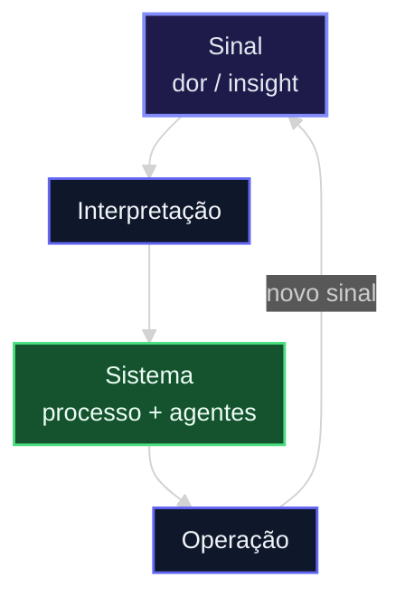
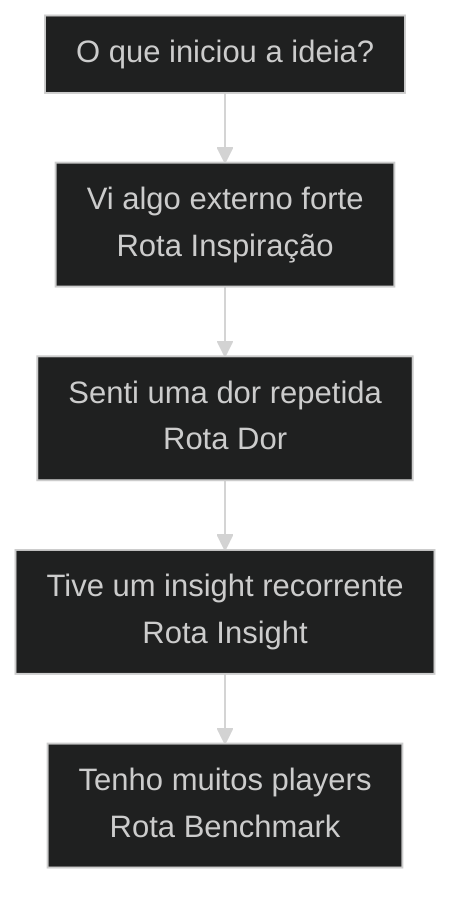

# Método S2S: converter sinais em sistemas

## Conceitos

- [[Método S2S]]

## Mapa desta aula

S2S: sinal vira sistema; a operação gera novos sinais (loop de melhoria).



> Leia o diagrama antes do texto longo. Depois volte e confira.

> S2S é o método extraído de 2.181 commits e 879 prompts: classificar o sinal, escolher entre PULL, PUSH ou RAIZ, comparar antes de construir e fechar com prova mensurável.

**Objetivos de aprendizagem:**
- Identificar qual sinal iniciou uma ideia: inspiração, dor, insight ou benchmark. _(understand)_
- Explicar por que comparar vem antes de construir no Método S2S. _(understand)_
- Escolher uma sequência AIOX coerente com o tipo de sinal. _(apply)_
- Avaliar se a execução virou sistema com prova suficiente. _(evaluate)_

---

## Método S2S: converter [[Método S2S|sinais em sistemas]]

*Método S2S · Sinal → Sistema · Por Alan Nicolas*

S2S é o método extraído de 2.181 commits e 879 prompts: classificar o sinal, escolher entre PULL, PUSH ou RAIZ, comparar antes de construir e fechar com prova mensurável.

- **2.181**: commits analisados
- **879**: prompts de base
- **3**: motores: pull/push/raiz

- **status**: operator grid
- **meta**: operador=alan_nicolas, método=s2s
- **meta**: commits=2181, prompts=879
- **meta**: motores=pull/push/raiz
- **meta**: fonte=lastro de campo em t2-aula-5, t2-aula-6 e aula-05 (transcrições da cohort)
- **ready**: ready to ship

**Legenda de cores**

Mapa semântico do Método S2S

- **PULL** (signal): inspiracao externa, ponto latente
- **PUSH** (pain): dor repetida, 3+ ocorrencias
- **RAIZ** (insight): insight recorrente, heurística
- **Dossiê** (bench): players, scorecard, gap
- **Re-bench** (action): DoD real, delta mensuravel

---

## Heurística AN_KE_147

AN_KE_147 é uma regra prática do Alan: toda intuição importante precisa virar mecanismo. No S2S, ela funciona como gate para separar aprendizado real de frase bonita.

**Aspiração**
- "Sempre faça code review."
- "Compare antes de construir."
- "Documente aprendizados."
- Soa certo, mas não se sustenta sob pressão.

**Mecanismo**
- Hook, validator, script, checklist ou branch protection.
- Falha visível quando alguém ignora.
- Métrica que prova se continua vivo em 30 dias.
- Regra SE/ENTÃO/NUNCA quando vira heurística.

> **A pergunta central**: Quando alguém escreve um princípio, uma regra ou uma heurística nova, AN_KE_147 obriga uma pergunta simples: se alguém ignorar isso amanhã, o que acontece? Se a resposta for "nada, alguém talvez perceba depois", ainda é aspiração. Para virar mecanismo, precisa existir uma trava, um teste, um gate, um owner ou uma métrica que mantenha a regra viva sem depender de memória humana.

**Exemplos fracos**
- "Sempre faça code review" sem branch protection.
- "CLI first" sem comando, teste ou check automatizado.
- "Documente decisões" sem template, gate de ADR ou revisão.
- "Compare antes de construir" sem benchmark obrigatório no fluxo.

**Exemplos fortes**
- Merge bloqueado se não houver aprovação.
- Validator falha quando uma story não referencia evidência.
- ADR só fecha com fitness function e severidade definida.
- Skill só promove se passar por teste, revisão e uso real.

> **Como usar dentro do S2S**: PULL precisa virar skill validada, não inspiração solta. PUSH precisa virar pipeline com critério de sucesso, não reclamação recorrente. RAIZ precisa virar heurística com contexto, regra de ativação, risco e prova de uso futuro. Em todos os casos, a pergunta é a mesma, isso virou mecanismo ou só ganhou um nome bonito?

---

## Comece pelo movimento

Primeiro vem o movimento geral do Método S2S. Os termos técnicos só entram depois que a lógica está clara.

**Como ler esta aula**

1. **A ideia aparece**: Pode vir de inspiração externa, dor repetida, insight recorrente ou necessidade de benchmark.
2. **Alan compara**: Ele verifica referências fortes, players, padrões e gaps antes de construir.
3. **Vira execução**: O sinal vira story, skill, pipeline, matriz, contrato ou melhoria implementável.
4. **Fecha com prova**: O ciclo só fecha com validação, revisão crítica e sistema reutilizável.

- **Objetivos da aula** (Identificar qual sinal iniciou uma ideia.; Explicar por que comparar vem antes de construir.; Escolher uma sequência AIOX coerente com o caso.; Avaliar se o ciclo virou sistema com prova suficiente.)
- **Onde você está?** (Começando: foque Mapa Simples e Decisão.; Já usa AIOX: foque Casos Reais e Comandos.; Vai implementar: foque Benchmark, Processos e Métricas.)
- **Leitura prática**: Leia cada bloco procurando uma resposta prática: qual era o sinal, qual foi o filtro, qual comando entrou, qual evidência provou melhoria e qual sistema ficou reutilizável.

**Aprendizado do guia de fluxo**

Uma aula fica mais clara quando cada etapa tem objetivo, portão de avanço, analogia e ação prática.

- G **GPS antes do conteúdo**: Comece dizendo onde o aluno vai chegar e de onde ele está saindo.
- 1 **Fluxo com portões**: Cada etapa precisa responder: posso avançar ou preciso voltar?
- 2 **Analogia na hora certa**: A analogia entra quando o conceito é abstrato, não como decoração.
- 3 **Recap com ação**: A aula termina melhor quando o aluno sai com uma decisão concreta de 2 minutos.

---

## O processo sem jargão

Antes dos nomes técnicos, o Método S2S é só isto: perceber, filtrar, comparar, construir, provar e sistematizar.

> **Em uma frase**: Alan converte sinais interessantes em sistemas úteis, e cada sistema melhora o próximo ciclo.

Esse movimento não é teoria de slide. Na aula de pesquisa da segunda turma, Alan entregou o gatilho que dispara o método inteiro, o momento em que um sinal de dor pede sistema:

> **Alan Nicolas (t2-aula-5 L613)**: Se você tiver que conversar muito com a IA, significa que ela não tem mapeado o seu processo.

> **Alan Nicolas (t2-aula-5 L625)**: Anota no caderninho. Anota na mente. [...] Toda vez que tu conversar muito com a IA, significa que esse processo ainda não está mapeado.

Conversa repetida é fricção repetida: é o sinal de dor em estado bruto. O que o S2S chama de "classificar o sinal" começa exatamente aí, ao perceber que a repetição denuncia um processo sem dono.

- **Não começa construindo** -> Começa entendendo se aquilo realmente vale entrar no sistema.
- **Não cria do zero se já existe algo bom** -> O aluno aprende a procurar exemplos, concorrentes e referências para absorver o melhor.
- **Não termina quando funciona** -> Termina quando a melhoria foi comprovada e o aprendizado virou mecanismo.

**Diagrama principal: do começo ao fim**

1. **Classifico o motor**: Alan vê se o começo é pull, push ou raiz antes de decidir o caminho.
2. **Aplico o gate**: Isso é útil de verdade? Já apareceu mais de uma vez? Existe base no sistema?
3. **Monto o dossiê**: Ele procura quem já faz bem, quais são os padrões e onde está o gap.
4. **Story herda do dossiê**: O trabalho vira story, checklist, contrato ou plano de execução.
5. **Absorvo, não reinvento**: Ele reusa, adapta, conecta e melhora o que já existe.
6. **Faço re-bench**: Ele compara de novo com a referência. Se não venceu, volta e ajusta.
7. **Promovo a mecanismo**: O que funcionou vira regra, heurística, skill, pipeline ou material ensinável.

**O que o Método S2S evita**
- Construir por empolgação sem demanda real.
- Automatizar uma dor que apareceu só uma vez.
- Criar do zero algo que já existe melhor.
- Declarar sucesso sem comparar com referência.

**O que ele força**
- Separar impulso de oportunidade real.
- Comparar antes de construir.
- Converter aprendizado em mecanismo reutilizável.
- Fechar o ciclo com prova, não com sensação.

---

## Fluxograma de decisão

O aluno usa este mapa para escolher a rota antes de rodar comandos AIOX.

**Árvore de decisão**
_Identifique o sinal antes de agir._



- **Vi algo externo forte** — Post, vídeo, ferramenta, tendência ou concorrente chamou atenção.
  → _Rota Inspiração_
  Ex.: Use Inspiração. Compare com o melhor e veja se existe base interna para absorver.
- **Senti uma dor repetida** — Processo lento, retrabalho, qualidade instável ou fricção recorrente.
  → _Rota Dor_
  Ex.: Use Dor. Pare de remendar caso isolado e converta a fricção em processo.
- **Tive um insight recorrente** — Uma regra mental apareceu em vários contextos.
  → _Rota Insight_
  Ex.: Use Insight. Formalize em SE/ENTÃO/NUNCA e teste em uma sessão real.
- **Tenho muitos players** — Há referências suficientes para comparar por eixos.
  → _Rota Benchmark_
  Ex.: Use Benchmark. Compare por critérios antes de decidir o que absorver.

**Gate:** Qual é o gate? — _Sem gate, a ideia vira distração. Responda: qual é o sinal, qual é o critério de avanço e qual prova mostrará melhoria?_

> **Pausa para checagem**: Antes de rodar qualquer comando, o aluno deve conseguir responder: qual é o sinal, qual é o gate e qual será a prova?

---

## Os 3 motores nativos

Toda iniciativa nasce de um destes três lugares. Saber qual é o começo evita usar o processo errado.

- **Vi algo e liguei os pontos**: Alan acompanha mentes fortes, vê uma ideia no mundo e percebe que já tem peças internas para criar algo melhor ou mais completo.
- **Uma dor ficou repetitiva**: Alan está trabalhando, algo fica lento ou chato várias vezes, e a fricção vira candidata a automação.
- **Um insight pediu forma**: Uma regra mental aparece em várias situações. Se ela tem contexto claro, vira heurística ou mecanismo.

**Funcionou se:**

- O aluno consegue apontar qual começo gerou a iniciativa.
- O aluno sabe dizer qual rota não deve usar.

---

## Casos reais do método

Quatro estudos de caso mostram como Alan reconhece o tipo de sinal, escolhe a rota e fecha com um resultado validável.

- **O que foi analisado no bench**: O benchmark comparou o anchor interno com players open-source já disponíveis localmente. Isso evita opinião solta: cada conclusão nasce de código, template, contrato ou estrutura real. Players: slide-creator, presenton, ppt-master, banana-slides, PPTAgent, presentation-ai, slide-deck-ai, powerpoint-skill, PresentAgent-2.
- **Achados que mudam a decisão**: O anchor era forte em função narrativa, mas perdia em estilo visual, runtime de pipeline e diversidade de mídia. Presenton apareceu forte em volume e famílias; ppt-master liderou estilo visual com layouts, charts e renderizações.

**4 eixos da matriz de absorção**

O bench vira sistema quando as referências são comparadas por eixos explícitos.

- **Função narrativa**: Para que cada slide serve: agenda, benchmark, resumo executivo, pricing, timeline e outros.
- **Papel no pipeline**: Onde o template entra: planejamento, geração, render, export, revisão ou pacote final.
- **Mídia e elementos**: Texto, charts, imagens, ícones, layouts, evidências, tabelas e composição visual.
- **Estilo visual**: Famílias de design, tiers visuais, temas, variações e qualidade percebida.

**Colunas:** Categoria | Pergunta | Sinal saudável | Sinal de risco

- Hero / Cover: A abertura segura atenção e posiciona o deck? | PPT Master / Presenton mostram padrão forte de capa. | Slide Creator precisa absorver variações de abertura.
- Comparison / Decision: A matriz ajuda a decidir? | Slide Creator já é referência em decisão e comparação. | Players visuais podem ser bonitos sem decisão clara.
- Architecture / Diagram: O mecanismo fica visível? | Força interna clara em diagramas e explicação de sistema. | Referências externas ajudam menos nessa camada.

- **Prova do bench**: 9 players / 70 artefatos / 531 células
- **Validação**: 97.7/100 Gold / 16/16 gaps tratados / 0 relatório solto

### Caso: design-md

Quando uma tendência externa encontra uma base interna pronta.

- Começou como: Tendência externa de design para IA.
- Virou: Skill e visualização aplicável.
- Prova: Site publicado e fluxo reutilizável.
- Lição: Inspiração só vale quando encontra base interna.

### Caso: tech-research

Quando uma dor repetida vira um processo de pesquisa melhor.

- Começou como: Pesquisa lenta e pouco padronizada.
- Virou: Pipeline repetível de investigação.
- Prova: Evidência, critérios e revisão.
- Lição: Dor repetida merece sistema.

### Caso: slide-creator bench absorption

Quando um repertório bom precisa virar um sistema comparável, auditável e melhorável.

- Começou como: Dúvida sobre qualidade dos templates.
- Virou: Benchmark Gold com matriz comparativa.
- Prova: 9 players, 531 células, 97.7/100.
- Lição: Benchmark converte opinião em roadmap.

### Caso: AN_KE

Quando um insight recorrente vira uma heurística ensinável.

- Começou como: Padrão mental recorrente.
- Virou: Heurística consultável e ensinável.
- Prova: Ativa comportamento em nova sessão.
- Lição: Conhecimento precisa virar mecanismo.

### Caso: da dor do cliente ao sistema vendido (Thiago Otto)

Um caso narrado por aluno na primeira turma mostra o movimento completo do método fora do repositório. Thiago Otto tinha vendido diagnóstico e treinamento para um empresário que recuou da proposta: tinham contratado muita gente e queriam primeiro reestabilizar os processos. Em vez de insistir, Thiago mudou o sinal de entrada e perguntou o que o time fazia todo dia que tomava trabalho. A resposta era dor repetida clássica: proposta comercial em PPT para cliente, toda semana. Na mesma reunião ele pediu para projetar a tela, puxou o notebook, rodou uma pesquisa profunda da empresa e dos competidores, especificou o prompt e deixou quatro ferramentas gerando os slides enquanto batiam papo e pegavam um café. Cinco ou seis minutos depois, os slides pipocando na tela mudaram a conversa: o cliente olhou e disse que não precisava do treinamento agora, mas queria aquilo. O fechamento foi um sistema, não uma consultoria: "me manda os exemplos dos PPTs que você faz aí, que eu faço um sistema para você fazer proposta no PPT". [SOURCE: aula-05 L2895-2927]

- Começou como: dor repetida do cliente (proposta em PPT toda semana).
- Virou: demonstração ao vivo e encomenda de sistema.
- Prova: o cliente trocou o treinamento pelo sistema na mesma reunião.
- Lição: o sinal certo nem sempre é o seu; a rota Dor também vende.

---

## A trilogia técnica

Depois do mapa simples, estas são as três camadas que explicam o Método S2S em profundidade.

- **1. Cognitive State**: Os modos permanentes que ficam ligados antes de qualquer gatilho: iteracao, comparacao, anti-NIH, suspeita e didatismo. [WHY, sempre-on, 879 prompts]
- **2. Development Methodology**: Os três começos possíveis e o ciclo cerimonial: Bench/Research, Story/DoR, Dev/Absorção, Re-bench, Learning Log. [WHAT, PULL/PUSH/RAIZ, 2.181 commits]
- **3. Execution Mechanics**: O ritmo operacional: multi-stream, stop hooks, cross-repo, LLM sparring, efeito composto e error-to-artifact loop. [HOW, cadencia, mecânica]

---

## O ciclo de trabalho

Agora com os nomes técnicos. Pense nele como a linha de produção que converte uma oportunidade em algo validado.

**linha de produção S2S**

1. **Captura**: Todo material bruto entra aqui: vídeos, conversas, prints, pesquisas, outputs de IA e notas.
2. **Bench / Research**: Alan compara com referências para entender o que já existe e qual seria o padrão alto.
3. **Story / DoR**: O trabalho vira uma tarefa clara: objetivo, critério de sucesso e escopo.
4. **Dev / Absorção**: Alan constrói aproveitando o melhor que achou: conecta, adapta e melhora.
5. **Re-bench**: Alan compara de novo para provar que ficou melhor. Se não ficou, volta.
6. **Learning Log**: O aprendizado é salvo para não depender da memória e acelerar o próximo ciclo.

**O ciclo narrado ao vivo**

O par Bench antes de Story não é invenção desta aula. Na sessão de pipeline de pesquisa da segunda turma, Alan descreveu a mesma linha de produção com os nomes das skills reais:

> **Alan Nicolas (t2-aula-5 L1593)**: Esse é o processo, né? Primeiro é o Tech Research, depois é o Bench [...]. Não se chama mais Domain Decoder, agora eu chamo de Code Anatomy.

O gate que impede a story prematura apareceu na mesma aula, quando um aluno quis pular direto para a especificação:

> **Alan Nicolas (t2-aula-5 L2353-2357)**: Eu não faria o PRD ainda. Eu faria mais pesquisa.

> **Alan Nicolas (t2-aula-5 L2525)**: Daí, a partir disso, daí eu crio o PRD. Por quê? Porque daí eu não estou criando um PRD da minha cabeça ou da IA. Não: eu fiz muita pesquisa, eu fiz comparações, eu mexi, testei.

Story que herda do dossiê é isso na prática: o PRD nasce depois da pesquisa, do bench e do teste local, nunca antes.

---

## Router das Rotas

Nem toda ideia merece o mesmo tratamento. Primeiro descubra de onde ela veio.

#### Inspiração
Quando uma referência externa mostra uma oportunidade real.
1. **Sinal: alguém bom mostrou algo interessante.
2. **Pergunta: já existem peças internas para fazer isso?
3. **Ação: comparar rápido e construir em burst.
4. **Resultado: skill ou interface utilizável.

#### Dor
Quando a dor empurra o processo a melhorar.
1. **Sinal: a mesma fricção apareceu 3+ vezes.
2. **Pergunta: isso está custando tempo de verdade?
3. **Ação: corrigir em lote antes de criar sistema.
4. **Resultado: pipeline ou infraestrutura.

#### Insight
Quando um insight pede estrutura.
1. **Sinal: a mesma percepção aparece em contextos diferentes.
2. **Pergunta: consigo explicar como regra prática?
3. **Ação: formalizar, testar e remover duplicação.
4. **Resultado: heurística, regra ou automação.

---

## Sequências de Comandos AIOX

Para aplicar o Método S2S, escolha a sequência correspondente ao começo da ideia.

**Sequência Inspiração: oportunidade → skill**
Use quando uma ideia externa aparece e parece conectável ao que já existe.
- `$AIOX:tech-research`: pesquisar estado-da-arte e prior-art.
- `$AIOX:oalanicolas + *assess-sources`: separar ouro de bronze.
- `*find-0-8`: achar o 0,8% que realmente importa.
- `$AIOX:develop-story`: converter a oportunidade em execução.
- `$AIOX:review-story`: revisar contra critérios e benchmark.
- `$AIOX:close-story`: fechar somente depois de validar.

**Sequência Dor: fricção → pipeline**
Use quando o aluno sentiu a mesma fricção várias vezes no trabalho real.
- `$AIOX:oalanicolas`: descrever a dor e o contexto.
- `*extract-implicit`: extrair premissas e heurísticas ocultas.
- `$AIOX:tech-research`: ver se alguém já resolveu a dor.
- `$AIOX:aiox-architect`: desenhar o pipeline mínimo.
- `$AIOX:develop-story`: implementar sem inflar escopo.
- `$AIOX:review-story`: garantir que a dor foi reduzida.

**Sequência Insight: regra mental → heurística**
Use quando uma regra prática aparece repetidamente e precisa ser registrada.
- `$AIOX:oalanicolas`: ativar o modo Knowledge Architect.
- `*extract-session-heuristics`: extrair heurísticas da sessão.
- `*deconstruct`: descobrir perguntas e decisões por trás.
- `*validate-extraction`: validar citações, frases e inferências.
- `$AIOX:materialize-doc`: materializar em artefato consultável.
- `$AIOX:commit`: registrar quando estiver pronto.

> **Regra para alunos**: O comando não substitui o julgamento. Primeiro identifique o começo, depois escolha a sequência. Usar a sequência errada gera processo bonito e resultado fraco.

**Evite**
- Pular a comparação e começar tela, skill ou automação antes de saber o padrão do mercado.
- Uma dor apareceu uma vez e já vira pipeline. No S2S, dor precisa repetição ou impacto claro.
- Comparar vários players sem converter o aprendizado em score, gap e plano de absorção.
- O trabalho parece pronto, mas não existe revisão, re-bench, uso real ou métrica de melhoria.

**Faça**

- **inspiração com cópia**: Inspiração aponta uma oportunidade.
- **benchmark com lista**: Benchmark não é juntar links.
- **processo com burocracia**: Processo bom reduz retrabalho e melhora decisão.
- **pronto com validado**: Pronto é quando executou.

---

## Processos validados

Estas são as rotas operacionais apresentadas aos alunos. Cada rota converte um tipo de sinal em um tipo de resultado.

**Benchmark Competitivo → Absorção em Produção**
Rota para oportunidades externas com referência clara.
- **Plan**: Benchmark, players, scorecard e definição do gap.
- **Do**: Absorção controlada: contratos, integração e implementação.
- **Check**: Smoke tests, auditoria AIOX, QG findings e re-bench.
- **Act**: ADR, learning log, deltas e fechamento do ciclo.

**Dor → Pipeline · Insight → Heurística**
Quando o início não é uma referência externa, o S2S muda a entrada e preserva a lógica de validação.
- **Dor**: Dor repetida → registro da fricção → correção em lote → pipeline adotado.
- **Insight**: Insight recorrente → regra SE/ENTÃO/NUNCA → teste em sessão real → heurística ativa.
- **AIOX**: Os comandos ajudam o aluno a escolher a rota, executar e validar sem depender de improviso.
- **Conclusão**: O ciclo só fecha quando existe uso, melhoria comprovada ou regra ativada.

**A escada progressiva vista em aula**

O degrau "promovo a mecanismo" tem uma versão de campo: a escada progressiva que Adriano desenhou na última aula da segunda turma, do processo mapeado até o produto. Antes dela, o aviso que corta o atalho favorito da turma:

> **Adriano De Marqui (t2-aula-6 L3629)**: Você não começa o processo. Você não começa as tarefas. Você não começa as coisas pelo terminal, porque é nisso que o pessoal está pecando. [...] Tem muita coisa decorativa. Muita coisa que não vai servir depois para nada.

> **Adriano De Marqui (t2-aula-6 L4361-4365)**: Então tudo isso aqui é processo. Então a escada progressiva da coisa tem que sempre ter [...] processo.

A sequência sobe degrau por degrau: processo, squad, workflow, runner, endpoint de API, app. E o alerta para quem quer pular tudo:

> **Adriano De Marqui (t2-aula-6 L4393)**: Isso aqui pode se tornar um SaaS. E tem muita gente que está querendo fazer o quê? Cair direto para cá?

O critério de promoção de degrau é o mesmo gate do S2S: prova acumulada. O runner, por exemplo, só existe depois da validação exaustiva do workflow:

> **Adriano De Marqui (t2-aula-6 L5089-5097)**: Significa que você já testou, validou tanto aquilo, que agora é candidato a se tornar um runner, que é um arquivo .sh, scripts determinísticos que já não vão mais executar na LLM, mas sim no terminal.

E o anti-padrão que a escada existe para evitar é o mesmo que esta aula chama de artefato morto:

> **Adriano De Marqui (t2-aula-6 L6821)**: O medo é esses squads serem decoração a nível de consciência. Eu estou criando skill, estou jogando skill, estou jogando squads, estou jogando um monte de coisa, mas aquilo não está se transformando em dinheiro.

---

## Modelos para ler melhor

Visualizações simples para alunos compararem começos, riscos e critérios de fechamento.

- **Inspiração**: skill (quando há base interna para absorver.)
- **Dor**: pipe (quando a fricção se repetiu.)
- **Insight**: regra (quando a percepção vira fórmula prática.)

- **FOMO**: insp. (entrar por hype e copiar tendência.)
- **Overengineering**: dor (criar pipeline para incômodo único.)
- **Meta-trabalho**: insight (registrar regra que nunca ativa comportamento.)

- **Uso**: 30d (o artefato continua sendo usado.)
- **Gap**: fecha (a distância contra referência diminuiu.)
- **Regra**: ativa (a heurística orienta sessão futura.)

**Matriz de Decisão do Aluno**

Quando estiver em dúvida, escolha a célula que melhor descreve a situação.

- **Vi algo forte**: Comece pela rota Inspiração. Pesquise estado-da-arte e procure ponto latente.
- **Doeu pela 1ª vez**: Não crie pipeline. Faça fix local e observe.
- **Insight isolado**: Registre como nota bruta. Ainda não é heurística.
- **Vi algo + tenho base**: Rode benchmark e burst controlado.
- **Dor repetiu 3x**: Vira candidato a pipeline. Use a rota Dor.
- **Insight virou regra**: Formalize SE/ENTÃO/NUNCA. Use a rota Insight.
- **Concorrente superou**: Re-bench e absorção cirúrgica.
- **Pipeline não usado**: Arquive ou estacione. Não carregue peso morto.
- **Regra não ativa**: Fundir, revisar ou remover. Heurística morta não ensina.

---

## Estado cognitivo

É o jeito de pensar que fica ligado por trás do processo. Sem isso, o S2S vira só checklist.

- **Iteração Compulsiva**: Trabalho não termina quando funciona. Termina quando o delta contra referência fica aceitável.
- **Comparação Visual**: Modo diff: referência à esquerda, execução à direita, microdesvios importam.
- **Anti-NIH**: Pergunta reflexiva, isso já existe? Reusar, adaptar e só depois criar.
- **Suspeita Institucional**: Decisão sem rationale vira alerta. ADR e evidência antes de aceitar.
- **Didatismo Terminal**: O ciclo não fecha só em produção. Fecha quando fica transmissível.

Dois desses modos têm registro direto em aula. O Anti-NIH aparece na regra de bancada que Alan repete para quem está em dúvida entre dois candidatos open source:

> **Alan Nicolas (t2-aula-5 L3181)**: Se você tiver entre dois open source, baixe os dois no seu computador e faça o Bench a partir do seu computador.

E a Iteração Compulsiva, na prática, aparece mais como poda do que como acúmulo:

> **Alan Nicolas (t2-aula-5 L3453)**: Eu fico otimizando, otimizando, otimizando. O que eu mais tenho feito aqui agora é excluir agente, excluir agente, tentar reduzir o número de tasks. Quanto mais coisa tiver, mais dor de cabeça.

---

## Mecânicas de execução

São os hábitos de operação que fazem o S2S acontecer no mundo real, com vários agentes, repos e ciclos em paralelo.

- **Multi-Stream Paralelo**: Vários agentes, sessões e repos em andamento; leitura antes de edição é regra.
- **Stop Hooks**: Condição explícita de sucesso para impedir parada prematura em sessões longas.
- **Cross-Repo Pollination**: Solução de um repo vira candidato de absorção em outro.
- **LLM Sparring**: LLMs externos são espelhos cognitivos; o princípio é extraído, não copiado cegamente.
- **Efeito Composto**: Enriquecer o melhor estado existente supera recomeçar do zero.
- **Error-to-Artifact**: Erro relevante vira story, heurística, regra ou hook se recorrente.

---

## Métricas de saúde

Sem telemetria, o S2S vira estética de processo. Essas métricas separam ciclo vivo de artefato morto.

**Colunas:** Métrica | Pergunta | Sinal saudável | Sinal de risco

- Burst survival rate: Quantos bursts de inspiração seguem usados 30 dias depois? | Skill invocada de novo. | Skill dorme após hype.
- Pain threshold compliance: A rota Dor automatiza só depois de 3+ fricções? | Pipeline nasce de dor comprovada. | Pipeline nasce de incômodo único.
- Heuristic activation rate: AN_KE criada foi usada em sessão real? | Vira regra, hook ou decisão. | Vira arquivo morto.
- Re-bench closure rate: A absorção fechou gap mensurável? | Score sobe e gap fecha. | Feat mergeado sem prova.
- Archive discipline: O que não sobrevive é estacionado ou removido? | Park/archive explícito. | Acúmulo de ferramentas sem uso.

---

## Adoção Honesta

S2S não é bala de prata. O método funciona melhor quando existe referência externa, repo com histórico e tolerância para escrever dossiê, story, heurística e re-bench.

**Quando usar inteiro**
- Existe OSS, concorrente, player ou operador forte para benchmarkar.
- O time é pequeno o suficiente para manter cadência e decisão rápida.
- O repo tem histórico real: commits, decisões, dores e padrões.
- Você tolera escrever bastante para ganhar precisão depois.

**Quando usar só partes**
- Você é o primeiro do mundo a fazer algo e não há players comparáveis.
- O domínio é fortemente regulado e auditoria pesa mais que delta competitivo.
- O time é grande demais para operar sem governança formal pesada.
- Você é júnior no domínio e ainda não sabe distinguir sinal de ruído.

**Nota de lastro**: os números de mineração citados nesta aula (2.181 commits, 879 prompts) e os nomes PULL, PUSH, RAIZ e AN_KE_147 vêm da análise do repositório do operador; eles não aparecem com esses nomes nas aulas gravadas da cohort. O movimento que eles descrevem aparece, e é ele que as citações desta aula ancoram: sinal de dor detectado na conversa repetida (t2-aula-5), comparar antes de construir (t2-aula-5), escada progressiva até virar produto (t2-aula-6) e fechamento em serviço produtivado (aula-05).

---

## Da cohort: fechar o ciclo em dinheiro

Nas turmas ao vivo, a prova final do ciclo não era score de benchmark: era o sistema virar serviço vendável. Alan foi explícito sobre onde o método desagua:

> **Alan Nicolas (aula-05 L1869-1877)**: A gente tá na era do serviço. [...] A gente está na era de ganhar rios de dinheiro com o serviço produtivado.

> **Alan Nicolas (aula-05 L1921-1923)**: A grana não está em criar um SaaS. A grana está em produtivizar o serviço.

Pedro Valerio deu a versão de engenharia da mesma tese, e ela é pura linguagem S2S: serviço sem sistema é processo não mapeado.

> **Pedro Valerio Lopez (aula-05 L1917)**: Não existe serviço que não é produtivado. Se você tem um serviço que não é produtivado, simplesmente é porque você não tem processo suficiente, abstração suficiente para enxergar as variáveis do seu serviço.

Renan organizou a subida em três estágios, que funcionam como o destino das rotas desta aula:

> **Renan Umpierre (aula-05 L5229)**: Então tem esses três estágios. Uma coisa é automatizar a tua empresa da forma mais fácil. O segundo é automatizar a empresa do teu cliente. E, por último, produtivizar isso de uma forma escalável.

Alan fechou a noite na mesma ordem, com o gate anti-hype que o S2S aplica a todo sinal:

> **Alan Nicolas (aula-05 L5255)**: Primeiro otimiza toda a atividade que tu executas no computador.

> **Alan Nicolas (aula-05 L5305)**: E quando começou a fazer isso repetidamente, daí tu talvez pensa no SaaS.

Na segunda turma, a régua de venda apareceu com o mesmo desenho: o fechamento se mede pela dor resolvida, não pela tecnologia usada.

> **Alan Nicolas (t2-aula-5 L5437)**: A melhor forma de escalar dinheiro não é vendendo SaaS, não é vendendo uma solução de IA: é nem falar de IA.

> **Adriano De Marqui (t2-aula-5 L7897)**: Você tem um cara que está com uma dor, que tem uma empresa. Ele gasta talvez vinte e cinco mil reais por mês com esse maior problema, porque é a maior dor.

O preço nasce do custo da dor, e o delta mensurável do re-bench vira delta de conta bancária. Foi assim que a frase sobre distribuição virou mecanismo na cabeça de um aluno:

> **Stéfano (t2-aula-6 L7797)**: Essa frase, cara, dez produto e noventa distribuição, martelou na minha cabeça a semana inteira.

> **Stéfano (t2-aula-6 L7773)**: A gente conseguia envelopar o Squad para a gente vender enquanto produto.

O squad que sobrevive ao S2S não termina como pasta bonita no repositório: termina envelopado, distribuído e cobrado.

---

## Exercício final do ciclo

Este fechamento leva o método para a prática. Escolha uma ideia real e percorra o ciclo sem depender de jargão.

**Uma ideia, sete decisões**
```yaml
s2s:
  sinal: "qual ideia, dor ou insight apareceu?"
  motor: "pull | push | raiz"
  gate: "o que prova que vale agir agora?"
  dossiê: "qual referência, evidência ou scorecard entra antes de construir?"
  execução: "qual sequência AIOX corresponde ao começo?"
  prova: "qual evidência mostra que melhorou?"
  mecanismo: "qual regra, checklist, skill, story ou processo fica reutilizável?"

```
*O objetivo não é acertar o nome técnico. É provar que o aluno entendeu o raciocínio por trás do Método S2S.*

**Exemplo preenchido: ideia externa que vira melhoria real**

- **Começo**: PULL: vi um padrão forte em ferramentas de design para IA. [[DESIGN md|Design.md]], claude-design e similares apareceram ao mesmo tempo.
- **Gate**: Existe base interna para absorver? Sim: já tinha skill, design system, extração e pipeline. Encaixe perfeito de ponto latente.
- **Comando**: $AIOX:tech-research para prior-art + $AIOX:design-md para materializar + bench Gold para validar contra players externos.
- **Prova**: Site publicado em design.aiox[[Squad|squad]].ai, skill aplicável, visualização reutilizável. Comparável com claude-design e design.com.
- **Mecanismo**: Virou regra: PULL só entra quando encontra base interna E gera artefato reutilizável. Aprendizado salvo em AN_KE_147.

- 1. **Começo**: Escreva se a ideia nasceu de inspiração, dor, insight ou benchmark.
- 2. **Gate**: Defina o critério mínimo para saber se vale agir agora.
- 3. **Comando**: Escolha a sequência AIOX mais coerente para o caso.
- 4. **Prova**: Descreva como você saberá que a execução melhorou algo.
- 5. **Aprendizado**: Converta o resultado em regra, checklist, skill, story ou processo reutilizável.

**Funcionou se:**

- O aluno escolhe a rota antes de escolher o comando.
- O aluno define um gate objetivo antes de executar.
- O aluno fecha com prova e aprendizado reutilizável.

---

## Glossário sem jargão

Tradução dos termos técnicos para alguém que está vendo o Método S2S pela primeira vez.

- **Inspiração**: Uma ideia externa chamou atenção porque parece oportunidade e encontra base interna para execução.
- **Dor**: Uma fricção repetida mostrou que existe um gargalo real no processo.
- **Insight**: Uma percepção apareceu tantas vezes que precisa virar regra prática, não só anotação.
- **Bench**: Comparar com referências fortes para saber o nível do mercado.
- **Re-bench**: Comparar de novo depois de construir para provar que melhorou.
- **Story**: Uma tarefa clara com objetivo, escopo e critério de sucesso.
- **DoR**: Definition of Ready: o mínimo que precisa existir para começar bem.
- **Absorção**: Adaptar o melhor que já existe, em vez de reinventar do zero.
- **Heurística**: Uma regra prática que ajuda a decidir melhor na próxima vez.

> **Portão da aula**: A aula só está no padrão S2S quando o aluno entende o caminho, vê os blocos visuais e consegue repetir o processo em outro caso.

***

---

## Navegação

← [[aulas/53-brownfield-enhancement|Brownfield Enhancement: como adicionar feature em código legado]] · ↑ [[modulos/Módulo C - Capstone|MC — Capstone]] · ⌂ [[cursos/AIOX Advanced/README|Curso]] · → [[aulas/74-caso-integrado-end-to-end|Caso integrado end-to-end: do briefing ao deploy em 90 minutos]]
