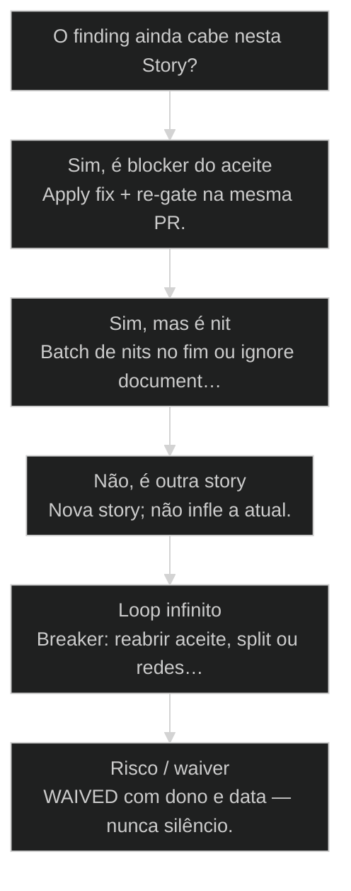
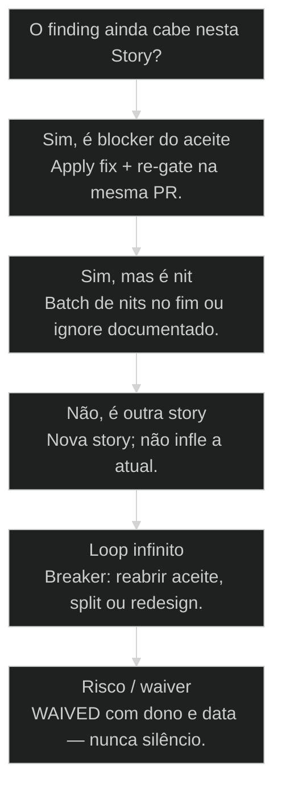

# [[Apply QA Fixes]] Loop: QA volta para Dev sem perder estado

Loop de correção: [[Apply QA Fixes]] e, quando o projeto tiver multi-engine, [[Self-heal]] com circuit breaker — sem autoaprovar.

## Mapa desta aula

Decisão-chave da aula — O finding ainda cabe nesta Story?

> Leia o diagrama antes do texto longo. Depois volte e confira.

> Feedback loop curto: findings viram correção na mesma Story, com contexto e evidência intactos.

**Objetivos de aprendizagem:**
- Listar os quatro pedaços de estado que o loop deve preservar (story, PR, aceite, evidência). _(remember)_
- Explicar o que significa preservar estado da Story no loop QA→Dev e por que issue zumbi mata autonomia. _(understand)_
- Operar um ciclo Apply QA Fixes: findings → classificar → patch → re-run gate. _(apply)_
- Identificar quando o loop deve parar (waiver, re-split, redesign ou bloqueio). _(analyze)_

---

## O que você consegue no fim desta aula

*G · Destino*

Destino claro antes de qualquer lista de findings.

Ao final desta aula você vai conseguir três coisas concretas:

1. Descrever o loop **fail → fix → re-gate** sem abrir issue zumbi.
2. Classificar findings em **block / major / nit / outra-story** com critério.
3. Acionar o **circuit breaker** quando o mesmo erro volta sem delta real.

Se você sair daqui ainda "abrindo 12 tickets e torcendo", a aula falhou.
Autonomia sem loop curto é fábrica de meia-calça com board bonito.

- **Objetivos da aula** (Preservar estado (story/PR/aceite/evidência); Operar um ciclo completo de fixes; Saber quando parar o loop)
- **Resultado tangível**: Um ciclo documentado: findings classificados, ordem de patch, critério de re-gate e breaker.
- **Não é o destino**: Zero findings pra sempre. É feedback curto com contexto intacto.

---

## A fábrica de issue zumbi

*P · Onde você está*

Empatia com o ponto de partida real do operador.

Cara, o pior anti-pattern de QA: achar 12 problemas, abrir 12 issues, Dev esquece
o contexto, story morre em "later". O board fica rico. O produto fica podre.

Apply QA Fixes é o oposto: o achado volta pro Dev **na mesma story**, com o
mesmo aceite, o mesmo PR, o mesmo thread de evidência. Feedback loop curto.

Se você está aqui, provavelmente já sentiu um destes sintomas:

- QG falhou, criaram ticket novo, a story original foi pra limbo.
- Mesmo finding volta três vezes e ninguém relê o aceite.
- Nits e blockers na mesma pilha — tudo "urgente" e nada priorizado.
- "Corrige depois" vira merge com dívida invisível.

Beleza. A partir daqui a gente troca limbo por **esteira**: o QG deixa de ser
muro e vira loop com estado.

No campo, essa esteira já tem nome de task. Quando a cohort perguntou se era
normal o QA devolver trabalho pro Dev, o Pedro respondeu sem cerimônia:

> **Pedro (aula-02 L2725)**: O QA é muito importante porque, cara, é o padrão de qualidade. Não tem jeito, e é normal, sim, ele voltar pro Dev às vezes. Os bugs do QA, ele passa o fix pro Dev. Sim, e tem uma task pra isso.

> **Pedro (aula-02 L2727-2731)**: Quando volta para o Dev, tem uma task que se chama Apply QA Fixes. Para o Dev, que está voltando do QA, pegar o Quality Gate que o QA criou e fazer os fixes do QA.

Voltar não é fracasso: é o padrão de qualidade funcionando. Fracasso é voltar
**sem** task, sem story e sem gate — é aí que nasce o zumbi.

**Onde a maioria trava**
- 12 findings → 12 issues zumbis
- Patch em branch paralela sem vínculo
- Re-gate sem saber o que mudou

**Onde o operador vai**
- Findings na mesma story/PR
- Classificar antes de patchar
- Delta explícito a cada ciclo

---

## O subprocesso que faz o SDC respirar

*S · Rota*

Invisível quando funciona. Fatal quando some.

O ciclo da story (aula 47) e o [[Quality Gate]] (aula 48) só fecham se existir um
subprocesso entre FAIL e o próximo PASS: **Apply QA Fixes**.

Sequência canônica:

findings → classificar (block/major/nit/outra) → patch na mesma trilha → re-run QG
→ PASS ou próximo ciclo → breaker se teimosia.

Prior-art: [[CodeRabbit]] (aula 06) joga findings no colo; o gate completo (48)
exige veredito; o [[Ciclo do Story|ciclo do story]] (10/47) exige estado. Este loop é a **costura**
entre os três — sem drama de "processo novo", com disciplina de não perder o fio.

Esse subprocesso não é invenção desta aula — ele está escrito na task do QG.
Na aula 01, o Pedro abriu o arquivo ao vivo e leu a máquina de decisão:

> **Pedro (aula-01 L2301-2303)**: O Quality Gate está ok? Sim, beleza: Story done. Não: feedback pra Dev, e ele vai executar uma outra task, que é o Apply QA Fixes.

> **Pedro (aula-01 L2325-2327)**: Ele vai passar por várias regrinhas determinísticas aqui de Story: se aquele Quality Gate passa, se tem concern, se fail, se ele vai ser waived — aí ele vai jogar ele pra um outro wave de desenvolvimento, não é agora.

E no T2 o loop aparece como workflow pronto, com o número de voltas já
parametrizado — o breaker vem de fábrica:

> **Adriano (t2-aula-2 L2857-2865)**: Eu tenho que fazer uma revisão de alguma coisa que preciso validar se está certo? QA Loop. Ele tem um processo de fazer cinco iterações. Ele vai e volta, vai e volta: testando e corrigindo, testando, corrigindo, testando, corrigindo.

A quantidade de iterações não é dogma: é configuração no core-config do
projeto — "é aqui que você configuraria a quantidade de iterações que você tem
do QA no workflow" [SOURCE: t2-aula-2 L2889-2893]. Cinco é o default de campo;
o princípio é que **existe um teto**. Loop sem teto é teimosia.

- **4**: pedaços de estado
- **↻**: loop até PASS ou breaker
- **0**: espaço pra limbo 'later'

- **status**: apply qa fixes
- **meta**: preserve=story+pr+aceite
- **meta**: loop=fail→fix→re-gate
- **meta**: fonte=aula-01+aula-02+aula-06+t2-aula-2
- **ready**: ready to loop

**Legenda de cores**

O que cada cor sinaliza nesta aula

- **Estado** (signal): o que não pode se perder entre ciclos
- **Finding** (insight): achado classificado, não novelinha
- **Delta** (bench): mudança desde o último FAIL
- **Re-gate** (action): prova de novo com evidência
- **Zumbi** (pain): trabalho expulso da story atual

**Como ler esta aula**

1. **Estado**: O que preservar a cada volta.
2. **Mecânica**: Coletar → priorizar → patch → re-gate.
3. **Breaker**: Quando parar com dignidade.
4. **Prática**: Simular um ciclo com classificação.

---

## Os quatro pedaços que não podem morrer

Preservar estado não é slogan — é checklist.

Estado a preservar a cada volta do loop:

1. **Story id + aceite** — o contrato não muda no meio sem cerimônia.
2. **Branch / PR** — correção no mesmo trilho, não fork sentimental.
3. **Findings** — lista priorizada, versionada, não novelinha no Slack.
4. **Evidência** — o que passou / o que ainda falha (log, screenshot, check).

Então o que acontece se você perde um pedaço? Perde o **porquê** do patch.
Dev corrige o sintoma que lembra. QA redescobre o mesmo buraco. O modelo
alucina contexto que existia no thread morto.

Olha só: "preservar estado" é o oposto de "abrir ticket e rezar". Ticket novo
só quando o finding é **outra story** de verdade — e aí você nomeia isso.

- **1. Contrato**: Story + aceite intactos (ou reabertura formal). [aceite]
- **2. Trilho**: Mesma branch/PR e lista de findings. [pr]
- **3. Prova**: Evidência do que ainda falha e o que já passou. [qg]

> **Issue zumbi é falha de processo**: Se o achado não cabe na story atual, ou a story está mal cortada, ou o achado é outro trabalho — nomeie. Não empurre pra limbo.

---

## Como o loop roda na prática

Classificar é metade do trabalho. Patch sem prioridade é teatro.

Loop canônico:

1. **Coletar** — QG, CodeRabbit, QA humano: lista única.
2. **Priorizar** — block → major → nit. Outra-story sai do loop atual.
3. **Patch** — Dev (ou agente Dev) corrige na mesma branch, blockers primeiro.
4. **Re-gate** — roda de novo; anota **delta** (o que mudou desde o FAIL).
5. **PASS** ou volta ao 2. **Breaker** se o mesmo finding volta 3x sem aprendizado.

Classificação que salva o time:

- **Block** — sem isso, done é mentira (aceite, segurança, teste do caminho).
- **Major** — qualidade séria, ainda na story, mas depois dos blocks.
- **Nit** — cosmético; batch no fim ou ignore documentado.
- **Outra story** — escopo novo disfarçado; não infle a atual.

Sem delta entre ciclos, não é loop — é **teimosia com git**.

**Loop canônico**

1. **Coletar**: QG/CR/QA listam findings numa lista só.
2. **Priorizar**: Blockers primeiro; nits no fim ou ignore com dono.
3. **Patch**: Dev corrige na mesma branch/PR.
4. **Re-gate**: Roda de novo com delta explícito.

- **Block**: Impede done honesto: aceite, segurança, caminho crítico.
- **Major**: Defeito sério ainda no escopo da story, não cosmético.
- **Nit**: Ajuste de qualidade menor; batch ou ignore com dono.
- **Delta**: O que mudou desde o último FAIL — prova de que o ciclo aprendeu.

> **Prior-art**: Aula 48 monta a coleira (QG). Aula 06 joga findings do CodeRabbit. Aula 47/10 guardam o estado da story. Este loop é a costura operacional entre FAIL e PASS.

---

## Caso de campo: o gate falhou ao vivo

Demo real da aula 06 — com tropeço, recovery e tudo que slide nenhum mostra.

Na aula 06, o Pedro rodou o Quality Gate ao vivo num story real do projeto dele.
Primeiro recado: o gate não termina no QA — termina na borda do repositório:

> **Pedro (aula-06 L563-571)**: Normalmente vocês estão terminando aqui, no Quality Assurance, provavelmente fechando Story e seguindo para o próximo. O meu fluxo aqui é sempre: Quality Assurance, DevOps create PR, faça o PR para o repositório, fecha o Story. Aí sim, eu sigo.

Minutos antes, revisando PRs abertos, o CI principal estava falhando enquanto o
outro passava. A leitura foi de operador, não de torcedor: "Não posso aprovar.
Eu tenho que unificar esses dois CIs" — evidência decide, não vontade de
mergear [SOURCE: aula-06 L547-553].

O story da vez estava "Ready for Review", com um detalhe fino: o executor do
gate era o **Architect**, não o QA, porque o story era de arquitetura, não só
de código — quem assina o gate depende do domínio do trabalho
[SOURCE: aula-06 L575-587]. O veredito veio no formato canônico:

> **Pedro (aula-06 L847-851)**: Gate PASS sempre vai vir assim: Gate PASS with concern. M1 deve ser corrigido antes do push. É uma inconsistência funcional entre o Gate. Recomendação: fix.

E aqui está o loop desta aula acontecendo em tempo real:

> **Pedro (aula-06 L851-861)**: Agora o que eu vou fazer para o fix? Vou chamar o DevOps de volta. Vou fazer igual o camarada falou ali: Apply QA Fixes. O que eu estou fazendo aqui? Depois do Review, o Quality Gate falhou. Feedback com fixes: aplica correções. É isso que eu estou fazendo.

No meio da demo, o bug de operador: ele aciona a skill errada, ri do próprio
tropeço — "dei mole, calma aí" — e reroda o comando certo. Instantes depois:
"Beleza, ele já fez o fix" [SOURCE: aula-06 L863-865, L885]. Nenhuma issue
aberta, nenhum ticket zumbi: finding, fix e re-gate na mesma story.

O recovery mais instrutivo veio depois: o gate saiu assinado pelo agente errado
(QA em vez de DevOps). Em vez de pânico, diagnóstico:

> **Pedro (aula-06 L919-931)**: Às vezes ele não muda a assinatura, porque não dá tempo dele reconhecer que ele mudou de agente. Ele lança como subagente, faz o que tem que fazer, volta para a janela principal e mantém aquele agente que estava trabalhando antes. Isso é um problema? Não sempre. Se você está trabalhando com documentação, você não está trabalhando com código — não é problema.

Tradução para o vocabulário desta aula: os quatro pedaços de estado (story, PR,
aceite, evidência) sobreviveram ao tropeço **e** à assinatura trocada — porque
o estado mora na story e no gate, não na memória do operador.

---

## Caso: o finding que voltou três vezes

Quando patch cosmético mascara design errado.

Story: "fallback se API de dica cair no passo 2". FAIL 1: tela branca. Patch:
try/catch que engole o erro. FAIL 2: usuário fica preso sem UI. Patch: toast
genérico. FAIL 3: toast existe, mas o fluxo não deixa seguir o onboarding.

Três ciclos, zero reler de aceite. O aceite pedia **continuar o fluxo** com
fallback — não "não crashar". O loop saudável no ciclo 2 já teria:

- classificado como **block de aceite** (não nit de UX);
- forçado reabrir a implementação do caminho alternativo;
- ou **breaker**: se o design da story está torto, split/redesign, não maquiagem.

Então o que acontece sem breaker? Você industrializa o puxadinho **dentro** do
QG — a coleira vira coleira de enfeite com mais commits.

O T2 dá nome à causa raiz desse padrão. Quando alguém reclama que "pede pra
corrigir e não corrige", o Adriano aponta para o contrato, não para o modelo:

> **Adriano (t2-aula-2 L969-985)**: A importância de validar uma Story, quais são as etapas da Story, os Gates da Story — não está olhando para nada disso. E aí está olhando que a solução está quebrando. "Eu estou pedindo para me corrigir, mas não corrige." Por que está quebrando? Porque a Story tem ambiguidades. Tem checklist, tem critérios de aceitação, tem alguma coisa ali que está invalidando: coisa mal feita, coisa porca.

Terceiro FAIL seguido raramente é azar. Quase sempre é aceite ambíguo — e patch
nenhum conserta contrato torto. Breaker: reler a story antes do quarto ciclo.

**Loop com breaker**

1. **FAIL**: Findings + evidência
2. **Classificar**: Block/major/nit/outra
3. **Patch**: Mesma PR
4. **Re-gate**: Delta explícito
5. **PASS|Break**: Fechar ou redesenhar

- **Loop curto** != **Teimosia**: Loop tem delta e classificação; teimosia repete o mesmo patch.
- **Outra story** != **Debt escondida**: Se saiu do aceite, nomeie story nova — não 'depois'.

---

## Continuar o loop ou parar?

Escopo do aceite é a cerca.

**Árvore de decisão**
_Escopo do aceite é a cerca — não a urgência do comment._

- **Sim, é blocker do aceite** — Sem isso, done é mentira.
  → _Apply fix + re-gate na mesma PR._
  Ex.: Teste do caminho feliz falha.
- **Sim, mas é nit** — Qualidade, não correção de contrato.
  → _Batch de nits no fim ou ignore documentado._
  Ex.: Nome de variável feio.
- **Não, é outra story** — Escopo novo disfarçado de finding.
  → _Nova story; não infle a atual._
  Ex.: Refator de módulo inteiro no meio do botão.
- **Loop infinito** — Mesmo erro 3x sem delta real.
  → _Breaker: reabrir aceite, split ou redesign._
  Ex.: Flaky + patch cosmético eterno.
- **Risco / waiver** — Não dá pra fixar agora, mas o risco é conhecido.
  → _WAIVED com dono e data — nunca silêncio._
  Ex.: Check flaky catalogado; merge com flag.

Duas dessas rotas apareceram ao vivo no T2, com a régua explícita. O bloqueio
por escopo inventado:

> **Adriano (t2-aula-2 L2397-2409)**: Você pediu para exportar CSV, só que veio junto exportar PDF. Vai travar na hora de passar no Gate. Ele vai travar e vai dizer: isso é negociável? Se tiver não negociável, não adianta, vai ter que corrigir. Não está especificado o que pode e o que não pode fazer? Esquece, não vai passar no Gate.

E a saída honesta quando não dá pra corrigir agora:

> **Adriano (t2-aula-2 L2421-2433)**: Você pode permitir passar, mas você tem que dar uma justificativa. Isso se chama waiver. Ele vai documentar isso, e num determinado momento, se precisar voltar, alguém vai saber — ou todo mundo vai saber — o porquê que tem o PDF junto ali. Porque foi documentado. Seria uma exceção: eu abro uma exceção, pode passar, mas tem que ter documentação.

**Gate:** Você sabe o número do ciclo e o que mudou desde o último FAIL? — _Sem delta, não é loop — é teimosia._

#### Loop saudável
Curto e com delta.
1. **Findings: Lista única classificada.
2. **Patch: Blockers na mesma PR.
3. **Re-gate: Evidência do delta.
4. **PASS: Fecha a borda da story.

#### Breaker
Parar com dignidade.
1. **3x mesmo fail: Sem aprendizado.
2. **Reler aceite: Contrato ainda faz sentido?
3. **Split ou redesign: Não maquiar.
4. **Nova rota: Story nova ou arquitetura.

#### Exportar trabalho
Quando não é desta story.
1. **Nomear: Finding = outra unidade.
2. **Criar story: Com aceite próprio.
3. **Não bloquear: Só se for risco real.
4. **Seguir QG: Story atual fecha o que é dela.

---

## Simule um ciclo (15 min)

Findings reais ou inventados com honestidade.

Vamos lá. Sem isso a aula vira podcast. Usa findings reais de uma PR ou inventa
cinco achados críveis de uma feature que você conhece.

- 1. **Findings**: Liste 5 achados (reais ou simulados) de uma PR.
- 2. **Classifique**: block / major / nit / outra-story para cada um.
- 3. **Ordem**: Escreva a ordem de patch e o que fica de fora desta story.
- 4. **Re-gate**: Defina o critério de PASS do próximo ciclo (uma frase).
- 5. **Breaker**: Escreva a condição de parada (ex.: 3x mesmo block).

**Funcionou se:**

- Nenhum blocker virou 'depois' sem justificativa.
- Pelo menos um item foi marcado como outra story ou nit com dono.
- Há critério explícito de re-gate e de parada do loop.
- Você sabe quais 4 pedaços de estado preservaria nesse ciclo.

---

## Da cohort: quem fecha o loop também tropeça

*T1 · aulas 01, 02 e 06*

Realidade do grupo Advanced — não é slide, é cicatriz.

**Chamar o agente certo para o fix.** Na aula 06, o Gaston chamou o Master para
uma tarefa de repositório e descobriu na prática que o loop de fixes tem dono:

> **Gaston (aula-06 L693)**: A gente acha que porque ele é o manda-chuva de todo mundo, ele vai fazer tudo e sabe tudo. E não é verdade. Isso é um puta aprendizado que eu estou tendo agora.

**CodeRabbit em dois momentos.** O Marcus perguntou se o certo era usar o CLI ou
o app do GitHub [SOURCE: aula-06 L1091]. Resposta: os dois, porque atacam pontos
diferentes do loop:

> **Pedro (aula-06 L1131-1143)**: O CLI vai funcionar durante o development cycle workflow, fazendo o self-healing, e na parte de Review do QA. O do GitHub vai funcionar nos PRs, no GitHub Action. São formas diferentes de usar o CodeRabbit, e eu uso todas elas. Para quê? Para proteger o máximo possível da entropia e da alucinação.

**Self-heal é o piso, não o teto.** Antes de qualquer Apply QA Fixes, o agente
revisa o próprio trabalho — e isso nem aparece na tela:

> **Pedro (aula-01 L2285-2289)**: Isso aqui vocês não veem acontecer, isso é silencioso. O self-heal pra mim é o mínimo. Se eu estou trabalhando com inteligência artificial e com automação, o self-heal para mim é o mínimo. É o cara revisando o seu próprio trabalho e não deixando passar erro ortográfico.

**Automatizar o loop, sim — autoaprovar, não.** O Alan mostrou uma skill que
roda o ciclo inteiro sozinha ("daí chama o Quality Assurance, daí ele faz a
avaliação; se não passar, ele volta sozinho para o Dev") e perguntou se podia
distribuir para a turma. O Pedro travou o gate humano
[SOURCE: aula-02 L2747-2757]:

> **Pedro (aula-02 L2751-2757)**: Eu não deixo. É pra proteção de vocês: vocês têm que passar um pouco pelos comandos primeiro.

É a mesma regra do topo desta aula: loop curto com estado, sem autoaprovar.
Primeiro você opera o ciclo na mão até classificar finding de olho fechado; só
depois deixa o workflow girar sozinho.

---

## Glossário sem jargão de vaidade

- **Apply QA Fixes**: Subprocesso que devolve findings ao Dev na mesma story/PR até re-gate.
- **Estado preservado**: Story, aceite, PR, findings e evidência intactos entre ciclos.
- **Issue zumbi**: Trabalho expulso da story atual para limbo de tickets sem contexto.
- **Circuit breaker**: Parada deliberada do loop após repetição sem aprendizado.
- **Delta**: Mudança observável desde o último FAIL — prova de progresso do ciclo.
- **Feedback loop curto**: Tempo mínimo entre achado e correção com contexto ainda quente.

---

## Portão da aula

Você passou quando opera QA→Dev sem perder story, PR e evidência — e sabe quando
o loop deve virar breaker. Feedback curto é o oxigênio da autonomia.

A IA é a seta. O X é seu — inclusive **não abrir limbo** só pra board ficar limpo.

> **Trilha M3 neste bloco**: Órbitas (45) → etapas (46) → ciclo story (47) → QG (48) → este loop (49). Daqui o trilho de repo/CI continua a amarrar a infraestrutura.

> **GATE-MODULE (auto)**: GPS Goal/Position/Steps presentes · caso + do/dont · decisão · prática com evidência · glossário. Alvo DL ≥70 atingido na construção enrich-W1.

***

---

## Navegação

← [[aulas/48-quality-gate-completo|Quality Gate: QA + Apply QA Fixes + CodeRabbit]] · ↑ [[modulos/Módulo 2 - SDC e Qualidade|M2 — SDC e qualidade]] · ⌂ [[cursos/AIOX Advanced/README|Curso]] · → [[aulas/11-goal-vs-loop|Goal vs Loop]]
