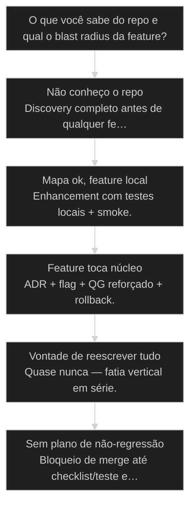
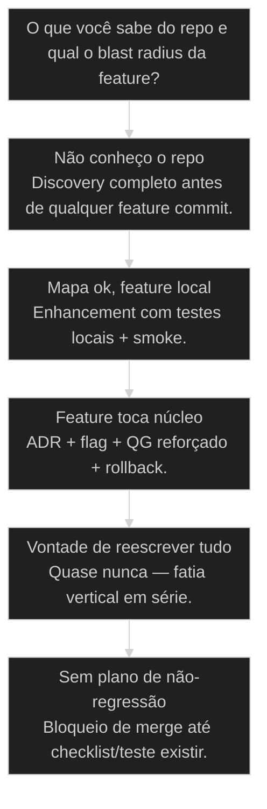

# [[Brownfield Enhancement]]: como adicionar feature em código legado

## Mapa desta aula

Decisão-chave da aula — O que você sabe do repo e qual o blast radius da feature?

> Leia o diagrama antes do texto longo. Depois volte e confira.

> Adicionar sem quebrar — discovery primeiro, enhancement depois. Menor diff com prova de não-regressão.

**Objetivos de aprendizagem:**
- Separar discovery de enhancement e listar o que cada fase produz. _(remember)_
- Explicar por que enhancement sem mapa é o anti-padrão do 'só mais um endpoint'. _(understand)_
- Montar um plano de enhancement com menor diff, superfície tocada e evidência de não-regressão. _(apply)_
- Classificar risco (local vs núcleo) e escolher flag, ADR e QG reforçado quando couber. _(analyze)_

---

## O que você consegue no fim desta aula

*G · Destino*

Destino claro antes de qualquer 'só mais um endpoint'.

Ao final desta aula você vai conseguir três coisas concretas:

1. Separar **discovery** (decifrar) de **enhancement** (implementar).
2. Desenhar o **menor diff** que entrega valor com módulos nomeados.
3. Definir **evidência de não-regressão** antes do merge — não fé.

Se você sair daqui ainda reescrevendo o monólito porque "está feio", a aula
falhou. Brownfield não é xingamento. É a casa onde o cliente já mora.

- **Objetivos da aula** (Discovery antes de codar feature; Plano de fatia com risco classificado; Prova de não-regressão no merge)
- **Resultado tangível**: Plano de enhancement: módulos tocados, diff mínimo, flag/QG, checklist de regressão.
- **Não é o destino**: Big bang rewrite por tédio técnico. Quase nunca é o path.

---

## O fio que apaga o corredor

*P · Onde você está*

Empatia com o endpoint inocente que derruba a casa.

Cara, brownfield não é xingamento — é a realidade. O código já roda, já tem
cliente, já tem dívida, já tem ritual de deploy que ninguém documentou. Enhancement
é a arte de colocar feature nova **sem derrubar a casa**.

O erro clássico: pular discovery e "só mais um endpoint". Depois o endpoint puxa
um fio e apaga a luz do corredor inteiro — auth compartilhado, cache sujo,
job noturno que ninguém lembrava.

Se você está aqui, provavelmente já sentiu um destes sintomas:

- Feature "pequena" tocou billing e virou incidente.
- Rewrite em paralelo que nunca migrou o tráfego.
- Testes só do caminho novo; regressão no antigo.
- Discovery existiu no slide e morreu no primeiro PR.

Beleza. A partir daqui: **mapa → fatia → prova**. Nessa ordem.

**Onde a maioria trava**
- Codar feature sem mapa de dependências
- Big bang rewrite por nojo do legado
- Merge sem prova de não-regressão

**Onde o operador vai**
- Discovery com módulos e donos de risco
- Fatia vertical com flag se precisar
- Checklist/teste/canary antes de confiar

---

## Discovery decifra. Enhancement implementa.

*S · Rota*

Duas fases. Uma ordem. Zero romance de greenfield no meio.

Prior-art: [[Brownfield Discovery|brownfield discovery]] (31), design system greenfield/brownfield (32),
code anatomy (38). Esta aula é a **costura operacional**: como você adiciona
valor depois que o mapa existe — e o que fazer se o mapa ainda não existe.

Sequência canônica:

mapa (o que existe, quem depende, onde dói) → plano (menor superfície) →
implementação na fatia → evidência de não-regressão → merge/canary.

Metáfora: reforma de prédio ocupado. Você não derruba a estrutura pra trocar
a pia. Você corta água do banheiro certo, troca, testa, devolve a chave.

Isso não é teoria de slide. Na cohort, o Pedro nomeou exatamente essa
fronteira quando alguém perguntou se o Brownfield Discovery servia para tudo:

> **Pedro Valério (aula-01 L1589)**: E enhancement isolado também? Não, porque enhancement isolado tem um outro workflow. E o que é o enhancement isolado?

> **Pedro Valério (aula-01 L1591-1593)**: Você tem um projeto que já está desenvolvendo. E você quer fazer um novo épico naquele mesmo projeto.

Discovery serve pra migração de projeto que veio do Lovable, Bolt ou V0 e
pra auditoria completa de codebase [SOURCE: aula-01 L1579-1581]. Enhancement
isolado adiciona um épico novo num projeto que você já conhece. Dois
workflows, duas rodinhas — e o Alan mostrou os dois rodando ao vivo na mesma
aula: "é um processo de Brownfield Discovery, é um processo de Brownfield
Enhancement" [SOURCE: aula-01 L1713].

- **2**: fases (discovery → enhance)
- **1**: menor diff que vale
- **0**: espaço pra fé no merge

- **status**: brownfield enhance
- **meta**: discovery→plano→diff
- **meta**: prova=nao-regressao
- **meta**: fonte=aula-01 + aula-02 + aula-06 + t2-aula-4
- **ready**: ready to map

**Legenda de cores**

O que cada cor sinaliza nesta aula

- **Discovery** (signal): decifrar o sistema vivo
- **Enhancement** (insight): feature na menor superfície
- **Risco** (bench): local vs núcleo (auth/billing/schema)
- **Prova** (action): teste, checklist, flag, canary
- **Big bang** (pain): rewrite que finge ser enhancement

**Como ler esta aula**

1. **Duas fases**: Discovery vs enhancement.
2. **Superfície**: Menor diff e classificação de risco.
3. **Caso**: O endpoint que apagou o corredor.
4. **Plano**: Seu legado, sua fatia.

---

## Discovery → Enhancement (sem misturar)

Se misturar, o mapa vira post-it e o diff vira surpresa.

**Discovery** responde: o que existe, quem depende, onde dói, quais invariantes.
Artefatos típicos: mapa de módulos, fluxos críticos, lista de riscos, "não
mexa aqui sem ADR".

**Enhancement** responde: qual o menor caminho pra valor, o que muda, o que
**não** muda, como provar que o resto ficou de pé.

Então o que acontece se você "descobre enquanto implementa"? Você descobre no
prod. O PR vira arqueologia. O QG testa o que o Dev lembrou, não o que o
sistema exige.

Olha só: discovery não precisa ser monografia. Pode ser meia manhã. Precisa
ser **antes** do primeiro commit da feature — ou o commit admite que é
exploração e não entrega.

E onde entra o PRD nisso? A cohort tropeçou exatamente aqui. O instinto de
quem chega é criar um PRD novo para cada feature — e o Pedro cortou esse
hábito na raiz:

> **Pedro Valério (aula-01 L3407-3409)**: Normalmente isso é uma versão um pouco errada. Você não fica criando PRD toda hora. Você cria um grande PRD de início, e depois você vai fazendo enhancement naquilo.

> **Pedro Valério (aula-01 L3411-3413)**: E normalmente os enhancements são divididos em algumas variáveis. Podem ser uma new feature, alguma coisa nova que vai se acoplar naquele projeto. Um enhancement, uma melhoria de algo que já existe. Ou é um bug fix, alguma coisa que está quebrada.

O próprio Alan admitiu no ar que operava errado — e que o erro nem doía na
hora:

> **Alan Nicolas (aula-01 L1749-1751)**: Eu erroneamente, até hoje, fazia muitos PRDs para features. E funciona. O mais louco é isso. Funciona. Só que daí eu descobri: não é a melhor forma, porque daí eu não crio o backlog de dados. Eu não estava criando os históricos da forma correta para o Bob ficar trabalhando sem parar.

Guarda essa: PRD demais funciona hoje e cobra caro depois. Um grande PRD de
início vira a constituição do produto; cada enhancement entra como new
feature, melhoria ou bug fix — com o histórico ligado no backlog, não num
documento órfão.

- **1. Mapa**: Módulos, deps, fluxos críticos, donos de risco. [discovery]
- **2. Plano**: Fatia, superfície, flag, critérios de aceite. [design]
- **3. Prova**: Testes, checklist, canary, rollback mental. [merge]

> **Lei do brownfield**: Enhancement implementa; discovery decifra. Inverter a ordem é fechar o olho no volante.

- **Explorar no PR** != **Entregar no PR**: Exploração é discovery com label; entrega exige mapa e prova.
- **Refator cosmético** != **Enhancement**: Beleza de código sem valor de produto não é a feature — é dívida opcional.

---

## Menor superfície e prova de não-regressão

Risco classificado. Merge com evidência.

Classifique o toque da feature:

- **Local** — form, campo, endpoint isolado, UI contida. Diff pequeno + testes do módulo.
- **Núcleo** — auth, billing, schema compartilhado, jobs globais. ADR + flag + QG reforçado.
- **Transversal** — logging, middleware, design tokens. Impacto em leque; canary e checklist.

Evidência de não-regressão (escolha o kit, não a fé):

1. Testes automatizados do caminho antigo que a feature pode quebrar.
2. Checklist manual dos fluxos críticos (login, pagamento, job).
3. Feature flag / dark launch quando o núcleo treme.
4. Canary ou % de tráfego quando o blast radius é grande.

Sem pelo menos um item honesto na lista, merge é torcida. Cara, torcida não
é processo.

Na operação da cohort, essa classificação de toque começa numa pergunta que
o próprio workflow faz na elicitação: essa feature precisa de mudança no
banco de dados? Se sim, chama o Data Engineer; se precisa de API, chama o
DevOps [SOURCE: aula-01 L3547-3549]. O agente não adivinha o blast radius —
ele pergunta e analisa:

> **Pedro Valério (aula-06 L1743)**: Ele vai analisar o projeto e vai fazer exatamente o que você perguntou, que é uma análise de desenvolvimento incremental: entender tudo que existe e qual é o próximo passo que ele tem que dar. Ou ele tem que atualizar alguma coisa que já existe, ou criar uma coisa nova.

E quando o sistema já tem gente usando, a prova de não-regressão ganha um
degrau físico: a branch. O Klaus descreveu isso na mentoria, com um sistema
dele que roda em produção:

> **Klaus Deor (t2-aula-4 L2641)**: Ele está em desenvolvimento, ele está em produção, o pessoal já utiliza. E toda vez que eu quero subir uma atualização para ele, o ideal seria subir para uma branch, porque ele não vai fazer o deploy automático. Ele só vai atualizar quando eu fizer o merge, quando juntar uma na outra.

Branch mais merge manual é a versão artesanal do dark launch: o código novo
existe, versiona, é revisável — e o usuário só encontra quando você decide
juntar.

**Risco × kit mínimo**

- **Local**: Testes do módulo + smoke do fluxo
- **Núcleo**: ADR + flag + QG reforçado + rollback
- **Transversal**: Canary + checklist de consumidores
- **Rewrite total**: Quase nunca — fatia vertical em série

- **Menor superfície**: Menor conjunto de arquivos/módulos que ainda entrega o valor.
- **Não-regressão**: Evidência de que caminhos antigos continuam válidos.
- **Fatia vertical**: Corte fino que entrega valor end-to-end sem big bang.
- **Blast radius**: Quão longe a falha se propaga se o enhancement quebrar.

> **Prior-art**: Discovery (31) e code anatomy (38) alimentam o mapa. QG e apply-fixes (48–49) fecham a prova. Esta aula amarra o plano de feature em legado.

---

## Caso: o endpoint que apagou o corredor

Feature 'pequena' sem mapa de cache e job.

Pedido: "campo de prioridade no ticket". Dev adiciona coluna, endpoint PATCH,
form. Sem discovery. Merge sexta.

Sábado: job de SLA lia `priority` de um enum antigo em cache Redis. Tickets
VIP caíram pra fila normal. Suporte pegou fogo. Ninguém tinha mapeado o
consumidor do campo.

Enhancement certo teria:

1. Discovery: quem lê `priority`? (API, job, cache, relatório)
2. Plano: migrar enum com default + dual-read se precisar
3. Teste do job de SLA no QG
4. Flag ou deploy em horário com on-call

Diff ainda era pequeno. A diferença foi o **mapa**. Não o talento do Dev.

Então o que acontece no big bang? O time propõe "reescrever o módulo de
tickets". Três meses. Feature de prioridade ainda não existe. Cliente foi
embora. Fatia vertical batia big bang.

Esse caso é didático — mas a cohort viveu a versão em miniatura dele ao
vivo, e ficou registrado. O Alan pulou o processo de story numa mudança
"pequena", fez um handoff informal, e a regressão apareceu pelo grupo:

> **Alan Nicolas (aula-02 L2985)**: Teve alguém que mandou uma mensagem lá no grupo e falou: Alan, tu deixou o README com os agentes antigos. Se eu tivesse feito um story, não tinha acontecido aquilo. Dá pra ver que ficou aquele erro lá porque eu não fiz um story. Eu fiz um handoff.

Mesma anatomia do endpoint da sexta: mudança pequena, atalho no processo,
consumidor esquecido — só que aqui o consumidor era o README e quem pagou
foi a documentação, não o billing. O Pedro fechou o princípio na mesma
conversa: sempre que sentir falta de alguma coisa no processo, é porque está
faltando uma task, um workflow, um checklist — cria uma vez e nunca mais faz
na mão, igual botão que vira componente [SOURCE: aula-02 L2979-2981].

**Enhancement com mapa**

1. **Mapa**: Consumidores do campo
2. **Plano**: Menor diff + migração
3. **Diff**: Feature na fatia
4. **Prova**: Job + API + UI
5. **Ship**: Flag/canary se núcleo

**Sexta sem mapa**
- PATCH + coluna e torcida
- Teste só do form novo
- Rewrite do módulo 'já que estamos'

**Enhancement adulto**
- Lista de consumidores
- Teste do job legado
- Diff mínimo com valor entregue

---

## Qual caminho de enhancement?

Mapa e blast radius mandam.

**Árvore de decisão**
_Desconhecimento força discovery; núcleo força cerimônia._

- **Não conheço o repo** — Primeira vez no código ou mapa velho.
  → _Discovery completo antes de qualquer feature commit._
  Ex.: Cliente entregou zip; sem docs.
- **Mapa ok, feature local** — Impacto contido num módulo.
  → _Enhancement com testes locais + smoke._
  Ex.: Novo campo em form isolado.
- **Feature toca núcleo** — Auth, billing, schema compartilhado, jobs globais.
  → _ADR + flag + QG reforçado + rollback._
  Ex.: Mudar modelo de permissão.
- **Vontade de reescrever tudo** — Nojo do legado, não restrição real.
  → _Quase nunca — fatia vertical em série._
  Ex.: Big bang rewrite 'só pra ficar limpo'.
- **Sem plano de não-regressão** — Ninguém sabe como provar o antigo.
  → _Bloqueio de merge até checklist/teste existir._
  Ex.: PR verde só no caminho novo.

Quem dimensiona a fatia na cohort não é o Dev empolgado — é o PM. Mais de
oito tasks já não cabe num story; mudancinha entra como story num épico que
já existe; tema sem épico nenhum ganha épico novo. "Quem faz essa decisão é
o PM" [SOURCE: aula-02 L3173-3193]. O Pedro descreveu a regra viva:

> **Pedro Valério (aula-02 L3183)**: Então eu engordo um pouquinho o story para ele fazer em um só e não precisar criar um épico, e ele adicionar aquele story num épico já existente.

E quando você ainda não sabe o que a mudança toca, existe um tipo de story
exatamente para isso:

> **Pedro Valério (aula-02 L2961-2965)**: Eu até criei tipos de stories diferentes. Tem story de feature, tem story de desenvolvimento. Brownfield tem stories de investigação. Então tem tipos de stories diferentes que ele vai usar templates diferentes também. Por exemplo, stories de investigação de documentação não precisam de CodeRabbit.

Story de investigação é o discovery com label, do jeito que esta aula pediu:
exploração declarada, template próprio, sem fingir que é entrega.

**Gate:** Você nomeia módulos tocados e a prova de não-regressão em uma frase cada? — _Se não nomeia, ainda é 'só mais um endpoint'._

#### Seguro (núcleo)
Legado crítico.
1. **Discovery: Mapa e consumidores.
2. **Fatia: Menor valor vertical.
3. **Flag: Dark launch se preciso.
4. **QG+canary: Prova e blast controlado.

#### Rápido contido
Baixo risco local.
1. **Mapa mínimo: Módulo e deps diretas.
2. **Diff pequeno: Sem refator de passeio.
3. **Teste: Caminho novo e vizinho.
4. **Merge: Com smoke do fluxo.

#### Anti big bang
Quando a tentação bate.
1. **Nomear valor: O que o cliente ganha agora.
2. **Cortar fatia: Uma vertical só.
3. **Entregar: Prova e ship.
4. **Repetir: Próxima fatia, não monólito novo.

---

## Plano de enhancement (15 min)

Repo legado seu — ou um monólito que você conhece.

Vamos lá. Sem isso a aula vira podcast. Escolhe uma feature real que você
colocaria (ou colocou) em legado.

- 1. **Repo**: Escolha um legado seu (ou conhecido) e uma feature.
- 2. **Mapa**: Liste 3 módulos/consumidores que a feature toca.
- 3. **Risco**: Classifique local / núcleo / transversal em uma linha.
- 4. **Diff**: Descreva o menor diff que ainda entrega valor.
- 5. **Prova**: Defina evidência de não-regressão (teste, checklist, flag).

**Funcionou se:**

- Há mapa com pelo menos 3 pontos de toque nomeados.
- Risco está classificado e o kit de prova combina com o risco.
- O plano de diff não é rewrite disfarçado.
- Você sabe o anti-padrão: endpoint sem mapa e merge na fé.

---

## Glossário sem jargão de vaidade

- **Brownfield**: Sistema já em produção com história, dívida e clientes reais.
- **Discovery**: Fase de decifrar o que existe, depende e dói — antes de implementar.
- **Enhancement**: Adição de valor em sistema existente com superfície controlada.
- **Não-regressão**: Evidência de que comportamentos antigos críticos seguem válidos.
- **Fatia vertical**: Entrega fina end-to-end em vez de rewrite horizontal total.
- **Blast radius**: Alcance do dano se a mudança falhar em produção.

---

## Da cohort: enhancement é rotina, não evento

*T1 · aula-01 + aula-02 + aula-06 · T2 · t2-aula-4*

Na operação real do grupo, enhancement não é cerimônia especial — é o jeito
default de tocar um sistema vivo, épico após épico:

> **Pedro Valério (aula-06 L1761-1763)**: Se você for olhar aqui nos meus épicos, só nesse projeto, eu estou no épico quarenta. Por quê? Eu não faço nada sem ele.

A sequência que ele descreveu na aula-06 é a rota desta aula com nome de
agente: depois do Brownfield PRD, dos code standards e dos invariantes,
todo enhancement entra por Analyze Project → épico → PM → SM → stories
[SOURCE: aula-06 L1751-1759]. E o mapa não serve só pra reagir a pedido de
cliente — dá pra minerar enhancement no próprio repo:

> **Pedro Valério (aula-01 L3555)**: Ele vai fazer a análise geral, pegando todos os documentos principais, e tentar reconhecer novas features e enhancements que esse projeto precisa. Então às vezes até vale fazer esse scan — vai que você não está nem olhando para uma coisa que poderia ser melhorada.

> **Pedro Valério (aula-01 L3451)**: Então, aqui no Analyze Project, ele vai estar analisando toda essa estrutura para entender como eu adiciono uma coisa nisso, ou como eu faço uma melhoria nisso.

O ritmo é Kaizen, não big bang — quando um aluno trouxe a ideia de
transformação total, a resposta foi:

> **Pedro Valério (aula-06 L4155)**: Isso aí, Carlos. Em transformação incremental. Uma melhoria por vez.

E sobre automatizar o ciclo inteiro: o Alan mostrou uma skill que roda
story → valid draft → Dev → QA sozinha, com loop de correção — e o Pedro
vetou distribuir na hora: "vocês têm que passar um pouco pelos comandos
primeiro", porque sem conhecer cada etapa "vocês não vão conseguir reparar
se ele realmente está executando todas as etapas numa skill"
[SOURCE: aula-02 L2743-2765]. Prova de não-regressão vale também pro seu
processo: só automatize o portão que você sabe fiscalizar.

> **Nota de curadoria**: "Brownfield Enhancement" como nome de processo aparece uma única vez nas transcrições, na demo ao vivo do Alan [SOURCE: aula-01 L1713]; o lastro operacional desta aula vem do workflow de "enhancement isolado" e da disciplina PRD + enhancements. O caso do endpoint que apagou o corredor e a régua local/núcleo/transversal são elaborações didáticas do curso, sem âncora direta de transcrição.

---

## Portão da aula

Você passou quando enhancement só começa depois do mapa e o merge só acontece
com prova de não-regressão. Reformar prédio ocupado exige corte certo, não dinamite.

A IA é a seta. O X é seu — inclusive recusar o big bang e exigir o checklist.

> **Próximo na trilha**: Antes de criar peça nova no ecossistema, a aula 54 (REUSE > ADAPT > CREATE) corta o NIH na raiz.

> **GATE-MODULE (auto)**: GPS Goal/Position/Steps presentes · caso + do/dont · decisão · prática com evidência · glossário. Alvo DL ≥70 atingido na construção enrich-W2.

***

---

## Operar isto na prática

Esta aula é pré-requisito no curso de squads — quando a missão for real, siga para: Code Anatomist: `cursos/AIOX-Advanced-Squads/aulas/03-code-anatomist.md` · Domain Decoder: `cursos/AIOX-Advanced-Squads/aulas/04-domain-decoder.md` · DB Sage: `cursos/AIOX-Advanced-Squads/aulas/11-db-sage.md`

## Navegação

← [[aulas/31-brownfield-discovery|Brownfield Discovery: entrar num projeto que já existe]] · ↑ [[modulos/Módulo 4 - Método e Brownfield|M4 — Método e brownfield]] · ⌂ [[cursos/AIOX Advanced/README|Curso]] · → [[aulas/44-metodo-s2s|Método S2S: converter sinais em sistemas]]
