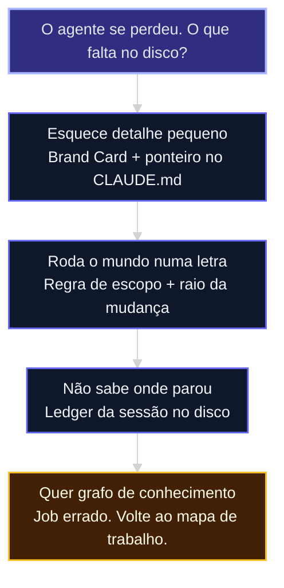
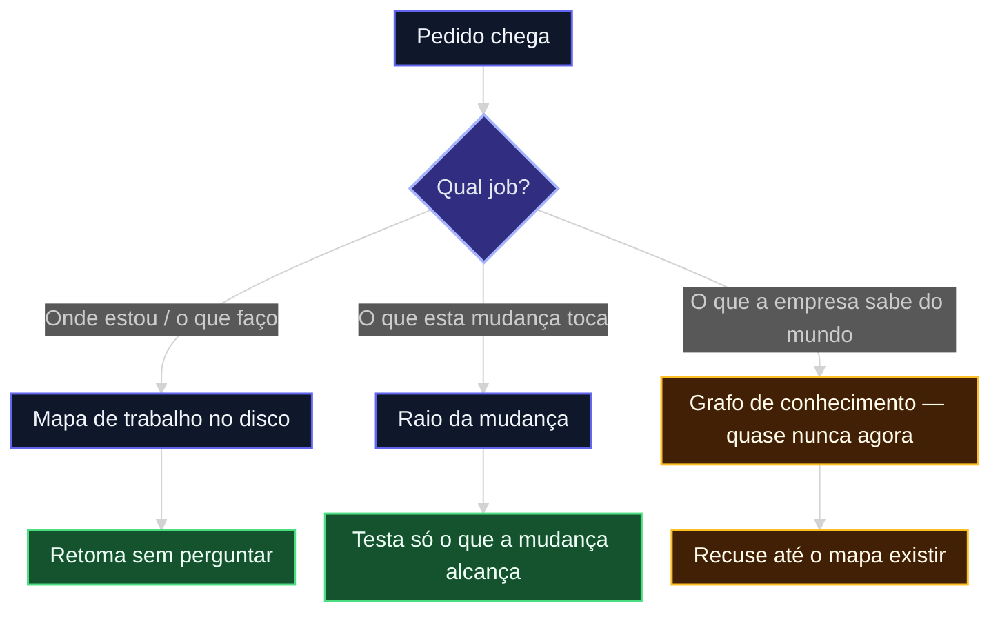
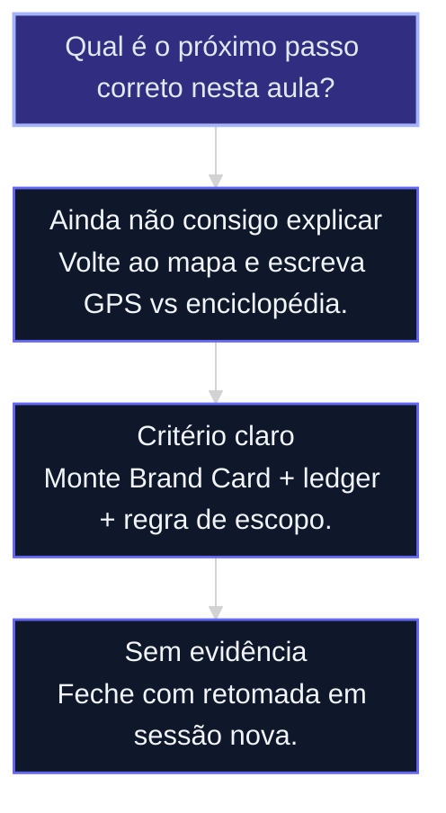

# Orientação do agente: mapa de trabalho, não grafo de conhecimento

↑ [[modulos/Módulo 1 - Sistema e Contexto|M1]] · ⌂ [[cursos/AIOX Advanced/README|Curso]] · → [[aulas/06-code-rabbit-boost|Code Rabbit Boost]]

## Resultado

Ao final desta aula você consegue distinguir **GPS de enciclopédia**, montar o mapa de trabalho no disco e provar que o agente retoma sem perguntar “o que estávamos fazendo?”.

## Conceitos

- [[Orientação do Agente]]
- [[Engenharia de Contexto]]
- [[Janela de Contexto]]
- [[CLAUDE md|CLAUDE.md]]
- [[Goal vs Loop]]

## Mapa desta aula

Decisão-chave da aula — O agente se perdeu. O que falta no disco?



> Leia o diagrama antes do texto longo. Depois volte e confira.

> O agente não se perde porque “falta memória”. Ele se perde porque a conversa virou a fonte da verdade. Compactou, esqueceu o tom da marca e, no mesmo sopro, tratou “muda uma letra” como “roda o mundo”.

**Objetivos de aprendizagem:**
- Separar três jobs que a turma mistura: orientação, escopo e conhecimento. _(understand)_
- Explicar por que grafo de conhecimento não resolve marca esquecida nem suíte disparada. _(understand)_
- Montar o mapa de trabalho em cinco arquivos magros no disco. _(apply)_
- Escrever a regra de escopo que impede rebuild completo em mudança cosmética. _(apply)_
- Avaliar se o projeto precisa de grafo de código — e recusar grafo de conhecimento cedo demais. _(evaluate)_

---

## O que você consegue no fim desta aula

*G · Destino*

Você sai com um **mapa de trabalho** no repositório — não com um banco de grafos. O agente, a cada turno, consegue responder quatro linhas sem vasculhar o chat.

- **Destino**: o agente sabe onde está, o que está fazendo, o que já está decidido e qual o raio da mudança.
- **Como saber que chegou**: você mata o terminal, abre outro, e ele retoma em menos de um minuto sem perguntar o que estava em curso.

---

## O problema de campo (dois sintomas, dois jobs)

Na cohort isso chega misturado. Parece um único bug — “a LLM se perde”. Não é.

| Sintoma | O que a pessoa sente | Job real |
|---|---|---|
| **Detalhe pequeno some** | Tom, posicionamento, restrição de marca já estavam no repo. O agente escreve como se nunca tivesse lido. | A verdade não está no **hot path**. Está num PDF, num doc longo ou no chat. Depois da [[Compaction]], some. |
| **Queima token e tempo** | Pedido cosmética. O agente roda suíte inteira, build, e2e. Duas horas depois, para. | Não há **contrato de escopo**. Sem raio da mudança, “muda uma letra” = “rebuild o mundo”. |

Trocar de modelo pode piorar o segundo. Não cura o primeiro. O primeiro é [[Engenharia de Contexto]]. O segundo é [[Gate]] de escopo. Nenhum dos dois é “falta Neo4j”.

A aula [[16-janela-de-contexto]] já mostrou a degradação acima da faixa útil. A aula [[17-engenharia-de-contexto]] já ensinou a faxina. A aula [[27-otimizacao-claude-md]] já ensinou a deixar o [[CLAUDE md|CLAUDE.md]] magro. Esta aula responde o que vem **depois** do arquivo magro: o agente ainda precisa de um GPS.

> **A regra do disco**: Chat compacta. Disco não. Se a orientação vive só na conversa, ela morre na próxima compactação. Se vive em arquivo, o agente relê e retoma.

---

## GPS, não enciclopédia

Quando alguém diz “eu construí um grafo para o agente saber onde está”, a tradução útil não é Wikipedia da empresa. É **GPS do trabalho**.

O frame já existe no curso: [[GPS Goal-Position-Steps]]. Goal, Position, Steps. Esta aula materializa o frame em arquivos que sobrevivem à sessão.

A cada turno o agente precisa responder, em quatro linhas:

1. **Onde estou** — story, fase, arquivo. Não “no projeto da marca”.
2. **O que estou fazendo agora** — uma tarefa, um [[Gate]].
3. **O que já está decidido** — tom, invariantes, ADRs. Não redescobrir.
4. **Qual o raio da mudança** — se toca um arquivo de copy, não roda o CI inteiro.

Isso é orientação. Enciclopédia é outro produto: pessoas, deals, evidências, o que a empresa *sabe* sobre o mundo. Os dois usam a palavra “grafo”. Confundi-los é o erro caro desta aula.



---

## Quatro degraus (nem todo projeto sobe todos)

A tentação é pular para a ferramenta mais cara. A ordem é o contrário: disco magro primeiro, grafo de conhecimento por último — se algum dia.

### Degrau 0 — cinco arquivos magros (quase toda a turma)

Isto já está nas aulas do M1. Esta aula só amarra.

| Arquivo | Papel | Tamanho |
|---|---|---|
| `CLAUDE.md` / `AGENTS.md` | Leis + ponteiros. Não a bíblia. | Poucas dezenas de linhas |
| Brand Card (`docs/brand-card.md` ou equivalente) | Posicionamento, tom, o que nunca dizer, 3 bons / 3 proibidos | Uma tela |
| Mapa do sistema (`docs/architecture/SOT.md` ou o SOT que o projeto já tiver) | Topologia + parágrafo “Leitura:” | Um doc |
| `docs/adr/` | Decisões já fechadas | Um arquivo por decisão |
| Ledger da sessão (`progress.md` no plano ou na story) | Agora / feito / próximo / não fazer | Vivo, curto |

O [[CLAUDE md|CLAUDE.md]] **aponta**. Não cola o Brand Book. A aula [[27-otimizacao-claude-md]] chamou isso de quebrar em link. Aqui o link tem um contrato: o cartão cabe em uma tela e entra no hot path só quando a tarefa é de marca, tom ou copy.

**Não confunda Brand Card com [[Brand Book]].** Brand Book é fonte de identidade visual (cores, tipo, tokens) — dono é o curso de Design. Brand Card é o cartão de *comportamento verbal* que o agente lê antes de escrever. Um não substitui o outro.

Ponteiro típico no CLAUDE.md, uma linha:

> Copy, tom ou posicionamento: leia `docs/brand-card.md` antes de escrever. Não invente slogan, promessa ou recusa.

### Degrau 1 — mapa de trabalho (o grafo que quase todo mundo precisa)

Não é grafo de entidades do mundo. É o [[DAG]] do *trabalho*:

```text
Pedido → Story (onde / porquê) → Tasks (o quê) → Gate → Evidência
```

No AIOX isso já é o [[Ciclo do Story]]. Fora do AIOX, o equivalente barato é um plano + ledger + aceite por tarefa. O agente **não planeja de memória**. Ele consulta o cartão e marca o ledger.

A aula [[11-goal-vs-loop]] já ensinou: Goal sem Position vira loop. O ledger *é* a Position persistente. Sem ele, depois da [[Compaction]], o controller re-despacha o que já estava pronto.

**Critério de “chegou”:** mata o terminal, abre outro, o agente relê o ledger e retoma. Se ainda pergunta “o que estávamos fazendo?”, o mapa não existe — independente do modelo.

### Degrau 2 — grafo de código (só projeto com superfície real)

Aqui entra o que o Core já expõe quando o projeto AIOX está instalado: inteligência de código, registro de entidades do *sistema* e o comando `aiox graph` (`--deps`, `--blast <arquivo>`).

Isso responde “onde estou no código” e “o que quebra se eu tocar aqui”. É o antídoto do segundo sintoma: o agente *vê* que mudar uma letra no copy não toca o test runner.

Quem precisa: monorepo, vários serviços, raio real. Landing + Notion + três páginas? Degrau 0 e 1 bastam. Nem todo projeto sobe este degrau. Essa recusa é parte do método, não preguiça.

Se o Core ainda não está no projeto, não invente um MCP. Volte ao [[ponte/pre-requisitos-arquitetura|pré-requisito de arquitetura e Core]] e continue com o mapa no disco.

### Degrau 3 — grafo de conhecimento (quase ninguém agora)

Pessoas, empresas, deals, evidências, “o que a empresa sabe”. Job diferente. Instalado cedo, piora: extract silencioso fabrica fato, health mente, o contexto engorda em vez de orientar.

A regra desta aula: **grafo ≠ oráculo**. Aresta sem base no texto é alucinação em escala. Dual fonte (chat + markdown + banco + grafo) é a falha mais cara. Não comece por aqui para curar marca esquecida.

---

## A regra de escopo (o antídoto do “323 mil testes”)

Uma linha no [[CLAUDE md|CLAUDE.md]] vale mais do que um plugin de memória:

> Mudança não-estrutural (copy, typo, estilo, constante isolada): não rodar suíte completa, não rebuild, não e2e. Testar só o raio do arquivo tocado. Suíte plena só em gate 60/90 ou quando a story pedir.

Isso liga três aulas que o aluno já viu:

- [[01-token-economy-mindset]] — token é infraestrutura; queimar suíte em typo é desperdício, não qualidade.
- [[20-determinismo-progressivo]] — 30 / 60 / 90. O degrau 30 não pede o ritual do 90.
- [[21-deterministico-primeiro-llm-onde-gera-ouro]] — o que é mecânico (qual teste rodar) não deve ficar a critério do modelo.

O agente “faz o certo” no sentido errado: testes = qualidade. Sem contrato, qualidade vira volume. O contrato transforma volume em raio.

**Funcionou se:**

- Uma mudança de letra gera no máximo o teste do arquivo tocado.
- A story ou o gate 90 continua podendo pedir a suíte plena.
- O ledger registra “não fazer: suíte completa” quando o pedido for cosmética.

---

## O Brand Card (o antídoto do detalhe pequeno)

O posicionamento já estava no projeto. O agente mesmo assim escreveu genérico. Isso não é amnésia do modelo. É arquivo errado no hot path.

Um Brand Card cabe em uma tela e responde só isto:

1. **Quem é** — uma frase, sem slogan inflado.
2. **Para quem** — o público em uma linha.
3. **O que nunca dizer** — 3 recusas concretas.
4. **3 exemplos bons / 3 proibidos** — frases reais, não adjetivos.
5. **Onde está o resto** — ponteiro para o Brand Book, o site, o PDF. O resto *não* entra no CLAUDE.md.

Always-on minúsculo. Resto on-demand. A aula [[17-engenharia-de-contexto]] mediu isso em tokens; esta aula mede em *comportamento*: o agente ainda respeita o tom depois da compactação?

Se a missão do aluno for operar marca de verdade — identidade, campanha, consistência — a rota de aplicação é o squad `brand`, no curso irmão: `cursos/AIOX-Advanced-Squads/aulas/13-brand.md`. Esta aula não substitui esse squad. Ela só impede o agente de *esquecer o cartão* enquanto desenvolve.

---

## Sequência de execução

Do sintoma ao mapa, sem pular para ferramenta cara.

**Sequência: agente perdido → GPS no disco**
Use quando o agente esquece restrição pequena ou dispara ritual grande demais para o pedido.

1. **Diagnosticar o job** — detalhe some, escopo explode, ou os dois?
2. **Medir o always-on** — aula [[17-engenharia-de-contexto]]: se o contexto já nasceu inchado, faxine antes de adicionar mapa.
3. **Extrair o Brand Card** — uma tela. Ponteiro de uma linha no CLAUDE.md.
4. **Abrir o ledger** — agora / feito / próximo / não fazer. Atualize a cada tarefa, não no fim do dia.
5. **Escrever a regra de escopo** — cosmética ≠ suíte. Gate 90 continua dono da suíte plena.
6. **Provar retomada** — mate o terminal, abra outro, peça “continue de onde paramos”. Se perguntar o que era, o mapa falhou.
7. **Só então** decidir se o repo pede grafo de código. Grafo de conhecimento fica de fora até o critério de retomada passar.

**Antes e depois de uma regra**

```yaml
# ANTES (conversa como memória)
memoria: |
  O agente "já sabe" o tom porque discutimos no chat.
  Qualidade = rodar todos os testes depois de qualquer diff.

# DEPOIS (disco como memória)
claude_md:
  - "Copy/tom: leia docs/brand-card.md antes de escrever."
  - "Mudança não-estrutural: não rodar suíte completa."
ledger: "progress.md — agora / feito / próximo / não fazer"
prova: "nova sessão retoma sem perguntar o que estávamos fazendo"
```

> **Regra para alunos**: Não adicione memória vetorial, wiki da empresa nem MCP de grafo para tapar buraco de orientação. Isso é [[Context bloat]] com nome sofisticado.

**Evite**

- Colar o Brand Book inteiro no CLAUDE.md “para ele não esquecer”.
- Instalar grafo de conhecimento porque o agente esqueceu uma restrição de tom.
- Deixar o plano só no chat e chamar isso de handoff.
- Rodar a suíte plena para provar seriedade em typo.
- Tratar `aiox graph` como obrigatório em site de uma página.

**Faça**

- Cartão de uma tela + ponteiro.
- Ledger vivo.
- Regra de escopo explícita.
- Prova de retomada em sessão nova.

---

## Router de decisão da aula

O ponto em que orientação deixa de ser metáfora e vira escolha.

**Árvore de decisão**
_Não escolha ferramenta antes de nomear o job._



- **Ainda não consigo explicar** — A pessoa repete “grafo”, mas não distingue GPS de enciclopédia.
  → _Escreva a tese em uma frase: o agente se perde quando o mapa não está no disco._
- **Critério claro** — Já nomeou o job (marca, escopo ou os dois).
  → _Execute o Degrau 0 no projeto real, sem ferramenta nova._
- **Sem evidência** — Os arquivos existem, mas ninguém matou o terminal para testar.
  → _A prova é a retomada, não o arquivo bonito._

**Gate:** Você sabe qual degrau o projeto pede — e qual recusar? — _Se a resposta for “vamos instalar um cérebro”, volte uma etapa._

---

## Processo operacional mínimo

**Aula → Task → Evidência**

- **Plan**: Nomeie o sintoma (marca some / escopo explode), o risco e o artefato (Brand Card, ledger, regra).
- **Do**: A menor mudança no disco que o próximo turno consegue ler.
- **Check**: Sessão nova retoma? Cosmética disparou suíte?
- **Act**: Registre a regra. Remova o que você tinha colado no chat “para ele lembrar”.

**Do conceito ao comportamento**

1. **Conceito**: orientação ≠ memória ≠ conhecimento.
2. **Critério**: quatro linhas por turno; retomada em sessão nova.
3. **Ação**: cinco arquivos magros + regra de escopo.
4. **Memória**: o ledger é a Position do [[GPS Goal-Position-Steps]].

---

## Distinções que evitam falsa competência

**Parece que aprendeu**

- Fala em “grafo” e instala ferramenta.
- Cola mais documento no CLAUDE.md.
- Troca o modelo e espera o tom voltar.

**Aprendeu de verdade**

- Aponta o arquivo que responde cada uma das quatro linhas.
- Recusa grafo de conhecimento enquanto a retomada falha.
- Mede escopo pelo raio, não pelo volume de testes.

| Termo | É | Não é |
|---|---|---|
| **Mapa de trabalho** | GPS: onde / agora / decidido / raio | Wiki da empresa |
| **Brand Card** | Uma tela de tom e recusas | Brand Book de tokens |
| **Ledger** | Position persistente da sessão | Histórico do chat |
| **Grafo de código** | Dependências e raio no repo | Verdade sobre o negócio |
| **Grafo de conhecimento** | O que a empresa sabe do mundo | Cura para agente perdido |

---

## Exercício: mate o terminal

Pegue um projeto real em que o agente já tenha se perdido. Não instale nada.

**Um projeto, cinco decisões**

```yaml
orientacao_do_agente:
  sintoma: "marca-some | escopo-explode | os-dois"
  brand_card: "cabe em uma tela? 3 bons / 3 proibidos?"
  ponteiro: "qual linha do CLAUDE.md aponta para o cartão?"
  ledger: "onde vive agora / feito / próximo / não fazer?"
  escopo: "qual regra impede suíte plena em mudança cosmética?"
  prova: "sessão nova retomou sem perguntar o que era?"
```

1. **Inventário**: Onde a marca mora hoje? Chat, PDF, CLAUDE.md gordo, ou cartão?
2. **Cartão**: Extraia uma tela. Delete a prosa que sobrou no CLAUDE.md e deixe o ponteiro.
3. **Ledger**: Crie ou recupere `progress.md`. Escreva o agora em três linhas.
4. **Escopo**: Adicione a regra de mudança não-estrutural.
5. **Prova**: Feche a sessão. Abra outra. Peça “continue de onde paramos”. Cole a primeira resposta do agente ao lado do ledger. Se ele perguntar o que era, o mapa falhou — corrija o arquivo, não o prompt.

**Funcionou se:**

- O aluno classifica o sintoma antes de escolher ferramenta.
- O Brand Card cabe em uma tela e o CLAUDE.md só aponta.
- A retomada em sessão nova não depende do histórico do chat.
- Mudança cosmética não dispara suíte plena.

---

## Ponte método ↔ operação

Esta aula é método. A operação mora em outro curso, quando o job for outro:

| Se o gargalo for… | Não faça… | Vá para… |
|---|---|---|
| Agente sem mapa neste projeto | Instalar squad | Esta aula + [[27-otimizacao-claude-md]] |
| Marca como *missão* (campanha, identidade) | Inchar o CLAUDE.md | `cursos/AIOX-Advanced-Squads/aulas/13-brand.md` |
| Loop sem alvo | Mais contexto | [[11-goal-vs-loop]] e, se for autonomia, `cursos/AIOX-Advanced-Squads/aulas/05-agent-autonomy.md` |
| Repo opaco, blast radius real | Grafo de conhecimento | [[31-brownfield-discovery]] e `cursos/AIOX-Advanced-Squads/aulas/03-code-anatomist.md` |

Mapa da ponte: [[ponte/trilha-squads]].

---

## Glossário e portão da aula

- **Orientação do agente**: saber onde está, o que faz agora, o que já está decidido e o raio da mudança — no disco.
- **[[Mapa de trabalho]]**: DAG do trabalho (pedido → story → task → gate → evidência), não wiki.
- **[[Brand Card]]**: cartão de uma tela com tom, recusas e exemplos. Não é Brand Book.
- **Ledger**: Position persistente (`progress.md`). Sobrevive à compactação.
- **Raio da mudança**: o que a alteração realmente toca. Define o teste justo.
- **Grafo de código**: dependências e impacto no repositório. Degrau 2.
- **Grafo de conhecimento**: o que a empresa sabe do mundo. Degrau 3. Recuse cedo.

> **Portão da aula**: A aula só está no padrão quando o aluno diagnostica o job, monta Brand Card + ledger + regra de escopo no disco e prova retomada em sessão nova — sem instalar grafo de conhecimento.

---

## Navegação

← [[aulas/27-otimizacao-claude-md|Otimização do CLAUDE.md: 40% mais magro, mesma capacidade]] · ↑ [[modulos/Módulo 1 - Sistema e Contexto|M1 — Sistema e contexto]] · ⌂ [[cursos/AIOX Advanced/README|Curso]] · → [[aulas/06-code-rabbit-boost|Code Rabbit Boost]]
