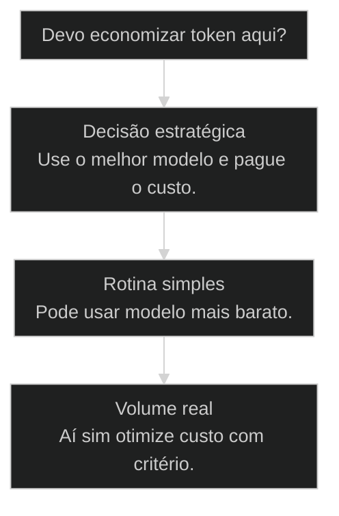
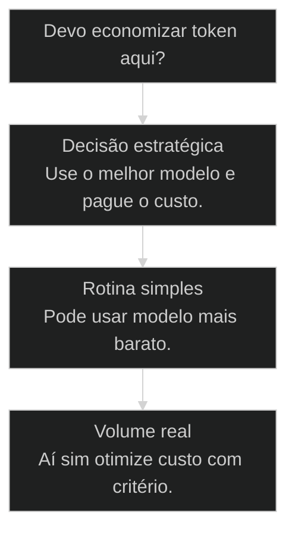

# Token Economy Mindset

↑ [[modulos/Módulo 0 - Mindset e Princípios|M0]] · ⌂ [[cursos/AIOX Advanced/README|Curso]] · → [[08-principio-processo-certo|Respeite o processo: dê comando, não converse]]

## Conceitos

- [[Token Economy]]

## Mapa desta aula

Decisão-chave da aula — Devo economizar token aqui?



> Leia o diagrama antes do texto longo. Depois volte e confira.

> Antes da ferramenta, o comportamento. Antes do código, a mentalidade sobre custo. Token é combustível: você usa o Cloud agora para não precisar dele depois.

**Objetivos de aprendizagem:**
- Entender por que token é infraestrutura (conta de luz) e não consumo discricionário (xícara de café). _(understand)_
- Aplicar a regra moedas-vs-dólares para decidir quando otimizar custo e quando soltar a mão. _(apply)_
- Avaliar criticamente a mentalidade de escassez herdada e substituí-la pelo comportamento que destrava a tecnologia AIOX. _(evaluate)_

---

## Token é infraestrutura

*Mindset · AIOX Advanced*

Por que o ponto de partida do AIOX Advanced é mentalidade, e não ferramenta.

Cara, eu cheguei a usar três contas Max do Claude. Duzentos dólares uma seguida da
outra. Um dia acabou, daí na outra eu peguei a outra conta da empresa. No terceiro
dia, liguei pro meu financeiro: libera mais uma conta aí pra equipe e me dá esse
acesso, que eu vou usar.

Hoje estou com quinhentos mil reais via API. Não é flex, é regime operacional.
Antes de a gente abrir qualquer ferramenta, qualquer agente, qualquer comando, tu
precisa entender uma coisa: o gargalo aqui não é dinheiro de token. O gargalo é a
mentalidade que tu carrega sobre o que esse token significa pro teu negócio.

- **3**: contas Max do Claude usadas em sequência
- **US$ 200**: valor que muda o jogo de um colaborador
- **R$ 500k**: via API rodando hoje na operação

- **status**: aiox advanced
- **meta**: operador=alan_nicolas
- **meta**: aula=01 mindset
- **meta**: infra=[[Token Economy|token-as-utility]]
- **ready**: ready to invest

**Legenda de cores**

O que cada cor sinaliza nesta aula

- **Reframe inicial** (signal): ponto onde a percepção sobre token vira insumo, não gasto
- **Mentalidade antiquada** (pain): comportamento de escassez herdado que segura a operação
- **Lei do operador** (insight): regra mental que separa quem usa AIOX bem de quem não usa
- **Métrica de ROI** (bench): valor da hora ou da decisão como referência, não o preço do prompt
- **Movimento de investimento** (action): ação concreta de pagar pelo melhor modelo quando importa

**Como ler esta aula**

1. **Pare de tratar token como café**: Café é consumo opcional. Token é energia do sistema.
2. **Compare com infraestrutura**: Luz, internet, servidor e token são insumos que mantêm a operação viva.
3. **Decida por ROI**: A pergunta não é quanto custou o prompt. É quanto tempo e qualidade ele comprou.
4. **Otimize na escala certa**: Só faz sentido otimizar token quando o volume virou problema real.

---

## Da cohort: o que a turma realmente discute sobre token

*T1 + T2 · WhatsApp*

Realidade do grupo Advanced — não é slide, é cicatriz.

No grupo do Advanced (T1/T2) o tema token não aparece como 'preço do prompt'.
Aparece como **vergonha de gastar** e como **fome de determinismo**.

Alan no WhatsApp, de forma direta:

> Se gastar é porque fez muita coisa errada — as pessoas não precisam de IA generativa
> o tempo todo; precisam que alguém abstraia e entregue **processos determinísticos**
> que são inteligentes.

E o movimento de produto que ele descreveu ao vivo: analisar o [[Squad|squad]], achar o que
pode virar programação/[[Runner|runner]], e **tirar token da execução**. Mais confiável e bem
mais rápido.

Isso fecha o arco desta aula: token economy não é planilha de centavos — é decidir
onde o generativo ainda gera ouro e onde já é vergonha operacional.

> **Âncora de campo**: Processos determinísticos inteligentes > IA generativa em loop.

> **Materiais / FAQ**: Material de campo: cohort-insights/materials/token-economy-10-commandments-visual.md e GUIA-AUTONOMIA-ECONOMIA-TOKENS.md

---

## Onde você chega no fim desta aula

Primeiro o movimento da mentalidade. Os números e regras técnicas vêm depois que a lógica está clara.

- **Objetivos da aula** (Entender por que token é infraestrutura, não café.; Aplicar a regra moedas-vs-dólares em decisões reais.; Avaliar e trocar a mentalidade de escassez pelo comportamento AIOX.)
- **Onde você está?** (Ainda economiza token: foque Reframe e Lei do Operador.; Já paga modelo top: foque Casos e Escala.; Vai decidir compra agora: foque Prática e Decisão de Modelo.)
- **Leitura prática**: Leia cada bloco procurando uma resposta concreta: isso é moeda ou é dólar? Onde eu ainda penso como o bisavô economizando luz?

**O ritmo da aula**

Mudança de comportamento fica mais clara quando cada etapa tem reframe, regra, prova e ação.

- 1 **Reframe antes de número**: Primeiro token vira insumo na cabeça, depois entra o cálculo de ROI.
- 2 **Regra antes de comando**: A lei moedas-vs-dólares decide antes de qualquer escolha de modelo.
- 3 **Prova antes de promessa**: Andrew Ng e as contas Max do Alan provam o padrão, não só afirmam.
- 4 **Ação antes de fechar**: A aula termina com auditoria concreta de 5 minutos, não com resumo.

---

## Token é conta de luz. Não é xícara de café.

A primeira reframe: token deixa de ser consumo e vira infraestrutura.

A mentalidade tem que pensar assim: como a empresa precisa de energia elétrica,
como ela precisa de internet, ela precisa de tokens pra sobreviver. Não é luxo,
não é capricho. É insumo. Ponto.

Tu não chega no escritório e fica pensando "vou apagar a luz agora porque não
quero gastar". Esse era o pensamento do meu bisavô, ele chegava nos cômodos
desligando luz, não deixava ninguém ficar três minutos no banheiro com chuveiro
ligado. Fazia sentido pra ele.

Eu vejo gente do nosso mercado pensando do jeito que o bisavô pensava sobre
energia elétrica, agora aplicado a token. Isso é um pensamento muito antiquado.
Tu não constrói o futuro com a régua do passado.

**Pensamento antiquado (escassez)**
- Token é gasto. Toda análise vira cálculo de custo unitário.
- Vou economizar usando modelo mais fraco pra coisa importante.
- Não posso testar: pode custar três dólares à toa.
- Espero o preço cair antes de soltar a mão.

**Pensamento AIOX (infraestrutura)**
- Token é insumo. Como luz, internet e servidor.
- Pego o melhor modelo: Opus, Sonnet topo, o que for a fronteira.
- Custou três dólares pra fazer análise? Quanto vale uma hora minha?
- Velocidade agora vale mais do que centavo economizado depois.

**a reclassificação mental**

1. **Gasto**: Parece dinheiro saindo para uma ferramenta.
2. **Insumo**: Você entende que sem token o trabalho não roda.
3. **Infraestrutura**: O custo vira parte normal do operar, como luz e internet.
4. **Alavanca**: O modelo top compra velocidade, qualidade e aprendizado composto.

---

## Cloud agora para não precisar do Cloud depois.

Token não é só insumo de hoje. É combustível que compra aprendizado que vira sistema próprio.

Tem uma segunda camada nisso. Token não é só a luz que mantém a operação ligada.
Token é combustível. Tu queima Cloud agora pra construir o sistema que um dia roda
sozinho, sem depender tanto do Cloud.

Cada análise boa que tu paga vira uma skill, vira um workflow, vira um agente que
tu não precisa refazer na mão na próxima vez. O gasto de hoje compra a autonomia
de amanhã. Quem economiza moeda no insumo nunca chega no estágio onde o sistema se
paga sozinho.

Por isso eu não tenho dó de queimar token construindo as coisas. Tô comprando o
Cloud de hoje pra não precisar tanto dele depois.

- **Não é gasto que evapora** -> Token mal-pensado parece dinheiro que sai e não volta.
- **É combustível que constrói** -> Token bem-usado vira skill, workflow e agente reutilizável.
- **Compra autonomia futura** -> O que tu paga hoje reduz o que tu depende do modelo amanhã.
- **Compõe a cada ciclo** -> Cada sistema construído acelera o próximo. Escassez quebra a composição.

> **Cloud para não precisar do Cloud**: A regra prática é simples: se o token de hoje constrói um mecanismo que reduz o trabalho de amanhã, ele já se pagou antes mesmo de gerar receita. Economizar nesse momento é cortar o próprio combustível.

---

## Eu prefiro perder moedas para ganhar dólares.

A regra de decisão que separa otimização útil de pinguço.

Eu tenho uma frase minha: eu prefiro perder moedas para ganhar os dólares.
Prefiro não olhar pra essas coisinhas pequenas porque estou focado no grande.

Sou totalmente contra aquele negocinho: "ah, economize na xícara de café".
Foda-se a xícara de café. Eu quero olhar pra quantos milhões eu quero ganhar.

Os maiores especialistas de IA falam assim: foda-se o token, foda-se o preço do
token. Pega o melhor modelo. Tem gente que faz um PRD usando Haiku, usando
ChatGPT-5 mini: cara, não faz sentido nenhum. Só o tempo que tudo leva já paga
o modelo top dez vezes. "Ah, custou três dólares essa análise". Quanto vale a
tua hora?

Tipo assim, eu nem tô dizendo pra gastar vinte mil dólares. Duzentos dólares
pra mudar completamente o jogo, e esses duzentos viram vinte mil depois.

- **Moeda: ganhar 5% num prompt curto**: Trocar Opus por Haiku numa task de raciocínio complexo pra salvar trocados. Custo real: análise pior, retrabalho, alucinação invisível. Não otimize aqui.
- **Dólar: velocidade do operador**: Pega o melhor modelo, paga US$ 200 do plano top, libera segunda e terceira conta se precisar. O ROI é a tua hora desbloqueada, não o ticket do token.
- **Quando token vira preocupação**: Só quando tu tem extração em escala: milhares ou milhões de usuários consumindo. Até lá, otimizar token cedo é prematuro e cobra preço em produtividade.

---

## Oito ou oitenta: Haiku ou Opus, nunca o morno do meio.

A heurística contra o paradoxo da escolha de modelo. Decida pelo extremo certo, não pelo meio confortável.

Eu tenho uma regra que me tira do paradoxo da escolha: oito ou oitenta. Ou é
Haiku, modelo barato pra tarefa mecânica e reversível, ou é Opus, o topo, pra
decisão que importa. O Sonnet do meio é onde a galera fica travada tentando
economizar sem perder qualidade, e acaba pagando os dois preços.

Pra coisa importante, vai de oitenta. Sem dó. Pra coisa burra e descartável, vai
de oito. O erro é ficar no morno achando que tá sendo esperto.

#### Oito: tarefa mecânica
Quando o trabalho é reversível, de baixo risco e descartável.
1. **Sinal: formatar, renomear, converter estrutura simples.
2. **Pergunta: se sair raso, o retrabalho é barato?
3. **Ação: usa Haiku ou modelo leve sem culpa.
4. **Resultado: custo mínimo, qualidade suficiente.

#### Oitenta: decisão estratégica
Quando a saída influencia produto, oferta, arquitetura ou curso.
1. **Sinal: PRD, benchmark, pesquisa completa, arquitetura.
2. **Pergunta: um erro aqui custa horas ou reputação?
3. **Ação: usa Opus, paga o plano top, libera conta extra.
4. **Resultado: decisão certa que compra velocidade composta.

- **economizar com otimizar**: Economizar corta insumo crítico pra sentir controle.
- **modelo barato com modelo errado**: Modelo barato é certo na tarefa mecânica.
- **morno com seguro**: O Sonnet do meio parece a escolha segura.

---

## É sobre comportamento, não sobre ferramenta.

A camada que sustenta tudo o que vem depois no AIOX.

A tecnologia que a gente vem desenvolvendo aqui é muito, muito, muito mais sobre
comportamento do que sobre qualquer outra coisa. É sobre comportamento.

Porque vai ser o comportamento que tu tem diante da plataforma que faz tu
desenvolver melhor ou pior com ela. A ferramenta é a mesma: Claude Code é
Claude Code pra todo mundo, AIOX é AIOX. O que muda é o operador: como tu
chega, como tu pensa, quanto tu solta a mão.

Por isso o AIOX Advanced começa por aqui, não por comando. Mudou o
comportamento, a mesma ferramenta vira outra coisa.

- **1. WHY - Token é insumo**: Token deixa de ser consumo discricionário e vira infraestrutura. Mesma categoria de luz, internet e servidor. Sem esse insumo, a operação não roda. [MINDSET, insumo]
- **2. WHAT - Melhor modelo sempre**: Decisão estratégica = Opus topo, Sonnet topo, o que for fronteira. Economizar em decisão importante quebra a tese, não constrói ela. [CHOICE, fronteira]
- **3. HOW - ROI da hora**: A pergunta nunca é quanto custou o prompt. É quanto tempo e qualidade ele comprou. Compare contra o valor da sua hora ou da decisão que ele destrava. [GATE, ROI]

> **Regra do operador**: Mesma ferramenta, comportamentos diferentes geram resultados em ordens de grandeza diferentes. O AIOX assume essa premissa, por isso esta aula vem antes de qualquer comando.

**Árvore de decisão**
_Economia boa reduz desperdício; economia ruim reduz qualidade._



- **Decisão estratégica** — A saída influencia produto, oferta, arquitetura, posicionamento ou curso.
  → _Use o melhor modelo e pague o custo._
  Ex.: PRD, benchmark, pesquisa completa, arquitetura, aula.
- **Rotina simples** — A tarefa é mecânica, reversível e de baixo risco.
  → _Pode usar modelo mais barato._
  Ex.: Formatar texto, renomear, converter estrutura simples.
- **Volume real** — Milhares de chamadas ou custo recorrente em produção.
  → _Aí sim otimize custo com critério._
  Ex.: Extração em lote, produto com usuários, agente rodando sempre.

**Gate:** Economizei moeda ou perdi dólar? — _Se a economia piora decisão importante, você perdeu dólar._

---

## Andrew Ng tira da cabeça dos jovens a mentalidade de escassez.

Quem está há mais tempo no Vale enxerga o mesmo padrão, e luta contra ele todo dia.

Indico pra vocês uma palestra do Andrew Ng, ele é um dos pais da IA, tem
aceleradora de IAs nos Estados Unidos, ensina IA de graça pro mundo. Ele tem
seus cinquenta anos e diz que a coisa que mais enlouquece ele é tirar da cabeça
de jovem de dezessete, dezoito, vinte e cinco anos essa mentalidade de escassez.
"Não posso gastar token. Não posso gastar em servidor. Não posso gastar."

É a mesma coisa que eu fico falando aqui. Não é coincidência: quem está mais à
frente vê o mesmo padrão repetido. O jogo agora é velocidade. E velocidade não
combina com economia de moeda em insumo crítico.

A gente esteve no Vale do Silício em novembro e voltou com a mesma leitura:
mesmo lá, o que separa quem entrega não é acesso a modelo, é comportamento
diante do modelo. Aqui no AIOX Advanced tu tá recebendo o atalho dessa leitura.

- **Mentalidade de escassez**: Postura de tratar token, modelo top e tempo de máquina como gasto a economizar. Custo real: lentidão crônica, qualidade rebaixada, perda de janela competitiva.
- **Mentalidade de infraestrutura**: Postura de tratar token como insumo: paga, mensura, otimiza só quando o volume justifica. Libera a mão pra perseguir o dólar.
- **Velocidade como vantagem**: Tese de Andrew Ng e do AIOX: quem move rápido na fronteira ganha mais do que quem economiza centavo na linha de base.

### Caso: Andrew Ng contra a escassez

O padrão que Alan vê no AIOX aparece também nos builders do Vale: jovem com acesso à fronteira, mas operando com medo de gastar token.

- Começou como: Uma crença de economia: não gastar token, servidor ou modelo top.
- Virou: Uma regra de operação: pagar insumo crítico quando ele compra velocidade e qualidade.
- Prova: A mesma tese aparece na fala de Andrew Ng e na prática de Alan com múltiplas contas Claude Max.
- Lição: O gargalo de IA raramente começa no preço do token; começa na mentalidade do operador.

---

## Por dentro da decisão das três contas Max.

O caso interno: o que Alan estava comprando quando ligou pro financeiro pedir a terceira conta.

- **O que aconteceu**: Em três dias seguidos Alan saturou uma conta Max, migrou pra conta da empresa, e no terceiro dia pediu ao financeiro uma terceira conta mais acesso da equipe. Não era flex: era a operação batendo no teto do insumo.
- **O que ele estava comprando**: Não era token. Era continuidade de fluxo. Cada hora parada esperando reset de conta custava mais do que a assinatura inteira. A decisão de pagar mais conta foi a decisão de não perder o dólar pra economizar a moeda.

**Colunas:** Decisão | Pergunta | Sinal saudável | Sinal de risco

- Saturou a conta: Parar e esperar o reset ou liberar outra conta? | Libera conta: fluxo não para. | Espera reset: dia inteiro travado pra salvar US$ 200.
- Modelo da análise pesada: Rebaixar pra economizar ou manter o topo? | Mantém Opus: decisão certa de primeira. | Rebaixa: retrabalho silencioso custa mais.
- API a R$ 500k: É gasto descontrolado ou regime operacional? | Regime: cada real vira sistema construído. | Medo: corta combustível e trava a composição.

---

## Modelos para ler a decisão de gasto

Visualizações simples pra comparar onde o token é moeda e onde é dólar.

- **PRD / arquitetura**: dólar (decisão estratégica: erro custa horas e reputação.)
- **Benchmark / pesquisa**: dólar (qualidade da análise define o roadmap.)
- **Formatar / renomear**: moeda (tarefa mecânica e reversível: modelo barato basta.)

- **Alucinação invisível**: alto (modelo fraco erra sem avisar em raciocínio complexo.)
- **Retrabalho**: alto (refazer custa mais que a diferença de token.)
- **Janela perdida**: médio (lentidão crônica cede espaço pra quem move rápido.)

**Matriz de decisão do operador**

Em dúvida, escolha a célula que melhor descreve a situação.

- **Decisão de produto**: Modelo topo. É dólar: não economize aqui.
- **Tarefa mecânica única**: Modelo barato. É moeda: otimizar é ok.
- **Saturou a conta**: Libera outra conta. Fluxo vale mais que assinatura.
- **Extração em escala**: Aí sim otimize custo com critério e medição.
- **Teste rápido de tese**: Pague o topo. Validar antes de codar é dólar.
- **Conversão de formato**: Modelo leve. Reversível e descartável.

---

## Os modos mentais do operador que investe

O jeito de pensar que fica ligado por trás da decisão de gasto. Sem isso, a regra vira só checklist.

- **ROI antes do preço**: A primeira pergunta é o valor da hora ou da decisão, nunca o ticket do prompt.
- **Anti-escassez**: Reflexo de cortar gasto vira alerta: isso é moeda ou dólar antes de economizar?
- **Fluxo acima de tudo**: Operação parada custa mais que conta extra. Continuidade é prioridade.
- **Combustível, não consumo**: Token gasto bem constrói sistema. Cada ciclo paga o próximo.
- **Otimização na escala certa**: Só vira economia legítima quando o volume em produção justifica.

---

## Métricas de saúde do gasto

Sem telemetria, a regra vira estética. Estas métricas separam investimento vivo de medo travado.

- **Decisão por ROI**: Compara contra valor da hora / Compara só com preço do token / Não compara, só evita gastar
- **Modelo em decisão estratégica**: Sempre o topo (Opus) / Oscila pra economizar / Rebaixa por padrão
- **Continuidade de fluxo**: Conta extra liberada na hora / Espera reset às vezes / Trava operação pra salvar conta

---

## Caso benchmark: aplicar Token Economy Mindset em uma decisão real

Um segundo caso para tirar a aula do conceito isolado e mostrar como o operador transforma o princípio em decisão, execução e evidência.

- **O que mudou na operação**: A aula deixou de ser uma explicação e virou uma lente de decisão. O aluno sabe que sinal observar, qual rota escolher e que evidência precisa produzir. Players: sinal, rota, execução, evidência.
- **Por que isso eleva a qualidade**: O padrão espelha o [[Método S2S]]: capturar o sinal, estruturar o caminho, executar com limite e fechar com prova.

**Matriz de aplicação**

Use esta matriz quando a aula parecer clara, mas a ação ainda estiver vaga.

- **Sinal claro**: O aluno consegue nomear o que a aula ensina a observar.
- **Rota escolhida**: A próxima ação nasce de critério, não de vontade de testar ferramenta.
- **Risco visível**: O erro provável fica explícito antes de executar.
- **Prova mínima**: Existe uma evidência simples para dizer que avançou.

### Caso: Quando o conceito precisou virar critério de execução

O operador já tinha entendido a tese, mas ainda precisava decidir o próximo passo sem cair em improviso.

- Começou como: Conceito entendido em teoria, sem critério de aplicação na task real.
- Virou: Decisão roteada por sinais, riscos, evidências e próximo passo verificável.
- Prova: A saída passou a ter ação, dono, critério e evidência de fechamento.
- Lição: Aula de qualidade não termina em entendimento. Termina quando o aluno consegue agir com critério.

---

## Auditoria da tua mentalidade de token

Mapeia onde tu ainda pensa como o bisavô e onde já mudou.

Antes de seguir, faz esse exercício curto. Não pula. É aqui que o resto do
curso ganha tração, ou não.

**Sequência para decidir gasto de token**
Use antes de economizar modelo em uma tarefa importante.
- `classificar tarefa`
- `estimar valor da hora`
- `medir risco`
- `escolher modelo`
- `revisar ROI`
- `Classificar`: Estratégica, rotina simples ou escala real?
- `Valor`: Quanto vale uma hora sua ou uma decisão certa?
- `Risco`: Se sair raso, o retrabalho custa mais que o token?
- `Modelo`: Use o melhor quando o ganho de decisão paga a diferença.

**Exemplo preenchido: auditoria de um operador que ainda economiza token**

- **Gasto atual**: US$ 40/mes em ChatGPT Plus + R$ 0 em API. Total: ~R$ 220/mes.
- **Valor da hora**: R$ 400/h. Dez horas focadas = R$ 4.000. Gasto de IA representa 5% disso.
- **Lista do que evita**: 1) Não roda pesquisa completa com Opus por achar caro. 2) Usa Haiku pra PRDs. 3) Não testa benchmark com 5 prompts variados.
- **Reclassificacao**: 1) DOLAR - PRD vira oferta de R$50k, paga 250x o token. 2) DOLAR - decisão de produto. 3) DOLAR - validar tese antes de codar.
- **Decisão**: Subir para Claude Max US$200/mes essa semana. Migrar PRDs e benchmarks para Opus. Marcar revisão de ROI em 30 dias.

> **Portão da aula**: Você entendeu quando consegue explicar, sem vergonha, por que pagar pelo melhor modelo é infraestrutura e não luxo.

- 1. **Mapeia o gasto atual**: Escreve quanto tu tá gastando hoje em IA por mês: assinaturas, API, tudo. Coloca o número cru na frente, sem julgamento.
- 2. **Confronta com a hora**: Calcula quanto vale uma hora tua de trabalho focado. Multiplica por dez horas. Compara com o gasto mensal de IA. Se o gasto de IA for menor que dez horas tuas, tu tá subinvestindo.
- 3. **Lista o que tu evita por causa de token**: Anota três coisas que tu deixou de testar, perguntar ou pedir pro modelo top porque pensou 'pode ficar caro'. Essa lista é o teu débito de comportamento.
- 4. **Reclassifica**: Pega cada item da lista e responde, isso é moeda ou é dólar? Se for moeda (otimização pequena), arquiva a preocupação. Se for dólar (decisão estratégica), libera a mão e executa essa semana.

---

## O processo de decisão de gasto, em fases

Quando a decisão precisa virar rotina de time, ela vira processo. Estas são as fases.

**Classificar → Decidir → Investir → Revisar**
Rota para transformar a regra moedas-vs-dólares em processo repetível.
- **Classificar**: Tarefa é estratégica, rotina simples ou escala real? Defina o motor antes do modelo.
- **Decidir**: Estratégica vai de Opus. Rotina vai de Haiku. Escala entra com medição de custo.
- **Investir**: Pague o plano top, libere conta extra se o fluxo saturar. Continuidade primeiro.
- **Revisar**: Marque revisão de ROI em 30 dias. Se o gasto não virou sistema ou velocidade, ajuste.

> **Quando virar processo**: Decisão individual vira processo quando o time inteiro precisa decidir gasto de modelo sem te perguntar. Aí a regra do operador vira fase escrita, não improviso.

---

## Bloco de código: decisão de modelo

Um bloco simples para o aluno copiar antes de economizar token na tarefa errada.

**Checklist em texto**
```text
tarefa: "Qual decisão ou entrega estou tentando destravar?"
valor_da_hora: "R$ ____"
custo_do_erro: "baixo | médio | alto"
motor: "oito (mecânica) | oitenta (estratégica)"
modelo_escolhido: "melhor modelo disponível"
motivo: "economizar token aqui custa mais do que usar bem"

```
*Use como mini-contrato antes de trocar qualidade por economia falsa.*

- **Moeda**: Otimização pequena de custo que não muda decisão importante. Pode arquivar a preocupação.
- **Dólar**: Decisão estratégica cujo acerto vale ordens de grandeza acima do preço do token. Libere a mão.
- **Oito ou oitenta**: Heurística de modelo: Haiku pra tarefa mecânica, Opus pra decisão. Evita o morno do meio.
- **Combustível**: Token gasto pra construir sistema que reduz dependência futura do modelo.
- **Portão da aula**: Você passou quando explica sem vergonha por que pagar o topo é infraestrutura, não luxo.

***

---

## Prática: monte o orçamento de tokens da tua semana

Você vai produzir um orçamento de uma semana classificando cada tarefa de IA como moeda ou dólar e travando o modelo certo antes de abrir o terminal.

**Exemplo preenchido: semana de um operador construindo um SaaS com AIOX**

- **Tarefas da semana**: 1 PRD de feature nova, 1 benchmark de concorrentes, 20 formatações de conteúdo, 5 conversões de planilha.
- **Classificação**: PRD e benchmark são dólar: Opus, sem dó. Formatações e conversões são moeda: Haiku, sem culpa.
- **Custo estimado**: ~US$ 30 de Opus nas duas tarefas estratégicas + centavos de Haiku no mecânico. Valor da hora do operador: R$ 400.
- **Teto de decisão**: se o PRD destrava uma oferta de R$ 50k, o token pagou 250x. Rebaixar modelo aqui é perder dólar pra salvar moeda.
- **Revisão**: checagem de ROI marcada pra 30 dias: o gasto virou skill, workflow ou sistema reutilizável, ou só evaporou?

> **Teste rápido**: se toda tarefa estratégica da lista está com o melhor modelo e toda mecânica está com o barato, o orçamento passou; um único PRD em Haiku reprova a semana inteira.

---

## Portão da aula

*Gate*

O critério não é decorar a regra moedas-vs-dólares, é aplicá-la numa decisão real de gasto.

> **Portão da aula**: Você só passa desta aula quando consegue pegar uma tarefa real da tua semana, classificá-la como moeda ou dólar e justificar o modelo escolhido pelo valor da tua hora, não pelo preço do token.

---

## Navegação

← início · ↑ [[modulos/Módulo 0 - Mindset e Princípios|M0 — Mindset e princípios]] · ⌂ [[cursos/AIOX Advanced/README|Curso]] · → [[lessons/08-principio-processo-certo|Respeite o processo: dê comando, não converse]]
