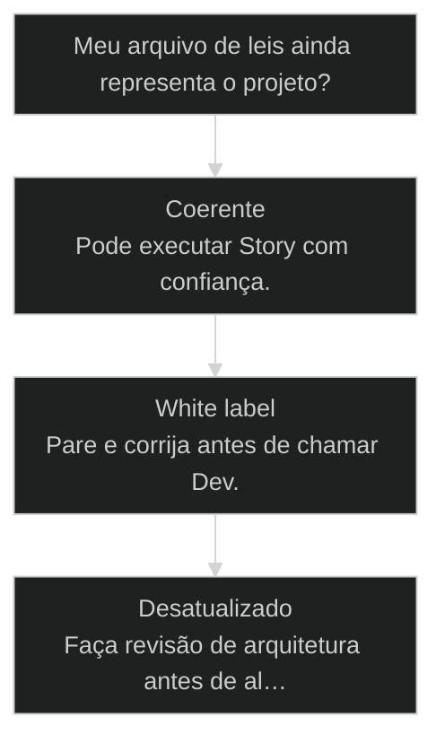
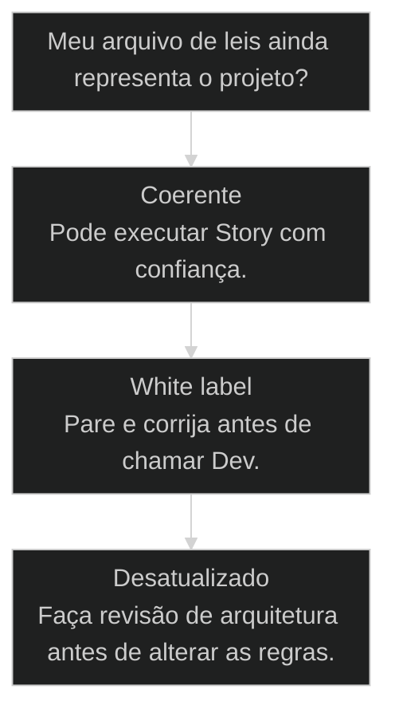
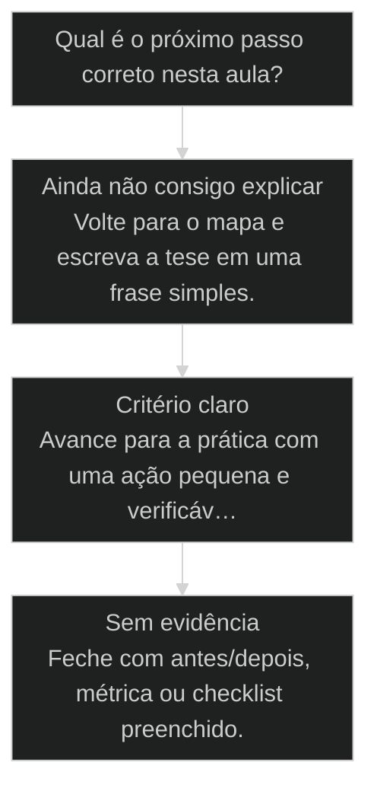

# [[CLAUDE md|CLAUDE.md]] é a lei da física do seu projeto

← [[02-aiox-nao-e-ferramenta|AIOX não é ferramenta]] · ↑ [[modulos/Módulo 1 - Sistema AIOX|M1]] · ⌂ [[Cursos/AIOX Advanced/README|Curso]] · → [[25-core-config-leis-sociais|core-config: as leis sociais do projeto]]

## Conceitos

- [[CLAUDE md|CLAUDE.md]]

## Mapa desta aula

Decisão-chave da aula — Meu arquivo de leis ainda representa o projeto?



> Leia o diagrama antes do texto longo. Depois volte e confira.

> Por que esse arquivo decide se o AIOX vai te puxar pra frente ou te puxar pra trás

**Objetivos de aprendizagem:**
- Entender o [[CLAUDE md|CLAUDE.md]] como o conjunto de leis da física do seu projeto: gravidade que atrai e governa todos os outros agentes de IA. _(understand)_
- Aplicar a única instalação correta do AIOX (npx) para que o CLAUDE.md já chegue sabendo o que é AIOX, e não em modo white label. _(apply)_
- Reconhecer e aplicar o arquivo equivalente em cada ferramenta: AGENTS.md (Codex), GEMINI.md (Gemini CLI), RULES.md (Antigravity): como regras universais de cada IDE. _(apply)_
- Avaliar quando seu CLAUDE.md ficou desatualizado em relação ao PRD/CoreConfig e está te puxando pra trás em vez de te puxar pra frente. _(evaluate)_

---

## CLAUDE.md é a gravidade do projeto

*Por que importa*

A peça ignorada que decide se o AIOX vai funcionar, ou virar bug em cima de bug.

A maioria das pessoas instala o AIOX, olha pro CLAUDE.md de relance e segue mexendo em
agente, criando Story, chamando PO. Esse é o erro número um. Antes de qualquer agente
atuar, existe um arquivo decidindo *como* eles atuam. Esse arquivo é o CLAUDE.md.

Pedro Valério tem a melhor analogia que já escutei pra isso: "se vocês forem pensar no
que é o CLAUDE.md para dentro do AIOX, para dentro do sistema, é como se fossem as
leis da física no nosso ambiente. Existem leis que regem todo aquele planeta. Por
mais que depois você tenha configurações específicas de região, de projeto, de
módulo: existem leis maiores que tudo segue."

Eu vou ser direto, esse arquivo é absurdamente importante. Não é "legal ter um
CLAUDE.md". Se ele não estiver bem estabelecido, todo o resto começa a dar bug. Os
agentes vão se atropelar, vão sugerir caminhos errados, e você vai culpar o modelo
quando o problema está na lei da física do seu planeta.

- **1**: arquivo que governa o comportamento
- **4**: equivalentes por IDE
- **3**: leis base do AIOX

- **status**: aiox advanced
- **meta**: operador=alan_nicolas
- **meta**: aula=03 claude-md
- **meta**: leis=3 base + n custom
- **ready**: ready to govern

**Legenda de cores**

O que cada cor sinaliza nesta aula

- **Existe peça** (signal): uma estrutura ou arquivo que rege comportamento
- **Lei da física** (insight): regra permanente que puxa todo agente para o jeito certo
- **Movimento do operador** (action): ação concreta de auditar, atualizar ou escrever a lei
- **Gravidade errada** (pain): drift, white label ou regra desatualizada puxando para trás
- **Coerência arquitetural** (bench): CLAUDE.md, CoreConfig e PRD contando a mesma história

**Como entender sem virar técnico**

1. **Existe um planeta**: Seu projeto tem regras próprias, objetivos, stack e forma correta de trabalhar.
2. **Existe uma gravidade**: O arquivo de regras puxa todo agente para esse jeito de trabalhar.
3. **Existem órbitas**: PO, Dev, QA, DevOps e Architect atuam dentro dessas regras.
4. **Existe drift**: Se o arquivo fica antigo, o sistema continua obedecendo uma física errada.

---

## Como ler esta aula

Primeiro o movimento geral. Os arquivos por IDE e os exercícios entram depois que a lógica da gravidade está clara.

- **Objetivos da aula** (Entender o CLAUDE.md como a gravidade do projeto.; Aplicar a instalação certa para evitar white label.; Reconhecer o arquivo equivalente em cada IDE.; Avaliar quando o arquivo de leis virou drift.)
- **Onde você está?** (Começando: foque Conceito e Decisão.; Já usa AIOX: foque Casos Reais e Tabela por IDE.; Vai auditar: foque Prática e Portão da aula.)
- **Leitura prática**: Leia cada bloco procurando uma resposta concreta: qual peça governa, qual lei ela impõe, qual ação corrige a gravidade e qual prova mostra que o projeto está coerente.

**Ritmo da aula**

Cada etapa tem um objetivo claro, um portão de avanço e uma ação prática.

- G **Gravidade primeiro**: Comece entendendo por que um arquivo decide o comportamento de todo agente.
- 1 **Leis e IDEs**: Depois veja as 3 leis base e o arquivo equivalente em cada ferramenta.
- 2 **Casos e auditoria**: Veja o método aplicado e termine auditando um projeto real.

---

## Da cohort: CLAUDE.md inchado é dívida real

*T1 + T2 · WhatsApp*

Realidade do grupo Advanced — não é slide, é cicatriz.

Na turma, a dúvida clássica é: CLAUDE.md **global** vs **do projeto**.
A resposta de operação: o bootstrap/AIOX carrega muito; o projeto precisa de leis
locais. O erro é copiar um romance de 461 linhas.

Campo (síntese de ensino no grupo): budget mental de ~**150 instruções**; arquivo
com centenas de linhas empurra a IA a ignorar o que importa. Reestruturar para
~120 linhas de lei real — o resto vira doc linkado.

Se o teu CLAUDE.md parece manual da NASA, esta aula não é teoria: é o que a cohort
já quebrou na prática.

> **Âncora de campo**: CLAUDE.md magro é lei; CLAUDE.md gordo é ruído disfarçado de governança.

> **Materiais / FAQ**: Material: cohort-insights/materials/escrevendo-um-bom-claude-md.md

---

## O Claude Code é um planeta. O CLAUDE.md é a gravidade.

Por que esse arquivo atrai e governa todos os outros agentes do AIOX.

Pedro descreve o Claude Code assim: "uma arquitetura de LLM, [[Engenharia de Contexto|engenharia de contexto]],
execução de tools. Ele já faz gestão ali de sub-agents, de chamadas. Esse planeta do
Claude Code: quais são as leis da física dele? Está no CLAUDE.md."

Traduzindo pro operacional: o Claude Code orbita em torno de três peças estruturais -
o PRD, o CoreConfig e o CLAUDE.md. Quando você chama qualquer agente (PO, SM, Dev,
DevOps, Architect), ele não nasce no vácuo. Ele é puxado pela gravidade dessas três
peças. Se a gravidade está fraca ou white label, o agente vai inventar contexto.

Por isso eu insisto: o CLAUDE.md "é a gravidade que vai atrair todos os outros
agentes. E eles vão atuar no meio desse cara aqui". Os agentes precisam atuar dentro
dessas leis, assim como um objeto físico precisa obedecer à gravidade do planeta
em que ele está. Não tem como burlar, ou as leis te puxam pra frente, ou te puxam
pra trás.

Detalhe técnico que pouca gente percebe: quando o Claude Code carrega, ele
literalmente procura por uma pasta `.claude/` e por um `CLAUDE.md` na raiz. Se
existe, ele lê *aquilo* como os "dez mandamentos" do projeto. É assim que ele sabe
quem é você, o que é o seu sistema e como ele deve se comportar.

**o caminho invisível antes da resposta**

1. **Você chama o agente**: A conversa parece começar no prompt, mas o agente busca contexto antes.
2. **Claude lê as leis**: CLAUDE.md define autoridade, convenções, validação, modo de trabalho e limites.
3. **CoreConfig orienta**: Stack, tools, flags e integrações mostram o ambiente real do projeto.
4. **Resposta nasce governada**: O agente não responde livre. Ele responde dentro da física que você escreveu.

> **Lei da física não é prompt**: Prompt é pedido momentâneo. CLAUDE.md é gravidade permanente. Se a gravidade estiver errada, todo prompt bom ainda pode cair para o lado errado.

---

## As 3 leis que todo CLAUDE.md do AIOX impõe

Não são opinião. São leis físicas, toda inteligência do Claude Code vai te puxar pra elas.

- **1. Lei 1 - Story-Driven**: Todo desenvolvimento passa por uma Story em docs/stories/. Pular essa lei reorienta toda a inteligência do Claude Code de volta para o fluxo Story-Driven. [FLOW, docs/stories/]
- **2. Lei 2 - Agent Authority**: Cada agente tem autoridade exclusiva. Só @devops faz push, tag, PR, release. Só @db-sage executa migration em produção. Tentar burlar = bloqueio por hook. [AUTH, enforce-[[Hook|hooks]]]
- **3. Lei 3 - Quality First**: Lint, typecheck e validators passam antes de qualquer merge. CLAUDE.md amarra npm run doctor no pre-push. Superpoder novo vira parágrafo no CLAUDE.md. [GATE, doctor]

- **Lei 1: Story-Driven**: Todo desenvolvimento passa por uma Story em docs/stories/. Se você chamar o
PO sem Story, ou tentar pular pra Dev sem briefing validado, toda a
inteligência do Claude Code vai redirecionar você pro fluxo Story-Driven.
Não é frescura, é a primeira lei que o instalador escreve no seu CLAUDE.md.

- **Lei 2: Agent Authority**: Cada agente tem autoridade exclusiva sobre um domínio. Só @devops faz push,
tag, PR, release e deploy. Só @db-sage executa migration em produção. Os
outros propõem, esses dois executam. Tentar burlar essa lei resulta em
bloqueio por hook (`enforce-git-push-authority.sh`).

- **Lei 3: Quality First**: Lint, typecheck e validators precisam passar antes de qualquer merge. O
CLAUDE.md amarra o `npm run doctor` no pre-push. Se você quiser
superpoderes: "minha ferramenta sempre escolhe o LLM de menor custo": você
não pede gentilmente, você escreve a regra no CLAUDE.md. Aí a lei da física
passa a te dar velocidade.

---

## As 3 peças estruturais do planeta

PRD, CoreConfig e CLAUDE.md: cada um responde uma pergunta diferente sobre o seu projeto.

- **PRD responde o QUE** -> O que o produto faz, para quem, e qual problema resolve. É a intenção do projeto.
- **CoreConfig responde o COMO técnico** -> Tech Stack, Code Standard, Source Tree, model routing. As regras sociais do projeto.
- **CLAUDE.md responde o COMO comportamental** -> Autoridades, convenções, validators, modo de trabalho. As leis da física que governam todo agente.

> **Quando as 3 contam a mesma história**: Coerência entre PRD, CoreConfig e CLAUDE.md é o que faz o agente abrir o repo e já saber o próximo passo sem te perguntar nada. Quando elas divergem, todo agente precisa ser reexplicado em cada conversa.

---

## Cada IDE tem o seu próprio arquivo de leis

CLAUDE.md, AGENTS.md, GEMINI.md, RULES.md: todos eles são a mesma camada conceitual.

O CLAUDE.md não é uma invenção do Claude Code. É o arquivo de "regras universais"
que toda IDE de IA modernamente tem. O nome muda: o papel não.

Se você trabalha com Codex (OpenAI), o arquivo é AGENTS.md. E uma observação prática:
no Codex você praticamente *só* tem o AGENTS.md. Não tem CoreConfig, não tem Skills
no mesmo formato. Tudo que você quer ensinar pro agente entra ali.

Se você trabalha com Gemini CLI, o arquivo é GEMINI.md. O Gemini novo que o Google
lançou ficou basicamente em paridade com o Claude Code, ele tem essa mesma camada
de regras universais, e o AIOX já está atualizado pra funcionar com ele
equivalentemente.

Se você trabalha com Antigravity (Google), o arquivo é RULES.md. Mesma ideia: regras
universais que o agente vai respeitar antes de qualquer prompt.

O peso que cada IDE dá pra esse arquivo é levemente diferente, mas quase todas dão
um peso enorme. Saber qual arquivo escrever, e *o que* escrever nele, é o que separa
quem opera o AIOX em uma IDE só de quem opera o AIOX em qualquer IDE.

- **CLAUDE.md**: Lei da física do Claude Code.
- **AGENTS.md**: Lei da física do Codex.
- **GEMINI.md**: Lei da física do Gemini CLI.
- **RULES.md**: Lei da física do Antigravity.

---

## Tabela de referência: o arquivo de leis em cada IDE

Cole no seu repositório. Vai te economizar tempo toda vez que você for testar uma nova IDE de IA.

- **CLAUDE.md (Claude Code)**: Arquivo na raiz do projeto. Lido automaticamente pelo Claude Code junto com
a pasta .claude/. Define identidade do projeto, agentes, autoridades,
convenções, validators, gotchas. É a peça que o AIOX preenche no install.

- **AGENTS.md (Codex / OpenAI)**: Arquivo equivalente no Codex. Diferente do Claude Code, no Codex você
praticamente só tem esse arquivo: não há CoreConfig nem skills no mesmo
formato. Tudo que você quer impor ao agente entra ali.

- **GEMINI.md (Gemini CLI)**: Arquivo equivalente no Gemini CLI. A versão atual do Gemini ficou em paridade
com o Claude Code, e o AIOX já roda nele com o mesmo conjunto de leis.

- **RULES.md (Antigravity)**: Arquivo equivalente no Antigravity (IDE do Google). Mesma camada de regras
universais. Peso levemente diferente, mas o mesmo papel arquitetural.

- **CoreConfig (core-config.yaml)**: Companheiro do CLAUDE.md, dentro do AIOX core. Se o CLAUDE.md são as leis
da física, o CoreConfig são as regras *sociais* daquele projeto: Tech
Stack, Code Standard, Source Tree, model routing. Mais variáveis que as
leis físicas, mas igualmente importantes.

**Colunas:** IDE | Arquivo de leis | Tem CoreConfig? | Peso do arquivo

- Claude Code: CLAUDE.md | Sim, core-config.yaml separado. | Peso alto: lido sempre na inicialização.
- Codex (OpenAI): AGENTS.md | Não, tudo concentra no AGENTS.md. | Peso máximo: é quase a única orientação.
- Gemini CLI: GEMINI.md | Sim, em paridade com Claude Code. | Peso alto: AIOX já roda equivalentemente.
- Antigravity: RULES.md | Mesma camada de regras universais. | Peso levemente diferente, mesmo papel.

---

## Casos reais: quando a gravidade puxa para o lado errado

Dois casos do próprio AIOX mostram como o arquivo de leis decide se o projeto vai pra frente ou pra trás.

Na aula anterior eu mostrei duas formas erradas de instalar o AIOX: clonar repo
à mão, copiar pasta, configurar tudo manualmente. O resultado é sempre o mesmo: você
acaba com um CLAUDE.md genérico, ou com o CLAUDE.md *do projeto exemplo*, que não
tem nada a ver com o seu negócio.

A única forma certa é pegar o comando npx, colar no terminal e dar enter. Esse
comando faz o setup completo: `.env`, `.gitignore`, `.claude/`, `core-config.yaml`,
e escreve um CLAUDE.md que já chega sabendo o que é AIOX, o que é AIOX, quais são
os agentes que orbitam, quais são as leis físicas básicas. Você pode escolher os
módulos no caminho (ETL? Slides? Brand?) e o instalador monta o CLAUDE.md de acordo.

Houve um aluno que reclamou: com razão: que uma versão anterior do instalador
sobrescrevia o CLAUDE.md existente. Eu já mudei o script, agora ele faz backup antes
de tocar no arquivo. Mas a regra-mestra continua: se você não tem ali a informação
do que é AIOX, do que é o AIOX, de como os agentes se relacionam: vai começar a
dar problema. A gravidade fica fraca, os agentes ficam confusos, o time perde tempo
explicando o óbvio em cada nova conversa.

Pedro fechou bem na aula: "as leis da física do seu ambiente vão ficar te puxando
pra trás, porque elas estão relacionadas a regras que serviam para um projeto
*white label*: que é quando o AIOX acaba de ser instalado." Em outras palavras:
ninguém atualiza o CLAUDE.md depois do primeiro PRD, e essa é a maior fonte de
atrito silencioso do AIOX hoje.

**Instalação que cria física errada**
- Clonar repo e copiar pasta sem entender o setup.
- Usar CLAUDE.md white label do projeto exemplo.
- Sobrescrever regra existente sem backup.
- Atualizar PRD e esquecer de atualizar as leis.

**Instalação que cria física AIOX**
- Rodar o comando oficial de instalação.
- Deixar o instalador escrever regras com AIOX, AIOX e agentes.
- Fazer backup antes de alterar arquivo de regra.
- Tratar atualização de CLAUDE.md como mudança arquitetural.

**Árvore de decisão**
_Use essa pergunta sempre que o projeto mudar de escopo, stack ou modo de trabalho._



- **Coerente** — CLAUDE.md, CoreConfig e PRD contam a mesma história.
  → _Pode executar Story com confiança._
- **White label** — O arquivo ainda fala como projeto exemplo, não como seu projeto real.
  → _Pare e corrija antes de chamar Dev._
- **Desatualizado** — PRD mudou, stack mudou, mas o arquivo de leis não mudou.
  → _Faça revisão de arquitetura antes de alterar as regras._

**Gate:** A física puxa para frente? — _Se ela te obriga a explicar tudo de novo em cada conversa, está puxando para trás._

### Caso: White label puxa o projeto para trás

O aluno acha que instalou AIOX, mas o arquivo de leis ainda fala como projeto genérico.

- Começou como: Instalação manual com CLAUDE.md genérico ou copiado.
- Virou: Instalação oficial com leis, agentes e AIOX já escritos no projeto.
- Prova: Quando CLAUDE.md, CoreConfig e PRD contam histórias diferentes, todo agente precisa ser reexplicado.
- Lição: Lei da física errada não é detalhe; é gravidade puxando o sistema para o lado errado.

### Caso: O CLAUDE.md do AIOX platform: lei viva, não white label

Um repositório real onde o arquivo de leis governa 4 negócios e dezenas de [[Squad|squad]]s.

- Começou como: Monorepo com 4 negócios, dezenas de squads e regras de autoridade conflitantes.
- Virou: Um CLAUDE.md que declara Constituição, autoridades de agente, validators e gotchas operacionais.
- Prova: Hooks como enforce-git-push-authority bloqueiam push fora da autoridade; npm run doctor trava o pre-push.
- Lição: Quando a lei está escrita e enforçada por hook, o agente não tem como burlar: a gravidade puxa pra frente.

---

## Que tipo de drift você tem?

Antes de mexer no arquivo, descubra qual problema você está enfrentando.

#### White Label
O arquivo nunca foi adaptado ao projeto real.
1. **Sinal: o arquivo fala do projeto exemplo, não do seu.
2. **Pergunta: ele cita AIOX, AIOX e seus agentes reais?
3. **Ação: reinstalar oficialmente ou reescrever do PRD.
4. **Resultado: lei que representa o projeto de verdade.

#### Desatualizado
O projeto evoluiu, mas o arquivo de leis ficou parado.
1. **Sinal: PRD ou stack mudou, o arquivo não.
2. **Pergunta: as regras ainda batem com Tech Stack atual?
3. **Ação: abrir tarefa de atualização das leis.
4. **Resultado: arquivo de leis em paridade com o projeto.

#### Coerente
As 3 peças contam a mesma história.
1. **Sinal: CLAUDE.md, CoreConfig e PRD alinhados.
2. **Pergunta: agente novo propõe Story sem perguntar?
3. **Ação: executar com confiança.
4. **Resultado: gravidade puxando para frente.

> **Pausa para checagem**: Antes de chamar Dev, responda: meu arquivo de leis é white label, desatualizado ou coerente? Só o terceiro libera execução direta.

---

## Router de decisão da aula

O ponto em que CLAUDE.md é a lei da física do seu projeto deixa de ser explicação e vira escolha operacional.

**Árvore de decisão**
_Não escolha comando antes de nomear o tipo de situação._



- **Ainda não consigo explicar** — O aluno repete a frase da aula, mas não consegue aplicar em exemplo próprio.
  → _Volte para o mapa e escreva a tese em uma frase simples._
- **Critério claro** — O aluno identifica sinal, risco e decisão antes da ferramenta.
  → _Avance para a prática com uma ação pequena e verificável._
- **Sem evidência** — A ação foi feita, mas não existe prova de melhoria ou decisão registrada.
  → _Feche com antes/depois, métrica ou checklist preenchido._

**Gate:** Você sabe qual rota seguir e como provar que avançou? — _Se a resposta ainda depende de opinião, volte uma etapa._

#### Entender o princípio
Quando a aula ainda parece uma tese abstrata.
1. **Nomear: escreva a tese em uma frase.
2. **Exemplo: traga um caso próprio pequeno.
3. **Risco: diga o erro que a aula evita.

#### Aplicar em uma task
Quando o critério está claro e falta execução.
1. **Escolher: defina a menor ação verificável.
2. **Executar: faça sem expandir escopo.
3. **Provar: registre o delta produzido.

#### Revisar a decisão
Quando a execução aconteceu, mas a evidência ficou fraca.
1. **Comparar: olhe antes e depois.
2. **Ajustar: corrija a menor falha.
3. **Fechar: só conclua com prova.

**Colunas:** Estado | Pergunta | Sinal saudável | Sinal de risco

- Entendimento: Consigo explicar sem copiar a aula? | frase própria e exemplo próprio | repetição bonita sem aplicação
- Decisão: Escolhi rota antes da ferramenta? | sinal e risco nomeados | comando escolhido por hábito
- Prova: Tenho evidência de avanço? | antes/depois ou checklist | sensação de que ficou melhor

---

## Processo operacional mínimo

A sequência mínima para aplicar CLAUDE.md é a lei da física do seu projeto sem transformar a aula em teoria solta.

**Aula → Task → Evidência**
Rota curta para transformar o conceito em ação repetível.
- **Plan**: Nomeie o sinal da aula, o risco que ela evita e o artefato que será produzido.
- **Do**: Execute a menor ação que prova o conceito sem abrir novo escopo.
- **Check**: Compare a saída com o critério de aceite da aula.
- **Act**: Registre a regra aprendida e remova o que não será reutilizado.

**Aplicar com evidência**
Use quando a aula fizer sentido, mas a task ainda estiver sem formato.
- `sinal`
- `risco`
- `ação`
- `prova`
- `sinal`: O que esta aula me ensinou a perceber?
- `risco`: Que erro acontece se eu ignorar esse sinal?
- `ação`: Qual é a menor execução que testa o princípio?
- `prova`: Que evidência mostra que a decisão melhorou?

**Do conceito ao comportamento**

1. **Conceito**: entender a tese central da aula.
2. **Critério**: transformar a tese em pergunta de decisão.
3. **Ação**: executar a menor tarefa que prova avanço.
4. **Memória**: registrar o padrão para repetir depois.

---

## Distinções que evitam falsa competência

Três diferenças que protegem CLAUDE.md é a lei da física do seu projeto de virar jargão ou checklist vazio.

**Parece que aprendeu**
- Repete a tese da aula sem exemplo próprio.
- Escolhe ferramenta antes de escolher critério.
- Fecha a task porque executou algo.

**Aprendeu de verdade**
- Explica o princípio em uma situação própria.
- Escolhe rota, risco e evidência antes do comando.
- Fecha a task quando existe prova de avanço.

- **entender com aplicar**: Entender é conseguir repetir a ideia.
- **ação com evidência**: Fazer algo gera movimento.
- **checklist com processo**: Checklist pode ser preenchido no automático.

**Exemplo preenchido: saída esperada do aluno**

- **Tese**: A aula me ensinou a observar um sinal específico antes de escolher ferramenta.
- **Risco**: Se eu pular esse critério, executo rápido e descubro tarde que a direção estava errada.
- **Ação**: Vou aplicar em uma task pequena, com escopo fechado e antes/depois visível.
- **Prova**: A entrega só fecha quando eu consigo mostrar o critério usado e o delta gerado.

---

## Prática: audite a gravidade do projeto

Abra um projeto real e veja se as leis ainda puxam para a direção certa.

**Sequência para auditar a gravidade do projeto**
Use sempre que o projeto mudar de escopo, stack ou modo de trabalho: antes de chamar Dev.
- `localizar arquivo`
- `comparar com PRD`
- `marcar drift`
- `decidir`
- `atualizar antes de executar`
- `Localizar`: Abra o arquivo de leis da sua IDE: CLAUDE.md, AGENTS.md, GEMINI.md ou RULES.md.
- `Comparar`: Leia o PRD/briefing e veja se o arquivo conta a mesma história.
- `Drift`: Anote regra genérica, white label, desatualizada ou contraditória.
- `Decidir`: Com drift, trate como mudança arquitetural: atualize as leis ANTES de executar Story.

**Exemplo preenchido: auditoria de um projeto SaaS B2B**

- **Localizar**: Projeto usa Claude Code. Arquivo: CLAUDE.md na raiz, 412 linhas, última edição há 3 meses.
- **Comparar**: PRD foi atualizado há 2 semanas: stack migrou de Postgres para Supabase, adicionou Vercel Edge, removeu Stripe e adotou Pagar.me.
- **Drift encontrado**: CLAUDE.md ainda fala em Postgres direto, menciona Stripe webhooks e tem 4 regras sobre edge functions que não existem mais.
- **Decisão**: Não chamar @dev. Abrir tarefa de atualização do CLAUDE.md primeiro, listando as 7 regras que precisam mudar + 2 que precisam nascer.
- **Critério de pronto**: Agente novo abre o repo e consegue propor próxima Story sem precisar perguntar nada sobre stack, integrações ou autoridades.

> **Teste rápido**: Se você precisa explicar o mesmo contexto em todo prompt, a gravidade do projeto está fraca.

- 1. **Localize**: Abra o arquivo de regras da IDE que você usa: CLAUDE.md, AGENTS.md, GEMINI.md ou RULES.md.
- 2. **Compare**: Leia o PRD ou briefing do projeto e veja se o arquivo de regras conta a mesma história.
- 3. **Marque drift**: Anote qualquer regra genérica, white label, desatualizada ou contraditória.
- 4. **Decida**: Se houver drift, não peça execução ainda. Abra uma tarefa de atualização das leis antes.

---

## Bloco de código: leis mínimas

Um CLAUDE.md/AGENTS.md fraco quase sempre falha por não declarar regras executáveis.

**Trecho mínimo de regras**
```markdown
## Regras do projeto
- Preserve mudanças existentes do usuário.
- Rode `npm run typecheck` antes de concluir.
- Rode `npm run lint` antes de concluir.
- Não altere stack, tokens ou CSS global sem decisão explícita.
- Reporte arquivos alterados e validações executadas.

```
*O arquivo de leis precisa ser concreto o bastante para mudar comportamento.*

---

## Métricas de saúde do arquivo de leis

Sem checagem, o CLAUDE.md vira decoração. Estas métricas separam lei viva de lei morta.

- **Coerência com PRD**: mesma história / 1-2 divergências / white label
- **Autoridades declaradas**: quem empurra explícito / parcial / ausente
- **Regras enforçadas**: hook ou validator / só texto / nenhuma trava

> **Portão da aula**: Você entendeu quando consegue abrir um projeto e dizer qual arquivo governa a IA naquela IDE, se ele está coerente com o PRD e se a gravidade puxa para frente ou para trás.

***


---

## Navegação

← [[02-aiox-nao-e-ferramenta|AIOX não é ferramenta]] · ↑ [[modulos/Módulo 1 - Sistema AIOX|M1]] · ⌂ [[Cursos/AIOX Advanced/README|Curso]] · → [[25-core-config-leis-sociais|core-config: as leis sociais do projeto]]
