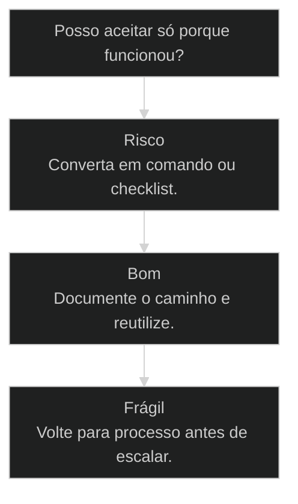
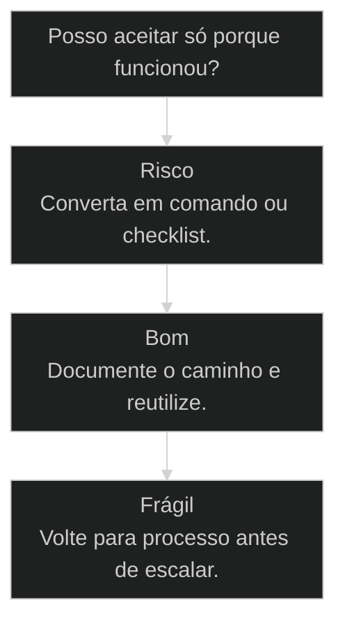

# Respeite o processo: dê comando, não converse

## Conceitos

- [[Goal vs Loop]]

## Mapa desta aula

Decisão-chave da aula — Posso aceitar só porque funcionou?



> Leia o diagrama antes do texto longo. Depois volte e confira.

> AIOX não é ferramenta, é gestão e processo. Funcionar não é o mesmo que estar certo, e o processo certo é o que separa o operador do amador.

**Objetivos de aprendizagem:**
- Reconhecer a diferença entre 'funciona' e 'está certo' (repetível/manutenível/escalável). _(understand)_
- Explicar por que AIOX é gestão e processo, não uma ferramenta a mais. _(understand)_
- Aplicar a regra 'dê comando, não converse' em qualquer projeto. _(apply)_
- Avaliar se um resultado virou processo ou continua sendo puxadinho. _(evaluate)_

---

## Funcionar não é estar certo

*Princípio · Por quê · Aula 01*

Você vai parar de fazer puxadinho com a IA e passar a dar comandos: coisas repetíveis, ensináveis e que não quebram no futuro.

- **8**: aulas onde este princípio reaparece
- **3**: perguntas que separam funciona de certo
- **1**: regra: comando > conversa

- **status**: aiox advanced
- **meta**: operador=alan_nicolas
- **meta**: principio=pr-01 processo-certo
- **meta**: regra=comando > conversa
- **ready**: ready to command

**Legenda de cores**

O que cada cor sinaliza nesta aula

- **Funciona inicial** (signal): resultado bom na primeira tentativa, parece pronto
- **Quebra depois** (pain): movimento errado cobra juros: lesão, retrabalho, puxadinho
- **Processo certo** (bench): comando validado força a IA a seguir técnica
- **Mentalidade** (insight): porque comando obriga e conversa interpreta
- **Hábito repetível** (action): conversa que deu certo vira comando reutilizável

---

## Como ler esta aula

Primeiro vem a história do esporte. Depois o mecanismo: por que comando vence conversa. No fim, uma rotina de 2 minutos.

**O movimento da aula**

1. **Funciona agora**: A bola foi longe. A resposta saiu. A tela abriu.
2. **Quebra depois**: O movimento errado cobra juros: lesão, retrabalho ou puxadinho.
3. **Processo certo**: Comando validado força a IA a seguir técnica, não improviso.
4. **Repetível**: O resultado deixa de depender de sorte e passa a obedecer um caminho.

- **Objetivos da aula** (Reconhecer a diferença entre funciona e está certo.; Explicar por que AIOX é gestão e processo, não ferramenta.; Aplicar a regra dê comando, não converse.; Avaliar se o resultado virou processo ou continua puxadinho.)
- **Onde você está?** (Começando: foque a história e as 3 perguntas.; Já usa AIOX: foque a mentalidade e os casos.; Vai implementar: foque a prática e o bloco de código.)
- **Leitura prática**: Em cada bloco, procure uma resposta concreta: o resultado é repetível? Outra pessoa repete com a mesma qualidade? Quebra depois?

---

## A história do golfe e do tênis

O Alan foi ter aula de golfe. Batia na bola e ela ia longe. "Tô arrasando, tô foda, já cheguei", pensava. Aí o professor: "teu ombro tá errado, teu gingado tá errado". Quando fez do jeito certo, a bola foi pro lado. A reação dele: "deixa eu fazer do jeito errado, que do jeito errado eu acerto onde quero". No tênis, a mesma regra. Só que o professor avisou: "do jeito errado, tu vai te lesionar". A virada: treinar o movimento certo é um saco no começo, mas depois você acerta sempre. [SOURCE: L2943-2963]

> **A vulnerabilidade que conecta**: Eu não sou um cara de esporte. E mesmo com 6 meses de AIOX, descobri que eu também fazia 'puxadinho' sem perceber: até o Pedro me mostrar. [SOURCE: L447, L1867, L2077]

**o que a história ensina**

1. **Bate longe**: O resultado inicial parece bom.
2. **Professor corrige**: A técnica mostra que o movimento estava errado.
3. **Piora no começo**: Fazer certo parece regredir porque exige reaprender.
4. **Ganha repetição**: Depois a técnica certa acerta mais vezes e quebra menos.

---

## Em linguagem simples

Conversar com a IA às vezes funciona, mas funciona apesar do processo, não por causa dele.

**As 3 perguntas que separam 'funciona' de 'certo'**

1. **Funciona?**: Sim, conversar às vezes dá certo.
2. **É repetível?**: Você consegue fazer de novo com a mesma qualidade?
3. **Dá manutenção / não quebra depois?**: Se a resposta é não, foi um puxadinho. [SOURCE: L2943, L3901]

- **Não começa pela tela** -> Começa entendendo o processo que precisa rodar, não a ferramenta que vai abrir.
- **Não aceita só porque funcionou** -> Pergunta se o resultado aguenta repetição antes de chamar de pronto.
- **Não termina quando abre** -> Termina quando vira caminho que outra pessoa consegue seguir.

---

## Posso aceitar só porque funcionou?

Use este mapa antes de declarar qualquer resultado pronto.

**Árvore de decisão**
_A pergunta certa é se o resultado aguenta repetição._



- **Risco** — Funcionou uma vez, mas dependeu de muita conversa?
  → _Converta em comando ou checklist._
- **Bom** — Funcionou e ficou repetível?
  → _Documente o caminho e reutilize._
- **Frágil** — Funcionou, mas ninguém sabe explicar por quê?
  → _Volte para processo antes de escalar._

**Gate:** Eu consigo ensinar outra pessoa a repetir? — _Se não consegue ensinar, ainda não virou processo._

> **Pausa antes de avançar**: Antes de declarar pronto, responda em voz alta: é repetível, dá manutenção e outra pessoa consegue ensinar? Se travar em qualquer uma, volte para o processo.

---

## AIOX é gestão e processo, não ferramenta

O erro de quem chega é tratar AIOX como mais um app. AIOX é a disciplina de processo que faz a IA produzir resultado repetível.

> **A tese-mãe do curso**: AIOX não é ferramenta. É gestão e processo. A IA é a alavanca, não o produto. Quem trata como ferramenta fica preso no improviso; quem trata como processo escala. [SOURCE: t2-aula-1 PR-01, t2-aula-3 PR-T2A3-01]

- **ferramenta com processo**: Ferramenta você abre e improvisa.
- **IA com produto**: A IA não é o que você entrega.
- **começar pelo terminal com começar pelo [[Squad]]**: Abrir o terminal e digitar é começar errado.

---

## Por que isso não é processo 'tirado da bunda'

Determinismo elimina a preguiça que sempre quebrou o ágil. Não é teoria: é o que as grandes empresas executam.

> **Prova de autoridade**: O AIOX é montado peça com peça como um relógio: se uma etapa falha, o relógio fica capenga. O criador da metodologia ágil no Brasil viu e disse: 'é a nova metodologia ágil': porque humanos nunca implementaram ágil direito por preguiça; o determinismo elimina essa preguiça. [SOURCE: L1067-1072, L3289-3315]

**Ágil como aspiração (sempre quebrou)**
- Cerimônias que dependem de disciplina humana.
- Etapas puladas por pressa quando ninguém vê.
- Qualidade que oscila com o humor do dia.
- Processo que existe no slide, não na execução.

**AIOX como processo determinístico**
- Cada etapa força a seguinte, sem depender de memória.
- Pular um passo trava o fluxo de forma visível.
- Mesma qualidade porque o caminho é o mesmo.
- Processo que roda no comando, não no PowerPoint.

---

## A mentalidade por trás

Comando obriga, conversa interpreta. Entender isso muda como você fala com a IA.

- **1. WHY - Comando obriga, conversa interpreta**: Chamar um comando força a IA a seguir o processo validado. Escrever solto deixa a IA inventar, e aí quebra. Cada palavra a mais multiplica o cálculo de vetor. [MINDSET, obrigar > pedir]
- **2. WHAT - Comando = pensar MAIS**: Dar comando não é virar zumbi. É o oposto: exige estruturar o processo antes de executar. Aumenta o pensamento, não terceiriza. [EFFORT, structure]
- **3. HOW - Conversa que deu certo vira comando**: Captura a sequência, converte em checklist, salva como comando reutilizável. Da próxima vez, chama o comando em vez de digitar instrução solta. [PRACTICE, checklist]

- **Comando obriga, conversa interpreta**: Chamar um comando força a IA a seguir o processo validado. Escrever solto deixa a IA inventar, e aí quebra. [SOURCE: L3065]
- **Não seja preguiçoso**: Se quer qualidade, não deixe a IA decidir as coisas. Force o caminho que você sabe que é certo. [SOURCE: L3069]
- **Dar comando ≠ virar zumbi**: É o oposto: dar comando exige pensar MAIS (estruturar o processo). Potencializa o pensamento, não terceiriza. [SOURCE: L3073-3077]

> **O mecanismo (por baixo dos panos)**: Pedro: cada palavra a mais multiplica o cálculo de vetor da LLM. É como pedir 'uma sala sem elefante rosa': ela cria a sala COM elefante rosa. Um comando ('Validate Story 10') puxa técnica validada; conversa puxa ruído. [SOURCE: L3179-3215]

---

## Erros comuns vs o hábito certo

Os erros parecem funcionar. O hábito certo fica certo.

**Erros comuns (parece que funciona)**
- Aceitar a primeira saída só porque a tela abriu.
- Conversar de novo toda vez em vez de virar comando.
- Deixar a IA decidir o caminho por preguiça de estruturar.
- Chamar 'funcionou' de sucesso sem testar repetição.

**O hábito certo (fica certo)**
- Perguntar, é repetível? Vou precisar de novo?
- Converter a conversa que deu certo em comando reutilizável.
- Forçar o caminho validado: comando, não bate-papo.
- Só declarar sucesso quando funciona, repete e não quebra depois.

---

## Até quem domina fazia errado

- **O padrão por trás dos dois casos**: Nos dois, o erro foi a mesma coisa: pular o processo por achar que a etapa era opcional. A correção foi a mesma: respeitar o caminho inteiro, mesmo quando parece mais lento no começo.
- **Por que dói no começo**: Respeitar o processo parece regressão, igual o golfe. A bola vai pro lado nas primeiras vezes. Depois acerta sempre, e quebra menos.

### Caso: A confissão do instrutor

Quem criou o método também pulava etapa por pressa.

- Começou como: Alan criava PRD → épicos → stories de uma vez e mandava executar.
- Virou: Pulava o Validate Story Draft: uma camada de travamento.
- Prova: 'Revi minha vida, é por isso que quando fiz tal coisa, quebrou.' [SOURCE: L2077]
- Lição: Tudo no processo tem um motivo para existir.

### Caso: Squad decorativo vs operacional

- Começou como: Squad montado bonito, mas que não roda processo nenhum.
- Virou: Squad operacional que valida antes de codar o app.
- Prova: Squad decorativo não vira dinheiro. [SOURCE: aula-06 PR-01, t2-aula-6 PR-02]
- Lição: Comece pelo Squad e pelo processo, não pelo App.

---

## Test First: a task é lei

Antes de codar, a task define o que é sucesso. A IA executa contra o critério, não contra o seu humor.

**Test First Philosophy**
A task vira lei antes de qualquer linha de código.
- **Definir**: A task declara objetivo, escopo e critério de sucesso. [SOURCE: t2-aula-2 PR-01]
- **Travar**: O critério vira o teste. Sem ele, não começa.
- **Executar**: A IA constrói para passar no critério, não para parecer pronto.
- **Validar**: Só fecha quando o critério passa, não quando a tela abre.

> **A task é lei**: Uma task validada é lei. A IA não negocia o critério, ela executa contra ele. Isso é o oposto de conversar até a saída parecer aceitável.

---

## Como converter conversa em comando

A conversa que deu certo não morre. Ela vira comando reutilizável.

**Como converter conversa em comando**
Use quando você percebe que está repetindo a mesma conversa com IA.
- `capturar conversa`
- `extrair passos`
- `criar checklist`
- `rodar como comando`
- `salvar padrão`
- `Capturar`: Pegue a última conversa que funcionou.
- `Extrair`: Converta correções em passos explícitos.
- `Rodar`: Execute como comando único, não como bate-papo.
- `Salvar`: Se repetiu com qualidade, virou processo.

---

## Quando o processo está vivo

Sem telemetria, 'respeitar o processo' vira frase bonita. Estas perguntas separam processo vivo de puxadinho.

**Colunas:** Sinal | Pergunta | Sinal saudável | Sinal de risco

- Repetibilidade: Você consegue rodar de novo com a mesma qualidade? | Comando salvo, output consistente. | Cada vez digita diferente, output oscila.
- Ensinabilidade: Outra pessoa repete sem você do lado? | Checklist ou task que a pessoa segue sozinha. | Só você sabe a sequência mágica.
- Manutenção: O resultado quebra quando o contexto muda? | Processo absorve mudança sem refazer tudo. | Qualquer mudança quebra e exige conversa nova.
- Etapa pulada: Você pulou algum passo por pressa? | Processo inteiro respeitado. | Pulou validação e torce para não quebrar.

**Matriz: o que fazer com cada situação**

Quando estiver em dúvida, escolha a célula que descreve o seu caso.

- **Funcionou uma vez**: Não declare pronto. Pergunte se é repetível antes de seguir.
- **Repetiu com qualidade**: Documente o caminho e salve como comando.
- **Só você sabe rodar**: Converta em checklist antes de ensinar ou escalar.
- **Quebra ao mudar contexto**: Volte para o processo: a fragilidade está na etapa pulada.

---

## Faça agora (2 minutos)

Troque uma conversa por um comando.

**Exemplo preenchido: conversa repetida que vira comando**

- **Conversa que repete**: Toda semana eu peço: 'AIOX, gera resumo da call de cliente em bullets, com action items separados e tom executivo'.
- **Repetível?**: Sim. Faço isso várias vezes. Cada vez digito a mesma coisa de jeito diferente e o output sai inconsistente.
- **Passos extraídos**: 1) input = transcript da call. 2) output = bullets + action items + decisão. 3) tom = executivo, sem floreio. 4) formato = markdown com três H2 fixos.
- **Comando criado**: Skill /resumo-call-cliente com template fixo. Aceita arquivo .txt ou texto colado. Output sempre na mesma estrutura.
- **Resultado**: Antes: prompt reescrito e ajuste manual. Depois: um comando, output direto, mesma qualidade e menos variação.

> **Portão da aula**: Não avance chamando 'funcionou' de sucesso. Sucesso é quando funciona, repete e não quebra depois.

- 1. **Lembre**: Pegue a última vez que você ficou 'conversando' com a IA pra conseguir algo.
- 2. **Pergunte**: Pergunte, isso é repetível? Vou precisar de novo?
- 3. **Converta**: Se sim, em vez de conversar de novo, crie um comando (uma task com checklist).
- 4. **Chame**: Da próxima vez, chame o comando em vez de digitar a instrução solta.

**Funcionou se:**

- Você tem agora 1 comando reutilizável no lugar de 1 conversa.
- A IA executou sem você precisar corrigir no meio.

---

## Bloco de código: conversa vira comando

O contraste entre o puxadinho conversado e o comando que respeita o processo.

**Funciona apesar do processo vs por causa dele**
```text
# Conversa (funciona uma vez, depende de sorte):
"ó, valida essa story aí, mas vê se o titulo ta bom, e ajusta o aceite..."

# Comando (forca a tecnica validada, repetivel):
/validate-story-draft story-10
#  -> roda os mesmos checks toda vez
#  -> nao depende de voce lembrar o que pedir
#  -> outra pessoa repete com a mesma qualidade

```
*Funcionar não é estar certo. Certo é repetível, ensinável e não quebra depois.*

---

## Glossário sem jargão

Tradução dos termos para quem está vendo o princípio pela primeira vez.

- **Puxadinho**: Resultado que funciona uma vez mas depende de conversa e sorte, não de processo.
- **Comando**: Uma task ou skill com checklist que força a IA a seguir o caminho validado.
- **Conversa**: Instrução solta digitada na hora, que a IA interpreta e pode inventar.
- **Repetível**: Você roda de novo e sai com a mesma qualidade, sem improviso.
- **Ensinável**: Outra pessoa consegue repetir seguindo o processo, sem você do lado.
- **Squad operacional**: Squad que roda um processo de verdade, oposto do Squad decorativo que só enfeita.
- **Test First**: A task define o critério de sucesso antes de codar. A task vira lei.
- **Determinismo**: Cada etapa força a seguinte, eliminando a preguiça que sempre quebrou o ágil.

***

---

## Navegação

← [[lessons/01-token-economy-mindset|Token Economy Mindset]] · ↑ [[modulos/Módulo 0 - Mindset e Princípios|M0 — Mindset e princípios]] · ⌂ [[cursos/AIOX Advanced/README|Curso]] · → [[lessons/12-repertorio-vs-tecnica|Repertório vence técnica]]
