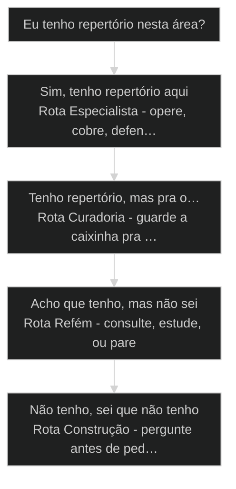
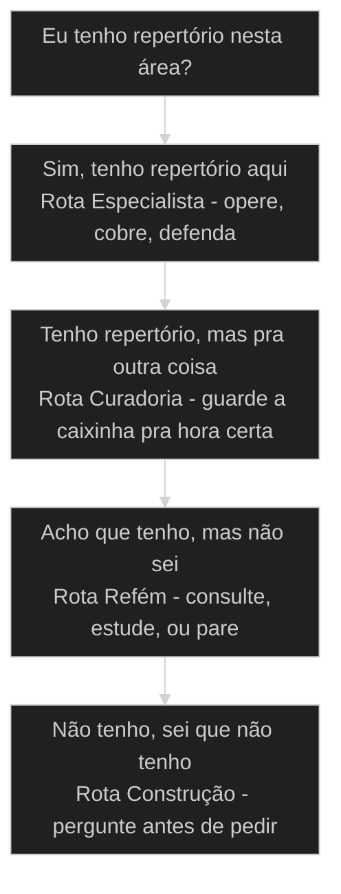

# Repertório vence técnica

← [[08-principio-processo-certo|Respeite o processo: dê comando, não converse]] · ↑ [[modulos/Módulo 0 - Mindset e Princípios|M0]] · ⌂ [[cursos/AIOX Advanced/README|Curso]] · → [[13-pensamento-estruturado-antes-do-terminal|Desenhe fora da ferramenta antes de codar]]

## Conceitos

- [[Repertório vs Técnica]]

## Mapa desta aula

Decisão-chave da aula — Eu tenho repertório nesta área?



> Leia o diagrama antes do texto longo. Depois volte e confira.

> Sem vocabulário, você é refém da IA. Repertório é a única base de autonomia que escala. Como nomear a sua caixinha, curar o que não vale aqui, e perguntar antes de pedir.

**Objetivos de aprendizagem:**
- Articular por que repertório é a base de autonomia, não capricho intelectual. _(understand)_
- Diferenciar repertório (especialidade) de pretensão (saber tudo). _(understand)_
- Classificar uma área pessoal em 3 caixinhas (vale aqui / vale em outro lugar / pretensão). _(analyze)_
- Aplicar a heurística 'perguntar antes de pedir' para construir repertório em área nova. _(apply)_

---

## [[Repertório vs Técnica|Repertório vence técnica]]

*Princípio · M0 Mindset · Por Alan Nicolas*

Repertório é a base não-negociável do operador AIOX. Sem ele, você é refém da IA, de outro humano, e do output que parece razoável mas é lixo.

- **4 aulas**: framings cross-cohort T1+T2
- **100%**: operadores sem repertório aceitam output sem cobrar
- **1 frase**: portão para passar a próxima aula

- **status**: aiox advanced
- **meta**: operador=alan_nicolas, modulo=m0
- **meta**: principio=repertorio-vs-tecnica
- **meta**: framings=alan/pedro/adriano
- **ready**: ready to name your box

**Legenda de cores**

Como ler os sinais visuais desta aula

- **Refém** (pain): operador sem repertório aceita o que IA entrega
- **Especialidade** (signal): a caixinha real do operador
- **Curadoria** (insight): saber quando o repertório vale e quando trava
- **ROI** (bench): valor monetário da especialidade hoje
- **Perguntar antes de pedir** (action): movimento concreto de aumentar repertório

---

## A frase âncora

Steven Bartlett (Diary of CEO) cunhou a frase que Alan adotou como tese deste módulo. A frase é simples, e quase ninguém leva a sério.

> **Tese da aula**: Se você não tem repertório, você é refém. Refém do que a IA te entrega. Refém do que outro humano te diz. Sem repertório, você não pega quando o output é lixo dressed up como ouro.

**Aspiração (frase bonita)**
- Quero ter mais repertório.
- Vou estudar mais.
- Tenho que saber de tudo.
- Algum dia eu chego lá.

**Mecanismo (regra operacional)**
- Hoje, minha caixinha é {especialidade}.
- Onde eu não tenho repertório, consulto, estudo ou paro de operar.
- Repertório de tudo é pretensão. Repertório de uma coisa é entrega.
- Pergunto à IA antes de pedir. Aumento o repertório dirigido.

> **Steven Bartlett, citado por Alan (aula-07 L167)**: Se você não tiver repertório, você é refém. Olha essa frase. O Steven me aplaudiria agora, porque ele fala muito sobre isso.

---

## Como ler esta aula

A aula segue 5 movimentos. Cada um responde uma pergunta concreta que aparece na cabeça do operador no momento certo.

**Os 5 movimentos da aula**

1. **Mapa**: Por que repertório é a base. Sem ele, todo o resto cai.
2. **Diagnóstico**: Como você descobre se tem repertório aqui, em outro lugar, ou se está pretendendo.
3. **Casos**: 4 histórias reais do Alan e do Pedro, cada uma com decisão visível.
4. **Técnica**: WHY / WHAT / HOW da curadoria de repertório.
5. **Adoção**: Como adotar, como praticar, e o portão pra próxima aula.

- **O que você vai treinar** (Articular por que repertório é a base de autonomia.; Diferenciar especialidade de onisciência.; Classificar uma área pessoal em 3 caixinhas.; Aplicar a heurística de perguntar antes de pedir.)
- **Onde você está no curso**: M0 Mindset, aula 3 de 5. Depois de [[Token Economy]] (M0.1) e Princípio do Processo Certo (M0.2). Antes de Pensamento Estruturado (M0.4) e Não Delegar o Pensar (M0.5).
- **Como estudar** (Lê os 5 movimentos em sequência. Não pula.; Faz o exercício de Auditoria (Adoção) antes de prosseguir.; Sai com 1 frase escrita nomeando a tua caixinha.)

**O ritmo da aula**

Cada movimento tem uma forma diferente de prender atenção. Saber o ritmo te ajuda a não saturar.

- 1 **Conceito denso**: Mapa, Técnica, Ferramental: aqui você processa modelo mental novo.
- 2 **Caso concreto**: Casos: aqui você vê o modelo aplicado em situação real do Alan e do Pedro.
- 3 **Decisão prática**: Adoção: aqui você decide, escreve, e move.

---

## O princípio sem jargão

Antes dos nomes técnicos, o princípio é só isto: você precisa de uma caixinha nomeada para operar sem virar refém.

> **Em uma frase**: Quem nomeia a caixinha entrega. Quem busca onisciência paralisa. Quem opera sem caixinha vira refém.

- **Refém não é insulto, é descrição operacional** -> É o operador que aceita o output da IA sem cobrar porque não tem como avaliar.
- **Repertório não é saber tudo** -> É ter uma caixinha nomeada de especialidade real. Pedro corrige Alan no T1 sobre isso.
- **Curadoria é o filtro do repertório** -> Repertório sem curadoria vira ruído. Você despeja tudo em todo prompt. [[Squad]] fica perdido.

**Pipeline mental: do refém ao operador**

1. **Refém**: Aceita output sem cobrar. Cita termos sem entender. Culpa a IA quando dá erro.
2. **Iniciante**: Reconhece que tem caixinha. Ainda não nomeou. Hesita em assumir especialidade.
3. **Operador**: Nomeia a caixinha em 1 frase. Cobra output dentro dela. Consulta fora dela.
4. **Curador**: Sabe separar repertório que vale aqui de repertório que vale em outro lugar.
5. **Mentor**: Constrói repertório novo perguntando à IA antes de pedir. Multiplica caixinhas.

**O que o princípio evita**
- Operar fora da caixinha sem consultar quem tem.
- Despejar repertório de uma área em prompt de outra área.
- Confundir onisciência aspiracional com especialidade real.
- Aceitar 'testei' como prova quando não tem repertório pra cobrar.

**O que ele força**
- Nomear a caixinha em 1 frase antes de operar.
- Separar repertório em caixinhas e usar a certa para cada contexto.
- Cobrar prova específica quando o output está dentro da caixinha.
- Consultar especialista quando o output está fora.

---

## Fluxograma de diagnóstico

Antes de operar em uma área, o operador roda este fluxograma na cabeça. Sem ele, ele opera no escuro.

**Árvore de decisão**
_Identifique o estado antes de operar._



- **Sim, tenho repertório aqui** — Você consegue defender o output da IA com argumento específico, não com vibe.
  → _Rota Especialista - opere, cobre, defenda_
  Ex.: Você é especialista em copy e a IA gerou copy. Você cobra estrutura, headline, hook.
- **Tenho repertório, mas pra outra coisa** — Você tem expertise real, mas não nesta área específica. Reconhece, não despeja.
  → _Rota Curadoria - guarde a caixinha pra hora certa_
  Ex.: Você é professor de música e cliente pediu modelo de negócio. Música não entra.
- **Acho que tenho, mas não sei** — Você opera por achismo. Não consegue cobrar prova específica do output.
  → _Rota Refém - consulte, estude, ou pare_
  Ex.: Você criou squad jurídico sem ser advogado. Output parece razoável. Mas razoável não basta.
- **Não tenho, sei que não tenho** — Honestidade brutal. Sabe que está em área nova.
  → _Rota Construção - pergunte antes de pedir_
  Ex.: Você quer entrar em design e nunca trabalhou com design system.

**Gate:** Qual é o gate? — _Sem diagnóstico, todo prompt vira aposta. Responda antes de operar: qual é a caixinha, qual é a prova de que vale aqui, qual é o plano se não vale._

> **Pausa para checagem**: Antes de qualquer comando AIOX em área nova, o operador deve conseguir responder: minha caixinha é {X}, esta tarefa está dentro/fora dela, plano se está fora é {Y}.

---

## As 3 caixinhas do operador

Todo operador tem 3 tipos de repertório acumulado. Saber qual é qual evita usar a caixinha errada na hora errada.

- **Caixinha A: repertório que vale aqui**: A especialidade real que se encaixa no contexto da task atual. Você usa direto, defende com argumento, cobra prova específica do output.
- **Caixinha B: repertório que vale em outro lugar**: Especialidade real mas fora do contexto atual. Você guarda, marca pra depois, não polui o prompt atual com ela.
- **Caixinha C: pretensão de repertório**: Achismo dressed up como conhecimento. Você reconhece, descarta a pretensão, e ou consulta especialista, ou estuda, ou para de operar nessa área.

**Funcionou se:**

- O operador consegue listar 3 áreas pessoais e classificar cada uma nas 3 caixinhas.
- O operador sabe diferenciar A de C (especialidade real vs pretensão) com critério explícito.

---

## Matriz de auto-diagnóstico

Crusando áreas de operação com status de repertório, o operador identifica onde está exposto e onde está coberto.

**Áreas × Status de repertório**

Para cada área da sua vida, qual caixinha tende a valer e o que fazer. A (vale aqui), B (vale em outro lugar), C (pretensão).

- **Sua área-mãe (5+ anos de carreira)**: Provável caixinha A. Você cobra output específico e pega quando a IA enrola.
- **Área adjacente (já trabalhou)**: Provável caixinha B. Guarde como apoio. Vira A só se você cobra output dela.
- **Área nova (nunca trabalhou)**: Default caixinha C. Detecte a pretensão, decida a rota antes de despejar no prompt.
- **Área pessoal (hobby antigo)**: Quase sempre B, nunca A. Cuidado: parece A e é C. Não despeje em business.

> **Armadilha do hobby antigo**: Hobby de anos parece caixinha A. Não é. É B. Música, fotografia, esporte, gaming: parecem especialidade. Não se encaixam em business como caixinha A. Despejar em prompt de business vira ruído.

---

## 4 casos reais cross-cohort

Cada caso mostra um operador aplicando o modelo. Alan e Pedro nas posições de protagonista. Os 4 casos cobrem as 4 rotas do fluxograma.

> **Adriano de Marqui (host T2, t2-aula-2 L2641)**: O que vocês acham para ter esse repertório? Primeiro, perguntar para IA quais são as formas. Quais são os meios. Você vai desenhar isso no Miro, no Figma, no papel. Aumenta o repertório antes de pedir.

### Caso: Squad jurídico do Alan

Quando o operador cria sistema em área onde não tem repertório, ele opera no escuro.

- Começou como: Squad jurídico funcionando. Output parecendo razoável.
- Virou: Squad operado por Alan, output validado por advogado real.
- Prova: Sem advogado no loop, Alan estaria lendo lixo achando que é ouro.
- Lição: Você pode criar squad fora da sua área. Não pode operar sozinho.

### Caso: Copy do time do Pedro

Quando a especialidade é focada, ela vale dinheiro hoje sem precisar de mais estrutura.

- Começou como: Profissional fazendo copy bem. Repertório focado, não amplo.
- Virou: Operador entregando valor em produto específico, sem buscar onisciência.
- Prova: Pedro reconhece: o repertório dele é copy. Não é o resto.
- Lição: Especialidade focada vale mais que repertório aspiracional amplo.

### Caso: Música do Alan (caixinha B)

Quando o repertório é real mas pra outra coisa, despejar no contexto errado vira ruído.

- Começou como: Alan tem repertório de música. Foi professor.
- Virou: Repertório guardado na caixinha B. Não vai pra prompt de business.
- Prova: Falar de escala pentatônica em extração de modelo de negócio não faz sentido.
- Lição: Repertório real fora do contexto é caixinha B. Não despeje.

### Caso: Design via referência (Alan)

Quando o operador entra em área nova, ele constrói repertório perguntando antes de pedir.

- Começou como: Alan precisa criar design novo. Não tem caixinha A em design.
- Virou: Operador construindo repertório dirigido via referência visual.
- Prova: Alan extrai [[DESIGN md|DESIGN.md]] de sites bonitos que ele navega. Aumenta o repertório antes de pedir.
- Lição: Caixinha C honesta vira caixinha A com método. Perguntar antes de pedir.

---

## Impacto medido das 4 rotas

Cada rota gera padrões diferentes de qualidade de output, tempo de retrabalho e custo de decisão errada.

**Colunas:** Rota | Qualidade output | Tempo retrabalho | Custo decisão errada

- Especialista (caixinha A): alta | baixo | controlado
- Curadoria (caixinha B): n/a | n/a | evitado
- Refém (pretensão C): ilusória | alto | invisível até estourar
- Construção (área nova): crescente | médio | limitado se método é seguido

- **Novato em rota Refém**: 60%
- **Novato em rota Especialista**: 25%
- **Maduro em rota Refém**: 10%
- **Maduro em rota Especialista**: 50%
- **Maduro em rota Construção dirigida**: 30%
- **Maduro em rota Curadoria**: 10%

---

## WHY / WHAT / HOW do repertório

As 3 camadas que sustentam a técnica. Pular qualquer camada quebra a aplicação.

- **1. WHY - Sem repertório, refém**: Operador sem caixinha aceita output sem cobrar. Não pega quando a IA enrola. Não sabe quando o output é lixo. Sai do controle estratégico do projeto. [REFÉM, fundamento]
- **2. WHAT - Especialidade, não onisciência**: Repertório real é caixinha focada. Você é bom em copy, em direito, em design, em uma coisa. Não em tudo. Nomear a caixinha em 1 frase é o primeiro movimento operacional. [CAIXINHA, especialidade]
- **3. HOW - Curadoria + perguntar antes de pedir**: Repertório sem curadoria vira ruído. Curadoria é saber separar em caixinhas: A (vale aqui), B (vale em outro lugar), C (pretensão). E construir caixinha nova perguntando à IA antes de pedir. [MÉTODO, curadoria]

---

## O ciclo da curadoria

4 passos que o operador roda na cabeça antes de operar em uma área.

**ciclo da curadoria de repertório**

1. **Identificar**: Você está entrando em uma área. Reconhece o contexto.
2. **Nomear**: Sua caixinha aqui é A, B ou C? Nomeia em 1 frase.
3. **Curar**: Se B: guarde. Se C: consulte, estude ou pare. Se A: opere e cobre.
4. **Aplicar**: Output dentro da caixinha é defensável. Output fora exige especialista no loop.

---

## Router: qual caminho tomar

Depois de diagnosticar a caixinha, o operador escolhe entre 3 caminhos operacionais.

#### Caminho 1: Consulta

#### Caminho 2: Estuda

#### Caminho 3: Para de operar

---

## Comandos da curadoria

Sequência operacional concreta para aplicar a curadoria em sessão real.

**Nomear a sua caixinha**
Use no início de qualquer projeto novo, ou ao revisar especialização atual.
- `definir`
- `limitar`
- `publicar`
- `definir`: Escreva 1 frase: 'meu repertório real é {especialidade}'.
- `limitar`: Diga também o que NÃO está na caixinha. Especialidade tem fronteira.
- `publicar`: Bota a frase no seu [[CLAUDE md|CLAUDE.md]] como instrutor. Agora o squad sabe a caixinha.

**Perguntar antes de pedir**
Use ao entrar em área onde sua caixinha é C ou nova.
- `pergunta`
- `desenha`
- `valida`
- `pede`
- `pergunta`: Pergunta à IA: quais são as formas de fazer X? Quais os meios?
- `desenha`: Desenha as opções no Miro, Figma ou papel.
- `valida`: Compara as opções. Pede prós e contras. Cria repertório dirigido.
- `pede`: Agora sim. Pede com referência específica. Output cobrável.

> **Não pule a pergunta**: Pedir antes de perguntar é o padrão refém. Pedir depois de perguntar é o padrão operador. A diferença é de 5 minutos de pergunta e 5 horas de retrabalho economizadas.

**Padrão Refém**
- Cria pra mim um sistema de autenticação.
- Faz uma landing pra mim.
- Resolve esse bug.
- Otimiza esse código.

**Padrão Operador**
- Quais são as formas de autenticação? Vamos mapear antes de escolher.
- Quais são os arquétipos de landing pra esse ICP? Compare 5 referências antes.
- Antes de resolver, descreva 3 hipóteses possíveis pro bug.
- Quais são os critérios de otimização que valem aqui? Performance, legibilidade, custo?

- **Perguntar antes de pedir, não depender da IA pra decidir**: Perguntar é o operador dirigindo a investigação: mapeia formas, compara, decide.
- **Construir repertório dirigido, não aceitar a opinião da IA como verdade**: Repertório dirigido: o operador acumula uma caixinha A nova, com referências curadas.
- **Pedir com referência específica, não pedir genérico e aceitar o que vier**: Output cobrável: você sabe avaliar contra um critério que trouxe.

---

## Pipeline validado: do diagnóstico à entrega

As 5 fases que o operador AIOX roda em projeto novo para garantir que repertório certo é aplicado.

**1. Diagnóstico da caixinha**
Antes de operar, classifica o projeto: cabe na minha caixinha A, B ou C? Documenta o resultado.
- **Output**: caixinha-classification.yaml
- **Gate**: Não opere sem classificação registrada.

**2. Plano de cobertura**
Se A: opere. Se B: marque pra outro contexto. Se C: define rota (consulta, estuda, ou para).
- **Output**: plano-rota.md
- **Gate**: Plano explícito antes de comando AIOX.

**3. Construção dirigida**
Se C, rota Construção: pergunta à IA primeiro. Acumula 5-10 referências dirigidas.
- **Output**: repertorio-dirigido/ (pasta com referências)
- **Gate**: Mínimo 5 referências antes de pedir produto.

**4. Validação por especialista**
Se output em área C: validador externo (humano com caixinha A real).
- **Output**: validation-log.md
- **Gate**: Sem validador, não vai pra produção.

**5. Promoção a caixinha A**
Se a área foi recorrente: promove de C/Construção pra A. Documenta o que aprendeu.
- **Output**: nova-caixinha-A.md
- **Gate**: Promoção exige 3+ projetos bem-sucedidos na área.

---

## Visualizações de impacto

Como repertório afeta qualidade, tempo e custo de operação. Cada gráfico cobre uma dimensão.

- **Operador refém (caixinha C silenciosa)**: 15%
- **Operador iniciante (caixinha A em formação)**: 45%
- **Operador operacional (caixinha A nomeada)**: 75%
- **Operador curador (3 caixinhas mapeadas)**: 90%

- **Operador refém**: 22h
- **Operador iniciante**: 14h
- **Operador operacional**: 6h
- **Operador curador**: 3h

- **Operador refém**: R$ 18.000
- **Operador iniciante**: R$ 8.000
- **Operador operacional**: R$ 3.000
- **Operador curador**: R$ 800

**Trade-off do tempo do operador**

Os 4 quadrantes de repertório × tempo disponível.

- **Pouco repertório + pouco tempo**: Refém crônico: aceita tudo, retrabalho gigante.
- **Pouco repertório + muito tempo**: Pretende caixinha A: achismo elaborado, decisões erradas com confiança.
- **Muito repertório + pouco tempo**: Operador eficiente: decisão rápida na caixinha A.
- **Muito repertório + muito tempo**: Curador estratégico: constrói caixinhas novas, multiplica capacidade.

---

## Estados e mecânicas do operador

O operador transita por 4 estados. Cada um tem mecânica diferente para sair pro próximo.

- **Refém**: Caixinha não nomeada. Aceita output. Culpa IA.
- **Iniciante**: Reconhece caixinha. Não nomeia ainda. Hesita.
- **Operador**: Caixinha nomeada. Cobra output. Consulta fora.
- **Curador**: 3 caixinhas mapeadas. Multiplica capacidade.

- **Refém para Iniciante**: Reconhece publicamente: 'não tenho repertório aqui'. Sai do achismo, diagnóstico honesto.
- **Iniciante para Operador**: Escreve 1 frase nomeando a caixinha. Compromisso explícito, cobrança vira possível.
- **Operador para Curador**: Mapeia 3 caixinhas (A, B, C) por área. Curadoria consciente, capacidade multiplica.
- **Curador para Mentor**: Constrói caixinhas novas por projeto. Operador vira gerador de caixinhas para o time.

---

## KPIs do operador maduro

Os indicadores objetivos que separam refém crônico de operador maduro.

**Colunas:** KPI | Refém | Operador | Curador

- Output defensável (%): 15% | 75% | 90%
- Retrabalho/semana (h): 22h | 6h | 3h
- Caixinhas mapeadas: 0 | 1 | 3+
- Validador externo no loop: Nunca | Em C | Sistematicamente
- Tempo de diagnóstico antes de operar: 0min | 5min | 15min

---

## Como adotar (e como não adotar)

A diferença entre quem adota o princípio e fica refém com vocabulário novo, e quem adota e vira operador maduro.

**Como NÃO adotar (refém com vocabulário novo)**
- Decora 'caixinha A, B, C' mas não escreve frase.
- Reconhece caixinha C de outros, nunca de si mesmo.
- Pula a etapa de perguntar antes de pedir.
- Promove caixinha sem 3+ projetos bem-sucedidos.
- Despeja repertório de hobby em prompts de business.

**Como adotar (operador maduro)**
- Escreve a frase. Bota no CLAUDE.md. Operacional.
- Detecta caixinha C própria primeiro. Honestidade brutal.
- Investe 5min em pergunta antes de 5h em retrabalho.
- Promove caixinha por evidência repetida.
- Mantém hobby na caixinha B. Limpa prompts de business.

---

## Prática S2S: converter a aula em ação verificável

Um portão explícito para provar que Repertório vence técnica virou comportamento, não só leitura.

**Ficha S2S da aula**
```yaml
aula: "Repertório vence técnica"
task_real: "{qual task pequena vou usar}"
sinal: "{o que a aula me ensinou a enxergar}"
rota: "{entender | aplicar | revisar}"
prova: "{antes/depois, checklist ou aceite}"

```

> **Portão da aula**: Você só conclui esta aula quando consegue mostrar uma task real, o sinal observado, a rota escolhida e a prova mínima de avanço.

- 1. **Escolha uma task**: Pegue uma tarefa real e pequena onde o princípio desta aula se aplica.
- 2. **Nomeie o sinal**: Escreva qual sinal da aula apareceu na task.
- 3. **Escolha a rota**: Decida se o próximo passo é entender, aplicar ou revisar.
- 4. **Produza prova**: Feche com antes/depois, checklist ou critério de aceite preenchido.

---

## Auditoria do seu repertório

Exercício de 12 minutos. Sai dele com 1 frase escrita nomeando a tua caixinha A. Sem isso, não passa pra próxima aula.

**Template do prompt: perguntar antes de pedir**
```text
# Use este template ANTES de pedir produto em área onde sua caixinha é C ou nova.

Quais são as formas conhecidas de {tarefa}?
Para cada forma:
  - Quando faz sentido usar
  - Quando NÃO faz sentido
  - Que repertório prévio assume do operador

Não me dê código ainda. Me dê o mapa.

```

**Exemplo preenchido: operador entrando em design**

- **Tarefa**: Construir landing page de produto novo
- **Caixinha atual do operador**: Caixinha A em copy. Caixinha C em design visual.
- **Prompt antes de pedir**: Quais são os arquétipos de landing pra produto SaaS B2B? Para cada arquétipo, contexto onde funciona, contexto onde quebra, e referências reais de quem usa bem?
- **Output esperado**: Mapa de 5-7 arquétipos com prós/contras e exemplos.
- **Próximo passo**: Estuda 3 dos arquétipos. Escolhe 1. Aí pede construção com referência específica.
- **Tempo investido**: 20min de pergunta + 40min de estudo = 1h. Economiza ~8h de retrabalho.

> **Adriano de Marqui (t2-aula-2 L2641)**: O que vocês acham para ter esse repertório? Primeiro, perguntar para IA quais são as formas. Você vai desenhar isso no Miro, no Figma, no papel.

- 1. **Nomeie a tua caixinha A em 1 frase**: Escreva: 'meu repertório real é {especialidade}'. Não 2 frases. Não disclaimer. Se não consegue escrever, é porque ainda não nomeou. Pare aqui até nomear.
- 2. **Liste 3 áreas em caixinha C**: Pense nas últimas 4 semanas. Onde você delegou pra IA sem ter como avaliar o output? Anota 3 áreas concretas, não 'em geral'.
- 3. **Para cada área C, escolha rota**: Consulta (especialista no loop), Estuda (30 dias antes de operar), ou Para (delega, contrata ou pula). Não tem 4ª opção honesta.
- 4. **Aplique perguntar antes de pedir em 1 caso**: Para a área onde escolheu 'estuda', use o template do code_block acima. Pergunta hoje. Desenha amanhã. Pede só depois.
- 5. **Portão da aula**: Volta aqui depois de fazer os passos 1-4. Confirma: tua caixinha A está nomeada por escrito? Suas 3 áreas C estão classificadas? Aí passa pra M0.4.

---

## Glossário do princípio

Os termos centrais com definição operacional. Use como referência rápida em sessões futuras.

- **Repertório**: Especialidade focada do operador. Não onisciência. Nomeada em 1 frase.
- **Caixinha A**: Repertório que vale na tarefa atual. Você opera, cobra, defende.
- **Caixinha B**: Repertório real mas fora do contexto atual. Você guarda, não despeja.
- **Caixinha C**: Pretensão de repertório. Achismo. Você reconhece e ou consulta, ou estuda, ou para.
- **Refém**: Operador sem caixinha nomeada. Aceita output. Não cobra. Vira culpado do erro da IA.
- **Curadoria**: Ato de separar repertório em 3 caixinhas e usar a certa em cada contexto.
- **Perguntar antes de pedir**: Método do Adriano (T2). Em área nova, peça mapa antes de produto. Economiza 5h pra cada 5min investidos.
- **Construção dirigida**: Acumular 5-10 referências antes de pedir produto. Caixinha C vira caminho pra caixinha A.
- **Validador externo**: Humano com caixinha A real no loop. Obrigatório quando operador opera fora da própria caixinha.
- **Promoção a caixinha A**: Reconhecer que após 3+ projetos bem-sucedidos numa área, ela virou caixinha A real.

> **Portão da aula**: Você só passa para M0.4 (Pensamento Estruturado Antes do Terminal) quando consegue nomear a tua caixinha A em 1 frase escrita. Sem caixinha nomeada, M0.4 não vai colar.

***


---

## Navegação

← [[08-principio-processo-certo|Respeite o processo: dê comando, não converse]] · ↑ [[modulos/Módulo 0 - Mindset e Princípios|M0]] · ⌂ [[cursos/AIOX Advanced/README|Curso]] · → [[13-pensamento-estruturado-antes-do-terminal|Desenhe fora da ferramenta antes de codar]]
